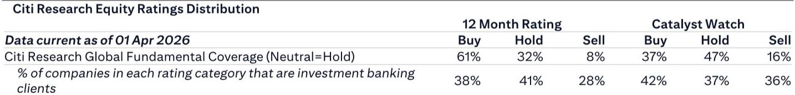

# The LFP Cathode Bottleneck Is Not About Lithium. It Is About Iron Phosphate.

The conventional narrative around battery materials has focused on lithium scarcity, lithium price volatility, and the race for new lithium supply. That narrative is becoming dangerously incomplete. According to insights from a recent industry conference discussion with a leading consulting firm, the most constrained link in the lithium iron phosphate (LFP) battery supply chain in 2026 is not lithium carbonate. It is iron phosphate (FePO4), the precursor material for the dominant LFP cathode production route. This distinction matters because it shifts where investors and strategists should look for pricing power, margin expansion, and competitive advantage. The battery industry is not facing a lithium cliff. It is facing an iron phosphate bottleneck.

The implications are immediate and structural. FePO4 is expected to face a supply shortage in 2026, driven by limited capacity additions and long lead times for new plants. The consulting firm projects a further price increase of RMB 2,000 to 3,000 per ton for FePO4, on top of already elevated levels. This is not a temporary spike. It is a function of capital expenditure requirements of RMB 5,000 to 8,000 per ton and construction timelines of six to nine months, meaning that any capacity brought online in late 2026 will barely contribute to output within the year. The result is a market where those who control FePO4 supply, or who have developed technology routes that bypass it, will capture disproportionate value.

This report is not merely a summary of a conference call. It is an argument for why the LFP cathode processing fee cycle has more room to run, why the fourth-generation LFP cathode market is a protected profit pool, and why the energy storage segment is the real growth engine that most observers are underestimating. Let us walk through the logic step by step, and then examine what the report does not yet answer.

## The FePO4 Supply Crunch Makes LFP Cathode Processing Fees a Structural Margin Story, Not a Cyclical One

When analysts discuss LFP cathode margins, they often default to a commodity framing: processing fees rise and fall with overall battery demand, and competition among cathode producers compresses spreads over time. The FePO4 dynamics revealed in this conference discussion challenge that framing. The processing fee for LFP cathode is not primarily a function of cathode supply and demand. It is a function of FePO4 pricing, because FePO4 is the major raw material input for the dominant technology route. If FePO4 prices rise, cathode processing fees must rise to pass through the cost, or producers with integrated FePO4 supply capture the spread.

The key insight is that FePO4 capacity is not being added at a pace that matches LFP cathode demand growth. The consulting firm notes that there could be some FePO4 capacity additions in the fourth quarter of 2026, but the output contribution will be limited due to the approximately three-month commissioning and ramp-up period. This means that for most of 2026, the FePO4 market will remain tight. The price hike of RMB 2,000 to 3,000 per ton is not a forecast of a temporary imbalance; it is a forecast of a sustained shortage that will persist until meaningful new capacity is operational, which will not be until 2027 at the earliest.

The strategic implication is clear: companies that have vertically integrated FePO4 production, or that use technology routes that do not require FePO4, will enjoy a structural cost advantage. They will be able to offer competitive cathode pricing while maintaining margins, or they can hold pricing steady and capture the windfall as processing fees rise. For investors, the question is not whether LFP cathode margins will compress. The question is which producers are insulated from the FePO4 squeeze.

## Fourth-Generation LFP Cathode Is a High-Barrier Profit Sanctuary, While Third-Generation Margins Remain Under Pressure

The LFP cathode market is not a monolith. The consulting firm draws a sharp distinction between third-generation and fourth-generation LFP cathode. Fourth-generation LFP cathode enjoys higher profit margins due to technology barriers and strong demand, while third-generation profit remains low. This is a critical nuance that many top-down analyses miss. The industry is bifurcating, and the bifurcation is driven by customer concentration and technical complexity.

CATL remains the major client for fourth-generation LFP cathodes. There are only three to four LFP cathode producers capable of mass-producing fourth-generation material. This is a concentrated supplier base facing a concentrated buyer. In theory, that could lead to buyer power squeezing supplier margins. In practice, the technology barriers are high enough that CATL needs these suppliers as much as they need CATL. The result is a pricing equilibrium that sustains healthy margins for the few qualified producers.

Third-generation LFP cathode, by contrast, is far more commoditized. More producers can make it, competition is fiercer, and buyers have more leverage. The consulting firm expects third-generation profit to remain low. This means that the average margin for the LFP cathode industry is a misleading metric. The real action is in the fourth-generation segment, where barriers to entry protect profitability. Any strategy that treats all LFP cathode as interchangeable is missing the most important structural trend in the market.

## The Energy Storage Segment Is the Dominant Growth Driver, and It Changes the Demand Calculus for Cathode Materials

The global battery shipment forecast from the consulting firm provides a revealing picture. For 2026, total global battery shipment is expected at 3,100 to 3,200 GWh, comprising 1,100 GWh of energy storage system (ESS) battery shipment and 1,700 to 1,800 GWh of EV battery shipment. For 2027, total battery shipment is expected to grow over 20% year on year, but the composition is starkly different: ESS battery shipment is expected to increase approximately 50% year on year, while EV battery shipment increases only around 10% year on year.

This is a structural shift. ESS is becoming the marginal demand driver for battery materials. The growth rate of ESS is five times that of EV. For cathode producers, this changes customer diversification, product mix, and pricing dynamics. ESS applications typically have different performance requirements than EV applications, and they may be less sensitive to certain cost inputs. The rapid growth of ESS also means that any supply constraint in FePO4 or LFP cathode will be felt most acutely in the ESS segment, which is growing faster than the market can currently absorb.

The implication for strategists is that the battery materials supply chain must be analyzed through a dual-lens: EV demand provides the base, but ESS demand provides the growth. Companies that can serve both segments effectively, and that can secure raw material supply for the ESS ramp, will have a significant advantage. Those that are over-indexed to EV may find themselves with excess capacity relative to demand growth.

## Lithium Is Balanced for Now, but the Peak Season Creates a Conditional Upside Risk That the Report Does Not Fully Resolve

The consulting firm assesses that lithium demand is currently in an off-peak season, and monthly supply and demand is largely balanced. However, they also note that if demand remains strong despite rising lithium price, the lithium price could further increase entering the peak season in August 2026. This is a conditional forecast that leaves important questions open.

What would cause demand to remain strong in the face of rising lithium prices? The most plausible mechanism is that downstream battery and cathode demand is inelastic in the near term, especially if ESS demand accelerates faster than expected. If battery producers cannot easily switch chemistries or reduce lithium content per cell, they will absorb higher lithium costs and pass them through. That would create a self-reinforcing cycle: rising lithium prices signal strong demand, which encourages further price increases, which tests the elasticity of end demand.

The report does not provide a clear answer on where the lithium price ceiling lies. It does not model the impact of lithium price increases on LFP cathode processing fees or on the competitiveness of LFP versus other chemistries. It also does not address whether sodium-ion batteries, which the consulting firm views as not yet cost-competitive, could become a viable alternative if lithium prices spike. These are the open questions that make the full report worth reading. The conditional nature of the lithium outlook means that investors need to monitor the August peak season closely, but they also need a framework for what happens if the peak season exceeds expectations.

## A Decision Framework for Navigating the Battery Materials Supply Chain in 2026

For readers who need to translate these insights into actionable strategy, the following framework emerges from the analysis. It is not a checklist. It is a set of interconnected questions that should guide capital allocation, supply chain management, and investment positioning.

First, assess FePO4 exposure. Every participant in the LFP cathode value chain should evaluate whether they have captive FePO4 supply, a long-term contract with a FePO4 producer, or a technology route that bypasses FePO4 entirely. Those with captive supply have a structural margin advantage. Those without it are exposed to the RMB 2,000 to 3,000 per ton price hike and should hedge accordingly.

Second, evaluate cathode generation positioning. Companies that can produce fourth-generation LFP cathode for CATL or other major customers are in a protected profit pool. Companies that are stuck in third-generation production face margin compression. The strategic move is to invest in the technology and qualification processes needed to enter the fourth-generation market, or to accept that LFP cathode will be a low-margin commodity business.

Third, weight ESS exposure heavily. The 50% year-on-year growth in ESS battery shipment for 2027 is the most powerful demand signal in the entire report. Companies that have ESS customers, ESS-specific product lines, or ESS-dedicated capacity will see volume growth that outpaces the EV market. Those that are pure-play EV suppliers may find themselves with excess capacity and pricing pressure.

Fourth, monitor lithium price dynamics conditionally. The lithium market is balanced now, but the August peak season is a key inflection point. If lithium prices rise significantly, it will test the elasticity of downstream demand and may shift the competitive dynamics between LFP and other chemistries. The prudent approach is to prepare for a scenario where lithium prices rise 20% to 30% from current levels and to evaluate what that means for portfolio margins.

## The Full Report Contains the Charts and Data That Make These Arguments Actionable

The analysis presented here is based on the key takeaways from a conference discussion, but the full report includes the original charts, data tables, and detailed forecasts that underpin these conclusions. The FePO4 supply-demand balance, the LFP cathode processing fee trajectory, the battery shipment breakdown by segment, and the lithium price outlook are all quantified in the original document. These are not qualitative opinions. They are data-driven projections from a consulting firm with deep industry expertise.

To make informed decisions about battery materials exposure, supply chain strategy, or investment positioning, you need to see the numbers yourself. The charts reveal the magnitude of the FePO4 shortage. The data show the exact capacity addition timelines. The forecasts clarify the growth differential between ESS and EV.

Join the community to read the full report and review the original charts.

*This article is for learning and discussion only and does not constitute investment advice.*

Personal reading notes and learning share only. Not investment advice.

