MUTUAL FUNDAMENTALS

# Funds widen tilt to Semis over Software

Mutual Fundamentals analyzes the quarter-end positioning of 509 large-cap active mutual funds with a combined \$3.9 trillion in equity assets.

1. PERFORMANCE AND FLOWS: 29% of large-cap mutual funds are outperforming their benchmarks YTD, below the historical average of 37%. Mutual funds have delivered positive returns in absolute terms but have struggled to keep pace with rising benchmarks. Funds have increased their cash positions YTD, but cash balances remain low versus history. Inflows to US equity mutual funds and ETFs have accelerated YTD, totaling \$166 billion.

# 2. THEMES IN FOCUS:

(1) AI: Mutual funds continued to rotate out of Software and added to Semis during Q1. Excluding the mega-caps, the average large-cap mutual fund lifted their Semis overweight by 25 bp to +49 bp. Six of the 20 most popular mutual fund increases were constituents of the GS AI Data Centers basket (GSTMTDAT). Funds increased the magnitude of their underweight in Software ex. MSFT by 12 bp to -36 bp and now carry their lowest exposure since at least 2012. Exhibit 10 shows the 10 Software stocks where the average large-cap mutual fund was the most overweight at the start of Q2.

(2) Magnificent 7: Large-cap mutual funds were 723 bp underweight the Mag 7 as of Q1 2026 (vs. 710 bp underweight as of Q4 2025). Diversification restrictions continue to play a role in these mutual fund tilts. However, on a net shares basis, mutual funds reduced ownership in each of the Mag 7, with the largest reduction in GOOGL.

(3) IPOs: US equity mutual funds increased their cash balances ahead of each of the four largest IPOs during the past few decades. However, we see no evidence of elevated selling pressure on the largest stocks ahead of past major IPOs. For passive funds, potential index inclusion of large IPOs could place mechanical selling pressure on existing holdings, but fast-tracked large IPOs would likely carry small weights in the major benchmark US indices at first.

3. SECTORS: The magnitude of changes across mutual fund sector tilts in Q1 ranked in just the 4th percentile since 2012 on average. Funds were most overweight Industrials (+197 bp) and Financials (+190 bp). However, Financials stocks represented 9 of the 20 most popular fund decreases. Funds remained most underweight the Info Tech sector (-478 bp). Current tilts to Industrials, Health Care, and Energy all ranked at or near their 10-year highs.

# Ryan Hammond

+1(212)902-5625

ryan.hammond@gs.com

GS & Co. LLC

# Daniel Chavez

+1(212)357-7657

daniel.chavez@gs.com

GS & Co. LLC

# Ben Snider

+1(212)357-1744 | ben.snider@gs.com

GS & Co. LLC

# Jenny Ma

+1(212)357-5775 | jenny.ma@gs.com

GS & Co. LLC

# Kartik Jayachandran

+1(212)855-7744

kartik.jayachandran@gs.com

GS & Co. LLC

# Christophe Sung

+1(212)902-3841

christophe.sung@gs.com

GS & Co. LLC

Table of Contents 

<table><tr><td>Performance and flows</td><td>4</td></tr><tr><td>Themes in focus: AI, Magnificent 7, IPOs</td><td>6</td></tr><tr><td>Sector positioning</td><td>11</td></tr><tr><td>Stock positioning</td><td>13</td></tr><tr><td>Appendix</td><td>18</td></tr><tr><td>Disclosure Appendix</td><td>19</td></tr></table>

4. STOCKS: YTD the largest mutual fund overweights (GSTHMFOW) have underperformed the equal-weight S&P 500 (-3% vs. +6%) and the largest underweights (GSTHMFUW, +14%). We rebalance the baskets in this report. There are 16 new constituents in GSTHMFOW and 6 new constituents in GSTHMFUW (see Exhibit 23 and Exhibit 24).

# Performance and flows

29% of large-cap mutual funds are outperforming their benchmarks YTD, below this historical average of 37%. 50% of large-cap growth funds are outperforming their benchmarks compared with 25% of core funds and just 13% of value funds.

Exhibit 1: 29% of large-cap mutual funds are outperforming their benchmarks   
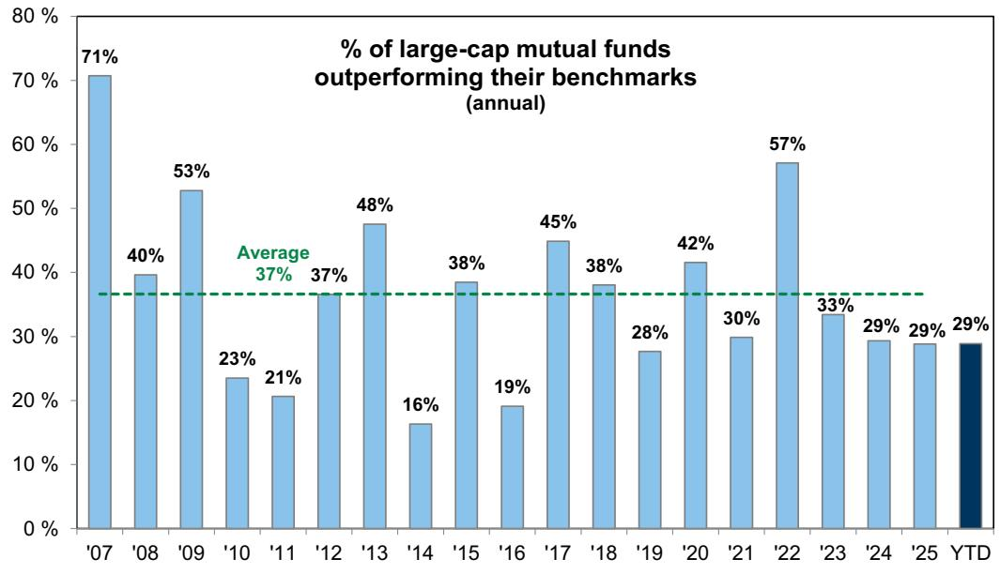

bar

| Year | % of large-cap mutual funds outperforming their benchmarks (annual) |
| ---- | ------------------------------------------------------------------ |
| '07  | 71%                                                              |
| '08  | 40%                                                              |
| '09  | 53%                                                              |
| '10  | 23%                                                              |
| '11  | 21%                                                              |
| '12  | 37%                                                              |
| '13  | 48%                                                              |
| '14  | 16%                                                              |
| '15  | 38%                                                              |
| '16  | 19%                                                              |
| '17  | 45%                                                              |
| '18  | 38%                                                              |
| '19  | 28%                                                              |
| '20  | 42%                                                              |
| '21  | 30%                                                              |
| '22  | 57%                                                              |
| '23  | 33%                                                              |
| '24  | 29%                                                              |
| '25  | 29%                                                              |
| YTD  | 29%                                                              |

Source: GS Global Investment Research

Exhibit 2: Large-cap Growth managers have performed best on a relative basis YTD 

<table><tr><td rowspan="2">Fund type</td><td rowspan="2">Benchmark</td><td rowspan="2">Benchmark return</td><td rowspan="2">Average fund return</td><td colspan="2">% of funds outperforming benchmark</td></tr><tr><td>YTD 2026</td><td>Historical average</td></tr><tr><td>Large-Cap Core</td><td>S&amp;P 500</td><td>8.7 %</td><td>6.7 %</td><td>25%</td><td>32%</td></tr><tr><td>Large-Cap Growth</td><td>Russell 1000 Growth</td><td>5.3</td><td>5.2</td><td>50</td><td>34</td></tr><tr><td>Large-Cap Value</td><td>Russell 1000 Value</td><td>10.9</td><td>6.7</td><td>13</td><td>46</td></tr><tr><td>Total Large-Cap</td><td></td><td></td><td></td><td>29</td><td>37</td></tr></table>

Source: GS Global Investment Research

Mutual fund cash balances have risen YTD alongside higher geopolitical uncertainty. Mutual fund cash balances registered 1.4% of assets at the end of March. Cash balances as a share of assets remain low relative to history, however.

Exhibit 3: Mutual fund cash balances have risen YTD as of March 31, 2026   
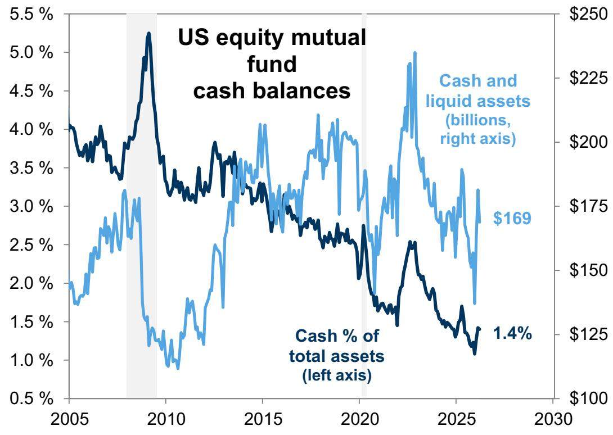

line

| Year | Cash % of total assets (left axis) | Cash and liquid assets (billions, right axis) |
|------|-------------------------------------|-----------------------------------------------|
| 2026 | 1.4%                                | $169                                          |

Source: ICI, GS Global Investment Research

Inflows to US equity mutual funds and ETFs have accelerated in recent weeks (Exhibit 4). There have been \$166 billion in inflows to US equity funds YTD. Within that universe, the shift from active to passive funds has continued, with active ETFs the notable exception. US equity active ETFs have garnered \$95 billion of inflows YTD (Exhibit 5).

Exhibit 4: US equity fund inflows have accelerated recently weekly data as of May 13, 2026   
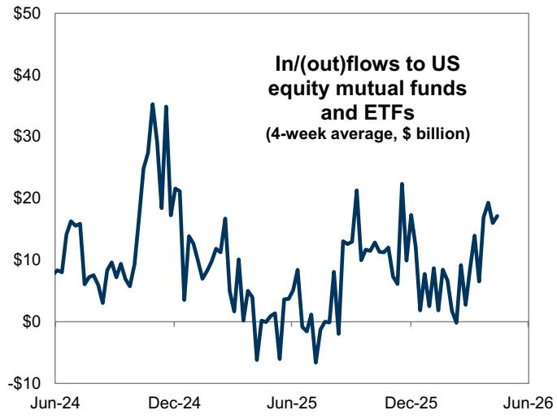

line

| Date   | In/(out)flows to US equity mutual funds and ETFs (4-week average, $ billion) |
|--------|--------------------------------------------------------------------------|
| Jun-24 | ~$15                                                                      |
| Dec-24 | ~$35                                                                      |
| Jun-25 | ~-$5                                                                      |
| Dec-25 | ~$22                                                                      |
| Jun-26 | ~$18                                                                      |

Source: EPFR, GS Global Investment Research

Exhibit 5: YTD US equity mutual fund and ETF flows weekly data as of May 13, 2026   
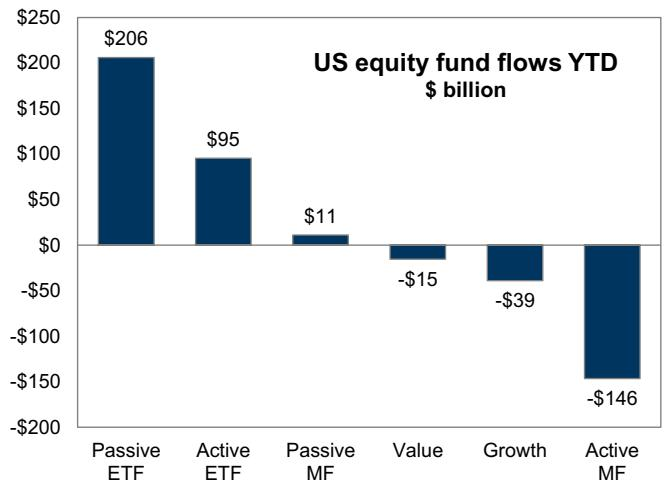

bar

US equity fund flows YTD $ billion
| Category | Value ($ billion) |
| :--- | :--- |
| Passive ETF | 206 |
| Active ETF | 95 |
| Passive MF | 11 |
| Value | -15 |
| Growth | -39 |
| Active MF | -146 |

Source: EPFR, GS Global Investment Research

# Themes in focus: AI, Magnificent 7, IPOs

AI: Mutual funds added to Semis and reduced exposure to Software. The outperformance of Semis versus Software has intensified YTD driven by upgrades to the hyperscaler capex outlook contrasted with concerns about AI disruption. Mutual funds leaned into this theme in the Q1. Excluding the mega-caps, the average large-cap mutual fund lifted their Semis overweight by 25 bp to +49 bp and increased the magnitude of their Software underweight by 12 bp to -36 bp.

Exhibit 6: Mutual funds added in Semis, cut in Software excludes AAPL, AVGO, MSFT, NVDA   
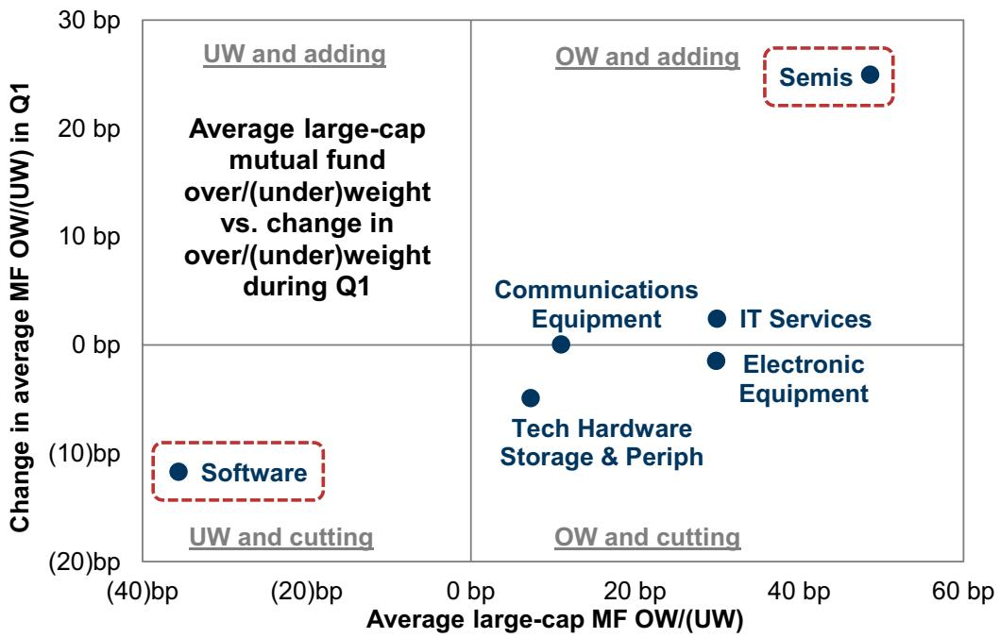

scatter

| Category                  | Average large-cap MF OW/(UW) | Change in average MF OW/(UW) in Q1 |
| ------------------------- | ---------------------------- | ----------------------------------- |
| Software                  | -40 bp                       | -10 bp                              |
| IT Services               | 30 bp                        | 2 bp                                |
| Electronics Equipment     | 30 bp                        | -5 bp                               |
| Communications           | 10 bp                        | 0 bp                                |
| Tech Hardware Storage & Periph | 10 bp                      | -5 bp                               |
| Semis                     | 50 bp                        | 25 bp                               |

Source: FactSet, GS Global Investment Research

Two Semis stocks ranked among the top 20 most popular mutual fund increases in Q1. Outside of Semis, four stocks from the GS AI Data Center basket (GSTMTDAT) basket also ranked in the top 20: ANET, GLW, SNDK, and COHR. However, the strong performance of some of these stocks meant that mutual funds struggled to keep pace with rising benchmark weights. SNDK and GLW are new constituents of our Most Underweight basket (GSTHMFUW).

Excluding the mega-caps, the mutual fund tilt in Semis vs. Software is now the widest since at least 2012. Mutual funds carry their lowest exposure to Software since at least 2012, while the mutual fund overweight in Semis remains modestly below the peaks reached in Q1 2023 and Q2 2024.

Exhibit 7: Mutual fund tilt in Semis vs. Software ex-mega caps is largest since 2012   
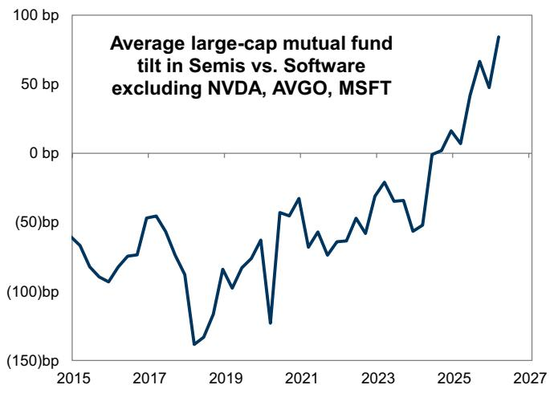

line

| Year | Average large-cap mutual fund tilt (bp) |
|------|----------------------------------------|
| 2015 | -50                                    |
| 2016 | -100                                   |
| 2017 | -50                                    |
| 2018 | -150                                   |
| 2019 | -100                                   |
| 2020 | -50                                    |
| 2021 | 0                                      |
| 2022 | 50                                     |
| 2023 | 0                                      |
| 2024 | 50                                     |
| 2025 | 100                                    |
| 2026 | 50                                     |
| 2027 | 100                                    |

Source: GS Global Investment Research

Exhibit 8: Lowest mutual fund exposure to Software ex-MSFT since 2012   
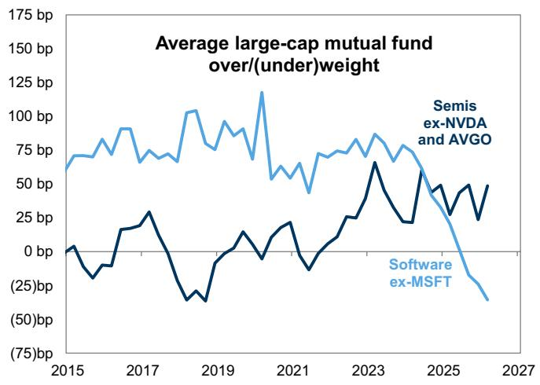

line

| Year | Semis ex-NVDA and AVGO | Software ex-MSFT |
|------|------------------------|------------------|
| 2015 | ~75 bp                | ~0 bp            |
| 2016 | ~80 bp                | ~-25 bp          |
| 2017 | ~90 bp                | ~30 bp           |
| 2018 | ~75 bp                | ~-40 bp          |
| 2019 | ~100 bp               | ~-30 bp          |
| 2020 | ~125 bp               | ~-10 bp          |
| 2021 | ~60 bp                | ~25 bp           |
| 2022 | ~75 bp                | ~-10 bp          |
| 2023 | ~85 bp                | ~60 bp           |
| 2024 | ~75 bp                | ~30 bp           |
| 2025 | ~50 bp                | ~-25 bp          |
| 2026 | ~40 bp                | ~-50 bp          |
| 2027 | ~30 bp                | ~-75 bp          |

Source: GS Global Investment Research

We highlight the most overweight Software stocks and most underweight Semis stocks as of Q1 2026. These stocks represent potential opportunities for buying and selling if the trade continues. We use a universe of Russell 1000 stocks and exclude the mega-caps from these screens (AVGO, NVDA, MSFT).

Exhibit 9: Shared mutual fund Semis underweights 

<table><tr><td rowspan="2">Company name</td><td rowspan="2">Ticker</td><td rowspan="2">YTD return</td><td rowspan="2">Mkt cap ($ billion)</td><td colspan="2">Blended weight</td><td rowspan="2">UNDER weight</td></tr><tr><td>Average fund</td><td>Benchmark</td></tr><tr><td>Advanced Micro Devices, Inc.</td><td>AMD</td><td>97 %</td><td>686</td><td>0.3 %</td><td>0.6 %</td><td>(33)bp</td></tr><tr><td>Micron Technology, Inc.</td><td>MU</td><td>139</td><td>769</td><td>0.3</td><td>0.6</td><td>(30)</td></tr><tr><td>Intel Corporation</td><td>INTC</td><td>193</td><td>544</td><td>0.2</td><td>0.3</td><td>(18)</td></tr><tr><td>Applied Materials, Inc.</td><td>AMAT</td><td>61</td><td>328</td><td>0.3</td><td>0.5</td><td>(13)</td></tr><tr><td>Lam Research Corporation</td><td>LRCX</td><td>63</td><td>348</td><td>0.4</td><td>0.5</td><td>(5)</td></tr><tr><td>Teradyne, Inc.</td><td>TER</td><td>66</td><td>50</td><td>0.0</td><td>0.1</td><td>(3)</td></tr><tr><td>First Solar, Inc.</td><td>FSLR</td><td>(11)</td><td>25</td><td>0.0</td><td>0.0</td><td>(2)</td></tr><tr><td>ON Semiconductor Corporation</td><td>ON</td><td>102</td><td>43</td><td>0.0</td><td>0.0</td><td>(2)</td></tr><tr><td>KLA Corporation</td><td>KLAC</td><td>45</td><td>229</td><td>0.3</td><td>0.3</td><td>(1)</td></tr><tr><td>QUALCOMM Incorporated</td><td>QCOM</td><td>20</td><td>215</td><td>0.2</td><td>0.2</td><td>(1)</td></tr></table>

Source: GS Global Investment Research

Exhibit 10: Shared mutual fund Software overweights 

<table><tr><td rowspan="2">Company name</td><td rowspan="2">Ticker</td><td rowspan="2">YTD return</td><td rowspan="2">Mkt cap ($ billion)</td><td colspan="2">Blended weight</td><td rowspan="2">OVER weight</td></tr><tr><td>Average fund</td><td>Benchmark</td></tr><tr><td>Cadence Design Systems, Inc.</td><td>CDNS</td><td>11 %</td><td>95</td><td>0.2 %</td><td>0.1 %</td><td>6 bp</td></tr><tr><td>Intuit Inc.</td><td>INTU</td><td>(39)</td><td>111</td><td>0.3</td><td>0.2</td><td>4</td></tr><tr><td>Gen Digital Inc.</td><td>GEN</td><td>(10)</td><td>15</td><td>0.1</td><td>0.0</td><td>4</td></tr><tr><td>Roper Technologies, Inc.</td><td>ROP</td><td>(25)</td><td>33</td><td>0.1</td><td>0.1</td><td>3</td></tr><tr><td>ServiceNow, Inc.</td><td>NOW</td><td>(32)</td><td>107</td><td>0.2</td><td>0.2</td><td>3</td></tr><tr><td>Samsara, Inc.</td><td>IOT</td><td>(14)</td><td>18</td><td>0.0</td><td>0.0</td><td>3</td></tr><tr><td>Autodesk, Inc.</td><td>ADSK</td><td>(18)</td><td>51</td><td>0.1</td><td>0.1</td><td>3</td></tr><tr><td>Dropbox, Inc.</td><td>DBX</td><td>1</td><td>6</td><td>0.0</td><td>0.0</td><td>2</td></tr><tr><td>Fair Isaac Corporation</td><td>FICO</td><td>(30)</td><td>27</td><td>0.1</td><td>0.0</td><td>2</td></tr><tr><td>Pegasystems Inc.</td><td>PEGA</td><td>(43)</td><td>6</td><td>0.0</td><td>0.0</td><td>1</td></tr></table>

Source: GS Global Investment Research

Magnificent 7: Large-cap mutual funds were 723 bp underweight the Magnificent 7 in Q1 2026. In aggregate, mutual funds were 710 bp underweight the group last quarter. As we have previously discussed, part of the underweight in the Mag 7 stems from

diversification restrictions.

Exhibit 11: Mutual funds were 723 bp underweight the Mag 7   
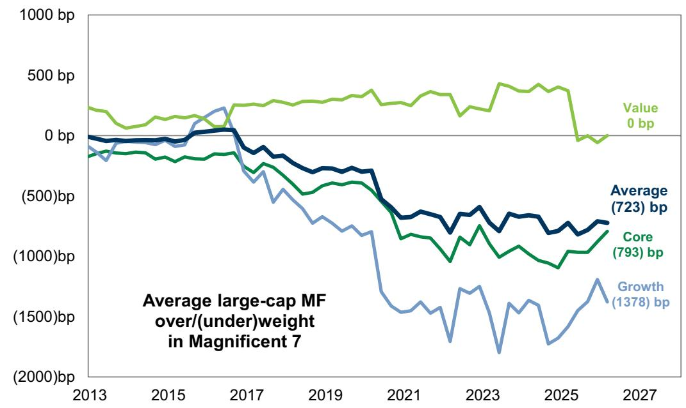

line

| Year | Value (bp) | Average (bp) | Core (bp) | Growth (bp) |
|------|------------|--------------|-----------|-------------|
| 2013 | ~200       | ~0           | ~-100     | ~-200       |
| 2015 | ~100       | ~-100        | ~-150     | ~-100       |
| 2017 | ~250       | ~-500        | ~-300     | ~-400       |
| 2019 | ~300       | ~-600        | ~-400     | ~-600       |
| 2021 | ~350       | ~-700        | ~-500     | ~-1500      |
| 2023 | ~400       | ~-800        | ~-600     | ~-1800      |
| 2025 | ~450       | ~-900        | ~-700     | ~-1378      |
| 2027 | 0          | 723          | 793       | —           |

Source: FactSet, GS Global Investment Research

There has been wide dispersion in Mag 7 performance YTD. The average large-cap mutual fund is underweight each of the Mag 7. AAPL, NVDA, GOOGL and AMZN have outperformed YTD, while MSFT, TSLA, and META have underperformed.

Exhibit 12: Core, growth, and value fund positioning in the Mag 7 

<table><tr><td rowspan="2">Ticker</td><td rowspan="2">YTD return</td><td colspan="3">Core</td><td colspan="3">Growth</td><td colspan="3">Value</td><td colspan="3">Equal-weight Average</td></tr><tr><td>OW/UW</td><td>Change</td><td>% OW</td><td>OW/UW</td><td>Change</td><td>% OW</td><td>OW/UW</td><td>Change</td><td>% OW</td><td>OW/UW</td><td>Change</td><td>% OW</td></tr><tr><td>AAPL</td><td>9 %</td><td>(264)bp</td><td>20 bp</td><td>17 %</td><td>(608)bp</td><td>(26)bp</td><td>5 %</td><td>50 bp</td><td>2 bp</td><td>20 %</td><td>(274)bp</td><td>(1)bp</td><td>14 %</td></tr><tr><td>NVDA</td><td>19</td><td>(222)</td><td>31</td><td>40</td><td>(284)</td><td>(59)</td><td>38</td><td>21</td><td>2</td><td>8</td><td>(162)</td><td>(9)</td><td>29</td></tr><tr><td>TSLA</td><td>(9)</td><td>(128)</td><td>21</td><td>7</td><td>(215)</td><td>4</td><td>9</td><td>2</td><td>1</td><td>2</td><td>(114)</td><td>9</td><td>6</td></tr><tr><td>MSFT</td><td>(12)</td><td>(70)</td><td>(3)</td><td>40</td><td>(292)</td><td>(41)</td><td>15</td><td>110</td><td>(14)</td><td>52</td><td>(84)</td><td>(19)</td><td>36</td></tr><tr><td>GOOGL</td><td>28</td><td>(33)</td><td>(4)</td><td>50</td><td>2</td><td>(15)</td><td>58</td><td>(114)</td><td>16</td><td>29</td><td>(48)</td><td>(1)</td><td>46</td></tr><tr><td>AMZN</td><td>15</td><td>(53)</td><td>19</td><td>48</td><td>36</td><td>(48)</td><td>64</td><td>(56)</td><td>38</td><td>35</td><td>(24)</td><td>3</td><td>49</td></tr><tr><td>META</td><td>(7)</td><td>(22)</td><td>3</td><td>44</td><td>(18)</td><td>(1)</td><td>54</td><td>(12)</td><td>14</td><td>33</td><td>(18)</td><td>5</td><td>44</td></tr><tr><td>Mag 7 total</td><td></td><td>(793)bp</td><td>86 bp</td><td></td><td>(1378)bp</td><td>(185)bp</td><td></td><td>0 bp</td><td>59 bp</td><td></td><td>(723)bp</td><td>(13)bp</td><td></td></tr><tr><td>Mag 7 median</td><td></td><td>(70)</td><td>19</td><td></td><td>(215)</td><td>(26)</td><td></td><td>2</td><td>2</td><td></td><td>(84)</td><td>(1)</td><td></td></tr></table>

Source: FactSet, GS Global Investment Research

On a net shares basis, mutual funds reduced ownership in each of the Magnificent 7. Funds reduced exposure most to GOOGL despite its strong performance YTD.

Exhibit 13: On net, mutual funds reduced positions in each of the Mag 7   
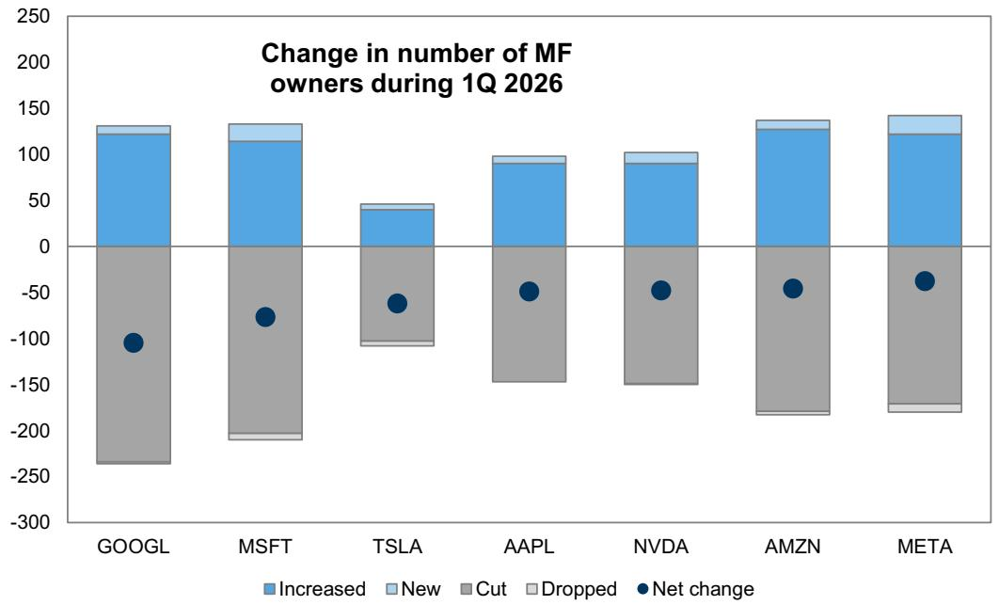

bar_stacked

Change in number of MF owners during 1Q 2026
| Company | Net change |
| :--- | :--- |
| GOOGL | -105 |
| MSFT | -80 |
| TSLA | -65 |
| AAPL | -45 |
| NVDA | -45 |
| AMZN | -45 |
| META | -35 |

Source: FactSet, GS Global Investment Research

IPOs: Mutual funds appear to strategically manage their cash positions around large IPOs. Investors are increasingly focused on the impact of potential large IPOs in the pipeline. Ahead of each of the four largest IPOs during the past few decades, US equity mutual funds increased their cash balances. Cash balances rose by a median of 3% in the month prior to each of those IPOs but then declined by a median of 2% during the subsequent month. However, the historical experience shows little evidence of elevated selling pressure on the largest stocks ahead of major IPOs.

For passive funds, potential index inclusion of large IPOs could put mechanical selling pressure on existing holdings, but fast-tracked large IPOs would likely carry small weights in the major benchmark US indices at first. Both Russell and S&P have launched formal consultations to allow for fast-track index inclusion of large IPOs. For existing fund holdings, the key consideration for the weight of a stock in the index is its float, rather than full, market cap. A hypothetical company with a total market capitalization of \$1 trillion and 10% of free float would have a weight of less than 0.5% in the S&P 500. If passive funds benchmarked to the S&P 500 added a hypothetical IPO with \$1 trillion market cap and 10% free float to their portfolios at benchmark weight, the reallocation flows would create selling pressure on existing index constituents equating to less than 5 bp of those constituents' collective market cap and less than 5% of their average daily trading volume. However, this impact would grow as the company's float factor increases.

Exhibit 14: Mutual funds have increased cash positions ahead of the largest IPOs in the past   
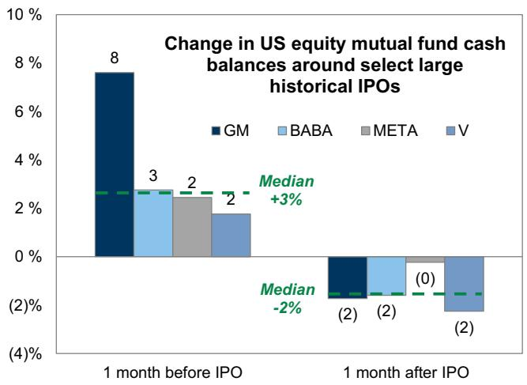

bar

| Date               | GM  | BABA | META | V   |
| ------------------ | --- | ---- | ---- | --- |
| 1 month before IPO  | 8   | 3    | 2    | 2   |
| 1 month after IPO   | (2) | (2)  | (0)  | (2) |

Source: ICI, GS Global Investment Research

Exhibit 15: Mechanical selling pressure from passive funds on existing constituents around hypothetical IPO 

<table><tr><td rowspan="2">Float-adjusted market cap of S&amp;P 500 addition (bn)</td><td colspan="3">Mechanical selling pressure from passive funds on existing S&amp;P 500 stocks</td></tr><tr><td>Value (bn)</td><td>% of mkt cap</td><td>% of ADTV</td></tr><tr><td>$50</td><td>$9</td><td>0.0 %</td><td>2 %</td></tr><tr><td>100</td><td>18</td><td>0.0</td><td>5</td></tr><tr><td>250</td><td>45</td><td>0.1</td><td>12</td></tr><tr><td>500</td><td>89</td><td>0.2</td><td>25</td></tr><tr><td>1,000</td><td>179</td><td>0.3</td><td>49</td></tr><tr><td>1,500</td><td>268</td><td>0.5</td><td>74</td></tr></table>

Source: GS Global Investment Research

# Sector positioning

The average mutual fund is most overweight Industrials (+197 bp) and most underweight Info Tech (-478 bp). The current tilt to Industrials is at the highest level relative to the past 10 years. Tilts towards Health Care and Energy rank at or above the 95th percentile relative to the past 10 years. Conversely, the tilt away from Info Tech and Comm Services sits near 10-year lows.

Exhibit 16: Mutual fund sector over/(under)weights   
holdings as of Q1 2026   
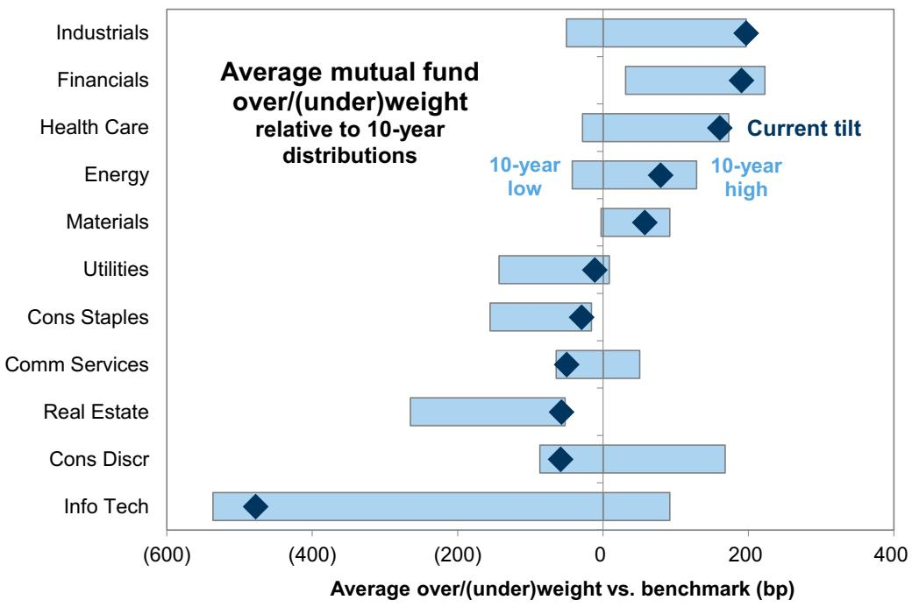

bar

| Sector        | Average over/(under)weight vs. benchmark (bp) |
| ------------- | --------------------------------------------- |
| Industrials   | 200                                           |
| Financials    | 200                                           |
| Health Care   | 150                                           |
| Energy        | 100                                           |
| Materials     | 50                                            |
| Utilities     | -50                                           |
| Cons Staples  | -50                                           |
| Comm Services | -50                                           |
| Real Estate   | -100                                          |
| Cons Discr    | -50                                           |
| Info Tech     | -600                                          |

Source: FactSet, GS Global Investment Research

Relative to last quarter, the average fund increased exposure most to Industrials (+24 bp) while cutting the most in Info Tech (-20 bp). At the industry level, the increase in tilt to Industrials was largest in Aerospace & Defense.

Exhibit 17: Change in mutual fund over/(under)weights vs. Q4 2025   
holdings as of Q1 2026   
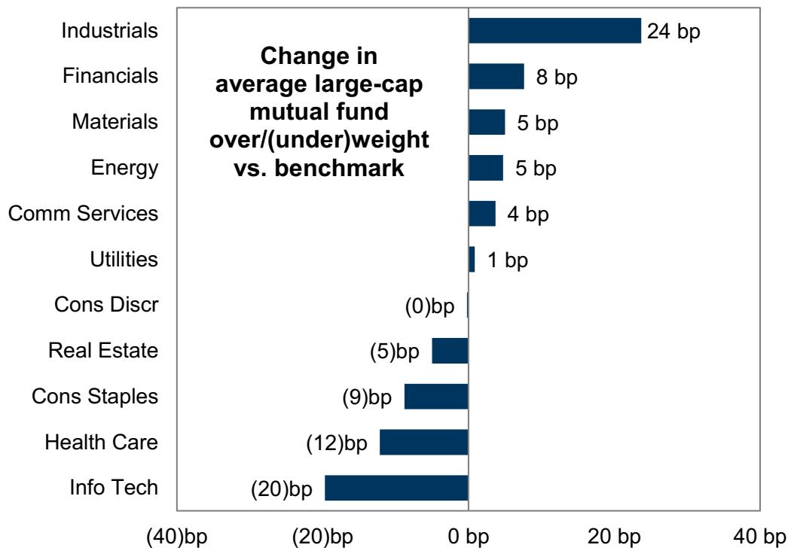

bar

Change in average large-cap mutual fund over/(under)weight vs. benchmark
| Sector | Change in average large-cap mutual fund over/(under)weight (bp) |
| :--- | :--- |
| Industrials | 24 |
| Financials | 8 |
| Materials | 5 |
| Energy | 5 |
| Comm Services | 4 |
| Utilities | 1 |
| Cons Discr | (0) |
| Real Estate | (5) |
| Cons Staples | (9) |
| Health Care | (12) |
| Info Tech | (20) |

Source: FactSet, GS Global Investment Research

Across styles, the average core, growth, and value fund is overweight Financials, Health Care, Energy, and Materials. The average fund across all styles is underweight Consumer Discretionary. In terms of changes in positioning, the average fund across all styles cut exposure to Consumer Staples.

Exhibit 18: Mutual fund over/(under)weights by style holdings as of Q1 2026 

<table><tr><td></td><td>Industrials</td><td>Financials</td><td>Health Care</td><td>Energy</td><td>Materials</td><td>Utilities</td><td>Cons Staples</td><td>Comm Services</td><td>Real Estate</td><td>Cons Discret</td><td>Info Tech</td></tr><tr><td colspan="12">AVERAGE</td></tr><tr><td>Average fund OW/(UW) (bp)</td><td>197</td><td>190</td><td>161</td><td>79</td><td>57</td><td>(12)</td><td>(30)</td><td>(50)</td><td>(57)</td><td>(59)</td><td>(478)</td></tr><tr><td>Change in OW/(UW) (bp)</td><td>24</td><td>8</td><td>(12)</td><td>5</td><td>5</td><td>1</td><td>(9)</td><td>4</td><td>(5)</td><td>(0)</td><td>(20)</td></tr><tr><td colspan="12">CORE</td></tr><tr><td>Average fund OW/(UW) (bp)</td><td>251</td><td>195</td><td>160</td><td>71</td><td>47</td><td>(16)</td><td>10</td><td>(47)</td><td>(59)</td><td>(32)</td><td>(581)</td></tr><tr><td>Change in OW/(UW) (bp)</td><td>(6)</td><td>(32)</td><td>(21)</td><td>4</td><td>12</td><td>(13)</td><td>(20)</td><td>(9)</td><td>(11)</td><td>38</td><td>55</td></tr><tr><td colspan="12">GROWTH</td></tr><tr><td>Average fund OW/(UW) (bp)</td><td>361</td><td>315</td><td>153</td><td>80</td><td>124</td><td>27</td><td>(67)</td><td>48</td><td>11</td><td>(129)</td><td>(923)</td></tr><tr><td>Change in OW/(UW) (bp)</td><td>94</td><td>21</td><td>1</td><td>37</td><td>27</td><td>(12)</td><td>(1)</td><td>(22)</td><td>(4)</td><td>(40)</td><td>(102)</td></tr><tr><td colspan="12">VALUE</td></tr><tr><td>Average fund OW/(UW) (bp)</td><td>(22)</td><td>60</td><td>169</td><td>87</td><td>1</td><td>(45)</td><td>(31)</td><td>(151)</td><td>(124)</td><td>(15)</td><td>70</td></tr><tr><td>Change in OW/(UW) (bp)</td><td>(18)</td><td>34</td><td>(17)</td><td>(27)</td><td>(24)</td><td>27</td><td>(6)</td><td>42</td><td>0</td><td>2</td><td>(12)</td></tr></table>

Source: FactSet, GS Global Investment Research

# Stock positioning

We analyzed individual equity holdings from large-cap core, growth, and value mutual funds to identify the most over- and under-weight positions of long-only investors. Exhibit 19-Exhibit 21 show the biggest overweight and underweight positions by fund type.

Exhibit 19: Large-cap CORE overweights and underweights   
holdings as of Q1 2026 

<table><tr><td>Ticker</td><td>Sector</td><td>YTD return</td><td>Index weight</td><td>Average OW/(UW)</td></tr><tr><td>MA</td><td>Financials</td><td>(12)%</td><td>0.7 %</td><td>34 bp</td></tr><tr><td>DHR</td><td>Health Care</td><td>(28)</td><td>0.2</td><td>28</td></tr><tr><td>BA</td><td>Industrials</td><td>0</td><td>0.3</td><td>23</td></tr><tr><td>ICE</td><td>Financials</td><td>(3)</td><td>0.2</td><td>20</td></tr><tr><td>MRVL</td><td>Information Technology</td><td>99</td><td>0.0</td><td>19</td></tr><tr><td>V</td><td>Financials</td><td>(6)</td><td>0.9</td><td>19</td></tr><tr><td>TJX</td><td>Consumer Discretionary</td><td>(2)</td><td>0.3</td><td>17</td></tr><tr><td>WFC</td><td>Financials</td><td>(20)</td><td>0.4</td><td>17</td></tr><tr><td>TXN</td><td>Information Technology</td><td>76</td><td>0.3</td><td>16</td></tr><tr><td>LNG</td><td>Energy</td><td>28</td><td>0.0</td><td>15</td></tr></table>

<table><tr><td>Ticker</td><td>Sector</td><td>YTD return</td><td>Index weight</td><td>Average OW/(UW)</td></tr><tr><td>AAPL</td><td>Information Technology</td><td>9 %</td><td>6.7 %</td><td>(264)bp</td></tr><tr><td>NVDA</td><td>Information Technology</td><td>19</td><td>7.6</td><td>(222)</td></tr><tr><td>TSLA</td><td>Consumer Discretionary</td><td>(8)</td><td>1.9</td><td>(128)</td></tr><tr><td>BRK.B</td><td>Financials</td><td>(4)</td><td>1.6</td><td>(71)</td></tr><tr><td>MSFT</td><td>Information Technology</td><td>(13)</td><td>4.9</td><td>(70)</td></tr><tr><td>AVGO</td><td>Information Technology</td><td>21</td><td>2.6</td><td>(67)</td></tr><tr><td>AMZN</td><td>Consumer Discretionary</td><td>15</td><td>3.6</td><td>(53)</td></tr><tr><td>COST</td><td>Consumer Staples</td><td>24</td><td>0.8</td><td>(44)</td></tr><tr><td>PLTR</td><td>Information Technology</td><td>(25)</td><td>0.6</td><td>(40)</td></tr><tr><td>LLY</td><td>Health Care</td><td>(8)</td><td>1.3</td><td>(38)</td></tr></table>

Source: FactSet, GS Global Investment Research

Exhibit 20: Large-cap GROWTH overweights and underweights   
holdings as of Q1 2026 

<table><tr><td>Ticker</td><td>Sector</td><td>YTD return</td><td>Index weight</td><td>Average OW/(UW)</td></tr><tr><td>SPGI</td><td>Financials</td><td>(20)%</td><td>0.0 %</td><td>41 bp</td></tr><tr><td>DHR</td><td>Health Care</td><td>(28)</td><td>0.0</td><td>39</td></tr><tr><td>JPM</td><td>Financials</td><td>(6)</td><td>0.0</td><td>38</td></tr><tr><td>TMO</td><td>Health Care</td><td>(24)</td><td>0.0</td><td>37</td></tr><tr><td>AMZN</td><td>Consumer Discretionary</td><td>15</td><td>4.7</td><td>36</td></tr><tr><td>SCHW</td><td>Financials</td><td>(7)</td><td>0.0</td><td>35</td></tr><tr><td>ISRG</td><td>Health Care</td><td>(24)</td><td>0.6</td><td>28</td></tr><tr><td>ETN</td><td>Industrials</td><td>20</td><td>0.0</td><td>28</td></tr><tr><td>MU</td><td>Information Technology</td><td>143</td><td>0.0</td><td>26</td></tr><tr><td>TJX</td><td>Consumer Discretionary</td><td>(2)</td><td>0.3</td><td>24</td></tr></table>

<table><tr><td>Ticker</td><td>Sector</td><td>YTD return</td><td>Index weight</td><td>Average OW/(UW)</td></tr><tr><td>AAPL</td><td>Information Technology</td><td>9 %</td><td>11.7 %</td><td>(608)bp</td></tr><tr><td>MSFT</td><td>Information Technology</td><td>(13)</td><td>8.8</td><td>(292)</td></tr><tr><td>NVDA</td><td>Information Technology</td><td>19</td><td>12.9</td><td>(284)</td></tr><tr><td>TSLA</td><td>Consumer Discretionary</td><td>(8)</td><td>3.6</td><td>(215)</td></tr><tr><td>AVGO</td><td>Information Technology</td><td>21</td><td>4.8</td><td>(121)</td></tr><tr><td>ABBV</td><td>Health Care</td><td>(7)</td><td>1.4</td><td>(104)</td></tr><tr><td>PLTR</td><td>Information Technology</td><td>(25)</td><td>1.2</td><td>(76)</td></tr><tr><td>LLY</td><td>Health Care</td><td>(8)</td><td>2.7</td><td>(71)</td></tr><tr><td>COST</td><td>Consumer Staples</td><td>24</td><td>1.6</td><td>(70)</td></tr><tr><td>HD</td><td>Consumer Discretionary</td><td>(12)</td><td>0.9</td><td>(64)</td></tr></table>

Source: FactSet, GS Global Investment Research

Exhibit 21: Large-cap VALUE overweights and underweights   
holdings as of Q1 2026 

<table><tr><td>Ticker</td><td>Sector</td><td>YTD return</td><td>Index weight</td><td>Average OW/(UW)</td></tr><tr><td>MSFT</td><td>Information Technology</td><td>(13)%</td><td>0.0 %</td><td>110 bp</td></tr><tr><td>ABBV</td><td>Health Care</td><td>(7)</td><td>0.0</td><td>55</td></tr><tr><td>AAPL</td><td>Information Technology</td><td>9</td><td>0.0</td><td>50</td></tr><tr><td>AVGO</td><td>Information Technology</td><td>21</td><td>0.0</td><td>42</td></tr><tr><td>WFC</td><td>Financials</td><td>(20)</td><td>0.8</td><td>40</td></tr><tr><td>BAC</td><td>Financials</td><td>(8)</td><td>1.0</td><td>38</td></tr><tr><td>C</td><td>Financials</td><td>6</td><td>0.5</td><td>38</td></tr><tr><td>SCHW</td><td>Financials</td><td>(7)</td><td>0.5</td><td>35</td></tr><tr><td>MDT</td><td>Health Care</td><td>(19)</td><td>0.4</td><td>32</td></tr><tr><td>MRK</td><td>Health Care</td><td>7</td><td>1.0</td><td>31</td></tr></table>

<table><tr><td>Ticker</td><td>Sector</td><td>YTD return</td><td>Index weight</td><td>Average OW/(UW)</td></tr><tr><td>BRK.B</td><td>Financials</td><td>(4)%</td><td>2.9 %</td><td>(206)bp</td></tr><tr><td>GOOGL</td><td>Communication Services</td><td>28</td><td>3.5</td><td>(114)</td></tr><tr><td>WMT</td><td>Consumer Staples</td><td>19</td><td>1.6</td><td>(111)</td></tr><tr><td>JPM</td><td>Financials</td><td>(6)</td><td>2.6</td><td>(95)</td></tr><tr><td>MU</td><td>Information Technology</td><td>143</td><td>1.2</td><td>(85)</td></tr><tr><td>XOM</td><td>Energy</td><td>35</td><td>2.4</td><td>(83)</td></tr><tr><td>JNJ</td><td>Health Care</td><td>10</td><td>1.9</td><td>(69)</td></tr><tr><td>CAT</td><td>Industrials</td><td>52</td><td>0.9</td><td>(64)</td></tr><tr><td>AMZN</td><td>Consumer Discretionary</td><td>15</td><td>1.8</td><td>(56)</td></tr><tr><td>PG</td><td>Consumer Staples</td><td>1</td><td>1.1</td><td>(51)</td></tr></table>

Source: FactSet, GS Global Investment Research

We blend core, growth, and value manager tilts to create our Mutual Fund Overweight (GSTHMFOW) and Underweight (GSTHMFUW) baskets. GSTHMFOW has underperformed the equal-weight S&P 500 YTD (-3% vs. +6%) and has trailed GSTHMFUW (+14%). See Exhibit 23 and Exhibit 24 for constituents of the newly rebalanced baskets.

Exhibit 22: Mutual Fund Overweights have lagged Underweights YTD   
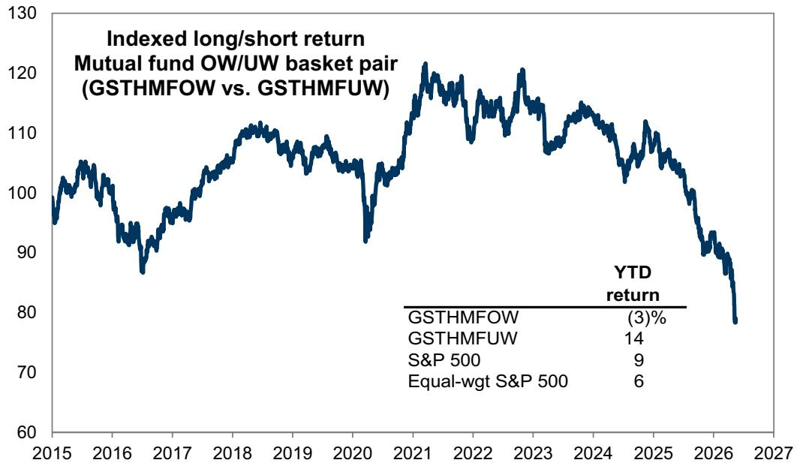

line

| Year | YTD return |
|------|------------|
| 2015 | ~98        |
| 2016 | ~95        |
| 2017 | ~98        |
| 2018 | ~110       |
| 2019 | ~108       |
| 2020 | ~92        |
| 2021 | ~120       |
| 2022 | ~115       |
| 2023 | ~118       |
| 2024 | ~112       |
| 2025 | ~105       |
| 2026 | ~85        |
| 2027 | ~78        |

Source: GS Global Investment Research

Mutual Fund Overweight Positions (GSTHMFOW): Our portfolio of favorite mutual fund positions contains 50 Russell 1000 stocks where the average large-cap core, growth, and value mutual fund is most overweight relative to a blended benchmark. The basket is equal-weighted and not sector-neutral to the Russell 1000. Mutual fund holdings range from 28 bp to 6 bp overweight (Exhibit 23). 16 new constituents entered the basket this quarter.

Mutual Fund Underweight Positions (GSTHMFUW): Our portfolio of out-of-favor mutual fund positions contains 50 Russell 1000 stocks where the average large-cap core, growth, and value mutual fund is most underweight relative to a blended benchmark. The basket is equal-weighted and not sector-neutral to the Russell 1000. Mutual fund holdings range from 274 bp to 7 bp underweight (Exhibit 24). 6 new constituents entered the basket this quarter.

Exhibit 23: Core, growth, and value mutual fund overweight positions vs. benchmarks (GSTHMFOW)

holdings as of Q1 2026; pricing as of May 15, 2026; bold indicates new constituent

<table><tr><td rowspan="2">Company name</td><td rowspan="2">Ticker</td><td rowspan="2">Sector</td><td rowspan="2">YTD return</td><td rowspan="2">Mkt cap ($ billion)</td><td colspan="3">Blended weight</td></tr><tr><td>Average fund</td><td>Benchmark</td><td>OVER weight</td></tr><tr><td>Charles Schwab Corp</td><td>SCHW</td><td>Financials</td><td>(7)%</td><td>161</td><td>0.6%</td><td>0.3%</td><td>28 bp</td></tr><tr><td>Mastercard Incorporated</td><td>MA</td><td>Financials</td><td>(12)</td><td>437</td><td>1.0</td><td>0.7</td><td>23</td></tr><tr><td>Wells Fargo &amp; Company</td><td>WFC</td><td>Financials</td><td>(20)</td><td>227</td><td>0.6</td><td>0.4</td><td>20</td></tr><tr><td>BofA Corp</td><td>BAC</td><td>Financials</td><td>(8)</td><td>359</td><td>0.7</td><td>0.5</td><td>18</td></tr><tr><td>Intercontinental Exchange, Inc.</td><td>ICE</td><td>Financials</td><td>(3)</td><td>89</td><td>0.3</td><td>0.2</td><td>17</td></tr><tr><td>Danaher Corporation</td><td>DHR</td><td>Health Care</td><td>(28)</td><td>116</td><td>0.4</td><td>0.2</td><td>16</td></tr><tr><td>Citi Inc.</td><td>C</td><td>Financials</td><td>6</td><td>213</td><td>0.5</td><td>0.3</td><td>16</td></tr><tr><td>Medtronic Public Limited Company</td><td>MDT</td><td>Health Care</td><td>(19)</td><td>99</td><td>0.3</td><td>0.2</td><td>14</td></tr><tr><td>Marsh &amp; McLennan Companies, Inc.</td><td>MRSH</td><td>Financials</td><td>(10)</td><td>78</td><td>0.3</td><td>0.1</td><td>14</td></tr><tr><td>ConocoPhillips</td><td>COP</td><td>Energy</td><td>35</td><td>149</td><td>0.4</td><td>0.3</td><td>13</td></tr><tr><td>Merck &amp; Co., Inc.</td><td>MRK</td><td>Health Care</td><td>7</td><td>276</td><td>0.6</td><td>0.5</td><td>12</td></tr><tr><td>TJX Companies Inc</td><td>TJX</td><td>Consumer Discretionary</td><td>(1)</td><td>164</td><td>0.4</td><td>0.3</td><td>12</td></tr><tr><td>Visa Inc.</td><td>V</td><td>Financials</td><td>(5)</td><td>622</td><td>1.0</td><td>0.9</td><td>11</td></tr><tr><td>Lowe&#x27;s Companies, Inc.</td><td>LOW</td><td>Consumer Discretionary</td><td>(8)</td><td>123</td><td>0.3</td><td>0.2</td><td>11</td></tr><tr><td>Johnson Controls International plc</td><td>JCI</td><td>Industrials</td><td>16</td><td>87</td><td>0.2</td><td>0.1</td><td>11</td></tr><tr><td>PNC Financial Services Group, Inc.</td><td>PNC</td><td>Financials</td><td>4</td><td>86</td><td>0.2</td><td>0.1</td><td>11</td></tr><tr><td>CVS Health Corporation</td><td>CVS</td><td>Health Care</td><td>23</td><td>122</td><td>0.3</td><td>0.2</td><td>11</td></tr><tr><td>American International Group, Inc.</td><td>AIG</td><td>Financials</td><td>(9)</td><td>41</td><td>0.2</td><td>0.1</td><td>11</td></tr><tr><td>Chubb Limited</td><td>CB</td><td>Financials</td><td>6</td><td>127</td><td>0.3</td><td>0.2</td><td>10</td></tr><tr><td>FedEx Corporation</td><td>FDX</td><td>Industrials</td><td>28</td><td>90</td><td>0.2</td><td>0.1</td><td>10</td></tr><tr><td>Boeing Company</td><td>BA</td><td>Industrials</td><td>0</td><td>172</td><td>0.4</td><td>0.3</td><td>10</td></tr><tr><td>Elevance Health, Inc.</td><td>ELV</td><td>Health Care</td><td>13</td><td>84</td><td>0.2</td><td>0.1</td><td>9</td></tr><tr><td>Bank of New York Mellon Corp</td><td>BK</td><td>Financials</td><td>18</td><td>94</td><td>0.2</td><td>0.1</td><td>9</td></tr><tr><td>Parker-Hannifin Corporation</td><td>PH</td><td>Industrials</td><td>(2)</td><td>109</td><td>0.3</td><td>0.2</td><td>9</td></tr><tr><td>Texas Instruments Incorporated</td><td>TXN</td><td>Information Technology</td><td>75</td><td>274</td><td>0.4</td><td>0.3</td><td>9</td></tr><tr><td>Becton, Dickinson and Company</td><td>BDX</td><td>Health Care</td><td>(6)</td><td>39</td><td>0.2</td><td>0.1</td><td>9</td></tr><tr><td>Thermo Fisher Scientific Inc.</td><td>TMO</td><td>Health Care</td><td>(24)</td><td>164</td><td>0.4</td><td>0.3</td><td>9</td></tr><tr><td>Cigna Group</td><td>CI</td><td>Health Care</td><td>5</td><td>76</td><td>0.2</td><td>0.1</td><td>8</td></tr><tr><td>Keurig Dr Pepper Inc.</td><td>KDP</td><td>Consumer Staples</td><td>6</td><td>40</td><td>0.1</td><td>0.1</td><td>8</td></tr><tr><td>Marvell Technology, Inc.</td><td>MRVL</td><td>Information Technology</td><td>96</td><td>151</td><td>0.2</td><td>0.1</td><td>8</td></tr><tr><td>EOG Resources, Inc.</td><td>EOG</td><td>Energy</td><td>39</td><td>75</td><td>0.2</td><td>0.1</td><td>8</td></tr><tr><td>Texas Pacific Land Corporation</td><td>TPL</td><td>Energy</td><td>35</td><td>27</td><td>0.1</td><td>0.0</td><td>8</td></tr><tr><td>Westinghouse Air Brake Technologies Corporation</td><td>WAB</td><td>Industrials</td><td>23</td><td>44</td><td>0.1</td><td>0.1</td><td>7</td></tr><tr><td>Ferguson Enterprises Inc.</td><td>FERG</td><td>Industrials</td><td>1</td><td>43</td><td>0.1</td><td>0.0</td><td>7</td></tr><tr><td>Walt Disney Company</td><td>DIS</td><td>Communication Services</td><td>(9)</td><td>181</td><td>0.4</td><td>0.3</td><td>7</td></tr><tr><td>US Foods Holding Corp.</td><td>USFD</td><td>Consumer Staples</td><td>9</td><td>18</td><td>0.1</td><td>0.0</td><td>7</td></tr><tr><td>General Dynamics Corporation</td><td>GD</td><td>Industrials</td><td>1</td><td>91</td><td>0.2</td><td>0.1</td><td>7</td></tr><tr><td>Amdocs Limited</td><td>DOX</td><td>Information Technology</td><td>(23)</td><td>7</td><td>0.1</td><td>0.0</td><td>7</td></tr><tr><td>Spotify Technology SA</td><td>SPOT</td><td>Communication Services</td><td>(24)</td><td>92</td><td>0.2</td><td>0.1</td><td>7</td></tr><tr><td>HEICO Corporation</td><td>HEI</td><td>Industrials</td><td>(10)</td><td>40</td><td>0.1</td><td>0.0</td><td>7</td></tr><tr><td>APA Corporation</td><td>APA</td><td>Energy</td><td>68</td><td>14</td><td>0.1</td><td>0.0</td><td>7</td></tr><tr><td>SLB Limited</td><td>SLB</td><td>Energy</td><td>50</td><td>85</td><td>0.2</td><td>0.1</td><td>7</td></tr><tr><td>APi Group Corporation</td><td>APG</td><td>Industrials</td><td>10</td><td>19</td><td>0.1</td><td>0.0</td><td>6</td></tr><tr><td>Eaton Corp. Plc</td><td>ETN</td><td>Industrials</td><td>19</td><td>155</td><td>0.3</td><td>0.2</td><td>6</td></tr><tr><td>Gilead Sciences, Inc.</td><td>GILD</td><td>Health Care</td><td>7</td><td>162</td><td>0.4</td><td>0.3</td><td>6</td></tr><tr><td>First Citizens BancShares, Inc.</td><td>FCNCA</td><td>Financials</td><td>(9)</td><td>23</td><td>0.1</td><td>0.0</td><td>6</td></tr><tr><td>U.S. Bancorp</td><td>USB</td><td>Financials</td><td>1</td><td>83</td><td>0.2</td><td>0.1</td><td>6</td></tr><tr><td>American Express Company</td><td>AXP</td><td>Financials</td><td>(15)</td><td>215</td><td>0.3</td><td>0.3</td><td>6</td></tr><tr><td>State Street Corporation</td><td>STT</td><td>Financials</td><td>20</td><td>43</td><td>0.1</td><td>0.1</td><td>6</td></tr><tr><td>PPG Industries, Inc.</td><td>PPG</td><td>Materials</td><td>3</td><td>23</td><td>0.1</td><td>0.0</td><td>6</td></tr><tr><td colspan="8"></td></tr><tr><td colspan="3">Mutual Fund Overweights (GSTHMFOW) median</td><td>2%</td><td>92</td><td></td><td></td><td>9 bp</td></tr><tr><td colspan="3">Russell 1000 median</td><td>1</td><td>17</td><td></td><td></td><td>0</td></tr></table>

Source: FactSet, GS Global Investment Research

Exhibit 24: Core, growth, and value mutual fund underweight positions vs. benchmarks (GSTHMFUW)

holdings as of Q1 2026; pricing as of May 15, 2026; bold indicates new constituent

<table><tr><td rowspan="2">Company name</td><td rowspan="2">Ticker</td><td rowspan="2">Sector</td><td rowspan="2">YTD return</td><td rowspan="2">Mkt cap ($ billion)</td><td colspan="3">Blended weight</td></tr><tr><td>Average fund</td><td>Benchmark</td><td>UNDER weight</td></tr><tr><td>Apple Inc.</td><td>AAPL</td><td>Information Technology</td><td>9 %</td><td>4410</td><td>3.4 %</td><td>6.1 %</td><td>(274)bp</td></tr><tr><td>NVIDIA Corporation</td><td>NVDA</td><td>Information Technology</td><td>18</td><td>5396</td><td>5.2</td><td>6.8</td><td>(162)</td></tr><tr><td>Tesla, Inc.</td><td>TSLA</td><td>Consumer Discretionary</td><td>(9)</td><td>1586</td><td>0.7</td><td>1.8</td><td>(114)</td></tr><tr><td>Berkshire Hathaway Inc.</td><td>BRK.B</td><td>Financials</td><td>(4)</td><td>1043</td><td>0.6</td><td>1.5</td><td>(90)</td></tr><tr><td>Microsoft Corporation</td><td>MSFT</td><td>Information Technology</td><td>(13)</td><td>3134</td><td>3.7</td><td>4.6</td><td>(84)</td></tr><tr><td>Walmart Inc.</td><td>WMT</td><td>Consumer Staples</td><td>19</td><td>1048</td><td>0.4</td><td>0.9</td><td>(50)</td></tr><tr><td>Broadcom Inc.</td><td>AVGO</td><td>Information Technology</td><td>20</td><td>1983</td><td>2.0</td><td>2.5</td><td>(49)</td></tr><tr><td>Alphabet Inc.</td><td>GOOGL</td><td>Communication Services</td><td>28</td><td>4807</td><td>4.6</td><td>5.1</td><td>(48)</td></tr><tr><td>Palantir Technologies Inc.</td><td>PLTR</td><td>Information Technology</td><td>(25)</td><td>321</td><td>0.2</td><td>0.6</td><td>(39)</td></tr><tr><td>Costco Wholesale Corporation</td><td>COST</td><td>Consumer Staples</td><td>24</td><td>464</td><td>0.5</td><td>0.8</td><td>(35)</td></tr><tr><td>Advanced Micro Devices, Inc.</td><td>AMD</td><td>Information Technology</td><td>93</td><td>691</td><td>0.3</td><td>0.6</td><td>(33)</td></tr><tr><td>Eli Lilly and Company</td><td>LLY</td><td>Health Care</td><td>(8)</td><td>931</td><td>1.0</td><td>1.3</td><td>(31)</td></tr><tr><td>Caterpillar Inc.</td><td>CAT</td><td>Industrials</td><td>51</td><td>399</td><td>0.2</td><td>0.6</td><td>(31)</td></tr><tr><td>Exxon Mobil Corporation</td><td>XOM</td><td>Energy</td><td>36</td><td>652</td><td>0.9</td><td>1.2</td><td>(31)</td></tr><tr><td>Micron Technology, Inc.</td><td>MU</td><td>Information Technology</td><td>140</td><td>802</td><td>0.3</td><td>0.6</td><td>(30)</td></tr><tr><td>Johnson &amp; Johnson</td><td>JNJ</td><td>Health Care</td><td>11</td><td>547</td><td>0.7</td><td>1.0</td><td>(26)</td></tr><tr><td>Amazon.com, Inc.</td><td>AMZN</td><td>Consumer Discretionary</td><td>14</td><td>2841</td><td>3.1</td><td>3.4</td><td>(24)</td></tr><tr><td>JPM Chase &amp; Co.</td><td>JPM</td><td>Financials</td><td>(6)</td><td>805</td><td>1.1</td><td>1.4</td><td>(24)</td></tr><tr><td>International Business Machines Corporation</td><td>IBM</td><td>Information Technology</td><td>(24)</td><td>206</td><td>0.2</td><td>0.4</td><td>(23)</td></tr><tr><td>AbbVie, Inc.</td><td>ABBV</td><td>Health Care</td><td>(7)</td><td>371</td><td>0.5</td><td>0.7</td><td>(21)</td></tr><tr><td>Coca-Cola Company</td><td>KO</td><td>Consumer Staples</td><td>17</td><td>348</td><td>0.3</td><td>0.5</td><td>(21)</td></tr><tr><td>Home Depot, Inc.</td><td>HD</td><td>Consumer Discretionary</td><td>(12)</td><td>298</td><td>0.4</td><td>0.6</td><td>(19)</td></tr><tr><td>Intel Corporation</td><td>INTC</td><td>Information Technology</td><td>182</td><td>549</td><td>0.2</td><td>0.3</td><td>(18)</td></tr><tr><td>Meta Platforms Inc</td><td>META</td><td>Communication Services</td><td>(8)</td><td>1559</td><td>2.0</td><td>2.1</td><td>(18)</td></tr><tr><td>Procter &amp; Gamble Company</td><td>PG</td><td>Consumer Staples</td><td>1</td><td>333</td><td>0.4</td><td>0.6</td><td>(17)</td></tr><tr><td>Oracle Corporation</td><td>ORCL</td><td>Information Technology</td><td>(5)</td><td>541</td><td>0.3</td><td>0.4</td><td>(15)</td></tr><tr><td>Amgen Inc.</td><td>AMGN</td><td>Health Care</td><td>0</td><td>175</td><td>0.2</td><td>0.3</td><td>(14)</td></tr><tr><td>Applied Materials, Inc.</td><td>AMAT</td><td>Information Technology</td><td>60</td><td>330</td><td>0.3</td><td>0.5</td><td>(13)</td></tr><tr><td>McDonald&#x27;s Corporation</td><td>MCD</td><td>Consumer Discretionary</td><td>(7)</td><td>199</td><td>0.3</td><td>0.4</td><td>(12)</td></tr><tr><td>AT&amp;T Inc</td><td>T</td><td>Communication Services</td><td>1</td><td>167</td><td>0.2</td><td>0.3</td><td>(11)</td></tr><tr><td>Welltower Inc.</td><td>WELL</td><td>Real Estate</td><td>16</td><td>151</td><td>0.1</td><td>0.2</td><td>(10)</td></tr><tr><td>Blackstone Inc.</td><td>BX</td><td>Financials</td><td>(22)</td><td>145</td><td>0.1</td><td>0.2</td><td>(10)</td></tr><tr><td>General Electric Company</td><td>GE</td><td>Industrials</td><td>(8)</td><td>298</td><td>0.4</td><td>0.5</td><td>(10)</td></tr><tr><td>Chevron Corporation</td><td>CVX</td><td>Energy</td><td>29</td><td>382</td><td>0.6</td><td>0.7</td><td>(10)</td></tr><tr><td>Sandisk Corporation</td><td>SNDK</td><td>Information Technology</td><td>447</td><td>194</td><td>0.1</td><td>0.2</td><td>(10)</td></tr><tr><td>RTX Corporation</td><td>RTX</td><td>Industrials</td><td>(5)</td><td>234</td><td>0.3</td><td>0.4</td><td>(9)</td></tr><tr><td>Southern Company</td><td>SO</td><td>Utilities</td><td>8</td><td>104</td><td>0.1</td><td>0.2</td><td>(9)</td></tr><tr><td>PepsiCo, Inc.</td><td>PEP</td><td>Consumer Staples</td><td>4</td><td>204</td><td>0.3</td><td>0.4</td><td>(9)</td></tr><tr><td>Palo Alto Networks, Inc.</td><td>PANW</td><td>Information Technology</td><td>34</td><td>198</td><td>0.1</td><td>0.2</td><td>(9)</td></tr><tr><td>Uber Technologies, Inc.</td><td>UBER</td><td>Industrials</td><td>(8)</td><td>154</td><td>0.2</td><td>0.3</td><td>(8)</td></tr><tr><td>Newmont Corporation</td><td>NEM</td><td>Materials</td><td>10</td><td>118</td><td>0.1</td><td>0.2</td><td>(8)</td></tr><tr><td>Abbott Laboratories</td><td>ABT</td><td>Health Care</td><td>(30)</td><td>152</td><td>0.2</td><td>0.3</td><td>(8)</td></tr><tr><td>Automatic Data Processing, Inc.</td><td>ADP</td><td>Industrials</td><td>(13)</td><td>88</td><td>0.1</td><td>0.1</td><td>(8)</td></tr><tr><td>Realty Income Corporation</td><td>O</td><td>Real Estate</td><td>11</td><td>57</td><td>0.0</td><td>0.1</td><td>(8)</td></tr><tr><td>Illinois Tool Works Inc.</td><td>ITW</td><td>Industrials</td><td>2</td><td>71</td><td>0.1</td><td>0.1</td><td>(7)</td></tr><tr><td>Digital Realty Trust, Inc.</td><td>DLR</td><td>Real Estate</td><td>21</td><td>65</td><td>0.0</td><td>0.1</td><td>(7)</td></tr><tr><td>Linde plc</td><td>LIN</td><td>Materials</td><td>20</td><td>236</td><td>0.3</td><td>0.4</td><td>(7)</td></tr><tr><td>Equinix, Inc.</td><td>EQIX</td><td>Real Estate</td><td>39</td><td>104</td><td>0.1</td><td>0.2</td><td>(7)</td></tr><tr><td>Corning Inc</td><td>GLW</td><td>Information Technology</td><td>104</td><td>156</td><td>0.1</td><td>0.2</td><td>(7)</td></tr><tr><td>ONEOK, Inc.</td><td>OKE</td><td>Energy</td><td>31</td><td>59</td><td>0.0</td><td>0.1</td><td>(7)</td></tr></table>

Source: FactSet, GS Global Investment Research

Exhibit 25 and Exhibit 26 show the Russell 3000 stocks where fund managers are increasing or decreasing positions vs. Q4 2025. Analyzing overweight and underweight tilts can be distorted by stock performance and benchmark weights. This analysis instead focuses on the shares owned by mutual funds to understand the actual buying and selling of stocks. WAT, VSNT, and ANET were the three stocks with the biggest net increases. GOOGL, JPM, and MSFT were the three stocks with the biggest net decreases.

Exhibit 25: The 20 most popular mutual fund INCREASES

holdings as of Q1 2026

# of funds changing portfolio allocation during Q1 2026: most popular INCREASES 

<table><tr><td>Ticker</td><td>Name</td><td>Sector</td><td>New position</td><td>Increased position</td><td>Decreased position</td><td>Dropped position</td><td>Increase - decrease</td></tr><tr><td>WAT</td><td>Waters Corp.</td><td>Health Care</td><td>38</td><td>23</td><td>4</td><td>3</td><td>54</td></tr><tr><td>VSNT</td><td>Versant Media Group, Inc.</td><td>Communication Services</td><td>44</td><td>0</td><td>0</td><td>0</td><td>44</td></tr><tr><td>ANET</td><td>Arista Networks, Inc.</td><td>Information Technology</td><td>24</td><td>69</td><td>51</td><td>6</td><td>36</td></tr><tr><td>BA</td><td>Boeing Company</td><td>Industrials</td><td>11</td><td>72</td><td>40</td><td>7</td><td>36</td></tr><tr><td>INTC</td><td>Intel Corp.</td><td>Information Technology</td><td>27</td><td>38</td><td>27</td><td>6</td><td>32</td></tr><tr><td>VIK</td><td>Viking Holdings Ltd</td><td>Consumer Discretionary</td><td>23</td><td>18</td><td>9</td><td>0</td><td>32</td></tr><tr><td>IR</td><td>Ingersoll Rand Inc.</td><td>Industrials</td><td>24</td><td>26</td><td>17</td><td>2</td><td>31</td></tr><tr><td>NFLX</td><td>Netflix, Inc.</td><td>Communication Services</td><td>30</td><td>93</td><td>78</td><td>14</td><td>31</td></tr><tr><td>DPZ</td><td>Domino&#x27;s Pizza, Inc.</td><td>Consumer Discretionary</td><td>30</td><td>20</td><td>17</td><td>5</td><td>28</td></tr><tr><td>PG</td><td>Procter &amp; Gamble Company</td><td>Consumer Staples</td><td>17</td><td>73</td><td>58</td><td>5</td><td>27</td></tr><tr><td>GLW</td><td>Corning Inc</td><td>Information Technology</td><td>15</td><td>35</td><td>25</td><td>2</td><td>23</td></tr><tr><td>UPS</td><td>United Parcel Service, Inc. Class B</td><td>Industrials</td><td>10</td><td>39</td><td>24</td><td>2</td><td>23</td></tr><tr><td>SITM</td><td>SiTime Corp.</td><td>Information Technology</td><td>10</td><td>23</td><td>10</td><td>1</td><td>22</td></tr><tr><td>GPGI</td><td>GPGI, Inc.</td><td>Information Technology</td><td>20</td><td>4</td><td>1</td><td>2</td><td>21</td></tr><tr><td>INSM</td><td>Insmed Incorporated</td><td>Health Care</td><td>13</td><td>38</td><td>19</td><td>11</td><td>21</td></tr><tr><td>SNDK</td><td>Sandisk Corp.</td><td>Information Technology</td><td>31</td><td>15</td><td>22</td><td>4</td><td>20</td></tr><tr><td>HBAN</td><td>Huntington Bancshares Incorporated</td><td>Financials</td><td>10</td><td>23</td><td>10</td><td>4</td><td>19</td></tr><tr><td>PSX</td><td>Phillips 66</td><td>Energy</td><td>21</td><td>26</td><td>21</td><td>7</td><td>19</td></tr><tr><td>COHR</td><td>Coherent Corp.</td><td>Information Technology</td><td>18</td><td>26</td><td>21</td><td>5</td><td>18</td></tr><tr><td>FCX</td><td>Freeport-McMoRan, Inc.</td><td>Materials</td><td>28</td><td>22</td><td>27</td><td>5</td><td>18</td></tr></table>

Excludes stocks that began trading after the start of Q1 2026   
Source: FactSet, GS Global Investment Research

Exhibit 26: The 20 most popular mutual fund DECREASES

holdings as of Q1 2026

# of funds changing portfolio allocation during Q1 2026: most popular DECREASES 

<table><tr><td>Ticker</td><td>Name</td><td>Sector</td><td>New position</td><td>Increased position</td><td>Decreased position</td><td>Dropped position</td><td>Increase - decrease</td></tr><tr><td>GOOGL</td><td>Alphabet Inc.</td><td>Communication Services</td><td>9</td><td>122</td><td>234</td><td>2</td><td>(105)</td></tr><tr><td>JPM</td><td>JPM Chase &amp; Co.</td><td>Financials</td><td>12</td><td>45</td><td>143</td><td>6</td><td>(92)</td></tr><tr><td>MSFT</td><td>Microsoft Corp.</td><td>Information Technology</td><td>19</td><td>114</td><td>203</td><td>7</td><td>(77)</td></tr><tr><td>WMT</td><td>Walmart Inc.</td><td>Consumer Staples</td><td>9</td><td>38</td><td>106</td><td>12</td><td>(71)</td></tr><tr><td>JNJ</td><td>Johnson &amp; Johnson</td><td>Health Care</td><td>13</td><td>45</td><td>126</td><td>3</td><td>(71)</td></tr><tr><td>BAC</td><td>BofA Corp</td><td>Financials</td><td>7</td><td>69</td><td>132</td><td>9</td><td>(65)</td></tr><tr><td>DE</td><td>Deere &amp; Company</td><td>Industrials</td><td>5</td><td>27</td><td>87</td><td>8</td><td>(63)</td></tr><tr><td>TSLA</td><td>Tesla, Inc.</td><td>Consumer Discretionary</td><td>6</td><td>40</td><td>103</td><td>5</td><td>(62)</td></tr><tr><td>WFC</td><td>Wells Fargo &amp; Company</td><td>Financials</td><td>9</td><td>54</td><td>114</td><td>8</td><td>(59)</td></tr><tr><td>C</td><td>Citi Inc.</td><td>Financials</td><td>7</td><td>38</td><td>97</td><td>6</td><td>(58)</td></tr><tr><td>V</td><td>Visa Inc.</td><td>Financials</td><td>14</td><td>77</td><td>131</td><td>9</td><td>(49)</td></tr><tr><td>AAPL</td><td>Apple Inc.</td><td>Information Technology</td><td>8</td><td>90</td><td>147</td><td>0</td><td>(49)</td></tr><tr><td>NVDA</td><td>NVIDIA Corp.</td><td>Information Technology</td><td>12</td><td>90</td><td>149</td><td>1</td><td>(48)</td></tr><tr><td>AMZN</td><td>Amazon.com, Inc.</td><td>Consumer Discretionary</td><td>10</td><td>127</td><td>179</td><td>4</td><td>(46)</td></tr><tr><td>SPGI</td><td>S&amp;P Global, Inc.</td><td>Financials</td><td>7</td><td>24</td><td>58</td><td>13</td><td>(40)</td></tr><tr><td>PGR</td><td>Progressive Corp.</td><td>Financials</td><td>8</td><td>31</td><td>63</td><td>15</td><td>(39)</td></tr><tr><td>AXP</td><td>American Express Company</td><td>Financials</td><td>13</td><td>28</td><td>74</td><td>6</td><td>(39)</td></tr><tr><td>TRV</td><td>Travelers Companies, Inc.</td><td>Financials</td><td>5</td><td>17</td><td>48</td><td>12</td><td>(38)</td></tr><tr><td>META</td><td>Meta Platforms Inc</td><td>Communication Services</td><td>20</td><td>122</td><td>171</td><td>9</td><td>(38)</td></tr><tr><td>ISRG</td><td>Intuitive Surgical, Inc.</td><td>Health Care</td><td>8</td><td>39</td><td>73</td><td>12</td><td>(38)</td></tr></table>

Excludes stocks that began trading after the start of Q1 2026   
Source: FactSet, GS Global Investment Research

# Appendix

Exhibit 27: Top 50 domestic large-cap core, growth, and value mutual funds by AUM in our sample

holdings as of Q1 2026; pricing as of May 15, 2026; excludes ETFs and index objective funds

<table><tr><td rowspan="2">Fund name</td><td rowspan="2">Type</td><td rowspan="2">Ticker</td><td rowspan="2">Equity holdings ($ billions)</td><td colspan="2">Return</td></tr><tr><td>YTD</td><td>2025</td></tr><tr><td>American Funds - Growth Fund of America</td><td>Growth</td><td>AGTHX</td><td>$341</td><td>(1)%</td><td>20%</td></tr><tr><td>Strategic Advisers Fidelity US Total Stock Fund</td><td>Core</td><td>FCTDX</td><td>240</td><td>3</td><td>18</td></tr><tr><td>American Funds - Washington Mutual Investors</td><td>Core</td><td>AWSHX</td><td>208</td><td>3</td><td>17</td></tr><tr><td>American Funds - Investment Company of America</td><td>Core</td><td>AIVSX</td><td>183</td><td>2</td><td>21</td></tr><tr><td>Fidelity Contrafund Fund</td><td>Core</td><td>FCNTX</td><td>175</td><td>2</td><td>22</td></tr><tr><td>American Funds - Fundamental Investors Fund</td><td>Core</td><td>ANCFX</td><td>172</td><td>4</td><td>24</td></tr><tr><td>JPM Large Cap Growth Fund</td><td>Growth</td><td>JLGMX</td><td>122</td><td>(2)</td><td>14</td></tr><tr><td>Dodge &amp; Cox Stock Fund</td><td>Value</td><td>DODGX</td><td>120</td><td>3</td><td>14</td></tr><tr><td>American Funds - American Mutual Fund</td><td>Value</td><td>AMRMX</td><td>111</td><td>4</td><td>16</td></tr><tr><td>Fidelity Blue Chip Growth Fund</td><td>Growth</td><td>FBGRX</td><td>100</td><td>(1)</td><td>20</td></tr><tr><td>Strategic Advisers US Total Stock Fund</td><td>Core</td><td>FSAKX</td><td>98</td><td>2</td><td>17</td></tr><tr><td>American Funds - AMCAP Fund</td><td>Growth</td><td>AMCPX</td><td>97</td><td>(1)</td><td>18</td></tr><tr><td>Fidelity Growth Company Fund</td><td>Growth</td><td>FDGRX</td><td>96</td><td>3</td><td>24</td></tr><tr><td>Vanguard PRIMECAP Fund</td><td>Growth</td><td>VPMAX</td><td>88</td><td>5</td><td>30</td></tr><tr><td>T Rowe Price Blue Chip Growth Fund</td><td>Growth</td><td>TRBCX</td><td>68</td><td>(4)</td><td>19</td></tr><tr><td>Vanguard Windsor II Fund</td><td>Value</td><td>VWNAX</td><td>65</td><td>4</td><td>19</td></tr><tr><td>MFS Value Fund</td><td>Value</td><td>MEIIX</td><td>51</td><td>6</td><td>13</td></tr><tr><td>T Rowe Price Growth Stock Fund</td><td>Growth</td><td>TRJZX</td><td>51</td><td>(4)</td><td>16</td></tr><tr><td>Putnam Large Cap Value Fund</td><td>Value</td><td>PEIYX</td><td>49</td><td>6</td><td>15</td></tr><tr><td>Columbia Dividend Income Fund</td><td>Value</td><td>GSFTX</td><td>47</td><td>7</td><td>16</td></tr><tr><td>JPM Equity Income Fund</td><td>Value</td><td>OIEJX</td><td>44</td><td>7</td><td>15</td></tr><tr><td>MFS Growth Fund</td><td>Growth</td><td>MFEKX</td><td>43</td><td>(3)</td><td>12</td></tr><tr><td>Fidelity OTC Portfolio</td><td>Core</td><td>FOCPX</td><td>43</td><td>1</td><td>22</td></tr><tr><td>Vanguard Dividend Growth Fund</td><td>Core</td><td>VDIGX</td><td>38</td><td>2</td><td>8</td></tr><tr><td>Fidelity Contrafund K6 Fund</td><td>Core</td><td>FLCNX</td><td>37</td><td>1</td><td>22</td></tr><tr><td>Fidelity Magellan Fund</td><td>Growth</td><td>FMAGX</td><td>37</td><td>(1)</td><td>11</td></tr><tr><td>JPM US Equity Fund</td><td>Core</td><td>JUEMX</td><td>35</td><td>0</td><td>15</td></tr><tr><td>Six Circles US Unconstrained Equity Fund</td><td>Core</td><td>CUSUX</td><td>35</td><td>(1)</td><td>19</td></tr><tr><td>T Rowe Price Value Fund</td><td>Value</td><td>TRZAX</td><td>34</td><td>8</td><td>13</td></tr><tr><td>Fidelity Advisor Growth Opportunities Fund</td><td>Growth</td><td>FAGCX</td><td>34</td><td>(2)</td><td>22</td></tr><tr><td>Six Circles Managed Equity Portfolio US Unconstrained Fund</td><td>Core</td><td>CMEUX</td><td>32</td><td>0</td><td>18</td></tr><tr><td>Bridge Builder Large Cap Growth Fund</td><td>Growth</td><td>BBGLX</td><td>30</td><td>(3)</td><td>14</td></tr><tr><td>Franklin DynaTech Fund</td><td>Growth</td><td>FKDNX</td><td>30</td><td>(4)</td><td>18</td></tr><tr><td>Janus Henderson Research Fund</td><td>Growth</td><td>JNRFX</td><td>29</td><td>(3)</td><td>18</td></tr><tr><td>Bridge Builder Large Cap Value Fund</td><td>Value</td><td>BBVLX</td><td>28</td><td>5</td><td>13</td></tr><tr><td>American Century Ultra Fund</td><td>Growth</td><td>TWCUX</td><td>28</td><td>(2)</td><td>13</td></tr><tr><td>Fidelity Series Large Cap Stock Fund</td><td>Core</td><td>FGLGX</td><td>27</td><td>5</td><td>28</td></tr><tr><td>Franklin Rising Dividends Fund</td><td>Core</td><td>FRDPX</td><td>27</td><td>2</td><td>12</td></tr><tr><td>Fidelity Growth Company K6 Fund</td><td>Growth</td><td>FGKFX</td><td>27</td><td>3</td><td>26</td></tr><tr><td>Fidelity Advisor New Insights Fund</td><td>Growth</td><td>FINSX</td><td>26</td><td>2</td><td>23</td></tr><tr><td>Fidelity Series Growth Company Fund</td><td>Growth</td><td>FCGSX</td><td>25</td><td>3</td><td>26</td></tr><tr><td>AB Large Cap Growth Fund</td><td>Growth</td><td>APGYX</td><td>25</td><td>(3)</td><td>13</td></tr><tr><td>Oakmark Fund</td><td>Core</td><td>OAKMX</td><td>25</td><td>2</td><td>14</td></tr><tr><td>Parnassus Core Equity Fund</td><td>Core</td><td>PRILX</td><td>24</td><td>(0)</td><td>12</td></tr><tr><td>Vanguard Windsor Fund</td><td>Value</td><td>VWNEX</td><td>24</td><td>4</td><td>13</td></tr><tr><td>Janus Henderson Forty Fund</td><td>Growth</td><td>JFRDX</td><td>24</td><td>(5)</td><td>18</td></tr><tr><td>T Rowe Price Dividend Growth Fund</td><td>Core</td><td>PRDGX</td><td>24</td><td>4</td><td>15</td></tr><tr><td>JPM Growth Advantage Fund</td><td>Growth</td><td>JGVVX</td><td>23</td><td>(3)</td><td>16</td></tr><tr><td>JPM Hedged Equity Fund</td><td>Core</td><td>JHEQX</td><td>22</td><td>1</td><td>7</td></tr><tr><td>T Rowe Price Institutional Large-Cap Growth Fund</td><td>Growth</td><td>TRLGX</td><td>22</td><td>(5)</td><td>18</td></tr></table>

Source: EPFR, FactSet, GS Global Investment Research

# Disclosure Appendix

# Reg AC

We, Ryan Hammond, Daniel Chavez, Ben Snider, Jenny Ma, Kartik Jayachandran and Christophe Sung, hereby certify that all of the views expressed in this report accurately reflect our personal views, which have not been influenced by considerations of the firm's business or client relationships.

Unless otherwise stated, the individuals listed on the cover page of this report are analysts in GS' Global Investment Research division.

Contributing Authors: Ryan Hammond GS & Co. LLC, Daniel Chavez GS & Co. LLC, Ben Snider GS & Co. LLC, Jenny Ma GS & Co. LLC, Kartik Jayachandran GS & Co. LLC, Christophe Sung GS & Co. LLC.

Unless otherwise stated, the individuals listed in the Contributing Authors disclosure of this report are analysts in GS' Global Investment Research division.

# Disclosures

# Equity basket disclosure

The ability to trade the basket(s) discussed in this report will depend upon market conditions, including liquidity and borrow constraints at the time of trade.

# Marquee disclosure

Marquee is a product of GS FICC and Equities. Any Marquee content linked in this report is not necessarily representative of GS Research views. Because the Marquee platform and third-party platforms (e.g., Bloomberg) are only permitted to reflect changes to these baskets after publication of this note, there will be a delay between the rebalancing of baskets in this note and when the changes to these baskets are reflected on such platforms. If you need access to Marquee, please contact your GS salesperson or email the Marquee team at gs-marquee-sales@gs.com.

# Regulatory disclosures

# Disclosures required by United States laws and regulations

See company-specific regulatory disclosures above for any of the following disclosures required as to companies referred to in this report: manager or co-manager in a pending transaction; 1% or other ownership; compensation for certain services; types of client relationships; managed/co-managed public offerings in prior periods; directorships; for equity securities, market making and/or specialist role. GS trades or may trade as a principal in debt securities (or in related derivatives) of issuers discussed in this report.

The following are additional required disclosures: Ownership and material conflicts of interest: GS policy prohibits its analysts, professionals reporting to analysts and members of their households from owning securities of any company in the analyst's area of coverage. Analyst compensation: Analysts are paid in part based on the profitability of GS, which includes investment banking revenues. Analyst as officer or director: GS policy generally prohibits its analysts, persons reporting to analysts or members of their households from serving as an officer, director or advisor of any company in the analyst's area of coverage. Non-U.S. Analysts: Non-U.S. analysts may not be associated persons of GS & Co. LLC and therefore may not be subject to FINRA Rule 2241 or FINRA Rule 2242 restrictions on communications with a subject company, public appearances and trading in securities covered by the analysts.

# Additional disclosures required under the laws and regulations of jurisdictions other than the United States

The following disclosures are those required by the jurisdiction indicated, except to the extent already made above pursuant to United States laws and regulations. Australia: GS Australia Pty Ltd and its affiliates are not authorised deposit-taking institutions (as that term is defined in the Banking Act 1959 (Cth)) in Australia and do not provide banking services, nor carry on a banking business, in Australia. This research, and any access to it, is intended only for “wholesale clients” within the meaning of the Australian Corporations Act, unless otherwise agreed by GS. In producing research reports, members of Global Investment Research of GS Australia may attend site visits and other meetings hosted by the companies and other entities which are the subject of its research reports. In some instances the costs of such site visits or meetings may be met in part or in whole by the issuers concerned if GS Australia considers it is appropriate and reasonable in the specific circumstances relating to the site visit or meeting. To the extent that the contents of this document contains any financial product advice, it is general advice only and has been prepared by GS without taking into account a client’s objectives, financial situation or needs. A client should, before acting on any such advice, consider the appropriateness of the advice having regard to the client’s own objectives, financial situation and needs. A copy of certain GS Australia and New Zealand disclosure of interests and a copy of GS’ Australian Sell-Side Research Independence Policy Statement are available at: https://www.goldmansachs.com/disclosures/australia-new-zealand/index.html. Brazil: Disclosure information in relation to CVM Resolution n. 20 is available at https://www.gs.com/worldwide/brazil/area/gir/index.html. Where applicable, the Brazil-registered analyst primarily responsible for the content of this research report, as defined in Article 20 of CVM Resolution n. 20, is the first author named at the beginning of this report, unless indicated otherwise at the end of the text. Canada: This information is being provided to you for information purposes only and is not, and under no circumstances should be construed as, an advertisement, offering or solicitation by GS & Co. LLC for purchasers of securities in Canada to trade in any Canadian security. GS & Co. LLC is not registered as a dealer in any jurisdiction in Canada under applicable Canadian securities laws and generally is not permitted to trade in Canadian securities and may be prohibited from selling certain securities and products in certain jurisdictions in Canada. If you wish to trade in any Canadian securities or other products in Canada please contact GS Canada Inc., an affiliate of The GS Group Inc., or another registered Canadian dealer. Hong Kong: Further information on the securities of covered companies referred to in this research may be obtained on request from GS (Asia) L.L.C. India: Further information on the subject company or companies referred to in this research may be obtained from GS (India) Securities Private Limited, Research Analyst - SEBI Registration Number INH000001493, 10th Floor, Ascent-Worli, Sudam Kalu Ahire Marg, Worli, Mumbai-400 025, India, Corporate Identity Number U74140MH2006FTC160634, Phone +91 22 6616 9000, Fax +91 22 6616 9001. GS may beneficially own 1% or more of the securities (as such term is defined in clause 2 (h) the Indian Securities Contracts (Regulation) Act, 1956) of the subject company or companies referred to in this research report. Investment in securities market are subject to market risks. Read all the related documents carefully before investing. Registration granted by SEBI and certification from NISM in no way guarantee performance of the intermediary or provide any assurance of returns to investors. GS (India) Securities Private Limited compliance officer and investor grievance contact details can be found at: https://www.goldmansachs.com/worldwide/india/documents/Grievance-Redressal-and-Escalation-Matrix.pdf, and a copy of the annual audit compliance report can be found at this link: https://publishing.gs.com/content/site/india-annual-compliance-report.html. Japan: See below. Korea: This research, and any access to it, is intended only for “professional investors” within the meaning of the Financial Services and Capital Markets Act, unless otherwise agreed by GS. Further information on the subject company or companies referred to in this research may be obtained from GS (Asia) L.L.C., Seoul Branch. New Zealand: GS New Zealand Limited and its affiliates are neither “registered banks” nor “deposit takers” (as defined in the Reserve Bank of New Zealand Act 1989) in New Zealand. This research, and any access to it, is intended for

“wholesale clients” (as defined in the Financial Advisers Act 2008) unless otherwise agreed by GS. A copy of certain GS Australia and New Zealand disclosure of interests is available at: https://www.goldmansachs.com/disclosures/australia-new-zealand/index.html.

Russia: Research reports distributed in the Russian Federation are not advertising as defined in the Russian legislation, but are information and analysis not having product promotion as their main purpose and do not provide appraisal within the meaning of the Russian legislation on appraisal activity. Research reports do not constitute a personalized investment recommendation as defined in Russian laws and regulations, are not addressed to a specific client, and are prepared without analyzing the financial circumstances, investment profiles or risk profiles of clients. GS assumes no responsibility for any investment decisions that may be taken by a client or any other person based on this research report. Singapore: GS (Singapore) Pte. (Company Number: 198602165W), which is regulated by the Monetary Authority of Singapore, accepts legal responsibility for this research, and should be contacted with respect to any matters arising from, or in connection with, this research. Taiwan: This material is for reference only and must not be reprinted without permission. Investors should carefully consider their own investment risk. Investment results are the responsibility of the individual investor. United Kingdom: Persons who would be categorized as retail clients in the United Kingdom, as such term is defined in the rules of the Financial Conduct Authority, should read this research in conjunction with prior GS on the covered companies referred to herein and should refer to the risk warnings that have been sent to them by GS International. A copy of these risks warnings, and a glossary of certain financial terms used in this report, are available from GS International on request.

European Union and United Kingdom: Disclosure information in relation to Article 6 (2) of the European Commission Delegated Regulation (EU) (2016/958) supplementing Regulation (EU) No 596/2014 of the European Parliament and of the Council (including as that Delegated Regulation is implemented into United Kingdom domestic law and regulation following the United Kingdom's departure from the European Union and the European Economic Area) with regard to regulatory technical standards for the technical arrangements for objective presentation of investment recommendations or other information recommending or suggesting an investment strategy and for disclosure of particular interests or indications of conflicts of interest is available at https://www.gs.com/disclosures/europeanpolicy.html which states the European Policy for Managing Conflicts of Interest in Connection with Investment Research.

Japan: GS Japan Co., Ltd. is a Financial Instrument Dealer registered with the Kanto Financial Bureau under registration number Kinsho 69, and a member of Japan Securities Dealers Association, Financial Futures Association of Japan Type II Financial Instruments Firms Association, and Investment Management Association of Japan. Sales and purchase of equities are subject to commission pre-determined with clients plus consumption tax. See company-specific disclosures as to any applicable disclosures required by Japanese stock exchanges, the Japanese Securities Dealers Association or the Japanese Securities Finance Company.

# Global product; distributing entities

GS Global Investment Research produces and distributes research products for clients of GS on a global basis. Analysts based in GS offices around the world produce research on industries and companies, and research on macroeconomics, currencies, commodities and portfolio strategy. This research is disseminated in Australia by GS Australia Pty Ltd (ABN 21 006 797 897); in Brazil by GS do Brasil Corretora de Títulos e Valores Mobiliários S.A.; Public Communication Channel GS Brazil: 0800 727 5764 and / or contatogoldmanbrasil@gs.com. Available Weekdays (except holidays), from 9am to 6pm. Canal de Comunicação com o Público GS Brasil: 0800 727 5764 e/ou contatogoldmanbrasil@gs.com. Horário de funcionamento: segunda-feira à sexta-feira (exceto feriados), das 9h às 18h; in Canada by GS & Co. LLC; in Hong Kong by GS (Asia) L.L.C.; in India by GS (India) Securities Private Ltd.; in Japan by GS Japan Co., Ltd.; in the Republic of Korea by GS (Asia) L.L.C., Seoul Branch; in New Zealand by GS New Zealand Limited; in Russia by OOO GS; in Singapore by GS (Singapore) Pte. (Company Number: 198602165W); and in the United States of America by GS & Co. LLC. GS International has approved this research in connection with its distribution in the United Kingdom.

GS International (“GSI”), authorised by the Prudential Regulation Authority (“PRA”) and regulated by the Financial Conduct Authority (“FCA”) and the PRA, has approved this research in connection with its distribution in the United Kingdom.

European Economic Area: GS Bank Europe SE (“GSBE”) is a credit institution incorporated in Germany and, within the Single Supervisory Mechanism, subject to direct prudential supervision by the European Central Bank and in other respects supervised by German Federal Financial Supervisory Authority (Bundesanstalt für Finanzdienstleistungsaufsicht, BaFin) and Deutsche Bundesbank and disseminates research within the European Economic Area.

# General disclosures

This research is for our clients only. Other than disclosures relating to GS, this research is based on current public information that we consider reliable, but we do not represent it is accurate or complete, and it should not be relied on as such. The information, opinions, estimates and forecasts contained herein are as of the date hereof and are subject to change without prior notification. We seek to update our research as appropriate, but various regulations may prevent us from doing so. Other than certain industry reports published on a periodic basis, the large majority of reports are published at irregular intervals as appropriate in the analyst's judgment.

GS conducts a global full-service, integrated investment banking, investment management, and brokerage business. We have investment banking and other business relationships with a substantial percentage of the companies covered by Global Investment Research. GS & Co. LLC, the United States broker dealer, is a member of SIPC (https://www.sipc.org).

Our salespeople, traders, and other professionals may provide oral or written market commentary or trading strategies to our clients and principal trading desks that reflect opinions that are contrary to the opinions expressed in this research. Our asset management area, principal trading desks and investing businesses may make investment decisions that are inconsistent with the recommendations or views expressed in this research.

We and our affiliates, officers, directors, and employees will from time to time have long or short positions in, act as principal in, and buy or sell, the securities or derivatives, if any, referred to in this research, unless otherwise prohibited by regulation or GS policy.

The views attributed to third party presenters at GS arranged conferences, including individuals from other parts of GS, do not necessarily reflect those of Global Investment Research and are not an official view of GS.

Any third party referenced herein, including any salespeople, traders and other professionals or members of their household, may have positions in the products mentioned that are inconsistent with the views expressed by analysts named in this report.

This research is focused on investment themes across markets, industries and sectors. It does not attempt to distinguish between the prospects or performance of, or provide analysis of, individual companies within any industry or sector we describe.

Any trading recommendation in this research relating to an equity or credit security or securities within an industry or sector is reflective of the investment theme being discussed and is not a recommendation of any such security in isolation.

This research is not an offer to sell or the solicitation of an offer to buy any security in any jurisdiction where such an offer or solicitation would be illegal. It does not constitute a personal recommendation or take into account the particular investment objectives, financial situations, or needs of individual clients. Clients should consider whether any advice or recommendation in this research is suitable for their particular circumstances and, if appropriate, seek professional advice, including tax advice. The price and value of investments referred to in this research and the income from them may fluctuate. Past performance is not a guide to future performance, future returns are not guaranteed, and a loss of original capital may occur. Fluctuations in exchange rates could have adverse effects on the value or price of, or income derived from, certain investments.

Certain transactions, including those involving futures, options, and other derivatives, give rise to substantial risk and are not suitable for all investors. Investors should review current options and futures disclosure documents which are available from GS sales representatives or at https://www.theocc.com/about/publications/character-risks.jsp and https://www.goldmansachs.com/disclosures/cftc\_fcm\_disclosures. Transaction costs may be significant in option strategies calling for multiple purchase and sales of options such as spreads. Supporting documentation will be supplied upon request.

Differing Levels of Service provided by Global Investment Research: The level and types of services provided to you by GS Global Investment Research may vary as compared to that provided to internal and other external clients of GS, depending on various factors including your individual preferences as to the frequency and manner of receiving communication, your risk profile and investment focus and perspective (e.g., marketwide, sector specific, long term, short term), the size and scope of your overall client relationship with GS, and legal and regulatory constraints. As an example, certain clients may request to receive notifications when research on specific securities is published, and certain clients may request that specific data underlying analysts' fundamental analysis available on our internal client websites be delivered to them electronically through data feeds or otherwise. No change to an analyst's fundamental research views (e.g., ratings, price targets, or material changes to earnings estimates for equity securities), will be communicated to any client prior to inclusion of such information in a research report broadly disseminated through electronic publication to our internal client websites or through other means, as necessary, to all clients who are entitled to receive such reports.

All research reports are disseminated and available to all clients simultaneously through electronic publication to our internal client websites. Not all research content is redistributed to our clients or available to third-party aggregators, nor is GS responsible for the redistribution of our research by third party aggregators. For research, models or other data related to one or more securities, markets or asset classes (including related services) that may be available to you, please contact your GS representative or go to https://research.gs.com.

Disclosure information is also available at https://www.gs.com/research/hedge.html or from Research Compliance, 200 West Street, New York, NY 10282.

# © 2026 GS.

You are permitted to store, display, analyze, modify, reformat, and print the information made available to you via this service only for your own use. You may not resell or reverse engineer this information to calculate or develop any index for disclosure and/or marketing or create any other derivative works or commercial product(s), data or offering(s) without the express written consent of GS. You are not permitted to publish, transmit, or otherwise reproduce this information, in whole or in part, in any format to any third party without the express written consent of GS. This foregoing restriction includes, without limitation, using, extracting, downloading or retrieving this information, in whole or in part, to train or finetune a machine learning or artificial intelligence system, or to provide or reproduce this information, in whole or in part, as a prompt or input to any such system.