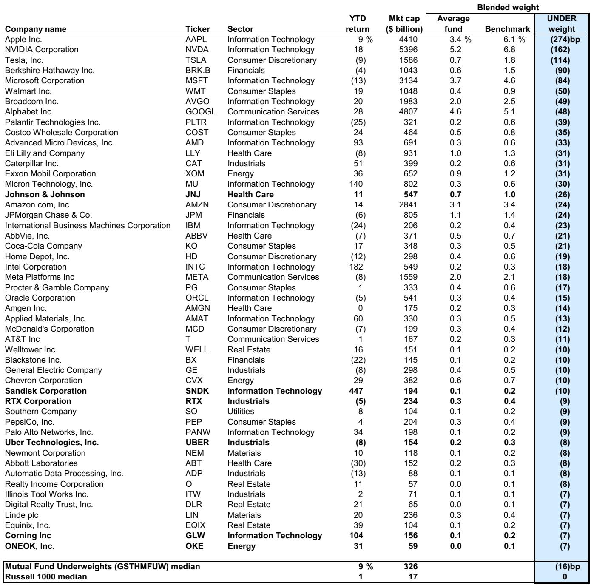
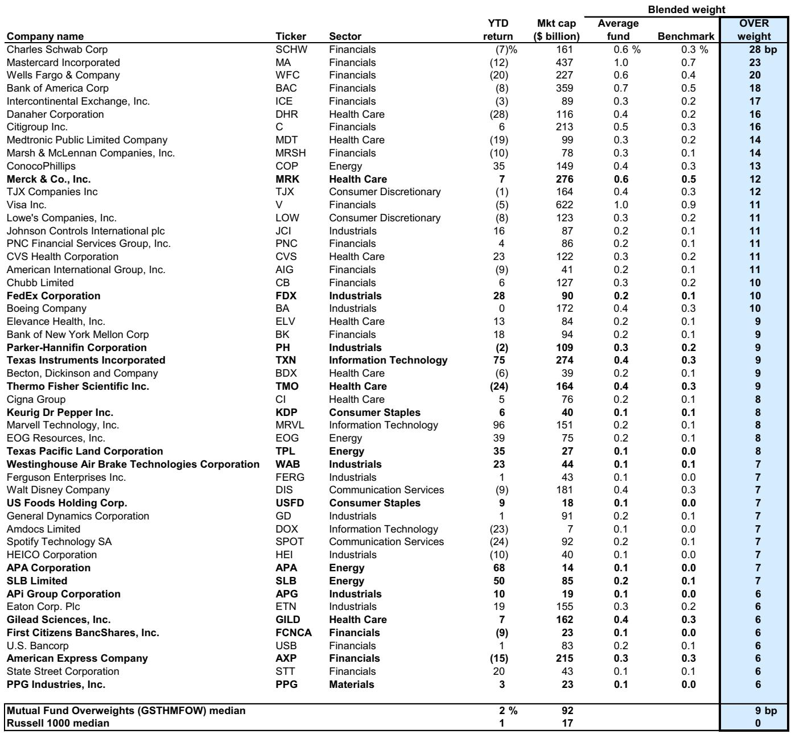
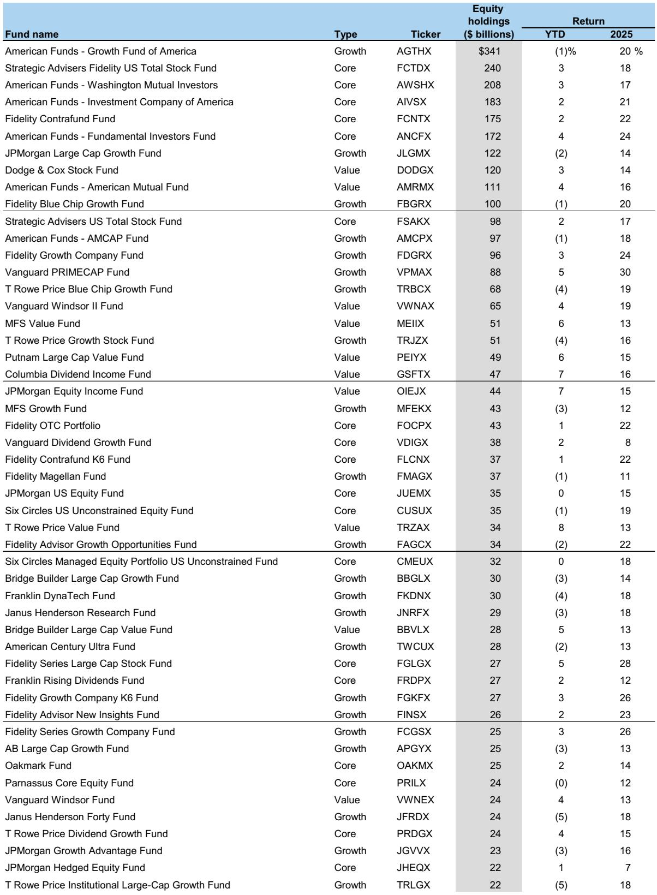

# 市场真正低估的不是AI需求，而是主动管理基金的结构性错位

截至2026年第一季度末，509只大型主动管理型共同基金，合计管理3.9万亿美元股票资产，正在经历一场罕见的内部再平衡。这份由某外资投行发布的Mutual Fundamentals报告揭示了一个核心判断：主动基金正在以2012年以来从未有过的力度，从软件股转向半导体股。但真正值得关注的不是方向本身，而是这一转向背后暴露出的主动管理能力困境——只有29%的大型基金跑赢基准，远低于37%的历史平均水平。当资金在被动化浪潮中持续流出主动基金，而主动基金又在大类配置上不断向基准靠拢，市场正在形成一种“被动化驱动的主动选股”，这才是对产业定价和资产配置最具破坏力的结构性力量。

报告提供的数据信号清晰而克制：主动基金对半导体的超配幅度（剔除巨头后）在Q1提升了25个基点至+49个基点，而对软件的低配幅度则加深了12个基点至-36个基点。这一背离不仅是方向性的，更是程度上的——两者之间的配置差距已创下2012年以来的最高纪录。但比方向更重要的是，这些变化发生的背景：主动基金整体跑输基准、现金仓位虽在上升但仍处历史低位、被动ETF继续吞噬主动份额。这意味着，主动基金的选择正在被被动指数、行业主题ETF和投资者赎回压力共同塑造，而不是纯粹基于个股价值的独立判断。

这份报告值得每个产业决策者和资产配置者细读。以下是从中提炼出的五个关键洞察，以及一个报告尚未完全回答的问题。

## 1. 半导体与软件的分化，本质是主动基金对“可验证叙事”的追逐

主动基金在Q1大幅加仓半导体、减持软件，表面上是AI主题的延续，但更深层的驱动力是两类资产在“可验证性”上的根本差异。半导体公司的订单、产能利用率、资本开支计划，都是可量化的硬数据，分析师和基金经理可以据此构建相对确定的盈利预测。而软件公司的AI变现路径仍以订阅制、用户增长、企业级部署进度为主，这些指标在季度尺度上难以形成清晰的加速信号。

报告数据显示，剔除巨头后，主动基金对半导体的超配已升至+49个基点，而对软件的低配则达到-36个基点——这是2012年以来两者差距最大的一次。但更值得注意的细节是，半导体超配幅度并未超过2023年Q1和2024年Q2的峰值。这说明主动基金并非全面看好整个半导体板块，而是在有选择地加仓那些与AI数据中心建设直接相关的标的。报告指出，20个最受基金增持的股票中，有6个来自某投行的AI数据中心篮子，包括ANET、GLW、SNDK、COHR等。

对产业决策者的含义：半导体公司的估值溢价正在从“行业beta”转向“AI数据中心敞口的纯度”。那些能够证明自己直接受益于超大规模云厂商资本开支的公司，将获得主动基金的持续配置；而那些AI叙事不够清晰、或收入结构仍以传统企业级为主的半导体公司，可能被排除在这一轮配置浪潮之外。对于软件公司而言，挑战更加严峻——主动基金对软件的低配已降至2012年以来的最低水平，这意味着软件公司需要拿出比硬件公司更硬的数据来证明AI的商业化进展。

## 2. “被动的主动”正在重塑基金选股逻辑，而非简单的行业轮动

如果将这一轮半导体与软件的分化简单理解为行业轮动，就会错过报告中最具有结构意义的信号：主动基金正在变得越来越“被动”。报告数据显示，Q1各行业配置变化的幅度，仅处于2012年以来历史分位的第4个百分位——也就是说，主动基金的行业配置变化之小，是过去14年里最少见的。

这不是因为基金经理们没有观点，而是因为他们的观点正在被两个力量压缩。第一，被动基金持续吞噬主动份额。2026年至今，美国股票型基金和ETF净流入1660亿美元，其中被动ETF贡献了2060亿美元，主动ETF贡献了950亿美元，而传统主动共同基金则净流出1460亿美元。第二，主动基金面临跑输基准的压力——今年只有29%的大型基金跑赢基准，远低于37%的历史均值。在这种环境下，基金经理不敢大幅偏离基准，因为一旦偏离方向错误，就会面临更严重的赎回。

结果是，主动基金的配置越来越像“加了主动标签的指数基金”。它们对Mag 7的超低配（723个基点）部分源于分散化监管要求，但更多是主动基金在被动化浪潮中不敢重仓跑赢的个股。报告显示，在净持股层面，主动基金在Q1减持了每一只Mag 7股票，其中GOOGL的减持幅度最大。这不是看空巨头，而是主动基金在被动化压力下的“风险预算压缩”。

对资产定价的含义：当主动基金的行为越来越像被动基金，市场定价的效率可能会下降。主动基金本该是发现错误定价、提供流动性的力量，但当它们集体向基准靠拢时，个股的定价更多由指数再平衡、ETF资金流和量化策略决定。这意味着，那些不在主流指数中、或权重过小的公司，可能面临系统性被低估的风险。

## 3. 金融股是主动基金最大的超配，但减持名单暴露了内部的分化

报告显示，主动基金当前最超配的两个行业是工业（+197个基点）和金融（+190个基点）。但一个反直觉的细节是：在20个最受基金减持的股票中，有9个来自金融板块。这意味着，主动基金对金融板块的整体超配，是由少数龙头股支撑的，而板块内部正在发生剧烈的分化。

这种分化可能反映了市场对金融股的两层认知分歧。第一层是利率环境：利率维持高位对银行的净息差是利好，但信贷质量的不确定性正在上升。主动基金可能在减持那些对商业地产或消费信贷敞口较大的银行，同时增持那些以财富管理或投资银行业务为主的金融机构。第二层是AI对金融业的渗透：部分金融机构正在通过AI降低运营成本、提升客户转化率，而另一些则可能面临被AI替代的风险。主动基金可能正在将资金从“AI替代对象”转向“AI受益者”。

对竞争格局的含义：金融股的超配并非行业性的看多信号，而是一个需要逐公司拆解的复杂判断。主动基金在金融板块内部的调仓，可能比整体超配数据更有信息含量。对于那些处于减持名单中的金融公司，我们需要追问：是被动减持（如指数权重调整），还是主动减持（如基本面恶化）？报告没有展开这一点，但这恰恰是完整报告中最值得深入阅读的部分。

## 4. IPO冲击被过度讨论，但真正的问题是指数纳入的机械性压力

报告专门讨论了IPO对市场的潜在冲击，结论是：主动基金在大型IPO前会增持现金，但历史上并未出现对现有大股票的明显抛售压力。对于被动基金而言，大型IPO的快速指数纳入确实可能对现有持仓产生机械性抛压，但报告指出，这些IPO在主要指数中的初始权重通常很小。

这一分析的价值在于，它帮助投资者区分了“市场叙事”和“实际影响”。IPO对市场的冲击，更多是情绪层面的，而非资金层面的。真正需要关注的是被动基金在指数再平衡时的机械性交易——这类交易不受基本面判断驱动，但可能对个股价格产生短期但显著的影响，尤其是当多个指数同时进行再平衡时。

对投资者的含义：与其担心IPO本身，不如关注指数再平衡的日历、规则变化以及被动基金的资金流。报告没有展开的是，当被动基金规模持续扩大，指数再平衡的机械性交易对个股定价的影响将越来越大。一个被纳入关键指数的公司，可能获得数十亿美元的被动买入，而不需要任何基本面变化。反过来，一个被剔除的公司，可能面临系统性抛售。这种“被动化驱动的定价”，正在改变我们对股票价值的基本理解。

## 5. 报告尚未回答的关键问题：主动基金的“被动化”是否会自我强化？

报告提供了大量关于主动基金配置变化的数据，但一个关键问题没有得到回答：主动基金的“被动化”趋势是否会自我强化？如果主动基金继续跑输基准，投资者将继续赎回主动基金、转向被动ETF。这会进一步压缩主动基金的风险预算，迫使它们更加接近基准配置。而更加接近基准配置，又会增加跑输基准的概率——因为当所有主动基金都持有相似的股票时，任何偏离都可能成为负超额收益的来源。

这一循环的终点是什么？一种可能是，主动基金彻底沦为“高费率指数基金”，行业集中度进一步提升。另一种可能是，当主动基金集体低配某个板块（如当前的软件），反而为该板块创造了一个逆向投资的机会——如果软件公司的基本面开始改善，主动基金将被迫从低配转向中性甚至超配，从而形成一波强劲的买入潮。

报告暗示了这种可能性：它列出了主动基金最超配的软件股和最低配的半导体股，并指出这些股票代表了“如果交易继续”的潜在买卖机会。但报告没有展开的是，这种“交易继续”的概率有多大，以及触发反转的条件是什么。这正是完整报告中最有价值的部分——它提供了数据框架，但需要读者自己去判断拐点。

## 顺着这些未解问题继续读完整报告

主动基金的配置变化从来不只是仓位数据，它是市场情绪、监管约束、资金流和基本面判断的最终交汇点。这份Mutual Fundamentals报告提供了截至Q1的最新全景图，但每一个数字背后都有更深的逻辑需要拆解：半导体超配的可持续性取决于超大规模云厂商的资本开支能否继续上调；软件低配的反转需要看到AI商业化落地的硬证据；金融板块的内部分化需要逐公司分析；而主动基金“被动化”的自我强化，可能是未来几年对资产定价影响最深的结构性变量。

这些问题的答案，不在本文的推理中，而在报告原始图表的数据细节和更完整的行业分析中。如果你对这些话题感兴趣，欢迎来星球微信群里继续讨论。我们会基于这份报告，进一步拆解主动基金持仓变化对具体行业和个股的定价含义，并跟踪Q2数据的变化趋势。报告中的Exhibit 9和Exhibit 10——主动基金最低配的半导体股和最高配的软件股——是值得反复研究的起点。

Personal reading notes and learning share only. Not investment advice.

