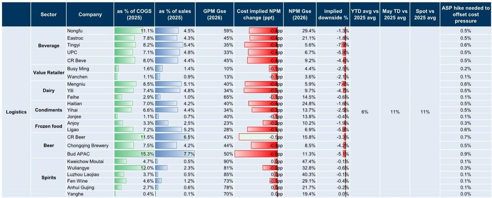

# 物流成本正在重新定价中国消费股的利润表

当市场还在为消费需求何时复苏争论不休时，一份来自某外资投行的最新研报揭示了一个更紧迫、也更可量化的变量：物流成本通胀正在从3-4月开始实质性地侵蚀企业利润，而市场对这一供给端冲击的定价可能才刚刚开始。

这份覆盖中国食品饮料、调味品、乳制品、啤酒等核心消费品类的报告，以柴油价格作为物流成本的代理变量，进行了系统的压力测试。其核心发现是：截至5月10日，柴油价格较2025年均价已上涨11%，这一涨幅理论上将导致覆盖公司净利润出现低个位数到高个位数的下行空间。其中，啤酒、乳制品和部分饮料企业承受的冲击最为显著。

这篇研读的目标不是复述报告中的每一个数字，而是提炼出这些数字背后对产业竞争格局和资产定价的深层含义——以及那些报告没有完全回答、但值得每个决策者追问的关键问题。

## 1. 物流成本占比的行业差异决定了谁在风暴中心

报告将覆盖公司按物流成本占销售成本（COGS）的比例分为三个梯队，这种区分本身就是一种判断：不是所有消费股都会受到同等冲击。

第一梯队是啤酒和饮料企业。以华润啤酒和百威亚太为例，物流成本分别占COGS的11.5%和15.3%，对应销售收入的6.5%和7.7%。这意味着，即便柴油价格只上涨11%，对净利润率的影响也高达0.4-0.5个百分点，对应净利润下行3-5%。

第二梯队是乳制品和调味品。蒙牛、伊利、海天味业、颐海国际的物流成本占比在7-8.5%之间。它们的净利润下行幅度在1.6-7.4%之间，差异主要来自各自的利润率水平——利润率越薄的企业，固定成本冲击的放大效应越明显。

第三梯队是白酒和价值零售商。茅台、五粮液、泸州老窖等高端白酒企业的物流成本占比极低（0.4-4.7%），且利润率极高，因此柴油涨价对净利润的冲击几乎可以忽略（0-0.6%）。价值零售商如名创优品和万物新的物流成本占比也很低，但因其利润率本身较薄，仍需关注。

这里的关键洞察是：物流成本通胀本质上是一种“利润率放大器”。它放大的不是收入端的波动，而是成本结构的脆弱性。那些物流成本占比高、同时利润率偏低的企业，将在这一轮成本周期中承受不成比例的利润压缩。

## 2. 柴油价格只是冰山一角，PET包装成本将在2026年下半年成为更大的变量

报告在开篇即点出一个容易被忽视的时间节点：包装材料（尤其是PET）的成本锁定红利正在逐渐消退，当2026年下半年新一轮采购季开始时，这一成本将从顺风转为逆风。

这是一个典型的“二阶效应”问题。当前市场可能已经注意到柴油价格上涨对物流成本的短期冲击，但很少有人系统性地将PET包装成本的周期性反转纳入2026年的盈利预测模型。报告附有一张包装材料锁定期汇总表，虽然未在摘要中完全展示，但其隐含的判断是清晰的：过去两年受益于低PET价格的企业，正在接近这一红利的终点。

将这个判断与物流成本冲击叠加来看，2026年消费企业的成本端可能面临“双轮驱动”的压力——物流成本持续高位，包装成本从底部回升。对于成本结构中这两个项目合计占比超过20%的企业（如部分饮料和啤酒公司），2026年的利润率展望可能需要更保守的假设。

但报告没有完全回答的是：这种成本压力的叠加效应，是否会被企业通过产品结构升级或提价来对冲？不同企业的对冲能力差异有多大？这正是我们后续需要持续跟踪的核心问题。

## 3. 提价能力是区分“能扛过去”和“会受伤”的核心变量

报告在压力测试表的最后一列给出了一个极具实用价值的指标：为抵消成本压力所需的价格涨幅。以华润啤酒为例，需要提价0.7%才能完全对冲柴油涨价的影响；百威亚太需要0.9%；而茅台只需要0.1%。

这个数字本身并不大，但它的意义不在于提价幅度本身，而在于提价的可行性。在当前的消费环境下，啤酒企业提价0.7%是否会被渠道和消费者接受？调味品企业提价0.5%是否会影响市场份额？白酒企业提价0.1%几乎可以忽略，但这是否意味着它们完全不受成本周期的影响？

答案并不简单。报告提供的是理论上的“所需提价幅度”，但现实中，企业的提价能力取决于品牌力、渠道控制力、竞争格局和消费环境四个因素。那些品牌溢价强、渠道忠诚度高、竞争格局稳定的企业，有能力将成本压力部分转嫁给下游；而那些依赖价格竞争、产品同质化严重的企业，可能不得不选择牺牲利润率来维持市场份额。

从这个角度看，物流成本通胀不仅是一个财务冲击，更是一个竞争格局的筛选器。它会让那些成本控制能力强、定价权稳固的企业在周期中进一步巩固优势，而那些成本结构脆弱、提价空间有限的企业则可能面临市场份额和利润率的双重压力。

## 4. 报告尚未完全回答的关键问题：成本传导的时间差与二阶效应

尽管报告提供了系统的敏感性分析，但有几个关键问题仍处于“未完全回答”的状态。

第一个问题是成本传导的时间差。柴油价格从批发市场到企业实际运输成本之间存在传导滞后。报告使用的是截至5月10日的现货价格，但企业通常有燃油采购合同或套保安排，实际成本上升可能滞后1-3个月。这意味着，二季度财报可能尚未完全反映这一冲击，真正的压力将在三季度甚至四季度显现。

第二个问题是竞争行为的变化。如果所有企业都面临类似的成本压力，它们是否会集体提价？还是会有企业选择“逆势降价”来抢占市场份额？历史经验表明，在成本上升周期中，行业龙头的定价策略往往决定了整个行业的利润率走向。如果龙头企业选择提价，行业整体利润率可能保持稳定；如果龙头企业选择降价，则可能引发一轮价格战，进一步压缩利润。

第三个问题是需求端的配合程度。成本推动的提价能否被消费者接受，取决于需求是否具有韧性。如果消费需求持续疲软，企业可能面临“提价丢份额、不提价丢利润”的两难困境。报告没有对需求端给出判断，但这恰恰是决定成本冲击最终影响的关键变量。

## 5. 投资者的观察框架：从“成本冲击幅度”转向“企业对冲能力”

基于报告的分析框架，投资者可以从以下三个维度构建自己的观察清单。

第一，识别成本暴露的“硬伤”企业。关注物流成本占COGS比例高于8%、同时净利润率低于10%的企业。这些企业在柴油价格每上涨10%时，净利润可能面临5%以上的下行风险。如果叠加PET包装成本在2026年的反转，风险将进一步放大。

第二，评估企业的成本对冲能力。关注企业是否披露了燃油采购合同、运输外包比例、以及是否有柴油价格套保安排。那些运输业务外包比例高、且合同中有燃油价格调整条款的企业，成本冲击可能被部分对冲。而那些自建物流车队、且没有价格调整机制的企业，将直接暴露在现货价格波动中。

第三，跟踪企业的定价行为。在接下来的季度财报电话会上，关注管理层对“是否提价”以及“提价幅度”的表态。如果多家企业同时提价，说明行业正在集体转嫁成本，利润率冲击可能小于市场预期；如果企业普遍选择不提价或小幅提价，则意味着需求端压力较大，利润率压缩可能成为趋势。

这三个维度的交叉分析，可以帮助投资者区分哪些企业的利润下行是“一次性冲击”，哪些是“结构性趋势”——前者可能提供买入机会，后者则需要更谨慎的持仓判断。

---

物流成本通胀只是2025-2026年消费企业成本端压力的一个缩影。包装材料、能源、运输、人工——每一个成本项目都在经历各自的周期。真正重要的不是某个单一成本项目的变化幅度，而是这些成本变化的叠加效应，以及企业面对这些变化时的应对能力差异。

这份研报的价值在于，它提供了一个可量化的起点，让投资者能够从“感觉成本在涨”转向“知道涨了多少、影响有多大”。但正如我们上面讨论的，从“数字”到“决策”之间，还有几个关键假设需要验证：成本传导的时间差有多长？竞争格局会如何演变？需求端能否配合提价？

这些问题，正是我们在后续的深度研读和社群讨论中需要持续跟踪的核心议题。欢迎来知识星球和微信群，与我们一起拆解这些未解问题，跟踪每一份关键研报背后的产业逻辑。

Personal reading notes and learning share only. Not investment advice.

