# China Real Estate

# A pause before more catalysts materialise

Equities

REMD

China

- We view the sector correction a healthy pull-back; fundamentals are still improving   
- June peak pre-sale season and more signs of home price stabilisation could help support valuation on forward earnings   
◆ Prefer CRL and C&D, both rated Buy

Rally derailed by macro factors: Our covered developers fell 4.5% on 18 May (HSI: -1.1%), which we attribute to profit-taking after the recent rally rather than renewed fundamental concerns. Lower expectations for US and China rate cuts, alongside rising US bond yields, are weighing on sentiment. Fundamentally, NBS data show tier-1 cities continued to post m-o-m growth in both primary and secondary markets, with Shanghai's growth accelerating. Month-to-date in May, tier-1 new home sales area rose 7% y-o-y, and secondary transactions in 10 cities increased 22% y-o-y. We remain constructive and believe the market is moving towards a natural equilibrium without policy stimulus. That said, after the sharp valuation recovery, further re-rating needs firmer evidence of a sustained recovery. We view this pull-back as a healthy pause for investors to re-engage with the sector.

Accommodative onshore rates but risks for offshore refinancing. Rising US bond yields may pressure equity valuations via a higher risk-free rate, but the direct impact on China property fundamentals should be limited. Onshore funding remains supportive: commercial mortgage rates (3.1%) and housing provident fund rates (2.6%) are at historical lows, and the 10-year government bond yield continues to trend down. With our economists expecting the policy rate to stay stable through 2026, mortgage rates should remain low, though further cuts are limited. Offshore, Longfor and Vanke have USD maturities in 2027; refinancing in a higher-yield environment could push borrowing costs higher.

Await transmission from housing stabilisation to credit expansion. In April, household medium- to long-term lending (a mortgage proxy) fell by RMB341bn, a record low. This sharp net contraction suggests rising early mortgage prepayments and weaker willingness to use leverage for home purchases. The transmission from early market stabilisation to credit expansion will take time. As we noted, the reset in household housing wealth is likely to complete in 2026 (Housing wealth reset, 16 March 2026). A stronger wealth effect could then support credit expansion and provide another leg to the housing recovery.

Stock picks. CR Land and C&D (both Buy) remain our preferred picks among developers with their rich pipelines of high-end projects in the coming months, which strengthen their earnings recovery in 2027 onwards. We believe CRL will also benefit from the investment property revaluation theme as the C-REITs market expands, while C&D still has room to catch up in terms of YTD share price performance.

# Michelle Kwok\*

Head of Asia Real Estate and HK Equity Research  
The Hongkong and Shanghai Banking Corporation Limited  
michellekwok@hsbc.com.hk  
+852 2996 6918

# Oliver Yu\*

Analyst, Asia Real Estate  
The Hongkong and Shanghai Banking Corporation Limited  
oliver.y.o.x.yu@hsbc.com.hk  
+852 2288 2050

# Stephen Wang\*, CFA

Analyst, Asia Real Estate
The Hongkong and Shanghai Banking Corporation Limited
stephen.wang@hsbc.com.hk
+852 2284 1675

\* Employed by a non-US affiliate of HSBC Securities (USA) Inc, and is not registered/qualified pursuant to FINRA regulations

HSBC Funding the Future Survey

Sentiment, AI and Private Credit

Click to view

# Disclosures & Disclaimer

This report must be read with the disclosures and the analyst certifications in the Disclosure appendix, and with the Disclaimer, which forms part of it.

Issuer of report: The Hongkong and Shanghai Banking Corporation Limited

View HSBC Global Investment Research at:

https://www.research.hsbc.com

Figure 1: Household mid-long term new lending   
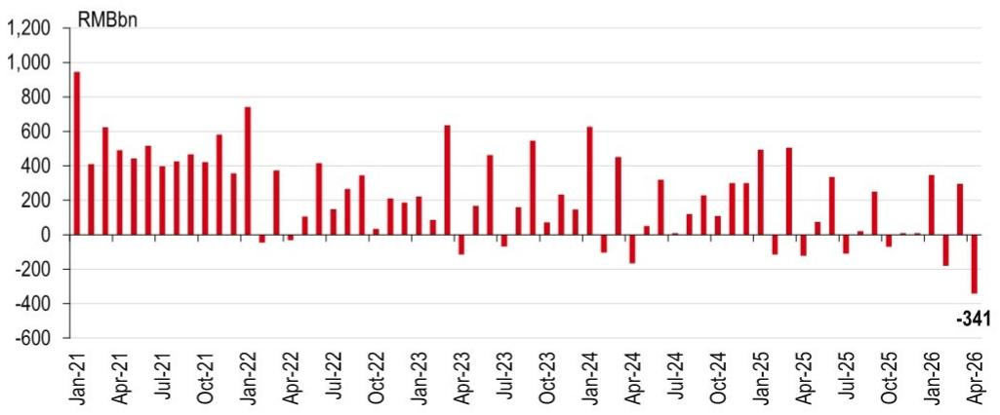

bar

| Date | RMBbn |
|---|---|
| Jan-21 | 950 |
| Apr-21 | 400 |
| Jul-21 | 500 |
| Oct-21 | 450 |
| Jan-22 | 750 |
| Apr-22 | -50 |
| Jul-22 | 400 |
| Oct-22 | 350 |
| Jan-23 | 200 |
| Apr-23 | 650 |
| Jul-23 | -100 |
| Oct-23 | 550 |
| Jan-24 | 650 |
| Apr-24 | -150 |
| Jul-24 | 300 |
| Oct-24 | 200 |
| Jan-25 | 500 |
| Apr-25 | -100 |
| Jul-25 | 350 |
| Oct-25 | -50 |
| Jan-26 | 350 |
| Apr-26 | -341 |

Source: NBS, WIND, HSBC

Figure 2: Commercial mortgage rate and housing provident fund rate   
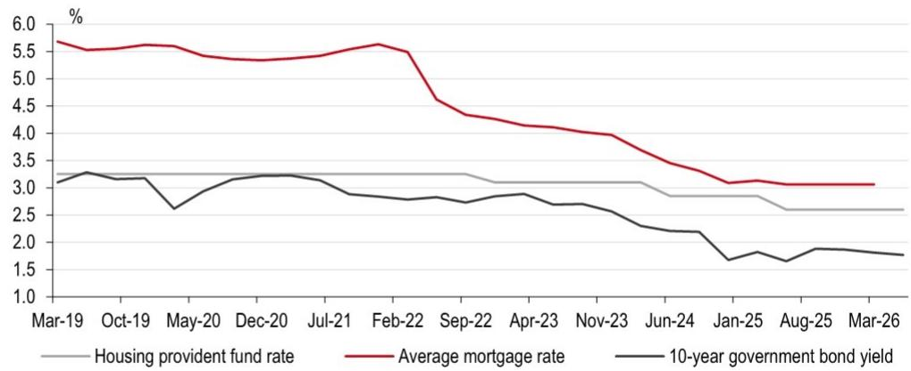

line

| Date    | Housing provident fund rate | Average mortgage rate | 10-year government bond yield |
|---------|-----------------------------|------------------------|--------------------------------|
| Mar-19  | 3.2                         | 5.7                    | 3.2                            |
| Oct-19  | 3.2                         | 5.6                    | 3.1                            |
| May-20  | 3.2                         | 5.5                    | 2.6                            |
| Dec-20  | 3.2                         | 5.4                    | 3.2                            |
| Jul-21  | 3.2                         | 5.4                    | 3.1                            |
| Feb-22  | 3.2                         | 5.6                    | 2.9                            |
| Sep-22  | 3.2                         | 4.4                    | 2.8                            |
| Apr-23  | 3.1                         | 4.1                    | 2.9                            |
| Nov-23  | 3.1                         | 4.0                    | 2.7                            |
| Jun-24  | 3.0                         | 3.6                    | 2.3                            |
| Jan-25  | 2.9                         | 3.1                    | 1.7                            |
| Aug-25  | 2.7                         | 3.0                    | 1.8                            |
| Mar-26  | 2.6                         | 3.0                    | 1.8                            |

Source: NBS, WIND, HSBC

Figure 3: Offshore bond maturities in 2026-27 

<table><tr><td>Company</td><td>Maturity date</td><td>Currency</td><td>Principal (m)</td><td>Coupon rate</td></tr><tr><td>COLI</td><td>25-Oct-26</td><td>CNY</td><td>3,190</td><td>3.500%</td></tr><tr><td>Yuexiu</td><td>15-Nov-26</td><td>CNY</td><td>1,210</td><td>4.000%</td></tr><tr><td>Longfor</td><td>13-Apr-27</td><td>USD</td><td>250</td><td>3.375%</td></tr><tr><td>Yuexiu</td><td>12-Jul-27</td><td>CNY</td><td>1,690</td><td>4.100%</td></tr><tr><td>Vanke</td><td>9-Nov-27</td><td>USD</td><td>1,000</td><td>3.975%</td></tr></table>

Source: Bloomberg, WIND, HSBC

Figure 4: MTD primary home sales by GFA in 30 city: tier-1 cities take lead with $7\%$ y-o-y 

<table><tr><td>m sqm</td><td>1-16 May</td><td>m-o-m</td><td>y-o-y</td><td>YTD y-o-y</td><td>2025 y-o-y</td></tr><tr><td>Tier-1</td><td>1.2</td><td>-8%</td><td>7%</td><td>-6%</td><td>-13%</td></tr><tr><td>Tier-2</td><td>1.5</td><td>3%</td><td>0%</td><td>-12%</td><td>-14%</td></tr><tr><td>Tier-3</td><td>0.7</td><td>13%</td><td>-22%</td><td>-14%</td><td>-13%</td></tr><tr><td>30 cities total</td><td>3.4</td><td>0%</td><td>-3%</td><td>-11%</td><td>-13%</td></tr></table>

Source: WIND, HSBC

Figure 5: MTD average secondary units sold in 10 cities +22% y-o-y   
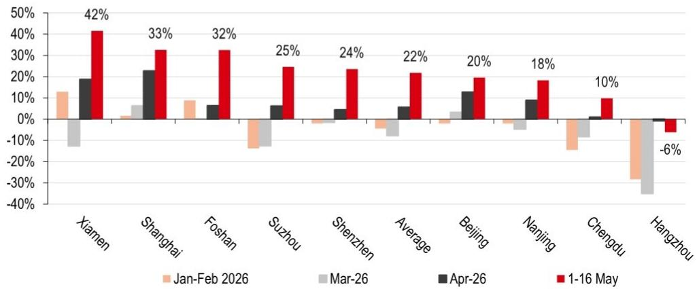

bar

| City | Jan-Feb 2026 (%) | Mar-26 (%) | Apr-26 (%) | 1-16 May (%) |
| :--- | :--- | :--- | :--- | :--- |
| Xiamen | 12 | -15 | 19 | 42 |
| Shanghai | 1 | 6 | 23 | 33 |
| Foshan | 9 | 0 | 6 | 32 |
| Suzhou | -15 | -12 | 6 | 25 |
| Shenzhen | -1 | -1 | 4 | 24 |
| Average | -3 | -8 | 5 | 22 |
| Beijing | -1 | 3 | 12 | 20 |
| Nanjing | -1 | -4 | 9 | 18 |
| Chengdu | -15 | -7 | 1 | 10 |
| Hangzhou | -30 | -35 | -1 | -6 |

Source: WIND, HSBC

Figure 6: Primary ASP m-o-m   
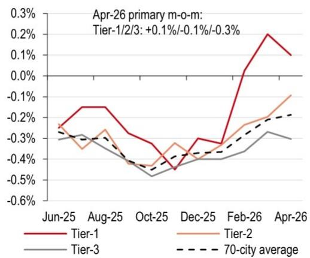

line

| Month   | Tier-1 | Tier-2 | Tier-3 | 70-city average |
|---------|--------|--------|--------|-----------------|
| Jun-25  | -0.2%  | -0.2%  | -0.3%  | -0.3%           |
| Aug-25  | -0.1%  | -0.3%  | -0.4%  | -0.4%           |
| Oct-25  | -0.3%  | -0.4%  | -0.5%  | -0.5%           |
| Dec-25  | -0.4%  | -0.3%  | -0.4%  | -0.4%           |
| Feb-26  | 0.1%   | -0.2%  | -0.3%  | -0.2%           |
| Apr-26  | 0.2%   | -0.1%  | -0.3%  | -0.2%           |

Source: NBS, HSBC

Figure 7: Secondary ASP m-o-m   
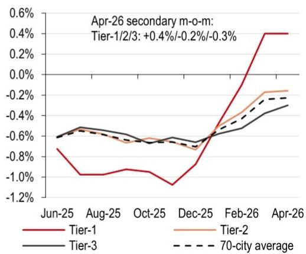

line

| Month    | Tier-1  | Tier-2  | Tier-3  | 70-city average |
| -------- | ------- | ------- | ------- | --------------- |
| Jun-25   | -0.8%   | -0.6%   | -0.6%   | -0.6%           |
| Aug-25   | -1.0%   | -0.6%   | -0.6%   | -0.6%           |
| Oct-25   | -1.0%   | -0.6%   | -0.6%   | -0.6%           |
| Dec-25   | -1.0%   | -0.6%   | -0.6%   | -0.6%           |
| Feb-26   | 0.4%    | -0.2%   | -0.4%   | -0.3%           |
| Apr-26   | 0.4%    | -0.2%   | -0.3%   | -0.3%           |

Source: NBS, HSBC

Figure 8: Primary ASP y-o-y   
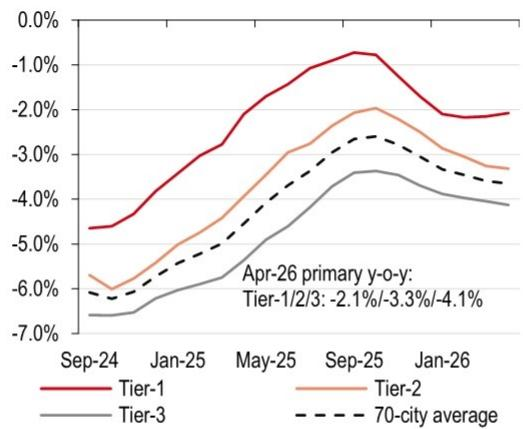

line

| Date    | Tier-1  | Tier-2  | Tier-3  | 70-city average |
|---------|---------|---------|---------|-----------------|
| Sep-24  | -5.0%   | -6.0%   | -6.5%   | -6.0%           |
| Jan-25  | -4.0%   | -5.0%   | -5.5%   | -5.0%           |
| May-25  | -2.0%   | -3.0%   | -4.0%   | -3.5%           |
| Sep-25  | -1.0%   | -2.0%   | -3.0%   | -2.5%           |
| Jan-26  | -2.0%   | -3.0%   | -4.0%   | -3.5%           |

Source: NBS, HSBC

Figure 9: Secondary ASP y-o-y   
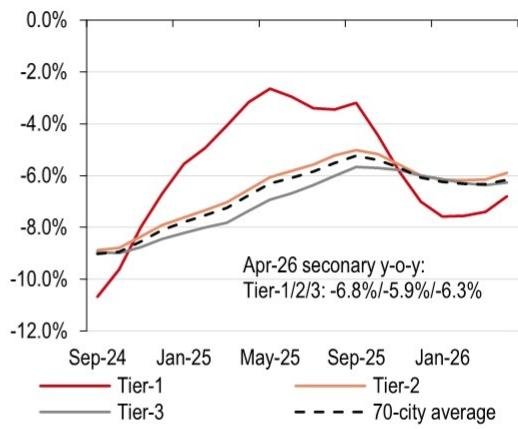

line

| Date     | Tier-1   | Tier-2   | Tier-3   | 70-city average |
| -------- | -------- | -------- | -------- | --------------- |
| Apr-26 secondary y-o-y | -6.8%    | -5.9%    | -6.3%    | -6.3%           |

Source: NBS, HSBC

Figure 10: Project launches and sell-through since end-April 

<table><tr><td>City</td><td>Chinese name</td><td>Project (English)</td><td>Developer</td><td>Land acquisiti on date</td><td>Latest launch date</td><td>No. of batch</td><td>No. of offering units</td><td>AV (RMB per sqm)</td><td>ASP (RMB per sqm)</td><td>Unit size (sqm)</td><td>Unit price (RMBm)</td><td>Subscrip tion sell- through</td></tr><tr><td>Shanghai</td><td>翡云悦府·悦墅</td><td>Prism Villa</td><td>CRL, Yuexiu, Nengjian</td><td>Nov-24</td><td>May-26</td><td>2nd</td><td>20</td><td>74,426</td><td>127,800</td><td>190-230</td><td>24-34</td><td>100%</td></tr><tr><td>Guangzhou</td><td>保利海韵</td><td>The Origin</td><td>Poly</td><td>Dec-25</td><td>May-26</td><td>1st</td><td>324</td><td>36,000</td><td>59,700</td><td>90-170</td><td>5-10</td><td>100%</td></tr><tr><td>Shenzhen</td><td>龙湖观萃</td><td>Inner Land</td><td>Longfor</td><td>Dec-25</td><td>May-26</td><td>1st</td><td>92</td><td>12,039</td><td>35,000</td><td>89-138</td><td>2.8-5</td><td>100%</td></tr><tr><td>Shenzhen</td><td>观潮府</td><td>Marivista</td><td>CMSK, CRL</td><td>Aug-25</td><td>Apr-26</td><td>1st</td><td>222</td><td>59,586</td><td>130,000</td><td>144-536</td><td>20-100</td><td>95%</td></tr><tr><td>Hangzhou</td><td>奥映世纪</td><td>The One New Age</td><td>Binjiang, Jindi</td><td>Jun-25</td><td>Apr-26</td><td>1st</td><td>86</td><td>54,473</td><td>87,681</td><td>238-388</td><td>15-45</td><td>94%</td></tr><tr><td>Hangzhou</td><td>建发栖湖云庄</td><td>Qihu Yunzhuang</td><td>C&amp;D</td><td>Mar-25</td><td>Apr-26</td><td>1st</td><td>38</td><td>88,029</td><td>154,262</td><td>300-600</td><td>34-100</td><td>66%</td></tr><tr><td>Hangzhou</td><td>中海万潮玖序</td><td>AVENIR</td><td>COLI</td><td>Dec-24</td><td>Apr-26</td><td>1st</td><td>42</td><td>44,673</td><td>104,925</td><td>233-413</td><td>22-100</td><td>100%</td></tr></table>

Source: Company information, Guardian, Leju, HSBC

Figure 11: Valuation summary 

<table><tr><td>Company</td><td>Ticker</td><td>Rating</td><td>Share Price (HKD)</td><td>Target Price (HKD)</td><td>Mkt Cap (USDbn)</td><td>3M ADTV (USDm)</td><td>NAV (HKD/sh)</td><td>(Disc)/ Prem (%)</td><td>2025e</td><td>PE (x) 2026e</td><td>2027e</td><td>Yield (%) 2025e</td><td>PB (x) 2024a</td><td>Net Gearing (%)</td></tr><tr><td colspan="15">Property developers</td></tr><tr><td>C&amp;D Int&#x27;l</td><td>1908 HK</td><td>Buy</td><td>17.49</td><td>19.90</td><td>5.0</td><td>13.9</td><td>42.4</td><td>(59)</td><td>8.6</td><td>7.6</td><td>7.1</td><td>5.1</td><td>0.8</td><td>28</td></tr><tr><td>COLI</td><td>688 HK</td><td>Buy</td><td>16.51</td><td>16.50</td><td>23.1</td><td>50.1</td><td>25.7</td><td>(36)</td><td>12.0</td><td>13.1</td><td>12.3</td><td>3.0</td><td>0.4</td><td>34</td></tr><tr><td>CR Land</td><td>1109 HK</td><td>Buy</td><td>37.68</td><td>43.80</td><td>34.3</td><td>80.2</td><td>55.5</td><td>(32)</td><td>10.3</td><td>9.8</td><td>9.2</td><td>3.6</td><td>0.9</td><td>39</td></tr><tr><td>China Vanke</td><td>2202 HK</td><td>Reduce</td><td>3.08</td><td>2.50</td><td>6.3</td><td>10.6</td><td>5.9</td><td>(48)</td><td>n.m.</td><td>n.m.</td><td>n.m.</td><td>-</td><td>0.2</td><td>111</td></tr><tr><td>CIFI</td><td>884 HK</td><td>Hold</td><td>0.07</td><td>0.08</td><td>0.2</td><td>0.9</td><td>0.5</td><td>(86)</td><td>n.m.</td><td>n.m.</td><td>n.m.</td><td>-</td><td>0.0</td><td>74</td></tr><tr><td>Country Garden</td><td>2007 HK</td><td>Hold</td><td>0.27</td><td>0.30</td><td>1.6</td><td>12.9</td><td>1.9</td><td>(86)</td><td>2.0</td><td>n.m.</td><td>n.m.</td><td>-</td><td>n.m.</td><td>n.m.</td></tr><tr><td>China Jinmao</td><td>817 HK</td><td>Hold</td><td>1.86</td><td>1.50</td><td>3.2</td><td>9.1</td><td>3.5</td><td>(47)</td><td>31.0</td><td>32.1</td><td>30.2</td><td>1.4</td><td>0.6</td><td>87</td></tr><tr><td>Greentown China</td><td>3900 HK</td><td>Hold</td><td>10.44</td><td>9.50</td><td>3.4</td><td>13.5</td><td>17.9</td><td>(42)</td><td>n.m.</td><td>34.1</td><td>12.8</td><td>-</td><td>0.6</td><td>70</td></tr><tr><td>Longfor</td><td>960 HK</td><td>Hold</td><td>9.26</td><td>8.60</td><td>8.4</td><td>20.1</td><td>25.4</td><td>(64)</td><td>n.m.</td><td>43.5</td><td>16.0</td><td>0.9</td><td>0.3</td><td>52</td></tr><tr><td>Seazen</td><td>1030 HK</td><td>Buy</td><td>2.15</td><td>3.00</td><td>2.0</td><td>5.5</td><td>7.4</td><td>(71)</td><td>34.5</td><td>9.8</td><td>7.0</td><td>-</td><td>0.3</td><td>56</td></tr><tr><td>Shenzhen Inv</td><td>604 HK</td><td>Hold</td><td>0.83</td><td>0.70</td><td>0.9</td><td>1.0</td><td>2.2</td><td>(62)</td><td>14.7</td><td>24.8</td><td>16.2</td><td>-</td><td>0.2</td><td>92</td></tr><tr><td>Yanlord (SGD)</td><td>YLLG SP</td><td>Hold</td><td>0.77</td><td>0.53</td><td>1.2</td><td>2.5</td><td>1.6</td><td>(52)</td><td>n.m.</td><td>20.5</td><td>19.1</td><td>-</td><td>0.3</td><td>39</td></tr><tr><td>Yuexiu</td><td>123 HK</td><td>Buy</td><td>4.66</td><td>5.10</td><td>2.4</td><td>5.7</td><td>14.7</td><td>(68)</td><td>62.4</td><td>15.6</td><td>9.9</td><td>3.6</td><td>0.3</td><td>72</td></tr><tr><td>Average</td><td></td><td></td><td></td><td></td><td></td><td></td><td></td><td>(58)</td><td>22.0</td><td>21.1</td><td>14.0</td><td>1.4</td><td>0.4</td><td>63</td></tr><tr><td colspan="15">Property brokerage service providers</td></tr><tr><td>KE Holdings (Beike) (USD)</td><td>BEKE US</td><td>Buy</td><td>18.17</td><td>19.10</td><td>21.2</td><td>71.5</td><td>n.a.</td><td>n.a.</td><td>27.1</td><td>23.0</td><td>17.7</td><td>1.6</td><td>2.1</td><td>net cash</td></tr><tr><td colspan="15">Property managers</td></tr><tr><td>COPL</td><td>2669 HK</td><td>Hold</td><td>4.05</td><td>4.30</td><td>1.7</td><td>4.7</td><td>n.a.</td><td>n.a.</td><td>7.3</td><td>6.8</td><td>6.4</td><td>4.9</td><td>2.3</td><td>net cash</td></tr><tr><td>CR Mixc</td><td>1209 HK</td><td>Hold</td><td>48.82</td><td>48.00</td><td>14.2</td><td>16.8</td><td>n.a.</td><td>n.a.</td><td>24.4</td><td>22.1</td><td>20.4</td><td>3.8</td><td>5.8</td><td>net cash</td></tr><tr><td>CG Services</td><td>6098 HK</td><td>Hold</td><td>6.32</td><td>6.10</td><td>2.6</td><td>5.7</td><td>n.a.</td><td>n.a.</td><td>7.2</td><td>6.7</td><td>5.8</td><td>8.5</td><td>0.5</td><td>net cash</td></tr><tr><td>Greentown Serv</td><td>2869 HK</td><td>Buy</td><td>4.74</td><td>5.10</td><td>1.9</td><td>1.7</td><td>n.a.</td><td>n.a.</td><td>14.7</td><td>13.2</td><td>12.1</td><td>5.1</td><td>1.7</td><td>net cash</td></tr><tr><td>Sunac Services</td><td>1516 HK</td><td>Hold</td><td>1.16</td><td>0.90</td><td>0.5</td><td>1.8</td><td>n.a.</td><td>n.a.</td><td>8.7</td><td>5.4</td><td>5.2</td><td>6.0</td><td>0.6</td><td>net cash</td></tr><tr><td>Average</td><td></td><td></td><td></td><td></td><td></td><td></td><td></td><td></td><td>12.5</td><td>10.8</td><td>10.0</td><td>5.7</td><td>2.2</td><td></td></tr></table>

Note: Priced at close of 15 May 2026. NA – Not applicable/available. NM – Not meaningful.
Source: Bloomberg, HSBC estimates

# Valuation charts

Figure 12: SOE developers' forward PE (x)   
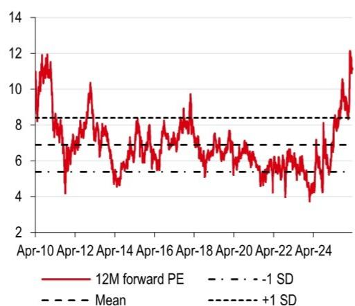

line

| Date    | 12M forward PE | Mean | -1 SD | +1 SD |
|---------|----------------|------|-------|-------|
| Apr-10  | ~12            | ~8   | 7     | 8     |
| Apr-12  | ~8             | ~6   | 7     | 8     |
| Apr-14  | ~6             | ~5   | 7     | 8     |
| Apr-16  | ~8             | ~6   | 7     | 8     |
| Apr-18  | ~9             | ~6   | 7     | 8     |
| Apr-20  | ~7             | ~5   | 7     | 8     |
| Apr-22  | ~6             | ~5   | 7     | 8     |
| Apr-24  | ~12            | ~8   | 7     | 8     |

Note: The average forward PE multiples of COLI, CRL, Vanke, Greentown, Yuexiu, C&D Int'l, and Longfor are based on Bloomberg consensus.
Source: Bloomberg, HSBC

Figure 13: SOE developers' NAV discount (%)   
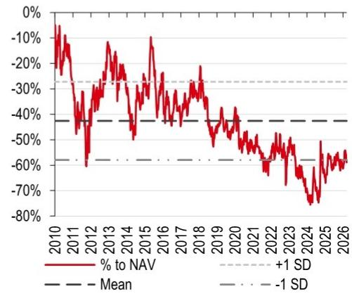

line

| Year | % to NAV | +1 SD | Mean | -1 SD |
|------|----------|-------|------|-------|
| 2010 | -5%      | -30%  | -40% | -60%  |
| 2011 | -10%     | -30%  | -40% | -60%  |
| 2012 | -20%     | -30%  | -40% | -60%  |
| 2013 | -15%     | -30%  | -40% | -60%  |
| 2014 | -25%     | -30%  | -40% | -60%  |
| 2015 | -10%     | -30%  | -40% | -60%  |
| 2016 | -25%     | -30%  | -40% | -60%  |
| 2017 | -30%     | -30%  | -40% | -60%  |
| 2018 | -25%     | -30%  | -40% | -60%  |
| 2019 | -35%     | -30%  | -40% | -60%  |
| 2020 | -40%     | -30%  | -40% | -60%  |
| 2021 | -45%     | -30%  | -40% | -60%  |
| 2022 | -50%     | -30%  | -40% | -60%  |
| 2023 | -55%     | -30%  | -40% | -60%  |
| 2024 | -75%     | -30%  | -40% | -60%  |
| 2025 | -65%     | -30%  | -40% | -60%  |
| 2026 | -60%     | -30%  | -40% | -60%  |

Source: Bloomberg, HSBC estimates

Figure 14: 2026 YTD share price performance   
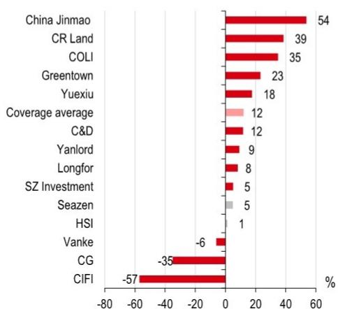

bar

| Entity | Value (%) |
| :--- | :--- |
| China Jinmao | 54 |
| CR Land | 39 |
| COLI | 35 |
| Greentown | 23 |
| Yuexiu | 18 |
| Coverage average | 12 |
| C&D | 12 |
| Yanlord | 9 |
| Longfor | 8 |
| SZ Investment | 5 |
| Seazen | 5 |
| HSI | 1 |
| Vanke | -6 |
| CG | -35 |
| CIFI | -57 |

Note: Priced as of 15 May 2026.
Source: Bloomberg, HSBC

Figure 15: SOE developers' trailing PB (x)   
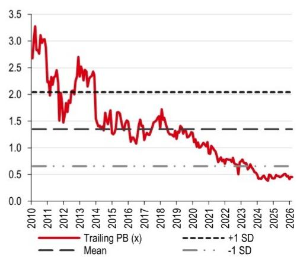

line

| Year | Trailing PB (x) | Mean | +1 SD | -1 SD |
|------|-----------------|------|-------|-------|
| 2010 | 3.3             | 1.4  | 2.0   | 0.7   |
| 2011 | 2.8             | 1.4  | 2.0   | 0.7   |
| 2012 | 2.0             | 1.4  | 2.0   | 0.7   |
| 2013 | 2.7             | 1.4  | 2.0   | 0.7   |
| 2014 | 2.4             | 1.4  | 2.0   | 0.7   |
| 2015 | 1.6             | 1.4  | 2.0   | 0.7   |
| 2016 | 1.5             | 1.4  | 2.0   | 0.7   |
| 2017 | 1.4             | 1.4  | 2.0   | 0.7   |
| 2018 | 1.7             | 1.4  | 2.0   | 0.7   |
| 2019 | 1.4             | 1.4  | 2.0   | 0.7   |
| 2020 | 1.3             | 1.4  | 2.0   | 0.7   |
| 2021 | 1.1             | 1.4  | 2.0   | 0.7   |
| 2022 | 0.9             | 1.4  | 2.0   | 0.7   |
| 2023 | 0.8             | 1.4  | 2.0   | 0.7   |
| 2024 | 0.6             | 1.4  | 2.0   | 0.7   |
| 2025 | 0.5             | 1.4  | 2.0   | 0.7   |
| 2026 | 0.4             | 1.4  | 2.0   | 0.7   |

Note: The average trailing PB multiples of COLI, CRL, Vanke, Greentown, Yuexiu, and C&D International are based on monthly data.
Source: Bloomberg, HSBC

Valuation and risks 

<table><tr><td colspan="2"></td><td>Valuation</td><td>Risks to our view</td></tr><tr><td>CR Land 1109 HK</td><td>Current price:HKD37.68Target price:HKD43.80Upside:16.2%</td><td>Methodology: The NAV is calculated by adding up the gross asset values (GAVs) of development projects (DPs) and investment projects (IPs), then subtracting net debt, based on company reports. Our assignment of a target discount is on a relative basis; companies that share similar operational/financial strengths and execution track records should be assigned the same target discount.Assumptions: A NAV discount of 21%, set a 1 SD above the historical mean, is applied to our NAV per share estimate of HKD55.50 (all unchanged). We use a discount that is 1 SD above the historical mean in the valuation to reflect CR Land&#x27;s increase in sales momentum, strong recurrent income, and solid execution track record.Our unchanged target price of HKD43.80 implies c16% upside from the current share price; we maintain our Buy rating on the stock as it is supported by the potential to unlock the value of its IP portfolio and a promising margin recovery trajectory.Michelle Kwok* | michellekwok@hsbc.com.hk | +852 2996 6918</td><td>Key downside risks◆ Inability to maintain sales momentum◆ Lower-than-expected margins◆ Any material slowdown in the shopping mall segment◆ Inability to maintain dividend stability◆ Uncertainties related to macroeconomic and property-specific policies.</td></tr><tr><td>C&amp;D International 1908 HK</td><td>Current price:HKD17.49Target price:HKD19.90Upside:13.8%</td><td>Methodology: The NAV is calculated by adding up the gross asset values (GAVs) of development projects (DPs) and investment projects (IPs), then subtracting net debt, based on company reports. Our assignment of a target discount is on a relative basis; companies that share similar operational/financial strengths and execution track records should be assigned the same target discount.Assumptions: A NAV discount of 53%, set at 0.25 SD above the historical mean, is applied to our NAV per share estimate of HKD42.40 (all unchanged). We use a discount that is 0.25 SD above the historical mean to reflect the encouraging margin recovery trend and unique competitive edge supported by a young landbank.Our unchanged target price of HKD19.90 implies c14% upside from the current share price; we maintain our Buy rating on the stock, given its young land bank and relatively high earnings visibility.Stephen Wang*, CFA | stephen.wang@hsbc.com.hk | +852 2284 1675</td><td>Key downside risks◆ Land acquisition slowdown◆ Sharp sales deterioration◆ Steep margin compression◆ Share placement at deep discounts◆ JV project risks◆ Policy uncertainties.</td></tr></table>

Note: Priced at close of 15 May 2026.   
\*Employed by a non-US affiliate of HSBC Securities (USA) Inc. and not registered/qualified pursuant to FINRA regulations.   
Source: Bloomberg, HSBC estimates

# Disclosure appendix

# Analyst Certification

The following analyst(s), economist(s), or strategist(s) who is(are) primarily responsible for this report, including any analyst(s) whose name(s) appear(s) as author of an individual section or sections of the report and any analyst(s) named as the covering analyst(s) of a subsidiary company in a sum-of-the-parts valuation certifies(y) that the opinion(s) on the subject security(ies) or issuer(s), any views or forecasts expressed in the section(s) of which such individual(s) is(are) named as author(s), and any other views or forecasts expressed herein, including any views expressed on the back page of the research report, accurately reflect their personal view(s) and that no part of their compensation was, is or will be directly or indirectly related to the specific recommendation(s) or views contained in this research report: Michelle Kwok, Oliver Yu and Stephen Wang, CFA

# Important disclosures

# Equities: Stock ratings and basis for financial analysis

HSBC and its affiliates, including the issuer of this report ("HSBC") believes an investor's decision to buy or sell a stock should depend on individual circumstances such as the investor's existing holdings, risk tolerance and other considerations and that investors utilise various disciplines and investment horizons when making investment decisions. Ratings should not be used or relied on in isolation as investment advice. Different securities firms use a variety of ratings terms as well as different rating systems to describe their recommendations and therefore investors should carefully read the definitions of the ratings used in each research report. Further, investors should carefully read the entire research report and not infer its contents from the rating because research reports contain more complete information concerning the analysts' views and the basis for the rating.

# From 23rd March 2015 HSBC has assigned ratings on the following basis:

The target price is based on the analyst's assessment of the stock's actual current value, although we expect it to take six to 12 months for the market price to reflect this. When the target price is more than $20\%$ above the current share price, the stock will be classified as a Buy; when it is between $5\%$ and $20\%$ above the current share price, the stock may be classified as a Buy or a Hold; when it is between $5\%$ below and $5\%$ above the current share price, the stock will be classified as a Hold; when it is between $5\%$ and $20\%$ below the current share price, the stock may be classified as a Hold or a Reduce; and when it is more than $20\%$ below the current share price, the stock will be classified as a Reduce.

Our ratings are re-calibrated against these bands at the time of any 'material change' (initiation or resumption of coverage, change in target price or estimates).

Upside/Downside is the percentage difference between the target price and the share price.

# Prior to this date, HSBC's rating structure was applied on the following basis:

For each stock we set a required rate of return calculated from the cost of equity for that stock's domestic or, as appropriate, regional market established by our strategy team. The target price for a stock represented the value the analyst expected the stock to reach over our performance horizon. The performance horizon was 12 months. For a stock to be classified as Overweight, the potential return, which equals the percentage difference between the current share price and the target price, including the forecast dividend yield when indicated, had to exceed the required return by at least 5 percentage points over the succeeding 12 months (or 10 percentage points for a stock classified as Volatile\*). For a stock to be classified as Underweight, the stock was expected to underperform its required return by at least 5 percentage points over the succeeding 12 months (or 10 percentage points for a stock classified as Volatile\*). Stocks between these bands were classified as Neutral.

\*A stock was classified as volatile if its historical volatility had exceeded $40\%$ , if the stock had been listed for less than 12 months (unless it was in an industry or sector where volatility is low) or if the analyst expected significant volatility. However, stocks which we did not consider volatile may in fact also have behaved in such a way. Historical volatility was defined as the past month's average of the daily 365-day moving average volatilities. In order to avoid misleadingly frequent changes in rating, however, volatility had to move 2.5 percentage points past the $40\%$ benchmark in either direction for a stock's status to change.

# Rating distribution for long-term investment opportunities

As of 31 March 2026, the distribution of all independent ratings published by HSBC is as follows: 

<table><tr><td>Buy</td><td>59%</td><td>(12% of these provided with Investment Banking Services in the past 12 months)</td></tr><tr><td>Hold</td><td>36%</td><td>(12% of these provided with Investment Banking Services in the past 12 months)</td></tr><tr><td>Sell</td><td>6%</td><td>(6% of these provided with Investment Banking Services in the past 12 months)</td></tr></table>

For the purposes of the distribution above the following mapping structure is used during the transition from the previous to current rating models: under our previous model, Overweight = Buy, Neutral = Hold and Underweight = Sell; under our current model Buy = Buy, Hold = Hold and Reduce = Sell. For rating definitions under both models, please see “Stock ratings and basis for financial analysis” above.

For the distribution of non-independent ratings published by HSBC, please see the disclosure page available at http://www.hsbcnet.com/gbm/financial-regulation/investment-recommendations-disclosures.

# Share price and rating changes for long-term investment opportunities

C&D International (1908.HK) share price performance
HKD Vs HSBC rating history   
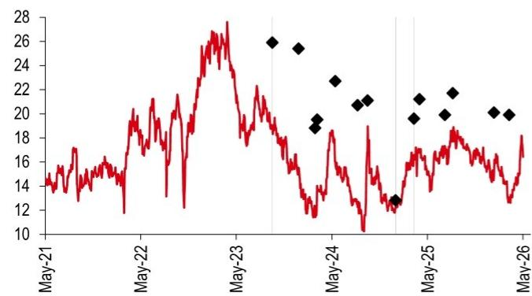

line

| Date   | Value |
|--------|-------|
| May-21 | 14    |
| May-22 | 18    |
| May-23 | 27    |
| May-24 | 19    |
| May-25 | 13    |
| May-26 | 18    |

Source: HSBC

China Resources Land (1109.HK) share price performance HKD Vs HSBC rating history   
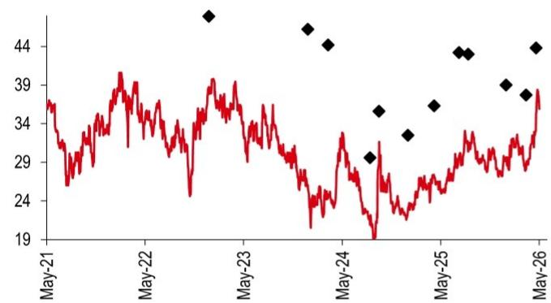

line

| Date   | Value |
|--------|-------|
| May-21 | 38    |
| May-22 | 39    |
| May-23 | 37    |
| May-24 | 29    |
| May-25 | 35    |
| May-26 | 39    |

Source: HSBC

Rating & target price history 

<table><tr><td>From</td><td>To</td><td>Date</td><td>Analyst</td></tr><tr><td>N/A</td><td>Buy</td><td>03 Oct 2023</td><td>Stephen Wang, CFA</td></tr><tr><td>Buy</td><td>Hold</td><td>16 Jan 2025</td><td>Stephen Wang, CFA</td></tr><tr><td>Hold</td><td>Buy</td><td>27 Mar 2025</td><td>Stephen Wang, CFA</td></tr><tr><td>Target price</td><td>Value</td><td>Date</td><td>Analyst</td></tr><tr><td>Price 1</td><td>25.90</td><td>03 Oct 2023</td><td>Stephen Wang, CFA</td></tr><tr><td>Price 2</td><td>25.40</td><td>11 Jan 2024</td><td>Stephen Wang, CFA</td></tr><tr><td>Price 3</td><td>18.80</td><td>14 Mar 2024</td><td>Stephen Wang, CFA</td></tr><tr><td>Price 4</td><td>19.50</td><td>22 Mar 2024</td><td>Stephen Wang, CFA</td></tr><tr><td>Price 5</td><td>22.70</td><td>30 May 2024</td><td>Stephen Wang, CFA</td></tr><tr><td>Price 6</td><td>20.70</td><td>23 Aug 2024</td><td>Stephen Wang, CFA</td></tr><tr><td>Price 7</td><td>21.10</td><td>01 Oct 2024</td><td>Stephen Wang, CFA</td></tr><tr><td>Price 8</td><td>12.80</td><td>16 Jan 2025</td><td>Stephen Wang, CFA</td></tr><tr><td>Price 9</td><td>19.60</td><td>27 Mar 2025</td><td>Stephen Wang, CFA</td></tr><tr><td>Price 10</td><td>21.20</td><td>17 Apr 2025</td><td>Stephen Wang, CFA</td></tr><tr><td>Price 11</td><td>19.90</td><td>23 Jul 2025</td><td>Stephen Wang, CFA</td></tr><tr><td>Price 12</td><td>21.70</td><td>22 Aug 2025</td><td>Stephen Wang, CFA</td></tr><tr><td>Price 13</td><td>20.10</td><td>27 Jan 2026</td><td>Stephen Wang, CFA</td></tr><tr><td>Price 14</td><td>19.90</td><td>26 Mar 2026</td><td>Stephen Wang, CFA</td></tr></table>

Source: HSBC

Rating & target price history 

<table><tr><td>From</td><td>To</td><td>Date</td><td>Analyst</td></tr><tr><td>Hold</td><td>Buy</td><td>12 Aug 2015</td><td>Michelle Kwok</td></tr><tr><td>Target price</td><td>Value</td><td>Date</td><td>Analyst</td></tr><tr><td>Price 1</td><td>47.90</td><td>09 Jan 2023</td><td>Michelle Kwok</td></tr><tr><td>Price 2</td><td>46.20</td><td>11 Jan 2024</td><td>Michelle Kwok</td></tr><tr><td>Price 3</td><td>44.20</td><td>26 Mar 2024</td><td>Michelle Kwok</td></tr><tr><td>Price 4</td><td>29.60</td><td>28 Aug 2024</td><td>Michelle Kwok</td></tr><tr><td>Price 5</td><td>35.60</td><td>01 Oct 2024</td><td>Michelle Kwok</td></tr><tr><td>Price 6</td><td>32.50</td><td>16 Jan 2025</td><td>Michelle Kwok</td></tr><tr><td>Price 7</td><td>36.30</td><td>23 Apr 2025</td><td>Michelle Kwok</td></tr><tr><td>Price 8</td><td>43.20</td><td>24 Jul 2025</td><td>Michelle Kwok</td></tr><tr><td>Price 9</td><td>43.00</td><td>27 Aug 2025</td><td>Michelle Kwok</td></tr><tr><td>Price 10</td><td>39.00</td><td>15 Jan 2026</td><td>Michelle Kwok</td></tr><tr><td>Price 11</td><td>37.70</td><td>30 Mar 2026</td><td>Michelle Kwok</td></tr><tr><td>Price 12</td><td>43.80</td><td>06 May 2026</td><td>Michelle Kwok</td></tr></table>

Source: HSBC

To view a list of all the independent fundamental ratings/recommendations disseminated by HSBC during the preceding 12-month period, and the location where we publish our quarterly distribution of non-fundamental recommendations (applicable to Fixed Income and Currencies research only), please use the following links to access the disclosure page:

Clients of HSBC Private Bank: www.research.privatebank.hsbc.com/Disclosures

All other clients: www.research.hsbc.com/A/Disclosures

HSBC & Analyst disclosures
Disclosure checklist 

<table><tr><td>Company</td><td>Ticker</td><td>Recent price</td><td>Price date</td><td>Disclosure</td></tr><tr><td>C&amp;D INTERNATIONAL</td><td>1908.HK</td><td>16.41</td><td>18 May 2026</td><td>4</td></tr><tr><td>CHINA RESOURCES LAND</td><td>1109.HK</td><td>35.92</td><td>18 May 2026</td><td>1, 4, 5, 6, 7, 11</td></tr></table>

Source: HSBC

1 HSBC has managed or co-managed a public offering of securities for this company within the past 12 months.   
2 HSBC expects to receive or intends to seek compensation for investment banking services from this company in the next 3 months.   
3 At the time of publication of this report, HSBC Securities (USA) Inc. is a Market Maker in securities issued by this company.   
4 As of 30 April 2026, HSBC beneficially owned $1\%$ or more of a class of common equity securities of this company.   
5 This company was a client of HSBC or had during the preceding 12 month period been a client of and/or paid compensation to HSBC in respect of investment banking services.   
6 This company was a client of HSBC or had during the preceding 12 month period been a client of and/or paid compensation to HSBC in respect of non-investment banking securities-related services.   
7 This company was a client of HSBC or had during the preceding 12 month period been a client of and/or paid compensation to HSBC in respect of non-securities services.   
8 A covering analyst/s has received compensation from this company in the past 12 months.   
9 A covering analyst/s or a member of his/her household has a financial interest in the securities of this company, as detailed below.   
10 A covering analyst/s or a member of his/her household is an officer, director or supervisory board member of this company, as detailed below.   
11 At the time of publication of this report, HSBC is a non-US Market Maker in securities issued by this company and/or in securities in respect of this company.   
12 As of 08 May 2026, HSBC beneficially held a net long position of more than $0.5\%$ of this company's total issued share capital, calculated according to the SSR methodology.   
13 As of 08 May 2026, HSBC beneficially held a net short position of more than $0.5\%$ of this company's total issued share capital, calculated according to the SSR methodology.   
14 HSBC Qianhai Securities Limited holds 1% or more of a class of common equity securities of this company.

HSBC and its affiliates will from time to time sell to and buy from customers the securities/instruments, both equity and debt (including derivatives) of companies covered in HSBC on a principal or agency basis or act as a market maker or liquidity provider in the securities/instruments mentioned in this report.

Analysts, economists, and strategists are paid in part by reference to the profitability of HSBC which includes investment banking, sales & trading, and principal trading revenues.

Whether, or in what time frame, an update of this analysis will be published is not determined in advance.

Non-U.S. analysts may not be associated persons of HSBC Securities (USA) Inc, and therefore may not be subject to FINRA Rule 2241 or FINRA Rule 2242 restrictions on communications with the subject company, public appearances and trading securities held by the analysts.

Economic sanctions laws imposed by certain jurisdictions such as the US, the EU, the UK, and others, may prohibit persons subject to those laws from making certain types of investments, including by transacting or dealing in securities of particular issuers, sectors, or regions. This report does not constitute advice in relation to any such laws and should not be construed as an inducement to transact in securities in breach of such laws.

For disclosures in respect of any company mentioned in this report, please see the most recently published report on that company available at www.hsbcnet.com/research. HSBC Private Bank clients should contact their Relationship Manager for queries regarding other research reports. In order to find out more about the proprietary models used to produce this report, please contact the authoring analyst.

# Additional disclosures

1 This report is dated as at 19 May 2026.   
2 All market data included in this report are dated as at close 15 May 2026, unless a different date and/or a specific time of day is indicated in the report.   
3 HSBC has procedures in place to identify and manage any potential conflicts of interest that arise in connection with its Research business. HSBC's analysts and its other staff who are involved in the preparation and dissemination of Research operate and have a management reporting line independent of HSBC's Investment Banking business. Information Barrier procedures are in place between the Investment Banking, Principal Trading, and Research businesses to ensure that any confidential and/or price sensitive information is handled in an appropriate manner.   
4 You are not permitted to use, for reference, any data in this document for the purpose of (i) determining the interest payable, or other sums due, under loan agreements or under other financial contracts or instruments, (ii) determining the price at which a financial instrument may be bought or sold or traded or redeemed, or the value of a financial instrument, and/or (iii) measuring the performance of a financial instrument or of an investment fund.   
5 As of 12 May 2026 HSBC owned a significant interest in the debt securities of the following company(ies): CHINA RESOURCES LAND

# Production & distribution disclosures

1. This report was produced and signed off by the author on 18 May 2026 10:27 GMT.   
2. In order to see when this report was first disseminated please see the disclosure page available at https://www.research.hsbc.com/R/34/6ftBSKj

# Disclaimer

Legal entities as at 13 May 2026:

HSBC Bank plc; HSBC Continental Europe; HSBC Continental Europe SA, Germany; HSBC Bank Middle East Limited, DIFC; HSBC Bank Middle East Limited, Dubai branch; HSBC Yatirim Menkul Degerler AS, Istanbul; The Hongkong and Shanghai Banking Corporation Limited, Hong Kong; The Hongkong and Shanghai Banking Corporation Limited, Singapore Branch; The Hongkong and Shanghai Banking Corporation Limited, Seoul Securities Branch; The Hongkong and Shanghai Banking Corporation Limited, Seoul Branch; HSBC Qianhai Securities Limited; HSBC Securities (Taiwan) Corporation Limited; HSBC Securities and Capital Markets (India) Private Limited, Mumbai; HSBC Bank Australia Limited; HSBC Securities (USA) Inc., New York; HSBC México, SA, Institución de Banca Múltiple, Grupo Financiero HSBC; Banco HSBC SA

Issuer of report

The Hongkong and Shanghai Banking Corporation Limited

Level 16, 1 Queen's Road Central

Hong Kong SAR

Telephone: +852 2843 9111

Fax: +852 2596 0200

Website: www.research.hsbc.com

This document has been issued by The Hongkong and Shanghai Banking Corporation Limited ("HSBC") in the conduct of its Hong Kong regulated business for the information of its institutional and professional investor (as defined by Securities and Future Ordinance (Chapter 571)) customers; it is not intended for and should not be distributed to retail customers in Hong Kong, unless permitted otherwise. The Hongkong and Shanghai Banking Corporation Limited is regulated by the Hong Kong Monetary Authority. All enquires by recipients in Hong Kong must be directed to your HSBC contact in Hong Kong. If it is received by a customer of an affiliate of HSBC, its provision to the recipient is subject to the terms of business in place between the recipient and such affiliate. This document is not and should not be construed as an offer to sell or the solicitation of an offer to purchase or subscribe for any investment. HSBC has based this document on information obtained from sources it believes to be reliable but which it has not independently verified; HSBC makes no guarantee, representation or warranty and accepts no responsibility or liability as to its accuracy or completeness. Expressions of opinion are those of the Research Division of HSBC only and are subject to change without notice. From time to time research analysts conduct site visits of covered issuers. HSBC policies prohibit research analysts from accepting payment or reimbursement for travel expenses from the issuer for such visits. HSBC and its affiliates and/or their officers, directors and employees may have positions in any securities mentioned in this document (or in any related investment) and may from time to time add to or dispose of any such securities (or investment). HSBC and its affiliates may act as market maker or have assumed an underwriting commitment in the securities of companies discussed in this document (or in related investments), may sell them to or buy them from customers on a principal basis and may also perform or seek to perform investment banking or underwriting services for or relating to those companies. The document is intended to be distributed in its entirety. Unless governing law permits otherwise, you must contact a HSBC Group member in your home jurisdiction if you wish to use HSBC Group services in effecting a transaction in any investment mentioned in this document.

In the UK, this publication is distributed by HSBC Bank plc for the information of its Clients (as defined in the Rules of FCA) and those of its affiliates only. Nothing herein excludes or restricts any duty or liability to a customer which HSBC Bank plc has under the Financial Services and Markets Act 2000 or under the Rules of FCA and PRA. A recipient who chooses to deal with any person who is not a representative of HSBC Bank plc in the UK will not enjoy the protections afforded by the UK regulatory regime. HSBC Bank plc is regulated by the Financial Conduct Authority and the Prudential Regulation Authority.

In the European Economic Area, this publication has been distributed by HSBC Continental Europe or by such other HSBC affiliate from which the recipient receives relevant services.

In Japan, this publication has been distributed by HSBC Securities (Japan) Co., Ltd.. It may not be further distributed in whole or in part for any purpose. In Korea, this publication is distributed by either The Hongkong and Shanghai Banking Corporation Limited, Seoul Securities Branch ("HBAP SLS") or The Hongkong and Shanghai Banking Corporation Limited, Seoul Branch ("HBAP SEL") for the general information of professional investors specified in Article 9 of the Financial Investment Services and Capital Markets Act ("FSCMA"). This publication is not a prospectus as defined in the FSCMA. It may not be further distributed in whole or in part for any purpose. Both HBAP SLS and HBAP SEL are regulated by the Financial Services Commission and the Financial Supervisory Service of Korea. In Singapore, this publication is distributed by The Hongkong and Shanghai Banking Corporation Limited, Singapore Branch for the general information of institutional investors or other persons specified in Sections 274 and 304 of the Securities and Futures Act 2001 of Singapore ("SFA") and accredited investors and other persons in accordance with the conditions specified in Sections 275 and 305 of the SFA. Only Economics or Currencies reports are intended for distribution to a person who is not an Accredited Investor, Expert Investor or Institutional Investor as defined in SFA. The Hongkong and Shanghai Banking Corporation Limited, Singapore Branch accepts legal responsibility for the contents of reports. This publication is not a prospectus as defined in the SFA. It may not be further distributed in whole or in part for any purpose. The Hongkong and Shanghai Banking Corporation Limited Singapore Branch is regulated by the Monetary Authority of Singapore. Recipients in Singapore should contact a "Hongkong and Shanghai Banking Corporation Limited, Singapore Branch" representative in respect of any matters arising from, or in connection with this report. Please refer to The Hongkong and Shanghai Banking Corporation Limited Singapore Branch's website at www.business.hsbc.com.sg for contact details. In Australia, this publication has been distributed by The Hongkong and Shanghai Banking Corporation Limited (ABN 65 117 925 970, AFSL 301737) for the general information of its "wholesale" customers (as defined in the Corporations Act 2001). Where distributed to retail customers, this research is distributed by HSBC Bank Australia Limited (ABN 48 006 434 162, AFSL No. 232595). These respective entities make no representations that the products or services mentioned in this document are available to persons in Australia or are necessarily suitable for any particular person or appropriate in accordance with local law. No consideration has been given to the particular investment objectives, financial situation or particular needs of any recipient.

HSBC Securities (USA) Inc. accepts responsibility for the content of this research report prepared by its non-US foreign affiliate. The information contained herein is under no circumstances to be construed as investment advice and is not tailored to the needs of the recipient. All US persons receiving and/or accessing this report and wishing to effect transactions in any security discussed herein should do so with HSBC Securities (USA) Inc. in the United States and not with its non-US foreign affiliate, the issuer of this report. HSBC México, S.A., Institución de Banca Múltiple, Grupo Financiero HSBC is authorized and regulated by Secretaría de Hacienda y Crédito Público and Comisión Nacional Bancaria y de Valores (CNBV). In Brazil, this document has been distributed by Banco HSBC SA ("HSBC Brazil"), and/or its affiliates. As required by Resolution No. 20/2021 of the Securities and Exchange Commission of Brazil (Comissão de Valores Mobiliários), potential conflicts of interest concerning (i) HSBC Brazil and/or its affiliates; and (ii) the analyst(s) responsible for authoring this report are stated on the chart above labelled "HSBC & Analyst Disclosures".

If you are a customer of HSBC International Wealth & Premier Banking ("IWPB"), including HSBC Private Bank, you are eligible to receive this publication only if: (i) you have been approved to receive relevant research publications by an applicable HSBC legal entity; (ii) you have agreed to the applicable HSBC entity's terms and conditions and/or customer declaration for accessing research; and (iii) you have agreed to the terms and conditions of any other internet banking, online banking, mobile banking and/or investment services offered by that HSBC entity, through which you will access research publications (collectively with (ii), the "Terms"). If you do not meet the above eligibility requirements, please disregard this publication and, if you are a IWPB customer, please notify your Relationship Manager or call the relevant customer hotline. Distribution of this publication is the sole responsibility of the HSBC entity with whom you have agreed the Terms. Receipt of research publications is strictly subject to the Terms and any other conditions or disclaimers applicable to the provision of the publications that may be advised by IWPB.

© Copyright 2026, The Hongkong and Shanghai Banking Corporation Limited, ALL RIGHTS RESERVED. No part of this publication may be reproduced, stored in a retrieval system, or transmitted, on any form or by any means, electronic, mechanical, photocopying, recording, or otherwise, without the prior written permission of The Hongkong and Shanghai Banking Corporation Limited.

[1279652]

# Stay connected to our topical and timely thought leadership

# Download the HSBC Global Investment Research app

From Apple's App Store or Google Play The app features topical and timely curated reports, multimedia, and upcoming events

# Log on to the Global Investment Research website

To access all reports and videos, visit research.hsbc.com

# Connect with Global Investment Research on LinkedIn

Search #HSBCResearch for free to view insights that can easily be shared with clients and prospects

# Subscribe and listen

Under the Banyan Tree by HSBC Global Investment Research on Apple, Spotify or YouTube The Macro Brief by HSBC Global Investment Research on Apple, Spotify or YouTube

# Newsletters

Subscribe to our monthly collection of free to view reports and interviews in Open Pass or read our bite-sized round up of research covering our nine key themes, Talking Points