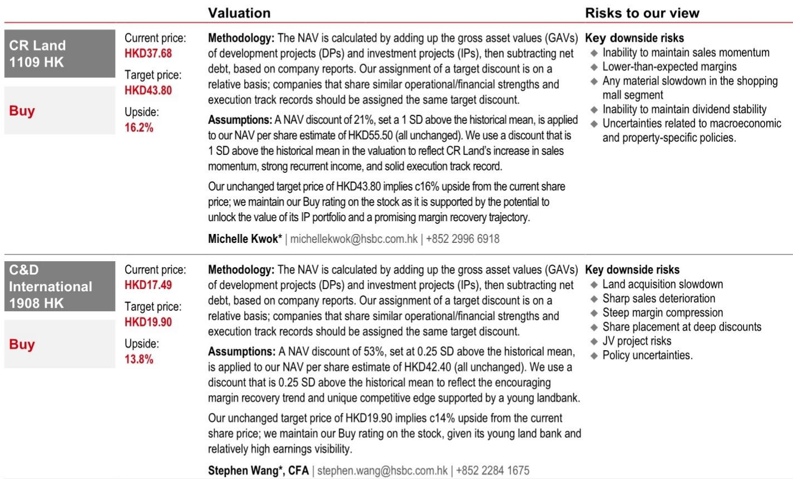
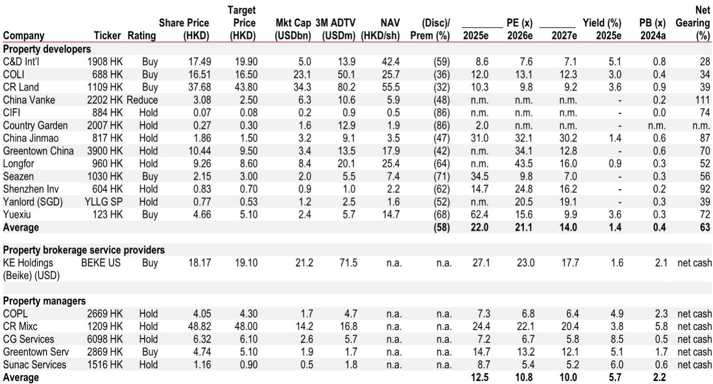
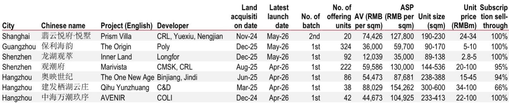

# 市场真正低估的不是需求，而是信用传导的时滞

过去几周，中国地产股经历了一轮明显回调。某外资投行覆盖的开发商股票在5月18日单日下跌4.5%，恒生指数同期仅跌1.1%。很多人将这次回调归因于宏观情绪转弱——美联储降息预期推迟、美债收益率上行、中国利率政策空间收窄。这些因素确实存在，但真正值得追问的是：基本面是否同步恶化了？

答案是否定的。根据该投行最新研报，4月一线城市新房和二手房成交面积仍在环比增长，上海甚至出现加速迹象。截至5月16日，一线城市新房销售面积同比增长7%，10个重点城市二手房成交量同比大增22%。与此同时，一手房均价在4月环比上涨0.2%，二手房环比上涨0.4%，这是连续第三个月保持正增长。

数据本身并不矛盾。真正的问题在于：市场对“复苏”的定价逻辑，可能从一开始就搞错了时间尺度。这份研报的核心判断并非“复苏已至”，而是“复苏的节奏比市场预期的更慢，但方向比市场预期的更确定”。而市场真正低估的，不是需求本身，而是从市场企稳到信用扩张之间那条漫长的传导链。

## 1. 四月的信贷数据暴露了复苏最薄弱的环节：居民加杠杆意愿仍然极低

4月居民中长期贷款净减少3410亿元，创下有记录以来的单月新低。这不是一个简单的季节性波动。回顾过去五年的数据，居民中长期贷款通常在春节后和年中出现季节性回升，但2026年4月的数字不仅远低于历史均值，甚至比2024年4月的-1500亿元还要糟糕一倍以上。

这意味着什么？第一，提前还贷的规模仍在扩大。第二，新增购房贷款的增长不足以覆盖提前还贷的流出。两个现象指向同一个结论：即使成交量在回暖，居民仍然不愿意加杠杆买房。

从研报提供的图表可以清晰看到，2021年1月居民中长期贷款曾达到9500亿元的高点，此后一路震荡下行。2022年4月首次转负，2023年7月和2024年4月再次转负，而2026年4月的-3410亿元是幅度最大的一次。这种趋势不是政策能够短期扭转的——它反映的是居民资产负债表修复的漫长过程。

对于投资者而言，这意味着当前地产股的估值修复更多依赖于“成交量回暖”这一单一变量，而尚未计入“信用扩张”这一更重要的二阶效应。如果信贷数据持续疲弱，市场对2027年盈利的预期可能需要进一步下修。

## 2. 境内融资成本已降至历史低位，但境外再融资风险正在重新定价

研报指出了两个方向完全相反的资金面信号。境内方面，商业房贷利率已降至3.1%，住房公积金贷款利率降至2.6%，10年期国债收益率持续下行至1.8%附近。研报经济学家预计政策利率将维持稳定至2026年，这意味着按揭利率大概率保持在低位。这对购房者来说是明确的利好。

但境外是另一番景象。美债收益率上行正在推高全球无风险利率，虽然对境内地产基本面的直接影响有限，但对港股地产股的估值产生了压制。更关键的是，部分开发商面临2027年到期的美元债务再融资压力。龙湖有一笔2.5亿美元债券在2027年4月到期，票面利率仅3.375%；万科有一笔10亿美元债券在2027年11月到期，票面利率3.975%。在当前高收益环境下，以如此低的利率完成再融资几乎不可能。

这里需要特别指出的是，研报没有完全展开的一个关键问题是：这些美元债的再融资成本上升，是否会触发信用评级调整或引发市场对流动性的重新担忧？对于万科这类净负债率高达111%的开发商，即使境内融资环境宽松，境外债务的到期压力仍然是一个不可忽视的结构性风险。

## 3. 一线城市的价格企稳正在从“信号”变成“趋势”，但二三线仍在失血

研报提供了两组非常重要的价格数据。第一组是环比数据：一线城市一手房均价在2月环比上涨0.1%，4月进一步上涨0.2%；二手房均价同样从2月的0.4%持续上涨至4月的0.4%。虽然涨幅不大，但连续三个月的正增长在近两年的下行周期中从未出现过。

第二组是同比数据，情况要严峻得多。4月一线城市二手房均价同比仍下跌6.8%，70城平均下跌6.3%。环比改善但同比仍大幅下跌，说明“止跌”已经发生，但“回升”还远未到来。

更值得关注的是城市间的分化。从二手房成交同比增速来看，厦门（42%）、上海（33%）、佛山（32%）、苏州（25%）、深圳（24%）表现亮眼，但杭州仍在同比下跌6%。一线城市和强二线城市的复苏势头明显强于弱二三线，后者4月新房销售面积仍同比下降22%。

这种分化意味着什么？对于开发商而言，项目布局的质量正在成为区分胜负的关键。那些在一线和强二线城市拥有充足高端项目储备的公司，将率先受益于价格企稳和成交回暖；而重仓弱二三线的开发商，可能仍然面临较长的去库存压力。

## 4. 高端项目“日光”频现，但这是结构性需求还是市场情绪的一次性释放？

研报列举了近期多个开盘即售罄的高端项目。上海翡云悦府二期20套别墅，均价12.78万元/平方米，单套总价2400万至3400万元，认购率100%。广州保利海韵首期324套，均价5.97万元，同样售罄。深圳龙湖观萃92套全部售出。杭州中海万潮玖序42套总价2200万至1亿元的房子，也实现了100%去化。

这些数据很容易被解读为“需求强劲”，但需要更审慎的分析。第一，这些项目全部位于一线或强二线城市的核心地段，本身具有稀缺性。第二，这些项目的购买人群是高净值客户，他们对利率、信贷政策的敏感度远低于刚需群体。第三，从土地获取到项目开盘的周期来看，这些项目大多是2024年底至2025年中拿的地，当时的土地市场竞争激烈，溢价率较高。

这意味着，高端市场的“日光”并不能简单外推至整个市场。它更多反映的是供给端的结构性变化——开发商在经历了行业洗牌后，更加聚焦于利润率高、去化确定性强的高端项目。这是一种理性的商业选择，但也意味着行业整体的可售货值可能正在向高端市场集中，而中低端市场的供需匹配问题可能仍未解决。

对于投资者而言，关注开发商“高端项目占比”和“土地储备质量”的边际变化，可能比关注整体销售面积增速更有意义。

## 5. 报告尚未完全回答的关键问题：财富效应何时才能真正启动

研报在末尾提到一个重要的时间节点：居民住房财富的重新定价预计将在2026年完成，更强的财富效应届时可能支撑信用扩张，为住房复苏提供第二波动力。这个判断的逻辑是清晰的——房价企稳后，居民的资产负面积效应由负转正，消费和投资意愿随之回升，进而带动信贷扩张。

但这个逻辑链条中存在几个尚未被充分验证的假设。第一，房价企稳的幅度是否足以扭转居民的“房价下跌预期”？如果仅仅是环比微涨而同比仍大幅下跌，居民的心理账户可能仍然处于亏损状态。第二，财富效应从房价企稳到消费和信贷扩张的传导时滞有多长？研报提到“需要时间”，但没有给出量化的估计。第三，在居民收入增速放缓、就业预期偏弱的大背景下，即使房价企稳，居民是否愿意重新加杠杆？

这些问题不是研报的缺陷，而是任何前瞻性分析都必须面对的边界。对于读者而言，这些未解问题恰恰是跟踪行业拐点的关键观察点。

## 6. 投资者的观察框架：从“买不买”转向“买谁的什么”

综合以上分析，当前地产股的投资逻辑已经不再是简单的“行业见底”或“政策放松”，而是需要更加精细的筛选框架。

第一个维度是土地储备质量。那些在一线城市和强二线城市拥有充足可售货值的开发商，将率先受益于价格企稳和成交回暖。研报重点推荐华润置地和建发国际，前者拥有丰富的投资物业组合，后者在高端住宅市场有较强的产品力。

第二个维度是债务结构。境内融资成本已降至历史低位，但境外债务的再融资风险正在重新定价。净负债率较低、美元债到期压力较小的公司，在估值修复中具有更高的安全边际。

第三个维度是盈利可见性。2027年的盈利预期能否兑现，取决于两个变量：一是成交量能否从一线城市向二三线城市扩散，二是居民加杠杆意愿能否在财富效应启动后回升。当前市场对2027年盈利的预期仍然较高，但这一预期存在较大的下行风险。

最后一个维度是估值本身。经过近期的回调，开发商股票的平均NAV折价率约为58%，12个月远期市盈率约为22倍。这个估值水平是否合理，取决于你对上述三个维度的判断。

这些未解问题，正是我们希望在更深入的讨论中继续探索的方向。如果你对地产行业的拐点判断、个股筛选框架或具体项目的去化数据感兴趣，欢迎来星球微信群里继续讨论。我们每周会分享研报的核心图表、关键假设的验证进度，以及市场最新信号的解读。

Personal reading notes and learning share only. Not investment advice.

