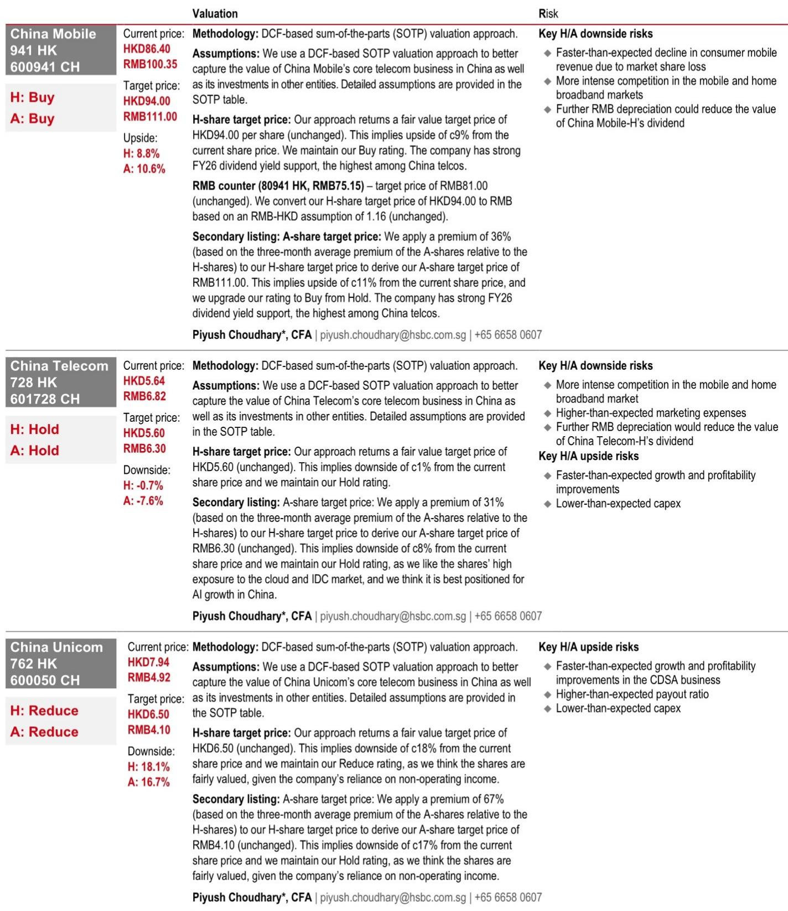
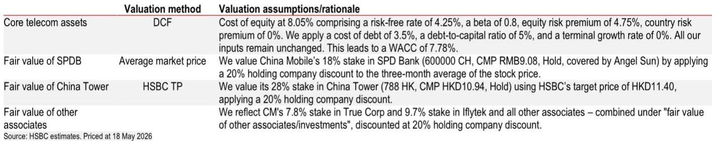
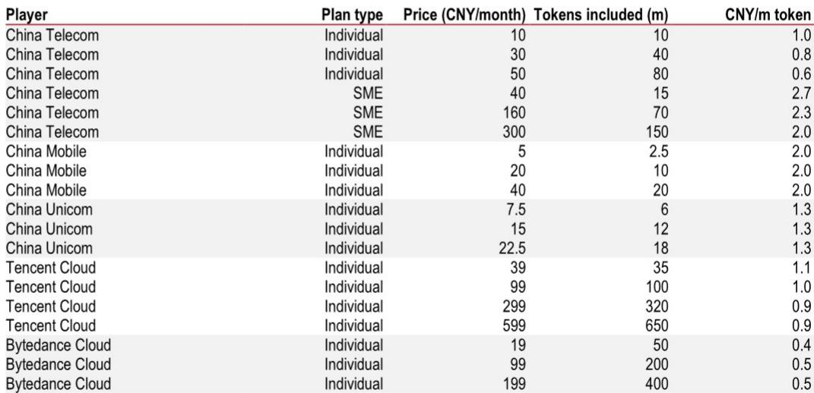

# Token Plans Will Not Save China's Telcos—But They Reveal a Deeper Strategic Shift

China's three major telecommunications operators have all launched token-based AI subscription plans within the past month, prompting a wave of investor enthusiasm that lifted share prices and sparked speculation about a new revenue engine. But a careful examination of pricing, competitive positioning, and strategic intent suggests that the near-term earnings impact will be negligible. The real story is not about immediate monetization—it is about how China's state-linked telcos are positioning themselves as utility-layer infrastructure providers in an AI economy that is scaling at an unprecedented rate.

On May 17, China Telecom announced a nationwide tiered token plan covering both individual consumers and small-to-medium enterprises, following similar moves by China Mobile and China Unicom in April. The market reacted swiftly: China Telecom's H-shares and A-shares rose approximately 6% and 8% respectively on May 18. The enthusiasm is understandable. Token-based billing represents a conceptual leap from selling connectivity to selling computational access. It transforms AI model usage into a measurable, billable commodity—tokens as the new gigabytes. Yet the gap between narrative and reality is wide.

The core thesis of this article is straightforward: token plans are strategically significant but financially immaterial in the near term. Investors should not extrapolate share price movements into earnings upgrades. Instead, they should use this moment to reassess which telco has the balance sheet, the ecosystem, and the patience to eventually win in AI infrastructure. The answer is not the one that launched the most aggressive token plan.

## Token Plans Are a Necessary Strategic Pivot, Not a Revenue Breakthrough

The logic behind telcos entering the token economy is compelling in theory. AI-driven token consumption in China has exploded from 100 billion tokens per day in early 2024 to over 140 trillion per day by March 2026. If telcos can capture even a fraction of this traffic and bill for it, the addressable market is enormous. By packaging access to large language models such as DeepSeek and MiniMax into monthly subscription plans, telcos are attempting to become the pipes through which AI consumption flows—much as they became the pipes for voice, SMS, and data.

China Mobile's Jiangsu branch was first, offering monthly token plans at 2 renminbi per million tokens starting April 17. China Unicom's Hubei branch followed on April 29 with a slightly lower price point of 1.3 renminbi per million tokens. China Telecom's nationwide launch on May 17 offered individual plans ranging from 10 renminbi for 10 million tokens to 50 renminbi for 80 million tokens, and SME plans from 40 renminbi to 300 renminbi.

This is a logical extension of the telcos' broader strategy to become utility-like AI infrastructure providers. They own the network, they have existing billing relationships with hundreds of millions of consumers, and they are under pressure to find growth beyond declining traditional voice and SMS revenue. Token plans also complement their cloud computing ambitions. China Telecom's Ningxia branch recently opened what it calls the industry's first "Token Factory"—a procurement initiative that signals the company's intention to commoditize AI compute capacity.

But here is the critical question that the market has not yet answered: does anyone actually need to buy tokens from a telco?

## Telcos Cannot Out-Compete Internet Cloud Providers on Price, Model Quality, or Ecosystem

The most important table in the underlying report compares token pricing across telcos and internet-based cloud service providers. The data reveals a clear pattern: telcos are not cheaper. China Telecom's individual plans range from 0.6 to 1.0 renminbi per million tokens. China Mobile charges a flat 2.0 renminbi per million tokens. China Unicom charges 1.3 renminbi per million tokens. Meanwhile, Tencent Cloud's individual plans range from 0.9 to 1.1 renminbi per million tokens, and ByteDance Cloud offers plans at just 0.4 to 0.5 renminbi per million tokens.

ByteDance's pricing is roughly half that of the cheapest telco plan. This is not a marginal difference—it is a structural disadvantage. ByteDance and Tencent own proprietary large language models that are widely regarded as more capable than the models telcos are reselling. They have deeper engineering talent, more sophisticated recommendation and caching systems, and existing relationships with developers and enterprises. They also have the ability to cross-subsidize token pricing with advertising revenue, which telcos cannot match.

For individual users, the decision is straightforward. Why pay more for access to inferior models through a telco when you can pay less for better models directly from ByteDance or Tencent? For SME users, the calculus is even more demanding. They care about model variety, computing power reliability, the breadth of the cloud ecosystem, and the responsiveness of technical support. Telcos are not known for excelling in any of these dimensions compared to dedicated cloud providers.

The report does not explicitly state this, but the implication is clear: telcos are entering a market where they are structurally disadvantaged on the three dimensions that matter most—price, product quality, and ecosystem depth. Their token plans are not competitive offerings. They are positioning plays.

## The Market Is Misreading the Signal: Token Plans Are a Tale, Not a Trigger

The share price reaction to China Telecom's token plan announcement suggests that some investors are treating this as a revenue catalyst. That is a mistake. The report explicitly states that it sees "limited visibility on an earnings impact" and keeps its estimates and ratings unchanged. China Telecom remains a Hold on both H-shares and A-shares. China Unicom remains a Reduce. Only China Mobile retains a Buy rating, and not because of token plans.

China Mobile's Buy thesis rests on two factors that have nothing to do with AI tokens: a higher FY26e dividend yield of 6.3% and a more robust balance sheet. In a low-growth, capital-intensive industry, these are the metrics that matter. Token plans are a distraction from the fundamental question of how telcos will generate shareholder returns in an environment where their core connectivity business is mature and their AI ambitions face fierce competition.

The report's rating dispersion is instructive. China Mobile is a Buy despite having the most expensive token pricing among the three. China Unicom is a Reduce despite offering the cheapest telco token pricing. This tells you that token plans are not moving the needle on fundamental valuation. The rating framework is driven by dividend sustainability, balance sheet strength, and the quality of the core telecom business—not by the ability to sell AI tokens to consumers.

Investors who bought China Telecom on the token announcement may be holding a stock that the report's authors believe is fully valued or slightly overvalued. The H-share target price of HKD5.60 implies 0.7% downside from the May 18 close. The A-share target price of RMB6.30 implies 7.6% downside. The token narrative may have created a trading opportunity, but it has not changed the fundamental investment case.

## What the Report Does Not Fully Answer: Will Telcos Eventually Win in Enterprise AI?

The report is clear on why telcos will not win in consumer token plans. But it leaves an important question unanswered: what about enterprise AI infrastructure? This is where the telcos' natural advantages—network ownership, data center assets, government relationships, and regulatory positioning—could eventually matter more than consumer token pricing.

China Telecom's "Token Factory" in Ningxia is a clue. If telcos can position themselves as the preferred providers of AI compute capacity for state-owned enterprises, local governments, and regulated industries, they could capture a meaningful share of the enterprise AI market without having to compete head-to-head with ByteDance and Tencent on consumer pricing. The enterprise sales cycle is longer, the switching costs are higher, and the procurement criteria are different. A state-owned enterprise may prefer to buy AI compute from a state-owned telco, even at a premium, for compliance and data sovereignty reasons.

The report does not explore this angle in depth. It focuses on the consumer and SME token plans and concludes that the competitive position is weak. But the enterprise opportunity is where the strategic logic of telcos as AI infrastructure providers becomes more defensible. The question is whether telcos can build the enterprise sales capabilities, the partner ecosystems, and the service reliability required to win in that segment. The report's silence on this point is not a weakness—it is an invitation for investors to think beyond the data provided.

Another unresolved question is the potential for telcos to bundle token plans with their core connectivity services. If a consumer can get a discount on their mobile plan by subscribing to a token plan, or if an SME can get a preferential rate on cloud services by committing to a certain level of token consumption, the economics change. Bundling could allow telcos to compete on total cost of ownership rather than per-token pricing. The report does not model this scenario, but it is worth monitoring.

## A Decision Framework for Investors Evaluating China Telcos

For investors trying to make sense of the token plan announcements and the diverging stock ratings, a structured framework is necessary. The following three questions should guide investment decisions.

First, what is the primary source of shareholder returns? China Mobile offers a 6.3% dividend yield on FY26e estimates, supported by a balance sheet that the report describes as "more robust" than its peers. China Telecom offers 5.0% on H-shares and 3.6% on A-shares. China Unicom offers 5.4% on H-shares and 3.3% on A-shares. If dividend yield is the primary investment objective, China Mobile is the clear winner. Token plans do not change this calculus.

Second, what is the company's exposure to AI growth? China Telecom is rated Hold rather than Reduce because the report acknowledges it is "best positioned for AI growth in China" due to its high exposure to cloud and IDC markets. This is a long-term thesis that is not dependent on the success of consumer token plans. Investors who believe in the enterprise AI infrastructure story may find China Telecom more attractive than the ratings suggest, provided they have a multi-year time horizon and tolerance for near-term valuation risk.

Third, what is the margin of safety? The report's target prices imply upside of 8.8% to 10.6% for China Mobile, downside of 0.7% to 7.6% for China Telecom, and downside of 16.7% to 18.1% for China Unicom. The dispersion is large. China Mobile offers a positive risk-reward with a dividend yield that provides a floor. China Unicom offers negative risk-reward with limited catalysts. China Telecom sits in the middle, with a valuation that leaves little room for error.

The token plan announcements do not change any of these calculations. They are interesting strategically but irrelevant financially. Investors should not let the noise distract them from the fundamentals.

## The Full Report Contains the Charts and Data That Make the Argument Concrete

The analysis presented here is based on a detailed research report that includes pricing comparison tables, sum-of-the-parts valuation models, and explicit rating frameworks for each of the three telcos across both H-shares and A-shares. The pricing comparison table alone is worth studying closely—it reveals the extent of the pricing disadvantage that telcos face against ByteDance and Tencent, and it should give pause to anyone who believes token plans will drive meaningful revenue growth.

The report also includes DCF-based valuation assumptions, SOTP tables, and risk assessments that are essential for understanding the investment case for each company. Without these, the argument remains at the level of general strategy. With them, it becomes a testable investment thesis.

The original charts and data tables are not reproduced here due to format constraints, but they are available in the full report. They show exactly how the analysts arrived at their target prices, what assumptions drive the valuation, and where the risks lie. For serious investors, this is not optional reading—it is the foundation of informed decision-making.

Join the community to read the full report and review the original charts.

*This article is for learning and discussion only and does not constitute investment advice.*

Personal reading notes and learning share only. Not investment advice.

