This material is neither intended to be distributed to Mainland China investors nor to provide securities investment consultancy services within the territory of Mainland China. This material or any portion hereof may not be reprinted, sold or redistributed without the written consent of JPM.

# China Basic Materials

Apr 26 NBS data: Weakening domestic demand to be partially offset by exports; macro and supply are stronger short-term drivers

China's April activity data came in broadly below expectations, with industrial production recording its steepest MoM contraction in three years (link to report). Across our coverage universe, base metals face growing headwinds as US rate hike expectations intensify amid slowing global growth and persistent inflationary pressures. SHFE Aluminum prices hovered at \~RMB 24–25k/t, supported by a structural global supply deficit amid Middle East disruptions and persistent tightness through 2026. Lithium spot briefly touched RMB 200k/t but has since pulled back to \~RMB 190k/t, supported by resilient ESS demand and a recovery in EV adoption driven by elevated oil prices, though we are beginning to see early signs of a mine supply response. For coal and steel, prices have shown a slight recovery, but sustainability hinges on downstream demand follow-through and whether policy-led supply discipline can have a material impact. Zijin Mining remains our top pick despite near-term sentiment being pressured by hawkish repricing. We also like Chalco and China Hongqiao, with the pace of destocking being a key catalyst.

\- April property data came in underwhelming: NBS figures showed signs of deterioration relative to March. New starts declined 27% YoY (vs. -17% in Mar26 YoY and -22% in Apr25 YoY). Completions remained depressed, though the pace of contraction has moderated, falling 19% YoY in April (flat vs. Mar26). Real estate investment stayed subdued at -20% YoY (down vs. -12% Feb26). While home prices continue to show signs of stabilization, JPM property analyst Karl Chan expects new starts to remain weak over the next few months due to soft land sales volume in 1Q26. The new forecast expects a -18% YoY and -19% YoY decline in new starts and completions, respectively, implying a -16% and -17% decline for the rest of the year (link to report).

Figure 1: YTD China property GFA growth   
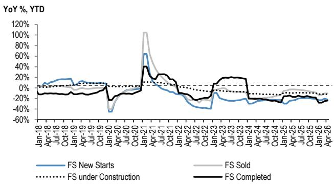

line

| Date    | FS New Starts | FS Sold | FS Under Construction | FS Completed |
|---------|---------------|---------|------------------------|--------------|
| Jan-18  | ~0%           | ~0%     | ~0%                    | ~0%          |
| Apr-18  | ~0%           | ~0%     | ~0%                    | ~0%          |
| Jul-18  | ~0%           | ~0%     | ~0%                    | ~0%          |
| Oct-18  | ~0%           | ~0%     | ~0%                    | ~0%          |
| Jan-19  | ~0%           | ~0%     | ~0%                    | ~0%          |
| Apr-19  | ~0%           | ~0%     | ~0%                    | ~0%          |
| Jul-19  | ~0%           | ~0%     | ~0%                    | ~0%          |
| Oct-19  | ~0%           | ~0%     | ~0%                    | ~0%          |
| Jan-20  | ~-40%         | ~-20%   | ~-10%                  | ~-15%        |
| Apr-20  | ~-20%         | ~-10%   | ~-5%                   | ~-10%        |
| Jul-20  | ~-10%         | ~-5%    | ~-5%                   | ~-5%         |
| Oct-20  | ~-5%          | ~100%   | ~-5%                   | ~40%         |
| Jan-21  | ~60%          | ~100%   | ~-5%                   | ~40%         |
| Apr-21  | ~20%          | ~20%    | ~-5%                   | ~20%         |
| Jul-21  | ~10%          | ~10%    | ~-5%                   | ~10%         |
| Oct-21  | ~5%           | ~5%     | ~-5%                   | ~5%          |
| Jan-22  | ~-5%          | ~-5%    | ~-5%                   | ~-5%         |
| Apr-22  | ~-10%         | ~-5%    | ~-5%                   | ~-5%         |
| Jul-22  | ~-15%         | ~-5%    | ~-5%                   | ~-5%         |
| Oct-22  | ~-20%         | ~-5%    | ~-5%                   | ~-5%         |
| Jan-23  | ~-25%         | ~-5%    | ~-5%                   | ~-5%         |
| Apr-23  | ~-30%         | ~-5%    | ~-5%                   | ~-5%         |
| Jul-23  | ~-35%         | ~-5%    | ~-5%                   | ~-5%         |
| Oct-23  | ~-40%         | ~-5%    | ~-5%                   | ~-5%         |
| Jan-24  | ~-45%         | ~-5%    | ~-5%                   | ~-5%         |
| Apr-24  | ~-45%         | ~-5%    | ~-5%                   | ~-5%         |
| Jul-24  | ~-45%         | ~-5%    | ~-5%                   | ~-5%         |
| Oct-24  | ~-45%         | ~-5%    | ~-5%                   | ~-5%         |
| Jan-25  | ~-45%         | ~-5%    | ~-5%                   | ~-5%         |
| Apr-25  | ~-45%         | ~-5%    | ~-5%                   | ~-5%         |
| Jul-25  | ~-45%         | ~-5%    | ~-5%                   | ~-5%         |
| Oct-25  | ~-45%         | ~-5%    | ~-5%                   | ~-5%         |
| Jan-26  | ~-45%         | ~-5%    | ~-5%                   | ~-5%         |
| Apr-26  | ~-45%         | ~-5%    | ~-5%                   | ~-5%         |

Source: NBS, JPM

Figure 2: Completion end vs new starts end commodity performance   
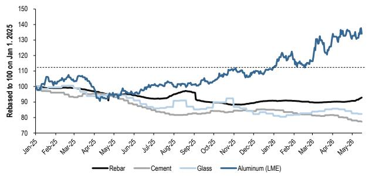

line

| Month   | Rebar | Cement | Glass | Aluminum (LME) |
|---------|-------|--------|-------|----------------|
| Jan-25  | 100   | 100    | 100   | 100            |
| Feb-25  | 100   | 98     | 98    | 105            |
| Mar-25  | 100   | 96     | 96    | 108            |
| Apr-25  | 100   | 94     | 94    | 106            |
| May-25  | 100   | 92     | 92    | 104            |
| Jun-25  | 100   | 90     | 90    | 102            |
| Jul-25  | 100   | 88     | 88    | 100            |
| Aug-25  | 100   | 86     | 86    | 98             |
| Sep-25  | 100   | 84     | 84    | 96             |
| Oct-25  | 100   | 82     | 82    | 94             |
| Nov-25  | 100   | 80     | 80    | 92             |
| Dec-25  | 100   | 78     | 78    | 90             |
| Jan-26  | 100   | 76     | 76    | 88             |
| Feb-26  | 100   | 74     | 74    | 86             |
| Mar-26  | 100   | 72     | 72    | 84             |
| Apr-26  | 100   | 70     | 70    | 82             |
| May-26  | 100   | 68     | 68    | 80             |

Source: Bloomberg Finance L.P., JPM

# Asia Basic Materials

# Avery Chan AC

(852) 2800-8659

avery.chan@JPM.com

JPM Securities (Asia Pacific) Limited/ JPM Broking (Hong Kong) Limited

# Sabrina Liu

(852) 2800-8535

sabrina.liu@JPM.com

JPM Securities (Asia Pacific) Limited/ JPM Broking (Hong Kong) Limited

# Frankie Fong

(852) 2800-8574

frankie.fong@JPM.com

JPM Securities (Asia Pacific) Limited

See page 10 for analyst certification and important disclosures, including non-US analyst disclosures.

\- FAI growth slowed significantly in April. In April, total FAI growth declined sharply by 12% YoY (vs. +1.7% YoY in 1Q26), with manufacturing FAI declining by 4% YoY and 16% MoM, reversing from the growth trend in 1Q26 (+4% YoY) amidst energy-shock disruptions. Infrastructure FAI declined by 3% YoY and 24% MoM in April (vs. +9% 1Q26).

Figure 3: YTD China FAI growth   
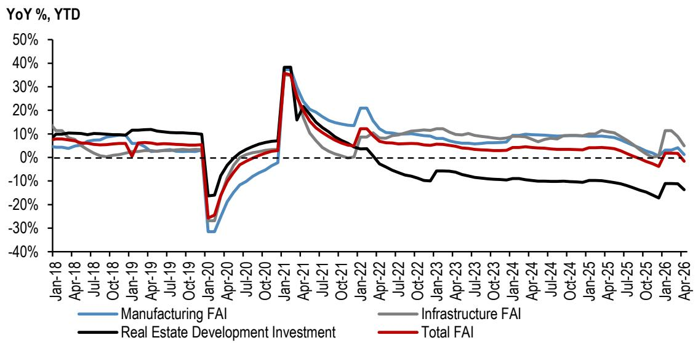

line

| Date    | Manufacturing FAI | Infrastructure FAI | Real Estate Development Investment | Total FAI |
|---------|-------------------|--------------------|------------------------------------|-----------|
| Jan-18  | ~5%               | ~10%               | ~10%                               | ~5%       |
| Apr-18  | ~5%               | ~5%                | ~5%                                | ~5%       |
| Jul-18  | ~5%               | ~5%                | ~5%                                | ~5%       |
| Oct-18  | ~5%               | ~5%                | ~5%                                | ~5%       |
| Jan-19  | ~5%               | ~5%                | ~5%                                | ~5%       |
| Apr-19  | ~5%               | ~5%                | ~5%                                | ~5%       |
| Jul-19  | ~5%               | ~5%                | ~5%                                | ~5%       |
| Oct-19  | ~5%               | ~5%                | ~5%                                | ~5%       |
| Jan-20  | ~-30%             | ~-20%              | ~-20%                              | ~-25%     |
| Apr-20  | ~-10%             | ~-5%               | ~-5%                               | ~-10%     |
| Jul-20  | ~0%               | ~0%                | ~0%                                | ~0%       |
| Oct-20  | ~0%               | ~0%                | ~0%                                | ~0%       |
| Jan-21  | ~35%              | ~35%               | ~35%                               | ~35%      |
| Apr-21  | ~20%              | ~20%               | ~20%                               | ~20%      |
| Jul-21  | ~10%              | ~10%               | ~10%                               | ~10%      |
| Oct-21  | ~5%               | ~5%                | ~5%                                | ~5%       |
| Jan-22  | ~20%              | ~10%               | ~10%                               | ~10%      |
| Apr-22  | ~10%              | ~10%               | ~10%                               | ~10%      |
| Jul-22  | ~10%              | ~10%               | ~10%                               | ~10%      |
| Oct-22  | ~10%              | ~10%               | ~10%                               | ~10%      |
| Jan-23  | ~10%              | ~10%               | ~10%                               | ~10%      |
| Apr-23  | ~10%              | ~10%               | ~10%                               | ~10%      |
| Jul-23  | ~10%              | ~10%               | ~10%                               | ~10%      |
| Oct-23  | ~10%              | ~10%               | ~10%                               | ~10%      |
| Jan-24  | ~10%              | ~10%               | ~10%                               | ~10%      |
| Apr-24  | ~10%              | ~10%               | ~10%                               | ~10%      |
| Jul-24  | ~10%              | ~10%               | ~10%                               | ~10%      |
| Oct-24  | ~10%              | ~10%               | ~10%                               | ~10%      |
| Jan-25  | ~10%              | ~10%               | ~10%                               | ~10%      |
| Apr-25  | ~10%              | ~10%               | ~10%                               | ~10%      |
| Jul-25  | ~5%               | ~5%                | ~5%                                | ~5%       |
| Oct-25  | ~5%               | ~5%                | ~5%                                | ~5%       |
| Jan-26  | ~5%               | ~5%                | ~5%                                | ~5%       |
| Apr-26  | ~5%               | ~5%                | ~5%                                | ~5%       |

Source: NBS, JPM

\- April crude steel output fell 3% YoY; steel product exports declined 9% YoY. China's crude steel production came in at 84mt in April, down 3% YoY, representing an improvement from 1Q26 and bringing 4M26 cumulative output to 331mt, down 4% YoY. The downtrend persists, with early-May CISA key members' daily output at 2.11mn tons (-4.3% YoY). April finished steel exports totaled 9.5mt (-9% YoY, vs. -10% 1Q26 avg). We expect a near-term recovery in steel exports driven by resurgent Middle East demand following tension de-escalation, even as the tailwind from EU front-loading — which supported Q1 volumes — fades under quota constraints. On margins, we are seeing a cost-driven steel price rally since the second half of April, with margins improving off the lows (the share of profitable mills rising to 64% now from 48% in early April; however, with still-sluggish domestic demand and elevated input costs continuing to weigh, we expect no material margin recovery until meaningful policy follow-through materializes.

Figure 4: China YTD Crude Steel Production   
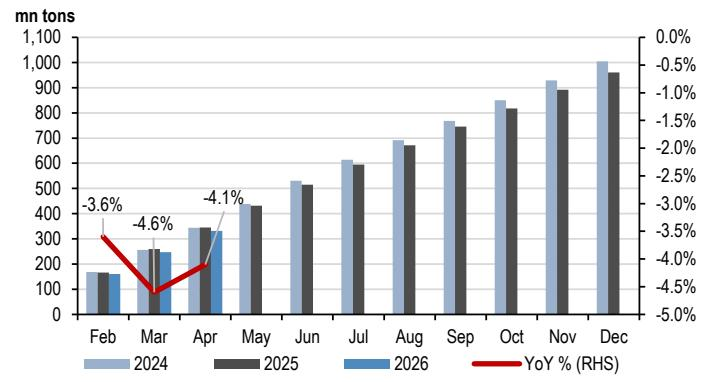

bar

| Month | 2024 (mn tons) | 2025 (mn tons) | YoY % (RHS) |
|-------|----------------|----------------|-------------|
| Feb   | 180            | 170            | -3.6%       |
| Mar   | 250            | 260            | -4.6%       |
| Apr   | 350            | 340            | -4.1%       |
| May   | 450            | 430            |             |
| Jun   | 550            | 520            |             |
| Jul   | 620            | 600            |             |
| Aug   | 700            | 680            |             |
| Sep   | 780            | 750            |             |
| Oct   | 850            | 820            |             |
| Nov   | 950            | 920            |             |
| Dec   | 1050           | 1020           |             |

Source: NBS, JPM

Figure 5: CISA Key Members Daily Average Crude Steel Output   
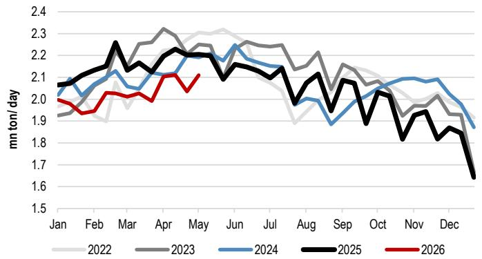

line

| Month | 2022 | 2023 | 2024 | 2025 | 2026 |
|-------|------|------|------|------|------|
| Jan   | 1.9  | 1.9  | 2.0  | 2.1  | 1.9  |
| Feb   | 1.9  | 1.9  | 2.0  | 2.1  | 1.9  |
| Mar   | 1.9  | 2.0  | 2.1  | 2.2  | 2.0  |
| Apr   | 1.9  | 2.1  | 2.1  | 2.2  | 2.0  |
| May   | 1.9  | 2.2  | 2.1  | 2.2  | 2.0  |
| Jun   | 1.9  | 2.3  | 2.2  | 2.1  | 2.1  |
| Jul   | 1.9  | 2.3  | 2.1  | 2.1  | 2.0  |
| Aug   | 1.9  | 2.3  | 2.0  | 2.0  | 1.9  |
| Sep   | 1.9  | 2.3  | 1.9  | 1.9  | 1.8  |
| Oct   | 1.9  | 2.3  | 1.9  | 1.9  | 1.8  |
| Nov   | 1.9  | 2.3  | 1.9  | 1.8  | 1.7  |
| Dec   | 1.9  | 2.3  | 1.8  | 1.7  | 1.6  |

Source: CISA, JPM

Figure 6: Daily Average Molten Iron Output
mn tons/day   
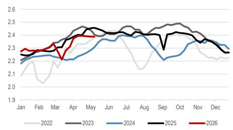

line

| Month | 2022 | 2023 | 2024 | 2025 | 2026 |
|-------|------|------|------|------|------|
| Jan   | 2.1  | 2.2  | 2.2  | 2.3  | 2.3  |
| Feb   | 2.0  | 2.3  | 2.3  | 2.3  | 2.3  |
| Mar   | 2.1  | 2.4  | 2.3  | 2.3  | 2.3  |
| Apr   | 2.3  | 2.4  | 2.3  | 2.4  | 2.4  |
| May   | 2.4  | 2.5  | 2.4  | 2.4  | 2.4  |
| Jun   | 2.4  | 2.4  | 2.4  | 2.4  | 2.4  |
| Jul   | 2.4  | 2.5  | 2.4  | 2.4  | 2.4  |
| Aug   | 2.1  | 2.5  | 2.4  | 2.4  | 2.4  |
| Sep   | 2.3  | 2.5  | 2.3  | 2.4  | 2.4  |
| Oct   | 2.4  | 2.5  | 2.3  | 2.4  | 2.4  |
| Nov   | 2.3  | 2.4  | 2.3  | 2.4  | 2.4  |
| Dec   | 2.3  | 2.3  | 2.3  | 2.3  | 2.3  |

Source: Wind, JPM.

Figure 7: CISA Key Member Daily Average Pig Iron Output   
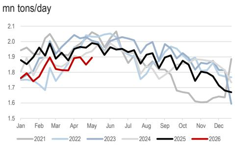

line

| Month | 2021 | 2022 | 2023 | 2024 | 2025 | 2026 |
|-------|------|------|------|------|------|------|
| Jan   | 1.9  | 1.75 | 1.85 | 1.85 | 1.85 | 1.75 |
| Feb   | 1.95 | 1.7  | 1.9  | 1.9  | 1.95 | 1.8  |
| Mar   | 2.0  | 1.8  | 1.95 | 1.95 | 2.0  | 1.85 |
| Apr   | 1.95 | 1.85 | 1.95 | 1.95 | 1.95 | 1.9  |
| May   | 2.05 | 1.9  | 2.0  | 2.0  | 2.05 | 1.95 |
| Jun   | 2.05 | 1.95 | 2.05 | 2.05 | 2.05 | 1.95 |
| Jul   | 1.95 | 1.85 | 1.95 | 1.95 | 1.95 | 1.95 |
| Aug   | 1.9  | 1.8  | 1.9  | 1.9  | 1.9  | 1.9  |
| Sep   | 1.95 | 1.85 | 1.95 | 1.95 | 1.95 | 1.85 |
| Oct   | 1.85 | 1.75 | 1.85 | 1.85 | 1.85 | 1.75 |
| Nov   | 1.75 | 1.7  | 1.75 | 1.75 | 1.75 | 1.65 |
| Dec   | 1.7  | 1.65 | 1.7  | 1.7  | 1.7  | 1.65 |
| Jan   | -    | -    | -    | -    | -    | -    |

Source: CISA, JPM

Figure 8: China steel mills operating ratio and profitability   
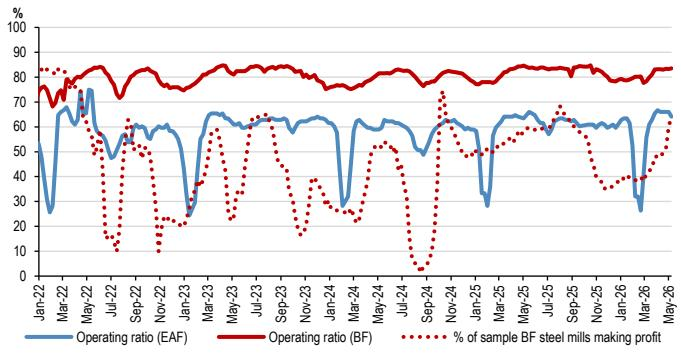

line

| Month   | Operating ratio (EAF) | Operating ratio (BF) | % of sample BF steel mills making profit |
|---------|------------------------|----------------------|------------------------------------------|
| Jan-22  | 50                     | 75                   | 85                                       |
| Mar-22  | 70                     | 80                   | 80                                       |
| May-22  | 60                     | 85                   | 75                                       |
| Jul-22  | 50                     | 80                   | 50                                       |
| Sep-22  | 60                     | 85                   | 60                                       |
| Nov-22  | 50                     | 80                   | 30                                       |
| Jan-23  | 30                     | 75                   | 10                                       |
| Mar-23  | 60                     | 80                   | 60                                       |
| May-23  | 65                     | 85                   | 70                                       |
| Jul-23  | 60                     | 80                   | 65                                       |
| Sep-23  | 65                     | 85                   | 75                                       |
| Nov-23  | 60                     | 80                   | 50                                       |
| Jan-24  | 50                     | 75                   | 30                                       |
| Mar-24  | 60                     | 80                   | 55                                       |
| May-24  | 65                     | 85                   | 60                                       |
| Jul-24  | 60                     | 80                   | 40                                       |
| Sep-24  | 50                     | 75                   | 10                                       |
| Nov-24  | 60                     | 80                   | 70                                       |
| Jan-25  | 65                     | 85                   | 65                                       |
| Mar-25  | 60                     | 80                   | 55                                       |
| May-25  | 65                     | 85                   | 60                                       |
| Jul-25  | 60                     | 80                   | 70                                       |
| Sep-25  | 65                     | 85                   | 65                                       |
| Nov-25  | 60                     | 80                   | 55                                       |
| Jan-26  | 50                     | 75                   | 35                                       |
| Mar-26  | 60                     | 80                   | 45                                       |
| May-26  | 65                     | 85                   | 55                                       |

Source: China Customs, Bloomberg Finance L.P., JPM

Figure 9: China Steel Products Export Volume   
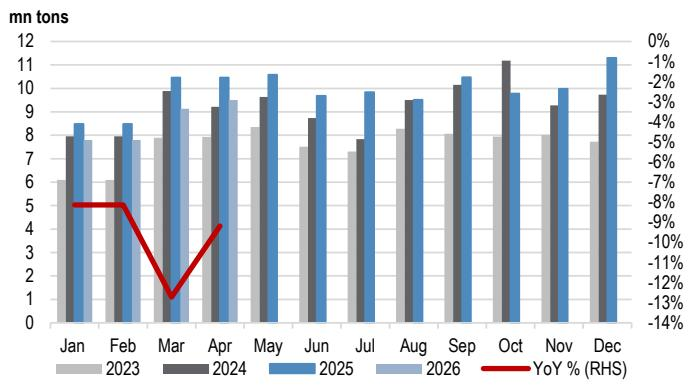

bar

| Month | 2023 | 2024 | 2025 | 2026 | YoY % (RHS) |
|-------|------|------|------|------|-------------|
| Jan   | 6.0  | 8.0  | 8.5  | 7.8  | -8.0%       |
| Feb   | 6.0  | 8.0  | 8.5  | 7.8  | -8.0%       |
| Mar   | 7.8  | 10.0 | 10.5 | 9.0  | -13.0%      |
| Apr   | 7.8  | 9.0  | 10.5 | 9.5  | -9.0%       |
| May   | 8.5  | 9.5  | 10.5 | 9.5  | -9.0%       |
| Jun   | 7.5  | 8.5  | 9.5  | 9.5  | -9.0%       |
| Jul   | 7.5  | 7.8  | 9.5  | 9.5  | -9.0%       |
| Aug   | 8.0  | 9.5  | 9.5  | 9.5  | -9.0%       |
| Sep   | 8.0  | 10.0 | 10.5 | 10.5 | -9.0%       |
| Oct   | 7.8  | 11.0 | 10.0 | 9.5  | -9.0%       |
| Nov   | 7.8  | 9.0  | 10.0 | 9.5  | -9.0%       |
| Dec   | 7.5  | 9.5  | 11.5 | 11.5 | -9.0%       |

Source: China Customs, Bloomberg Finance L.P., JPM

\- April raw coal output edged down 1% YoY; imports fell 13% YoY. China's raw coal production reached 386mt in April (-1% YoY), bringing 4M26 cumulative output to 1,589mt (flat YoY). Raw coal imports declined 13% YoY to 33.1mt in April. Domestic coal prices continue to trend higher, with QHD 5,500kcal reaching \~RMB 830/t. Total coal inventory across the 6 major IPPs remained at a moderate level of \~13mn tons as of mid-May, broadly in line with year-ago levels. Coal demand in 2Q typically softens on seasonal dynamics, but we see upside risk from stronger coal-fired generation should China's export-oriented industrial activity pick up, translating into higher thermal power consumption. Inventory levels in late May and June remain a key watch point.

Figure 10: China raw coal production   
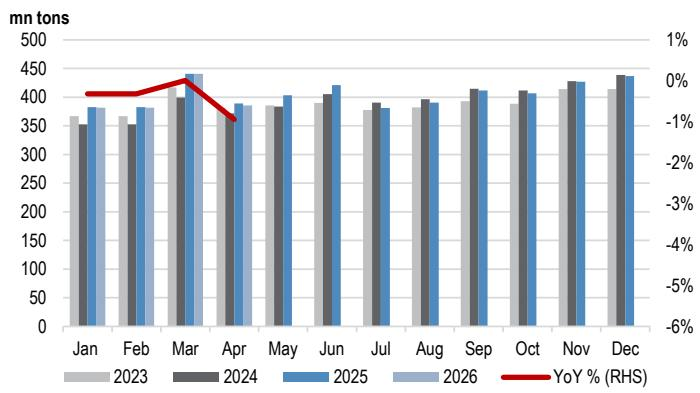

bar_line

| Month | 2023 (mn tons) | 2024 (mn tons) | 2025 (mn tons) | 2026 (mn tons) | YoY % (RHS) |
|---|---|---|---|---|---|
| Jan | 360 | 350 | 380 | 385 | -0.1% |
| Feb | 370 | 350 | 390 | 385 | -0.1% |
| Mar | 400 | 400 | 440 | 445 | -0.1% |
| Apr | 370 | 380 | 390 | 395 | -1.1% |
| May | 390 | 385 | 405 | 405 | -0.1% |
| Jun | 395 | 405 | 420 | 425 | -0.1% |
| Jul | 385 | 390 | 385 | 385 | -0.1% |
| Aug | 385 | 395 | 390 | 395 | -0.1% |
| Sep | 395 | 415 | 410 | 415 | -0.1% |
| Oct | 390 | 410 | 405 | 405 | -0.1% |
| Nov | 415 | 425 | 425 | 425 | -0.1% |
| Dec | 415 | 435 | 435 | 435 | -0.1% |

Source: NBS, Bloomberg Finance L.P., JPM

Figure 11: China thermal power generation   
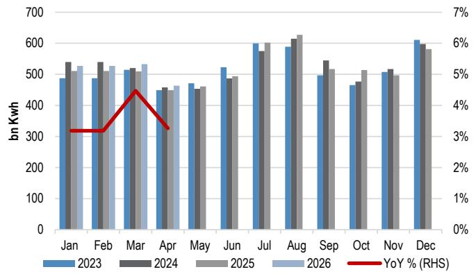

bar

| Month | 2023 | 2024 | 2025 | 2026 | YoY % (RHS) |
|-------|------|------|------|------|-------------|
| Jan   | 490  | 540  | 530  | -    | 3.1%        |
| Feb   | 480  | 540  | 510  | -    | 3.1%        |
| Mar   | -    | 520  | -    | -    | 4.5%        |
| Apr   | 450  | 460  | 450  | -    | 3.3%        |
| May   | 470  | -    | 460  | -    | -           |
| Jun   | 520  | -    | 490  | -    | -           |
| Jul   | -    | 570  | -    | -    | -           |
| Aug   | -    | -    | 620  | -    | -           |
| Sep   | -    | -    | -    | -    | -           |
| Oct   | -    | -    | -    | -    | -           |
| Nov   | -    | -    | -    | -    | -           |
| Dec   | -    | -    | -    | -    | -           |

Source: China Customs, Bloomberg Finance L.P., JPM

\- April 2026 aluminum production rose 3.1% YoY; the SHCJ–LME spread widened further. China produced 3.9mt of aluminum in March 2026 (+3.1% YoY), with exports increasing to 600kt in the month (+15% YoY). China's aluminum social inventory continues to hover around 1.4mt on the back of elevated prices, as buyers remain price-sensitive. Our channel checks indicate that demand is showing early signs of recovery heading into May, though this has yet to translate into meaningful destocking. With no material change in the status of operational suspensions at key ME smelters, we expect inventory drawdowns to materialize through the remainder of 2Q26, albeit at a slow pace as price levels remain a key factor in downstream procurement decisions. The S/D impact on overseas markets should be more pronounced than in China — our regional team points out that petroleum coke, a key raw material in carbon anode production, could present further supply challenges for ex-Gulf aluminum output (link to report). With Chinese downstream purchasing still heavily influenced by price, we expect the SHFE–LME spread to continue widening into 2Q26.

Figure 12: China monthly aluminum production   
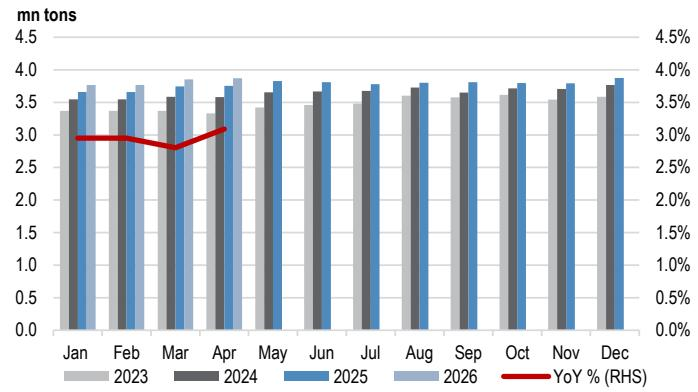

bar

| Month | 2023 | 2024 | 2025 | 2026 | YoY % (RHS) |
|-------|------|------|------|------|-------------|
| Jan   | 3.4  | 3.6  | 3.7  | 3.8  | 3.0%        |
| Feb   | 3.3  | 3.5  | 3.6  | 3.7  | 2.9%        |
| Mar   | 3.4  | 3.5  | 3.7  | 3.8  | 2.8%        |
| Apr   | 3.3  | 3.6  | 3.8  | 3.9  | 3.1%        |
| May   | 3.4  | 3.6  | 3.8  | 3.9  | —           |
| Jun   | 3.5  | 3.7  | 3.8  | 3.9  | —           |
| Jul   | 3.5  | 3.7  | 3.8  | 3.9  | —           |
| Aug   | 3.6  | 3.7  | 3.8  | 3.9  | —           |
| Sep   | 3.6  | 3.7  | 3.8  | 3.9  | —           |
| Oct   | 3.6  | 3.7  | 3.8  | —    | —           |
| Nov   | 3.5  | 3.7  | 3.8  | —    | —           |
| Dec   | 3.5  | 3.7  | 3.8  | —    | —           |

Source: NBS, JPM

Figure 13: China aluminum social inventory   
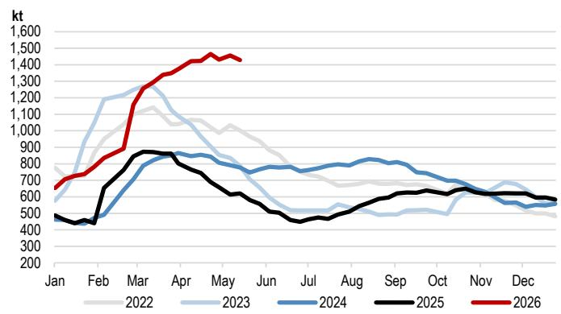

line

| Month | 2022  | 2023  | 2024  | 2025  | 2026  |
|-------|-------|-------|-------|-------|-------|
| Jan   | 700   | 500   | 450   | 450   | 650   |
| Feb   | 800   | 900   | 500   | 600   | 750   |
| Mar   | 1100  | 1200  | 800   | 850   | 1300  |
| Apr   | 1050  | 1100  | 850   | 850   | 1450  |
| May   | 1000  | 900   | 800   | 750   | 1450  |
| Jun   | 850   | 750   | 750   | 650   | -     |
| Jul   | 750   | 550   | 750   | 450   | -     |
| Aug   | 700   | 550   | 800   | 550   | -     |
| Sep   | 650   | 550   | 750   | 600   | -     |
| Oct   | 650   | 550   | 700   | 650   | -     |
| Nov   | 650   | 650   | 650   | 650   | -     |
| Dec   | 600   | 600   | 600   | 600   | -     |

Source: SMM, JPM

\- 2Q26 lithium S/D sees more moving factors. April 2026 China auto production fell $2.6\%$ YoY, while NEV production rose $3.8\%$ YoY, continuing to show signs of stabilization following two consecutive months of double-digit declines. With oil price tailwinds continuing to accelerate NEV adoption, NEV PV retail penetration surpassed the 60% milestone in April (link to report). BloombergNEF raised its 2026 ESS capacity installation estimates by \~30% (60% of the increment from China), supported by 15th FYP policies, capacity payments, and spot power market liberalization (link to report). Downstream procurement appetite remains firm, with Ganfeng noting buyer willingness to lock in volumes at up to Rmb250k/t levels, suggesting a supportive floor for near-term pricing. Spot lithium carbonate prices have surged above RMB 190k/t, with weekly inventory hovering around 101-103kt—still a relatively low level. On the supply side, signals are mixed: Jiangxi CATL has not resumed operations and other Jiangxi mines remain subject to compliance requirements, continuing to constrain domestic output, but we are seeing supply response elsewhere—Mineral Resources announced the restart of its Bald Hill lithium mine (\~165ktpa of spodumene concentrate, on care and maintenance since Nov 2024), with first production targeted for July and initial shipments in 1Q FY27, while Zimbabwe concentrate shipments have begun this week as we previously expected, with cargoes set to arrive in Jun–Jul.

Table 1: China NBS data summary 

<table><tr><td></td><td>Unit</td><td>Apr-26</td><td>YoY %</td><td>MoM %</td><td>4M26</td><td>YoY %</td></tr><tr><td colspan="7">Major products output:</td></tr><tr><td>Cement</td><td>mn tons</td><td>146</td><td>-10.8%</td><td>18.4%</td><td>443.3</td><td>-8.6%</td></tr><tr><td>Finished steel</td><td>mn tons</td><td>123</td><td>-1.7%</td><td>-6.4%</td><td>471.9</td><td>-1.3%</td></tr><tr><td>Crude steel</td><td>mn tons</td><td>84</td><td>-2.8%</td><td>-3.9%</td><td>331.1</td><td>-4.1%</td></tr><tr><td>Aluminum</td><td>mn tons</td><td>4</td><td>3.1%</td><td>0.5%</td><td>15.3</td><td>3.5%</td></tr><tr><td>Automobile</td><td>mn units</td><td>3</td><td>-2.6%</td><td>-16.4%</td><td>9.7</td><td>-5.0%</td></tr><tr><td>-- of which: NEV</td><td>mn units</td><td>1</td><td>3.8%</td><td>-3.0%</td><td>4.3</td><td>-3.8%</td></tr><tr><td>Raw Coal</td><td>mn tons</td><td>386</td><td>-1.0%</td><td>-12.5%</td><td>1,583.9</td><td>-0.1%</td></tr><tr><td>Electricity</td><td>bn KWh</td><td>744</td><td>2.6%</td><td>-7.3%</td><td>3,123.7</td><td>3.3%</td></tr><tr><td>-- Thermal Power</td><td>bn KWh</td><td>464</td><td>3.1%</td><td>-12.9%</td><td>2,054.6</td><td>3.6%</td></tr><tr><td>-- Hydro-electric Power</td><td>bn KWh</td><td>88</td><td>12.2%</td><td>2.2%</td><td>330.3</td><td>9.9%</td></tr><tr><td colspan="7">Industrial Added Value</td></tr><tr><td>National Total</td><td>%</td><td>n.a.</td><td>4.1%</td><td>-1.6ppt</td><td>n.a.</td><td>5.6%</td></tr><tr><td>Mining</td><td>%</td><td>n.a.</td><td>3.8%</td><td>-1.9ppt</td><td>n.a.</td><td>5.5%</td></tr><tr><td>Ferrous Metals</td><td>%</td><td>n.a.</td><td>1.0%</td><td>-0.7ppt</td><td>n.a.</td><td>1.8%</td></tr><tr><td>Non-ferrous Metals</td><td>%</td><td>n.a.</td><td>-1.0%</td><td>-1.0ppt</td><td>n.a.</td><td>1.5%</td></tr><tr><td colspan="7">Property</td></tr><tr><td>Investment</td><td>Rmb bn</td><td>625</td><td>-20.1%</td><td>-22.9%</td><td>2,397</td><td>-13.7%</td></tr><tr><td>FS Started</td><td>mn sqm</td><td>35</td><td>-27.1%</td><td>-33.3%</td><td>139</td><td>-22.0%</td></tr><tr><td>FS Under Construction</td><td>mn sqm</td><td>5,451</td><td>-12.1%</td><td>0.6%</td><td>5,451</td><td>-12.1%</td></tr><tr><td>FS Completed</td><td>mn sqm</td><td>21</td><td>-19.0%</td><td>-39.6%</td><td>119</td><td>-24.0%</td></tr><tr><td>FS Sold</td><td>mn sqm</td><td>57</td><td>-10.3%</td><td>-44.0%</td><td>253</td><td>-10.2%</td></tr><tr><td colspan="7">FAI:</td></tr><tr><td>Total FAI Investment</td><td>Rmb bn</td><td>3,859</td><td>-12.0%</td><td>-22.8%</td><td>14,129</td><td>-1.6%</td></tr><tr><td>-- Secondary industry FAI</td><td>Rmb bn</td><td>1,430</td><td>-8.6%</td><td>-26.0%</td><td>5,107</td><td>2.5%</td></tr><tr><td>-- Tertiary industry FAI</td><td>Rmb bn</td><td>2,347</td><td>-14.1%</td><td>-20.2%</td><td>8,708</td><td>-4.2%</td></tr><tr><td>Railway transportation FAI</td><td>Rmb bn</td><td>49</td><td>0.0%</td><td>-43.1%</td><td>218</td><td>0.0%</td></tr><tr><td>Road transportation FAI</td><td>Rmb bn</td><td>281</td><td>-18.1%</td><td>-46.3%</td><td>1,185</td><td>-3.0%</td></tr></table>

Source: NBS, WIND, JPM.

Table 2: China customs data summary 

<table><tr><td></td><td>Unit</td><td>Apr-26</td><td>YoY %</td><td>MoM %</td><td>4M26</td><td>YoY %</td></tr><tr><td colspan="7">Import</td></tr><tr><td>Raw Coal</td><td>mn tons</td><td>33.1</td><td>-12.6%</td><td>-15.3%</td><td>149.4</td><td>-2.1%</td></tr><tr><td>Iron Ore</td><td>mn tons</td><td>103.9</td><td>0.7%</td><td>-0.8%</td><td>418.6</td><td>8.0%</td></tr><tr><td>Steel products</td><td>mn tons</td><td>0.5</td><td>-9.6%</td><td>-7.8%</td><td>1.8</td><td>-13.4%</td></tr><tr><td>Copper</td><td>k tons</td><td>450.0</td><td>2.3%</td><td>7.1%</td><td>1,570.0</td><td>-9.8%</td></tr><tr><td colspan="7">Export</td></tr><tr><td>Steel products</td><td>mn tons</td><td>9.5</td><td>-9.2%</td><td>4.1%</td><td>34.2</td><td>-9.7%</td></tr><tr><td>Aluminum</td><td>k tons</td><td>600.0</td><td>15.4%</td><td>22.4%</td><td>2,050.0</td><td>8.9%</td></tr></table>

Source: China Customs, JPM

# Valuation

Table 3: Global Diversified Mining Valuations Comparison 

<table><tr><td rowspan="2"></td><td rowspan="2">Ticker</td><td rowspan="2">JPM Rating</td><td rowspan="2">Covering Analyst</td><td rowspan="2">Last Price (LC)</td><td rowspan="2">Mkt Cap (USDm)</td><td rowspan="2">3M Avg TO (USDm)</td><td colspan="2">PE (x)</td><td colspan="2">P/BV (x)</td><td colspan="2">EV/EBITDA (x)</td><td rowspan="2">Div yield 2026E</td></tr><tr><td>2026E</td><td>2027E</td><td>2026E</td><td>2027E</td><td>2026E</td><td>2027E</td></tr><tr><td colspan="14">Copper &amp; Diversified Miners</td></tr><tr><td colspan="14">China</td></tr><tr><td>Zijin Mining - A</td><td>601899 CH</td><td>OW</td><td>Avery Chan</td><td>31.30</td><td>125,575</td><td>1,508</td><td>10.3</td><td>9.1</td><td>3.3</td><td>2.6</td><td>6.8</td><td>6.1</td><td>2%</td></tr><tr><td>CMOC - A</td><td>603993 CH</td><td>OW</td><td>Avery Chan</td><td>18.31</td><td>57,606</td><td>792</td><td>12.1</td><td>11.5</td><td>3.7</td><td>3.0</td><td>6.1</td><td>5.7</td><td>2%</td></tr><tr><td>Zijin Mining - H</td><td>2899 HK</td><td>OW</td><td>Avery Chan</td><td>34.42</td><td>119,914</td><td>304</td><td>9.9</td><td>8.7</td><td>3.2</td><td>2.5</td><td>6.8</td><td>6.1</td><td>2%</td></tr><tr><td>Jiangxi Copper - A</td><td>600362 CH</td><td>OW</td><td>Avery Chan</td><td>45.44</td><td>23,069</td><td>311</td><td>12.7</td><td>13.1</td><td>1.8</td><td>1.6</td><td>9.6</td><td>9.6</td><td>3%</td></tr><tr><td>CMOC - H</td><td>3993 HK</td><td>OW</td><td>Avery Chan</td><td>17.97</td><td>49,094</td><td>132</td><td>10.2</td><td>9.6</td><td>3.1</td><td>2.5</td><td>6.0</td><td>5.6</td><td>1%</td></tr><tr><td>Jiangxi Copper - H</td><td>358 HK</td><td>OW</td><td>Avery Chan</td><td>35.94</td><td>15,844</td><td>75</td><td>8.9</td><td>8.8</td><td>1.2</td><td>1.1</td><td>9.6</td><td>9.3</td><td>2%</td></tr><tr><td colspan="14">Asia ex-China</td></tr><tr><td>Vedanta Ltd</td><td>VEDL IN</td><td>OW</td><td>Vibhav Zutshi</td><td>327.00</td><td>13,375</td><td>146</td><td>4.8</td><td>4.8</td><td>2.1</td><td>1.7</td><td>2.2</td><td>2.2</td><td>3%</td></tr><tr><td>Press Metals</td><td>PMAH MK</td><td>OW</td><td>Benny Kurniawan</td><td>8.88</td><td>18,412</td><td>26</td><td>27.8</td><td>25.7</td><td>6.2</td><td>5.3</td><td>18.6</td><td>17.3</td><td>1%</td></tr><tr><td>Merdeka Copper Gold</td><td>MDKA IJ</td><td>OW</td><td>Benny Kurniawan</td><td>2660.00</td><td>3,676</td><td>13</td><td>75.3</td><td>16.7</td><td>3.0</td><td>2.1</td><td>7.9</td><td>7.1</td><td>n.a.</td></tr><tr><td colspan="14">Australia</td></tr><tr><td>BHP</td><td>BHP AU</td><td>OW</td><td>Lyndon Fagan</td><td>58.77</td><td>214,227</td><td>454</td><td>16.6</td><td>16.3</td><td>3.9</td><td>3.5</td><td>7.4</td><td>7.5</td><td>3%</td></tr><tr><td>Newmont</td><td>NEM AU</td><td>OW</td><td>Jonathon Sharp</td><td>150.79</td><td>na</td><td>58</td><td>10.4</td><td>9.8</td><td>2.9</td><td>2.3</td><td>5.9</td><td>5.7</td><td>1%</td></tr><tr><td>South32</td><td>S32 AU</td><td>OW</td><td>Lyndon Fagan</td><td>4.03</td><td>12,993</td><td>62</td><td>14.2</td><td>10.5</td><td>1.3</td><td>1.2</td><td>6.6</td><td>5.6</td><td>2%</td></tr><tr><td>Capstone Copper</td><td>CSC AU</td><td>OW</td><td>Lyndon Fagan</td><td>13.03</td><td>na</td><td>20</td><td>18.8</td><td>12.8</td><td>1.8</td><td>1.6</td><td>6.7</td><td>5.0</td><td>n.a.</td></tr><tr><td>Sandfire Resources</td><td>SFR AU</td><td>OW</td><td>Lyndon Fagan</td><td>18.14</td><td>6,034</td><td>32</td><td>19.2</td><td>12.2</td><td>2.9</td><td>2.5</td><td>7.7</td><td>6.0</td><td>n.a.</td></tr><tr><td>Mineral Resources</td><td>MIN AU</td><td>NR</td><td>Lyndon Fagan</td><td>64.10</td><td>9,074</td><td>58</td><td>16.5</td><td>19.1</td><td>3.1</td><td>2.5</td><td>7.6</td><td>7.9</td><td>n.a.</td></tr><tr><td colspan="14">US</td></tr><tr><td>Freeport-McMoRan</td><td>FCX US</td><td>OW</td><td>Bill Peterson</td><td>61.15</td><td>88,286</td><td>1,060</td><td>24.0</td><td>16.7</td><td>4.0</td><td>3.3</td><td>9.3</td><td>6.7</td><td>1%</td></tr><tr><td>Teck Resources</td><td>TECK US</td><td>N</td><td>Bill Peterson</td><td>60.43</td><td>29,662</td><td>211</td><td>18.4</td><td>20.4</td><td>1.4</td><td>1.4</td><td>6.4</td><td>6.5</td><td>1%</td></tr><tr><td>Ivanhoe Electric</td><td>IE US</td><td>OW</td><td>Bill Peterson</td><td>12.19</td><td>1,932</td><td>28</td><td>n.a.</td><td>n.a.</td><td>n.a.</td><td>n.a.</td><td>n.a.</td><td>n.a.</td><td>n.a.</td></tr><tr><td colspan="14">EMEA</td></tr><tr><td>BHP</td><td>BHP LN</td><td>N</td><td>Dominic O&#x27;Kane</td><td>3139.00</td><td>na</td><td>36</td><td>16.6</td><td>16.4</td><td>3.9</td><td>3.6</td><td>7.4</td><td>7.5</td><td>3%</td></tr><tr><td colspan="14">LatAm</td></tr><tr><td>Southern Copper Corp</td><td>SCCO US</td><td>UW</td><td>Rodolfo Angele</td><td>172.52</td><td>143,173</td><td>300</td><td>24.6</td><td>26.7</td><td>10.8</td><td>10.0</td><td>14.3</td><td>15.2</td><td>2%</td></tr><tr><td>Nexa</td><td>NEXA US</td><td>N</td><td>Rodolfo Angele</td><td>14.86</td><td>1,971</td><td>16</td><td>5.1</td><td>5.4</td><td>1.3</td><td>1.2</td><td>3.1</td><td>3.3</td><td>n.a.</td></tr><tr><td colspan="14">Nickel &amp; Cobalt</td></tr><tr><td colspan="14">China</td></tr><tr><td>Huayou Cobalt</td><td>603799 CH</td><td>NC</td><td>N/A</td><td>58.31</td><td>16,223</td><td>644</td><td>12.5</td><td>10.1</td><td>2.1</td><td>1.7</td><td>9.1</td><td>7.9</td><td>1%</td></tr><tr><td>CNGR</td><td>300919 CH</td><td>OW</td><td>Parsley Ong</td><td>56.22</td><td>8,617</td><td>154</td><td>25.2</td><td>21.3</td><td>2.1</td><td>1.9</td><td>16.0</td><td>14.5</td><td>1%</td></tr><tr><td colspan="14">ASEAN &amp; Australia</td></tr><tr><td>Aneka Tambang</td><td>ANTM IJ</td><td>OW</td><td>Benny Kurniawan</td><td>3160.00</td><td>4,298</td><td>26</td><td>8.1</td><td>7.6</td><td>1.9</td><td>1.7</td><td>5.4</td><td>5.0</td><td>5%</td></tr><tr><td>Vale Indonesia</td><td>INCO IJ</td><td>OW</td><td>Benny Kurniawan</td><td>5350.00</td><td>3,192</td><td>8</td><td>12.6</td><td>8.0</td><td>1.0</td><td>0.9</td><td>6.2</td><td>4.3</td><td>100%</td></tr><tr><td>Nickel Industries</td><td>NIC AU</td><td>NC</td><td>N/A</td><td>1.02</td><td>3,172</td><td>10</td><td>12.3</td><td>6.6</td><td>1.4</td><td>1.2</td><td>7.4</td><td>4.8</td><td>n.a.</td></tr></table>

Source: Bloomberg Finance L.P., JPM. Note: Price data represents last price; NR = Not Rated; NC = Not Covered; Bloomberg consensus estimates for all stocks.

Table 4: Global Iron Ore & Steel Valuation Comparison 

<table><tr><td rowspan="2"></td><td rowspan="2">Ticker</td><td rowspan="2">JPM Rating</td><td rowspan="2">Covering Analyst</td><td rowspan="2">Last Price (LC)</td><td rowspan="2">Mkt Cap (USDm)</td><td rowspan="2">3M Avg TO (USDm)</td><td colspan="2">PE (x)</td><td colspan="2">P/BV (x)</td><td colspan="2">EV/EBITDA (x)</td><td rowspan="2">Div yield 2026E</td></tr><tr><td>2026E</td><td>2027E</td><td>2026E</td><td>2027E</td><td>2026E</td><td>2027E</td></tr><tr><td colspan="14">Steel &amp; Iron Ore</td></tr><tr><td colspan="14">China</td></tr><tr><td>Baosteel</td><td>600019 CH</td><td>N</td><td>Avery Chan</td><td>6.04</td><td>19,303</td><td>127</td><td>11.1</td><td>9.7</td><td>0.6</td><td>0.6</td><td>5.0</td><td>4.7</td><td>5%</td></tr><tr><td>Angang - A</td><td>000898 CH</td><td>UW</td><td>Avery Chan</td><td>2.10</td><td>2,887</td><td>20</td><td>n.a.</td><td>n.a.</td><td>0.5</td><td>0.5</td><td>68.4</td><td>13.6</td><td>n.a.</td></tr><tr><td>Angang - H</td><td>347 HK</td><td>UW</td><td>Avery Chan</td><td>1.36</td><td>1,627</td><td>3</td><td>n.a.</td><td>n.a.</td><td>0.3</td><td>0.3</td><td>68.4</td><td>13.6</td><td>n.a.</td></tr><tr><td>BaoTou Steel</td><td>600010 CH</td><td>NC</td><td>N/A</td><td>2.61</td><td>17,343</td><td>519</td><td>58.0</td><td>29.0</td><td>2.1</td><td>2.0</td><td>n.a.</td><td>n.a.</td><td>n.a.</td></tr><tr><td>Hunan Valin Steel</td><td>000932 CH</td><td>NC</td><td>N/A</td><td>4.22</td><td>4,264</td><td>62</td><td>7.7</td><td>7.0</td><td>0.5</td><td>0.5</td><td>9.4</td><td>8.0</td><td>4%</td></tr><tr><td>Maanshan Iron &amp; Steel</td><td>600808 CH</td><td>NC</td><td>N/A</td><td>3.34</td><td>3,774</td><td>40</td><td>41.2</td><td>15.2</td><td>1.1</td><td>1.0</td><td>7.9</td><td>6.1</td><td>n.a.</td></tr><tr><td colspan="14">Japan</td></tr><tr><td>Nippon Steel</td><td>5401 JT</td><td>NC</td><td>N/A</td><td>550.00</td><td>18,071</td><td>120</td><td>8.3</td><td>7.3</td><td>0.5</td><td>0.5</td><td>6.6</td><td>6.1</td><td>4%</td></tr><tr><td>JFE Holdings</td><td>5411 JT</td><td>NC</td><td>N/A</td><td>1668.50</td><td>7,021</td><td>54</td><td>8.0</td><td>7.5</td><td>0.4</td><td>0.4</td><td>6.3</td><td>5.9</td><td>5%</td></tr><tr><td>Kobe Steel</td><td>5406 JT</td><td>NC</td><td>N/A</td><td>1920.50</td><td>4,766</td><td>31</td><td>8.4</td><td>8.0</td><td>0.6</td><td>0.6</td><td>5.4</td><td>5.2</td><td>4%</td></tr><tr><td colspan="14">Asia ex-China</td></tr><tr><td>JSW Steel</td><td>JSTL IN</td><td>OW</td><td>Vibhav Zutshi</td><td>1285.20</td><td>32,466</td><td>26</td><td>21.6</td><td>18.1</td><td>2.9</td><td>2.5</td><td>10.2</td><td>9.0</td><td>1%</td></tr><tr><td>Tata Steel</td><td>TATA IN</td><td>N</td><td>Vibhav Zutshi</td><td>209.29</td><td>26,967</td><td>73</td><td>14.3</td><td>12.5</td><td>2.3</td><td>2.0</td><td>7.9</td><td>7.3</td><td>2%</td></tr><tr><td>POSCO</td><td>005490 KS</td><td>N</td><td>Sonny Lee</td><td>433500.00</td><td>21,690</td><td>275</td><td>17.2</td><td>13.9</td><td>0.6</td><td>0.6</td><td>7.4</td><td>6.5</td><td>2%</td></tr><tr><td>NMDC</td><td>NMDC IN</td><td>UW</td><td>Vibhav Zutshi</td><td>89.02</td><td>8,084</td><td>23</td><td>10.5</td><td>10.0</td><td>2.3</td><td>2.0</td><td>7.7</td><td>7.0</td><td>4%</td></tr><tr><td>Steel Authority of India</td><td>SAIL IN</td><td>N</td><td>Vibhav Zutshi</td><td>199.05</td><td>8,492</td><td>52</td><td>15.3</td><td>14.3</td><td>1.3</td><td>1.2</td><td>7.1</td><td>7.0</td><td>1%</td></tr><tr><td>Hyundai Steel</td><td>004020 KS</td><td>NC</td><td>N/A</td><td>37800.00</td><td>3,290</td><td>84</td><td>26.1</td><td>12.5</td><td>0.3</td><td>0.3</td><td>6.5</td><td>5.7</td><td>1%</td></tr><tr><td colspan="14">Australia</td></tr><tr><td>BHP</td><td>BHP AU</td><td>OW</td><td>Lyndon Fagan</td><td>58.70</td><td>211,675</td><td>449</td><td>16.5</td><td>16.4</td><td>3.9</td><td>3.6</td><td>7.3</td><td>7.4</td><td>3%</td></tr><tr><td>Fortescue</td><td>FMG AU</td><td>N</td><td>Lyndon Fagan</td><td>21.88</td><td>47,736</td><td>114</td><td>12.6</td><td>16.4</td><td>2.2</td><td>2.1</td><td>5.6</td><td>6.6</td><td>6%</td></tr><tr><td>Bluescope Steel</td><td>BSL AU</td><td>OW</td><td>Lee Power</td><td>29.60</td><td>9,258</td><td>33</td><td>15.4</td><td>14.3</td><td>1.2</td><td>1.2</td><td>7.0</td><td>6.4</td><td>3%</td></tr><tr><td>Sims Metal</td><td>SGM AU</td><td>OW</td><td>Lee Power</td><td>22.41</td><td>3,061</td><td>17</td><td>20.8</td><td>13.9</td><td>1.6</td><td>1.5</td><td>8.0</td><td>6.7</td><td>1%</td></tr><tr><td colspan="14">US</td></tr><tr><td>Nucor</td><td>NUE US</td><td>OW</td><td>Bill Peterson</td><td>220.09</td><td>50,467</td><td>289</td><td>14.9</td><td>13.6</td><td>2.1</td><td>1.9</td><td>8.6</td><td>8.0</td><td>1%</td></tr><tr><td>Steel Dynamics</td><td>STLD US</td><td>N</td><td>Bill Peterson</td><td>221.26</td><td>32,154</td><td>228</td><td>14.6</td><td>12.9</td><td>3.1</td><td>2.7</td><td>9.9</td><td>9.1</td><td>1%</td></tr><tr><td>Cleveland-Cliffs</td><td>CLF US</td><td>N</td><td>Bill Peterson</td><td>10.28</td><td>5,864</td><td>163</td><td>n.a.</td><td>39.1</td><td>1.0</td><td>1.0</td><td>10.8</td><td>7.6</td><td>n.a.</td></tr><tr><td colspan="14">EMEA</td></tr><tr><td>BHP</td><td>BHP LN</td><td>N</td><td>Dominic O&#x27;Kane</td><td>3035.00</td><td>211,675</td><td>3,512</td><td>16.1</td><td>16.1</td><td>3.8</td><td>3.5</td><td>7.2</td><td>7.3</td><td>3%</td></tr><tr><td>Arcelor Mittal</td><td>MT NA</td><td>UW</td><td>Dominic O&#x27;Kane</td><td>51.04</td><td>45,220</td><td>144</td><td>12.5</td><td>8.9</td><td>0.8</td><td>0.7</td><td>6.8</td><td>5.6</td><td>1%</td></tr><tr><td>Voestalpine</td><td>VOE AV</td><td>UW</td><td>Dominic O&#x27;Kane</td><td>44.18</td><td>8,784</td><td>17</td><td>20.2</td><td>12.3</td><td>1.0</td><td>1.0</td><td>6.6</td><td>5.4</td><td>1%</td></tr><tr><td>Acerinox</td><td>ACX SM</td><td>UW</td><td>Dominic O&#x27;Kane</td><td>14.36</td><td>4,152</td><td>15</td><td>14.9</td><td>10.2</td><td>1.6</td><td>1.4</td><td>8.1</td><td>6.5</td><td>3%</td></tr><tr><td>Aperam</td><td>APAM NA</td><td>N</td><td>Dominic O&#x27;Kane</td><td>47.20</td><td>4,001</td><td>9</td><td>22.5</td><td>11.3</td><td>1.1</td><td>1.0</td><td>9.1</td><td>6.6</td><td>4%</td></tr><tr><td colspan="14">LatAm</td></tr><tr><td>Vale</td><td>VALE US</td><td>OW</td><td>Rodolfo Angele</td><td>15.88</td><td>67,938</td><td>457</td><td>8.1</td><td>8.3</td><td>1.7</td><td>1.6</td><td>4.9</td><td>4.9</td><td>1%</td></tr><tr><td>CSN Mineracao</td><td>CMIN3 BZ</td><td>UW</td><td>Rodolfo Angele</td><td>4.21</td><td>4,570</td><td>9</td><td>10.1</td><td>13.8</td><td>2.2</td><td>7.5</td><td>4.2</td><td>4.2</td><td>7%</td></tr><tr><td>CSN (Steel)</td><td>CSNA3 BZ</td><td>N</td><td>Rodolfo Angele</td><td>6.00</td><td>1,575</td><td>19</td><td>n.a.</td><td>109.1</td><td>0.7</td><td>0.7</td><td>4.4</td><td>4.1</td><td>n.a.</td></tr></table>

Source: Bloomberg Finance L.P., JPM. Note: Price data represents last price; NR = Not Rated; NC = Not Covered; Bloomberg consensus estimates for all stocks

Table 5: Global Aluminum Valuations Comparison 

<table><tr><td rowspan="2"></td><td rowspan="2">Ticker</td><td rowspan="2">JPM Rating</td><td rowspan="2">Covering Analyst</td><td rowspan="2">Last Price (LC)</td><td rowspan="2">Mkt Cap (USDm)</td><td rowspan="2">Avg TO (USDm)</td><td colspan="2">PE (x)</td><td colspan="2">P/BV (x)</td><td colspan="2">EV/EBITDA (x)</td><td rowspan="2">Div yield 2026E</td></tr><tr><td>2026E</td><td>2027E</td><td>2026E</td><td>2027E</td><td>2026E</td><td>2027E</td></tr><tr><td colspan="14">Aluminum &amp; Alumina</td></tr><tr><td colspan="14">China</td></tr><tr><td>Hongqiao</td><td>1378 HK</td><td>OW</td><td>Avery Chan</td><td>30.90</td><td>37,815</td><td>203</td><td>7.9</td><td>7.6</td><td>1.7</td><td>1.5</td><td>4.8</td><td>4.7</td><td>5%</td></tr><tr><td>Chalco - A</td><td>601600 CH</td><td>OW</td><td>Avery Chan</td><td>10.52</td><td>26,555</td><td>564</td><td>8.1</td><td>7.8</td><td>1.9</td><td>1.6</td><td>4.2</td><td>4.3</td><td>3%</td></tr><tr><td>Chalco - H</td><td>2600 HK</td><td>OW</td><td>Avery Chan</td><td>10.37</td><td>22,731</td><td>89</td><td>7.0</td><td>7.0</td><td>1.7</td><td>1.4</td><td>4.4</td><td>4.5</td><td>3%</td></tr><tr><td colspan="14">ASEAN</td></tr><tr><td>Vedanta Ltd</td><td>VEDL IN</td><td>OW</td><td>Vibhav Zutshi</td><td>327.00</td><td>13,375</td><td>146</td><td>4.8</td><td>4.8</td><td>2.1</td><td>1.7</td><td>2.2</td><td>2.2</td><td>3%</td></tr><tr><td>Hindalco</td><td>HNDL IN</td><td>OW</td><td>Vibhav Zutshi</td><td>1053.10</td><td>24,340</td><td>65</td><td>14.5</td><td>11.9</td><td>1.7</td><td>1.5</td><td>8.5</td><td>7.3</td><td>0%</td></tr><tr><td>Press Metal</td><td>PMAH MK</td><td>OW</td><td>Benny Kurniawan</td><td>8.88</td><td>18,412</td><td>26</td><td>27.8</td><td>25.7</td><td>6.2</td><td>5.3</td><td>18.6</td><td>17.3</td><td>1%</td></tr><tr><td>National Aluminium</td><td>NACL IN</td><td>NC</td><td>N/A</td><td>400.45</td><td>7,640</td><td>56</td><td>11.5</td><td>11.3</td><td>2.8</td><td>2.4</td><td>7.3</td><td>7.2</td><td>0%</td></tr><tr><td colspan="14">Australia</td></tr><tr><td>South32</td><td>S32 AU</td><td>OW</td><td>Lyndon Fagan</td><td>4.03</td><td>12,993</td><td>62</td><td>14.2</td><td>10.5</td><td>1.3</td><td>1.2</td><td>6.6</td><td>5.6</td><td>2%</td></tr><tr><td colspan="14">EMEA</td></tr><tr><td>Ma&#x27;aden</td><td>MAADEN AB</td><td>N</td><td>Anna Antonova</td><td>61.75</td><td>63,874</td><td>33</td><td>24.1</td><td>23.7</td><td>3.4</td><td>3.0</td><td>14.5</td><td>13.6</td><td>n.a.</td></tr><tr><td>Norsk Hydro</td><td>NHY NO</td><td>OW</td><td>Patrick Jones</td><td>106.20</td><td>22,529</td><td>48</td><td>11.8</td><td>11.4</td><td>1.9</td><td>1.8</td><td>6.3</td><td>6.0</td><td>282%</td></tr><tr><td colspan="14">America</td></tr><tr><td>Alcoa</td><td>AA US</td><td>N</td><td>Bill Peterson</td><td>62.44</td><td>16,590</td><td>365</td><td>9.1</td><td>9.4</td><td>2.0</td><td>1.7</td><td>5.0</td><td>5.0</td><td>1%</td></tr><tr><td>Constellium</td><td>CSTM US</td><td>N</td><td>Bill Peterson</td><td>32.43</td><td>4,542</td><td>69</td><td>9.2</td><td>11.7</td><td>3.3</td><td>2.6</td><td>6.2</td><td>6.4</td><td>n.a.</td></tr><tr><td>Kaiser Aluminum</td><td>KALU US</td><td>UW</td><td>Bill Peterson</td><td>166.47</td><td>2,802</td><td>38</td><td>16.5</td><td>15.8</td><td>2.9</td><td>2.5</td><td>9.1</td><td>9.0</td><td>2%</td></tr></table>

Source: Bloomberg Finance L.P., JPM. Note: Price data represents last price; NR = Not Rated; NC = Not Covered; Bloomberg consensus estimates for all stocks.

Table 6: Global Lithium Valuations Comparison 

<table><tr><td rowspan="2"></td><td rowspan="2">Ticker</td><td rowspan="2">JPM Rating</td><td rowspan="2">Covering Analyst</td><td rowspan="2">Last Price (LC)</td><td rowspan="2">Mkt Cap (USDm)</td><td rowspan="2">Avg TO (USDm)</td><td colspan="2">PE (x)</td><td colspan="2">P/BV (x)</td><td colspan="2">EV/EBITDA (x)</td><td rowspan="2">Div yield 2026E</td></tr><tr><td>2026E</td><td>2027E</td><td>2026E</td><td>2027E</td><td>2026E</td><td>2027E</td></tr><tr><td colspan="14">Lithium</td></tr><tr><td colspan="14">China</td></tr><tr><td>Ganfeng Lithium - A</td><td>002460 CH</td><td>N</td><td>Avery Chan</td><td>79.38</td><td>24,358</td><td>782</td><td>27.3</td><td>22.2</td><td>3.2</td><td>2.8</td><td>18.7</td><td>16.3</td><td>0%</td></tr><tr><td>Tianqi Lithium - A</td><td>002466 CH</td><td>N</td><td>Avery Chan</td><td>69.38</td><td>17,401</td><td>621</td><td>22.4</td><td>19.3</td><td>2.4</td><td>2.1</td><td>8.0</td><td>7.5</td><td>n.a.</td></tr><tr><td>Ganfeng Lithium - H</td><td>1772 HK</td><td>N</td><td>Avery Chan</td><td>73.80</td><td>19,664</td><td>127</td><td>18.7</td><td>15.6</td><td>2.6</td><td>2.3</td><td>16.0</td><td>14.1</td><td>0%</td></tr><tr><td>Tianqi Lithium - H</td><td>9696 HK</td><td>N</td><td>Avery Chan</td><td>54.30</td><td>11,826</td><td>52</td><td>15.3</td><td>13.3</td><td>1.6</td><td>1.5</td><td>7.7</td><td>7.4</td><td>n.a.</td></tr><tr><td colspan="14">Australia</td></tr><tr><td>Pilbara</td><td>PLS AU</td><td>OW</td><td>Lyndon Fagan</td><td>6.00</td><td>13,966</td><td>117</td><td>35.9</td><td>17.9</td><td>4.7</td><td>3.7</td><td>17.9</td><td>10.3</td><td>n.a.</td></tr><tr><td>Mineral Resources</td><td>MIN AU</td><td>NR</td><td>Lyndon Fagan</td><td>64.10</td><td>9,074</td><td>58</td><td>16.5</td><td>19.1</td><td>3.1</td><td>2.5</td><td>7.6</td><td>7.9</td><td>n.a.</td></tr><tr><td>IGO</td><td>IGO AU</td><td>OW</td><td>Lyndon Fagan</td><td>8.36</td><td>4,535</td><td>26</td><td>44.2</td><td>10.9</td><td>2.9</td><td>2.3</td><td>23.0</td><td>14.4</td><td>n.a.</td></tr><tr><td>Liontown Resources</td><td>LTR AU</td><td>N</td><td>Lyndon Fagan</td><td>2.32</td><td>4,632</td><td>46</td><td>128.9</td><td>13.4</td><td>6.7</td><td>4.1</td><td>26.3</td><td>8.5</td><td>n.a.</td></tr><tr><td colspan="14">America</td></tr><tr><td>Albemarle</td><td>ALB US</td><td>N</td><td>Jeffrey Zekauskas</td><td>176.17</td><td>20,895</td><td>391</td><td>16.0</td><td>14.3</td><td>2.0</td><td>2.0</td><td>9.2</td><td>8.5</td><td>1%</td></tr><tr><td>SQM</td><td>SQM US</td><td>OW</td><td>Lucas Ferreira</td><td>83.19</td><td>na</td><td>105</td><td>14.1</td><td>14.0</td><td>3.2</td><td>2.9</td><td>8.6</td><td>8.5</td><td>80%</td></tr><tr><td>Lithium Americas</td><td>LAC CN</td><td>N</td><td>Bill Peterson</td><td>6.91</td><td>1,776</td><td>12</td><td>n.a.</td><td>1005.7</td><td>0.9</td><td>0.9</td><td>n.a.</td><td>n.a.</td><td>n.a.</td></tr><tr><td colspan="14">Downstream Battery Materials</td></tr><tr><td colspan="14">China</td></tr><tr><td>Huayou Cobalt</td><td>603799 CH</td><td>NC</td><td>N/A</td><td>58.31</td><td>16,223</td><td>644</td><td>12.5</td><td>10.1</td><td>2.1</td><td>1.7</td><td>9.1</td><td>7.9</td><td>1%</td></tr><tr><td>Tinci</td><td>002709 CH</td><td>NC</td><td>N/A</td><td>55.97</td><td>16,811</td><td>795</td><td>18.3</td><td>15.0</td><td>5.0</td><td>4.1</td><td>12.7</td><td>11.1</td><td>1%</td></tr><tr><td>CNGR</td><td>300919 CH</td><td>OW</td><td>Parsley Ong</td><td>56.22</td><td>8,617</td><td>154</td><td>25.2</td><td>21.3</td><td>2.1</td><td>1.9</td><td>16.0</td><td>14.5</td><td>1%</td></tr><tr><td>Capchem</td><td>300037 CH</td><td>NC</td><td>N/A</td><td>62.67</td><td>7,142</td><td>217</td><td>23.6</td><td>20.3</td><td>3.9</td><td>3.4</td><td>16.3</td><td>14.6</td><td>1%</td></tr><tr><td>Hunan Yuneng</td><td>301358 CH</td><td>N</td><td>Rebecca Wen</td><td>93.18</td><td>10,498</td><td>361</td><td>22.8</td><td>n.a.</td><td>4.4</td><td>3.6</td><td>14.9</td><td>12.6</td><td>0%</td></tr><tr><td>Easpring</td><td>300073 CH</td><td>NC</td><td>N/A</td><td>58.45</td><td>4,678</td><td>150</td><td>30.0</td><td>23.4</td><td>2.0</td><td>1.9</td><td>18.1</td><td>13.7</td><td>0%</td></tr><tr><td>Ronbay</td><td>688005 CH</td><td>UW</td><td>Rebecca Wen</td><td>34.35</td><td>3,559</td><td>131</td><td>57.2</td><td>43.3</td><td>2.8</td><td>2.7</td><td>23.1</td><td>15.1</td><td>n.a.</td></tr><tr><td>Dynanonic</td><td>300769 CH</td><td>UW</td><td>Rebecca Wen</td><td>72.58</td><td>2,991</td><td>205</td><td>73.3</td><td>44.0</td><td>3.8</td><td>3.6</td><td>19.0</td><td>15.4</td><td>n.a.</td></tr></table>

Source: Bloomberg Finance L.P., JPM. Note: Price data represents last price; NR = Not Rated; NC = Not Covered; Bloomberg consensus estimates for all stocks.

Companies Discussed in This Report (all prices in this report as of market close on 19 May 2026, unless otherwise indicated) Chalco - H(2600.HK/HK\$10.37/OW), China Hongqiao - H(1378.HK/HK\$30.74/OW), Zijin Mining – H(2899.HK/HK\$33.40/OW)

Analyst Certification: The Research Analyst(s) denoted by an “AC” on the cover of this report certifies (or, where multiple Research Analysts are primarily responsible for this report, the Research Analyst denoted by an “AC” on the cover or within the document individually certifies, with respect to each security or issuer that the Research Analyst covers in this research) that: (1) all of the views expressed in this report accurately reflect the Research Analyst’s personal views about any and all of the subject securities or issuers; and (2) no part of any of the Research Analyst's compensation was, is, or will be directly or indirectly related to the specific recommendations or views expressed by the Research Analyst(s) in this report. For all Korea-based Research Analysts listed on the front cover, if applicable, they also certify, as per KOFIA requirements, that the Research Analyst’s analysis was made in good faith and that the views reflect the Research Analyst’s own opinion, without undue influence or intervention.

All authors named within this report are Research Analysts who produce independent research unless otherwise specified. In Europe, Sector Specialists (Sales and Trading) may be shown on this report as contacts but are not authors of the report or part of the Research Department.

# Important Disclosures

- Market Maker/ Liquidity Provider: JPM is a market maker and/or liquidity provider in the financial instruments of/related to Chalco - H, Zijin Mining – H or related entities.   
- Market Maker/ Liquidity Provider (Hong Kong): JPM Securities (Asia Pacific) Limited and/or JPM Broking (Hong Kong) Limited and/or an affiliate is a market maker and/or liquidity provider in the securities of Chalco - H, China Hongqiao - H, Zijin Mining – H or related entities and/or warrants or options thereon, which are listed or traded on The Stock Exchange of Hong Kong Limited.   
- Beneficial Ownership (1% or more): JPM beneficially owns 1% or more of a class of common equity securities of Zijin Mining – H or related entities.   
- Client: JPM currently has, or had within the past 12 months, the following entity(ies) as clients: Chalco - H, China Hongqiao - H, Zijin Mining – H or related entities.   
- Client/Non-Investment Banking, Securities-Related: JPM currently has, or had within the past 12 months, the following entity(ies) as clients, and the services provided were non-investment-banking, securities-related: Chalco - H, China Hongqiao - H, Zijin Mining – H or related entities.   
- Client/Non-Securities-Related: JPM currently has, or had within the past 12 months, the following entity(ies) as clients, and the services provided were non-securities-related: Zijin Mining – H or related entities.   
- Potential Investment Banking Compensation: JPM expects to receive, or intends to seek, compensation for investment banking services in the next three months from Chalco - H, Zijin Mining – H or related entities.   
- Non-Investment Banking Compensation Received: JPM has received compensation in the past 12 months for products or services other than investment banking from Chalco - H, China Hongqiao - H, Zijin Mining – H or related entities.   
- Debt Position: JPM may hold a position in the debt securities of Chalco - H, China Hongqiao - H, Zijin Mining – H or related entities, if any.

Company-Specific Disclosures: JPM does and seeks to do business with companies covered in its research reports. As a result, investors should be aware that the firm may have a conflict of interest that could affect the objectivity of this report. Investors should consider this report as only a single factor in making their investment decision. Important disclosures, including price charts and credit opinion history tables (if applicable), are available for compendium reports and all JPM-covered companies, and certain non-covered companies, by visiting https://www.jpmm.com/research/disclosures, calling 1-800-477-0406, or e-mailing research.disclosure.inquiries@JPM.com with your request.

Chalco - H (2600.HK, 2600 HK) Price Chart   
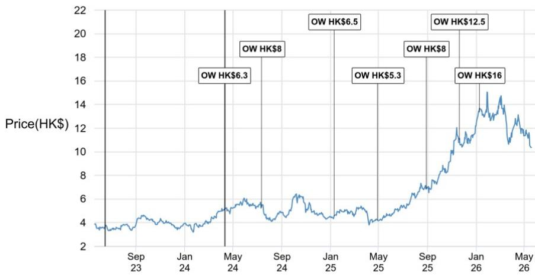

line

| Date       | Price(HK$) |
| ---------- | ---------- |
| May 24     | 6.3        |
| Sep 24     | 8          |
| Jan 25     | 6.5        |
| May 25     | 5.3        |
| Sep 25     | 8          |
| Jan 26     | 12.5       |
| May 26     | 16         |

<table><tr><td>Date</td><td>Rating</td><td>Price (HK$)</td><td>Price Target (HK$)</td></tr><tr><td>10-Apr-24</td><td>OW</td><td>5.10</td><td>6.3</td></tr><tr><td>12-Jul-24</td><td>OW</td><td>5.30</td><td>8</td></tr><tr><td>10-Jan-25</td><td>OW</td><td>4.55</td><td>6.5</td></tr><tr><td>29-Apr-25</td><td>OW</td><td>4.26</td><td>5.3</td></tr><tr><td>29-Aug-25</td><td>OW</td><td>6.84</td><td>8</td></tr><tr><td>20-Nov-25</td><td>OW</td><td>11.01</td><td>12.5</td></tr><tr><td>09-Jan-26</td><td>OW</td><td>13.37</td><td>16</td></tr></table>

Source: Bloomberg Finance L.P. and JPM; price data adjusted for stock splits and dividends. Initiated coverage Feb 21, 2002. All share prices are as of market close on the previous business day. Break in coverage Jun 15, 2023 - Apr 10, 2024.

China Hongqiao - H (1378.HK, 1378 HK) Price Chart   
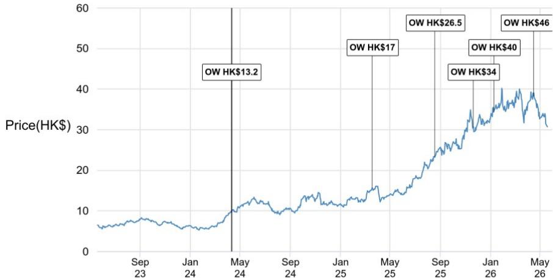

line

| Date       | Price(HK$) |
| ---------- | ---------- |
| May 24     | 13.2       |
| May 25     | 17         |
| Sep 25     | 26.5       |
| Jan 26     | 34         |
| May 26     | 46         |

<table><tr><td>Date</td><td>Rating</td><td>Price (HK$)</td><td>Price Target(HK$)</td></tr><tr><td>10-Apr-24</td><td>OW</td><td>9.65</td><td>13.2</td></tr><tr><td>19-Mar-25</td><td>OW</td><td>15.60</td><td>17</td></tr><tr><td>19-Aug-25</td><td>OW</td><td>23.24</td><td>26.5</td></tr><tr><td>20-Nov-25</td><td>OW</td><td>30.62</td><td>34</td></tr><tr><td>09-Jan-26</td><td>OW</td><td>34.34</td><td>40</td></tr><tr><td>16-Apr-26</td><td>OW</td><td>38.24</td><td>46</td></tr></table>

Source: Bloomberg Finance L.P. and JPM; price data adjusted for stock splits and dividends. Initiated coverage Aug 14, 2011. All share prices are as of market close on the previous business day. Break in coverage Sep 25, 2016 - Apr 10, 2024.

Zijin Mining - H (2899.HK, 2899 HK) Price Chart   
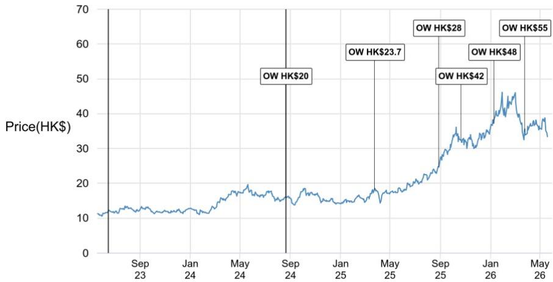

line

| Date       | Price(HK$) |
| ---------- | ---------- |
| Sep 24     | 20         |
| May 25     | 23.7       |
| Sep 25     | 28         |
| Jan 26     | 42         |
| May 26     | 55         |

<table><tr><td>Date</td><td>Rating</td><td>Price (HK$)</td><td>Price Target(HK$)</td></tr><tr><td>20-Aug-24</td><td>OW</td><td>16.06</td><td>20</td></tr><tr><td>25-Mar-25</td><td>OW</td><td>18.14</td><td>23.7</td></tr><tr><td>28-Aug-25</td><td>OW</td><td>24.74</td><td>28</td></tr><tr><td>21-Oct-25</td><td>OW</td><td>32.46</td><td>42</td></tr><tr><td>09-Jan-26</td><td>OW</td><td>37.20</td><td>48</td></tr><tr><td>25-Mar-26</td><td>OW</td><td>34.86</td><td>55</td></tr></table>

Source: Bloomberg Finance L.P. and JPM; price data adjusted for stock splits and dividends. Initiated coverage Feb 06, 2006. All share prices are as of market close on the previous business day. Break in coverage Jun 15, 2023 - Aug 20, 2024.

The chart(s) show JPM's continuing coverage of the stocks; the current analysts may or may not have covered it over the entire period. JPM ratings or designations: OW = Overweight, N = Neutral, UW = Underweight, NR = Not Rated

# Explanation of Equity Research Ratings, Designations and Analyst(s) Coverage Universe:

JPM uses the following rating system: Overweight (over the duration of the price target indicated in this report, we expect this stock will outperform the average total return of the stocks in the Research Analyst's, or the Research Analyst's team's, coverage universe); Neutral (over the duration of the price target indicated in this report, we expect this stock will perform in line with the average total return of the stocks in the Research Analyst's, or the Research Analyst's team's, coverage universe); and Underweight (over the duration of the price target indicated in this report, we expect this stock will underperform the average total return of the stocks in the Research Analyst's, or the Research Analyst's team's, coverage universe. NR is Not Rated. In this case, JPM has removed the rating and, if applicable, the price target, for this stock because of either a lack of a sufficient fundamental basis or for legal, regulatory or policy reasons. The previous rating and, if applicable, the price target, no longer should be relied upon. An NR designation is not a recommendation or a rating. Some stocks under coverage have a rating but no price target; in these cases, we expect the stock will outperform/perform in line/underperform the average total return of the stocks in the Research Analyst's, or the Research Analyst's team's, coverage universe of the relevant duration of the region. In our Asia (ex-Australia and ex-India) and U.K. small- and mid-cap Equity Research, each stock's expected total return is compared to the expected total return of a benchmark country market index, not to those Research Analysts' coverage universe. If it does not appear in the Important Disclosures section of this report, the certifying Research Analyst's coverage universe can be found on JPM's Research website, https://www.JPMmarkets.com.

Coverage Universe: Chan, Avery : Angang Steel - A (000898.SZ), Angang Steel - H (0347.HK), Baosteel – A (600019.SS), CMOC - A (603993.SS), CMOC - H (3993.HK), Chalco - A (601600.SS), Chalco - H (2600.HK), China Hongqiao - H (1378.HK), China Jushi - A (600176.SS), Ganfeng Lithium – A (002460.SZ), Ganfeng Lithium – H (1772.HK), Jiangxi Copper - A (600362.SS), Jiangxi Copper - H (0358.HK), Shandong Gold - A (600547.SS), Shandong Gold - H (1787.HK), Shenhua - A (601088.SS), Shenhua - H (1088.HK), Tianqi Lithium – A (002466.SZ), Tianqi Lithium – H (9696.HK), Yankuang - A (600188.SS), Yankuang - H (1171.HK), Zijin Gold International - H (2259.HK), Zijin Mining - A (601899.SS), Zijin Mining – H (2899.HK)

JPM Equity Research Ratings Distribution, as of April 04, 2026 

<table><tr><td></td><td>Overweight (buy)</td><td>Neutral (hold)</td><td>Underweight (sell)</td></tr><tr><td>JPM Global Equity Research Coverage*</td><td>51%</td><td>37%</td><td>12%</td></tr><tr><td>IB clients**</td><td>83%</td><td>79%</td><td>74%</td></tr><tr><td>JPMS Equity Research Coverage*</td><td>49%</td><td>39%</td><td>13%</td></tr><tr><td>IB clients**</td><td>94%</td><td>93%</td><td>85%</td></tr></table>

\*Please note that the percentages may not add to 100% because of rounding.   
\*\*Percentage of subject companies within each of the "buy," "hold" and "sell" categories for which JPM has provided investment banking services within the previous 12 months.   
For purposes of FINRA ratings distribution rules only, our Overweight rating falls into a buy rating category; our Neutral rating falls into a hold rating category; and our Underweight rating falls into a sell rating category. Please note that stocks with an NR designation are not included in the table above. This information is current as of the end of the most recent calendar quarter.

Equity Valuation and Risks: For valuation methodology and risks associated with covered companies or price targets for covered companies, please see the most recent company-specific research report at http://www.JPMmarkets.com, contact the primary analyst or your JPM representative, or email research.disclosure.inquiries@JPM.com. For material information about the proprietary models used, please see the Summary of Financials in company-specific research reports and the Company Tearsheets, which are available to download on the company pages of our client website, http://www.JPMmarkets.com. This report also sets out within it the material underlying assumptions used.

# History of Investment Recommendations:

A history of JPM investment recommendations disseminated during the preceding 12 months can be accessed on the Research & Commentary page of http://www.JPMmarkets.com where you can also search by analyst name, sector or financial instrument.

Analysts' Compensation: The research analysts responsible for the preparation of this report receive compensation based upon various factors, including the quality and accuracy of research, client feedback, competitive factors, and overall firm revenues.

Registration of non-US Analysts: Unless otherwise noted, the non-US analysts listed on the front of this report are employees of non-US affiliates of JPM Securities LLC, may not be registered as research analysts under FINRA rules, may not be associated persons of JPM Securities LLC, and may not be subject to FINRA Rule 2241 or 2242 restrictions on communications with covered companies, public appearances, and trading securities held by a research analyst account.

# Other Disclosures

JPM is a marketing name for investment banking businesses of JPM Chase & Co. and its subsidiaries and affiliates worldwide.

UK MIFID FICC research unbundling exemption: UK clients should refer to UK MIFID Research Unbundling exemption for details of JPM's implementation of the FICC research exemption and guidance on relevant FICC research categorisation.

All research material made available to clients are simultaneously available on our client website, JPM Markets, unless specifically permitted by relevant laws. Not all research content is redistributed, e-mailed or made available to third-party aggregators. For all research material available on a particular stock, please contact your sales representative.

Any long form nomenclature for references to China; Hong Kong; Taiwan; and Macau within this research material are Mainland China; Hong Kong SAR (China); Taiwan (China); and Macau SAR (China).

JPM may, from time to time, write on issuers or securities targeted by economic or financial sanctions imposed or administered by the governmental authorities of the U.S., EU, UK or other relevant jurisdictions (Sanctioned Securities). Nothing in this report is intended to be read or construed as encouraging, facilitating, promoting or otherwise approving investment or dealing in such Sanctioned Securities. Clients should be aware of their own legal and compliance obligations when making investment decisions.

Any digital or crypto assets discussed in this research report are subject to a rapidly changing regulatory landscape. For relevant regulatory advisories on crypto assets, including bitcoin and ether, please see https://www.JPM.com/disclosures/cryptoasset-disclosure.

The author(s) of this research report may not be licensed to carry on regulated activities in your jurisdiction and, if not licensed, do not hold themselves out as being able to do so.

Exchange-Traded Funds (ETFs): JPM Securities LLC (“JPMS”) acts as authorized participant for substantially all U.S.-listed ETFs. To the extent that any ETFs are mentioned in this report, JPMS may earn commissions and transaction-based compensation in connection with the distribution of those ETF shares and may earn fees for performing other trade-related services, such as securities lending to short sellers of the ETF shares. JPMS may also perform services for the ETFs themselves, including acting as a broker or dealer to the ETFs. In addition, affiliates of JPMS may perform services for the ETFs, including trust, custodial, administration, lending, index calculation and/or maintenance and other services.

Options and Futures related research: If the information contained herein regards options- or futures-related research, such information is available only to persons who have received the proper options or futures risk disclosure documents. Please contact your JPM Representative or visit https://www.theocc.com/components/docs/riskstoc.pdf for a copy of the Option Clearing Corporation's Characteristics and Risks of Standardized Options or https://www.finra.org/sites/default/files/2020-08/Security\_Futures\_Risk\_Disclosure\_Statement\_2020.pdf for a copy of the Security Futures Risk Disclosure Statement.

Changes to Interbank Offered Rates (IBORs) and other benchmark rates: Certain interest rate benchmarks are, or may in the future become, subject to ongoing international, national and other regulatory guidance, reform and proposals for reform. For more information, please consult: https://www.JPM.com/global/disclosures/interbank\_offered\_rates

Private Bank Clients: Where you are receiving research as a client of the private banking businesses offered by JPM Chase & Co. and its subsidiaries (“JPM Private Bank”), research is provided to you by JPM Private Bank and not by any other division of JPM, including, but not limited to, the JPM Corporate and Investment Bank and its Global Research division.

Legal entity responsible for the production and distribution of research: The legal entity identified below the name of the Reg AC Research Analyst who authored this material is the legal entity responsible for the production of this research. Where multiple Reg AC Research Analysts authored this material with different legal entities identified below their names, these legal entities are jointly responsible for the production of this research. Where more than one legal entity is listed under an analyst's name, the first legal entity is responsible for the production unless stated otherwise. Research Analysts from various JPM affiliates may have contributed to the production of this material but may not be licensed to carry out regulated activities in your jurisdiction (and do not hold themselves out as being able to do so). Unless otherwise stated below in the legal entity disclosures, this material has been distributed by the legal entity responsible for production, or where more than one legal entity is listed under the analyst's name, the first legal entity will be responsible for distribution. If you have any queries, please contact the relevant Research Analyst in your jurisdiction or the entity in your jurisdiction that has distributed this research material.

# Legal Entities Disclosures and Country-/Region-Specific Disclosures:

Argentina: JPM Chase Bank N.A Sucursal Buenos Aires is regulated by Banco Central de la República Argentina (“BCRA”- Central Bank of Argentina) and Comisión Nacional de Valores (“CNV”- Argentinian Securities Commission - ALYC y AN Integral N°51).

Australia: JPM Securities Australia Limited (“JPMSAL”) (ABN 61 003 245 234/AFS Licence No: 238066) is regulated by the Australian Securities and Investments Commission and is a Market Participant of ASX Limited, a Clearing and Settlement Participant of ASX Clear Pty Limited and a Clearing Participant of ASX Clear (Futures) Pty Limited. This material is issued and distributed in Australia by or on behalf of JPMSAL only to "wholesale clients" (as defined in section 761G of the Corporations Act 2001). A list of all financial products covered can be found by visiting https://www.jpmm.com/research/disclosures. JPM seeks to cover companies of relevance to the domestic and international investor base across all Global Industry Classification Standard (GICS) sectors, as well as across a range of market capitalisation sizes. If applicable, in the course of conducting public side due diligence on the subject company(ies), the Research Analyst team may at times perform such diligence through corporate engagements such as site visits, discussions with company representatives, management presentations, etc. Research issued by JPMSAL has been prepared in accordance with JPM Australia’s Research Independence Policy which can be found at the following link: JPM Australia - Research Independence Policy.

Brazil: Banco JPM S.A. is regulated by the Comissao de Valores Mobiliarios (CVM) and by the Central Bank of Brazil. Ombudsman JPM: 0800-7700847 / 0800-7700810 (For Hearing Impaired) / ouvidoria.jp.morgan@jpmchase.com.

Canada: JPM Securities Canada Inc. is a registered investment dealer, regulated by the Canadian Investment Regulatory Organization and the Ontario Securities Commission and is the participating member on Canadian exchanges. This material is distributed in Canada by or on behalf of JPM Securities Canada Inc.

Chile: Inversiones JPM Limitada is an unregulated entity incorporated in Chile.

China: JPM Securities (China) Company Limited has been approved by CSRC to conduct the securities investment consultancy business.

Colombia: Banco JPM Colombia S.A. is supervised by the Superintendencia Financiera de Colombia (SFC). Any reference in this material to products or services offered abroad by entities other than the Bank in Colombia is included exclusively for descriptive purposes. Such references do not constitute, and should not be construed as, promotional activity or the provision of financial products or services within Colombian territory, as defined under applicable Colombian regulation.

Dubai International Financial Centre (DIFC): JPM Chase Bank, N.A., Dubai Branch is regulated by the Dubai Financial Services Authority (DFSA) and its registered address is Dubai International Financial Centre - The Gate, West Wing, Level 3 and 9 PO Box 506551, Dubai, UAE. This material has been distributed by JPM Chase Bank, N.A., Dubai Branch to persons regarded as professional clients or market counterparties as defined under the DFSA rules.

European Economic Area (EEA): Unless specified to the contrary, research is distributed in the EEA by JPM SE (“JPM SE”), which is authorised as a credit institution by the Federal Financial Supervisory Authority (Bundesanstalt für Finanzdienstleistungsaufsicht, BaFin) and jointly supervised by the BaFin, the German Central Bank (Deutsche Bundesbank) and the European Central Bank (ECB). JPM SE is a company headquartered in Frankfurt with registered address at TaunusTurm, Taunustor 1, Frankfurt am Main, 60310, Germany. The material has been distributed in the EEA to persons regarded as professional investors (or equivalent) pursuant to Art. 4 para. 1 no. 10 and Annex II of MiFID II and its respective implementation in their home jurisdictions (“EEA professional investors”). This material must not be acted on or relied on by persons who are not EEA professional investors. Any investment or investment activity to which this material relates is only available to EEA relevant persons and will be engaged in only with EEA relevant persons.

Hong Kong: JPM Securities (Asia Pacific) Limited (CE number AAJ321) is regulated by the Hong Kong Monetary Authority and the Securities and Futures Commission in Hong Kong, and JPM Broking (Hong Kong) Limited (CE number AAB027) is regulated by the Securities and Futures Commission in Hong Kong. JPM Chase Bank, N.A., Hong Kong Branch (CE Number AAL996) is regulated by the Hong Kong Monetary Authority and the Securities and Futures Commission, is organized under the laws of the United States with limited liability. Where the distribution of this material is a regulated activity in Hong Kong, the material is distributed in Hong Kong by or through JPM Securities (Asia Pacific) Limited and/or JPM Broking (Hong Kong) Limited.

India: JPM India Private Limited (Corporate Identity Number - U67120MH1992FTC068724), having its registered office at JPM Tower, Off. C.S.T. Road, Kalina, Santacruz - East, Mumbai – 400098, is registered with the Securities and Exchange Board of India (SEBI) as a 'Research Analyst' having registration number INH000001873. JPM India Private Limited is also registered with SEBI as a member of the National Stock Exchange of India Limited and the Bombay Stock Exchange Limited (SEBI Registration Number – INZ000239730) and as a Merchant Banker (SEBI Registration Number - MB/INM000002970). Telephone: 91-22-6157 3000, Facsimile: 91-22-6157 3990 and Website: http://www.jpmipl.com. JPM Chase Bank, N.A. - Mumbai Branch is licensed by the Reserve Bank of India (RBI) (Licence No. 53/Licence No. BY.4/94; SEBI - IN/CUS/014/ CDSL : IN-DP-CDSL-444-2008/ IN-DP-NSDL-285-2008/ INBI00000984/ INE231311239) as a Scheduled Commercial Bank in India, which is its primary license allowing it to carry on Banking business in India and other activities, which a Bank branch in India are permitted to undertake. For non-local research material, this material is not distributed in India by JPM India Private Limited. Compliance Officer: Ashutosh Sharma; ashutosh.j.sharma@jpmchase.com; +912261575002. Grievance Officer: Ramprasadh K, jpmipl.research.feedback@JPM.com; +912261573000. Registration granted by SEBI and certification from NISM in no way guarantee performance of the intermediary or provide any assurance of returns to investors. Please visit Terms and Conditions and Most Important Terms and Conditions (MITC). The annual Compliance audit report is available at http://www.jpmipl.com/#research.

Indonesia: PT JPM Sekuritas Indonesia is a member of the Indonesia Stock Exchange and is registered and supervised by the Otoritas Jasa Keuangan (OJK).

Korea: JPM Securities (Far East) Limited, Seoul Branch, is a member of the Korea Exchange (KRX). JPM Chase Bank, N.A., Seoul Branch, is licensed as a branch office of foreign bank (JPM Chase Bank, N.A.) in Korea. Both entities are regulated by the Financial Services Commission (FSC) and the Financial Supervisory Service (FSS). For non-macro research material, the material is distributed in Korea by or through JPM Securities (Far East) Limited, Seoul Branch.

Japan: JPM Securities Japan Co., Ltd. and JPM Chase Bank, N.A., Tokyo Branch are regulated by the Financial Services Agency in Japan.

Malaysia: This material is issued and distributed in Malaysia by JPM Securities (Malaysia) Sdn Bhd (18146-X), which is a Participating Organization of Bursa Malaysia Berhad and holds a Capital Markets Services License issued by the Securities Commission in Malaysia.

Mexico: JPM Casa de Bolsa, S.A. de C.V., JPM Grupo Financiero is member of the Mexican Stock Exchange (“Bolsa Mexicana

de Valores") and the Institutional Stock Exchange ("Bolsa Institucional de Valores"), and it is authorized to act as a broker dealer by the National Banking and Securities Exchange Commission ("Comisión Nacional Bancaria y de Valores").

New Zealand: This material is issued and distributed by JPMSAL in New Zealand only to "wholesale clients" (as defined in the Financial Markets Conduct Act 2013). JPMSAL is registered as a Financial Service Provider under the Financial Service providers (Registration and Dispute Resolution) Act of 2008.

Philippines: JPM Securities Philippines Inc. is a Trading Participant of the Philippine Stock Exchange and a member of the Securities Clearing Corporation of the Philippines and the Securities Investor Protection Fund. It is regulated by the Securities and Exchange Commission.

Singapore: This material is issued and distributed in Singapore by or through JPM Securities Singapore Private Limited (JPMSS) [MDDI (P) 057/08/2025 and Co. Reg. No.: 199405335R], which is a member of the Singapore Exchange Securities Trading Limited, and/or JPM Chase Bank, N.A., Singapore branch (JPMCB Singapore), both of which are regulated by the Monetary Authority of Singapore. This material is issued and distributed in Singapore only to accredited investors, expert investors and institutional investors, as defined in Section 4A of the Securities and Futures Act, Cap. 289 (SFA). This material is not intended to be issued or distributed to any retail investors or any other investors that do not fall into the classes of “accredited investors,” “expert investors” or “institutional investors,” as defined under Section 4A of the SFA. Recipients of this material in Singapore are to contact JPMSS or JPMCB Singapore in respect of any matters arising from, or in connection with, the material.

South Africa: JPM Equities South Africa Proprietary Limited and JPM Chase Bank, N.A., Johannesburg Branch are members of the Johannesburg Securities Exchange and are regulated by the Financial Services Conduct Authority (FSCA).

Taiwan: JPM Securities (Taiwan) Limited is a participant of the Taiwan Stock Exchange (company-type) and regulated by the Taiwan Securities and Futures Bureau. Material relating to equity securities is issued and distributed in Taiwan by JPM Securities (Taiwan) Limited, subject to the license scope and the applicable laws and the regulations in Taiwan. To the extent that JPM Securities (Taiwan) Limited produces research materials on securities not listed on the Taiwan Stock Exchange or Taipei Exchange (“Non-Taiwan Listed Securities”), these materials shall not constitute securities recommendations for the purpose of applicable Taiwan regulations, and, for the avoidance of doubt, JPM Securities (Taiwan) Limited does not act as broker for Non-Taiwan Listed Securities. According to Paragraph 2, Article 7-1 of Operational Regulations Governing Securities Firms Recommending Trades in Securities to Customers (as amended or supplemented) and/or other applicable laws or regulations, please note that the recipient of this material is not permitted to engage in any activities in connection with the material that may give rise to conflicts of interests, unless otherwise disclosed in the “Important Disclosures” in this material.

Thailand: This material is issued and distributed in Thailand by JPM Securities (Thailand) Ltd., which is a member of the Stock Exchange of Thailand and is regulated by the Ministry of Finance and the Securities and Exchange Commission. The registered address is 548 One City Center Building, 50th Floor, Ploenchit Road, Lymphini, Pathum Wan, Bangkok 10330.

UK: Research is produced in the UK by JPM Securities plc (“JPMS plc”) which is a member of the London Stock Exchange and is authorised by the Prudential Regulation Authority and regulated by the Financial Conduct Authority and the Prudential Regulation Authority or JPM Markets Limited (“JPMML Ltd”) which is authorised and regulated by the Financial Conduct Authority. Unless specified to the contrary, this material is distributed in the UK by JPMS plc and is directed in the UK only to: (a) persons having professional experience in matters relating to investments falling within article 19(5) of the Financial Services and Markets Act 2000 (Financial Promotion) (Order) 2005 (“the FPO”); (b) persons outlined in article 49 of the FPO (high net worth companies, unincorporated associations or partnerships, the trustees of high value trusts, etc.); or (c) any persons to whom this communication may otherwise lawfully be made; all such persons being referred to as "UK relevant persons". This material must not be acted on or relied on by persons who are not UK relevant persons. Any investment or investment activity to which this material relates is only available to UK relevant persons and will be engaged in only with UK relevant persons. A description of JPM EMEA’s policy for prevention and avoidance of conflicts of interest related to the production of Research can be found at the following link: JPM EMEA - Research Independence Policy.

U.S.: JPM Securities LLC (“JPMS”) is a member of the NYSE, FINRA, SIPC, and the NFA. JPM Chase Bank, N.A. is a member of the FDIC. Material published by non-U.S. affiliates is distributed in the U.S. by JPMS who accepts responsibility for its content.

General: Additional information is available upon request. The information in this material has been obtained from sources believed to be reliable. While all reasonable care has been taken to ensure that the facts stated in this material are accurate and that the forecasts, opinions and expectations contained herein are fair and reasonable, JPM Chase & Co. or its affiliates and/or subsidiaries (collectively JPM) make no representations or warranties whatsoever to the completeness or accuracy of the material provided, except with respect to any disclosures relative to JPM and the Research Analyst's involvement with the issuer that is the subject of the material. Accordingly, no reliance should be placed on the accuracy, fairness or completeness of the information contained in this material. There may be certain discrepancies with data and/or limited content in this material as a result of calculations, adjustments, translations to different languages, and/or local regulatory restrictions, as applicable. These discrepancies should not impact the overall investment analysis, views and/or recommendations of the subject company(ies) that may be discussed in the material. Artificial intelligence tools may have been used in the preparation of this material, including assisting in data analysis, pattern recognition, and content drafting for research material. JPM accepts no liability whatsoever for any loss arising from any use of this material or its contents, and neither JPM nor any of its respective directors, officers or employees, shall be in any way responsible for the contents hereof, apart from the liabilities and responsibilities that may be imposed on them by the relevant regulatory authority in the jurisdiction in question, or the regulatory regime thereunder. Opinions, forecasts or projections contained in this material represent JPM's current opinions or judgment as of the date of the material only and are therefore subject to change without

notice. Periodic updates may be provided on companies/industries based on company-specific developments or announcements, market conditions or any other publicly available information. There can be no assurance that future results or events will be consistent with any such opinions, forecasts or projections, which represent only one possible outcome. Furthermore, such opinions, forecasts or projections are subject to certain risks, uncertainties and assumptions that have not been verified, and future actual results or events could differ materially. The value of, or income from, any investments referred to in this material may fluctuate and/or be affected by changes in exchange rates. All pricing is indicative as of the close of market for the securities discussed, unless otherwise stated. Past performance is not indicative of future results. Accordingly, investors may receive back less than originally invested. This material is not intended as an offer or solicitation for the purchase or sale of any financial instrument. The opinions and recommendations herein do not take into account individual client circumstances, objectives, or needs and are not intended as recommendations of particular securities, financial instruments or strategies to particular clients. This material may include views on structured securities, options, futures and other derivatives. These are complex instruments, may involve a high degree of risk and may be appropriate investments only for sophisticated investors who are capable of understanding and assuming the risks involved. The recipients of this material must make their own independent decisions regarding any securities or financial instruments mentioned herein and should seek advice from such independent financial, legal, tax or other adviser as they deem necessary. JPM may trade as a principal on the basis of the Research Analysts' views and research, and it may also engage in transactions for its own account or for its clients' accounts in a manner inconsistent with the views taken in this material, and JPM is under no obligation to ensure that such other communication is brought to the attention of any recipient of this material. Others within JPM, including Strategists, Sales staff and other Research Analysts, may take views that are inconsistent with those taken in this material. Employees of JPM not involved in the preparation of this material may have investments in the securities (or derivatives of such securities) mentioned in this material and may trade them in ways different from those discussed in this material. This material is not an advertisement for or marketing of any issuer, its products or services, or its securities in any jurisdiction.

Confidentiality and Security Notice: This transmission may contain information that is privileged, confidential, legally privileged, and/or exempt from disclosure under applicable law. If you are not the intended recipient, you are hereby notified that any disclosure, copying, distribution, or use of the information contained herein (including any reliance thereon) is STRICTLY PROHIBITED. Although this transmission and any attachments are believed to be free of any virus or other defect that might affect any computer system into which it is received and opened, it is the responsibility of the recipient to ensure that it is virus free and no responsibility is accepted by JPM Chase & Co., its subsidiaries and affiliates, as applicable, for any loss or damage arising in any way from its use. If you received this transmission in error, please immediately contact the sender and destroy the material in its entirety, whether in electronic or hard copy format. This message is subject to electronic monitoring: https://www.JPM.com/disclosures/email

MSCI: Certain information herein (“Information”) is reproduced by permission of MSCI Inc., its affiliates and information providers (“MSCI”) ©2026. No reproduction or dissemination of the Information is permitted without an appropriate license. MSCI MAKES NO EXPRESS OR IMPLIED WARRANTIES (INCLUDING MERCHANTABILITY OR FITNESS) AS TO THE INFORMATION AND DISCLAIMS ALL LIABILITY TO THE EXTENT PERMITTED BY LAW. No Information constitutes investment advice, except for any applicable Information from MSCI ESG Research. Subject also to msci.com/disclaimer

Sustainalytics: Certain information, data, analyses and opinions contained herein are reproduced by permission of Sustainalytics and: (1) includes the proprietary information of Sustainalytics; (2) may not be copied or redistributed except as specifically authorized; (3) do not constitute investment advice nor an endorsement of any product or project; (4) are provided solely for informational purposes; and (5) are not warranted to be complete, accurate or timely. Sustainalytics is not responsible for any trading decisions, damages or other losses related to it or its use. The use of the data is subject to conditions available at https://www.sustainalytics.com/legal-disclaimers. ©2026 Sustainalytics. All Rights Reserved.

"Other Disclosures" last revised May 16, 2026.

Copyright 2026 JPM Chase & Co. All rights reserved. This material or any portion hereof may not be reprinted, sold or redistributed without the written consent of JPM. It is strictly prohibited to use or share without prior written consent from JPM any research material received from JPM or an authorized third-party (“JPM Data”) in any third-party artificial intelligence (“AI”) systems or models when such JPM Data is accessible by a third-party.

Completed 19 May 2026 11:54 PM HKT

Disseminated 19 May 2026 11:54 PM HKT