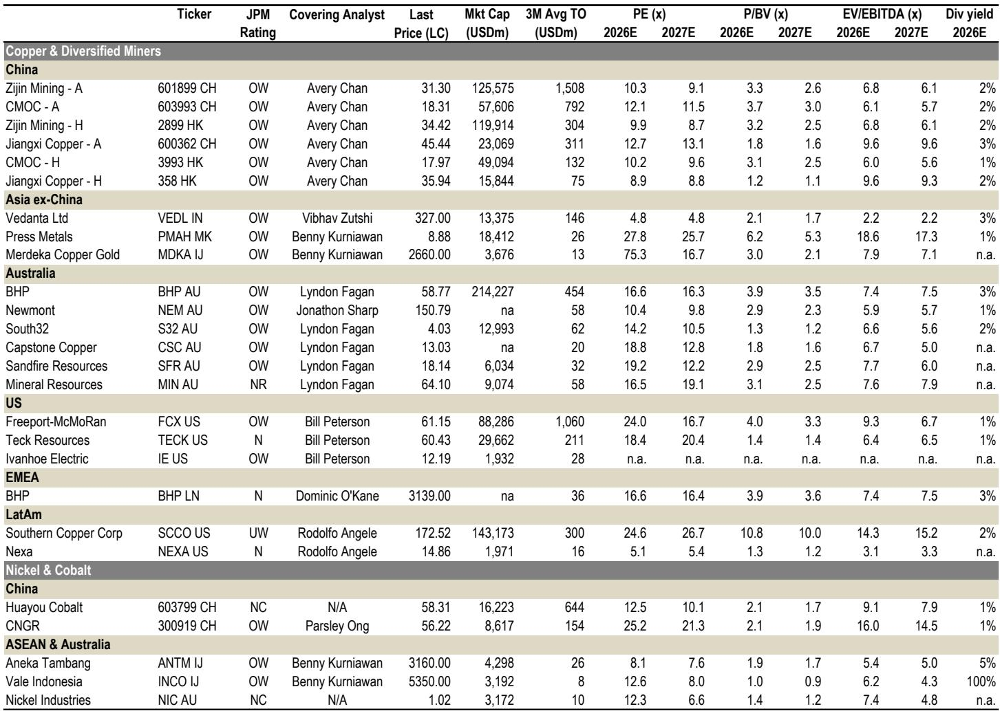
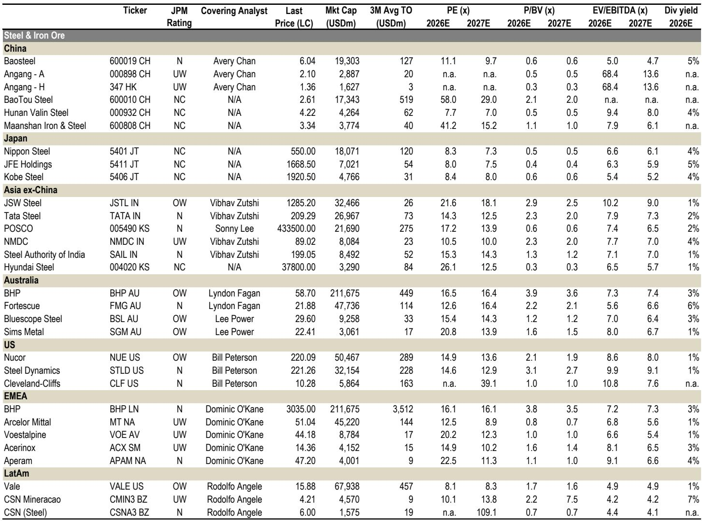
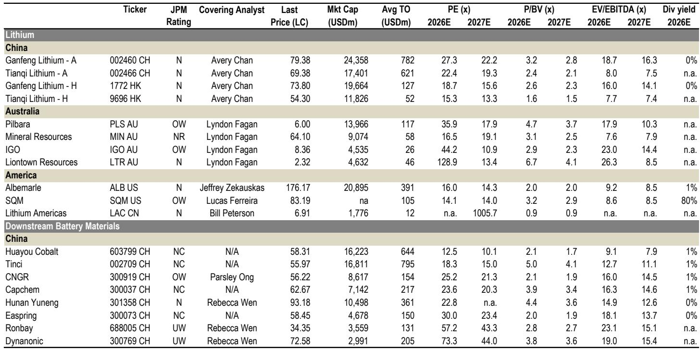

# China's Materials Sector Is Splitting Into Two Distinct Regimes: Supply-Driven Metals Will Outperform Demand-Dependent Ones

China's April activity data delivered a clear message that the market has been reluctant to fully price in: domestic demand is weakening faster than expected, and the old playbook of waiting for a policy-driven recovery no longer works. Industrial production recorded its steepest month-on-month contraction in three years. Fixed asset investment collapsed by 12% year-on-year in April. Real estate new starts plunged 27% year-on-year, deepening from an already weak March. This is not a soft patch. This is a structural demand reset.

Yet within this deteriorating macro picture, certain commodity prices have held firm or even rallied. SHFE aluminum has hovered around RMB 24,000 to 25,000 per ton. Lithium spot briefly touched RMB 200,000 per ton before settling back. Even steel margins have shown tentative improvement, with the share of profitable mills rising from 48% in early April to 64% by mid-May. How can prices and margins improve when demand is collapsing? The answer reveals a fundamental shift in how investors should think about China's materials sector.

The conventional framework for commodity investing in China has been demand-centric: track property starts, infrastructure spending, and manufacturing output, then position accordingly. That framework is now insufficient. What the April data confirms is that China's materials complex is bifurcating into two distinct regimes. For metals where global supply constraints are binding — aluminum and lithium being the clearest examples — prices are being driven by supply-side dynamics that overwhelm weak domestic demand. For commodities where supply remains responsive — steel and coal — prices remain hostage to the domestic demand recovery that has not materialized.

Investors who treat all Chinese commodities as a single macro trade are making a category error. The dispersion in performance across metals is not noise. It is the signal. The question is not whether China's economy is recovering. The question is which commodities have supply stories powerful enough to decouple from China's demand weakness.

## Domestic Demand Is Deteriorating Faster Than the Consensus Assumes, and the Property Cliff Has Not Yet Bottomed

The April data from the National Bureau of Statistics is worse than a simple miss versus expectations. It represents a sequential deterioration that challenges the prevailing narrative of a gradual stabilization. Real estate investment declined 20% year-on-year in April, accelerating from a 12% decline in February. New starts fell 27% year-on-year, compared to a 17% decline in March and a 22% decline in April of last year. The trend is not flattening. It is steepening.

The property analyst community has been revising down forecasts repeatedly, yet the data continues to undershoot. The current projection from a leading property analyst expects new starts to decline 18% year-on-year and completions to fall 19% year-on-year for the full year. That implies a 16% and 17% decline for the remainder of the year, respectively. But these forecasts may still prove optimistic. The soft land sales volume in the first quarter of 2026 means developers have limited ability to initiate new projects even if they wanted to. The pipeline is empty.

Fixed asset investment tells a similarly sobering story. Total FAI declined 12% year-on-year in April, a catastrophic swing from the 1.7% growth recorded in the first quarter. Manufacturing FAI, which had been a rare bright spot, turned negative at minus 4% year-on-year. Infrastructure FAI fell 3% year-on-year and 24% month-on-month. The sequential collapse in infrastructure spending is particularly concerning because it suggests that local government financing constraints have not eased despite policy rhetoric about fiscal support.

The implication for materials demand is straightforward. Steel, cement, and construction-related commodities are facing a demand environment that is not just weak but actively deteriorating. The marginal buyer is disappearing. Any price recovery in these commodities must come from supply discipline, not demand growth. And supply discipline in China's steel sector has historically been difficult to sustain.

## Aluminum and Lithium Are Decoupling from China's Demand Cycle Because Global Supply Constraints Overwhelm Local Weakness

The most important insight from the April data is that aluminum prices have remained resilient despite the collapse in Chinese construction activity. SHFE aluminum has traded in a range of roughly RMB 24,000 to 25,000 per ton, supported by what a global investment bank report describes as a "structural global supply deficit amid Middle East disruptions and persistent tightness through 2026." This is a fundamentally different pricing regime than what steel or cement experience.

Aluminum's supply story is global and structural. Middle East disruptions have removed a meaningful chunk of global supply. Chinese smelting capacity remains capped by policy-driven production limits. The global inventory picture is tightening. And critically, aluminum demand is not as dependent on Chinese construction as many assume. The metal's use in electric vehicles, solar frames, power grids, and lightweight manufacturing means that even as Chinese property demand falls, other demand vectors are growing.

Lithium presents a similar but more nuanced case. Spot prices briefly touched RMB 200,000 per ton before pulling back to around RMB 190,000. The support comes from resilient energy storage system demand and a recovery in EV adoption, itself partly driven by elevated oil prices making the total cost of ownership argument for EVs more compelling. But the report notes "early signs of a mine supply response." This is the critical variable. Lithium's supply curve is still responding to the high prices of the past cycle. New mine capacity is coming online. If supply growth outpaces demand growth, the price support weakens.

The strategic question for investors is whether lithium's supply response will be fast enough to close the deficit, or whether structural demand from energy storage and electrification will keep the market tight. The report's language suggests that the supply response is nascent but real. This makes lithium a more nuanced trade than aluminum, where supply constraints appear more binding and longer-lasting.

For both metals, the key point is that their price drivers are increasingly global and supply-centric, not local and demand-centric. Investors who continue to use Chinese property data as their primary signal for these commodities will systematically underperform.

## Steel Margins Have Improved, but the Recovery Is Cost-Driven and Fragile, Not Demand-Driven and Sustainable

The steel sector has seen a notable improvement in profitability. The share of profitable blast furnace mills rose from 48% in early April to 64% by mid-May. Steel prices have rallied since the second half of April. On the surface, this looks like a recovery. But the underlying mechanics reveal a different story.

The price rally is cost-driven, not demand-driven. Input costs have risen, pushing up steel prices through the cost curve rather than through increased demand pulling prices higher. This is a fundamentally fragile recovery. If demand does not follow, the cost-driven price increase compresses margins as input costs eventually normalize. The report explicitly states that "with still-sluggish domestic demand and elevated input costs continuing to weigh, we expect no material margin recovery until meaningful policy follow-through materializes."

Steel production data reinforces the caution. April crude steel output fell 3% year-on-year to 84 million tons. Early May data from CISA key members shows daily output at 2.11 million tons, down 4.3% year-on-year. Production is being cut, but not fast enough to offset the demand decline. The operating ratio for blast furnaces has declined, but remains above levels that would indicate deep, coordinated cuts.

Steel exports provide a partial offset but are not a solution. April finished steel exports totaled 9.5 million tons, down 9% year-on-year, an improvement from the first quarter average of minus 10%. The report expects a near-term recovery in exports driven by resurgent Middle East demand following de-escalation of regional tensions. However, the tailwind from European front-loading, which supported first quarter volumes, is fading under quota constraints. Export volumes are unlikely to be large enough to meaningfully absorb domestic oversupply.

The steel market is trapped between insufficient demand and insufficient supply cuts. Until either demand recovers through fiscal stimulus or supply is cut more aggressively through policy intervention, margins will remain compressed and volatile. The improvement from April lows is real, but it is a bounce within a downtrend, not a trend change.

## The Report Leaves an Unresolved Question About the Timing and Mechanism of Policy Intervention

The report's analysis is comprehensive, but it deliberately leaves one critical question open: what would it take for policy to meaningfully change the demand trajectory, and what form would that intervention take? The report references "meaningful policy follow-through" as a condition for material margin recovery in steel, but it does not specify what that follow-through would look like or how likely it is.

This is not an oversight. It is an honest reflection of the uncertainty. Chinese policymakers have signaled support for the economy, but the transmission mechanism from policy intent to actual commodity demand has been broken for several cycles. Property sector support measures have not translated into new starts. Infrastructure spending has been constrained by local government balance sheets. Manufacturing investment is slowing as export demand weakens.

The unresolved question is whether the next wave of stimulus will be different. Will it target consumption rather than investment? Will it involve direct fiscal transfers to local governments? Will it relax the production caps that constrain supply for certain metals? The answers to these questions will determine whether the current bifurcation between supply-driven and demand-driven commodities persists or converges.

For aluminum and lithium, the question is whether Chinese demand weakness will eventually become severe enough to overwhelm global supply constraints. For steel and coal, the question is whether policy can generate enough demand to absorb existing supply. The report provides the framework for analyzing these questions but does not — and cannot — provide the answers. That is the judgment that each investor must make based on their own assessment of policy dynamics.

## A Decision Framework for Positioning Across the Materials Complex

Given the bifurcation the report identifies, investors need a decision framework that distinguishes between commodities based on their primary price driver. The following framework organizes the analysis into actionable categories.

First, identify whether the commodity's price is primarily driven by global supply dynamics or domestic demand dynamics. Aluminum is clearly in the global supply camp. Lithium is partially in that camp but with a more responsive supply side. Steel and coal are primarily driven by domestic demand, with supply discipline as a secondary factor.

Second, assess the binding nature of supply constraints. Aluminum's constraints are structural and multi-year, involving Middle East disruptions, Chinese capacity caps, and global inventory depletion. Lithium's constraints are being tested by new mine supply. Steel's constraints are policy-dependent and historically difficult to maintain.

Third, evaluate the demand sensitivity to Chinese domestic activity. Steel and cement have extremely high sensitivity. Aluminum has moderate sensitivity due to diverse end-use applications. Lithium has moderate sensitivity with a growing energy storage buffer.

Fourth, determine the timeframe for policy intervention. If policy intervention is expected within the next three to six months, demand-sensitive commodities could see a tactical recovery. If policy intervention is delayed or ineffective, supply-driven commodities will continue to outperform.

Applying this framework to the report's stock recommendations provides context. Zijin Mining is the top pick, reflecting exposure to gold and copper, both of which have strong global supply narratives. Chalco and China Hongqiao are preferred in aluminum, where the supply story is most compelling. The report does not recommend steel or coal names, which is consistent with the framework's conclusion that those commodities remain hostage to an uncertain demand recovery.

## Join the Community to Read the Full Report and Review the Original Charts

The analysis above draws on a detailed global investment bank report that includes proprietary data on production trends, inventory dynamics, and profitability metrics across China's materials sector. The original report contains charts that visually illustrate the divergence between supply-driven and demand-driven commodities, the trajectory of property and infrastructure investment, and the evolution of steel mill profitability. These charts provide the empirical foundation for the strategic framework outlined here.

The full report also includes specific company-level analysis and valuation assessments that go beyond the scope of this article. For investors who want to understand which companies are best positioned in each commodity regime, and how to adjust their portfolios as the macro environment evolves, the original document is essential reading.

Join the community to read the full report and review the original charts.

*This article is for learning and discussion only and does not constitute investment advice.*

Personal reading notes and learning share only. Not investment advice.

