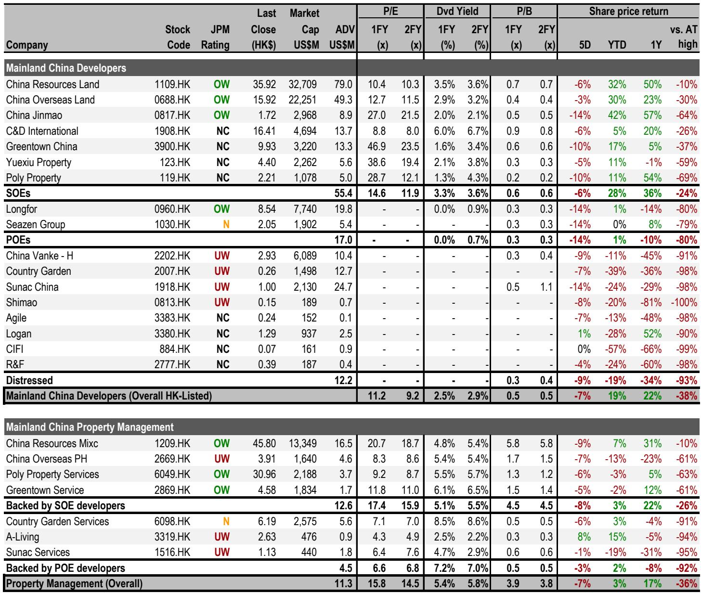
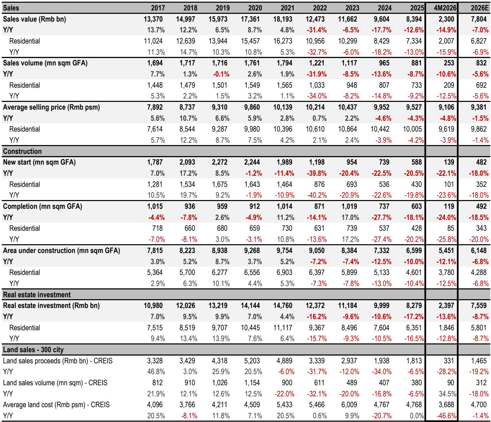
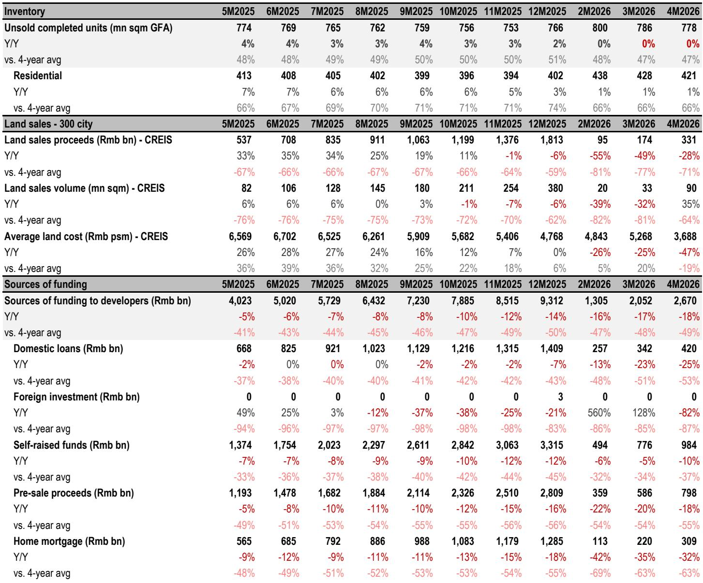

# China’s Property Market Is Not Recovering Broadly, But It Is Stabilizing Selectively—And That Is the Only Signal That Matters

For the second consecutive month, every single tier-1 city in China recorded positive month-over-month growth in secondary home prices. Shanghai posted a 0.7% gain. Beijing rose 0.4%. Even Guangzhou and Shenzhen, long the laggards, eked out 0.2% and 0.3% respectively. This is not a headline meant to hype a turnaround. It is a data point that demands a sober reassessment of what stabilization actually means in a market that has been in a structural downturn since 2021.

The most recent National Bureau of Statistics data for April reveals a pattern that is easy to misinterpret. On the surface, the numbers look encouraging: tier-1 secondary prices held at +0.4% month-over-month, matching March. The month-over-month decline in 70-city primary prices narrowed from -0.21% to -0.19%. Year-over-year declines in residential sales value tightened from -15% to -7%. But a careful reading shows that these improvements are concentrated, fragile, and partly a function of base effects. The market is not healing everywhere. It is bifurcating.

The critical question for investors is not whether the Chinese property market has bottomed. It is whether the bottom, when it comes, will be a floor for a few cities or a foundation for the entire sector. The April data suggests the former. And that distinction has profound implications for portfolio strategy, risk management, and the types of developers that will survive the next phase of this cycle.

This article is not a summary of the latest NBS release. It is an analytical framework for understanding what the data actually tells us, where the uncertainties remain, and how to position for a market that is no longer in freefall but is far from a synchronized recovery.

## The Stabilization in Tier-1 Secondary Prices Is Real, But It Is Not a Leading Indicator for the Broader Market

The most important single data point in the April release is not the absolute price level. It is the fact that all four tier-1 cities have now posted two consecutive months of positive month-over-month growth in secondary prices. This is the first time since mid-2023 that such consistency has been observed. The NBS index for tier-1 secondary prices rose 0.4% in both March and April. The Centaline index, which tracks asking prices rather than transaction prices, shows a 0.6% gain in April, decelerating from 0.9% in March but still firmly positive.

This matters because secondary prices are the true measure of market sentiment. Primary prices are influenced by developer pricing power, government guidance, and the mix of projects sold. Secondary prices reflect what individual homeowners are willing to accept and what buyers are willing to pay. When secondary prices stabilize in the country's most liquid and transparent markets, it signals that the psychological floor may be forming.

But here is the analytical trap. The improvement in tier-1 cities does not extrapolate to tier-2 or tier-3 markets. The 70-city secondary price index still fell 0.23% month-over-month in April. The improvement from March's -0.24% is marginal. Outside the top four cities, the data remains weak. Top-tier tier-2 cities like Hangzhou and Nanjing did show positive primary price growth, but these are exceptions, not the rule.

The implication is clear: stabilization is a tier-1 phenomenon driven by specific structural factors. These cities have the deepest labor markets, the strongest net population inflows, the most constrained land supply, and the most effective policy support. Investors who treat the tier-1 data as a proxy for the national market are making a category error. The rest of the country is still searching for a bottom.

## The Narrowing of Year-Over-Year Declines in Sales Value Is Largely a Base Effect, Not a Demand Recovery

Residential sales value fell 7% year-over-year in April, a notable improvement from March's 15% decline. On its face, this looks like a demand recovery. But when measured against the 2018-2021 average, the decline actually widened from -40% in March to -53% in April. The improvement in year-over-year comparisons is almost entirely due to the fact that April 2025 was itself a very weak month.

This is a classic base effect trap. As we move through 2026, the year-over-year comparisons will become easier because the denominator is shrinking. The research report forecasts a 7% year-over-year decline for full-year 2026 and expects the monthly comparisons to stay in the low-to-mid single-digit negative range for the next few months. That is not a recovery. It is arithmetic.

The real story in the sales data is the absolute level of activity. Compared to the pre-downturn average, sales are running at roughly half the volume. That is not a market that is healing. It is a market that has found a lower equilibrium. The question is whether that equilibrium is stable or whether it will erode further.

For investors, this means that top-line sales growth is the wrong metric to watch. The more important indicators are price stability in key cities, inventory turnover, and the financial health of developers. A market can function at lower volumes if prices are stable and supply is disciplined. That is the scenario the data is pointing toward for tier-1 cities. It is not yet the scenario for the rest of the country.

## Weak New Starts Are a Contradictory Signal: Painful for Developers Now, But Potentially Stabilizing for Prices Later

New starts fell 27% year-over-year in April, widening from March's 17% decline. The full-year forecast has been revised down to -18% year-over-year, implying a 16% decline for the rest of 2026. This is a direct consequence of weak land sales in the second half of 2025 and the first quarter of 2026. Developers are not buying land because they cannot sell existing inventory fast enough to generate the cash flow required for new investment.

This is bad news for construction activity, local government land revenue, and the broader economic multiplier effect. But it is not uniformly negative for the property market itself. Lower new starts mean lower future supply. In a market struggling with excess inventory, a reduction in new supply is actually a necessary condition for price stabilization.

The report highlights that secondary listings in tier-1 cities dropped 3% in April, following a 4% increase in March that was partly seasonal. This combination of lower new supply and reduced secondary listings creates a tighter supply-demand balance in the most desirable markets. Shanghai, in particular, has seen a notable drop in secondary inventory months, which is a leading indicator of price support.

The strategic implication is that investors need to distinguish between developers based on their inventory exposure. Developers with concentrated positions in tier-1 cities benefit from the supply discipline because their existing inventory becomes relatively more scarce. Developers with large positions in tier-2 and tier-3 cities face the opposite dynamic: weak demand and no supply relief because the inventory overhang is already severe.

This is not a market where a rising tide lifts all boats. It is a market where the tide is rising only in specific harbors, and the boats outside those harbors are still taking on water.

## The Market Has Not Yet Answered Whether Tier-2 Cities Can Follow Tier-1 Cities Into Stabilization

The report provides encouraging data points for a handful of top-tier tier-2 cities. Hangzhou and Nanjing both posted 0.4% month-over-month primary price growth in April. The broader tier-2 primary price index turned marginally positive at +0.07% month-over-month, the first positive reading since May 2025. This is worth watching, but it is not yet a trend.

The open question is whether the tier-1 stabilization will eventually spread to tier-2 cities through confidence effects, migration patterns, and policy diffusion. The report does not provide a clear answer, and for good reason: the data is not yet conclusive. The tier-2 positive reading is driven by a small number of cities with strong economic fundamentals. The average masks significant dispersion.

What would need to happen for tier-2 cities to stabilize? First, employment conditions would need to improve, because housing demand in tier-2 cities is more sensitive to local labor market conditions than in tier-1 cities, where demand is supported by wealth effects and migration. Second, secondary inventory would need to decline meaningfully, which requires both a reduction in new listings and an increase in transaction volume. Third, developer financial distress would need to ease, because distressed sales at discounted prices depress the entire price curve.

None of these conditions are yet in place for most tier-2 cities. The report's forecast for a soft form of stabilization in tier-1 secondary prices in 2026 is reasonable. Extending that forecast to tier-2 cities requires assumptions that the data does not yet support.

For investors, this means that the opportunity set remains narrow. The report explicitly favors state-owned enterprise developers with a strong focus on tier-1 cities. That is a defensible position. The risk is that the tier-1 stabilization proves temporary if broader economic conditions deteriorate or if policy support is withdrawn. But the data as it stands supports a selective, quality-biased approach.

## A Decision Framework for Investors: Three Questions to Determine Your Exposure to Chinese Property

The April data does not provide a single directional signal. It provides a set of signals that point in different directions depending on geography, developer type, and time horizon. To make sense of this complexity, investors should ask three questions.

First, what is your geographic exposure? If your portfolio is concentrated in tier-1 cities, the data supports a cautious but constructive view. Prices are stabilizing, inventory is declining, and the policy environment is supportive. If your exposure is in tier-2 or tier-3 cities, the data argues for continued caution. The recovery there is not yet visible, and the risks of further price declines are higher.

Second, what is your developer exposure? State-owned enterprise developers with strong balance sheets and tier-1 focus are the safest way to play this market. They have access to funding, they are not forced sellers, and they benefit from any policy support that flows to the sector. Private developers, particularly those with high leverage and weak land positions, remain at risk. The report's positive view on specific SOE developers is consistent with this framework.

Third, what is your time horizon? Over the next three to six months, the base effects will make year-over-year comparisons look better, but the absolute level of activity will remain low. Over a 12- to 24-month horizon, the key variable is whether the tier-1 stabilization broadens to tier-2 cities. If it does, the opportunity set expands. If it does not, the market remains a two-tier system where only the top cities offer relative safety.

This framework is not a recommendation to buy or sell. It is a lens for interpreting the data in a way that is consistent with your own risk tolerance and investment objectives. The market is not giving a clear signal. It is giving a conditional signal that requires active judgment.

## The Unresolved Questions That Make the Full Report Worth Reading

The analysis above covers the main themes from the April data, but several important questions remain unanswered. How durable is the tier-1 price stabilization? The report mentions that secondary listings dropped in April, but it is unclear whether this is a structural trend or a seasonal fluctuation. What happens when the seasonal factors reverse?

How much of the improvement in year-over-year sales comparisons is policy-driven versus base-effect-driven? The report acknowledges the base effect but does not quantify the policy contribution. Without that decomposition, it is difficult to assess whether the trend is sustainable.

What is the trajectory for developer margins? The report focuses on prices and volumes, but the margin picture is equally important. If prices are stabilizing but volumes remain low, developers with high fixed costs may still face margin compression. The report does not provide a margin forecast.

And perhaps most importantly, what is the policy trigger that would tip the market from stabilization into recovery? The report does not speculate on this, but it is the question that every serious investor should be asking. Is it further interest rate cuts? Is it relaxation of purchase restrictions? Is it direct government purchases of unsold inventory? The answer determines the timing and magnitude of any potential upside.

These are not gaps in the report. They are the natural boundaries of what any single data release can tell us. The full report contains additional charts and data that shed light on these questions, particularly around inventory trends, land sales, and the trajectory of new starts.

Join the community to read the full report and review the original charts.

*This article is for learning and discussion only and does not constitute investment advice.*

Personal reading notes and learning share only. Not investment advice.

