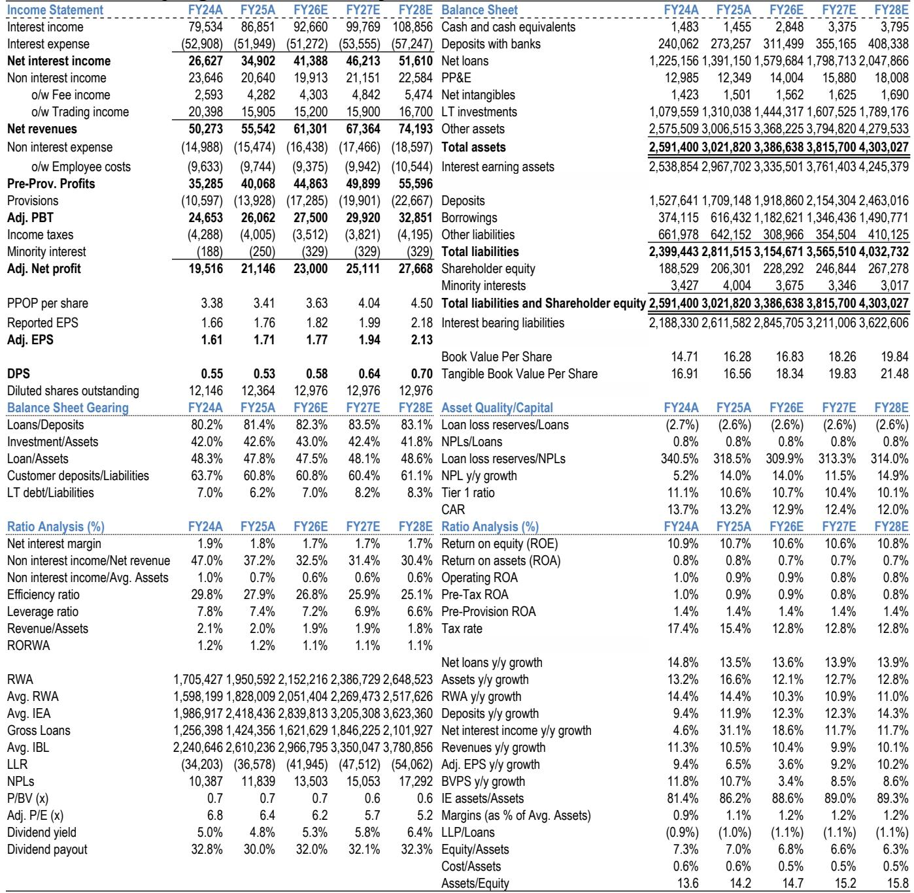
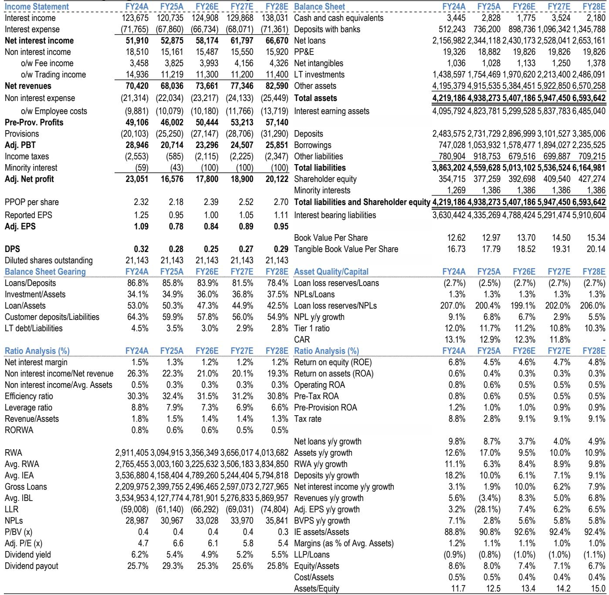

# 区域银行的分水岭时刻：净息差企稳不是答案，资产质量才是真正的筛选器

中国区域银行板块正在经历一个微妙的转折点。2026年第一季度，覆盖范围内的7家银行平均净利息收入同比增长16%，净息差环比企稳，拨备前利润增速回升至13%。这些数字看起来像是一轮周期复苏的起点。但在这组光鲜的均值背后，隐藏着一个更重要的信号：区域银行的投资逻辑，正在从“板块性修复”切换为“个股分化博弈”。

某外资投行最新发布的区域银行研报，在覆盖7家银行后给出了一个清晰的判断：板块已进入“个股精选”阶段。净息差企稳只是入场券，真正的胜负手在于手续费收入的可持续性、资产质量的前瞻指标，以及核心一级资本充足率对分红和扩张的约束力。

这篇研报的核心价值，不在于它预测了净息差何时见底，而在于它提供了一个框架：当行业均值不再能解释股价表现时，投资者应该用哪几把尺子去丈量每家银行的真实质地。

## 1. 净息差企稳是“公共品”，手续费收入才是“护城河”

2026年第一季度，区域银行净息差环比回升7个基点，主要驱动力来自两个方面：一季度信贷“开门红”带来的定价改善，以及存款成本节约的持续释放。这是全行业的共性利好，几乎所有银行都能受益。

真正拉开差距的，是手续费收入。研报数据显示，被覆盖银行的手续费收入同比增长12%，但剔除某家头部银行后，平均增速骤降至4%。换句话说，手续费增长的板块均值，几乎完全由一家银行贡献——宁波银行一季度手续费收入同比飙升82%，远超同业的个位数甚至负增长。

这意味着什么？净息差企稳是周期性因素，迟早会被全行业消化。但手续费收入的差异，反映的是银行在财富管理、投行顾问、支付结算等中间业务上的结构性能力。这种能力不是靠降本增效就能短期建立的，它取决于客户粘性、产品体系和渠道布局。

因此，投资者在评估区域银行时，不能只看净息差拐点。真正值得关注的，是那些在手续费收入上已经形成差异化优势的银行——它们更有能力在利率下行周期中维持收入韧性。

## 2. 资产质量前瞻指标已经出现分化，不良率滞后信号不够用

研报中最值得关注的洞察，不是不良率本身，而是前瞻性指标的分化。2026年第一季度，被覆盖银行的平均不良率环比持平，看似稳定。但进一步拆解可以看到，部分银行的关注类贷款比率、逾期贷款比率已经出现恶化。

以北京银行为例，2025年下半年关注类贷款比率和逾期贷款比率分别环比上升12个基点和43个基点，2026年一季度不良率环比上升3个基点，信用成本同比上升64个基点至0.98%。而宁波银行的关注类贷款比率环比下降8个基点，前瞻指标持续改善。

这里有一个重要的分析框架：不良率是滞后指标，它反映的是过去12-18个月的风险暴露。真正决定未来信用成本走向的，是关注类贷款比率、逾期贷款比率、以及拨备覆盖率这三个前瞻指标。当这些指标出现分化时，意味着不同银行的资产质量周期已经不同步。

研报中一个值得注意的细节是，北京银行的拨备覆盖率在被覆盖银行中最低，仅为198%，而宁波银行和南京银行等均超过300%。拨备覆盖率不仅代表风险缓冲能力，更意味着银行在盈利压力下是否有释放拨备来平滑利润的空间。拨备覆盖率越低，未来信用成本上升对利润的侵蚀就越直接。

## 3. 核心一级资本充足率是被低估的“硬约束”

在区域银行的投资分析中，资本充足率常常被当作一个次要指标。但这份研报将其提升到了一个关键位置。

2026年一季度，北京银行的核心一级资本充足率仅为8.59%，距离监管最低要求仅84个基点。相比之下，宁波银行、南京银行等均在9%以上，重庆农商行等更高。这种差异带来的影响是结构性的。

第一，资本约束直接限制资产扩张。北京银行管理层已表示将采取“资本约束下的资产增长”策略，这意味着其贷款增速将低于行业均值，进而制约净利息收入的增长潜力。

第二，资本充足率影响分红可持续性。在资本补充渠道有限的背景下，区域银行的分红能力与其内生资本生成能力高度相关。核心一级资本充足率越低的银行，在监管压力下越有可能削减分红以保留资本。

第三，资本约束影响银行对宏观复苏的弹性。如果经济出现超预期复苏，资本充足的银行可以更积极地扩张信贷，从而放大盈利弹性。而资本紧张的银行只能在有限的空间内操作，错失周期机遇。

这三点合在一起，构成了一个判断框架：核心一级资本充足率不仅是监管指标，更是决定银行未来两年盈利弹性和分红确定性的核心变量。

## 4. 报告尚未完全回答的关键问题：零售风险的真实深度

研报在分析资产质量时，多次提到零售贷款和中小企业相关风险仍是“主要关注点”，但并未给出一个完整的量化判断。这是当前分析框架中最大的不确定性。

从数据上看，区域银行的零售贷款占比普遍在20%-30%之间，远低于全国性股份制银行。但问题在于，区域银行的客群集中度更高，对本地经济周期的敏感度更大。如果某个区域出现就业或收入预期恶化，零售风险的传导速度可能比全国性银行更快。

研报中提到的北京银行信用成本上升，部分原因正是消费贷、按揭贷和房地产相关贷款的拖累。但这是否是局部现象，还是可能扩散到其他区域银行？报告没有给出明确结论。

另一个未充分展开的问题是：零售风险的滞后性。银行的零售贷款风险暴露通常比企业贷款晚6-12个月。当前零售不良率的稳定，可能反映的是2024年的经济环境。如果2025年下半年经济增速放缓或居民收入预期恶化，零售风险可能在2026年下半年才开始真正体现。

这是投资者在阅读这份研报后需要自行判断的关键变量。它不是一个可以简单用历史均值来外推的参数，而是一个需要持续跟踪的区域性、结构性风险。

## 5. 投资者需要建立的观察框架：三个维度，两个时间窗口

基于研报的逻辑，投资者在评估区域银行时，可以建立一个三维度的观察框架：

第一维度，核心盈利质量。净息差企稳是基础，但真正的区分度在于手续费收入的增长韧性和可持续性。那些手续费收入增速高于行业均值、且来源多元化的银行，更有可能在利率下行周期中维持收入稳定。

第二维度，资产质量的前瞻性指标。关注类贷款比率、逾期贷款比率、拨备覆盖率这三个指标，比不良率更能反映未来6-12个月的信用成本走势。当这些指标出现恶化时，即使当前不良率稳定，也应当警惕。

第三维度，资本充足率与分红能力的匹配度。核心一级资本充足率、分红比例、以及内生资本生成能力，共同决定了银行是否有能力在扩张和分红之间取得平衡。资本充足率低的银行，其分红承诺的可靠性需要打折扣。

在时间窗口上，投资者需要区分两个阶段。短期来看，2026年上半年净息差企稳和信贷“开门红”将继续支撑板块情绪，个股之间的差异可能被行业均值掩盖。但进入下半年，随着净息差企稳效应递减、资产质量前瞻指标逐渐明朗，个股分化将加速。届时，那些在三个维度上均占优的银行，将获得估值溢价，而存在短板的银行可能面临估值下修。

这份研报的结论是清晰的：宁波银行和重庆农商行是当前最值得关注的标的，前者拥有最强的核心盈利能力和财富管理溢价，后者具备稀缺的ROE回升故事和区域经济红利。而北京银行和上海银行则面临不同程度的资产质量、资本约束或增长动能问题。

但投资者更需要关注的，是研报中那些尚未完全回答的问题——零售风险的真实深度、区域经济分化对资产质量的影响、以及资本约束在2027年可能引发的分红调整。这些不确定因素，决定了这份研报的结论是否经得起时间的检验。

欢迎来星球微信群里继续讨论：零售风险会扩散吗？资本约束下哪些银行可能调整分红？我们会在社群中分享完整研报原文、估值对比表格以及更详细的个股分析框架。

Personal reading notes and learning share only. Not investment advice.

