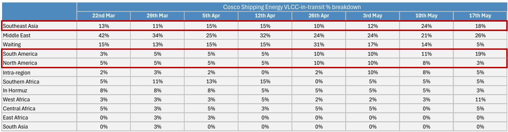
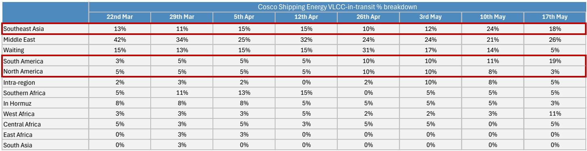
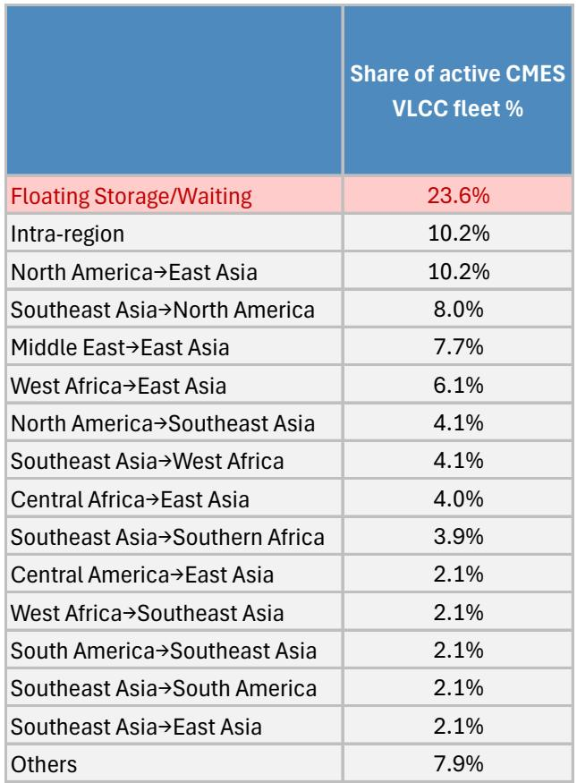

# The Tanker Market Is Tight Today, But the Real Risk Is a Slow Migration Toward Shadow Fleets

The VLCC freight market has rebounded sharply into early May, with rates on key routes like Oman-China and the Atlantic Basin remaining historically elevated. At first glance, this looks like a straightforward story of supply tightness: rerouting around the Hormuz disruption has absorbed vessel capacity, resilient oil demand has kept cargo flows intact, and compliant operators like Cosco Shipping Energy Transport (CSET) have successfully redeployed their fleets into alternative trade lanes. CSET's idle rate has fallen to roughly 5%, the lowest since the conflict began, suggesting that utilization is recovering faster than many expected.

But beneath this surface-level recovery lies a more complex and potentially dangerous structural shift. The same forces that are tightening the compliant tanker market today may also be quietly laying the groundwork for a gradual erosion of its pricing power tomorrow. The risk is not that the Hormuz disruption ends and freight collapses. The risk is that it does not fully end, and that a growing share of Gulf-linked exports migrates toward Iran-friendly shadow operators, leaving compliant owners with a smaller slice of a recovering pie.

This is not a near-term call on freight rates. It is a strategic observation about the evolving architecture of global oil shipping. The current tightness is real, but it may be masking a slow-motion fragmentation of the market that investors and operators need to start pricing in now.

## CSET's Recovery Is Real, But It Reveals a Fragile and Asymmetric Market

The headline improvement in CSET's utilization is genuinely striking. From a peak of floating storage and waiting exposure that reached 31% of its active VLCC deployment in late April, the share has collapsed to just 5% by mid-May. This is the lowest reading since the Hormuz disruption began, and it signals that the company has found productive employment for its vessels in non-Middle Eastern trades.

The data on deployment mix confirms this pivot. CSET's West Africa exposure jumped from roughly 2-3% through most of April to 11% by mid-May. Its South America exposure rose further to 19%. Meanwhile, Middle East exposure remained structurally depressed at 26%, down from over 40% in late March. This is not a temporary adjustment. It reflects a deliberate strategic shift by compliant operators to avoid the operational and reputational risks of operating in a contested strait.

The so what here is critical. CSET's recovery is not a sign that the market is returning to normal. It is a sign that the market is normalizing along a different axis. The compliant fleet is finding work, but it is finding work on longer, more expensive routes. This is supportive for freight rates in the short term, because longer voyages consume more vessel capacity. But it also means that the compliant fleet is increasingly disconnected from the Gulf supply that historically drove its highest-margin business.

The asymmetry is clear: when Gulf exports recover, the incremental barrels may not flow through compliant tankers. They may flow through shadow operators that are willing to accept the risks that compliant owners are avoiding. This is the kernel of the structural risk that the current tightness is obscuring.

## The Gulf Recovery Is Partial and Its Benefits Are Not Evenly Distributed

Saudi-bound VLCC participation recovered to 31 vessels in mid-May, up from 26 the previous week, but still well below the 48 seen on March 22. Bahri, the Saudi national shipping company, has been the primary driver of this recovery, with its participation rising to 15 VLCCs. By contrast, CSET and China Merchants Energy Shipping (CMES) remain limited to just one VLCC each.

This distribution matters. The recovery in Gulf exports is real, but it is being carried by a narrow set of operators. Bahri's willingness to deploy vessels into the Gulf reflects its sovereign alignment and its ability to manage war-risk insurance and crew safety concerns. Compliant Chinese operators, by contrast, are showing extreme caution. Their participation in Saudi-bound trade has not recovered meaningfully from the lows of early April.

The implication is that the recovery in Gulf export volumes may not translate into proportional demand for compliant tonnage. If the bulk of the recovery is handled by Bahri and other regional operators, the tightness in the compliant market will persist, but it will be driven by a shrinking effective supply base rather than by robust demand. This is a fragile equilibrium. Any shock that disrupts Bahri's operations or that triggers a broader re-rating of risk in the Gulf could quickly tighten the market further, but it could just as easily accelerate the migration of trade toward shadow operators.

The data on import-in-transit flows underscores this point. North America has now surpassed the Middle East as Asia's largest VLCC crude origin, accounting for 22.7% of flows versus the Middle East's 18.1%. This is a structural shift, not a cyclical one. The Atlantic Basin and Indian Ocean routes now dominate in-transit VLCC positioning, with the Persian Gulf accounting for just 6.6%. The market is already voting with its vessels, and the vote is against Gulf exposure.

## The Shadow Fleet Risk Is the Most Underappreciated Structural Threat to Compliant Owners

The report identifies a new and emerging risk that deserves far more attention than it has received: prolonged Iranian influence over Hormuz may gradually complicate the expected tightening cycle for the compliant tanker market and tanker shipbuilding. This is not a hypothetical. If Iran retains effective influence over transit through the strait without a full peace settlement, a growing share of Gulf-linked exports may migrate toward Iran-friendly shadow operators.

The logic is straightforward. Compliant owners face three distinct constraints that shadow operators do not: crew safety concerns, the high cost of war-risk insurance, and the risk of secondary sanctions if Iran-mediated transit arrangements are viewed by the US or other jurisdictions as sanctions violations. Shadow operators, by contrast, operate outside these constraints. They are willing to accept higher operational risk in exchange for higher returns, and they are less exposed to regulatory or reputational consequences.

The consequence is a slow but potentially irreversible fragmentation of the tanker market. In the near term, this fragmentation supports freight rates for compliant owners because it reduces effective supply. But over time, it erodes the compliant fleet's market share and its pricing power. If the shadow fleet becomes the primary carrier of Gulf exports, the compliant fleet will be left to compete for a smaller pool of cargoes on longer, less profitable routes.

The report does not quantify this risk, and it is difficult to do so with precision. But the direction of travel is clear. The longer the Hormuz disruption persists in its current form, the more entrenched the shadow fleet becomes. And the more entrenched the shadow fleet becomes, the harder it will be for compliant owners to reclaim their position in the Gulf trade even if a peace settlement is reached.

## The Downside Risk Is Not a Freight Collapse, But Demand Destruction From a Prolonged Disruption

The report flags a key downside risk that is easy to overlook in the current environment of tight supply and elevated rates: demand destruction. If the Hormuz disruption is prolonged, the initial wave of panic restocking and replacement-barrel sourcing may give way to a more damaging dynamic in which high oil prices and supply uncertainty trigger a recessionary contraction in demand.

This is the classic tanker market paradox. High freight rates are good for shipowners in the short term, but if they persist long enough to destroy demand, they become self-defeating. The report notes that recovery in Gulf export flows and eventual peace agreements should remain supportive for tanker demand, particularly if buyers move into replacement-barrel sourcing or inventory rebuilding. But the larger downside risk is a prolonged disruption that triggers recessionary demand destruction rather than panic restocking.

The question that the report leaves open is whether the current market is pricing this risk correctly. Freight rates are elevated, but they are not at crisis levels. The market appears to be pricing a gradual normalization of Gulf exports and a continued tightness in compliant supply. What it may not be pricing is the scenario in which the disruption persists, demand softens, and the compliant fleet finds itself squeezed between falling volumes and rising competition from shadow operators.

This is the scenario that investors and operators should be stress-testing. The current tightness is real, but it may be a peak that is already behind us. The next phase of the cycle may be defined not by how high rates can go, but by how quickly the structural foundations of the market can shift.

## A Decision Framework for Navigating the Fragmented Tanker Market

For investors and operators trying to make sense of this environment, the report points toward a clear but uncomfortable decision framework. The market is no longer a single, integrated global pool of tanker supply. It is increasingly bifurcated into two distinct segments: the compliant fleet, which is constrained by safety, insurance, and sanctions risk, and the shadow fleet, which is constrained by nothing except its own capacity and willingness to take risk.

The key strategic question is which segment will capture the recovery in Gulf exports. The answer depends on three variables that are currently uncertain but increasingly observable.

First, the duration of Iranian influence over Hormuz. If the disruption is resolved quickly through a peace settlement, the shadow fleet's advantage evaporates, and compliant owners can reclaim their market share. If the disruption persists in a low-intensity form, the shadow fleet becomes entrenched.

Second, the regulatory response. If the US or other jurisdictions begin to enforce secondary sanctions against operators using Iran-mediated transit arrangements, the shadow fleet's cost advantage narrows. If enforcement remains lax, the shadow fleet thrives.

Third, the demand trajectory. If global oil demand remains resilient, there is room for both segments to operate profitably. If demand softens, the compliant fleet faces a disproportionate hit because its cost base is higher and its flexibility is lower.

The report does not provide a forecast for any of these variables, and it would be irresponsible to pretend that it does. But it does provide the analytical architecture for making informed bets. Investors who believe that the disruption will be resolved quickly and that regulatory enforcement will tighten should overweight compliant owners. Investors who believe that the disruption will persist and that enforcement will remain lax should consider exposure to the shadow fleet, to the extent that it is accessible.

The uncomfortable truth is that the most likely outcome may be a messy middle: a prolonged but low-intensity disruption, uneven regulatory enforcement, and a gradual but incomplete migration of trade toward shadow operators. In that scenario, the compliant fleet remains profitable but structurally smaller, and the shadow fleet grows but remains opaque and risky.

## Join the Community to Read the Full Report and Review the Original Charts

The analysis above is based on a detailed weekly monitoring report on the Hormuz disruption and its impact on tanker shipping. The full report includes granular data on fleet deployment by operator, route-level freight trends, and a breakdown of the shadow fleet risk that is only summarized here. It also includes the original charts and tables that make the argument visual and concrete.

If you found this analysis useful, consider joining the community to read the full report and review the original charts. The data behind the argument is worth seeing in its original form.

*This article is for learning and discussion only and does not constitute investment advice.*

Personal reading notes and learning share only. Not investment advice.

