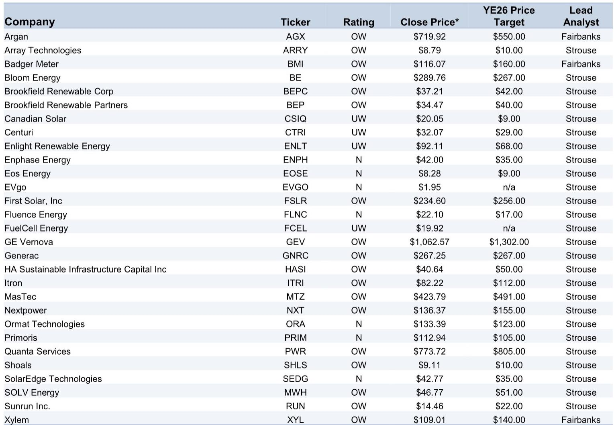
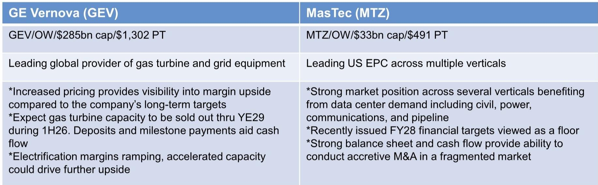
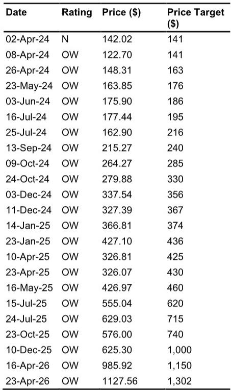

# 美国电力需求的真实拐点：不是“更多新能源”，而是“所有技术都供不应求”

市场对清洁能源和电力基础设施的讨论，长期集中在“可再生能源占比提升”这一单一叙事上。但某外资投行最新发布的2026年春季系列报告，揭示了一个更底层的结构性变化：美国发电装机容量到2050年需要翻倍，而推动这一增长的三大力量——制造业回流、电气化、数据中心——正在同步加速，以至于没有任何单一技术路径能够独自满足需求。报告的核心判断是：我们正在进入一个“全都要”的电力供给时代，天然气、核能、可再生能源、燃料电池、储能，每一种技术都将面临前所未有的需求压力。

这不仅仅是能源转型的问题，更是美国基础设施投资周期的重新定义。对于产业决策者和投资者而言，理解“所有技术都供不应求”这一格局，比押注某种特定技术的胜出更为关键。

## 1. 数据中心的电力需求不是短期脉冲，而是结构性缺口

报告中最具冲击力的数据来自某外资投行内部预测：仅数据中心一项，到2030年就将为美国新增约120吉瓦的电力需求。这个数字意味着什么？作为对比，2024年美国全年新增的各类发电装机容量合计也不过30-40吉瓦。换言之，仅数据中心一个需求端，就需要未来六年内每年新增约20吉瓦的发电能力，相当于每年新建20座大型核电站或100座大型太阳能电站。

更关键的是，这120吉瓦的预测并非基于极端假设。报告指出，推动这一增长的因素包括制造业回流的持续加速、交通和建筑的电气化，以及人口增长带来的基础负荷提升。这些因素叠加在一起，使得美国发电装机容量到2050年需要翻倍，从当前的约1200吉瓦增至约2400吉瓦。

这意味着什么？意味着过去十年“电力需求增长缓慢、供给过剩”的格局已经彻底逆转。对于电力设备制造商、工程总承包公司和储能解决方案提供商而言，这是一个十年甚至二十年级别的需求扩张周期。而对于依赖稳定电力供应的科技公司、制造业企业来说，电力供应的可靠性和成本将成为新的竞争维度。

## 2. 燃气轮机订单创历史新高，但供给瓶颈正在形成

报告提供的第一季度数据已经验证了这一趋势：全球燃气轮机订单达到约29吉瓦，同比增长39%，创下历史同期最高纪录。其中美国订单更是飙升144%。某外资投行覆盖的龙头公司GE Vernova，其订单积压加上服务协议总量已从一年前的50吉瓦增长至100吉瓦，翻了一倍。

但订单激增的背后，供给侧的紧张信号同样值得关注。报告中的成本数据显示，北美联合循环燃气轮机项目的单位成本正在快速攀升。从2025年的中位数约1000美元/千瓦，到2030年已上升至约1800美元/千瓦，涨幅接近80%。更值得注意的是，成本分布的上限端扩张更为剧烈，从2025年的约1050美元/千瓦飙升至2030年的约2300美元/千瓦，反映出部分项目面临的成本失控风险。

这些数据合在一起意味着：燃气轮机的需求确定性极高，但供应链的产能扩张速度、项目执行能力和成本控制能力，将成为区分赢家与输家的关键变量。那些能够提前锁定设备产能、拥有成熟项目交付记录的工程总承包公司，将在这一轮周期中获得显著的竞争优势。

## 3. 工程总承包公司正在经历“订单洪流”，但执行能力才是真正的护城河

报告特别强调了工程总承包公司在2026年第一季度的订单表现。几家核心公司的订单出货比（book-to-bill）均超过1倍：某公司达到1.8倍，另一家为1.6倍，还有一家为1.4倍。这意味着新签订单持续超过当期确认的收入，订单积压正在加速增长。

但更值得关注的是一家中型工程公司的表态：其管理层认为，当前资产负债表能够支撑的订单积压规模约为40亿美元，而目前实际积压仅为29亿美元。这一表态暗示，该公司有充足的财务空间和产能储备去承接更多订单。这既是对需求持续性的信心，也反映了行业内部分化正在加剧——拥有强健资产负债表和成熟管理团队的公司，将有能力在订单洪流中持续扩张，而资本不足或管理薄弱的公司可能面临“有订单但做不了”的尴尬。

对于投资者而言，订单增长的绝对值固然重要，但更关键的观察维度是：公司是否有能力将订单转化为利润。这取决于项目管理能力、供应链稳定性、劳动力可得性以及资本配置纪律。报告尚未完全展开的一个关键问题是：在如此快速的需求扩张中，工程总承包行业的利润率是否会因为竞争加剧和成本上升而被压缩？这需要后续季度数据来验证。

## 4. 燃料电池和备用电源正在成为“桥接技术”，但长期定位仍待验证

报告中最引人注目的表现来自燃料电池公司。某燃料电池企业第一季度与大型科技公司签署了高达2.45吉瓦的供应协议，并因此上调了全年业绩指引。其管理层甚至明确表示，没有客户将燃料电池视为“桥接电源”——即临时过渡方案——而是将其作为长期解决方案。

与此同时，备用电源领域同样活跃。某备用发电机公司的管理层表示，正在与一家超大规模数据中心客户谈判，交易规模可能使其商业和工业收入翻倍，达到约15亿美元。另一家工程机械巨头则计划到2030年将发电业务收入翻倍，年产能扩张至约50吉瓦，其中大部分将采用往复式发动机技术。

这些信号指向一个有趣的格局：在大型燃气轮机和可再生能源之间的“中间地带”，燃料电池和高端备用电源正在快速填补缺口。它们能够提供比柴油发电机更清洁、比大型燃气轮机更灵活的电力解决方案，特别适合数据中心等对电力质量和可靠性要求极高的场景。

但报告也没有回避风险：燃料电池技术的成本曲线能否持续下降？备用电源的大规模部署是否会面临排放监管压力？这些问题的答案将决定这些“桥接技术”最终是成为主流配置，还是仅仅作为过渡阶段的阶段性选择。报告对此保留了开放态度，这也是后续需要持续跟踪的核心变量。

## 5. 储能和太阳能正在分化：市场集中度提升，赢家通吃效应显现

储能和太阳能领域的数据同样值得解读。报告引用某研究机构的预测，2026年全球储能部署量将同比增长约41%，但美国市场增速仅为约12%，明显低于全球平均水平。原因在于2025年上半年关税和政策不确定性带来的滞后影响。

但更值得关注的是结构性的分化信号。一家储能公司近期与两家超大规模数据中心客户签署了约10吉瓦时的储能服务协议。这并非简单的设备销售，而是长期服务协议（MSA），意味着储能正在从“辅助性调频服务”升级为“数据中心核心电力基础设施”的组成部分。

太阳能领域同样呈现分化。一家头部太阳能跟踪支架公司的订单出货比达到约2.0倍，而另一家公司的表现则平淡得多。报告认为，市场复杂性正在加速行业整合，头部企业凭借技术优势、客户关系和项目执行能力，正在从中小竞争对手手中夺取市场份额。对于投资者而言，这意味着在太阳能领域，押注行业龙头比押注行业整体复苏更为重要。

## 6. 市场尚未完全定价的关键问题：当所有技术都供不应求时，谁拥有定价权？

报告中最具洞察力的部分，或许不是数据本身，而是对竞争格局的重新定义。在传统的清洁能源叙事中，市场关注的是“哪种技术成本最低”。但在当前“所有技术都供不应求”的格局下，竞争焦点正在从成本转向可获得性——谁能提供确定性的产能交付，谁就能获得溢价。

这份报告揭示了一个尚未被市场充分定价的关键问题：在需求爆发式增长、供给普遍紧张的背景下，拥有稀缺产能、技术壁垒和客户关系的公司，将获得显著的定价权。这不仅仅是周期性的价格上涨，而是结构性估值重塑。

但报告也留下了一个未完全回答的问题：这种定价权能够持续多久？当供应链产能开始扩张、新进入者涌入、技术路线逐渐成熟后，超额利润是否会被竞争侵蚀？这取决于两个关键假设：一是需求增长能否持续超出供给扩张的速度，二是现有龙头能否通过规模效应和技术迭代维持成本优势。

对于产业决策者和投资者而言，当前最需要做的不是预测哪一种技术最终胜出，而是建立一套能够持续跟踪“产能-需求-定价权”动态变化的观察框架。这个框架应该包括：每个细分领域的产能利用率、订单出货比、单位成本趋势、以及龙头公司的市场份额变化。

## 7. 报告没有完全展开的伏笔：关税、政策不确定性与技术路线的终极选择

尽管报告提供了大量前瞻性数据，但它也坦诚地指出了几个尚未充分展开的关键变量。首先是关税和政策不确定性。报告提到，美国储能部署增速低于全球平均水平，部分原因就是2025年上半年关税和政策不确定性带来的滞后影响。如果贸易摩擦加剧或补贴政策调整，整个清洁能源投资的时间表可能面临重新校准。

其次是技术路线的终极选择。报告提到了“所有技术都供不应求”，但没有深入探讨一个关键问题：当供给瓶颈缓解后，哪些技术会因成本或效率优势而成为主流，哪些会被边缘化？例如，燃料电池和备用电源能否在成本上接近大型燃气轮机？储能的循环寿命和度电成本能否在2030年前实现突破性下降？这些问题将决定当前估值差异巨大的各类公司，最终会走向均值回归还是进一步分化。

这些未解问题，恰恰是持续跟踪这份报告系列、参与深度讨论的价值所在。报告的图表和数据提供了清晰的起点，但真正的投资判断，需要结合后续季度数据、政策变化和公司动态来不断修正。

欢迎来星球微信群里继续讨论这些关键变量的最新进展，以及如何在当前估值水平下构建更具韧性的投资框架。

Personal reading notes and learning share only. Not investment advice.

