# Payment Processing

Snippets From Market Share Handbook 2026 Edition

See the full report here

# Payments, Processors & IT Services

# Tien-tsin Huang, CFA AC

(1-212) 622-6632

Tien-tsin.huang@JPM.com

JPM Securities LLC

# Puneet Jain

(1-212) 622-1436

Puneet.x.jain@JPM.com

JPM Securities LLC

# Connor Allen AC

(1-212) 622-1303

Connor.allen@JPM.com

JPM Securities LLC

# Brendan Biles

(1-212) 270-0880

Brendan.biles@JPM.com

JPM Securities LLC

# Charles Pearce, CFA

(1-212) 622-4368

Charles.pearce@jpmchase.com

JPM Securities LLC

# Abbey Hochreiner

(1-212) 270-0660

Abbey.hochreiner@jpmchase.com

JPM Securities LLC

# Processing Group Underperforming in 2026

Excess Returns: JPM processing index returns (market cap weighted) minus S&P 500 Index returns   
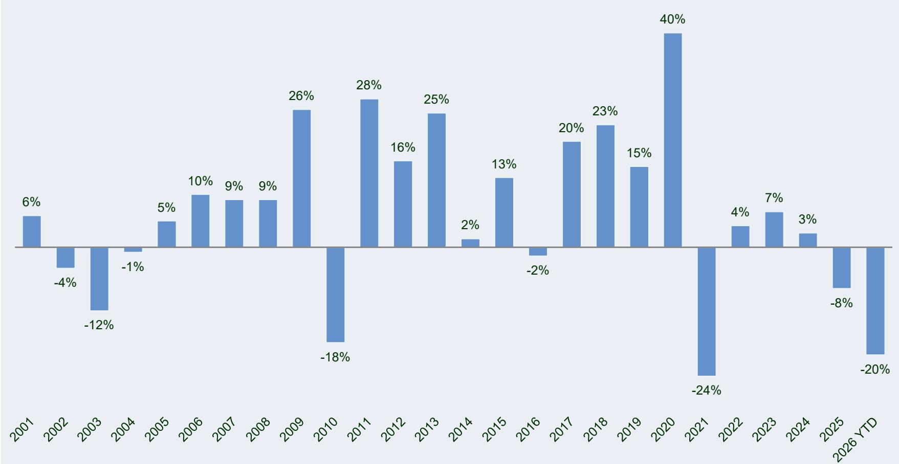

bar

| Year | Value (%) |
| :--- | :--- |
| 2001 | 6 |
| 2002 | -4 |
| 2003 | -12 |
| 2004 | -1 |
| 2005 | 5 |
| 2006 | 10 |
| 2007 | 9 |
| 2008 | 9 |
| 2009 | 26 |
| 2010 | -18 |
| 2011 | 28 |
| 2012 | 16 |
| 2013 | 25 |
| 2014 | 2 |
| 2015 | 13 |
| 2016 | -2 |
| 2017 | 20 |
| 2018 | 23 |
| 2019 | 15 |
| 2020 | 40 |
| 2021 | -24 |
| 2022 | 4 |
| 2023 | 7 |
| 2024 | 3 |
| 2025 | -8 |
| 2026 YTD | -20 |

Source: Bloomberg Finance L.P. Priced as of 5/14/2026.   
Note: JPM processing index includes ADP, AFRM, BILL, BR, CPAY, FI, FIS, FLYW, GPN, LSPD, MA, MQ, PAY, PAYX, PYPL, RELY, TOST, TNET, V, WU, WEX, XYZ (formerly BKI, EVOP, MGI, NVEI).

# Pandemic Accelerated Card Displacement of Cash, Lifted Debit; Partially Rebounded

United States Payment Medium Wallet Share   
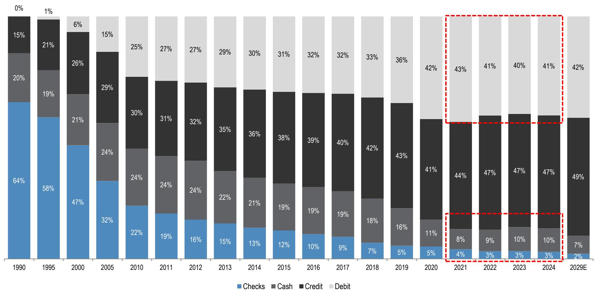

bar_stacked

| Year   | Checks | Cash | Credit | Debit |
|--------|--------|------|--------|-------|
| 1990   | 64%    | 20%  | 15%    | 0%    |
| 1995   | 58%    | 19%  | 21%    | 1%    |
| 2000   | 47%    | 21%  | 26%    | 6%    |
| 2005   | 32%    | 24%  | 29%    | 15%   |
| 2010   | 22%    | 24%  | 30%    | 25%   |
| 2011   | 19%    | 24%  | 31%    | 27%   |
| 2012   | 16%    | 24%  | 32%    | 27%   |
| 2013   | 15%    | 22%  | 35%    | 29%   |
| 2014   | 13%    | 21%  | 36%    | 30%   |
| 2015   | 12%    | 19%  | 38%    | 31%   |
| 2016   | 10%    | 19%  | 39%    | 32%   |
| 2017   | 9%     | 19%  | 40%    | 32%   |
| 2018   | 7%     | 18%  | 42%    | 33%   |
| 2019   | 5%     | 16%  | 43%    | 36%   |
| 2020   | 5%     | 11%  | 41%    | 42%   |
| 2021   | 4%     | 8%   | 44%    | 43%   |
| 2022   | 3%     | 9%   | 47%    | 41%   |
| 2023   | 3%     | 10%  | 47%    | 40%   |
| 2024   | 3%     | 10%  | 47%    | 41%   |
| 2029E  | 2%     | 7%   | 49%    | 42%   |

Source: The Nilson Report and JPM

# Volume Growth Stabilizing below Historical Trend

U.S. Bankcard Purchase Volume Growth Y/Y   
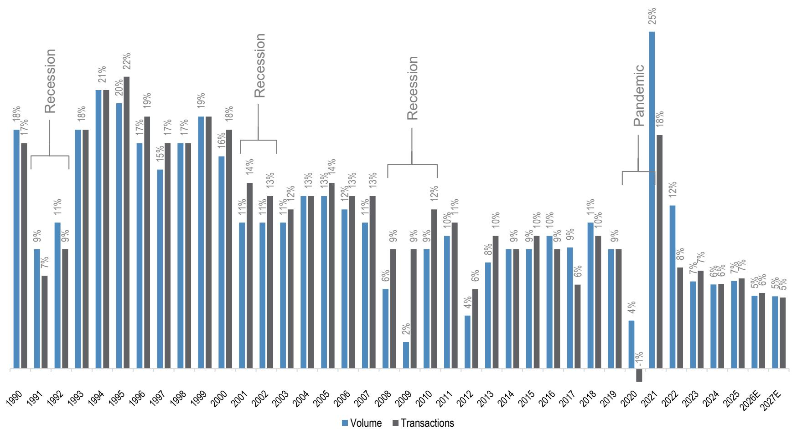

bar

| Year | Volume (%) | Transactions (%) |
| :--- | :--- | :--- |
| 1990 | 18 | 17 |
| 1991 | 9 | 7 |
| 1992 | 11 | 9 |
| 1993 | 18 | 18 |
| 1994 | 21 | 20 |
| 1995 | 20 | 22 |
| 1996 | 17 | 19 |
| 1997 | 15 | 17 |
| 1998 | 17 | 17 |
| 1999 | 19 | 19 |
| 2000 | 16 | 18 |
| 2001 | 11 | 14 |
| 2002 | 11 | 13 |
| 2003 | 11 | 12 |
| 2004 | 13 | 13 |
| 2005 | 13 | 14 |
| 2006 | 12 | 13 |
| 2007 | 11 | 13 |
| 2008 | 6 | 9 |
| 2009 | 2 | 9 |
| 2010 | 9 | 12 |
| 2011 | 10 | 11 |
| 2012 | 4 | 6 |
| 2013 | 8 | 10 |
| 2014 | 9 | 9 |
| 2015 | 9 | 10 |
| 2016 | 10 | 9 |
| 2017 | 9 | 6 |
| 2018 | 11 | 10 |
| 2019 | 9 | 9 |
| 2020 | 4 | -1 |
| Pandemic | -1 | -5 |
| 2021 | 25 | 18 |
| 2022 | 12 | 8 |
| 2023 | 7 | 7 |
| 2024 | 6 | 6 |
| 2025 | 7 | 7 |
| 2026E | 5 | 6 |
| 2027E | 5 | 5 |

Source: Company reports, The Nilson Report, JPM forecast for 2026-2027.   
Note: Bankcard purchase volume and transaction growth year-over-year represented by bars.   
CY12 and CY13 volume and transaction metrics are distorted by regulation requiring debit card issuers to enable at least one non-affiliated PIN debit network on all cards. Debit transactions/volume routed over non-affiliated PIN debit networks is not reflected in the above diagram.

# E-Commerce Growth Premium to Overall Physical Retail Moderating, Spend Continues Shifting to Mobile

U.S. Digital Spend (ex-Travel) by Medium (\$ in millions) 

<table><tr><td></td><td>2019 Spend</td><td>2020 Spend</td><td>2021 Spend</td><td>2022 Spend</td><td>2023 Spend</td><td>2024 Spend</td><td>2025 Spend</td><td>% change (y/y)</td><td>CY22-25 CAGR</td></tr><tr><td>Desktop</td><td>429,666</td><td>478,124</td><td>597,686</td><td>703,097</td><td>846,654</td><td>926,098</td><td>962,368</td><td>4%</td><td>11%</td></tr><tr><td>Smartphone</td><td>135,207</td><td>169,997</td><td>241,557</td><td>311,731</td><td>361,509</td><td>512,738</td><td>670,493</td><td>31%</td><td>29%</td></tr><tr><td>Tablet</td><td>50,187</td><td>57,316</td><td>65,968</td><td>75,554</td><td>75,066</td><td>84,233</td><td>92,433</td><td>10%</td><td>7%</td></tr><tr><td>Total Digital Commerce</td><td>615,060</td><td>705,436</td><td>905,211</td><td>1,090,382</td><td>1,283,229</td><td>1,523,068</td><td>1,725,295</td><td>13%</td><td>17%</td></tr><tr><td>% Desktop</td><td>70%</td><td>68%</td><td>66%</td><td>64%</td><td>66%</td><td>61%</td><td>56%</td><td></td><td></td></tr><tr><td>% Smartphone</td><td>22%</td><td>24%</td><td>27%</td><td>29%</td><td>28%</td><td>34%</td><td>39%</td><td></td><td></td></tr><tr><td>% Tablet</td><td>8%</td><td>8%</td><td>7%</td><td>7%</td><td>6%</td><td>6%</td><td>5%</td><td></td><td></td></tr></table>

Source: comScore (1Q 2026).

The y/y increase in penetration of Smartphone spend on U.S. sites corresponded with reported increase in preference from our Online Checkout Survey

Preferred Digital Spend Medium   
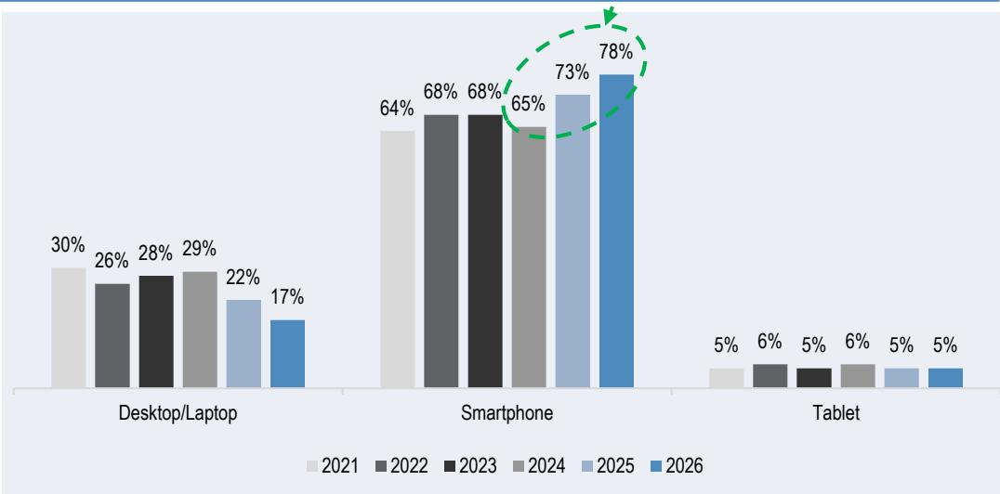

bar

| Device Type | 2021 (%) | 2022 (%) | 2023 (%) | 2024 (%) | 2025 (%) | 2026 (%) |
|---|---|---|---|---|---|---|
| Desktop/Laptop | 30 | 26 | 28 | 29 | 22 | 17 |
| Smartphone | 64 | 68 | 68 | 65 | 73 | 78 |
| Tablet | 5 | 6 | 5 | 6 | 5 | 5 |

Source: JPM Online Checkout Survey.

- The growth premium for global e-comm spend relative to physical retail moderated in 2025, and is expected to remain at a \~4pt premium looking ahead.   
• Online checkout preference does not equal practice:

- More than 2/3 of Americans prefer to complete an online transaction using their Smartphones; however, $>55\%$ of spend on U.S. sites takes place on Desktop.   
• We continue to see runway for mobile-native payment wallets to increase penetration.

Global e-Commerce vs. Phys. Retail Sales Growth 

<table><tr><td>Year</td><td>e-Comm Sales Growth</td><td>Physical Retail Sales Growth</td><td>e-Comm Premium</td><td>Avg. Premium</td></tr><tr><td>2016</td><td>26.8%</td><td>4.2%</td><td>22.6%</td><td rowspan="4">20.2%</td></tr><tr><td>2017</td><td>27.6%</td><td>4.7%</td><td>22.9%</td></tr><tr><td>2018</td><td>20.9%</td><td>2.8%</td><td>18.1%</td></tr><tr><td>2019</td><td>20.4%</td><td>3.4%</td><td>17.0%</td></tr><tr><td>2020</td><td>28.1%</td><td>-8.0%</td><td>36.1%</td><td rowspan="5">9.9%</td></tr><tr><td>2021</td><td>16.7%</td><td>12.2%</td><td>4.5%</td></tr><tr><td>2022</td><td>5.9%</td><td>7.0%</td><td>-1.1%</td></tr><tr><td>2023</td><td>9.6%</td><td>4.2%</td><td>5.4%</td></tr><tr><td>2024</td><td>7.7%</td><td>3.2%</td><td>4.5%</td></tr><tr><td>2025E</td><td>6.8%</td><td>3.2%</td><td>3.6%</td><td rowspan="4">4.0%</td></tr><tr><td>2026E</td><td>7.2%</td><td>3.0%</td><td>4.2%</td></tr><tr><td>2027E</td><td>7.2%</td><td>3.0%</td><td>4.2%</td></tr><tr><td>2028E</td><td>6.9%</td><td>2.8%</td><td>4.1%</td></tr></table>

# Button Availability Across Top 100 U.S. E-Comm Merchants

Payment Method Availability at Top 100 U.S. E-Commerce Merchants (Desktop)   
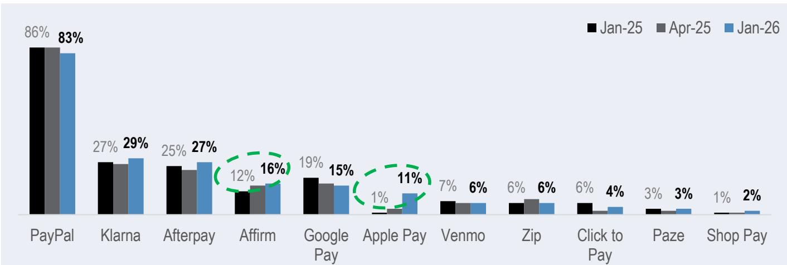

bar

| Payment Method | Jan-25 (%) | Apr-25 (%) | Jan-26 (%) |
|---|---|---|---|
| PayPal | 86 | 83 | 83 |
| Klarna | 27 | 27 | 29 |
| Afterpay | 25 | 24 | 27 |
| Affirm | 12 | 13 | 16 |
| Google Pay | 19 | 16 | 15 |
| Apple Pay | 1 | 1 | 11 |
| Venmo | 7 | 6 | 6 |
| Zip | 6 | 6 | 6 |
| Click to Pay | 6 | 2 | 4 |
| Paze | 3 | 2 | 3 |
| Shop Pay | 1 | 0.5 | 2 |

Source: JPM and Digital Commerce 360 Research for ranking of top 100 merchants

Payment Method Availability at Top 100 U.S. E-Commerce Merchants (Mobile, iOS)   
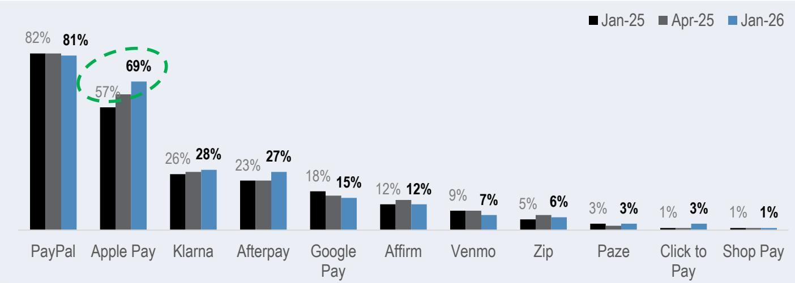

bar

| Payment Method | Jan-25 (%) | Apr-25 (%) | Jan-26 (%) |
| :--- | :--- | :--- | :--- |
| PayPal | 82 | 81 | 81 |
| Apple Pay | 57 | 69 | 69 |
| Klarna | 26 | 28 | 28 |
| Afterpay | 23 | 27 | 27 |
| Google Pay | 18 | 15 | 15 |
| Affirm | 12 | 12 | 12 |
| Venmo | 9 | 7 | 7 |
| Zip | 5 | 6 | 6 |
| Paze | 3 | 3 | 3 |
| Click to Pay | 1 | 3 | 3 |
| Shop Pay | 1 | 1 | 1 |

Source: JPM and Digital Commerce 360 Research for ranking of top 100 merchants   
Note (right): PayPal Branded assumes 40% mix of U.S. volume. Apple Pay represents JPM estimate   
averaging industry sources estimating between 2-13% ecomm share. Google Pay reflects JPM   
estimate considering relative availability at checkout and consumer preference based on JPM   
Checkout Survey. Amazon GMV sourced from JPM Internet Analyst Doug Anmuth. Guest Checkout   
based on consumer responses in JPM Online Checkout Survey and company commentary.

\- >50% of U.S. e-comm is done on desktop, but consumer preference is increasingly shifting to mobile

• PayPal Branded remains the best distributed, available at >80% of merchants surveyed.

\- BNPL providers occupy premium real estate, and are best represented on the Product Page

\- Klarna was among best represented BNPL providers (>25% of merchants), but Affirm (\~15% of merchants) has greater share in Top 10

• Monitoring Apple– Apple in Browser was added to 10 of the Top 100 merchants over the last year

\- Klarna, Afterpay also gaining traction on Mobile

Share of U.S. CNP E-Commerce   
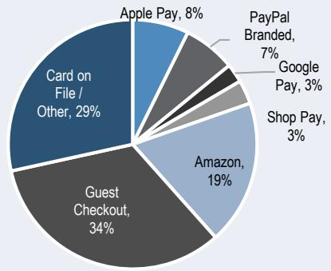

pie

| Category | Percentage (%) |
| :--- | :--- |
| Card on File / Other | 29 |
| Guest Checkout | 34 |
| Amazon | 19 |
| Apple Pay | 8 |
| PayPal Branded | 7 |
| Google Pay | 3 |
| Shop Pay | 3 |

Source: JPM estimates, company reports, and The Nilson Report.

# Digital Wallets winning share largely at expense of card on file

Preferred payment method: Guest Checkout vs. Card on File vs. Digital Wallet   
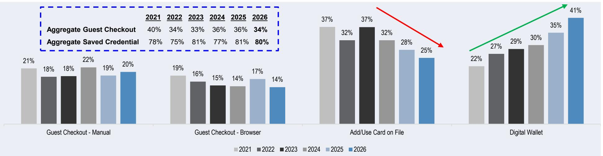  
Source: JPM Online Checkout Survey   
Note: 1,486 responses, “saved credentials” include guest checkout with browser autofill, registered card on file and digital wallets.

Reason for Using Digital Wallets   
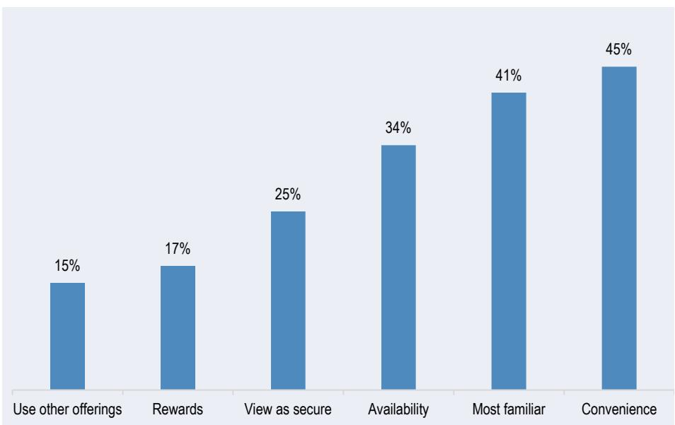

bar

| Category | Percentage (%) |
| :--- | :--- |
| Use other offerings | 15 |
| Rewards | 17 |
| View as secure | 25 |
| Availability | 34 |
| Most familiar | 41 |
| Convenience | 45 |

Across 3 scenarios ( $1^{st}$ time shopping at a website, favorite website, retailer's mobile app), respondents were 75-81% likely to checkout using some form of auto-populated/saved credentials (80% avg.) and 30-39% likely to use some form of Guest Checkout (34% avg.).   
There remains room for penetration of guest checkout; recent wallet share gains appear to be coming at the expense of card on file, possibly browser (to a lesser extent)   
43% of PayPal preferers cited familiarity as a reason for said preference (vs. 41% among tot. survey); 54% of Apple Pay preferers cited convenience/speed (vs. 45% among tot. survey); 17% of Cash App Pay preferers cited use of other product offerings (vs. 15% among tot. survey).

# Volume Estimates Assume Similarly Muted U.S. Growth vs. PCE Through '27

U.S. Bank Card Purchase Volume Trends vs. Personal Consumer Expenditure 

<table><tr><td>$ in billions</td><td>2017</td><td>2018</td><td>2019</td><td>2020</td><td>2021</td><td>2022</td><td>2023</td><td>2024</td><td>2025</td><td>2026E</td><td>2027E</td></tr><tr><td>Mastercard</td><td>1,385</td><td>1,536</td><td>1,701</td><td>1,746</td><td>2,176</td><td>2,441</td><td>2,592</td><td>2,785</td><td>2,958</td><td>3,057</td><td>3,216</td></tr><tr><td>Visa</td><td>3,332</td><td>3,697</td><td>4,028</td><td>4,170</td><td>5,208</td><td>5,828</td><td>6,217</td><td>6,582</td><td>7,027</td><td>7,477</td><td>7,893</td></tr><tr><td>Total US Purchase Volume</td><td>4,717</td><td>5,233</td><td>5,729</td><td>5,916</td><td>7,384</td><td>8,269</td><td>8,809</td><td>9,367</td><td>9,985</td><td>10,534</td><td>11,109</td></tr><tr><td>% change (y/y)</td><td>9.1%</td><td>10.9%</td><td>9.5%</td><td>3.3%</td><td>24.8%</td><td>12.0%</td><td>6.5%</td><td>6.3%</td><td>6.6%</td><td>5.5%</td><td>5.5%</td></tr><tr><td>Personal Consumer Expenditure (PCE)</td><td>13,291</td><td>13,935</td><td>14,438</td><td>14,228</td><td>16,119</td><td>17,690</td><td>18,833</td><td>19,896</td><td>20,961</td><td>21,398</td><td>22,929</td></tr><tr><td>% change (y/y)</td><td>4.4%</td><td>4.8%</td><td>3.6%</td><td>-1.5%</td><td>13.3%</td><td>9.7%</td><td>6.5%</td><td>5.6%</td><td>5.4%</td><td>2.1%</td><td>7.2%</td></tr><tr><td>Total PCE Penetration</td><td>35%</td><td>38%</td><td>40%</td><td>42%</td><td>46%</td><td>47%</td><td>47%</td><td>47%</td><td>48%</td><td>49%</td><td>48%</td></tr><tr><td>&quot;Cardable&quot; PCE Penetration *</td><td>58%</td><td>61%</td><td>65%</td><td>68%</td><td>74%</td><td>75%</td><td>75%</td><td>76%</td><td>78%</td><td>N/A</td><td>N/A</td></tr></table>

Source: Company reports, JPM estimates and the U.S. Department of Commerce.   
Note: “Cardable” PCE removes housing/utilities, health care and motor vehicle payments. 2012 card volume growth is understated due to PIN Debit market share losses by Visa. Mastercard data excludes debit transactions on Maestro and Cirrus-branded cards, Mondex transactions and transactions involving brands other than Mastercard. 2026-27 PCE growth based on JPM Economic Research estimates as of April 2026.

Bank Card Volume Growth to U.S. PCE Growth Multiplier   
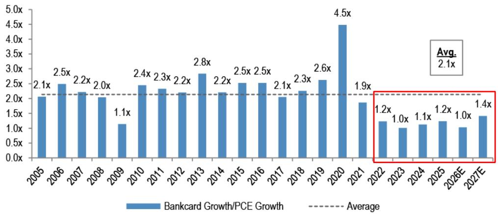

bar

| Year   | Bankcard Growth/PCE Growth |
| ------ | -------------------------- |
| 2005   | 2.1x                       |
| 2006   | 2.5x                       |
| 2007   | 2.2x                       |
| 2008   | 2.0x                       |
| 2009   | 1.1x                       |
| 2010   | 2.4x                       |
| 2011   | 2.3x                       |
| 2012   | 2.2x                       |
| 2013   | 2.8x                       |
| 2014   | 2.2x                       |
| 2015   | 2.5x                       |
| 2016   | 2.5x                       |
| 2017   | 2.1x                       |
| 2018   | 2.3x                       |
| 2019   | 2.6x                       |
| 2020   | 4.5x                       |
| 2021   | 1.9x                       |
| 2022   | 1.2x                       |
| 2023   | 1.0x                       |
| 2024   | 1.1x                       |
| 2025   | 1.2x                       |
| 2026E  | 1.0x                       |
| 2027E  | 1.4x                       |

Source: U.S. Department of Commerce and JPM calculations.   
Note: PCE = Personal Consumption Expenditure, Multiplier = Card-based purchase volume growth/ U.S. PCE Growth. 2012 Bank Card Volume Growth is JPMe assuming PIN debit share shift from Visa to Mastercard that is unreported. 2020 was the first period in tracking where PCE growth was negative while Bankcard growth was positive. 2025-26 PCE growth based on JPM Economic Research estimates as of April 2026.

- On average, bank card penetration of “cardable” PCE expanded about \~3ppts per year. Simple math implies 5+ years of card conversion opportunity left (domestically). Longer at current rates.   
- All else equal, 1ppt of penetration equates to about 130 bps of aggregate volume growth to Visa and Mastercard.   
- Path to further penetration is small and large ticket. B2B and other non-carded verticals significantly expand domestic TAM.   
- Global card penetration of consumption is \~15ppts below U.S.

2025 U.S. PCE Components   
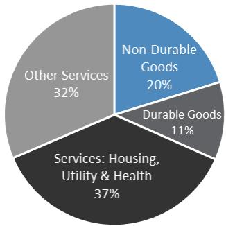

pie

| Category | Percentage (%) |
| :--- | :--- |
| Non-Durable Goods | 20 |
| Durable Goods | 11 |
| Services: Housing, Utility & Health | 37 |
| Other Services | 32 |

Largest card opportunity
large-ticket durable goods,
housing, healthcare   
Source: U.S. Department of Commerce.

JPM

# What Themes Can Supplement U.S. PCE Card Penetration?

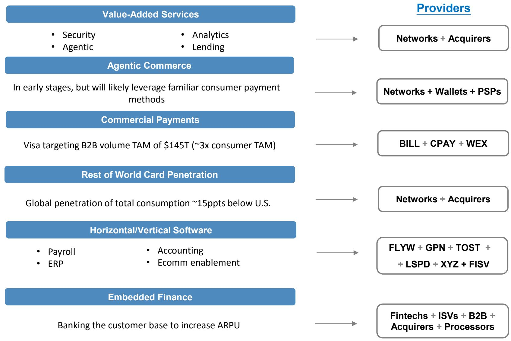

flowchart

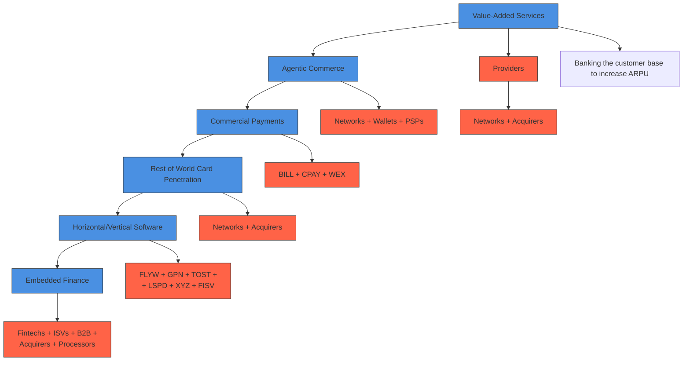
```mermaid
graph TD
    A["Value-Added Services"] --> B["Agentic Commerce"]
    B --> C["Commercial Payments"]
    C --> D["Rest of World Card Penetration"]
    D --> E["Horizontal/Vertical Software"]
    E --> F["Embedded Finance"]
    
    A --> G["Providers"]
    G --> H["Networks + Acquirers"]
    B --> I["Networks + Wallets + PSPs"]
    C --> J["BILL + CPAY + WEX"]
    D --> K["Networks + Acquirers"]
    E --> L["FLYW + GPN + TOST +<br>+ LSPD + XYZ + FISV"]
    F --> M["Fintechs + ISVs + B2B +<br>Acquirers + Processors"]
    
    A --> N["Banking the customer base to increase ARPU"]
    
    style A fill:#4A90E2,stroke:#333
    style B fill:#4A90E2,stroke:#333
    style C fill:#4A90E2,stroke:#333
    style D fill:#4A90E2,stroke:#333
    style E fill:#4A90E2,stroke:#333
    style F fill:#4A90E2,stroke:#333
    style G fill:#FF6347,stroke:#333
    style H fill:#FF6347,stroke:#333
    style I fill:#FF6347,stroke:#333
    style J fill:#FF6347,stroke:#333
    style K fill:#FF6347,stroke:#333
    style L fill:#FF6347,stroke:#333
    style M fill:#FF6347,stroke:#333
```

# Network Value Added Services – Mastercard Larger, Visa Growing Faster

Visa   
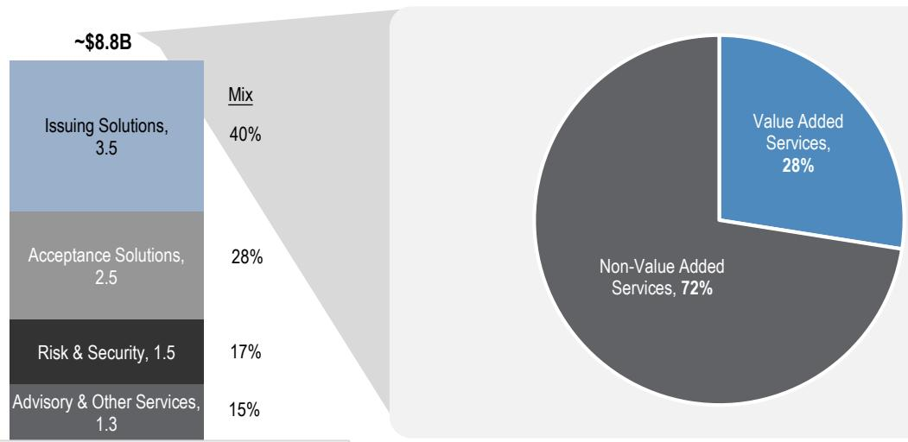

pie

| Category | Value Added Services (%) | Non-Value Added Services (%) |
| :--- | :--- | :--- |
| Value Added Services | 28 | 72 |
| Risk & Security | 17 | 1.5 |
| Acceptance Solutions | 28 | 2.5 |
| Issuing Solutions | 40 | 3.5 |
| Advisory & Other Services | 15 | 1.3 |
~$8.8B

Visa VAS Components (FY24)

28% of Visa's revenue is VAS, weighted toward Issuing/Acceptance. 41% of Mastercard's revenue is VAS, weighted toward Security and Data.

Visa VAS has grown \~4ppts faster than Mastercard (low 20% vs. MA high teens) over the last four years, with law of large numbers contributing (MA added \~\$2.5B vs V \~\$2.2B in CY25).

Mastercard   
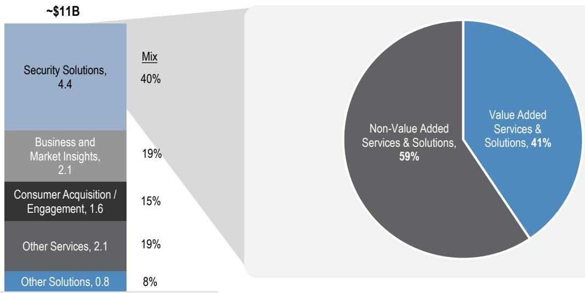

pie

~$11B
| Category | Value Added Services & Solutions (%) | Non-Value Added Services & Solutions (%) |
| :--- | :--- | :--- |
| Value Added Services & Solutions | 41 | 59 |
| Other Solutions | 8 | 19 |
| Other Services | 19 | 2.1 |
| Consumer Acquisition / Engagement | 15 | 1.6 |
| Business and Market Insights | 19 | 2.1 |
| Security Solutions | 40 | 4.4 |

Mastercard VAS&S Components (FY24)

FXN VAS Revenue Growth   
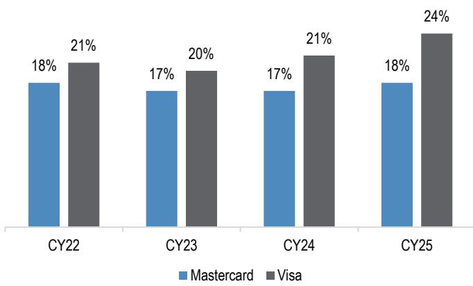

bar

| Year | Mastercard (%) | Visa (%) |
| :--- | :--- | :--- |
| CY22 | 18 | 21 |
| CY23 | 17 | 20 |
| CY24 | 17 | 21 |
| CY25 | 18 | 24 |

Source: Company reports, JPM.

JPM

# Network Tokenization: The Next Pricing Opportunity?

What Is Network Tokenization?   
Tokenization replaces a payment card's account number with an alternative string of numbers called a token.   

flowchart

```mermaid
graph LR
    A["Card Number"] --> B["Network Token"]
    B --> C["Wallet + Ecomm Merchant"]
```

Why tokenization matters:

(1) Significantly benefits ecosystem (see below)   
(2) Tokenization has gained material share (V/MA 30%+ transactions) growing \~30%   
(3) V/MA didn't charge directly for tokenization for 10 years – MA started in 2025, Visa started in US/EU in 2026 and we estimate will lift FY26 revenue growth by 1ppt+

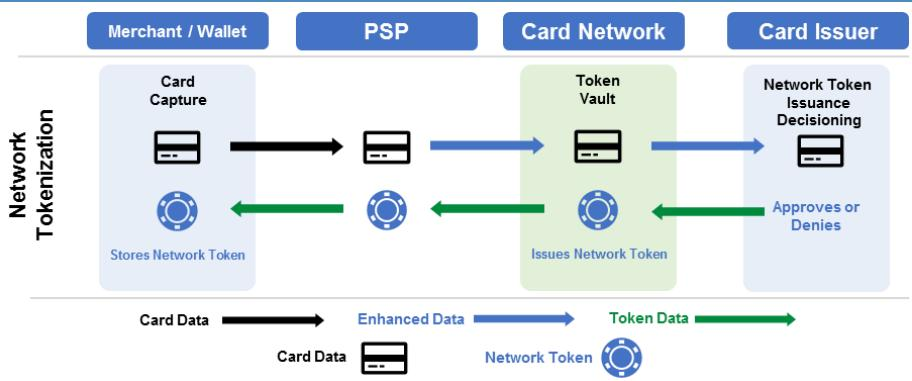

flowchart

```mermaid
graph LR
    subgraph Merchant / Wallet
        A["Card Capture"] --> B["PSP"]
        B --> C["Card Network"]
        C --> D["Card Issuer"]
    end

    subgraph PSP
        E["Stores Network Token"] <--> F["Token Vault"]
        G["Issues Network Token"] <--> H["Token Vault"]
        I["Issues Network Token"] <--> J["Issues Vault"]
    end

    subgraph Card Network
        K["Network Token Issuance Decisioning"] --> L["Approves or Denies"]
    end

    subgraph Card Issuer
        M["Phone Icon"] --> N["Phone Icon"]
        O["Phone Icon"] --> P["Phone Icon"]
        Q["Phone Icon"] --> R["Phone Icon"]
        S["Phone Icon"] --> T["Phone Icon"]
    end

    A --> B --> C --> D --> E --> F --> G --> H --> I --> J --> K --> L --> M --> N --> O --> P --> Q --> R --> S --> T --> U --> V --> W --> X --> Y --> Z --> AA --> AB --> AC --> AD --> AE --> AF --> AG --> AH
    end

    style Merchant / Wallet fill:#f9f,stroke:#333
    style PSP fill:#bbf,stroke:#333
    style Card Network fill:#dfd,stroke:#333
    style Card Issuer fill:#dfd,stroke:#333
```

Source: Company reports, industry documentation and JPM.   
Note: Mechanics can vary, including by use case; see our Tokenization Deep Dive for more detail.

# Benefits of Network Tokenization

Tokenization improves security, lifts revenue and lowers costs for the ecosystem

Improved Security: Fraud rates are \~30% lower for tokenized transactions, driven by lower third-party fraud.

Higher Authorization Rates: Network-tokenized transactions have 3-6% higher authorization rates, meaning more revenue to merchants, PSPs and issuers.

Can Reduce Merchant Costs: Visa interchange is 10bps lower for tokenized transactions in some categories; merchant PCI compliance cost lowered for COF use cases.

Better Consumer Experience: "Evergreen" credentials, fast checkout.

# Tokenized Transaction Growth + TAM

% of Visa Transactions Tokenized   
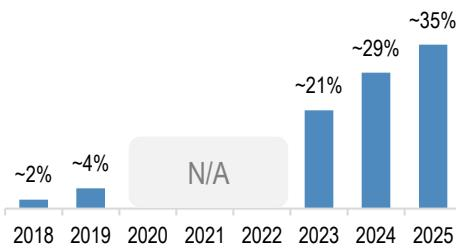

bar

| Year | Value (%) |
|---|---|
| 2018 | ~2 |
| 2019 | ~4 |
| 2020 | N/A |
| 2021 | N/A |
| 2022 | N/A |
| 2023 | ~21 |
| 2024 | ~29 |
| 2025 | ~35 |

Source: Company commentary and JPM.

We believe V/MA tokenized transactions are growing \~30% y/y

We see a path to \~70% tokenized share of transactions, meaning penetration can double.

Includes most of ecommerce + mobile wallet (Apple Pay) share of card-present spending

# Where AC Stands Today & Learnings from Ecommerce

# Agentic Commerce Phases

text_image

We
are
here:

# Phase 1 LLM Chatbot Commerce

Functionally similar to ecommerce with discovery through new channel

- Consumer remains highly engaged (limited agentic autonomy)   
• Single-merchant checkout   
• Simple transaction types

# Phase 2 Agentic Commerce

Largely new type of commerce with agents acting on behalf of consumer

- Agent makes autonomous buying decisions   
• Multi-merchant checkout   
• Complex, multi-part transaction types

Expect progress towards Phase 2 to be measured in years, not months

Source: JPM

% of U.S. Using the Internet and LLMs by Year After “Release”   
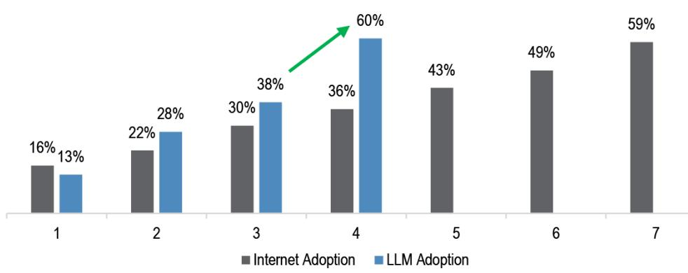

bar

| Category | Internet Adoption (%) | LLM Adoption (%) |
|---|---|---|
| 1 | 16 | 13 |
| 2 | 22 | 28 |
| 3 | 30 | 38 |
| 4 | 36 | 60 |
| 5 | 43 | - |
| 6 | 49 | - |
| 7 | 59 | - |

Note: LLM adoption represents an average of datapoints in each year from four different surveys: Years 1-3 cited by Stanford/Worldbank are Pew Charitable Trusts; Bick, Blandin, Deming; Hartley, Jolevski, Melo, Moore. Year 4 LLM adoption based on findings from JPM AI Adoption Survey. "Release" of internet considered to be 1995 (launch of consumer web browsers); LLM considered to be 2022 with launch of ChatGPT.

Source: World Bank, Stanford, JPM AI Adoption Survey

Ecommerce Share of U.S. Retail   
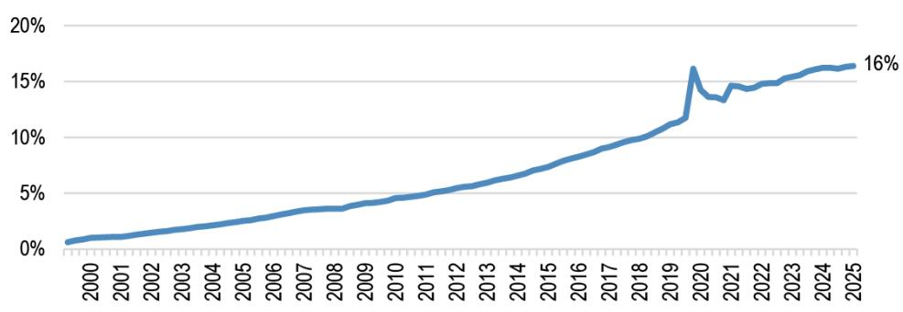

line

| Year | Value |
| ---- | ----- |
| 2025 | 16%   |

Source: U.S. Census Bureau

# Adoption Hurdles Exist on Both the Consumer and Merchant Side

# Consumer Adoption Hurdles

# Consumer Commercial Intent is Low Today

Agentic Commerce commercial intent is closer to (and still below) Social Commerce adoption than Traditional Search

# In Consumer Payments, Trust is Earned, Not Given

We expect consumers to be hesitant to provide sensitive bank account and card information to an LLM, at least initially

JPM AI Adoption Survey
Commercial Usage by Platform   
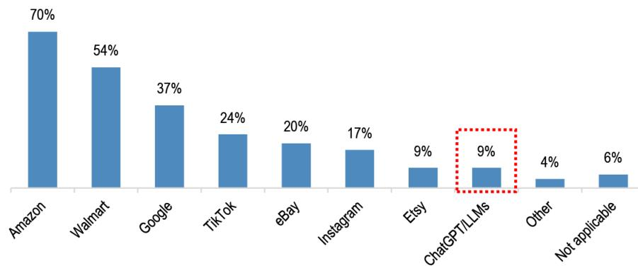

bar

| Company | Market Share (%) |
| :--- | :--- |
| Amazon | 70 |
| Walmart | 54 |
| Google | 37 |
| TikTok | 24 |
| eBay | 20 |
| Instagram | 17 |
| Etsy | 9 |
| ChatGPT/LLMs | 9 |
| Other | 4 |
| Not applicable | 6 |

Source: JPM 2026 AI Adoption Survey   
N=2,524, multi-select   
Note: respondents were asked “in the last 3 months, which platforms have you used to purchase an item?”

# Merchant Adoption Hurdles

# AC Risks Disintermediating Consumer/Merchant Relationship

Merchant connection moves from a human to an agent, potentially erasing hard-earned brand loyalty and goodwill

# Potential for Margin Compression if/when Agents Optimize for Price

Potentially drives merchant competition more towards price and away from brand identity

# Checkout Conversion via LLM is Lower than Traditional Ecomm Today

# Early Case Studies Position LLMs as Discovery Tools, not a Transaction Facilitator

- OpenAI, ChatGPT prioritizing product discovery, not transaction facilitation   
- Walmart pulling back from ChatGPT Instant Checkout; saw conversion rates 3x lower than direct transactions   
- Shopify Agentic Storefronts allow users to discover merchants in ChatGPT; complete purchase via in-app browser, carrying over merchant customizations and pricing logic

Sources:

The Information: OpenAI Scales Back Shopping Plans for ChatGPT

Wired: Why Walmart and OpenAI Are Shaking Up Their Agentic Shopping Deal

Shopify: Agentic Storefronts

JPM

# Survey Insights on Agentic: Familiarity, comfort level among consumers is low, varies by age

Consumer Familiarity with Agentic Commerce   
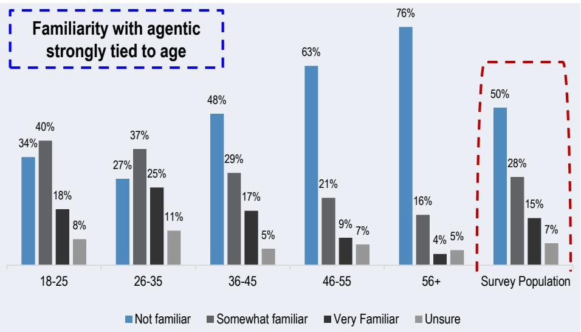

Comfort Level with Agent Making a Large Purchase   
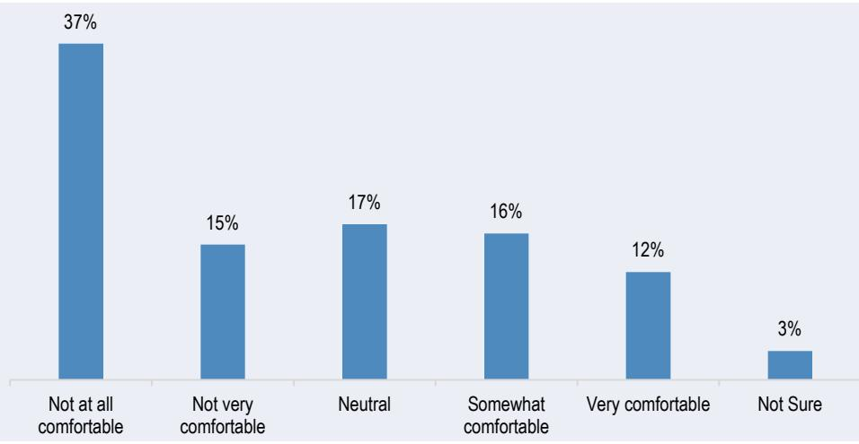

bar

| Category | Percentage (%) |
| :--- | :--- |
| Not at all comfortable | 37 |
| Not very comfortable | 15 |
| Neutral | 17 |
| Somewhat comfortable | 16 |
| Very comfortable | 12 |
| Not Sure | 3 |

Source (all): JPM Online Checkout Survey
Note: 1,486 responses

- Consumer awareness and interest in agentic commerce (agents making purchase on your behalf) is low, and unsurprisingly, those comfortable with agentic commerce skewed younger, and those unfamiliar with agentic commerce skewed older   
Of those surveyed, 50% were unfamiliar with agentic commerce, and only \~30% were at least somewhat comfortable with the idea of an agent making a purchase on their behalf   
Payment wallets have opportunity to leverage trust in an agentic world, with 36% wanting to fund an agentic transaction with PayPal, vs 20% for standard e-comm.

Compare & Contrast: Funding Online Purchases vs. Agentic   
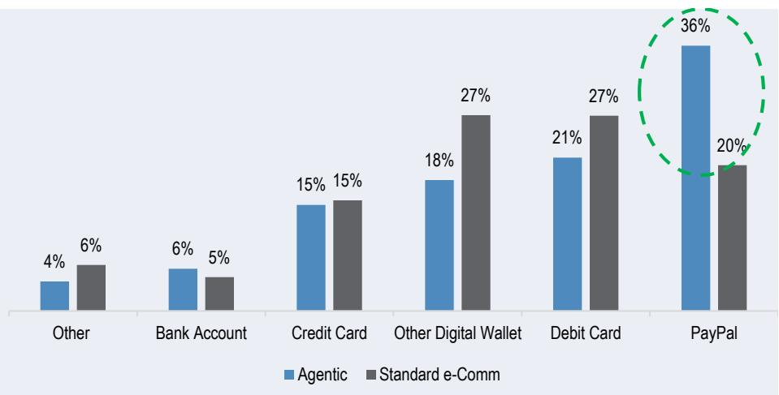

bar

| Category | Agentic (%) | Standard e-Comm (%) |
| :--- | :--- | :--- |
| Other | 4 | 6 |
| Bank Account | 6 | 5 |
| Credit Card | 15 | 15 |
| Other Digital Wallet | 18 | 27 |
| Debit Card | 21 | 27 |
| PayPal | 36 | 20 |
The green dashed circle highlights the “Other” category.

# B2B TAM Remains Large though Difficult to Electronify, with lots of Room for Card (and ePayment) Penetration

Top V/MA Commercial Issuers by Volume (2024) 

<table><tr><td colspan="2"></td><td>Purchase Volume ($B)</td><td>% of V/MA Commercial Volume</td><td>% of V/MA Total Volume</td></tr><tr><td>1</td><td>JPM Chase</td><td>$234</td><td>7.9%</td><td>1.1%</td></tr><tr><td>2</td><td>BofA</td><td>194</td><td>6.6%</td><td>0.9%</td></tr><tr><td>3</td><td>U.S. Bank</td><td>109</td><td>3.7%</td><td>0.5%</td></tr><tr><td>4</td><td>Wells Fargo</td><td>100</td><td>3.4%</td><td>0.5%</td></tr><tr><td>5</td><td>Capital One</td><td>100</td><td>3.4%</td><td>0.5%</td></tr><tr><td>6</td><td>Citi</td><td>89</td><td>3.0%</td><td>0.4%</td></tr><tr><td>7</td><td>Corpay</td><td>55</td><td>1.9%</td><td>0.3%</td></tr><tr><td>8</td><td>Wex</td><td>52</td><td>1.8%</td><td>0.2%</td></tr><tr><td>9</td><td>PNC Bank</td><td>42</td><td>1.4%</td><td>0.2%</td></tr><tr><td>10</td><td>The Bancorp Bank</td><td>39</td><td>1.3%</td><td>0.2%</td></tr><tr><td>11-30</td><td>Next 20 Issuers</td><td>217</td><td>7.4%</td><td>1.0%</td></tr><tr><td colspan="2">Total Top 30 Issuers</td><td>$1,231</td><td>41.7%</td><td>5.7%</td></tr><tr><td colspan="2">V/MA Commercial Volume</td><td>$2,952</td><td>100.0%</td><td>13.8%</td></tr><tr><td colspan="2">V/MA Total Purchase Volume</td><td>$21,424</td><td>7.3x</td><td>100.0%</td></tr></table>

Global Commercial Card Volume (2025) 

<table><tr><td></td><td>Commercial Purchase Volume ($B)</td><td>Global Card-Based TAM Penetration</td></tr><tr><td>Visa</td><td>$1,822</td><td>6%</td></tr><tr><td>Mastercard</td><td>1,396</td><td>5%</td></tr><tr><td>American Express</td><td>542</td><td>2%</td></tr><tr><td>Total Networks</td><td>$3,760</td><td>13%</td></tr><tr><td>Global TAM</td><td>$30,000</td><td>100%</td></tr></table>

Source: Company reports, The Nilson Report and JPM

U.S. Commercial Card Spend Type (2024)   
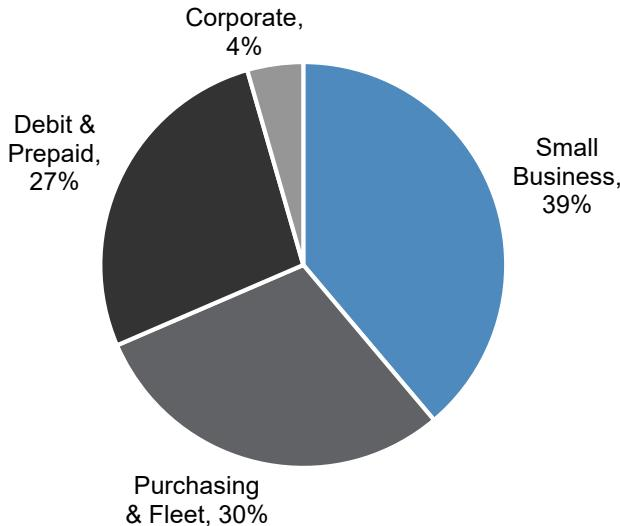

pie

| Category | Percentage (%) |
| :--- | :--- |
| Small Business | 39 |
| Purchasing & Fleet | 30 |
| Debit & Prepaid | 27 |
| Corporate | 4 |

- MA/V Commercial card volume is low teens % of total US network purchase volume; AXP/MA/V collectively penetrated \~12% of the global commercial card TAM, as sized by Visa in 2023.   
- AP providers want to eliminate paper checks and push higher monetized options (virtual card, enhanced ACH, etc.); suppliers conversely often prefer cheaper modalities; to grease adoption we could see AP players:   
- Improving automation/straight-thru process capabilities   
- Offering custom levels of pricing, timing, automation, and/or data attach   
- Developing Buyer-Funded models and working capital optimization solutions, including factoring

# Volume Share Is Shifting Toward Software Distribution

Banks still a large player, but premium growth largely centralized under the tech-enabled model   
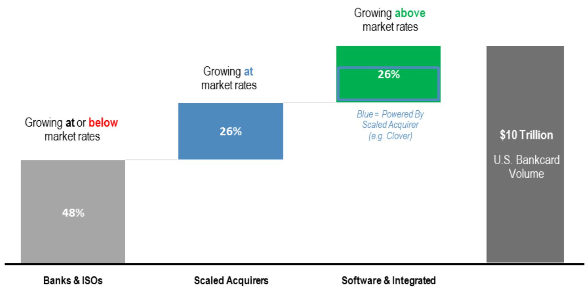

bar_stacked

| Category | Value (%) |
| :--- | :--- |
| Banks & ISOs | 48 |
| Scaled Acquirers | 26 |
| Software & Integrated | 26 |
| Growing above market rates (e.g. Clover) | 26 |
| Growing at or below market rates | 0 |
| $10 Trillion U.S. Bankcard Volume | 0 |

Source: Company reports, Nilson report and JPM estimates
Note: Reflects generalized categories, as agreements between processors, acquirers and service providers vary significantly. Integrated includes volume on marketplaces operating as a merchant of record (Amazon, eBay, etc.), or captured through an integrated POS or software (Clover, Lightspeed, Mindbody, Shopify, Square, etc.), as well as additional integrated volume aggregated at the processing entity (Braintree, Cayan, OpenEdge, Stripe Connect, Transfirst, etc.). Eliminates double counting of categories where possible, for instance Clover volume is included in Integrated and excluded from Scale Processors (Fiserv).

# U.S. Merchant Acquiring Share: In 2025 Fiserv & GPN (with Worldpay) Gained; WFC, CITI Lost

Merchant Acquiring Share (by Volume)   
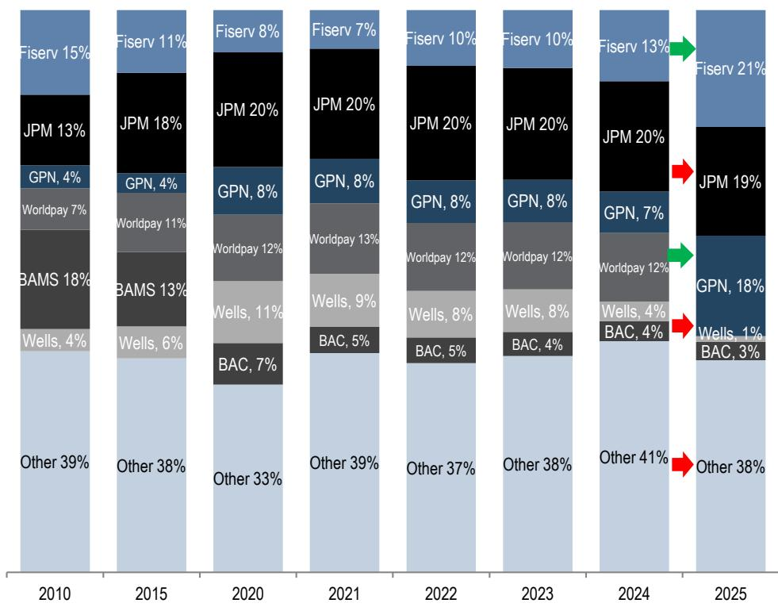

bar_stacked

| Year | Fiserv (%) | JPM (%) | GPN (%) | Worldpay (%) | Wells (%) | BAC (%) |
| :--- | :--- | :--- | :--- | :--- | :--- | :--- |
| 2010 | 15 | 13 | 4 | 7 | 4 | 39 |
| 2015 | 11 | 18 | 4 | 11 | 13 | 6 |
| 2020 | 8 | 20 | 8 | 12 | 11 | 7 |
| 2021 | 7 | 20 | 8 | 13 | 9 | 5 |
| 2022 | 10 | 20 | 8 | 12 | 8 | 5 |
| 2023 | 10 | 20 | 8 | 12 | 8 | 4 |
| 2024 | 13 | 20 | 7 | 12 | 4 | 4 |
| 2025 | 21 | 19 | - | - | - | 38 |
Other: Other 38%; Other: Other 39%. Fiserv: Other; JPM: Wells; JPM: Other; JPM: Wells; JPM: Other; WPS: Wells; WPS: Other; BAC: Wells; BAC: Other; Worldpay: Worldpay; Worldpay: Worldpay; Worldpay: Worldpay; Worldpay: Worldpay; Worldpay: Worldpay; Worldpay: Worldpay; Worldpay: Worldpay; Worldpay: Worldpay; Worldpay: Worldpay; Worldpay: Worldpay; Worldpay: Worldpay; Worldpay: Worldpay; Worldpay: Worldpay; Worldpay: Worldpay; Worldpay: Worldpay; Worldpay: Worldpay; Worldpay: Worldpay; Worldpay, WPS, WPS, BAC, BAC, Other, Other 41%

Source: Company reports, The Nilson Report and JPM estimates   
Note: Volume defined as bankcard (V/MA) volume only

Merchant Acquiring Share (by Transaction)   
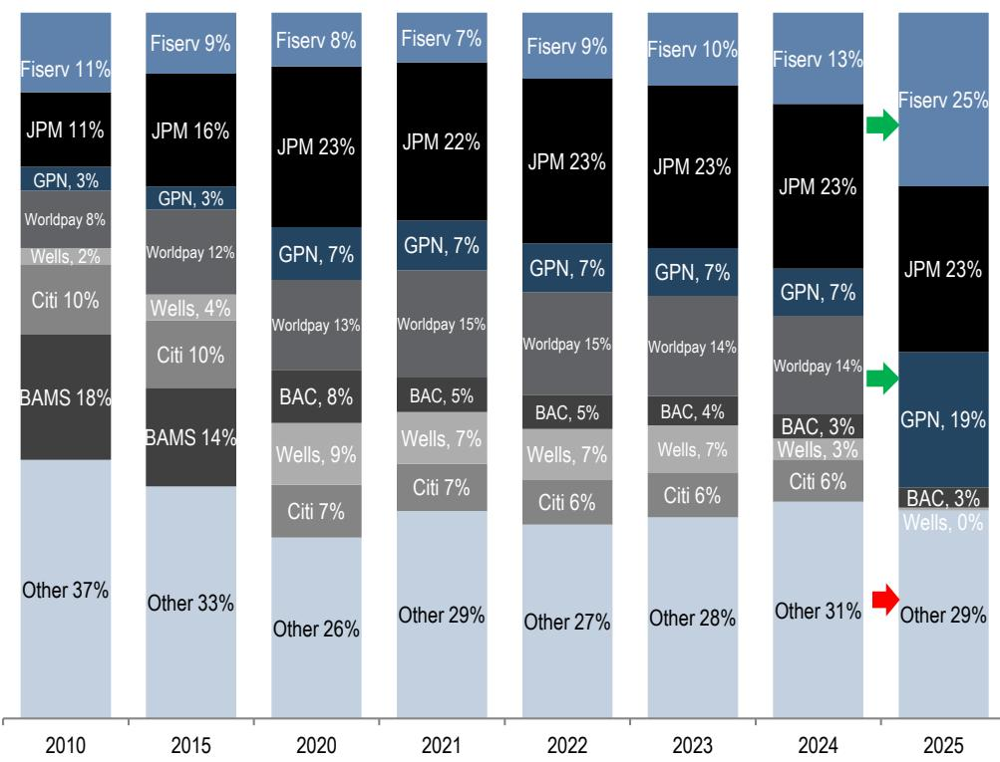

bar_stacked

| Year | Fiserv (%) | JPM (%) | GPN (%) | Wells (%) | Citi (%) |
| :--- | :--- | :--- | :--- | :--- | :--- |
| 2010 | 11 | 11 | 3 | 8 | 10 |
| 2015 | 9 | 16 | 3 | 12 | 10 |
| 2020 | 8 | 23 | 7 | 13 | 10 |
| 2021 | 7 | 22 | 7 | 15 | 29 |
| 2022 | 9 | 23 | 7 | 15 | 27 |
| 2023 | 10 | 23 | 7 | 14 | 28 |
| 2024 | 13 | 23 | 7 | 3 | 31 |
| 2025 | 25 | 23 | - | - | - |
| Other (BAMS) | 37 | - | - | - | - |
| Other (JPM) | - | - | - | - | - |
| Other (GPN) | - | - | - | - | - |
| Other (Wells) | - | - | - | - | - |
| Other (Citi) | - | - | - | - | - |
| Other (BAC) | - | - | - | - | - |
| Other (Wells) | - | - | - | - | - |
| Other (Citi) | - | - | - | - | - |
| Other (BPM) | - | - | - | - | - |
| Other (Other) | - | - | - | - | - |
| Fiserv (Fiserv) + JPM (Fiserv) = 25% (Year) → Fiserv (Year) + JPM (Year) = 23% (Year) → GPN (Year) = 19% (Year) → BAC (Year) = 3% (Year) → Wells (Year) = 0% (Year) → Other (Year) = 29% (Year) — note: The year label is 'Other' in the chart.

Source: Company reports, The Nilson Report and JPM estimates   
Note: Transactions defined as bankcard (V/MA) transactions only

In 2025, Wells Fargo Lost \~3ppts of transaction share, Citi lost 6ppts; Fiserv gained 12ppts.

Since 2010, transaction share has meaningfully consolidated, with FISV, JPM, Worldpay and GPN being large share-gainers.

# Fee Distribution of the 2-3% paid by Merchant

# Function

Acquiring

Gateway

Payment Facilitator/Merchant Acquirer

Merchant Processor

Network

Issuing

Issuer Processor

Issuing Bank

# Fees

\$0 to \$0.10 per transaction

<1 bp to 100bps

<\$0.01 to \$0.10 per transaction

\~15 bps

<\$0.01 to \$0.10 per transaction

\$0.21+5bps to 180 bps+

# \$40 Credit Trans

# \$40 Debit\* Trans

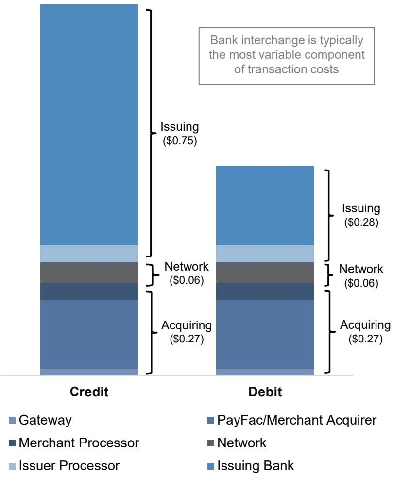

bar_stacked

| Component | Credit | Debit |
| :--- | :--- | :--- |
| Gateway | 0.75 | 0.28 |
| Merchant Processor | 0.06 | 0.06 |
| Issuer Processor | 0.27 | 0.27 |
Bank Interchange is typically the most variable component of transaction costs. The total cost for each component is: 0.75 for Credit, 0.28 for Debit. The other components are: 0.75 for Credit, 0.28 for Debit. The legend identifies components: PayFac/Merchant Acquirer, Network, Issuing Bank, Merchant Processor, Network.

Banking Base to Drive ARPU Expansion 

<table><tr><td rowspan="2" colspan="2">US Market – Providers of Direct to Client Offerings</td><td colspan="8">Consumer (B2C)</td><td colspan="5">Merchant (B2B)</td></tr><tr><td>Bank Account</td><td>Invest</td><td>Debit Card</td><td>Credit Card</td><td>BNPL/ SNPL</td><td>P2P</td><td>Digital Wallet</td><td>Short Duration Liquidity Loan</td><td>Loans</td><td>WC Loan/ Cash Advance</td><td>AR / AP</td><td>Bank Account</td><td>Commercial Card</td></tr><tr><td rowspan="2">Banks</td><td>JPM</td><td>✓</td><td>✓</td><td>✓</td><td>✓</td><td>✓</td><td>✓</td><td></td><td></td><td>✓</td><td>✓</td><td>✓</td><td>✓</td><td>✓</td></tr><tr><td>BAC</td><td>✓</td><td>✓</td><td>✓</td><td>✓</td><td>✓</td><td>✓</td><td></td><td></td><td>✓</td><td>✓</td><td>✓</td><td>✓</td><td>✓</td></tr><tr><td rowspan="9">Fintech</td><td>XYZ</td><td>✓</td><td>✓</td><td>✓</td><td></td><td>✓</td><td>✓</td><td>✓</td><td>✓</td><td>✓</td><td>✓</td><td>✓</td><td>✓</td><td>✓</td></tr><tr><td>PYPL</td><td>✓</td><td>✓</td><td>✓</td><td>✓</td><td>✓</td><td>✓</td><td>✓</td><td></td><td>✓</td><td>✓</td><td>✓</td><td>✓</td><td>✓</td></tr><tr><td>CHYM</td><td>✓</td><td></td><td>✓</td><td></td><td></td><td>✓</td><td></td><td>✓</td><td></td><td></td><td></td><td></td><td></td></tr><tr><td>Stripe</td><td></td><td></td><td></td><td></td><td></td><td></td><td>✓</td><td></td><td>✓</td><td>✓</td><td>✓</td><td>✓</td><td>✓</td></tr><tr><td>AFRM</td><td>✓</td><td></td><td>✓</td><td></td><td>✓</td><td></td><td>✓</td><td></td><td></td><td>✓</td><td></td><td></td><td></td></tr><tr><td>KLAR</td><td>✓</td><td></td><td>✓</td><td></td><td>✓</td><td>✓</td><td>✓</td><td></td><td></td><td></td><td></td><td></td><td></td></tr><tr><td>Revolut</td><td>✓</td><td>✓</td><td>✓</td><td>✓</td><td>✓</td><td>✓</td><td>✓</td><td></td><td></td><td></td><td>✓</td><td>✓</td><td>✓</td></tr><tr><td>RELY</td><td></td><td></td><td>✓</td><td></td><td>✓</td><td>✓</td><td>✓</td><td></td><td></td><td></td><td></td><td></td><td></td></tr><tr><td>WU</td><td></td><td></td><td>✓</td><td></td><td></td><td>✓</td><td>✓</td><td></td><td></td><td></td><td></td><td></td><td></td></tr><tr><td rowspan="3">ISV / Software</td><td>TOST</td><td></td><td></td><td></td><td></td><td></td><td></td><td></td><td></td><td>✓</td><td>✓</td><td>✓</td><td>✓</td><td></td></tr><tr><td>LSPD</td><td></td><td></td><td></td><td></td><td></td><td></td><td></td><td></td><td></td><td>✓</td><td>✓</td><td></td><td></td></tr><tr><td>SHOP</td><td></td><td></td><td></td><td></td><td>✓</td><td></td><td>✓</td><td></td><td>✓</td><td>✓</td><td>✓</td><td>✓</td><td>✓</td></tr><tr><td rowspan="3">B2B Payments</td><td>CPAY</td><td></td><td></td><td></td><td></td><td></td><td></td><td></td><td></td><td></td><td>✓</td><td>✓</td><td>✓</td><td>✓</td></tr><tr><td>BILL</td><td></td><td></td><td></td><td></td><td></td><td></td><td></td><td></td><td></td><td>✓</td><td>✓</td><td></td><td>✓</td></tr><tr><td>WEX</td><td></td><td></td><td></td><td></td><td></td><td></td><td></td><td></td><td></td><td>✓</td><td>✓</td><td></td><td>✓</td></tr><tr><td rowspan="2">Merchant Acquirer / Processor</td><td>FISV</td><td></td><td></td><td></td><td></td><td></td><td></td><td></td><td></td><td></td><td>✓</td><td>✓</td><td></td><td></td></tr><tr><td>GPN</td><td></td><td></td><td></td><td></td><td></td><td></td><td></td><td></td><td>✓</td><td>✓</td><td>✓</td><td></td><td></td></tr></table>

Source: Company reports and JPM   
Note: Credit card refers to unsecured revolving credit card, BNPL includes installment loans, "SNPL" refers to "Send Now, Pay Later"

# Aggregate BNPL Volume Growing >20%; Still a Fraction of U.S. e-comm, Credit Volume

U.S. Payment Spend (2025)   
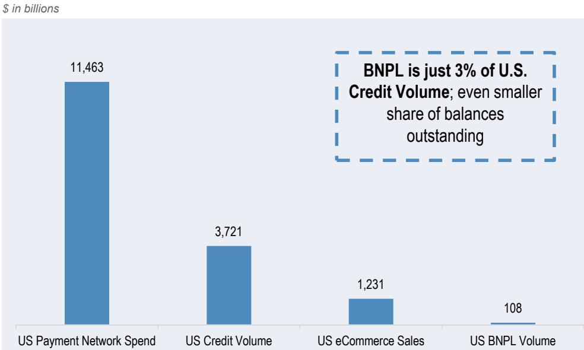

bar

| Category | Value ($ in billions) |
| :--- | :--- |
| US Payment Network Spend | 11,463 |
| US Credit Volume | 3,721 |
| US eCommerce Sales | 1,231 |
| US BNPL Volume | 108 |
BNPL is just 3% of U.S. Credit Volume; even smaller share of balances outstanding

Source: Company reports, CFPB reports, U.S. Census Bureau and JPM estimates.

Global BNPL Purchase Volume by Largest Issuers (2025)   
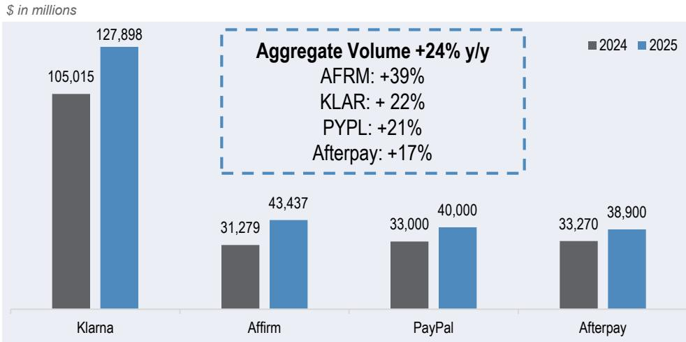

bar

| Company | 2024 ($ in millions) | 2025 ($ in millions) |
| :--- | :--- | :--- |
| Klarna | 105,015 | 127,898 |
| Affirm | 31,279 | 43,437 |
| PayPal | 33,000 | 40,000 |
| Afterpay | 33,270 | 38,900 |
Aggregate Volume +24% y/y
AFRM: +39%
KLAR: +22%
PYPL: +21%
Afterpay: +17%

Source: Company reports and JPM estimates.   
Note: Volume includes both split-pay and installment financing volume.

- BNPL remains <10% of U.S. e-comm and just 3% of U.S. credit volume   
- Per our April '26 survey work, \~46% of participants had used BNPL in the last 3 months, up from \~1/3 $^{rd}$ in '23   
- We estimate 2025 U.S. BNPL volume was \~\$108B, \~9% of U.S. e-Commerce (+ 1pt y/y), dominated by Klarna, Affirm, PayPal and Afterpay.   
- The four largest global providers issued \~\$250B in split pay and installment loans, +24% y/y   
- Klarna remains the largest issuer globally, though Affirm is the fastest growing, and largest issuer in the U.S.

US BNPL Purchase Volume by Largest Issuers (2025)   
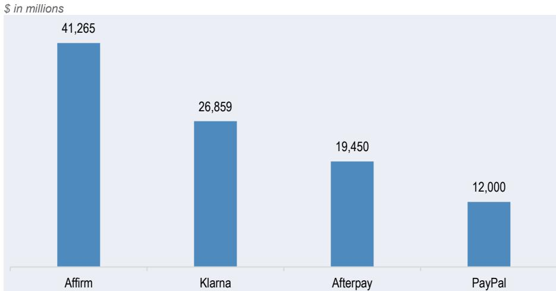

bar

| Company | Value ($ in millions) |
| :--- | :--- |
| Affirm | 41,265 |
| Klarna | 26,859 |
| Afterpay | 19,450 |
| PayPal | 12,000 |

Source: Company reports, JPM calculations   
Note: Affirm estimate assumes 95% of Volume is in the US, Afterpay estimate assumes 50% of volume is in the US, PayPal estimate assumes 30% of volume is in the US

# International Growth Still Attractive and Outperforming Domestic

Bankcard Regional Purchase Volume Growth Rates – 2025   
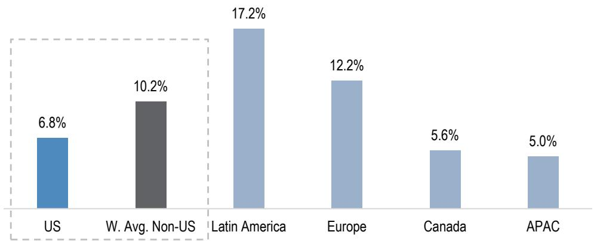

bar

| Region | Value (%) |
| :--- | :--- |
| US | 6.8 |
| W. Avg. Non-US | 10.2 |
| Latin America | 17.2 |
| Europe | 12.2 |
| Canada | 5.6 |
| APAC | 5.0 |

Source: Company reports and JPM.

POS Terminal Shipment Growth (5-year CAGR)   
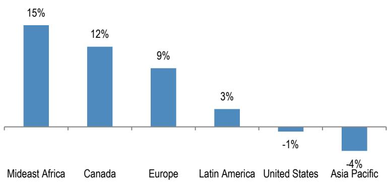

bar

| Region | Value (%) |
| :--- | :--- |
| Mideast Africa | 15 |
| Canada | 12 |
| Europe | 9 |
| Latin America | 3 |
| United States | -1 |
| Asia Pacific | -4 |

Source: The Nilson Report

Bank Card Purchase Volume Penetration Rates (2024; GDP by Region)   
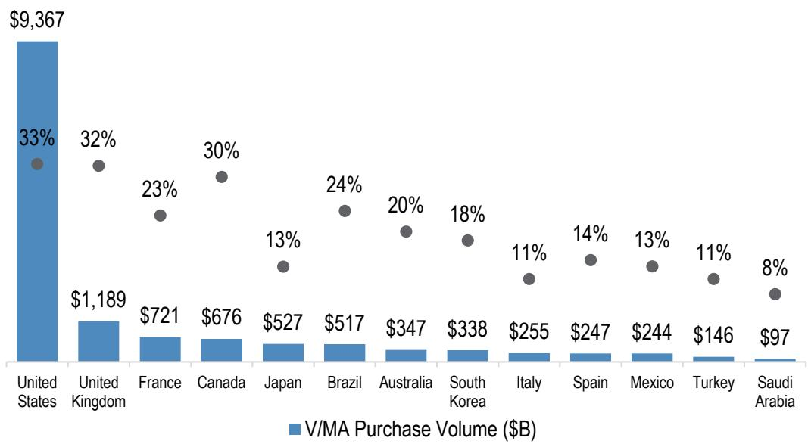

bar_line

| Country | V/MA Purchase Volume ($B) | Percentage (%) |
| :--- | :--- | :--- |
| United States | 9,367 | 33 |
| United Kingdom | 1,189 | 32 |
| France | 721 | 23 |
| Canada | 676 | 30 |
| Japan | 527 | 13 |
| Brazil | 517 | 24 |
| Australia | 347 | 20 |
| South Korea | 338 | 18 |
| Italy | 255 | 11 |
| Spain | 247 | 14 |
| Mexico | 244 | 13 |
| Turkey | 146 | 11 |
| Saudi Arabia | 97 | 8 |

Source: Company reports, The Nilson report, The World Bank and JPM estimates.
Note: Country-specific bank card volume estimated using data from each region's top 50 issuers

- Non-US volume outgrew domestic volume in 2024 by \~3ppts, led by LATAM (on a smaller base).   
- POS terminal shipments (over last 5 years) directionally indicative of volume growth – slowest growth in US/APAC.   
• See a significant card penetration opportunity in various LATAM, European and APAC countries longer term.

Mastercard Volume Mix   
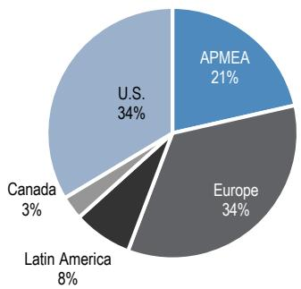

pie

| Region | Percentage (%) |
| :--- | :--- |
| U.S. | 34 |
| Europe | 34 |
| Latin America | 8 |
| Canada | 3 |
APMEA | 21 |

Source: Company reports.
Note: Reflects CY25

Visa Volume Mix   
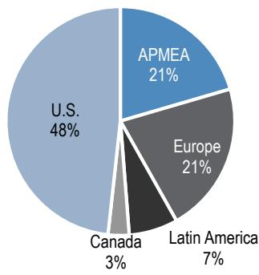

pie

| Region | Percentage (%) |
| :--- | :--- |
| U.S. | 48 |
| APMEA | 21 |
| Europe | 21 |
| Latin America | 7 |
| Canada | 3 |

JPM

# Comp Sheet

PAYMENTS, PROCESSORS & IT SERVICES COMPARABLE COMPANY ANALYSIS | TEAM TIEN-TSIN HUANG | JPM 

<table><tr><td rowspan="2"></td><td rowspan="2">Ticker</td><td rowspan="2">JPM Rating</td><td rowspan="2">JPM Target</td><td rowspan="2">Today&#x27;s Price</td><td rowspan="2">Market Cap</td><td rowspan="2">Last Week Return</td><td rowspan="2">Last Month Return</td><td rowspan="2">Yr-to-Date Return</td><td rowspan="2">Last 12M Return</td><td colspan="2">FCF yield</td><td colspan="2">Price / adj EPS</td><td colspan="2">EV / adj EBITDA</td><td colspan="2">EV / gross profit</td><td colspan="2">EV / sales</td></tr><tr><td>NTM E</td><td>2027E</td><td>NTM E</td><td>2027E</td><td>NTM E</td><td>2027E</td><td>NTM E</td><td>2027E</td><td>NTM E</td><td>2027E</td></tr><tr><td colspan="20">Payments &amp; FinTech</td></tr><tr><td>Visa</td><td>V</td><td>OW</td><td>$400.00</td><td>$322.50</td><td>$580,250</td><td>0.4%</td><td>3.6%</td><td>(8.0%)</td><td>(9.5%)</td><td>4.6%</td><td>5.0%</td><td>22.9x</td><td>20.9x</td><td>17.4x</td><td>16.2x</td><td>12.3x</td><td>11.5x</td><td>12.3x</td><td>11.5x</td></tr><tr><td>Mastercard</td><td>MA</td><td>OW</td><td>$655.00</td><td>$489.90</td><td>$433,000</td><td>(2.2%)</td><td>(4.5%)</td><td>(14.2%)</td><td>(14.5%)</td><td>4.0%</td><td>4.3%</td><td>24.3x</td><td>21.8x</td><td>18.5x</td><td>17.0x</td><td>11.7x</td><td>10.8x</td><td>11.7x</td><td>10.8x</td></tr><tr><td>Block</td><td>XYZ</td><td>OW</td><td>$100.00</td><td>$71.50</td><td>$42,570</td><td>2.0%</td><td>8.1%</td><td>9.9%</td><td>22.3%</td><td>7.0%</td><td>8.9%</td><td>16.6x</td><td>13.2x</td><td>8.7x</td><td>7.5x</td><td>3.4x</td><td>3.0x</td><td>1.6x</td><td>1.5x</td></tr><tr><td>PayPal</td><td>PYPL</td><td>N</td><td>$46.00</td><td>$45.00</td><td>$39,730</td><td>(2.6%)</td><td>(6.1%)</td><td>(22.9%)</td><td>(38.0%)</td><td>14.9%</td><td>15.6%</td><td>8.3x</td><td>7.9x</td><td>6.4x</td><td>6.5x</td><td>2.8x</td><td>2.8x</td><td>1.2x</td><td>1.2x</td></tr><tr><td>Affirm</td><td>AFRM</td><td>OW</td><td>$80.00</td><td>$67.60</td><td>$22,640</td><td>0.3%</td><td>21.0%</td><td>(9.2%)</td><td>19.5%</td><td>10.2%</td><td>11.5%</td><td>18.2x</td><td>16.2x</td><td>14.2x</td><td>12.0x</td><td>10.6x</td><td>9.1x</td><td>5.0x</td><td>4.3x</td></tr><tr><td>Corpay</td><td>CPAY</td><td>OW</td><td>$400.00</td><td>$329.20</td><td>$21,520</td><td>7.7%</td><td>2.7%</td><td>9.4%</td><td>(6.7%)</td><td>8.6%</td><td>9.8%</td><td>11.7x</td><td>10.4x</td><td>9.2x</td><td>8.4x</td><td>6.3x</td><td>5.9x</td><td>5.0x</td><td>4.7x</td></tr><tr><td>Toast</td><td>TOST</td><td>OW</td><td>$38.00</td><td>$23.10</td><td>$13,380</td><td>(21.5%)</td><td>(14.9%)</td><td>(35.0%)</td><td>(48.8%)</td><td>5.4%</td><td>7.4%</td><td>17.0x</td><td>13.9x</td><td>14.7x</td><td>12.1x</td><td>6.0x</td><td>5.2x</td><td>1.6x</td><td>1.4x</td></tr><tr><td>Klarna</td><td>KLAR</td><td>OW</td><td>$20.00</td><td>$16.50</td><td>$11,620</td><td>11.9%</td><td>15.5%</td><td>(43.0%)</td><td>NA</td><td>6.4%</td><td>3.3%</td><td>NA</td><td>32.6x</td><td>21.9x</td><td>13.5x</td><td>5.4x</td><td>4.4x</td><td>2.0x</td><td>1.7x</td></tr><tr><td>Chime</td><td>CHYM</td><td>OW</td><td>$34.00</td><td>$17.90</td><td>$6,810</td><td>(5.9%)</td><td>(19.7%)</td><td>(29.0%)</td><td>NA</td><td>6.0%</td><td>8.0%</td><td>65.5x</td><td>30.4x</td><td>13.7x</td><td>10.4x</td><td>3.1x</td><td>2.7x</td><td>2.2x</td><td>2.0x</td></tr><tr><td>Remitly</td><td>RELY</td><td>OW</td><td>$30.00</td><td>$23.30</td><td>$4,910</td><td>2.3%</td><td>30.1%</td><td>68.9%</td><td>0.8%</td><td>7.5%</td><td>8.3%</td><td>16.8x</td><td>15.6x</td><td>10.6x</td><td>9.3x</td><td>3.1x</td><td>2.8x</td><td>2.1x</td><td>1.8x</td></tr><tr><td>WEX</td><td>WEX</td><td>N</td><td>$155.00</td><td>$134.00</td><td>$4,650</td><td>(7.1%)</td><td>(20.2%)</td><td>(10.0%)</td><td>(2.6%)</td><td>15.8%</td><td>14.4%</td><td>7.4x</td><td>6.9x</td><td>6.4x</td><td>6.0x</td><td>4.6x</td><td>4.5x</td><td>2.8x</td><td>2.7x</td></tr><tr><td>Bill</td><td>BILL</td><td>OW</td><td>$60.00</td><td>$39.50</td><td>$3,930</td><td>4.9%</td><td>6.7%</td><td>(27.6%)</td><td>(17.8%)</td><td>11.7%</td><td>13.4%</td><td>14.9x</td><td>12.7x</td><td>13.3x</td><td>11.6x</td><td>3.1x</td><td>2.8x</td><td>2.6x</td><td>2.3x</td></tr><tr><td>Paymentus</td><td>PAY</td><td>N</td><td>$27.00</td><td>$24.80</td><td>$3,130</td><td>(10.9%)</td><td>(3.5%)</td><td>(21.4%)</td><td>(35.2%)</td><td>3.8%</td><td>4.3%</td><td>27.8x</td><td>22.5x</td><td>15.3x</td><td>12.4x</td><td>7.0x</td><td>6.2x</td><td>1.9x</td><td>1.6x</td></tr><tr><td>Flywire</td><td>FLYW</td><td>UW</td><td>$14.00</td><td>$16.40</td><td>$2,020</td><td>(7.8%)</td><td>33.7%</td><td>15.5%</td><td>47.2%</td><td>8.3%</td><td>7.7%</td><td>12.9x</td><td>11.2x</td><td>9.8x</td><td>8.3x</td><td>3.8x</td><td>3.5x</td><td>2.3x</td><td>2.0x</td></tr><tr><td>Marqeta</td><td>MQ</td><td>OW</td><td>$6.00</td><td>$3.90</td><td>$1,640</td><td>(7.9%)</td><td>(4.9%)</td><td>(18.7%)</td><td>(21.2%)</td><td>11.7%</td><td>18.4%</td><td>83.2x</td><td>34.7x</td><td>6.6x</td><td>5.2x</td><td>1.9x</td><td>1.7x</td><td>1.3x</td><td>1.1x</td></tr><tr><td>Lightspeed</td><td>LSPD</td><td>UW</td><td>$14.00</td><td>$8.80</td><td>$1,230</td><td>(9.9%)</td><td>(2.8%)</td><td>(27.1%)</td><td>(18.7%)</td><td>NA</td><td>NA</td><td>NA</td><td>NA</td><td>15.1x</td><td>10.8x</td><td>2.2x</td><td>1.9x</td><td>1.0x</td><td>0.9x</td></tr><tr><td>Median</td><td></td><td></td><td></td><td></td><td></td><td>(2.4%)</td><td>(0.0%)</td><td>(16.5%)</td><td>(12.0%)</td><td>7.5%</td><td>8.3%</td><td>16.9x</td><td>15.6x</td><td>13.5x</td><td>10.6x</td><td>4.2x</td><td>3.9x</td><td>2.2x</td><td>1.9x</td></tr><tr><td>Cap-weighted average</td><td></td><td></td><td></td><td></td><td></td><td>(0.7%)</td><td>0.6%</td><td>(10.4%)</td><td>(10.8%)</td><td>5.1%</td><td>5.5%</td><td>22.3x</td><td>20.2x</td><td>16.8x</td><td>15.4x</td><td>10.9x</td><td>10.2x</td><td>10.6x</td><td>9.8x</td></tr><tr><td colspan="20">Payroll &amp; Processors</td></tr><tr><td>ADP</td><td>ADP</td><td>UW</td><td>$275.00</td><td>$208.40</td><td>$83,290</td><td>(2.7%)</td><td>6.8%</td><td>(19.0%)</td><td>(32.7%)</td><td>12.0%</td><td>11.2%</td><td>17.3x</td><td>16.2x</td><td>12.5x</td><td>12.0x</td><td>6.9x</td><td>6.6x</td><td>3.7x</td><td>3.6x</td></tr><tr><td>Paychex</td><td>PAYX</td><td>UW</td><td>$100.00</td><td>$88.80</td><td>$31,830</td><td>(5.8%)</td><td>(0.0%)</td><td>(20.8%)</td><td>(41.6%)</td><td>7.7%</td><td>8.5%</td><td>15.2x</td><td>14.3x</td><td>10.3x</td><td>9.9x</td><td>6.9x</td><td>6.6x</td><td>5.1x</td><td>4.9x</td></tr><tr><td>Fiserv</td><td>FISV</td><td>N</td><td>$75.00</td><td>$53.50</td><td>$28,510</td><td>(5.9%)</td><td>(9.4%)</td><td>(20.4%)</td><td>(71.8%)</td><td>13.9%</td><td>14.8%</td><td>6.6x</td><td>6.1x</td><td>6.7x</td><td>6.5x</td><td>5.1x</td><td>4.9x</td><td>2.8x</td><td>2.7x</td></tr><tr><td>FIS</td><td>FIS</td><td>OW</td><td>$60.00</td><td>$41.80</td><td>$21,610</td><td>(11.5%)</td><td>(11.0%)</td><td>(37.1%)</td><td>(46.4%)</td><td>10.6%</td><td>13.1%</td><td>6.5x</td><td>6.0x</td><td>6.4x</td><td>6.1x</td><td>7.4x</td><td>7.1x</td><td>2.7x</td><td>2.6x</td></tr><tr><td>Global Payments</td><td>GPN</td><td>N</td><td>$80.00</td><td>$67.30</td><td>$18,420</td><td>(4.0%)</td><td>(1.9%)</td><td>(13.0%)</td><td>(19.0%)</td><td>19.2%</td><td>19.7%</td><td>4.7x</td><td>4.1x</td><td>6.1x</td><td>5.7x</td><td>3.6x</td><td>3.4x</td><td>2.8x</td><td>2.7x</td></tr><tr><td>Broadridge</td><td>BR</td><td>N</td><td>$179.00</td><td>$143.40</td><td>$16,580</td><td>(6.2%)</td><td>(9.6%)</td><td>(35.8%)</td><td>(39.6%)</td><td>6.6%</td><td>7.2%</td><td>14.3x</td><td>13.6x</td><td>9.4x</td><td>9.2x</td><td>8.1x</td><td>7.9x</td><td>2.6x</td><td>2.5x</td></tr><tr><td>Western Union</td><td>WU</td><td>UW</td><td>$9.00</td><td>$8.30</td><td>$2,600</td><td>(8.2%)</td><td>(9.3%)</td><td>(10.7%)</td><td>(13.9%)</td><td>23.2%</td><td>20.1%</td><td>4.7x</td><td>4.3x</td><td>4.3x</td><td>4.0x</td><td>2.8x</td><td>2.6x</td><td>1.0x</td><td>0.9x</td></tr><tr><td>TriNet</td><td>TNET</td><td>UW</td><td>$45.00</td><td>$39.60</td><td>$1,820</td><td>(7.5%)</td><td>5.1%</td><td>(33.0%)</td><td>(52.7%)</td><td>49.8%</td><td>19.7%</td><td>13.7x</td><td>9.6x</td><td>6.2x</td><td>5.4x</td><td>3.0x</td><td>2.8x</td><td>0.5x</td><td>0.5x</td></tr><tr><td>Insperity</td><td>NSP</td><td>UW</td><td>$33.00</td><td>$28.90</td><td>$1,100</td><td>(11.5%)</td><td>4.9%</td><td>(25.3%)</td><td>(58.6%)</td><td>35.1%</td><td>22.5%</td><td>12.9x</td><td>9.7x</td><td>4.7x</td><td>3.7x</td><td>1.1x</td><td>0.9x</td><td>0.1x</td><td>0.1x</td></tr><tr><td>Median</td><td></td><td></td><td></td><td></td><td></td><td>(6.2%)</td><td>(1.9%)</td><td>(20.8%)</td><td>(41.6%)</td><td>13.9%</td><td>14.8%</td><td>12.9x</td><td>9.6x</td><td>6.4x</td><td>6.1x</td><td>5.1x</td><td>4.9x</td><td>2.7x</td><td>2.6x</td></tr><tr><td>Cap-weighted average</td><td></td><td></td><td></td><td></td><td></td><td>(5.1%)</td><td>(0.7%)</td><td>(22.2%)</td><td>(40.3%)</td><td>12.3%</td><td>12.2%</td><td>12.8x</td><td>11.9x</td><td>9.7x</td><td>9.3x</td><td>6.4x</td><td>6.1x</td><td>3.4x</td><td>3.3x</td></tr><tr><td colspan="20">IT &amp; BPO Services</td></tr><tr><td>Accenture</td><td>ACN</td><td>OW</td><td>$247.00</td><td>$164.00</td><td>$100,840</td><td>(9.0%)</td><td>(13.9%)</td><td>(38.9%)</td><td>(48.8%)</td><td>9.7%</td><td>11.9%</td><td>11.5x</td><td>10.6x</td><td>6.5x</td><td>6.2x</td><td>3.9x</td><td>3.8x</td><td>1.3x</td><td>1.2x</td></tr><tr><td>Cognizant</td><td>CTSH</td><td>OW</td><td>$74.00</td><td>$46.10</td><td>$21,820</td><td>(11.3%)</td><td>(23.3%)</td><td>(44.5%)</td><td>(42.7%)</td><td>10.9%</td><td>12.1%</td><td>8.0x</td><td>7.5x</td><td>4.9x</td><td>4.7x</td><td>2.8x</td><td>2.7x</td><td>0.9x</td><td>0.9x</td></tr><tr><td>Genpact</td><td>G</td><td>N</td><td>$40.00</td><td>$28.90</td><td>$4,910</td><td>(16.1%)</td><td>(18.5%)</td><td>(38.1%)</td><td>(33.1%)</td><td>17.3%</td><td>17.5%</td><td>7.1x</td><td>6.5x</td><td>6.2x</td><td>5.5x</td><td>2.9x</td><td>2.8x</td><td>1.1x</td><td>1.0x</td></tr><tr><td>EPAM</td><td>EPAM</td><td>OW</td><td>$142.00</td><td>$89.70</td><td>$4,690</td><td>(14.0%)</td><td>(29.6%)</td><td>(56.2%)</td><td>(51.4%)</td><td>15.0%</td><td>14.1%</td><td>6.7x</td><td>6.3x</td><td>4.0x</td><td>3.8x</td><td>2.2x</td><td>2.1x</td><td>0.7x</td><td>0.6x</td></tr><tr><td>EXL Services</td><td>EXLS</td><td>OW</td><td>$43.00</td><td>$27.00</td><td>$4,120</td><td>(14.0%)</td><td>(12.3%)</td><td>(36.5%)</td><td>(41.0%)</td><td>6.2%</td><td>7.9%</td><td>12.0x</td><td>10.7x</td><td>8.7x</td><td>7.9x</td><td>4.7x</td><td>NA</td><td>1.9x</td><td>1.7x</td></tr><tr><td>Kyndryl</td><td>KD</td><td>UW</td><td>$13.00</td><td>$11.10</td><td>$2,510</td><td>(11.9%)</td><td>(15.4%)</td><td>(58.1%)</td><td>(73.0%)</td><td>19.4%</td><td>24.5%</td><td>6.1x</td><td>4.6x</td><td>NA</td><td>NA</td><td>NA</td><td>NA</td><td>NA</td><td>NA</td></tr><tr><td>Globant</td><td>GLOB</td><td>N</td><td>$62.00</td><td>$34.10</td><td>$1,470</td><td>(16.8%)</td><td>(26.4%)</td><td>(47.9%)</td><td>(74.5%)</td><td>12.2%</td><td>11.9%</td><td>5.2x</td><td>5.0x</td><td>3.1x</td><td>3.0x</td><td>1.5x</td><td>1.5x</td><td>0.6x</td><td>0.6x</td></tr><tr><td>DXC</td><td>DXC</td><td>UW</td><td>$12.00</td><td>$8.20</td><td>$1,340</td><td>(31.6%)</td><td>(33.5%)</td><td>(43.9%)</td><td>(50.4%)</td><td>29.6%</td><td>42.7%</td><td>3.2x</td><td>2.9x</td><td>1.6x</td><td>1.6x</td><td>0.9x</td><td>0.9x</td><td>0.2x</td><td>0.2x</td></tr><tr><td>Grid Dynamics</td><td>GDYN</td><td>OW</td><td>$7.00</td><td>$6.50</td><td>$540</td><td>(7.4%)</td><td>16.4%</td><td>(28.3%)</td><td>(54.5%)</td><td>6.1%</td><td>6.5%</td><td>14.6x</td><td>13.2x</td><td>3.4x</td><td>3.0x</td><td>1.3x</td><td>1.2x</td><td>0.5x</td><td>0.4x</td></tr><tr><td>TaskUs</td><td>TASK</td><td>N</td><td>$9.00</td><td>$5.50</td><td>$510</td><td>(13.4%)</td><td>(18.7%)</td><td>(53.2%)</td><td>(67.0%)</td><td>6.1%</td><td>18.1%</td><td>3.7x</td><td>3.4x</td><td>3.6x</td><td>3.3x</td><td>1.9x</td><td>1.8x</td><td>0.7x</td><td>0.6x</td></tr><tr><td>CI&amp;T</td><td>CINT</td><td>OW</td><td>$6.00</td><td>$3.70</td><td>$470</td><td>(8.5%)</td><td>(22.3%)</td><td>(10.3%)</td><td>(45.1%)</td><td>10.8%</td><td>12.0%</td><td>8.4x</td><td>7.3x</td><td>4.6x</td><td>4.1x</td><td>2.5x</td><td>2.3x</td><td>0.8x</td><td>0.8x</td></tr><tr><td>Endava</td><td>DAVA</td><td>N</td><td>$9.00</td><td>$3.60</td><td>$200</td><td>(12.6%)</td><td>(18.5%)</td><td>(42.7%)</td><td>(76.9%)</td><td>23.1%</td><td>45.4%</td><td>2.4x</td><td>2.1x</td><td>2.6x</td><td>2.3x</td><td>1.2x</td><td>1.1x</td><td>0.4x</td><td>0.3x</td></tr><tr><td>Median</td><td></td><td></td><td></td><td></td><td></td><td>(13.0%)</td><td>(18.6%)</td><td>(43.3%)</td><td>(50.9%)</td><td>11.6%</td><td>13.1%</td><td>6.9x</td><td>6.4x</td><td>4.0x</td><td>3.8x</td><td>2.2x</td><td>1.9x</td><td>0.7x</td><td>0.6x</td></tr><tr><td>Cap-weighted average</td><td></td><td></td><td></td><td></td><td></td><td>(10.3%)</td><td>(16.2%)</td><td>(40.6%)</td><td>(48.0%)</td><td>10.6%</td><td>12.6%</td><td>10.4x</td><td>9.6x</td><td>6.0x</td><td>5.7x</td><td>3.5x</td><td>3.2x</td><td>1.2x</td><td>1.1x</td></tr><tr><td>Total median</td><td></td><td></td><td></td><td></td><td></td><td>(7.8%)</td><td>(6.1%)</td><td>(27.1%)</td><td>(39.6%)</td><td>10.7%</td><td>11.9%</td><td>12.0x</td><td>10.5x</td><td>6.6x</td><td>6.5x</td><td>3.2x</td><td>2.8x</td><td>1.7x</td><td>1.6x</td></tr><tr><td>Total cap-weighted average</td><td></td><td></td><td></td><td></td><td></td><td>(2.2%)</td><td>(1.1%)</td><td>(14.8%)</td><td>(18.2%)</td><td>6.6%</td><td>7.1%</td><td>19.9x</td><td>18.1x</td><td>14.8x</td><td>13.7x</td><td>9.6x</td><td>9.0x</td><td>8.7x</td><td>8.1x</td></tr></table>

Source: Bloomberg Finance L.P., Company Reports, and JPM Estimates.   
Note: Market data as of 5/14/2026. V and MA multiples reflect net revenue for both revenue and gross profit. Revenue growth shown FX-neutral organic where possible. PayPal revenue growth shows gross profit growth and margins show adj EBIT as a percent of gross profit. Block revenue shows revenue ex-bitcoin, revenue growth shows revenue growth ex-bitcoin, and margins show adj EBIT as a percent of gross profit. Toast margins show adj EBIT against revenue less transaction revenue cost of sales (aka ex-interchange).

# We Expect Consolidation to Continue; Additional Large Scale Is Unlikely

Select Merchant Acquiring M&A Since 2020 

<table><tr><td>Company</td><td>Target</td><td>Date</td><td>Amount</td><td colspan="2">Strategy</td></tr><tr><td>Global Payments</td><td>Worldpay</td><td>Apr 2025</td><td>$24.3B</td><td>Capability</td><td>Scale</td></tr><tr><td>Shift4</td><td>Global Blue</td><td>Feb 2025</td><td>$2.5B</td><td>Capability</td><td>Scale</td></tr><tr><td>Stripe</td><td>Bridge</td><td>Oct 2024</td><td>$1.1B</td><td colspan="2">Capability/Product</td></tr><tr><td>Shift4</td><td>Revel</td><td>Oct 2024</td><td>$100M</td><td colspan="2">Scale</td></tr><tr><td>Paylocity</td><td>Airbase</td><td>Sep 2024</td><td>$325M</td><td colspan="2">Capability/Product</td></tr><tr><td>Advent</td><td>Nuvei</td><td>Apr 2024</td><td>$6.5B</td><td colspan="2">Financial</td></tr><tr><td>Vista Equity Partners</td><td>EngageSmart</td><td>Oct 2023</td><td>$4B</td><td colspan="2">Financial</td></tr><tr><td>Shift4</td><td>SpotOn</td><td>Oct 2023</td><td>$100M</td><td colspan="2">Capability/Product</td></tr><tr><td>GTCR</td><td>Worldpay</td><td>Jul 2023</td><td>$18.5B</td><td colspan="2">Financial</td></tr><tr><td>Nuvei</td><td>Paya</td><td>Jan 2023</td><td>$1.3B</td><td>Capability</td><td>Scale</td></tr><tr><td>Global Payments</td><td>EVO Payments</td><td>Aug 2022</td><td>$4B</td><td>Geography</td><td>Capability</td></tr><tr><td>FIS</td><td>Payrix</td><td>Feb 2022</td><td>$767M</td><td colspan="2">Capability/Product</td></tr><tr><td>Fiserv</td><td>Finxact</td><td>Feb 2022</td><td>$650M</td><td colspan="2">Capability/Product</td></tr><tr><td>Block</td><td>Afterpay</td><td>Jan 2022</td><td>$29B</td><td>Capability</td><td>Geography</td></tr><tr><td>JPM Chase</td><td>Viva Wallet</td><td>Jan 2022</td><td>&gt;$800M</td><td>Geography</td><td>Capability</td></tr><tr><td>Stripe</td><td>BBPOS</td><td>Jan 2022</td><td>NA</td><td>Distribution</td><td>Capability</td></tr><tr><td>Fiserv</td><td>BentoBox</td><td>Oct 2021</td><td>$317M</td><td colspan="2">Capability/Product</td></tr><tr><td>JPM Chase</td><td>Volkswagen Fin. Services</td><td>Sep 2021</td><td>75% equity stake</td><td colspan="2">Capability/Product</td></tr><tr><td>Global Payments</td><td>MineralTree</td><td>Sep 2021</td><td>$500M</td><td>Capability</td><td>Distribution</td></tr><tr><td>Repay</td><td>BillingTree</td><td>May 2021</td><td>$503M</td><td>Capability</td><td>Scale</td></tr><tr><td>Lightspeed</td><td>Vend</td><td>Mar 2021</td><td>$350M</td><td>Geography</td><td>Scale</td></tr><tr><td>GoDaddy</td><td>Poynt</td><td>Dec 2020</td><td>$320M</td><td colspan="2">Capability/Product</td></tr><tr><td>Lightspeed</td><td>ShopKeep, Upserve</td><td>Dec 2020</td><td>$440M, $390M</td><td>Capability</td><td>Scale</td></tr><tr><td>Block</td><td>Credit Karma Tax</td><td>Nov 2020</td><td>$50M</td><td colspan="2">Product</td></tr></table>

Source: Company reports, Bloomberg Finance L.P. and JPM   
Note: Date represents date announced

# Consolidation Has Separated Processing Stacks – Single vs. Many

Select Examples of Consolidation by Capability Type   
  
Source: Company reports and JPM   
Note: Subsequent (or planned) divestitures shown in red. Announced but not yet closed acquisitions shown in green.

# Disclosures

Analyst Certification: The Research Analyst(s) denoted by an “AC” on the cover of this report certifies (or, where multiple Research Analysts are primarily responsible for this report, the Research Analyst denoted by an “AC” on the cover or within the document individually certifies, with respect to each security or issuer that the Research Analyst covers in this research) that: (1) all of the views expressed in this report accurately reflect the Research Analyst’s personal views about any and all of the subject securities or issuers; and (2) no part of any of the Research Analyst's compensation was, is, or will be directly or indirectly related to the specific recommendations or views expressed by the Research Analyst(s) in this report. For all Korea-based Research Analysts listed on the front cover, if applicable, they also certify, as per KOFIA requirements, that the Research Analyst’s analysis was made in good faith and that the views reflect the Research Analyst’s own opinion, without undue influence or intervention.

All authors named within this report are Research Analysts who produce independent research unless otherwise specified. In Europe, Sector Specialists (Sales and Trading) may be shown on this report as contacts but are not authors of the report or part of the Research Department.

# Important Disclosures

Company-Specific Disclosures: JPM does and seeks to do business with companies covered in its research reports. As a result, investors should be aware that the firm may have a conflict of interest that could affect the objectivity of this report. Investors should consider this report as only a single factor in making their investment decision. Important disclosures, including price charts and credit opinion history tables, are available for compendium reports and all JPM-covered companies, and certain non-covered companies, by visiting https://www.jpmm.com/research/disclosures, calling 1-800-477-0406, or e-mailing research.disclosure.inquiries@JPM.com with your request.

# Explanation of Equity Research Ratings, Designations and Analyst(s) Coverage Universe:

JPM uses the following rating system: Overweight (over the duration of the price target indicated in this report, we expect this stock will outperform the average total return of the stocks in the Research Analyst's, or the Research Analyst's team's, coverage universe); Neutral (over the duration of the price target indicated in this report, we expect this stock will perform in line with the average total return of the stocks in the Research Analyst's, or the Research Analyst's team's, coverage universe); and Underweight (over the duration of the price target indicated in this report, we expect this stock will underperform the average total return of the stocks in the Research Analyst's, or the Research Analyst's team's, coverage universe. NR is Not Rated. In this case, JPM has removed the rating and, if applicable, the price target, for this stock because of either a lack of a sufficient fundamental basis or for legal, regulatory or policy reasons. The previous rating and, if applicable, the price target, no longer should be relied upon. An NR designation is not a recommendation or a rating. Some stocks under coverage have a rating but no price target; in these cases, we expect the stock will outperform/perform in line/underperform the average total return of the stocks in the Research Analyst's, or the Research Analyst's team's, coverage universe of the relevant duration of the region. In our Asia (ex-Australia and ex-India) and U.K. small- and mid-cap Equity Research, each stock's expected total return is compared to the expected total return of a benchmark country market index, not to those Research Analysts' coverage universe. If it does not appear in the Important Disclosures section of this report, the certifying Research Analyst's coverage universe can be found on JPM's Research website, https://www.JPMmarkets.com.

# Disclosures

JPM Equity Research Ratings Distribution, as of April 04, 2026 

<table><tr><td></td><td>Overweight (buy)</td><td>Neutral (hold)</td><td>Underweight (sell)</td></tr><tr><td>JPM Global Equity Research Coverage*</td><td>51%</td><td>37%</td><td>12%</td></tr><tr><td>IB clients**</td><td>83%</td><td>79%</td><td>74%</td></tr><tr><td>JPMS Equity Research Coverage*</td><td>49%</td><td>39%</td><td>13%</td></tr><tr><td>IB clients**</td><td>94%</td><td>93%</td><td>85%</td></tr></table>

\*Please note that the percentages may not add to 100% because of rounding.   
\*\*Percentage of subject companies within each of the "buy," "hold" and "sell" categories for which JPM has provided investment banking services within the previous 12 months.   
For purposes of FINRA ratings distribution rules only, our Overweight rating falls into a buy rating category; our Neutral rating falls into a hold rating category; and our Underweight rating falls into a sell rating category. Please note that stocks with an NR designation are not included in the table above. This information is current as of the end of the most recent calendar quarter.

Equity Valuation and Risks: For valuation methodology and risks associated with covered companies or price targets for covered companies, please see the most recent company-specific research report at http://www.JPMmarkets.com, contact the primary analyst or your JPM representative, or email research.disclosure.inquiries@JPM.com. For material information about the proprietary models used, please see the Summary of Financials in company-specific research reports and the Company Tearsheets, which are available to download on the company pages of our client website, http://www.JPMmarkets.com. This report also sets out within it the material underlying assumptions used.

# History of Investment Recommendations:

A history of JPM investment recommendations disseminated during the preceding 12 months can be accessed on the Research & Commentary page of http://www.JPMmarkets.com where you can also search by analyst name, sector or financial instrument.

Analysts' Compensation: The research analysts responsible for the preparation of this report receive compensation based upon various factors, including the quality and accuracy of research, client feedback, competitive factors, and overall firm revenues.

# Other Disclosures

JPM is a marketing name for investment banking businesses of JPM Chase & Co. and its subsidiaries and affiliates worldwide.

UK MIFID FICC research unbundling exemption: UK clients should refer to UK MIFID Research Unbundling exemption for details of JPM's implementation of the FICC research exemption and guidance on relevant FICC research categorisation.

All research material made available to clients are simultaneously available on our client website, JPM Markets, unless specifically permitted by relevant laws. Not all research content is redistributed, e-mailed or made available to third-party aggregators. For all research material available on a particular stock, please contact your sales representative.

Any long form nomenclature for references to China; Hong Kong; Taiwan; and Macau within this research material are Mainland China; Hong Kong SAR (China); Taiwan (China); and Macau SAR (China).

JPM may, from time to time, write on issuers or securities targeted by economic or financial sanctions imposed or administered by the governmental authorities of the U.S., EU, UK or other relevant jurisdictions (Sanctioned Securities). Nothing in this report is intended to be read or construed as encouraging, facilitating, promoting or otherwise approving investment or dealing in such Sanctioned Securities. Clients should be aware of their own legal and compliance obligations when making investment decisions.

Any digital or crypto assets discussed in this research report are subject to a rapidly changing regulatory landscape. For relevant regulatory advisories on crypto assets, including bitcoin and ether, please see https://www.JPM.com/disclosures/cryptoasset-disclosure.

# Disclosures

The author(s) of this research report may not be licensed to carry on regulated activities in your jurisdiction and, if not licensed, do not hold themselves out as being able to do so.

Exchange-Traded Funds (ETFs): JPM Securities LLC (“JPMS”) acts as authorized participant for substantially all U.S.-listed ETFs. To the extent that any ETFs are mentioned in this report, JPMS may earn commissions and transaction-based compensation in connection with the distribution of those ETF shares and may earn fees for performing other trade-related services, such as securities lending to short sellers of the ETF shares. JPMS may also perform services for the ETFs themselves, including acting as a broker or dealer to the ETFs. In addition, affiliates of JPMS may perform services for the ETFs, including trust, custodial, administration, lending, index calculation and/or maintenance and other services.

Options and Futures related research: If the information contained herein regards options- or futures-related research, such information is available only to persons who have received the proper options or futures risk disclosure documents. Please contact your JPM Representative or visit https://www.theocc.com/components/docs/riskstoc.pdf for a copy of the Option Clearing Corporation's Characteristics and Risks of Standardized Options or https://www.finra.org/sites/default/files/2020-08/Security\_Futures\_Risk\_Disclosure\_Statement\_2020.pdf for a copy of the Security Futures Risk Disclosure Statement.

Changes to Interbank Offered Rates (IBORs) and other benchmark rates: Certain interest rate benchmarks are, or may in the future become, subject to ongoing international, national and other regulatory guidance, reform and proposals for reform. For more information, please consult: https://www.JPM.com/global/disclosures/interbank\_offered\_rates

Private Bank Clients: Where you are receiving research as a client of the private banking businesses offered by JPM Chase & Co. and its subsidiaries (“JPM Private Bank”), research is provided to you by JPM Private Bank and not by any other division of JPM, including, but not limited to, the JPM Corporate and Investment Bank and its Global Research division.

Legal entity responsible for the production and distribution of research: The legal entity identified below the name of the Reg AC Research Analyst who authored this material is the legal entity responsible for the production of this research. Where multiple Reg AC Research Analysts authored this material with different legal entities identified below their names, these legal entities are jointly responsible for the production of this research. Where more than one legal entity is listed under an analyst's name, the first legal entity is responsible for the production unless stated otherwise. Research Analysts from various JPM affiliates may have contributed to the production of this material but may not be licensed to carry out regulated activities in your jurisdiction (and do not hold themselves out as being able to do so). Unless otherwise stated below in the legal entity disclosures, this material has been distributed by the legal entity responsible for production, or where more than one legal entity is listed under the analyst's name, the first legal entity will be responsible for distribution. If you have any queries, please contact the relevant Research Analyst in your jurisdiction or the entity in your jurisdiction that has distributed this research material.

# Legal Entities Disclosures and Country-/Region-Specific Disclosures:

Argentina: JPM Chase Bank N.A Sucursal Buenos Aires is regulated by Banco Central de la República Argentina (“BCRA”- Central Bank of Argentina) and Comisión Nacional de Valores (“CNV”- Argentinian Securities Commission - ALYC y AN Integral N°51).

Australia: JPM Securities Australia Limited (“JPMSAL”) (ABN 61 003 245 234/AFS Licence No: 238066) is regulated by the Australian Securities and Investments Commission and is a Market Participant of ASX Limited, a Clearing and Settlement Participant of ASX Clear Pty Limited and a Clearing Participant of ASX Clear (Futures) Pty Limited. This material is issued and distributed in Australia by or on behalf of JPMSAL only to "wholesale clients" (as defined in section 761G of the Corporations Act 2001). A list of all financial products covered can be found by visiting https://www.jpmm.com/research/disclosures. JPM seeks to cover companies of relevance to the domestic and international investor base across all Global Industry Classification Standard (GICS) sectors, as well as across a range of market capitalisation sizes. If applicable, in the course of conducting public side due diligence on the subject company(ies), the Research Analyst team may at times perform such diligence through corporate engagements such as site visits, discussions with company representatives, management presentations, etc. Research issued by JPMSAL has been prepared in accordance with JPM Australia’s Research Independence Policy which can be found at the following link: JPM Australia - Research Independence Policy.

# Disclosures

Brazil: Banco JPM S.A. is regulated by the Comissao de Valores Mobiliarios (CVM) and by the Central Bank of Brazil. Ombudsman JPM: 0800-7700847 / 0800-7700810 (For Hearing Impaired) / ouvidoria.jp.morgan@jpmchase.com.   
Canada: JPM Securities Canada Inc. is a registered investment dealer, regulated by the Canadian Investment Regulatory Organization and the Ontario Securities Commission and is the participating member on Canadian exchanges. This material is distributed in Canada by or on behalf of JPM Securities Canada Inc.   
Chile: Inversiones JPM Limitada is an unregulated entity incorporated in Chile.   
China: JPM Securities (China) Company Limited has been approved by CSRC to conduct the securities investment consultancy business.   
Colombia: Banco JPM Colombia S.A. is supervised by the Superintendencia Financiera de Colombia (SFC).   
Dubai International Financial Centre (DIFC): JPM Chase Bank, N.A., Dubai Branch is regulated by the Dubai Financial Services Authority (DFSA) and its registered address is Dubai International Financial Centre - The Gate, West Wing, Level 3 and 9 PO Box 506551, Dubai, UAE. This material has been distributed by JPM Chase Bank, N.A., Dubai Branch to persons regarded as professional clients or market counterparties as defined under the DFSA rules.   
European Economic Area (EEA): Unless specified to the contrary, research is distributed in the EEA by JPM SE (“JPM SE”), which is authorised as a credit institution by the Federal Financial Supervisory Authority (Bundesanstalt für Finanzdienstleistungsaufsicht, BaFin) and jointly supervised by the BaFin, the German Central Bank (Deutsche Bundesbank) and the European Central Bank (ECB). JPM SE is a company headquartered in Frankfurt with registered address at TaunusTurm, Taunustor 1, Frankfurt am Main, 60310, Germany. The material has been distributed in the EEA to persons regarded as professional investors (or equivalent) pursuant to Art. 4 para. 1 no. 10 and Annex II of MiFID II and its respective implementation in their home jurisdictions (“EEA professional investors”). This material must not be acted on or relied on by persons who are not EEA professional investors. Any investment or investment activity to which this material relates is only available to EEA relevant persons and will be engaged in only with EEA relevant persons.   
Hong Kong: JPM Securities (Asia Pacific) Limited (CE number AAJ321) is regulated by the Hong Kong Monetary Authority and the Securities and Futures Commission in Hong Kong, and JPM Broking (Hong Kong) Limited (CE number AAB027) is regulated by the Securities and Futures Commission in Hong Kong. JPM Chase Bank, N.A., Hong Kong Branch (CE Number AAL996) is regulated by the Hong Kong Monetary Authority and the Securities and Futures Commission, is organized under the laws of the United States with limited liability. Where the distribution of this material is a regulated activity in Hong Kong, the material is distributed in Hong Kong by or through JPM Securities (Asia Pacific) Limited and/or JPM Broking (Hong Kong) Limited.   
India: JPM India Private Limited (Corporate Identity Number - U67120MH1992FTC068724), having its registered office at JPM Tower, Off. C.S.T. Road, Kalina, Santacruz - East, Mumbai – 400098, is registered with the Securities and Exchange Board of India (SEBI) as a ‘Research Analyst’ having registration number INH000001873. JPM India Private Limited is also registered with SEBI as a member of the National Stock Exchange of India Limited and the Bombay Stock Exchange Limited (SEBI Registration Number – INZ000239730) and as a Merchant Banker (SEBI Registration Number - MB/INM000002970). Telephone: 91-22-6157 3000, Facsimile: 91-22-6157 3990 and Website: http://www.jpmipl.com. JPM Chase Bank, N.A. - Mumbai Branch is licensed by the Reserve Bank of India (RBI) (Licence No. 53/ Licence No. BY.4/94; SEBI - IN/CUS/014/ CDSL : IN-DP-CDSL-444-2008/ IN-DP-NSDL-285-2008/ INBI00000984/ INE231311239) as a Scheduled Commercial Bank in India, which is its primary license allowing it to carry on Banking business in India and other activities, which a Bank branch in India are permitted to undertake. For non-local research material, this material is not distributed in India by JPM India Private Limited. Compliance Officer: Prasanna Bandal; prasanna.bandal@jpmchase.com; +912261575159. Grievance Officer:   
Ramprasadh K, jpmipl.research.feedback@JPM.com; +912261573000. Registration granted by SEBI and certification from NISM in no way guarantee performance of the intermediary or provide any assurance of returns to investors. Please visit Terms and Conditions and Most Important Terms and Conditions (MITC). The annual Compliance audit report is available at http://www.jpmipl.com/#research.   
Indonesia: PT JPM Sekuritas Indonesia is a member of the Indonesia Stock Exchange and is registered and supervised by the Otoritas Jasa Keuangan (OJK).   
Korea: JPM Securities (Far East) Limited, Seoul Branch, is a member of the Korea Exchange (KRX). JPM Chase Bank, N.A., Seoul Branch, is licensed as a branch office of foreign bank (JPM Chase Bank, N.A.) in Korea. Both entities are regulated by the Financial Services Commission (FSC) and the Financial Supervisory Service (FSS). For non-macro research material, the material is distributed in Korea by or through JPM Securities (Far East) Limited, Seoul Branch.   
Japan: JPM Securities Japan Co., Ltd. and JPM Chase Bank, N.A., Tokyo Branch are regulated by the Financial Services Agency in Japan.   
Malaysia: This material is issued and distributed in Malaysia by JPM Securities (Malaysia) Sdn Bhd (18146-X), which is a Participating Organization of Bursa Malaysia Berhad and holds a Capital Markets Services License issued by the Securities Commission in Malaysia.   
Mexico: JPM Casa de Bolsa, S.A. de C.V. and JPM Grupo Financiero are members of the Mexican Stock Exchange and are authorized to act as a broker dealer by the National Banking and Securities Exchange Commission.

# Disclosures

New Zealand: This material is issued and distributed by JPMSAL in New Zealand only to "wholesale clients" (as defined in the Financial Markets Conduct Act 2013). JPMSAL is registered as a Financial Service Provider under the Financial Service providers (Registration and Dispute Resolution) Act of 2008.   
Philippines: JPM Securities Philippines Inc. is a Trading Participant of the Philippine Stock Exchange and a member of the Securities Clearing Corporation of the Philippines and the Securities Investor Protection Fund. It is regulated by the Securities and Exchange Commission.   
Singapore: This material is issued and distributed in Singapore by or through JPM Securities Singapore Private Limited (JPMSS) [MDDI (P) 057/08/2025 and Co. Reg. No.: 199405335R], which is a member of the Singapore Exchange Securities Trading Limited, and/or JPM Chase Bank, N.A., Singapore branch (JPMCB Singapore), both of which are regulated by the Monetary Authority of Singapore. This material is issued and distributed in Singapore only to accredited investors, expert investors and institutional investors, as defined in Section 4A of the Securities and Futures Act, Cap. 289 (SFA). This material is not intended to be issued or distributed to any retail investors or any other investors that do not fall into the classes of “accredited investors,” “expert investors” or “institutional investors,” as defined under Section 4A of the SFA. Recipients of this material in Singapore are to contact JPMSS or JPMCB Singapore in respect of any matters arising from, or in connection with, the material.   
South Africa: JPM Equities South Africa Proprietary Limited and JPM Chase Bank, N.A., Johannesburg Branch are members of the Johannesburg Securities Exchange and are regulated by the Financial Services Conduct Authority (FSCA).   
Taiwan: JPM Securities (Taiwan) Limited is a participant of the Taiwan Stock Exchange (company-type) and regulated by the Taiwan Securities and Futures Bureau. Material relating to equity securities is issued and distributed in Taiwan by JPM Securities (Taiwan) Limited, subject to the license scope and the applicable laws and the regulations in Taiwan. To the extent that JPM Securities (Taiwan) Limited produces research materials on securities not listed on the Taiwan Stock Exchange or Taipei Exchange (“Non-Taiwan Listed Securities”), these materials shall not constitute securities recommendations for the purpose of applicable Taiwan regulations, and, for the avoidance of doubt, JPM Securities (Taiwan) Limited does not act as broker for Non-Taiwan Listed Securities. According to Paragraph 2, Article 7-1 of Operational Regulations Governing Securities Firms Recommending Trades in Securities to Customers (as amended or supplemented) and/or other applicable laws or regulations, please note that the recipient of this material is not permitted to engage in any activities in connection with the material that may give rise to conflicts of interests, unless otherwise disclosed in the “Important Disclosures” in this material.   
Thailand: This material is issued and distributed in Thailand by JPM Securities (Thailand) Ltd., which is a member of the Stock Exchange of Thailand and is regulated by the Ministry of Finance and the Securities and Exchange Commission, and its registered address is 3rd Floor, 20 North Sathorn Road, Silom, Bangrak, Bangkok 10500.   
UK: Research is produced in the UK by JPM Securities plc (“JPMS plc”) which is a member of the London Stock Exchange and is authorised by the Prudential Regulation Authority and regulated by the Financial Conduct Authority and the Prudential Regulation Authority or JPM Markets Limited (“JPMML Ltd”) which is authorised and regulated by the Financial Conduct Authority. Unless specified to the contrary, this material is distributed in the UK by JPMS plc and is directed in the UK only to: (a) persons having professional experience in matters relating to investments falling within article 19(5) of the Financial Services and Markets Act 2000 (Financial Promotion) (Order) 2005 (“the FPO”); (b) persons outlined in article 49 of the FPO (high net worth companies, unincorporated associations or partnerships, the trustees of high value trusts, etc.); or (c) any persons to whom this communication may otherwise lawfully be made; all such persons being referred to as "UK relevant persons". This material must not be acted on or relied on by persons who are not UK relevant persons. Any investment or investment activity to which this material relates is only available to UK relevant persons and will be engaged in only with UK relevant persons. A description of JPM EMEA’s policy for prevention and avoidance of conflicts of interest related to the production of Research can be found at the following link: JPM   
EMEA - Research Independence Policy.   
U.S.: JPM Securities LLC (“JPMS”) is a member of the NYSE, FINRA, SIPC, and the NFA. JPM Chase Bank, N.A. is a member of the FDIC. Material published by non-U.S. affiliates is distributed in the U.S. by JPMS who accepts responsibility for its content.

General: Additional information is available upon request. The information in this material has been obtained from sources believed to be reliable. While all reasonable care has been taken to ensure that the facts stated in this material are accurate and that the forecasts, opinions and expectations contained herein are fair and reasonable, JPM Chase & Co. or its affiliates and/or subsidiaries (collectively JPM) make no representations or warranties whatsoever to the completeness or accuracy of the material provided, except with respect to any disclosures relative to JPM and the Research Analyst's involvement with the issuer that is the subject of the material. Accordingly, no reliance should be placed on the accuracy, fairness or completeness of the information contained in this material. There may be certain discrepancies with data and/or limited content in this material as a result of calculations, adjustments, translations to different languages, and/or local regulatory restrictions, as applicable. These discrepancies should not impact the overall investment analysis, views and/or recommendations of the subject company(ies) that may be discussed in the material. Artificial intelligence tools may have been used in the preparation of this material, including assisting in data analysis, pattern recognition, and content drafting for research material. JPM accepts no liability whatsoever for any loss arising from any use of this material or its contents, and neither JPM nor any of its respective directors, officers or employees, shall be in any way responsible for the contents hereof, apart from the liabilities

# Disclosures

and responsibilities that may be imposed on them by the relevant regulatory authority in the jurisdiction in question, or the regulatory regime thereunder. Opinions, forecasts or projections contained in this material represent JPM's current opinions or judgment as of the date of the material only and are therefore subject to change without notice. Periodic updates may be provided on companies/industries based on company-specific developments or announcements, market conditions or any other publicly available information. There can be no assurance that future results or events will be consistent with any such opinions, forecasts or projections, which represent only one possible outcome. Furthermore, such opinions, forecasts or projections are subject to certain risks, uncertainties and assumptions that have not been verified, and future actual results or events could differ materially. The value of, or income from, any investments referred to in this material may fluctuate and/or be affected by

changes in exchange rates. All pricing is indicative as of the close of market for the securities discussed, unless otherwise stated. Past performance is not indicative of future results. Accordingly, investors may receive back less than originally invested. This material is not intended as an offer or solicitation for the purchase or sale of any financial instrument. The opinions and recommendations herein do not take into account individual client circumstances, objectives, or needs and are not intended as recommendations of particular securities, financial instruments or strategies to particular clients. This material may include views on structured securities, options, futures and other derivatives. These are complex instruments, may involve a high degree of risk and may be appropriate investments only for sophisticated investors who are capable of understanding and assuming the risks involved. The recipients of this material must make their own independent decisions regarding any securities or financial instruments mentioned herein and should seek advice from such independent financial, legal, tax or other adviser as they deem necessary. JPM may trade as a principal on the basis of the Research Analysts' views and research, and it may also engage in transactions for its own account or for its clients' accounts in a manner inconsistent with the views taken in this material, and JPM is under no obligation to ensure that such other communication is brought to the attention of any recipient of this material. Others within JPM, including Strategists, Sales staff and other Research Analysts, may take views that are inconsistent with those taken in this material. Employees of JPM not involved in the preparation of this material may have investments in the securities (or derivatives of such securities) mentioned in this material and may trade them in ways different from those discussed in this material. This material is not an advertisement for or marketing of any issuer, its products or services, or its securities in any jurisdiction.

Confidentiality and Security Notice: This transmission may contain information that is privileged, confidential, legally privileged, and/or exempt from disclosure under applicable law. If you are not the intended recipient, you are hereby notified that any disclosure, copying, distribution, or use of the information contained herein (including any reliance thereon) is STRICTLY PROHIBITED. Although this transmission and any attachments are believed to be free of any virus or other defect that might affect any computer system into which it is received and opened, it is the responsibility of the recipient to ensure that it is virus free and no responsibility is accepted by JPM Chase & Co., its subsidiaries and affiliates, as applicable, for any loss or damage arising in any way from its use. If you received this transmission in error, please immediately contact the sender and destroy the material in its entirety, whether in electronic or hard copy format. This message is subject to electronic monitoring: https://www.JPM.com/disclosures/email

MSCI: Certain information herein (“Information”) is reproduced by permission of MSCI Inc., its affiliates and information providers (“MSCI”) ©2026. No reproduction or dissemination of the Information is permitted without an appropriate license. MSCI MAKES NO EXPRESS OR IMPLIED WARRANTIES (INCLUDING MERCHANTABILITY OR FITNESS) AS TO THE INFORMATION AND DISCLAIMS ALL LIABILITY TO THE EXTENT PERMITTED BY LAW. No Information constitutes investment advice, except for any applicable Information from MSCI ESG Research. Subject also to msci.com/disclaimer

Sustainalytics: Certain information, data, analyses and opinions contained herein are reproduced by permission of Sustainalytics and: (1) includes the proprietary information of Sustainalytics; (2) may not be copied or redistributed except as specifically authorized; (3) do not constitute investment advice nor an endorsement of any product or project; (4) are provided solely for informational purposes; and (5) are not warranted to be complete, accurate or timely. Sustainalytics is not responsible for any trading decisions, damages or other losses related to it or its use. The use of the data is subject to conditions available at https://www.sustainalytics.com/legal-disclaimers. ©2026 Sustainalytics. All Rights Reserved.

"Other Disclosures" last revised April 04, 2026.

Copyright 2026 JPM Chase & Co. All rights reserved. This material or any portion hereof may not be reprinted, sold or redistributed without the written consent of JPM. It is strictly prohibited to use or share without prior written consent from JPM any research material received from JPM or an authorized third-party (“JPM Data”) in any third-party artificial intelligence (“AI”) systems or models when such JPM Data is accessible by a third-party.