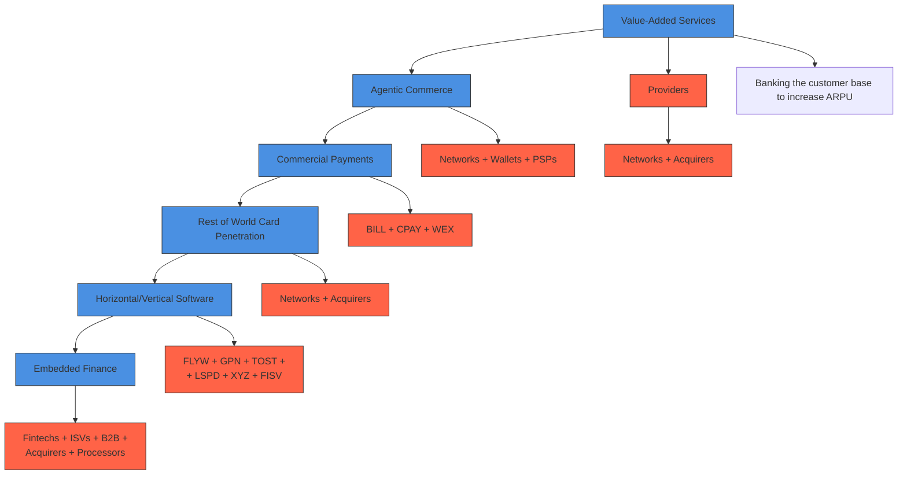

你是知乎商业/行业研究作者，擅长把英文/中文研报改写成适合知乎发布的长文。

【目标】
- 基于下面研报解析内容，生成一篇中文知乎文章。
- 风格接近微信公众号文章，但更适合知乎：论证更完整、语气更克制、有问题意识、有推理链条。
- 文章不需要把研报所有内容讲完，要留下继续阅读完整报告或加入社群讨论的空间。
- 目标长度：约 2200 字，允许上下浮动 20%。

【结构要求】
1. 第一行：知乎标题，直接讲观点，不要标题党，不要夸张极限词。
2. 开头 2-3 段：用一个真实问题或市场分歧切入，说明为什么这份报告值得看。
3. 正文按金字塔原则组织：先给核心判断，再展开 3-5 个支撑逻辑。
4. 每个小标题都要像观点句，不要写“核心判断”“支撑逻辑一”“对读者的启发”这种模板名。
5. 内容要比小红书更理性，比微信更像问答式分析，可以适度提出反问。
6. 结尾自然留下讨论空间，可使用这类表达：`完整报告里还有不少细节，适合放在社群里继续拆。`

【平台发布合规要求】
- 不要出现“投资建议”“买入”“卖出”“强烈推荐”“稳赚”“保本”“必涨”“抄底”“上车”“内幕”“翻倍”等金融操作或收益承诺表达。
- 不要写“非投资建议”“仅做学习交流”这种免责声明，也不要出现包含“投资”的免责声明。
- “投资”相关词尽量改成“投研”“研究”“观察”“学习参考”。
- 不要写“关注”“点赞”“求关注”“评论区留言”等直接互动诱导。
- 不要使用“爆款”“震惊”“必看”“必读”“最强”“最全”“唯一”“全网首发”等极限词。

【内容要求】
- 只能基于研报原文和解析内容推导，不要编造数据、页数、作者、结论或引用。
- 可以基于报告内容做适度发散，但必须明确哪些是报告内容，哪些是你的延展观察。
- 默认避免具体投行品牌名，比如“GS”“GS”，统一写作“投行研报”或使用 GS/JPM/MS 等缩写。
- 不要输出解释说明，只输出知乎文章正文。

【研报解析内容】
"""
# Payment Processing

Snippets From Market Share Handbook 2026 Edition

See the full report here

# Payments, Processors & IT Services

# Tien-tsin Huang, CFA AC

(1-212) 622-6632

Tien-tsin.huang@JPM.com

JPM Securities LLC

# Puneet Jain

(1-212) 622-1436

Puneet.x.jain@JPM.com

JPM Securities LLC

# Connor Allen AC

(1-212) 622-1303

Connor.allen@JPM.com

JPM Securities LLC

# Brendan Biles

(1-212) 270-0880

Brendan.biles@JPM.com

JPM Securities LLC

# Charles Pearce, CFA

(1-212) 622-4368

Charles.pearce@jpmchase.com

JPM Securities LLC

# Abbey Hochreiner

(1-212) 270-0660

Abbey.hochreiner@jpmchase.com

JPM Securities LLC

# Processing Group Underperforming in 2026

Excess Returns: JPM processing index returns (market cap weighted) minus S&P 500 Index returns   

bar

| Year | Value (%) |
| :--- | :--- |
| 2001 | 6 |
| 2002 | -4 |
| 2003 | -12 |
| 2004 | -1 |
| 2005 | 5 |
| 2006 | 10 |
| 2007 | 9 |
| 2008 | 9 |
| 2009 | 26 |
| 2010 | -18 |
| 2011 | 28 |
| 2012 | 16 |
| 2013 | 25 |
| 2014 | 2 |
| 2015 | 13 |
| 2016 | -2 |
| 2017 | 20 |
| 2018 | 23 |
| 2019 | 15 |
| 2020 | 40 |
| 2021 | -24 |
| 2022 | 4 |
| 2023 | 7 |
| 2024 | 3 |
| 2025 | -8 |
| 2026 YTD | -20 |

Source: Bloomberg Finance L.P. Priced as of 5/14/2026.   
Note: JPM processing index includes ADP, AFRM, BILL, BR, CPAY, FI, FIS, FLYW, GPN, LSPD, MA, MQ, PAY, PAYX, PYPL, RELY, TOST, TNET, V, WU, WEX, XYZ (formerly BKI, EVOP, MGI, NVEI).

# Pandemic Accelerated Card Displacement of Cash, Lifted Debit; Partially Rebounded

United States Payment Medium Wallet Share   

bar_stacked

| Year   | Checks | Cash | Credit | Debit |
|--------|--------|------|--------|-------|
| 1990   | 64%    | 20%  | 15%    | 0%    |
| 1995   | 58%    | 19%  | 21%    | 1%    |
| 2000   | 47%    | 21%  | 26%    | 6%    |
| 2005   | 32%    | 24%  | 29%    | 15%   |
| 2010   | 22%    | 24%  | 30%    | 25%   |
| 2011   | 19%    | 24%  | 31%    | 27%   |
| 2012   | 16%    | 24%  | 32%    | 27%   |
| 2013   | 15%    | 22%  | 35%    | 29%   |
| 2014   | 13%    | 21%  | 36%    | 30%   |
| 2015   | 12%    | 19%  | 38%    | 31%   |
| 2016   | 10%    | 19%  | 39%    | 32%   |
| 2017   | 9%     | 19%  | 40%    | 32%   |
| 2018   | 7%     | 18%  | 42%    | 33%   |
| 2019   | 5%     | 16%  | 43%    | 36%   |
| 2020   | 5%     | 11%  | 41%    | 42%   |
| 2021   | 4%     | 8%   | 44%    | 43%   |
| 2022   | 3%     | 9%   | 47%    | 41%   |
| 2023   | 3%     | 10%  | 47%    | 40%   |
| 2024   | 3%     | 10%  | 47%    | 41%   |
| 2029E  | 2%     | 7%   | 49%    | 42%   |

Source: The Nilson Report and JPM

# Volume Growth Stabilizing below Historical Trend

U.S. Bankcard Purchase Volume Growth Y/Y   

bar

| Year | Volume (%) | Transactions (%) |
| :--- | :--- | :--- |
| 1990 | 18 | 17 |
| 1991 | 9 | 7 |
| 1992 | 11 | 9 |
| 1993 | 18 | 18 |
| 1994 | 21 | 20 |
| 1995 | 20 | 22 |
| 1996 | 17 | 19 |
| 1997 | 15 | 17 |
| 1998 | 17 | 17 |
| 1999 | 19 | 19 |
| 2000 | 16 | 18 |
| 2001 | 11 | 14 |
| 2002 | 11 | 13 |
| 2003 | 11 | 12 |
| 2004 | 13 | 13 |
| 2005 | 13 | 14 |
| 2006 | 12 | 13 |
| 2007 | 11 | 13 |
| 2008 | 6 | 9 |
| 2009 | 2 | 9 |
| 2010 | 9 | 12 |
| 2011 | 10 | 11 |
| 2012 | 4 | 6 |
| 2013 | 8 | 10 |
| 2014 | 9 | 9 |
| 2015 | 9 | 10 |
| 2016 | 10 | 9 |
| 2017 | 9 | 6 |
| 2018 | 11 | 10 |
| 2019 | 9 | 9 |
| 2020 | 4 | -1 |
| Pandemic | -1 | -5 |
| 2021 | 25 | 18 |
| 2022 | 12 | 8 |
| 2023 | 7 | 7 |
| 2024 | 6 | 6 |
| 2025 | 7 | 7 |
| 2026E | 5 | 6 |
| 2027E | 5 | 5 |

Source: Company reports, The Nilson Report, JPM forecast for 2026-2027.   
Note: Bankcard purchase volume and transaction growth year-over-year represented by bars.   
CY12 and CY13 volume and transaction metrics are distorted by regulation requiring debit card issuers to enable at least one non-affiliated PIN debit network on all cards. Debit transactions/volume routed over non-affiliated PIN debit networks is not reflected in the above diagram.

# E-Commerce Growth Premium to Overall Physical Retail Moderating, Spend Continues Shifting to Mobile

U.S. Digital Spend (ex-Travel) by Medium (\$ in millions) 

<table><tr><td></td><td>2019 Spend</td><td>2020 Spend</td><td>2021 Spend</td><td>2022 Spend</td><td>2023 Spend</td><td>2024 Spend</td><td>2025 Spend</td><td>% change (y/y)</td><td>CY22-25 CAGR</td></tr><tr><td>Desktop</td><td>429,666</td><td>478,124</td><td>597,686</td><td>703,097</td><td>846,654</td><td>926,098</td><td>962,368</td><td>4%</td><td>11%</td></tr><tr><td>Smartphone</td><td>135,207</td><td>169,997</td><td>241,557</td><td>311,731</td><td>361,509</td><td>512,738</td><td>670,493</td><td>31%</td><td>29%</td></tr><tr><td>Tablet</td><td>50,187</td><td>57,316</td><td>65,968</td><td>75,554</td><td>75,066</td><td>84,233</td><td>92,433</td><td>10%</td><td>7%</td></tr><tr><td>Total Digital Commerce</td><td>615,060</td><td>705,436</td><td>905,211</td><td>1,090,382</td><td>1,283,229</td><td>1,523,068</td><td>1,725,295</td><td>13%</td><td>17%</td></tr><tr><td>% Desktop</td><td>70%</td><td>68%</td><td>66%</td><td>64%</td><td>66%</td><td>61%</td><td>56%</td><td></td><td></td></tr><tr><td>% Smartphone</td><td>22%</td><td>24%</td><td>27%</td><td>29%</td><td>28%</td><td>34%</td><td>39%</td><td></td><td></td></tr><tr><td>% Tablet</td><td>8%</td><td>8%</td><td>7%</td><td>7%</td><td>6%</td><td>6%</td><td>5%</td><td></td><td></td></tr></table>

Source: comScore (1Q 2026).

The y/y increase in penetration of Smartphone spend on U.S. sites corresponded with reported increase in preference from our Online Checkout Survey

Preferred Digital Spend Medium   

bar

| Device Type | 2021 (%) | 2022 (%) | 2023 (%) | 2024 (%) | 2025 (%) | 2026 (%) |
|---|---|---|---|---|---|---|
| Desktop/Laptop | 30 | 26 | 28 | 29 | 22 | 17 |
| Smartphone | 64 | 68 | 68 | 65 | 73 | 78 |
| Tablet | 5 | 6 | 5 | 6 | 5 | 5 |

Source: JPM Online Checkout Survey.

- The growth premium for global e-comm spend relative to physical retail moderated in 2025, and is expected to remain at a \~4pt premium looking ahead.   
• Online checkout preference does not equal practice:

- More than 2/3 of Americans prefer to complete an online transaction using their Smartphones; however, $>55\%$ of spend on U.S. sites takes place on Desktop.   
• We continue to see runway for mobile-native payment wallets to increase penetration.

Global e-Commerce vs. Phys. Retail Sales Growth 

<table><tr><td>Year</td><td>e-Comm Sales Growth</td><td>Physical Retail Sales Growth</td><td>e-Comm Premium</td><td>Avg. Premium</td></tr><tr><td>2016</td><td>26.8%</td><td>4.2%</td><td>22.6%</td><td rowspan="4">20.2%</td></tr><tr><td>2017</td><td>27.6%</td><td>4.7%</td><td>22.9%</td></tr><tr><td>2018</td><td>20.9%</td><td>2.8%</td><td>18.1%</td></tr><tr><td>2019</td><td>20.4%</td><td>3.4%</td><td>17.0%</td></tr><tr><td>2020</td><td>28.1%</td><td>-8.0%</td><td>36.1%</td><td rowspan="5">9.9%</td></tr><tr><td>2021</td><td>16.7%</td><td>12.2%</td><td>4.5%</td></tr><tr><td>2022</td><td>5.9%</td><td>7.0%</td><td>-1.1%</td></tr><tr><td>2023</td><td>9.6%</td><td>4.2%</td><td>5.4%</td></tr><tr><td>2024</td><td>7.7%</td><td>3.2%</td><td>4.5%</td></tr><tr><td>2025E</td><td>6.8%</td><td>3.2%</td><td>3.6%</td><td rowspan="4">4.0%</td></tr><tr><td>2026E</td><td>7.2%</td><td>3.0%</td><td>4.2%</td></tr><tr><td>2027E</td><td>7.2%</td><td>3.0%</td><td>4.2%</td></tr><tr><td>2028E</td><td>6.9%</td><td>2.8%</td><td>4.1%</td></tr></table>

# Button Availability Across Top 100 U.S. E-Comm Merchants

Payment Method Availability at Top 100 U.S. E-Commerce Merchants (Desktop)   

bar

| Payment Method | Jan-25 (%) | Apr-25 (%) | Jan-26 (%) |
|---|---|---|---|
| PayPal | 86 | 83 | 83 |
| Klarna | 27 | 27 | 29 |
| Afterpay | 25 | 24 | 27 |
| Affirm | 12 | 13 | 16 |
| Google Pay | 19 | 16 | 15 |
| Apple Pay | 1 | 1 | 11 |
| Venmo | 7 | 6 | 6 |
| Zip | 6 | 6 | 6 |
| Click to Pay | 6 | 2 | 4 |
| Paze | 3 | 2 | 3 |
| Shop Pay | 1 | 0.5 | 2 |

Source: JPM and Digital Commerce 360 Research for ranking of top 100 merchants

Payment Method Availability at Top 100 U.S. E-Commerce Merchants (Mobile, iOS)   

bar

| Payment Method | Jan-25 (%) | Apr-25 (%) | Jan-26 (%) |
| :--- | :--- | :--- | :--- |
| PayPal | 82 | 81 | 81 |
| Apple Pay | 57 | 69 | 69 |
| Klarna | 26 | 28 | 28 |
| Afterpay | 23 | 27 | 27 |
| Google Pay | 18 | 15 | 15 |
| Affirm | 12 | 12 | 12 |
| Venmo | 9 | 7 | 7 |
| Zip | 5 | 6 | 6 |
| Paze | 3 | 3 | 3 |
| Click to Pay | 1 | 3 | 3 |
| Shop Pay | 1 | 1 | 1 |

Source: JPM and Digital Commerce 360 Research for ranking of top 100 merchants   
Note (right): PayPal Branded assumes 40% mix of U.S. volume. Apple Pay represents JPM estimate   
averaging industry sources estimating between 2-13% ecomm share. Google Pay reflects JPM   
estimate considering relative availability at checkout and consumer preference based on JPM   
Checkout Survey. Amazon GMV sourced from JPM Internet Analyst Doug Anmuth. Guest Checkout   
based on consumer responses in JPM Online Checkout Survey and company commentary.

\- >50% of U.S. e-comm is done on desktop, but consumer preference is increasingly shifting to mobile

• PayPal Branded remains the best distributed, available at >80% of merchants surveyed.

\- BNPL providers occupy premium real estate, and are best represented on the Product Page

\- Klarna was among best represented BNPL providers (>25% of merchants), but Affirm (\~15% of merchants) has greater share in Top 10

• Monitoring Apple– Apple in Browser was added to 10 of the Top 100 merchants over the last year

\- Klarna, Afterpay also gaining traction on Mobile

Share of U.S. CNP E-Commerce   

pie

| Category | Percentage (%) |
| :--- | :--- |
| Card on File / Other | 29 |
| Guest Checkout | 34 |
| Amazon | 19 |
| Apple Pay | 8 |
| PayPal Branded | 7 |
| Google Pay | 3 |
| Shop Pay | 3 |

Source: JPM estimates, company reports, and The Nilson Report.

# Digital Wallets winning share largely at expense of card on file

Preferred payment method: Guest Checkout vs. Card on File vs. Digital Wallet   
  
Source: JPM Online Checkout Survey   
Note: 1,486 responses, “saved credentials” include guest checkout with browser autofill, registered card on file and digital wallets.

Reason for Using Digital Wallets   

bar

| Category | Percentage (%) |
| :--- | :--- |
| Use other offerings | 15 |
| Rewards | 17 |
| View as secure | 25 |
| Availability | 34 |
| Most familiar | 41 |
| Convenience | 45 |

Across 3 scenarios ( $1^{st}$ time shopping at a website, favorite website, retailer's mobile app), respondents were 75-81% likely to checkout using some form of auto-populated/saved credentials (80% avg.) and 30-39% likely to use some form of Guest Checkout (34% avg.).   
There remains room for penetration of guest checkout; recent wallet share gains appear to be coming at the expense of card on file, possibly browser (to a lesser extent)   
43% of PayPal preferers cited familiarity as a reason for said preference (vs. 41% among tot. survey); 54% of Apple Pay preferers cited convenience/speed (vs. 45% among tot. survey); 17% of Cash App Pay preferers cited use of other product offerings (vs. 15% among tot. survey).

# Volume Estimates Assume Similarly Muted U.S. Growth vs. PCE Through '27

U.S. Bank Card Purchase Volume Trends vs. Personal Consumer Expenditure 

<table><tr><td>$ in billions</td><td>2017</td><td>2018</td><td>2019</td><td>2020</td><td>2021</td><td>2022</td><td>2023</td><td>2024</td><td>2025</td><td>2026E</td><td>2027E</td></tr><tr><td>Mastercard</td><td>1,385</td><td>1,536</td><td>1,701</td><td>1,746</td><td>2,176</td><td>2,441</td><td>2,592</td><td>2,785</td><td>2,958</td><td>3,057</td><td>3,216</td></tr><tr><td>Visa</td><td>3,332</td><td>3,697</td><td>4,028</td><td>4,170</td><td>5,208</td><td>5,828</td><td>6,217</td><td>6,582</td><td>7,027</td><td>7,477</td><td>7,893</td></tr><tr><td>Total US Purchase Volume</td><td>4,717</td><td>5,233</td><td>5,729</td><td>5,916</td><td>7,384</td><td>8,269</td><td>8,809</td><td>9,367</td><td>9,985</td><td>10,534</td><td>11,109</td></tr><tr><td>% change (y/y)</td><td>9.1%</td><td>10.9%</td><td>9.5%</td><td>3.3%</td><td>24.8%</td><td>12.0%</td><td>6.5%</td><td>6.3%</td><td>6.6%</td><td>5.5%</td><td>5.5%</td></tr><tr><td>Personal Consumer Expenditure (PCE)</td><td>13,291</td><td>13,935</td><td>14,438</td><td>14,228</td><td>16,119</td><td>17,690</td><td>18,833</td><td>19,896</td><td>20,961</td><td>21,398</td><td>22,929</td></tr><tr><td>% change (y/y)</td><td>4.4%</td><td>4.8%</td><td>3.6%</td><td>-1.5%</td><td>13.3%</td><td>9.7%</td><td>6.5%</td><td>5.6%</td><td>5.4%</td><td>2.1%</td><td>7.2%</td></tr><tr><td>Total PCE Penetration</td><td>35%</td><td>38%</td><td>40%</td><td>42%</td><td>46%</td><td>47%</td><td>47%</td><td>47%</td><td>48%</td><td>49%</td><td>48%</td></tr><tr><td>&quot;Cardable&quot; PCE Penetration *</td><td>58%</td><td>61%</td><td>65%</td><td>68%</td><td>74%</td><td>75%</td><td>75%</td><td>76%</td><td>78%</td><td>N/A</td><td>N/A</td></tr></table>

Source: Company reports, JPM estimates and the U.S. Department of Commerce.   
Note: “Cardable” PCE removes housing/utilities, health care and motor vehicle payments. 2012 card volume growth is understated due to PIN Debit market share losses by Visa. Mastercard data excludes debit transactions on Maestro and Cirrus-branded cards, Mondex transactions and transactions involving brands other than Mastercard. 2026-27 PCE growth based on JPM Economic Research estimates as of April 2026.

Bank Card Volume Growth to U.S. PCE Growth Multiplier   

bar

| Year   | Bankcard Growth/PCE Growth |
| ------ | -------------------------- |
| 2005   | 2.1x                       |
| 2006   | 2.5x                       |
| 2007   | 2.2x                       |
| 2008   | 2.0x                       |
| 2009   | 1.1x                       |
| 2010   | 2.4x                       |
| 2011   | 2.3x                       |
| 2012   | 2.2x                       |
| 2013   | 2.8x                       |
| 2014   | 2.2x                       |
| 2015   | 2.5x                       |
| 2016   | 2.5x                       |
| 2017   | 2.1x                       |
| 2018   | 2.3x                       |
| 2019   | 2.6x                       |
| 2020   | 4.5x                       |
| 2021   | 1.9x                       |
| 2022   | 1.2x                       |
| 2023   | 1.0x                       |
| 2024   | 1.1x                       |
| 2025   | 1.2x                       |
| 2026E  | 1.0x                       |
| 2027E  | 1.4x                       |

Source: U.S. Department of Commerce and JPM calculations.   
Note: PCE = Personal Consumption Expenditure, Multiplier = Card-based purchase volume growth/ U.S. PCE Growth. 2012 Bank Card Volume Growth is JPMe assuming PIN debit share shift from Visa to Mastercard that is unreported. 2020 was the first period in tracking where PCE growth was negative while Bankcard growth was positive. 2025-26 PCE growth based on JPM Economic Research estimates as of April 2026.

- On average, bank card penetration of “cardable” PCE expanded about \~3ppts per year. Simple math implies 5+ years of card conversion opportunity left (domestically). Longer at current rates.   
- All else equal, 1ppt of penetration equates to about 130 bps of aggregate volume growth to Visa and Mastercard.   
- Path to further penetration is small and large ticket. B2B and other non-carded verticals significantly expand domestic TAM.   
- Global card penetration of consumption is \~15ppts below U.S.

2025 U.S. PCE Components   

pie

| Category | Percentage (%) |
| :--- | :--- |
| Non-Durable Goods | 20 |
| Durable Goods | 11 |
| Services: Housing, Utility & Health | 37 |
| Other Services | 32 |

Largest card opportunity
large-ticket durable goods,
housing, healthcare   
Source: U.S. Department of Commerce.

JPM

# What Themes Can Supplement U.S. PCE Card Penetration?

flowchart

# Network Value Added Services – Mastercard Larger, Visa Growing Faster

Visa   

pie

| Category | Value Added Services (%) | Non-Value Added Services (%) |
| :--- | :--- | :--- |
| Value Added Services | 28 | 72 |
| Risk & Security | 17 | 1.5 |
| Acceptance Solutions |

[中间内容因长度限制已省略]

n this material represent JPM's current opinions or judgment as of the date of the material only and are therefore subject to change without notice. Periodic updates may be provided on companies/industries based on company-specific developments or announcements, market conditions or any other publicly available information. There can be no assurance that future results or events will be consistent with any such opinions, forecasts or projections, which represent only one possible outcome. Furthermore, such opinions, forecasts or projections are subject to certain risks, uncertainties and assumptions that have not been verified, and future actual results or events could differ materially. The value of, or income from, any investments referred to in this material may fluctuate and/or be affected by

changes in exchange rates. All pricing is indicative as of the close of market for the securities discussed, unless otherwise stated. Past performance is not indicative of future results. Accordingly, investors may receive back less than originally invested. This material is not intended as an offer or solicitation for the purchase or sale of any financial instrument. The opinions and recommendations herein do not take into account individual client circumstances, objectives, or needs and are not intended as recommendations of particular securities, financial instruments or strategies to particular clients. This material may include views on structured securities, options, futures and other derivatives. These are complex instruments, may involve a high degree of risk and may be appropriate investments only for sophisticated investors who are capable of understanding and assuming the risks involved. The recipients of this material must make their own independent decisions regarding any securities or financial instruments mentioned herein and should seek advice from such independent financial, legal, tax or other adviser as they deem necessary. JPM may trade as a principal on the basis of the Research Analysts' views and research, and it may also engage in transactions for its own account or for its clients' accounts in a manner inconsistent with the views taken in this material, and JPM is under no obligation to ensure that such other communication is brought to the attention of any recipient of this material. Others within JPM, including Strategists, Sales staff and other Research Analysts, may take views that are inconsistent with those taken in this material. Employees of JPM not involved in the preparation of this material may have investments in the securities (or derivatives of such securities) mentioned in this material and may trade them in ways different from those discussed in this material. This material is not an advertisement for or marketing of any issuer, its products or services, or its securities in any jurisdiction.

Confidentiality and Security Notice: This transmission may contain information that is privileged, confidential, legally privileged, and/or exempt from disclosure under applicable law. If you are not the intended recipient, you are hereby notified that any disclosure, copying, distribution, or use of the information contained herein (including any reliance thereon) is STRICTLY PROHIBITED. Although this transmission and any attachments are believed to be free of any virus or other defect that might affect any computer system into which it is received and opened, it is the responsibility of the recipient to ensure that it is virus free and no responsibility is accepted by JPM Chase & Co., its subsidiaries and affiliates, as applicable, for any loss or damage arising in any way from its use. If you received this transmission in error, please immediately contact the sender and destroy the material in its entirety, whether in electronic or hard copy format. This message is subject to electronic monitoring: https://www.JPM.com/disclosures/email

MSCI: Certain information herein (“Information”) is reproduced by permission of MSCI Inc., its affiliates and information providers (“MSCI”) ©2026. No reproduction or dissemination of the Information is permitted without an appropriate license. MSCI MAKES NO EXPRESS OR IMPLIED WARRANTIES (INCLUDING MERCHANTABILITY OR FITNESS) AS TO THE INFORMATION AND DISCLAIMS ALL LIABILITY TO THE EXTENT PERMITTED BY LAW. No Information constitutes investment advice, except for any applicable Information from MSCI ESG Research. Subject also to msci.com/disclaimer

Sustainalytics: Certain information, data, analyses and opinions contained herein are reproduced by permission of Sustainalytics and: (1) includes the proprietary information of Sustainalytics; (2) may not be copied or redistributed except as specifically authorized; (3) do not constitute investment advice nor an endorsement of any product or project; (4) are provided solely for informational purposes; and (5) are not warranted to be complete, accurate or timely. Sustainalytics is not responsible for any trading decisions, damages or other losses related to it or its use. The use of the data is subject to conditions available at https://www.sustainalytics.com/legal-disclaimers. ©2026 Sustainalytics. All Rights Reserved.

"Other Disclosures" last revised April 04, 2026.

Copyright 2026 JPM Chase & Co. All rights reserved. This material or any portion hereof may not be reprinted, sold or redistributed without the written consent of JPM. It is strictly prohibited to use or share without prior written consent from JPM any research material received from JPM or an authorized third-party (“JPM Data”) in any third-party artificial intelligence (“AI”) systems or models when such JPM Data is accessible by a third-party.
"""
