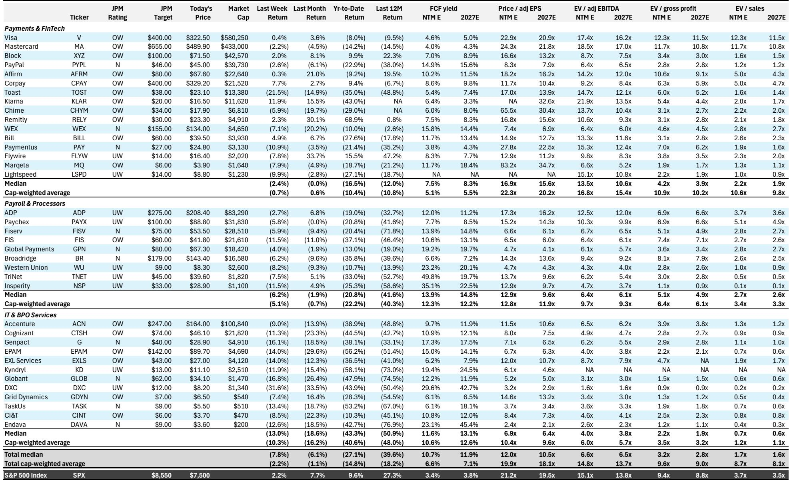
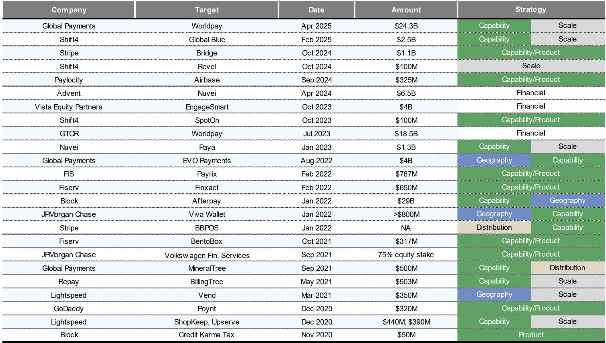
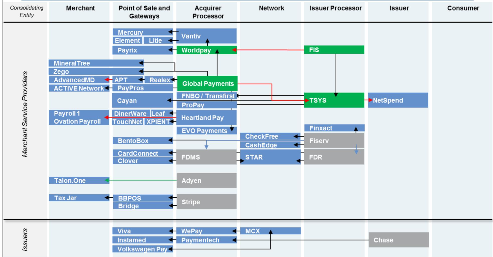

# The Payment Processing Industry Is Entering a Structural Slowdown: The Era of Easy Volume Growth Is Over

The payment processing industry is facing a difficult truth that many investors have been slow to accept: the structural tailwinds that have propelled the sector for two decades are fading, and the market is finally pricing this in. Year-to-date through mid-May 2026, the JPM processing index has underperformed the S&P 500 by roughly 20 percentage points, a dramatic reversal from the consistent alpha generation that characterized the sector for most of the past 25 years. This is not a cyclical dip. It is a structural repricing driven by three converging forces: the maturation of card penetration in the United States, the normalization of e-commerce growth, and a market that is beginning to question the sustainability of the value-added services narrative that has supported premium valuations.

The core argument of this article is that the payment processing industry is transitioning from a volume-driven growth model to a value-driven one, and that this transition will separate the winners from the losers in ways that the current market sell-off does not fully reflect. Companies that can monetize data, software, and embedded finance will survive and thrive. Those that remain dependent on transaction volume growth alone face a decade of compressed returns. The data from a major global investment bank's 2026 Market Share Handbook makes this case with unusual clarity, and the implications for portfolio strategy are profound.

## The U.S. Card Penetration Story Is Nearing Its End, and the Math Is Unforgiving

The single most important structural shift in the industry is the deceleration of U.S. bankcard volume growth relative to personal consumption expenditure. For most of the past two decades, bankcard volume grew at roughly two to three times the rate of PCE. In 2020, the multiplier hit an extraordinary 4.5x as the pandemic forced a massive shift from cash to cards. But since 2023, that multiplier has collapsed to roughly 1.0x to 1.2x, and the report's forecasts indicate it will remain at approximately 1.0x in 2026 and only 1.4x in 2027.

Why does this matter? Because the industry's entire business model has been built on the assumption that card penetration of consumer spending would continue to expand at roughly three percentage points per year. That assumption is now breaking down. Total U.S. bankcard purchase volume as a percentage of PCE has plateaued at around 47 to 48 percent since 2021. Even when adjusting for non-cardable categories like housing, utilities, and healthcare, the penetration rate has stalled at roughly 75 to 78 percent. The report's own analysis suggests that at current rates of conversion, there may be five or more years of domestic card conversion opportunity left, but that timeline is stretching, not compressing.

The strategic implication is clear: the industry can no longer rely on the simple gravitational pull of cash displacement to generate double-digit volume growth. The low-hanging fruit has been picked. The remaining opportunity lies in large-ticket durable goods, housing, and healthcare, categories that are structurally harder to convert because they involve infrequent transactions, high regulatory friction, and established financing alternatives. The path to further penetration is not impossible, but it is materially more expensive and slower than the path that has already been traveled.

## E-Commerce Growth Has Normalized, and the Mobile Wallet Revolution Has Not Yet Translated into Revenue

The e-commerce premium over physical retail has moderated from an average of 20 percentage points between 2016 and 2019 to roughly 4 percentage points in the 2025 to 2028 forecast period. This is a dramatic normalization, and it removes one of the key volume growth engines that the processing industry has relied upon. Global e-commerce sales growth is expected to settle into a 6 to 7 percent annual range, which is healthy but no longer transformational.

At the same time, the consumer preference shift toward mobile is accelerating, but the revenue implications are more complex than they appear. The report's survey data shows that 78 percent of consumers now prefer to complete online transactions using their smartphones, up from 64 percent in 2021. Yet more than 55 percent of actual U.S. e-commerce spend still takes place on desktop. This gap between preference and practice suggests that the mobile payment experience still has friction that needs to be resolved, but it also creates an opportunity for digital wallets that can bridge the gap.

The critical strategic question is whether digital wallets will ultimately be a source of incremental revenue for processors or a source of margin compression. The report's data shows that digital wallets are winning share largely at the expense of card-on-file, not at the expense of guest checkout. This is important because card-on-file has historically been a high-margin, low-cost transaction for networks and acquirers. If digital wallets simply replace one form of stored credential with another, the net revenue impact may be neutral or even negative, depending on the fee structures involved.

PayPal remains the best-distributed digital wallet, available at over 80 percent of the top 100 U.S. e-commerce merchants on desktop. But Apple Pay is gaining rapidly, particularly on mobile, where it is now available at 69 percent of merchants, up from 57 percent just over a year ago. The BNPL providers, Klarna, Afterpay, and Affirm, are occupying premium real estate on product pages, but their share of total e-commerce volume remains small. The real battle is for the checkout button, and the outcome will determine which players capture the economics of the next phase of digital commerce.

## The Value-Added Services Thesis Is Real, but It Is Not a Panacea for All Processors

The industry's response to slowing volume growth has been to pivot toward value-added services, and the report identifies several themes that can supplement U.S. PCE card penetration: agentic commerce, commercial payments, rest-of-world card penetration, horizontal and vertical software, and embedded finance. These are legitimate growth vectors, but they are not equally accessible to all players.

The data on network value-added services shows a clear divergence. Mastercard has built a larger value-added services business in absolute terms, but Visa is growing faster. This is not simply a matter of execution. It reflects a strategic choice about where to invest. Mastercard has been more aggressive in acquiring and building fraud prevention, data analytics, and consulting capabilities. Visa has focused on expanding its network reach and investing in new payment flows like B2B and real-time payments. Both strategies can work, but they require different capabilities and different risk profiles.

For acquirers and processors, the path to value-added services is even more complex. The report's thematic map shows that horizontal and vertical software players like Flywire, Global Payments, Toast, and Fiserv are positioned to benefit from embedded finance, but the economics of embedded finance are still being worked out. The promise is that by integrating payments into software workflows, processors can capture higher margins and increase customer stickiness. The risk is that software platforms will capture the economics themselves, reducing processors to commoditized infrastructure providers.

The report does not fully answer the question of which processors will successfully navigate this transition. That is the open analytical question that should concern every serious investor in the space. The market is currently treating all processors with a similar level of skepticism, but the divergence in outcomes over the next three to five years is likely to be extreme.

## The Report Leaves Two Critical Questions Unanswered

No analysis is complete, and the report leaves two questions that are essential for any investor trying to build a forward-looking thesis. First, the report does not fully address the impact of potential regulatory changes on the economics of payment processing. The Durbin Amendment, the Credit Card Competition Act, and various state-level initiatives all have the potential to reshape the fee structures that underpin the industry. The report acknowledges that 2012 volume growth was distorted by regulation requiring debit card issuers to enable at least one non-affiliated PIN debit network, but it does not model the impact of future regulatory scenarios. This is a material gap, particularly given the current political environment.

Second, the report does not resolve the question of whether the current market sell-off is an overreaction or a rational repricing. The processing index has underperformed by 20 percentage points year-to-date in 2026, which is the worst performance since the index was created. This could be a buying opportunity if the market is extrapolating near-term weakness into a permanent structural decline. But it could also be the beginning of a longer period of underperformance if the structural headwinds are as powerful as the data suggests. The report provides the data to frame the question, but it does not provide a definitive answer.

## A Decision Framework for Investors

For investors trying to navigate this environment, the report suggests a three-part framework for evaluating processing companies. First, assess exposure to U.S. consumer card volume. Companies that derive the majority of their revenue from U.S. consumer card transactions face the most direct headwind from the deceleration in volume growth. The multiplier analysis shows that volume growth is likely to be in the 5 to 6 percent range for the foreseeable future, which is roughly half the historical growth rate. Companies that cannot offset this deceleration with price increases or share gains will see revenue growth compress.

Second, evaluate the quality and scalability of value-added services. Not all value-added services are created equal. Companies that are building proprietary data assets, fraud prevention capabilities, and software platforms have a stronger competitive position than companies that are simply reselling third-party services. The report's data on network value-added services shows that Visa and Mastercard are both investing heavily, but the returns on those investments will take years to materialize. For smaller processors, the question is whether they have the scale and expertise to compete.

Third, consider international exposure. The report notes that global card penetration of consumption is roughly 15 percentage points below the U.S. level. This suggests that there is a significant growth opportunity outside the United States, particularly in markets where cash remains dominant. Companies with strong international networks and local market expertise are better positioned to capture this opportunity. The rest-of-world card penetration theme is one of the most compelling in the report, but it requires patience and local knowledge that many investors lack.

## Join the Community to Read the Full Report and Review the Original Charts

The analysis above is based on a parsing of a major global investment bank's 2026 Market Share Handbook for payment processing, but the full report contains granular data on merchant acquiring share, network transaction trends, and company-specific market positions that cannot be fully captured in a single article. The original charts on processing index returns, payment medium wallet share, e-commerce growth premiums, and digital wallet availability at top merchants are essential for anyone trying to build a detailed investment thesis. The report also includes detailed volume estimates for Visa and Mastercard through 2027, as well as a breakdown of U.S. PCE components that shows exactly where the remaining card conversion opportunity lies. Join the community to read the full report and review the original charts.

*This article is for learning and discussion only and does not constitute investment advice.*

Personal reading notes and learning share only. Not investment advice.

