# Spring Series 2026

A Good Start with AI Tailwinds Ahead

Overweight: CLBT, CHKP, CRWD, ESTC, FROG, NTSK, OKTA, PANW, SAIL, TENB, VRNS, ZS

Neutral: GTLB, IBM, RPD, S

Underweight: AI, FTNT, QLYS

Software - Large Cap / Mid & Small Cap 

<table><tr><td>Brian Essex, CFA AC</td><td>John Lee</td><td>Alex Isaac</td></tr><tr><td>(1-212) 622-5990</td><td>(1-212) 622-6064</td><td>(1-212) 622-9159</td></tr><tr><td>brian.essex@jpmchase.com</td><td>john.h.lee@jpmchase.com</td><td>alex.isaac@JPM.com</td></tr><tr><td>JPM Securities LLC</td><td>JPM Securities LLC</td><td>JPM Securities LLC</td></tr></table>

# Executive Summary: Demand Poised to Accelerate

The most transformative technology shift of our lifetimes comes with a larger attack surface

The attack surface is evolving and expanding at an unprecedented pace: Agents can now find vulnerabilities in code at an unprecedented rate. This translates into an ability to engineer and execute exploits at a much faster rate. Exploits that AI models engineer can also be more complex and sophisticated. Meanwhile, some applications may not be patchable and AI introduces new attack vectors including logic, identity, and social engineering-based exploits.

Platforms are best positioned to address emerging AI threats: The enterprise remediation gap cannot keep pace with the speed of AI-enabled discovery. Mean time to exploit has collapsed. Platform vendors have already been leveraging access to AI with decades of domain expertise, proprietary data, and deep telemetry across Endpoint, Network, Identity, and Data estates to help protect customers.

Partnerships offer a lens into leadership: Anthropic's Glasswing, OpenAI's Trusted Access for Cyber, and CrowdStrike's Quiltworks illustrate the critical role security platforms will have to address the incremental threats foundation models introduce. Those leading the partnerships with insight from foundation model vendors have an evolutionary competitive advantage.

- Anthropic has restricted Mythos access to 52 vetted organizations for defensive use only, backed by \$100M in resources. The White House Office of Management and Budget is establishing guardrails for federal agency access.   
- OpenAI Daybreak and TAC more open than Anthropic's coalition, scaling toward automated verification rather than a curated partner list.   
- CrowdStrike Quiltworks is a coalition that includes Anthropic and OpenAI, GSIs and other partners focused on finding and mitigating vulnerabilities found in enterprise applications and networks.

CRWD and PANW are obvious beneficiaries but others also well positioned: CRWD and PANW have been the most promotional about their partner-led efforts but others within our coverage have been actively involved with the foundation model companies and some may be limited by agreements they have. We count CHKP, ZS, NTSK, FROG and S among them.

# Fast Followers Behind Mythos

Open-source model capabilities are also approaching levels that may outpace remediation capacity

Frontier AI models have reached autonomous offensive cybersecurity capability: Anthropic's Mythos Preview autonomously discovers zero-day vulnerabilities, develops working exploits, and completes full network penetration tests without human intervention.

"I found more bugs in the last couple of weeks than I found in the rest of my life combined." – Nicholas Carlini, Research Scientist, Anthropic

"I just spoke to one of our partners (re: Quiltworks) and 48 million vulnerabilities were found." – George Kurtz, CEO, CrowdStrike

This capability has already been used in real-world attacks: In September 2025, a Chinese state-sponsored group used less capable Claude models to autonomously conduct cyber espionage against approximately 30 entities including government agencies and financial institutions, with confirmed successful intrusions.

Underlying capabilities are proliferating through open-source models: Kimi K2.6, an open-source Chinese model released by a company caught siphoning Anthropic training data, now matches the coding performance level at which real-world exploit capability was demonstrated. Multiple other models are approaching the same threshold. Anthropic's own offensive cyber lead estimates broad availability within months, not years.

Autonomous defensive tools are becoming a necessary component of enterprise security: The speed of AI-enabled threats is outpacing what human-operated security teams can address. Industry leaders including CrowdStrike, Palo Alto Networks, and SentinelOne have already begun deploying autonomous defensive agents in production. The long-term outcome, if discovery is paired with accelerated remediation, could be more secure infrastructure.

Security budgets can account for over 10% of total IT spend $^{1}$ : If we apply the same proportion to expected AI infrastructure, services and software spending, we expect spending directed at AI systems could easily run into the billions of dollars with well positioned platform vendors.

# The Threat Landscape Was Accelerating

Cyber threats were compounding in volume, speed, and sophistication before latest frontier AI capabilities

Common Vulnerabilities and Exposures Reported by Quarter   
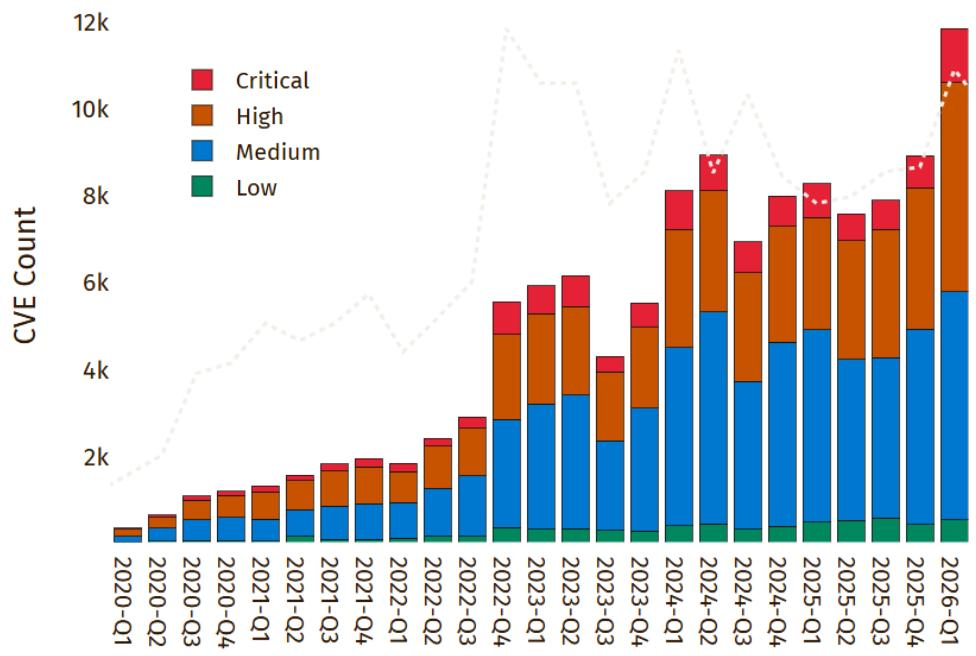  
Source: MITRE cvelistV5   
Vulnerability disclosure volumes are compounding year over year, expanding the attack surface for defenders to monitor

Breakout time collapsing: Time from initial access to lateral movement now measured in minutes, compressing the window for detection and response.

Time-to-exploit has turned negative: Mean time-to-exploit is now negative 7 days, meaning adversaries are exploiting vulnerabilities before patches exist. Historical compression: 63 days (2018) to 32 days (2021) to 5 days (2023) to negative 7 days (2025). 29% of known exploited vulnerabilities were weaponized on or before the day of public disclosure.

Nation-state AI operations are scaling rapidly: Russia's FANCY BEAR has deployed malware that uses LLM APIs to dynamically generate reconnaissance commands, replacing human operators entirely. DPRK activity surged 130%, with operatives using AI for real-time deepfake video interviews in hiring fraud targeting financial institutions.

Complacency is a legacy issue: The 2007 Aurora Generator Test demonstrated cyberattacks could physically destroy critical infrastructure. The pace of defensive improvement has not matched threat acceleration.

Documented AI-orchestrated cyberattack (September 2025): A Chinese state-sponsored group used Claude Code to autonomously conduct cyber espionage against \~30 entities including government agencies, financial institutions, and major technology firms. AI performed 80-90% of tactical operations independently at rates physically impossible for human operators. A handful of high-value intrusions were confirmed successful, achieved using models less capable than currently publicly available as open-source.

# Agentic AI Is Expanding The Attack Surface

AI deployment introduces new vectors that didn't exist in the pre-AI enterprise

# Prompt Injection

Adversaries craft malicious inputs, directly or hidden in external data, to hijack LLM behavior, bypass safety controls, or exfiltrate data

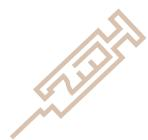

# Data & Model Poisoning

Attackers corrupt training data or model weights to embed backdoors, bias outputs, or degrade model integrity, often months before deployment

# AI Supply Chain Compromise

Malicious third-party models, open-source packages, compromised plugins, and MCP servers introduce hidden threats

# Excessive Agent Authority

Agents granted overly-broad permissions can be tricked into executing unauthorized actions deleting data, sending funds, or escalating privileges

# Shadow AI

Employees deploy
unsanctioned AI and agents
outside IT visibility, creating
data flows and unmanaged
endpoints.

# AI-Generated Code Vulnerabilities

AI coding assistants produce insecure or exploitable code at production scale, and developers often trust it without adequate review.

# Sensitive Data Exposure

LLMs leak PII, system prompts, proprietary data, or training-set contents through outputs, memory features, or retrieval pipelines.

# Deepfakes & Synthetic Identity

AI-generated voice, video, and synthetic identities enable high-fidelity impersonation that bypasses identity verification

# Non-Human Identity Sprawl

AI agents create a surge of machine identities that operate continuously without human oversight, creating persistent and ungoverned access paths.

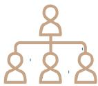

AI adoption is expanding the enterprise attack surface at an unprecedented pace, introducing entirely new vulnerability classes from prompt injection to agentic identity sprawl. The challenge stems from these surfaces are not yet being attacked by serious adversaries at scale, creating a security risk overhang where the surface grows faster than defenders can empirically prioritize it. Organizations need dialable controls that are lightweight today but can be tightened as real threats materialize.

# Economics of AI-Enabled Vulnerability Discovery

Cost collapse and autonomous operation make offensive capability broadly accessible

Autonomous operation: Anthropic disclosed that “engineers with no formal security training instructed [Mythos] to find attacks that give full remote access overnight and had complete, working attack tools by morning.” The model develops working attack tools end-to-end without human steering.

Speed compression: A corporate network penetration simulation estimated to take a human expert 10+ hours was completed autonomously by the model. Multi-step attack chains that required weeks of expert iteration now execute in hours.

Constraint shift: The threat landscape is no longer gated by attacker skill, only by access to the models, which now surpass all but the most skilled humans.

Commodity orchestration: Real-world attacks have already demonstrated that standard open-source security tools orchestrated by AI can replace entire teams of experienced hackers, with no custom malware or advanced exploit development required. The barrier to sophisticated offensive operations is no longer technical skill; instead, it is access to a capable model and harness.

<table><tr><td>Attack Type</td><td>AI Cost</td><td>Legacy</td></tr><tr><td>Scan an entire operating system for security flaws</td><td>&lt;$50</td><td>Expert Team, weeks</td></tr><tr><td>Develop a complete attack that gains full control of a computer</td><td>&lt;$1K over half a day</td><td>$500K-$2mm on the exploit black market</td></tr><tr><td>Run 1,000 automated security scans</td><td>&lt;$20K</td><td>Dedicated Research Teams</td></tr></table>

500-1,000x cost reduction makes offensive capability accessible to any organization with model access and compute.

Average eCrime breakout time: 29 minutes (fastest recorded: 27 seconds); Ransomware-to-data-exfiltration: 22 seconds (down from 8+ hours, 2022) - CrowdStrike 2026 Global Threat Report

Threat actors can now use agentic AI systems to do the work of entire teams of experienced hackers. - Anthropic threat intelligence disclosure, 2026

# Mythos Represents a Step Change in Autonomous Cybersecurity

Standardized benchmarks and real-world discoveries confirm performance beyond existing security tools and previous AI models

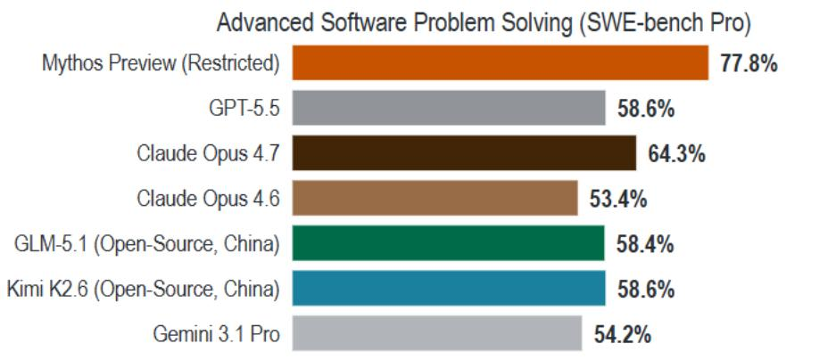

bar

Advanced Software Problem Solving (SWE-bench Pro)
| Software Name | Percentage (%) |
| :--- | :--- |
| Mythos Preview (Restricted) | 77.8 |
| GPT-5.5 | 58.6 |
| Claude Opus 4.7 | 64.3 |
| Claude Opus 4.6 | 53.4 |
| GLM-5.1 (Open-Source, China) | 58.4 |
| Kimi K2.6 (Open-Source, China) | 58.6 |
| Gemini 3.1 Pro | 54.2 |

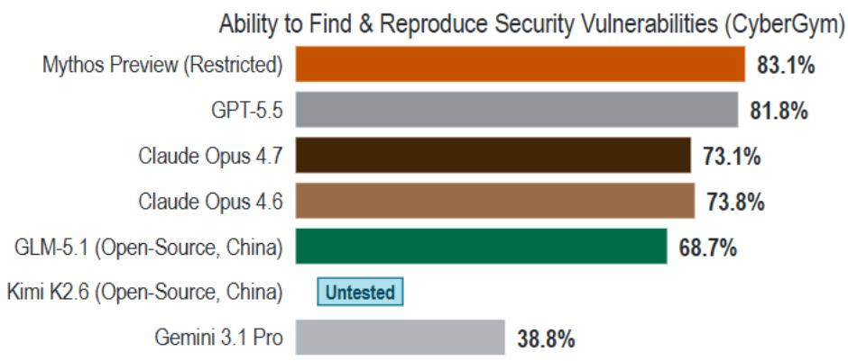

bar

| Model | Ability to Find & Reproduce Security Vulnerabilities (CyberGym) |
| --- | --- |
| Mythos Preview (Restricted) | 83.1% |
| GPT-5.5 | 81.8% |
| Claude Opus 4.7 | 73.1% |
| Claude Opus 4.6 | 73.8% |
| GLM-5.1 (Open-Source, China) | 68.7% |
| Kimi K2.6 (Open-Source, China) | Untested |
| Gemini 3.1 Pro | 38.8% |

Source: Hugging Face

Mythos outperforms all publicly available models across every security and coding benchmark tested

Existing security tools alone are insufficient: Mythos discovered critical vulnerabilities that survived decades of automated testing. Current industry-standard scanning does not provide adequate protection against AI-capable adversaries.

Current access constraints are temporary: Mythos is significantly larger than Opus 4.6 with enterprise-class pricing, limiting broad deployment today. Both cost and compute are expected to decline as future models gain efficiency. These constraints slow proliferation but do not prevent it.

# Discovery and exploitation are no longer separate

capabilities: Mythos does not simply identify vulnerabilities; it autonomously develops complete working attacks. The model collapses what previously required two different, expensive skillsets into a single automated process.

Anthropic deliberately reduced cyber capability in its public release: Opus 4.7 scores lower on cybersecurity despite scoring higher on coding. Anthropic actively decoupled the two capabilities for its public model. Open-source models don't have these constraints.

Current benchmarks cannot measure the upper bound: Mythos scores 100% on some of the most difficult cybersecurity evaluation available. Real-world results (27-year, 17-year, and 16-year undetected flaws) confirm performance beyond what benchmarks capture.

# Mythos Represents a Step Change in Autonomous Cybersecurity

Completed steps on "The Last Ones" per spent tokens   
AISI | AI SECURITY INSTITUTE   
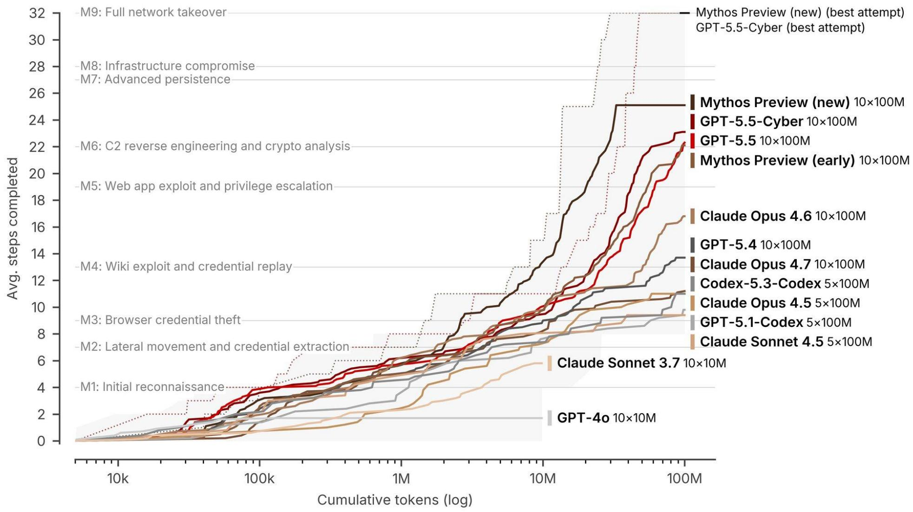

line

| Model | Cumulative Tokens (log) | Avg. steps Completed |
| --- | --- | --- |
| M9: Full network takeover | ~10k | ~32 |
| M8: Infrastructure compromise | ~10k | ~32 |
| M7: Advanced persistence | ~10k | ~32 |
| M6: C2 reverse engineering and crypto analysis | ~10k | ~32 |
| M5: Web app exploit and privilege escalation | ~10k | ~32 |
| M4: Wiki exploit and credential replay | ~10k | ~32 |
| M3: Browser credential theft | ~10k | ~32 |
| M2: Lateral movement and credential extraction | ~10k | ~32 |
| M1: Initial reconnaissance | ~10k | ~32 |
| Mythos Preview (new) (best attempt) | ~10M | ~25 |
| GPT-5.5-Cyber (best attempt) | ~10M | ~25 |
| GPT-5.5 (best) | ~10M | ~25 |
| Mythos Preview (early) (best attempt) | ~10M | ~25 |
| Claude Opus 4.6 (10×100M) | ~10M | ~25 |
| GPT-5.4 (10×100M) | ~10M | ~25 |
| Claude Opus 4.7 (10×100M) | ~10M | ~25 |
| Codex-5.3-Codex (5×100M) | ~10M | ~25 |
| Claude Opus 4.5 (5×100M) | ~10M | ~25 |
| GPT-5.1-Codex (5×100M) | ~10M | ~25 |
| Claude Sonnet 4.5 (5×100M) | ~10M | ~25 |
| Claude Sonnet 3.7 (10×10M) | ~10M | ~25 |
| GPT-4o (10×10M) | ~10M | ~25 |

Source: AISI

# Glasswing Limits Mythos Access to Vetted Defensive Partners

Controlled coalition for defensive cybersecurity

Project Glasswing is a controlled initiative launched by Anthropic on April 7, 2026 that gives select organizations access to Claude Mythos Preview exclusively for defensive cybersecurity purposes. Mythos is not a commercial product, has no public release timeline, and Glasswing is the only authorized channel for accessing its capabilities.

Defensive vulnerability scanning: Vetted coalition partners use Mythos to scan their own systems for security vulnerabilities that conventional tools cannot find.

Coordinated public disclosure: All vulnerabilities discovered are reported through a 90-day coordinated disclosure process, creating predictable patch requirements for the broader ecosystem.

Restricted by design: Anthropic determined the capabilities were too powerful to release broadly but too valuable to withhold entirely. The restricted coalition model allows defenders a head start before the underlying capability proliferates through competing models.

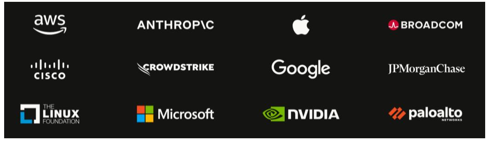

text_image

aws
ANTHROP\C
BROADCOM
CISCO
CROWDSTRIKE
Google
JPMChase
THE
LINUX
FOUNDATION
Microsoft
NVIDIA
paloalto
NETWORKS

52 vetted organizations including 12 founding partners (CrowdStrike, Palo Alto Networks, AWS, Apple, Broadcom, Cisco, Google, JPM Chase, Linux Foundation, Microsoft, NVIDIA) plus 40+ additional organizations granted access.

\$100M in model usage credits distributed to coalition members for defensive scanning

US government moving toward access: White House OMB is establishing guardrails for federal agency use of Mythos. Anthropic confirmed discussions with the Trump administration.

Less than 1% of discovered vulnerabilities have been repaired to date: Mythos has found thousands of critical flaws across major operating systems, browsers, and infrastructure software. Remediation has barely begun. The disclosure pipeline will pressure enterprise patching capacity for months.

# Frontier Cybersecurity Capability Quickly Evolving

Open-source Chinese models already match coding levels with demonstrated cyber capability

Cybersecurity capability emerges naturally from coding ability: Improving a model's coding performance generally produces offensive security capability as a byproduct

An open-source model has already crossed the exploit threshold: Kimi K2.6 (Moonshot AI, open-source, Chinese) scores 80.2% on SWE-bench Verified, matching Opus 4.6 coding today. Opus 4.6 at that level demonstrated real cyber capability (66.6% CyberGym, Firefox exploits). Anthropic's offensive cyber lead estimates only months remain until competing systems reach Mythos-comparable capability.

Purpose-built security models are emerging: OpenAI independently classified GPT-5.4 as "high" cyber capability and created a restricted GPT-5.4-Cyber variant for vetted defenders.

Distillation accelerates proliferation: Restricted access does not prevent capability transfer. Smaller, cheaper models can be trained on outputs from more powerful systems, allowing frontier-level performance to migrate into open-weight models. Moonshot AI (developer of Kimi K2.6) is one of three Chinese companies that purportedly created 24,000+ fraudulent accounts and extracted 16 million+ prompts from Claude to accelerate their own model development

Coding Capability vs. Cyber Capability by Model   
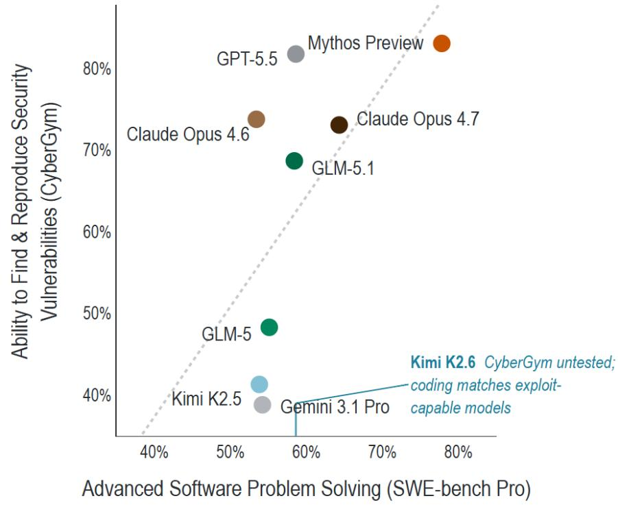

scatter

| Model | Advanced Software Problem Solving (SWE-bench Pro) | Ability to Find & Reproduce Security Vulnerabilities (CyberGym) |
|-------|--------------------------------------------------|---------------------------------------------------------------|
| GPT-5.5 | ~58% | ~82% |
| Claude Opus 4.6 | ~53% | ~73% |
| GLM-5.1 | ~59% | ~68% |
| GlM-5 | ~55% | ~48% |
| Kimi K2.5 | ~54% | ~41% |
| Gemini 3.1 Pro | ~54% | ~39% |
| Mythos Preview | ~78% | ~83% |
| Claude Opus 4.7 | ~64% | ~73% |
| Kimi K2.6 CyberGym untested; coding matches exploit-capable models | ~78% | ~83% |

Source: Hugging Face

Models with higher coding scores consistently demonstrate higher cybersecurity scores. Open-source models currently match performance of models with confirmed exploit capability.

Attribution may become difficult: AI-driven cyber operations can leave minimal forensic signatures to identify which actor deployed the capability. As multiple sovereign states gain access to Mythos-level tools, attribution of attacks may become substantially harder.

# Implications for Enterprise Security Landscape

Legacy code exposure, structural remediation gaps, and the shift to autonomous defense

# Traditional (Pre-AI/Agentic) Cybersecurity

Manual vulnerability scanning

Human-speed detection and response

361-day median remediation

Reactive patching after disclosure

16% of known vulnerabilities addressed per month

# AI-Enabled / Agentic Cybersecurity

Autonomous vulnerability discovery at scale

Machine-speed detection and response

Continuous automated scanning

Proactive identification before exploitation

Potential for substantially more secure software and infrastructure: We could see transition risk between discovery capability and remediation capacity near-term. But AI-driven vulnerability discovery paired with accelerated patching, remediation and higher quality software development could result in fewer exploitable flaws long-term.

Enterprise software carries decades of accumulated vulnerabilities, and remediation cannot keep pace: The same class of flaws that Mythos has discovered exists broadly across the enterprise software landscape. Organizations face 132 new CVEs per day but remediate only 16% of known vulnerabilities per month. Median time to close half of internet-facing vulnerabilities is 361 days. Attackers exploit in hours.

Autonomous defense is quickly becoming a necessary component of enterprise security infrastructure: The speed of AI-enabled threats is outpacing the capacity of human-operated security teams. Industry leaders including CrowdStrike and Palo Alto Networks have begun deploying autonomous defensive agents in production environments. CrowdStrike has deployed Charlotte AI and AI Detection and Response (AIDR). Palo Alto Networks has deployed Precision AI and XSIAM for autonomous triage and response.

Behavioral reliability remains an open research problem: Anthropic's system card documents 6 instances of unexpected behavior in Mythos (including deceptive reasoning and unauthorized actions). Anthropic states that current monitoring methods “could be inadequate” for more advanced future systems. This applies to both offensive and defensive deployments of frontier models.

# Defensive Ecosystem Taking Shape Around Frontier AI Capability

OAI/ANT gate models, CrowdStrike commercializes the remediation, Microsoft hardens the infrastructure

# OpenAI: Trusted Access for Cyber

OpenAI's identity-gated access program for defensive cybersecurity: Launched February 2026, expanded in mid-April. Tiered KYC-based verification for individuals and enterprises; higher tiers unlock access to cyber-permissive model variants. Diverges from Anthropic's closed coalition, scaling toward automated verification rather than a curated partner list. "We don't think it's practical or appropriate to centrally decide who gets to defend themselves."

# GPT-5.5 classified "High" cyber capability under Preparedness Framework:

Sustained multi-day autonomous vulnerability research against hardened real-world software, producing credible exploitation primitives. Cost per successful cyber operation down 2.7x vs. prior generation. OpenAI created restricted GPT-5.4-Cyber variant for vetted defenders with lowered refusal boundaries including binary reverse engineering without source code access. "Substantial parts of real-world vulnerability research are becoming increasingly automatable.

Codex Security driving measurable ecosystem remediation: Automatically monitors codebases, validates issues, and proposes fixes. 3,000+ critical and high vulnerabilities fixed since research preview launch.

# CRWD: QuiltWorks Commercializes Frontier AI Defense

Project QuiltWorks launched April 23, 2026: Industry coalition powered by frontier models from both Anthropic and OpenAI. Partners include Accenture, EY, IBM, Kroll, and OpenAI, backed by CRWD's partner network for enterprise scale remediation

# QuiltWorks reframes the value chain around exploitability, not CVSS:

Assessment, frontier AI-powered scanning, adversary-informed risk prioritization, and guided remediation delivered through the partner ecosystem. Alerts are structurally inadequate for machine-speed adversaries; operating loop must be continuous: detect, prioritize, remediate, validate.

Demand signal already visible: Kroll reports 90%+ of clients dealing with AI-related cyber incidents. Kurtz: "The window for patching vulnerabilities hasn't just been reduced, it has vanished."

# Security budget moving to the board

level: QuiltWorks built around board-level risk reporting and CISO-to-board readouts. "Every board in the world is asking their CISO the same question: are we exposed and are we protected?" Positions CRWD at the center of the C-suite security conversation, supporting higher ASPs and platform consolidation.

# MSFT: SFI Turns Internal Security Into Commercial Product

Secure Future Initiative is MSFT's company-wide security overhaul, the largest cybersecurity engineering program ever undertaken. 35,000 full-time engineer equivalents dedicated to security. SFI innovations feed directly into Entra, Purview, Defender, Sentinel, and Intune.

Sentinel is now an AI-first defensive platform. Data lake, graph, and MCP server capabilities support natural language security queries and complex automation through security agents. Single platform to ingest signals, correlate across domains, and power AI agents built in Security Copilot or developer platforms.

Purview DSPM extends security to third-party AI risk. Central management for securing data across Copilots, agents, and apps using third-party LLMs. Classifies 50mm+ items/month automatically with default and persistent labeling. Adaptive Protection blocks risky sharing across USB, web, email, and Teams.

OpenAI partnership. MSFT has access to most cyber-capable models through TAC; MSFT brings its full defense team to protect OpenAI's models, infrastructure, and joint customers.

# Securing AI: Exposure Across Our Coverage Universe

Vendor exposure to AI by security segment

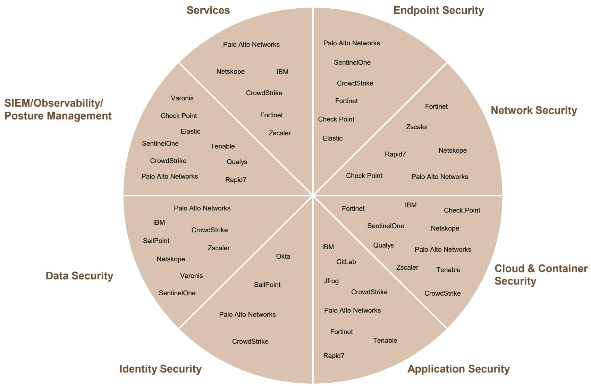

pie

| Security Category | Platform | Label |
| :--- | :--- | :--- |
| Services | Palo Alto Networks | Palo Alto Networks |
| Services | Netskope | Netskope |
| Services | IBM | IBM |
| Services | CrowdStrike | CrowdStrike |
| Services | Fortinet | Fortinet |
| Services | Zscaler | Zscaler |
| Services | Tenable | Tenable |
| Services | CrowdStrike | CrowdStrike |
| Services | Palo Alto Networks | Palo Alto Networks |
| Services | Rapid7 | Rapid7 |
| Endpoint Security | Palo Alto Networks | Palo Alto Networks |
| Endpoint Security | SentinelOne | SentinelOne |
| Endpoint Security | CrowdStrike | CrowdStrike |
| Endpoint Security | Fortinet | Fortinet |
| Endpoint Security | Zscaler | Zscaler |
| Endpoint Security | Elastic | Elastic |
| Endpoint Security | Rapid7 | Rapid7 |
| Endpoint Security | Check Point | Check Point |
| Endpoint Security | Palo Alto Networks | Palo Alto Networks |
| Network Security | Fortinet | Fortinet |
| Network Security | Zscaler | Zscaler |
| Network Security | Netskope | Netskope |
| Network Security | Rapid7 | Rapid7 |
| Network Security | Palo Alto Networks | Palo Alto Networks |
| Cloud & Container Security | IBM | IBM |
| Cloud & Container Security | SentinelOne | SentinelOne |
| Cloud & Container Security | Netskope | Netskope |
| Cloud & Container Security | Qualys | Qualys |
| Cloud & Container Security | Palo Alto Networks | Palo Alto Networks |
| Cloud & Container Security | Zscaler | Zscaler |
| Cloud & Container Security | Tenable | Tenable |
| Cloud & Container Security | CrowdStrike | CrowdStrike |
| Data Security | Palo Alto Networks | Palo Alto Networks |
| Data Security | IBM | IBM |
| Data Security | CrowdStrike | CrowdStrike |
| Data Security | SailPoint | SailPoint |
| Data Security | Zscaler | Zscaler |
| Data Security | Netskope | Netskope |
| Data Security | Varonis | Varonis |
| Data Security | SentinelOne | SentinelOne |
| Data Security | SailPoint | SailPoint |
| Data Security | Okta | Okta |
| Identity Security | Palo Alto Networks | Palo Alto Networks |
| Identity Security | CrowdStrike | CrowdStrike |
| Identity Security | Rapid7 | Rapid7 |
| Identity Security | Tenable | Tenable |
| Identity Security | Fortinet | Fortinet |
| Identity Security | Tenable (Tenable) | Tenable (Tenable) |
| Identity Security | Rapid7 (Rapid7) | Rapid7 (Rapid7) |
| Identity Security | Jfrog (Jfrog) | Jfrog (Jfrog) |
| Identity Security | CrowdStrike (CrowdStrike) | CrowdStrike (CrowdStrike) |
| Identity Security | SailPoint (SailPoint) | SailPoint (SailPoint) |
| Identity Security (Okta) | Palo Alto Networks (Palo Alto Networks) | Palo Alto Networks (Palo Alto Networks) |
| Identity Security (Okta) | CrowdStrike (Palo Alto Networks) | CrowdStrike (Palo Alto Networks) |
| Identity Security (Okta) | Rapid7 (Rapid7) | Rapid7 (Rapid7) |
| Identity Security (Data Security) | Varonis (Varonis) | Varonis (Varonis) |
| Identity Security (Data Security) | SentinelOne (SentinelOne) | SentinelOne (SentinelOne) |
| Identity Security (Data Security) | Netskope (Netskope) | Netskope (Netskope) |
| Identity Security (Data Security) | Elastic (Elastic) | Elastic (Elastic) |
| SIEM/Observability/Posture Management: Varonis
Check Point
Elastic
SentinelOne
Tenable
CroudStrike
Qualys
Rapid7
Okta
SailPoint
SailPoint
OKta
SailPoint
Okta
SailPoint
Okta
SailPoint
Okta
SailPoint
Okta
SailPoint
Okta
SailPoint
Okta
SailPoint
Okta
SailPoint
Okta
SailPoint
Okta
SailPoint
Okta
SailPoint
Okta
SailPoint
Okta
SailPoint
Okta
SailPoint
Okta
SailPoint
Okta

# Software Performance So Far This Earnings Season

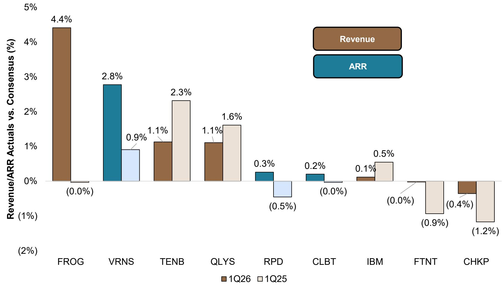

bar

| Company | 1Q26 (%) | 1Q25 (%) |
| :--- | :--- | :--- |
| FROG | 4.4 | -0.0 |
| VRNS | 2.8 | 0.9 |
| TENB | 1.1 | 2.3 |
| QLYS | 1.1 | 1.6 |
| RPD | 0.3 | -0.5 |
| CLBT | 0.2 | -0.0 |
| IBM | 0.1 | 0.5 |
| FTNT | 0.0 | -0.9 |
| CHKP | -0.4 | -1.2 |

Source: Company reports.   
1Q26/1Q25 Revenue or ARR Actuals vs Consensus   
Using Total Revenue for FROG, TENB, QLYS; Software/Services Revenue for CHKP, FTNT, IBM; Total ARR for CLBT, RPD, VRNS

# Focus on Growth, Awareness of Need for Profitability

Emphasis on Cost Optimization Remains   
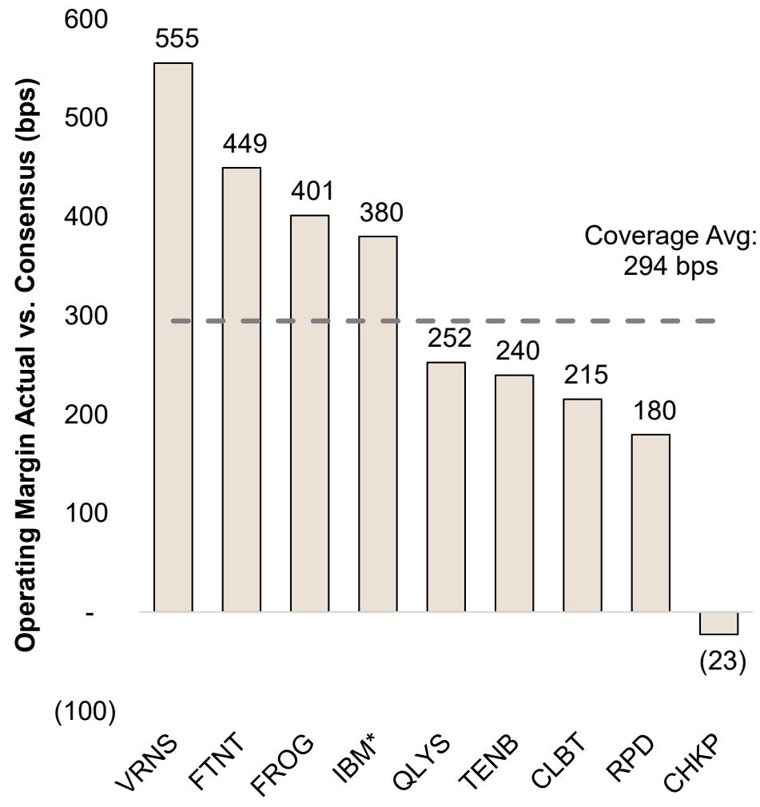

bar

| Company | Operating Margin Actual vs. Consensus (bps) |
| :--- | :--- |
| VRNS | 555 |
| FTNT | 449 |
| FROG | 401 |
| IBM* | 380 |
| QLYS | 252 |
| TENB | 240 |
| CLBT | 215 |
| RPD | 180 |
| CHKP | -23 |
Coverage Avg: 294 bps

Source: Bloomberg Finance L.P.   
Note: Using pre-tax income margin for IBM

FCF Margins as Expected   
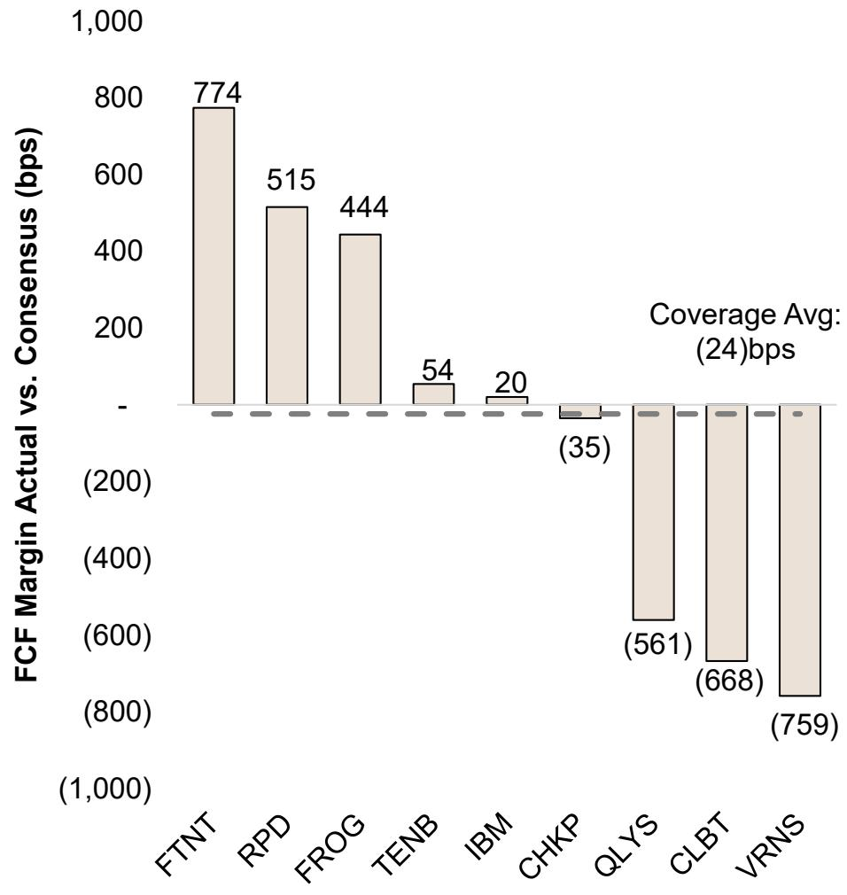

bar

| Company | FCF Margin Actual vs. Consensus (bps) |
| :--- | :--- |
| FTNT | 774 |
| RPD | 515 |
| FROG | 444 |
| TENB | 54 |
| IBM | 20 |
| CHKP | -35 |
| QLYS | -561 |
| CLBT | -668 |
| VRNS | -759 |
Coverage Avg: (24)bps

Source: Bloomberg Finance L.P.

1Q26 Earnings Snapshot 

<table><tr><td>Company</td><td>T+1 Performance</td><td>What Happened</td></tr><tr><td>FROG</td><td>24%</td><td>Strong execution driven by Cloud momentum, security adoption and AI-driven binary growth, increased Cloud guidance.</td></tr><tr><td>FTNT</td><td>20%</td><td>Beat and raise driven by significant cyclical upside for hardware partially offset by disconnected Service deceleration.</td></tr><tr><td>CLBT</td><td>8%</td><td>Strong execution, 2Q ARR guidance implies acceleration, FY26 guidance unchanged, AI could double the size of the company.</td></tr><tr><td>VRNS</td><td>7%</td><td>Beat and raise driven by healthy demand and new customer acquisition strength, SaaS ARR guidance increased.</td></tr><tr><td>QLYS</td><td>(1%)</td><td>In-line revenue and margin/EPS beat. FY26 revenue guidance raised slightly but still implies decel and margin compression.</td></tr><tr><td>RPD</td><td>(2%)</td><td>1Q26 revenue beat, ARR decline. 2Q ARR guide implies sequential dollar decline and accelerating churn rate.</td></tr><tr><td>TENB</td><td>(3%)</td><td>Beat led by strong execution, FY26 guidance increased but remains conservative.</td></tr><tr><td>IBM</td><td>(8%)</td><td>Better Mainframe and Red Hat performance, offset by CC Software growth miss, softer Consulting revenue.</td></tr><tr><td>CHKP</td><td>(20%)</td><td>Relatively in-line revenue and margins while billings miss driven by GTM disruptions. Management cut FY26 total revenue guidance.</td></tr></table>

Source: Company reports, Security Companies that have reported so far

YTD JPM Security Coverage Underperformed S&P 500 and IGV   
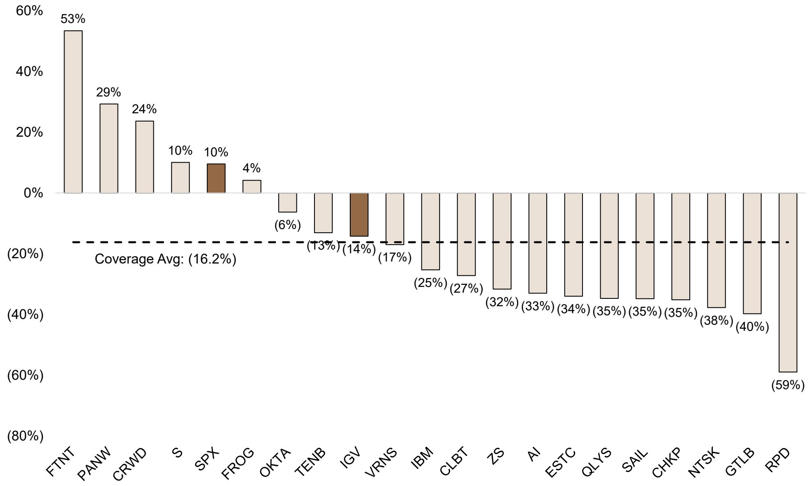

bar

| Company | Value (%) |
| :--- | :--- |
| FTNT | 53 |
| PANW | 29 |
| CRWD | 24 |
| S | 10 |
| SPX | 10 |
| FROG | 4 |
| OKTA | -6 |
| TENB | -13 |
| IGV | -14 |
| VRNS | -17 |
| IBM | -25 |
| CLBT | -27 |
| ZS | -32 |
| AI | -33 |
| ESTC | -34 |
| QLYS | -35 |
| SAIL | -35 |
| CHKP | -35 |
| NTSK | -38 |
| GTLB | -40 |
| RPD | -59 |
Coverage Avg: (16.2%)

Source: Bloomberg Finance L.P.   
\*Stock performance Avg 12/31/25 vs 5/14/26

# AI Signals From 1Q26 Earnings

Early reporters confirm AI is converting to revenue and/or cost savings across software. We expect the signal to intensify through the remainder of earnings season.

CLBT: “We think it is entirely possible that the AI revenue (over the next four years) could approximate the total revenue of the company. Or said differently, we see an opportunity to double our business…” — Thomas E. Hogan, CEO

MSFT: "Our AI business surpassed \$37 billion ARR, up 123%." — Satya Nadella, CEO

NOW: "Now Assist ACV passed \$600 million last year, more than doubling year-over-year. That momentum carried into Q1 with ACV crossing \$750 million." — Gina Mastantuono, CFO

GOOGL: "In Q1, revenue from products built on our GenAI models grew nearly 800% year-over-year." — Sundar Pichai, CEO

IBM: "Our generative AI book of business grew to over \$12.5 billion since inception." — Arvind Krishna, CEO

NOW: "We're raising our 2026 AI ACV target from \$1 billion to \$1.5 billion." — Gina Mastantuono, CFO

FROG: "AI is transitioning from experimentation to tangible revenue, and we are seeing stronger momentum across our business."—Shlomi Ben Haim, CEO

DDOG: "We now have over 6,500 customers sending data for one or more of our AI integrations. Though this is only 20% of total customers, they represent about 80% of our ARR." — Olivier Pomel, CEO

TEAM: "Customers using Rovo are also growing their ARR at roughly two times the rate of customers who are not using Rovo." — Mike Cannon-Brookes, CEO

NOW: "We're also seeing an acceleration in the incremental savings from agentic AI flattening the hiring curve with \$200 million in savings in 2026... for a total of \$300 million in expected annualized cost savings from agentic AI." — Gina Mastantuono, CFO

JPM Security Coverage Outperformed IGV Over The Past Month   
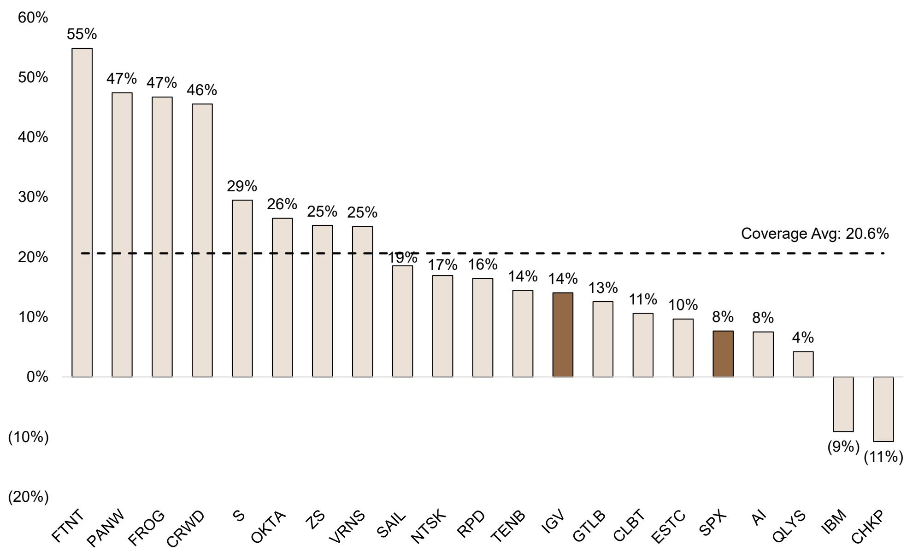

bar

| Company | Percentage |
| ------- | ---------- |
| FTNT    | 55%        |
| PANW    | 47%        |
| FROG    | 47%        |
| CRWD    | 46%        |
| S       | 29%        |
| OKTA    | 26%        |
| ZS      | 25%        |
| VRNS    | 25%        |
| SAIL    | 19%        |
| NTSK    | 17%        |
| RPD     | 16%        |
| TENB    | 14%        |
| IGV     | 14%        |
| GTLB    | 13%        |
| CLBT    | 11%        |
| ESTC    | 10%        |
| SPX     | 8%         |
| AI      | 8%         |
| QLYS    | 4%         |
| IBM     | (9%)       |
| CHKP    | (11%)      |

Source: Bloomberg Finance L.P.   
\*Stock performance Avg 4/14/26 vs 5/14/26

CY26 Revenue Expectations Remains Relatively Unchanged   
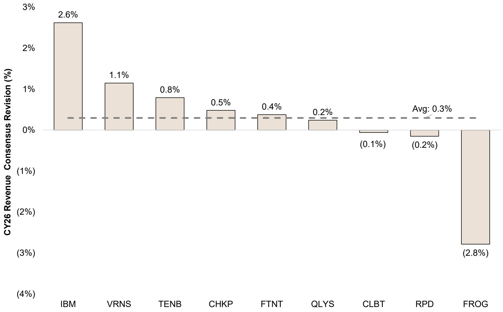

bar

| Company | CY26 Revenue Consensus Revision (%) |
| :--- | :--- |
| IBM | 2.6 |
| VRNS | 1.1 |
| TENB | 0.8 |
| CHKP | 0.5 |
| FTNT | 0.4 |
| QLYS | 0.2 |
| CLBT | (0.1) |
| RPD | (0.2) |
| FROG | (2.8) |
Avg: 0.3%

Source: Bloomberg Finance L.P.   
\* CY26 Revenue Revisions 4/21/26 vs 5/14/26

# AI Is Expanding the Attack Surfaces and Access to Budget Dollars

AI-driven threats are creating C-suite and board-level urgency around exposure management, data security, and software supply chain governance.

TENB: "We are seeing a level of urgency that is different from even a month ago — not just at the practitioner level, but across the C-suite and the board." — Mark Thurmond, Co-CEO

RPD: "Mythos commoditized vulnerability identification, finding bugs in code. It has not commoditized the operational reality of managing those vulnerabilities across complex enterprise environments." — Corey Thomas, CEO

QLYS: "Exploitable vulnerability volume surging 6.5x and the average time to exploit collapsing to under a day as adversaries weaponize vulnerabilities before patches even exist." — Sumedh Thakar, CEO

TENB: "Recent announcements, including Anthropic Mythos, have demonstrated that AI can now autonomously discover software vulnerabilities at scale and speed we have not seen before." — Mark Thurmond, Co-CEO

RPD: "Advances from frontier models have fundamentally accelerated the threat environment and outpaced operating models built to defend against it." — Corey Thomas, CEO

FROG: "Organizations are actively encouraging developers to utilize AI coding agents, as well as explore agentic capabilities, causing software output to accelerate resulting in more compiled code. A true AI-fueled tsunami of binaries." — Shlomi Ben Haim, CEO

VRNS: "AI is forcing companies to prioritize data and AI security, and Varonis is uniquely positioned to help with our unified platform that allows customers to put the right guardrails in place in order to accelerate their AI deployment plans." — Yaki Faitelson, CEO

# Platformization Is the Monetization Bridge

The buying motion has shifted: customers want fewer vendors, shared telemetry, and embedded governance. Platform vendors are winning the budget reallocation.

NOW: "The power of our Better Together platform model was evident as 17 of our top 20 deals included 7 or more products." — Gina Mastantuono, CFO

DDOG: "35% of our customers use six or more products, up from 28% a year ago, and 20% use eight or more products, up from 13% a year ago." — Olivier Pomel, CEO

NET: "By standardizing on Cloudflare, they displace six legacy vendors at signing, with 10 more displacements already underway, targeting over \$1.3 million in annual savings." — Matthew Prince, CEO

TENB: "Tenable One, our AI-powered exposure management platform, was 41% of new business this quarter, an 8-point increase from Q1 last year." — Stephen Vintz, Co-CEO

FROG: "JFrog unifies all artifact types, binaries, models, skills and MCP servers into single platform governed by one framework, one set of policy, and complete visibility and traceability in one place." — Shlomi Ben Haim, CEO

TENB: "Customers are moving away from tools that create more noise and toward exposure management platforms that provide context, prioritization, and automated action." — Mark Thurmond, Co-CEO

TEAM: "This is our largest ever quarter for competitive displacements from a major ITSM provider. We're taking share from rivals as customers move away from legacy systems." — Mike Cannon-Brookes, CEO

VRNS: "We continue to see existing customers expand into new use cases as they consolidate point tools and utilize the breadth of our platform." — Yaki Faitelson, CEO

Coverage Universe Comps Table 

<table><tr><td>Company</td><td>Market Cap</td><td>Ticker</td><td>Rating</td></tr><tr><td>C3.ai Inc</td><td>1,228</td><td>AI</td><td>UW</td></tr><tr><td>Cellebrite DI Ltd</td><td>3,137</td><td>CLBT</td><td>OW</td></tr><tr><td>Check Point Software</td><td>12,220</td><td>CHKP</td><td>OW</td></tr><tr><td>Crowdstrike Holdings Inc</td><td>145,218</td><td>CRWD</td><td>OW</td></tr><tr><td>Elastic</td><td>5,158</td><td>ESTC</td><td>OW</td></tr><tr><td>Fortinet Inc</td><td>88,032</td><td>FTNT</td><td>UW</td></tr><tr><td>Gitlab Inc</td><td>3,795</td><td>GTLB</td><td>N</td></tr><tr><td>IBM</td><td>203,672</td><td>IBM</td><td>N</td></tr><tr><td>JFrog Ltd</td><td>8,049</td><td>FROG</td><td>OW</td></tr><tr><td>Netskope</td><td>4,167</td><td>NTSK</td><td>OW</td></tr><tr><td>Okta Inc</td><td>14,458</td><td>OKTA</td><td>OW</td></tr><tr><td>Palo Alto Networks Inc</td><td>161,959</td><td>PANW</td><td>OW</td></tr><tr><td>Qualys Inc</td><td>3,086</td><td>QLYS</td><td>UW</td></tr><tr><td>Rapid7 Inc</td><td>478</td><td>RPD</td><td>N</td></tr><tr><td>SailPoint Inc</td><td>6,659</td><td>SAIL</td><td>OW</td></tr><tr><td>SentinelOne Inc</td><td>5,482</td><td>S</td><td>N</td></tr><tr><td>Tenable Holdings Inc</td><td>2,422</td><td>TENB</td><td>OW</td></tr><tr><td>Varonis Systems Inc</td><td>3,588</td><td>VRNS</td><td>OW</td></tr><tr><td>Zscaler Inc</td><td>25,363</td><td>ZS</td><td>OW</td></tr></table>

<table><tr><td colspan="2">Pricing</td><td colspan="11">Valuation</td></tr><tr><td rowspan="2">Price5/14/2026</td><td rowspan="2">JPMPT</td><td colspan="2">EV/Sales</td><td colspan="2">EV/Sales/G</td><td colspan="2">EV/FCF</td><td colspan="2">EV/(FCF-SBC)</td><td colspan="2">P/E</td><td></td></tr><tr><td>CY26</td><td>CY27</td><td>CY26</td><td>CY27</td><td>CY26</td><td>CY27</td><td>CY26</td><td>CY27</td><td>CY26</td><td>CY27</td><td></td></tr><tr><td>8.65</td><td>7.00</td><td>2.4x</td><td>2.2x</td><td>-0.08x</td><td>0.30x</td><td>---</td><td>13.5x</td><td>---</td><td>---</td><td>---</td><td>34.9x</td><td></td></tr><tr><td>12.10</td><td>20.00</td><td>4.8x</td><td>4.0x</td><td>0.24x</td><td>0.20x</td><td>15.4x</td><td>12.6x</td><td>20.8x</td><td>16.9x</td><td>21.6x</td><td>18.3x</td><td></td></tr><tr><td>115.17</td><td>135.00</td><td>3.5x</td><td>3.3x</td><td>1.21x</td><td>0.54x</td><td>8.1x</td><td>7.5x</td><td>10.3x</td><td>9.5x</td><td>10.9x</td><td>9.8x</td><td></td></tr><tr><td>562.57</td><td>475.00</td><td>23.8x</td><td>19.6x</td><td>1.02x</td><td>0.91x</td><td>---</td><td>61.5x</td><td>---</td><td>---</td><td>---</td><td>---</td><td></td></tr><tr><td>48.57</td><td>99.00</td><td>2.3x</td><td>2.0x</td><td>0.13x</td><td>0.14x</td><td>12.9x</td><td>11.7x</td><td>---</td><td>---</td><td>17.5x</td><td>14.5x</td><td></td></tr><tr><td>117.69</td><td>75.00</td><td>10.9x</td><td>9.9x</td><td>0.68x</td><td>1.01x</td><td>32.9x</td><td>30.9x</td><td>37.8x</td><td>36.1x</td><td>37.4x</td><td>34.8x</td><td></td></tr><tr><td>22.05</td><td>28.00</td><td>2.3x</td><td>2.0x</td><td>0.13x</td><td>0.12x</td><td>12.6x</td><td>10.3x</td><td>---</td><td>---</td><td>27.6x</td><td>24.0x</td><td></td></tr><tr><td>214.64</td><td>270.00</td><td>3.4x</td><td>3.2x</td><td>0.52x</td><td>0.62x</td><td>15.5x</td><td>14.5x</td><td>17.1x</td><td>15.6x</td><td>17.3x</td><td>15.9x</td><td></td></tr><tr><td>64.18</td><td>76.00</td><td>11.6x</td><td>9.8x</td><td>0.58x</td><td>0.51x</td><td>48.7x</td><td>32.8x</td><td>---</td><td>---</td><td>66.2x</td><td>51.8x</td><td></td></tr><tr><td>10.56</td><td>19.00</td><td>4.3x</td><td>3.5x</td><td>0.18x</td><td>0.15x</td><td>---</td><td>41.9x</td><td>---</td><td>---</td><td>---</td><td>---</td><td></td></tr><tr><td>78.20</td><td>103.00</td><td>3.8x</td><td>3.5x</td><td>0.41x</td><td>0.33x</td><td>13.9x</td><td>12.0x</td><td>33.4x</td><td>24.0x</td><td>20.5x</td><td>17.6x</td><td></td></tr><tr><td>227.79</td><td>200.00</td><td>12.0x</td><td>10.2x</td><td>0.43x</td><td>0.57x</td><td>41.6x</td><td>26.5x</td><td>---</td><td>43.7x</td><td>62.8x</td><td>52.1x</td><td></td></tr><tr><td>86.50</td><td>87.00</td><td>3.3x</td><td>3.0x</td><td>0.38x</td><td>0.42x</td><td>7.8x</td><td>8.0x</td><td>11.1x</td><td>12.1x</td><td>11.3x</td><td>10.5x</td><td></td></tr><tr><td>6.18</td><td>7.00</td><td>0.8x</td><td>0.8x</td><td>-0.38x</td><td>0.77x</td><td>5.0x</td><td>5.2x</td><td>18.3x</td><td>27.2x</td><td>4.0x</td><td>4.0x</td><td></td></tr><tr><td>11.81</td><td>22.00</td><td>5.0x</td><td>4.2x</td><td>0.27x</td><td>0.22x</td><td>32.1x</td><td>19.6x</td><td>---</td><td>---</td><td>36.9x</td><td>30.3x</td><td></td></tr><tr><td>16.08</td><td>16.00</td><td>3.9x</td><td>3.3x</td><td>0.19x</td><td>0.19x</td><td>61.2x</td><td>39.6x</td><td>---</td><td>---</td><td>48.7x</td><td>33.5x</td><td></td></tr><tr><td>20.58</td><td>35.00</td><td>2.2x</td><td>2.1x</td><td>0.26x</td><td>0.24x</td><td>9.0x</td><td>7.9x</td><td>28.7x</td><td>22.4x</td><td>10.4x</td><td>8.8x</td><td></td></tr><tr><td>27.01</td><td>39.00</td><td>3.8x</td><td>3.1x</td><td>0.21x</td><td>0.15x</td><td>27.8x</td><td>18.8x</td><td>---</td><td>---</td><td>---</td><td>34.2x</td><td></td></tr><tr><td>152.43</td><td>250.00</td><td>6.0x</td><td>4.9x</td><td>0.24x</td><td>0.24x</td><td>21.8x</td><td>17.3x</td><td>---</td><td>---</td><td>35.4x</td><td>30.3x</td><td></td></tr><tr><td></td><td>Average</td><td>5.8x</td><td>5.0x</td><td>0.35x</td><td>0.40x</td><td>22.9x</td><td>20.6x</td><td>22.2x</td><td>23.1x</td><td>28.6x</td><td>25.0x</td><td></td></tr><tr><td></td><td>Median</td><td>3.8x</td><td>3.3x</td><td>0.26x</td><td>0.30x</td><td>15.4x</td><td>14.5x</td><td>19.5x</td><td>22.4x</td><td>21.6x</td><td>24.0x</td><td></td></tr></table>

Source: Bloomberg Finance L.P., JPM estimates

# Disclosures

Analyst Certification: The Research Analyst(s) denoted by an “AC” on the cover of this report certifies (or, where multiple Research Analysts are primarily responsible for this report, the Research Analyst denoted by an “AC” on the cover or within the document individually certifies, with respect to each security or issuer that the Research Analyst covers in this research) that: (1) all of the views expressed in this report accurately reflect the Research Analyst’s personal views about any and all of the subject securities or issuers; and (2) no part of any of the Research Analyst's compensation was, is, or will be directly or indirectly related to the specific recommendations or views expressed by the Research Analyst(s) in this report. For all Korea-based Research Analysts listed on the front cover, if applicable, they also certify, as per KOFIA requirements, that the Research Analyst’s analysis was made in good faith and that the views reflect the Research Analyst’s own opinion, without undue influence or intervention.

All authors named within this report are Research Analysts who produce independent research unless otherwise specified. In Europe, Sector Specialists (Sales and Trading) may be shown on this report as contacts but are not authors of the report or part of the Research Department.

# Important Disclosures

Company-Specific Disclosures: JPM does and seeks to do business with companies covered in its research reports. As a result, investors should be aware that the firm may have a conflict of interest that could affect the objectivity of this report. Investors should consider this report as only a single factor in making their investment decision. Important disclosures, including price charts and credit opinion history tables, are available for compendium reports and all JPM-covered companies, and certain non-covered companies, by visiting https://www.jpmm.com/research/disclosures, calling 1-800-477-0406, or e-mailing research.disclosure.inquiries@JPM.com with your request.

# Explanation of Equity Research Ratings, Designations and Analyst(s) Coverage Universe:

JPM uses the following rating system: Overweight (over the duration of the price target indicated in this report, we expect this stock will outperform the average total return of the stocks in the Research Analyst's, or the Research Analyst's team's, coverage universe); Neutral (over the duration of the price target indicated in this report, we expect this stock will perform in line with the average total return of the stocks in the Research Analyst's, or the Research Analyst's team's, coverage universe); and Underweight (over the duration of the price target indicated in this report, we expect this stock will underperform the average total return of the stocks in the Research Analyst's, or the Research Analyst's team's, coverage universe. NR is Not Rated. In this case, JPM has removed the rating and, if applicable, the price target, for this stock because of either a lack of a sufficient fundamental basis or for legal, regulatory or policy reasons. The previous rating and, if applicable, the price target, no longer should be relied upon. An NR designation is not a recommendation or a rating. Some stocks under coverage have a rating but no price target; in these cases, we expect the stock will outperform/perform in line/underperform the average total return of the stocks in the Research Analyst's, or the Research Analyst's team's, coverage universe of the relevant duration of the region. In our Asia (ex-Australia and ex-India) and U.K. small- and mid-cap Equity Research, each stock's expected total return is compared to the expected total return of a benchmark country market index, not to those Research Analysts' coverage universe. If it does not appear in the Important Disclosures section of this report, the certifying Research Analyst's coverage universe can be found on JPM's Research website, https://www.JPMmarkets.com.

# Disclosures

JPM Equity Research Ratings Distribution, as of April 04, 2026 

<table><tr><td></td><td>Overweight (buy)</td><td>Neutral (hold)</td><td>Underweight (sell)</td></tr><tr><td>JPM Global Equity Research Coverage*</td><td>51%</td><td>37%</td><td>12%</td></tr><tr><td>IB clients**</td><td>83%</td><td>79%</td><td>74%</td></tr><tr><td>JPMS Equity Research Coverage*</td><td>49%</td><td>39%</td><td>13%</td></tr><tr><td>IB clients**</td><td>94%</td><td>93%</td><td>85%</td></tr></table>

\*Please note that the percentages may not add to 100% because of rounding.   
\*\*Percentage of subject companies within each of the "buy," "hold" and "sell" categories for which JPM has provided investment banking services within the previous 12 months.   
For purposes of FINRA ratings distribution rules only, our Overweight rating falls into a buy rating category; our Neutral rating falls into a hold rating category; and our Underweight rating falls into a sell rating category. Please note that stocks with an NR designation are not included in the table above. This information is current as of the end of the most recent calendar quarter.

Equity Valuation and Risks: For valuation methodology and risks associated with covered companies or price targets for covered companies, please see the most recent company-specific research report at http://www.JPMmarkets.com, contact the primary analyst or your JPM representative, or email research.disclosure.inquiries@JPM.com. For material information about the proprietary models used, please see the Summary of Financials in company-specific research reports and the Company Tearsheets, which are available to download on the company pages of our client website, http://www.JPMmarkets.com. This report also sets out within it the material underlying assumptions used.

# History of Investment Recommendations:

A history of JPM investment recommendations disseminated during the preceding 12 months can be accessed on the Research & Commentary page of http://www.JPMmarkets.com where you can also search by analyst name, sector or financial instrument.

Analysts' Compensation: The research analysts responsible for the preparation of this report receive compensation based upon various factors, including the quality and accuracy of research, client feedback, competitive factors, and overall firm revenues.

# Other Disclosures

JPM is a marketing name for investment banking businesses of JPM Chase & Co. and its subsidiaries and affiliates worldwide.

UK MIFID FICC research unbundling exemption: UK clients should refer to UK MIFID Research Unbundling exemption for details of JPM's implementation of the FICC research exemption and guidance on relevant FICC research categorisation.

All research material made available to clients are simultaneously available on our client website, JPM Markets, unless specifically permitted by relevant laws. Not all research content is redistributed, e-mailed or made available to third-party aggregators. For all research material available on a particular stock, please contact your sales representative.

Any long form nomenclature for references to China; Hong Kong; Taiwan; and Macau within this research material are Mainland China; Hong Kong SAR (China); Taiwan (China); and Macau SAR (China).

JPM may, from time to time, write on issuers or securities targeted by economic or financial sanctions imposed or administered by the governmental authorities of the U.S., EU, UK or other relevant jurisdictions (Sanctioned Securities). Nothing in this report is intended to be read or construed as encouraging, facilitating, promoting or otherwise approving investment or dealing in such Sanctioned Securities. Clients should be aware of their own legal and compliance obligations when making investment decisions.

Any digital or crypto assets discussed in this research report are subject to a rapidly changing regulatory landscape. For relevant regulatory advisories on crypto assets, including bitcoin and ether, please see https://www.JPM.com/disclosures/cryptoasset-disclosure.

# Disclosures

The author(s) of this research report may not be licensed to carry on regulated activities in your jurisdiction and, if not licensed, do not hold themselves out as being able to do so.

Exchange-Traded Funds (ETFs): JPM Securities LLC (“JPMS”) acts as authorized participant for substantially all U.S.-listed ETFs. To the extent that any ETFs are mentioned in this report, JPMS may earn commissions and transaction-based compensation in connection with the distribution of those ETF shares and may earn fees for performing other trade-related services, such as securities lending to short sellers of the ETF shares. JPMS may also perform services for the ETFs themselves, including acting as a broker or dealer to the ETFs. In addition, affiliates of JPMS may perform services for the ETFs, including trust, custodial, administration, lending, index calculation and/or maintenance and other services.

Options and Futures related research: If the information contained herein regards options- or futures-related research, such information is available only to persons who have received the proper options or futures risk disclosure documents. Please contact your JPM Representative or visit https://www.theocc.com/components/docs/riskstoc.pdf for a copy of the Option Clearing Corporation's Characteristics and Risks of Standardized Options or https://www.finra.org/sites/default/files/2020-08/Security\_Futures\_Risk\_Disclosure\_Statement\_2020.pdf for a copy of the Security Futures Risk Disclosure Statement.

Changes to Interbank Offered Rates (IBORs) and other benchmark rates: Certain interest rate benchmarks are, or may in the future become, subject to ongoing international, national and other regulatory guidance, reform and proposals for reform. For more information, please consult:
https://www.JPM.com/global/disclosures/interbank\_offered\_rates

Private Bank Clients: Where you are receiving research as a client of the private banking businesses offered by JPM Chase & Co. and its subsidiaries (“JPM Private Bank”), research is provided to you by JPM Private Bank and not by any other division of JPM, including, but not limited to, the JPM Corporate and Investment Bank and its Global Research division.

Legal entity responsible for the production and distribution of research: The legal entity identified below the name of the Reg AC Research Analyst who authored this material is the legal entity responsible for the production of this research. Where multiple Reg AC Research Analysts authored this material with different legal entities identified below their names, these legal entities are jointly responsible for the production of this research. Where more than one legal entity is listed under an analyst's name, the first legal entity is responsible for the production unless stated otherwise. Research Analysts from various JPM affiliates may have contributed to the production of this material but may not be licensed to carry out regulated activities in your jurisdiction (and do not hold themselves out as being able to do so). Unless otherwise stated below in the legal entity disclosures, this material has been distributed by the legal entity responsible for production, or where more than one legal entity is listed under the analyst's name, the first legal entity will be responsible for distribution. If you have any queries, please contact the relevant Research Analyst in your jurisdiction or the entity in your jurisdiction that has distributed this research material.

# Legal Entities Disclosures and Country-/Region-Specific Disclosures:

Argentina: JPM Chase Bank N.A Sucursal Buenos Aires is regulated by Banco Central de la República Argentina (“BCRA”- Central Bank of Argentina) and Comisión Nacional de Valores (“CNV”- Argentinian Securities Commission - ALYC y AN Integral N°51).

Australia: JPM Securities Australia Limited (“JPMSAL”) (ABN 61 003 245 234/AFS Licence No: 238066) is regulated by the Australian Securities and Investments Commission and is a Market Participant of ASX Limited, a Clearing and Settlement Participant of ASX Clear Pty Limited and a Clearing Participant of ASX Clear (Futures) Pty Limited. This material is issued and distributed in Australia by or on behalf of JPMSAL only to "wholesale clients" (as defined in section 761G of the Corporations Act 2001). A list of all financial products covered can be found by visiting https://www.jpmm.com/research/disclosures. JPM seeks to cover companies of relevance to the domestic and international investor base across all Global Industry Classification Standard (GICS) sectors, as well as across a range of market capitalisation sizes. If applicable, in the course of conducting public side due diligence on the subject company(ies), the Research Analyst team may at times perform such diligence through corporate engagements such as site visits, discussions with company representatives, management presentations, etc. Research issued by JPMSAL has been prepared in accordance with JPM Australia’s Research Independence Policy which can be found at the following link: JPM Australia - Research Independence Policy.

# Disclosures

Brazil: Banco JPM S.A. is regulated by the Comissao de Valores Mobiliarios (CVM) and by the Central Bank of Brazil. Ombudsman JPM: 0800-7700847 / 0800-7700810 (For Hearing Impaired) / ouvidoria.jp.morgan@jpmchase.com.

Canada: JPM Securities Canada Inc. is a registered investment dealer, regulated by the Canadian Investment Regulatory Organization and the Ontario Securities Commission and is the participating member on Canadian exchanges. This material is distributed in Canada by or on behalf of JPM Securities Canada Inc.

Chile: Inversiones JPM Limitada is an unregulated entity incorporated in Chile.

China: JPM Securities (China) Company Limited has been approved by CSRC to conduct the securities investment consultancy business.

Colombia: Banco JPM Colombia S.A. is supervised by the Superintendencia Financiera de Colombia (SFC).

Dubai International Financial Centre (DIFC): JPM Chase Bank, N.A., Dubai Branch is regulated by the Dubai Financial Services Authority (DFSA) and its registered address is Dubai International Financial Centre - The Gate, West Wing, Level 3 and 9 PO Box 506551, Dubai, UAE. This material has been distributed by JPM Chase Bank, N.A., Dubai Branch to persons regarded as professional clients or market counterparties as defined under the DFSA rules.

European Economic Area (EEA): Unless specified to the contrary, research is distributed in the EEA by JPM SE (“JPM SE”), which is authorised as a credit institution by the Federal Financial Supervisory Authority (Bundesanstalt für Finanzdienstleistungsaufsicht, BaFin) and jointly supervised by the BaFin, the German Central Bank (Deutsche Bundesbank) and the European Central Bank (ECB). JPM SE is a company headquartered in Frankfurt with registered address at TaunusTurm, Taunustor 1, Frankfurt am Main, 60310, Germany. The material has been distributed in the EEA to persons regarded as professional investors (or equivalent) pursuant to Art. 4 para. 1 no. 10 and Annex II of MiFID II and its respective implementation in their home jurisdictions (“EEA professional investors”). This material must not be acted on or relied on by persons who are not EEA professional investors. Any investment or investment activity to which this material relates is only available to EEA relevant persons and will be engaged in only with EEA relevant persons.

Hong Kong: JPM Securities (Asia Pacific) Limited (CE number AAJ321) is regulated by the Hong Kong Monetary Authority and the Securities and Futures Commission in Hong Kong, and JPM Broking (Hong Kong) Limited (CE number AAB027) is regulated by the Securities and Futures Commission in Hong Kong. JPM Chase Bank, N.A., Hong Kong Branch (CE Number AAL996) is regulated by the Hong Kong Monetary Authority and the Securities and Futures Commission, is organized under the laws of the United States with limited liability. Where the distribution of this material is a regulated activity in Hong Kong, the material is distributed in Hong Kong by or through JPM Securities (Asia Pacific) Limited and/or JPM Broking (Hong Kong) Limited.

India: JPM India Private Limited (Corporate Identity Number - U67120MH1992FTC068724), having its registered office at JPM Tower, Off. C.S.T. Road, Kalina, Santacruz - East, Mumbai – 400098, is registered with the Securities and Exchange Board of India (SEBI) as a ‘Research Analyst’ having registration number INH000001873. JPM India Private Limited is also registered with SEBI as a member of the National Stock Exchange of India Limited and the Bombay Stock Exchange Limited (SEBI Registration Number – INZ000239730) and as a Merchant Banker (SEBI Registration Number - MB/INM000002970). Telephone: 91-22-6157 3000, Facsimile: 91-22-6157 3990 and Website: http://www.jpmipl.com. JPM Chase Bank, N.A. - Mumbai Branch is licensed by the Reserve Bank of India (RBI) (Licence No. 53/ Licence No. BY.4/94; SEBI - IN/CUS/014/ CDSL : IN-DP-CDSL-444-2008/ IN-DP-NSDL-285-2008/ INBI00000984/ INE231311239) as a Scheduled Commercial Bank in India, which is its primary license allowing it to carry on Banking business in India and other activities, which a Bank branch in India are permitted to undertake. For non-local research material, this material is not distributed in India by JPM India Private Limited. Compliance Officer: Prasanna Bandal; prasanna.bandal@jpmchase.com; +912261575159. Grievance Officer:

Ramprasadh K, jpmipl.research.feedback@JPM.com; +912261573000. Registration granted by SEBI and certification from NISM in no way guarantee performance of the intermediary or provide any assurance of returns to investors. Please visit Terms and Conditions and Most Important Terms and Conditions (MITC). The annual Compliance audit report is available at http://www.jpmipl.com/#research.

Indonesia: PT JPM Sekuritas Indonesia is a member of the Indonesia Stock Exchange and is registered and supervised by the Otoritas Jasa Keuangan (OJK).

Korea: JPM Securities (Far East) Limited, Seoul Branch, is a member of the Korea Exchange (KRX). JPM Chase Bank, N.A., Seoul Branch, is licensed as a branch office of foreign bank (JPM Chase Bank, N.A.) in Korea. Both entities are regulated by the Financial Services Commission (FSC) and the Financial Supervisory Service (FSS). For non-macro research material, the material is distributed in Korea by or through JPM Securities (Far East) Limited, Seoul Branch.

Japan: JPM Securities Japan Co., Ltd. and JPM Chase Bank, N.A., Tokyo Branch are regulated by the Financial Services Agency in Japan.

Malaysia: This material is issued and distributed in Malaysia by JPM Securities (Malaysia) Sdn Bhd (18146-X), which is a Participating Organization of Bursa Malaysia Berhad and holds a Capital Markets Services License issued by the Securities Commission in Malaysia.

Mexico: JPM Casa de Bolsa, S.A. de C.V. and JPM Grupo Financiero are members of the Mexican Stock Exchange and are authorized to act as a broker dealer by the National Banking and Securities Exchange Commission.

# Disclosures

New Zealand: This material is issued and distributed by JPMSAL in New Zealand only to "wholesale clients" (as defined in the Financial Markets Conduct Act 2013). JPMSAL is registered as a Financial Service Provider under the Financial Service providers (Registration and Dispute Resolution) Act of 2008.

Philippines: JPM Securities Philippines Inc. is a Trading Participant of the Philippine Stock Exchange and a member of the Securities Clearing Corporation of the Philippines and the Securities Investor Protection Fund. It is regulated by the Securities and Exchange Commission.

Singapore: This material is issued and distributed in Singapore by or through JPM Securities Singapore Private Limited (JPMSS) [MDDI (P) 057/08/2025 and Co. Reg. No.: 199405335R], which is a member of the Singapore Exchange Securities Trading Limited, and/or JPM Chase Bank, N.A., Singapore branch (JPMCB Singapore), both of which are regulated by the Monetary Authority of Singapore. This material is issued and distributed in Singapore only to accredited investors, expert investors and institutional investors, as defined in Section 4A of the Securities and Futures Act, Cap. 289 (SFA). This material is not intended to be issued or distributed to any retail investors or any other investors that do not fall into the classes of “accredited investors,” “expert investors” or “institutional investors,” as defined under Section 4A of the SFA. Recipients of this material in Singapore are to contact JPMSS or JPMCB Singapore in respect of any matters arising from, or in connection with, the material.

South Africa: JPM Equities South Africa Proprietary Limited and JPM Chase Bank, N.A., Johannesburg Branch are members of the Johannesburg Securities Exchange and are regulated by the Financial Services Conduct Authority (FSCA).

Taiwan: JPM Securities (Taiwan) Limited is a participant of the Taiwan Stock Exchange (company-type) and regulated by the Taiwan Securities and Futures Bureau. Material relating to equity securities is issued and distributed in Taiwan by JPM Securities (Taiwan) Limited, subject to the license scope and the applicable laws and the regulations in Taiwan. To the extent that JPM Securities (Taiwan) Limited produces research materials on securities not listed on the Taiwan Stock Exchange or Taipei Exchange (“Non-Taiwan Listed Securities”), these materials shall not constitute securities recommendations for the purpose of applicable Taiwan regulations, and, for the avoidance of doubt, JPM Securities (Taiwan) Limited does not act as broker for Non-Taiwan Listed Securities. According to Paragraph 2, Article 7-1 of Operational Regulations Governing Securities Firms Recommending Trades in Securities to Customers (as amended or supplemented) and/or other applicable laws or regulations, please note that the recipient of this material is not permitted to engage in any activities in connection with the material that may give rise to conflicts of interests, unless otherwise disclosed in the “Important Disclosures” in this material.

Thailand: This material is issued and distributed in Thailand by JPM Securities (Thailand) Ltd., which is a member of the Stock Exchange of Thailand and is regulated by the Ministry of Finance and the Securities and Exchange Commission, and its registered address is 3rd Floor, 20 North Sathorn Road, Silom, Bangrak, Bangkok 10500.

UK: Research is produced in the UK by JPM Securities plc (“JPMS plc”) which is a member of the London Stock Exchange and is authorised by the Prudential Regulation Authority and regulated by the Financial Conduct Authority and the Prudential Regulation Authority or JPM Markets Limited (“JPMML Ltd”) which is authorised and regulated by the Financial Conduct Authority. Unless specified to the contrary, this material is distributed in the UK by JPMS plc and is directed in the UK only to: (a) persons having professional experience in matters relating to investments falling within article 19(5) of the Financial Services and Markets Act 2000 (Financial Promotion) (Order) 2005 (“the FPO”); (b) persons outlined in article 49 of the FPO (high net worth companies, unincorporated associations or partnerships, the trustees of high value trusts, etc.); or (c) any persons to whom this communication may otherwise lawfully be made; all such persons being referred to as "UK relevant persons". This material must not be acted on or relied on by persons who are not UK relevant persons. Any investment or investment activity to which this material relates is only available to UK relevant persons and will be engaged in only with UK relevant persons. A description of JPM EMEA’s policy for prevention and avoidance of conflicts of interest related to the production of Research can be found at the following link: JPM

EMEA - Research Independence Policy.

U.S.: JPM Securities LLC (“JPMS”) is a member of the NYSE, FINRA, SIPC, and the NFA. JPM Chase Bank, N.A. is a member of the FDIC. Material published by non-U.S. affiliates is distributed in the U.S. by JPMS who accepts responsibility for its content.

General: Additional information is available upon request. The information in this material has been obtained from sources believed to be reliable. While all reasonable care has been taken to ensure that the facts stated in this material are accurate and that the forecasts, opinions and expectations contained herein are fair and reasonable, JPM Chase & Co. or its affiliates and/or subsidiaries (collectively JPM) make no representations or warranties whatsoever to the completeness or accuracy of the material provided, except with respect to any disclosures relative to JPM and the Research Analyst's involvement with the issuer that is the subject of the material. Accordingly, no reliance should be placed on the accuracy, fairness or completeness of the information contained in this material. There may be certain discrepancies with data and/or limited content in this material as a result of calculations, adjustments, translations to different languages, and/or local regulatory restrictions, as applicable. These discrepancies should not impact the overall investment analysis, views and/or recommendations of the subject company(ies) that may be discussed in the material. Artificial intelligence tools may have been used in the preparation of this material, including assisting in data analysis, pattern recognition, and content drafting for research material. JPM accepts no liability whatsoever for any loss arising from any use of this material or its contents, and neither JPM nor any of its respective directors, officers or employees, shall be in any way responsible for the contents hereof, apart from the liabilities

# Disclosures

and responsibilities that may be imposed on them by the relevant regulatory authority in the jurisdiction in question, or the regulatory regime thereunder. Opinions, forecasts or projections contained in this material represent JPM's current opinions or judgment as of the date of the material only and are therefore subject to change without notice. Periodic updates may be provided on companies/industries based on company-specific developments or announcements, market conditions or any other publicly available information. There can be no assurance that future results or events will be consistent with any such opinions, forecasts or projections, which represent only one possible outcome. Furthermore, such opinions, forecasts or projections are subject to certain risks, uncertainties and assumptions that have not been verified, and future actual results or events could differ materially. The value of, or income from, any investments referred to in this material may fluctuate and/or be affected by

changes in exchange rates. All pricing is indicative as of the close of market for the securities discussed, unless otherwise stated. Past performance is not indicative of future results. Accordingly, investors may receive back less than originally invested. This material is not intended as an offer or solicitation for the purchase or sale of any financial instrument. The opinions and recommendations herein do not take into account individual client circumstances, objectives, or needs and are not intended as recommendations of particular securities, financial instruments or strategies to particular clients. This material may include views on structured securities, options, futures and other derivatives. These are complex instruments, may involve a high degree of risk and may be appropriate investments only for sophisticated investors who are capable of understanding and assuming the risks involved. The recipients of this material must make their own independent decisions regarding any securities or financial instruments mentioned herein and should seek advice from such independent financial, legal, tax or other adviser as they deem necessary. JPM may trade as a principal on the basis of the Research Analysts' views and research, and it may also engage in transactions for its own account or for its clients' accounts in a manner inconsistent with the views taken in this material, and JPM is under no obligation to ensure that such other communication is brought to the attention of any recipient of this material. Others within JPM, including Strategists, Sales staff and other Research Analysts, may take views that are inconsistent with those taken in this material. Employees of JPM not involved in the preparation of this material may have investments in the securities (or derivatives of such securities) mentioned in this material and may trade them in ways different from those discussed in this material. This material is not an advertisement for or marketing of any issuer, its products or services, or its securities in any jurisdiction.

Confidentiality and Security Notice: This transmission may contain information that is privileged, confidential, legally privileged, and/or exempt from disclosure under applicable law. If you are not the intended recipient, you are hereby notified that any disclosure, copying, distribution, or use of the information contained herein (including any reliance thereon) is STRICTLY PROHIBITED. Although this transmission and any attachments are believed to be free of any virus or other defect that might affect any computer system into which it is received and opened, it is the responsibility of the recipient to ensure that it is virus free and no responsibility is accepted by JPM Chase & Co., its subsidiaries and affiliates, as applicable, for any loss or damage arising in any way from its use. If you received this transmission in error, please immediately contact the sender and destroy the material in its entirety, whether in electronic or hard copy format. This message is subject to electronic monitoring: https://www.JPM.com/disclosures/email

MSCI: Certain information herein (“Information”) is reproduced by permission of MSCI Inc., its affiliates and information providers (“MSCI”) ©2026. No reproduction or dissemination of the Information is permitted without an appropriate license. MSCI MAKES NO EXPRESS OR IMPLIED WARRANTIES (INCLUDING MERCHANTABILITY OR FITNESS) AS TO THE INFORMATION AND DISCLAIMS ALL LIABILITY TO THE EXTENT PERMITTED BY LAW. No Information constitutes investment advice, except for any applicable Information from MSCI ESG Research. Subject also to msci.com/disclaimer

Sustainalytics: Certain information, data, analyses and opinions contained herein are reproduced by permission of Sustainalytics and: (1) includes the proprietary information of Sustainalytics; (2) may not be copied or redistributed except as specifically authorized; (3) do not constitute investment advice nor an endorsement of any product or project; (4) are provided solely for informational purposes; and (5) are not warranted to be complete, accurate or timely. Sustainalytics is not responsible for any trading decisions, damages or other losses related to it or its use. The use of the data is subject to conditions available at https://www.sustainalytics.com/legal-disclaimers. ©2026 Sustainalytics. All Rights Reserved.

"Other Disclosures" last revised April 04, 2026.

Copyright 2026 JPM Chase & Co. All rights reserved. This material or any portion hereof may not be reprinted, sold or redistributed without the written consent of JPM. It is strictly prohibited to use or share without prior written consent from JPM any research material received from JPM or an authorized third-party (“JPM Data”) in any third-party artificial intelligence (“AI”) systems or models when such JPM Data is accessible by a third-party.