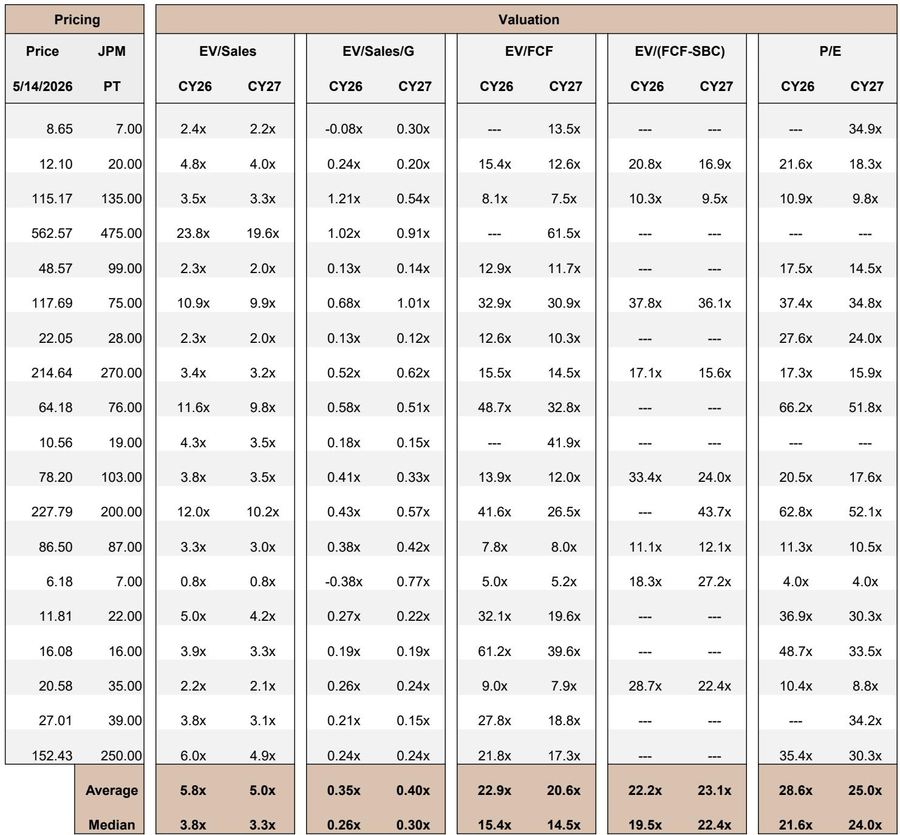

# 安全市场的真正拐点不是需求，而是攻击成本骤降后的防御范式重置

过去十年，网络安全行业的核心叙事是“威胁越来越多，企业不得不买更多工具”。这个逻辑在2025年之前基本成立。但某外资投行最新发布的Spring Series 2026网络安全研报揭示了一个更根本的结构性变化：攻击的经济学正在被AI重写，而市场对这件事的定价仍然停留在线性外推的旧框架里。

这份报告的核心判断值得每一位产业决策者和投资者认真对待：AI不是让现有的攻击更快、更多，而是让攻击能力从稀缺资源变成大宗商品。当发现零日漏洞的成本从数十万美元降至几千美元，当自主开发完整攻击链的时间从数周压缩至数小时，安全市场的需求曲线将发生一次永久性的右移——但更关键的是，供给侧的响应能力能否跟上。

这不是一个“买更多防火墙”的故事。这是一个关于防御架构必须被重新设计的故事。

## 1. 攻击的经济学已经不可逆地改变，而企业防御的预算逻辑还没跟上

研报中最令人警醒的数据来自对AI赋能攻击成本的量化测算。扫描一个操作系统的全部安全漏洞，传统方式需要专家团队花费数周，成本难以估算；而使用AI模型，成本不到50美元。开发一个能完全控制目标计算机的完整攻击工具，黑市价格在50万到200万美元之间，AI在半天内就能完成，成本低于1000美元。运行1000次自动化安全扫描，传统需要整个研究团队，AI成本不到2万美元。

500到1000倍的成本压缩，意味着攻击能力不再是国家级行为体和顶级犯罪集团的专属。任何拥有模型访问权限和计算资源的组织，现在都可以发起过去只有最顶尖黑客才能完成的攻击。这不是渐进式的威胁升级，而是攻击能力的民主化。

更重要的是，时间窗口已经消失。报告引用的数据显示，平均漏洞利用时间（mean time-to-exploit）在2025年已经变为负7天——这意味着攻击者在补丁发布之前就已经开始利用漏洞。从2018年的63天，到2021年的32天，到2023年的5天，再到2025年的负7天，这条曲线的斜率本身就是一个警报。

对决策者而言，这意味着传统的“发现-修补-保护”周期已经失效。企业不能再假设自己有时间在攻击发生前完成修补。防御必须从“响应式”转向“预测式”，而这需要完全不同的技术架构和采购逻辑。

## 2. 自主攻击AI已经跨越实用门槛，开源模型正在加速能力扩散

如果说成本数据还只是经济学推演，那么研报中关于Anthropic“Mythos”模型的披露则将这个推演变成了现实。Mythos Preview是Anthropic在2026年4月发布的受限访问模型，其能力在多个基准测试中超越了所有公开可用的模型。在高级软件问题解决（SWE-bench Pro）测试中，Mythos得分77.8%，远高于GPT-5.5的58.6%和Claude Opus 4.7的64.3%。在安全漏洞发现与复现能力测试中，Mythos得分83.1%，同样领先所有竞品。

但真正令人不安的不是基准测试分数，而是实际成果。Mythos在数周内发现了数千个关键漏洞，其中一些漏洞在长达27年、17年和16年的时间里未被发现，成功躲过了数十年来的自动化测试。一个企业网络渗透模拟，人类专家需要10小时以上，Mythos在数小时内自主完成。Anthropic的研究科学家Nicholas Carlini的评论尤为直白：“我在过去几周发现的漏洞比我一生其余时间发现的还要多。”

更关键的是，这种能力正在通过开源模型快速扩散。报告指出，来自中国的开源模型Kimi K2.6在编码能力上已经达到了此前Opus 4.6展现真实网络攻击能力时的水平。Anthropic自身的进攻性网络负责人估计，达到Mythos级别的能力将在数月而非数年内广泛可用。而开源模型没有Anthropic那样的安全限制——Anthropic在公开版本的Opus 4.7中刻意降低了网络攻击能力，但开源模型没有这种约束。

这意味着，即使是Mythos的受限访问模式，也只能为防御方提供一个短暂的窗口期。能力的扩散是不可避免的。问题不是“如果”攻击能力普及，而是“何时”。

## 3. 平台型安全厂商拥有结构性优势，但并非所有平台都能兑现

面对这种级别的威胁加速，什么样的防御架构才能有效？研报给出的答案是：平台型安全厂商。

逻辑并不复杂。AI驱动的攻击速度远超人类安全团队的反应能力。平均电子犯罪突破时间已经缩短到29分钟，最快纪录27秒；勒索软件到数据窃取的时间从2022年的8小时以上压缩到22秒。在这个时间尺度上，人工研判和手动响应已经完全失效。唯一的应对方式，是让AI驱动的防御系统与AI驱动的攻击系统正面对抗。

平台厂商的优势在于三件事：数十年的领域专业知识、专有数据、以及跨终端、网络、身份和数据的深度遥测能力。这些资产无法在短时间内被复制。CrowdStrike的Quiltworks联盟、Palo Alto Networks与多家基础模型厂商的合作，以及Anthropic的Glasswing项目，都指向同一个方向：基础模型厂商正在主动与安全平台合作，因为只有这些平台拥有部署自主防御代理所需的基础设施。

但这里有一个关键问题：不是所有平台都能成功。研报的评级给出了明确的区分。超配评级覆盖了CrowdStrike、Palo Alto Networks、Check Point、Zscaler、SentinelOne等多家公司，但同时也对Fortinet和Qualys给出了低配评级。这种分化背后是能力差距：并非所有安全厂商都拥有部署自主防御代理所需的数据规模和AI能力。平台型厂商的优势是结构性的，但兑现这个优势需要持续的技术投入和生态建设。

对投资者而言，这意味着安全板块的内部轮动才刚刚开始。简单的“买网络安全”策略已经不够，区分“谁真正拥有AI时代的防御架构”和“谁只是贴了一个AI标签”将成为超额收益的关键来源。

## 4. 报告尚未完全回答的关键问题：防御的闭环何时才能跑通

研报在揭示威胁的同时，也留下了一个令人不安的缺口。Project Glasswing启动后，Mythos已经发现了数千个关键漏洞，但截至目前，修复的漏洞不到1%。这背后的原因并不复杂：发现漏洞的速度已经远远超过了整个行业修补漏洞的能力。

这是一个经典的“发现-修复”错配。当AI可以在数分钟内发现一个组织中成百上千个漏洞时，即使是最训练有素的安全团队也无法同时修补所有漏洞。修复需要开发补丁、测试兼容性、安排停机窗口、协调多个供应商——这些流程的时间尺度仍然是天和周，而不是分钟和小时。

报告没有完全回答的问题是：当发现速度远超修复速度时，防御的有效性如何维持？一种可能性是，自主防御代理不仅用于发现漏洞，也用于自动修复。CrowdStrike和SentinelOne已经在生产中部署了自主防御代理，但自动修复在复杂企业环境中的可行性和安全性仍需要验证。另一种可能性是，防御策略从“修补所有漏洞”转向“缩小攻击面”，但这需要企业架构层面的根本改变。

这个未解问题直接关系到安全支出的长期增长空间。如果防御闭环无法跑通，企业可能会陷入“发现越多，修复越难”的困境，进而推动对更根本的架构变革的需求。这是研报的隐含逻辑，也是需要后续跟踪的关键变量。

## 5. 对决策者的观察框架：三个信号判断拐点是否真正到来

基于研报的分析，我们可以构建一个决策框架，帮助判断安全市场是否正在经历真正的结构性拐点。

第一个信号是安全预算占IT支出的比例是否出现非线性跃升。报告提到安全预算已经可以占到IT总支出的10%以上，如果这个比例在AI基础设施投入加速的背景下继续上升，将直接验证“需求曲线右移”的判断。需要关注的是，这种增长是来自现有产品的扩容，还是来自全新品类（如AI安全、自主防御代理）的预算分配。

第二个信号是平台厂商的自主防御代理能否实现规模化部署。CrowdStrike和Palo Alto Networks已经在推进，但真正的拐点在于这些代理能否在企业生产环境中稳定运行，并显著降低平均响应时间。如果自主防御代理能够在实际攻击中证明比人类团队更有效，安全运营的模式将发生根本改变。

第三个信号是修复速度能否追上发现速度。Mythos已经证明AI可以发现人类无法发现的漏洞，但如果修复能力仍然是瓶颈，那么安全支出的增长可能会遇到天花板。关注是否有新的自动化修复工具或架构（如CNAPP、ASM）能够缩小这个差距。

这三个信号中任何一个发生实质变化，都将对安全公司的估值逻辑产生深远影响。目前的市场定价可能仍然低估了这种变化的可能性。

## 6. 威胁的加速没有停下来的迹象，但防御的窗口仍然存在

研报中最令人不安的部分，或许不是Mythos的能力本身，而是能力扩散的速度和确定性。一个开源模型已经跨越了真实攻击能力的阈值，多个其他模型正在逼近。Anthropic的进攻性网络负责人估计，达到Mythos级别的能力将在数月内广泛可用。而真实世界的攻击已经证明了AI驱动攻击的有效性——2025年9月，一个国家级组织使用能力低于当前开源模型的Claude模型，自主对约30个目标进行了网络间谍活动，并取得了成功的入侵。

防御方并非没有机会。Project Glasswing的52个成员组织正在获得先发优势，平台厂商正在部署自主防御代理，基础模型厂商也在主动寻求合作。但这些窗口期是有限的。当开源模型的能力全面超越当前受限访问的Mythos时，攻击方和防御方之间的能力差距将再次拉大。

研报给出的结论是清晰的：安全支出的增长是确定的，但增长的结构和分配方式正在发生根本变化。那些能够将规模转化为议价权、将数据转化为防御能力的平台厂商，将在这个新周期中占据主导地位。而那些依赖单一产品、缺乏AI能力和生态合作的公司，可能面临被边缘化的风险。

关于这个判断背后的更多数据支撑——包括各公司在Glasswing和Quiltworks中的具体角色、不同攻击向量的防御优先级排序、以及各安全厂商自主防御代理的部署进展——欢迎来星球微信群里继续讨论。我们会在社群中分享研报的完整解读，并就报告尚未完全展开的几个关键问题（如防御闭环的可行性、小市值安全公司的差异化机会、以及中国开源模型对全球安全格局的二阶影响）进行深入探讨。

---

Personal reading notes and learning share only. Not investment advice.

