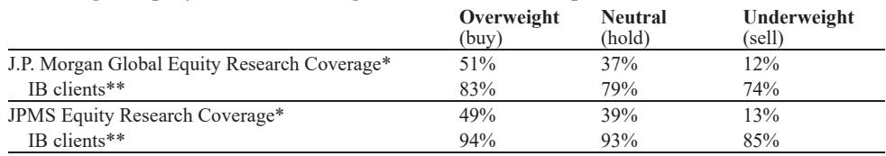

# 美国运营商大会的真实信号：市场低估了AI对电信资产的重定价

过去48小时，JPM在波士顿举办了第54届TMC大会。这是美国电信行业每年最重要的闭门交流场合之一，三家头部运营商的CEO、卫星服务商、铁塔公司和通信软件平台的高管悉数到场。

对于关注全球电信行业和AI基础设施投资的读者来说，这场会议释放了一个值得认真对待的信号：市场对电信资产的定价逻辑可能正在经历一次结构性转变，而多数人还没有意识到这个转变的深度。

本次会议最核心的发现是：美国三大运营商（BIG3）对增长前景的集体信心，并非来自传统的市场份额争夺，而是来自三个正在同时发生的结构性变化——新总可寻址市场（TAM）的扩张、AI对成本结构和客户粘性的重塑，以及卫星与地面网络关系的重新定义。这三个变化合在一起意味着什么？电信资产的估值框架正在从“成熟公用事业”向“有增长杠杆的数字基础设施”迁移。

以下是我们从会议反馈中提炼出的五个关键洞察，以及一个报告尚未完全回答的问题。

## 1. 运营商真正的增长引擎不是“抢用户”，而是“扩地盘”

过去几年，市场对美国无线市场的讨论始终围绕一个主题：价格战。Verizon即将在二季度推出的资费调整（Tariff Refresh）更让投资者对短期竞争态势保持警惕。T-Mobile CEO在会上重申其净增用户指引是保守的，这进一步加剧了这种不确定性。

但真正值得关注的不是季度份额变化，而是三家运营商同时在做的一件事：把增长视野从现有无线市场扩展到新的总可寻址市场。

T-Mobile CEO明确表示，仅“网络寻求者”这一群体就有超过2000万用户尚未覆盖。Verizon CEO强调，他们正在从“债券替代品”转向追求收入和利润的阶梯式增长。AT&T则通过光纤建设持续从有线电视公司手中夺取份额，其CEO指出，光纤增长来自竞争性胜利，而非自有DSL用户的迁移——这意味着光纤已不再是防守性投资，而是进攻性武器。

这些信号指向同一个判断：运营商正在用FWA（固定无线接入）、光纤和融合服务重新定义自己的竞争边界。T-Mobile重申了到2030年实现1500万FWA用户的目标，且该目标仅基于闲置频谱容量，未考虑新频谱获取或技术改进带来的上行空间。Verizon正在将成本削减（500亿美元运营支出和400亿美元资本支出目标）作为“输出而非输入”，核心目标是“让客户满意”。AT&T则明确表示，融合服务可以在客户流失率和用户生命周期上带来“戏剧性改善”。

这意味着什么？市场对运营商增长天花板的假设可能过于保守。当三大运营商同时从“存量博弈”转向“新TAM扩张”时，整个行业的估值锚点需要重新校准。

## 2. 卫星不是威胁，而是被运营商主动纳入生态的互补资产

卫星直连手机（D2D）是过去一年市场热议的话题，也是投资者对电信行业最担忧的变量之一。Starlink、AST SpaceMobile等公司的进展让一些人开始怀疑，地面蜂窝网络是否会被部分替代。

本次会议给出了一个相当清晰的答案：不会。至少在未来十年内不会。

T-Mobile、Verizon和AT&T的高管在这一点上立场高度一致。三家运营商最近联合成立了D2D合资公司，其核心逻辑是：将卫星作为高端资费套餐的标准功能，推动统一的设备生态系统和频谱标准化。T-Mobile CEO特别指出，卫星流量目前仅占其总网络流量的0.0002%，这是一个几乎可以忽略不计的数字。Verizon CEO则直言，考虑到城市容量的巨大差异，未来十年卫星只能作为无线网络的补充。

更重要的是，三家运营商都明确表示，没有意愿向卫星运营商提供MVNO（移动虚拟网络运营商）服务。这意味着卫星公司无法以批发价格接入运营商网络，其商业模式的想象空间被显著压缩。

这份报告给出的判断是：卫星与地面网络的关系已经基本定型。它不是颠覆者，而是运营商主动选择纳入生态的补充资产。对于投资者来说，这意味着围绕“卫星替代电信”的叙事需要被重新审视。真正值得关注的反而是另一个方向：卫星频谱部署可能成为铁塔需求的增量来源，因为卫星地面站需要与塔站协同。

## 3. AI对电信的影响正在从“成本故事”变成“收入故事”

会议中最令人意外的部分来自AI相关的讨论。Twilio的CFO介绍了其AI产品栈的进展——能够跨渠道维持连续客户对话、记忆上下文、并将对话转化为实时可执行的智能。Twilio将一季度增长的加速归因于AI原生产品。American Tower则通过其数据中心业务CoreSite，将投资规模从2亿美元提升至8亿美元，并计划将数据中心直接连接到塔站资产。

这些信息合在一起，揭示了AI对电信行业影响的更深层次变化。

第一层是成本端。AI正在帮助运营商降低客户获取成本和保留成本。Verizon的客户流失率从四季度的95个基点下降到一季度末的85个基点，CEO明确指出，超过50%的净增用户改善来自流失率降低。这意味着AI正在直接转化为利润率的改善。

第二层是收入端。AI工作负载正在从大型语言模型和超大规模数据中心向边缘设施溢出。American Tower的管理层认为，未来无线网络的演进将需要上下行对称、更低的延迟、更多的天线，以及在塔站直接部署计算能力。这可能包括云入口和互联能力。SBA的管理层也提到，AI驱动的延迟要求将推动计算向网络边缘靠近，从而在塔站创造增量需求。

第三层是商业模式端。Twilio的案例表明，AI原生产品可以改变通信软件平台的竞争格局。其CFO透露，AI产品栈在能力上远超竞争对手，这暗示着一旦差距被拉开，市场份额的重新分配可能加速。

这些信号指向一个核心判断：AI对电信行业的影响正在从“降本增效”的运营叙事，转向“创造新收入流”的增长叙事。而市场目前对电信资产的定价，更多反映的是前者而非后者。

## 4. 光纤资产正在成为AI基础设施的“暗线”

Uniti的CEO在会议上花了大量时间介绍其光纤建设策略和超大规模云客户机会。这家专注于农村市场的光纤运营商正在做的事情值得关注：在Tier 2和Tier 3城市之间的长途走廊上建设骨干基础设施，而这些位置恰好是超大规模云厂商正在寻找土地和电力接入的目标。

Uniti预计，未来几年从超大规模云厂商的锚定建设中将产生约15亿美元收入，其中约5亿美元将转化为经常性收入。管理层估计，光纤公司的总可寻址市场约为750亿美元，而Uniti的份额还有望在明年重新评估时上调。更值得关注的是，其锚定建设加租赁的混合内部收益率（IRR）已达到30%。

AT&T的CEO也提到了类似的方向：光纤具有最低的边际成本，是最面向未来工作负载的技术。AT&T正在积极建设通向超大规模云接入点的共享暗纤和明纤基础设施。

这些信息揭示了一个被忽视的趋势：光纤资产正在成为AI基础设施投资中的“暗线”。当市场对AI基础设施的关注集中在数据中心和GPU集群时，连接这些节点的光纤网络正在获得新的战略价值。对于拥有光纤资产的运营商和基础设施REITs来说，这可能意味着一个独立的增长曲线。

## 5. 铁塔生态的长期增长框架可能被低估，但短期仍需验证

American Tower和SBA的管理层都提供了对铁塔业务的长期展望。SBA给出的基准增长框架是：3%的租金递增+2.5-3%的新租赁活动-1%的流失，得到4.5-5%的基准增长率。上行情景包括无人机配送、自动驾驶、AI推理的边缘计算，以及卫星频谱部署——这些都可能成为塔站需求的增量来源。

American Tower则强调，其数据中心平台CoreSite正在实现两位数增长，未来计划将数据中心与塔站直接连接，以捕捉移动网络密集化和AI驱动的边缘计算需求的交汇点。

但这里需要指出报告尚未完全回答的一个关键问题：铁塔公司对AI边缘计算的需求预期，目前更多是基于逻辑推演而非实际部署数据。SBA的管理层承认，关于BTS（基站收发信台）的新租赁费率谈判正在恢复，但尚未形成大规模合同。American Tower的CoreSite投资从2亿到8亿美元的跃升是真实的，但塔站与数据中心的协同效应能否在财务上兑现，仍需观察未来几个季度的资本支出回报率。

这个未解问题指向一个更根本的判断：铁塔资产的AI故事目前处于“叙事驱动”阶段，尚未进入“数据驱动”阶段。对于投资者来说，这意味着需要区分哪些增长预期已经被定价，哪些仍需要实际业绩来验证。

## 这份报告没有完全回答的三个问题

尽管这次TMC会议提供了大量有价值的信号，但以下三个问题在报告中并未得到充分回答，值得后续跟踪：

第一，欧洲运营商的整合叙事是否会被美国市场的乐观情绪所验证？报告主笔在最后提到，欧洲整合仍是提供最佳风险回报的领域，但美国市场的正面反馈能否传导到欧洲，取决于监管环境和竞争动态，这些都是当前报告无法覆盖的变量。

第二，AI对运营商利润率的真实影响有多大？Verizon的流失率改善是令人鼓舞的，但成本削减的可持续性、AI投资对资本支出的压力、以及新收入流的毛利率结构，这些细节在会议中并未被充分讨论。

第三，卫星与运营商的合作关系是否会随着技术成熟而演变？目前三家运营商的态度高度一致，但随着卫星星座的部署规模扩Daiwa延迟改善，这种“互补性”定位是否会被重新审视，仍是一个值得保持观察的问题。

这些未解问题正是值得在更深入的讨论中继续追踪的方向。我们会在后续的社群讨论中，结合更多行业数据和公司财报，持续拆解这些变量的演变路径。

---

Personal reading notes and learning share only. Not investment advice.

