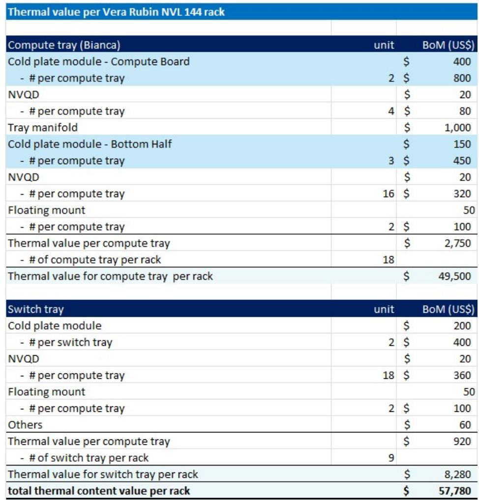
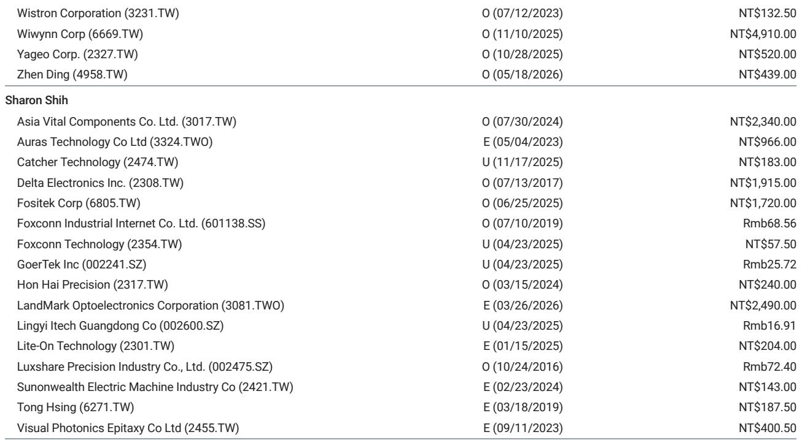
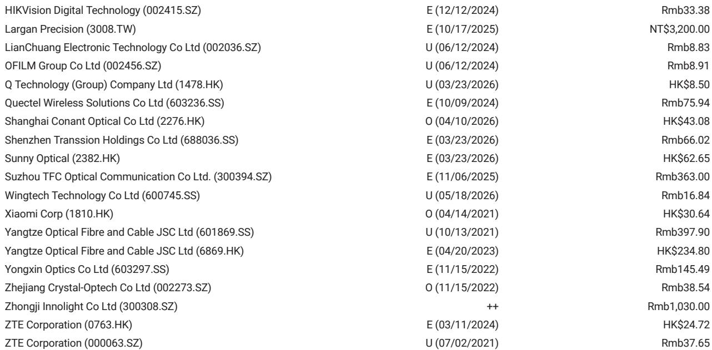

# The Rubin Rack Will Double AI Server Costs, But the Real Story Is How ODM Profitability Is Being Redefined

The next generation of AI infrastructure is arriving with a price tag that demands a complete re-evaluation of the supply chain's value proposition. A single Nvidia Rubin rack, the VR200 NVL72, will cost hyperscalers approximately USD 7.8 million when purchased from original design manufacturers. This represents nearly a doubling from the Blackwell generation, driven by a fundamental shift in the bill of materials where memory has become the dominant cost component. The market has been focused on the headline cost increase, but the more consequential story lies in how the economics of the ODM business model are being quietly rewritten.

The conventional wisdom holds that ODMs operate in a low-margin, high-volume game where margin compression is an inevitable feature of each new product generation. That narrative is about to be tested. A bottom-up analysis of the Rubin rack reveals that ODM value-added content will increase by 35 to 40 percent, a development that runs directly counter to what many investors have assumed. The puzzle is that while dollar profitability is rising, gross margins are actually declining, creating a tension that will separate the winners from the also-rans in this ecosystem.

This is not merely an incremental upgrade cycle. The Rubin platform represents a structural break in how AI servers are designed, assembled, and financed. The implications for component suppliers, ODMs, and hyperscalers are profound, and the decisions made over the next twelve months will determine who captures the value being created.

## Memory Has Become the Single Largest Cost Driver, Reshaping the Entire Bill of Materials Architecture

The most striking shift in the Rubin rack BOM is the emergence of memory as the dominant cost component. In the GB200 generation, memory represented only 5 to 10 percent of total rack cost. For the VR200 rack, memory has surged to 25 to 30 percent of the BOM, reaching approximately USD 2 million per rack. This is not simply a function of higher memory prices, though those have risen materially since the launch of GB200. The memory content per rack has increased dramatically, with the Rubin platform requiring significantly more high-bandwidth memory to support its compute architecture.

This shift has a cascading effect on the entire BOM structure. The GPU's share of total rack cost has fallen from approximately 65 percent in GB200 to roughly 51 percent in VR200, not because GPUs are cheaper, but because every other component category is growing faster. The implication for investors is clear: the traditional approach of tracking GPU shipments as a proxy for supply chain value is becoming less reliable. The value is spreading across a broader set of components, and the companies that supply memory, PCBs, substrates, and power systems are capturing an increasingly large share of the total rack economics.

The memory cost structure also introduces a new variable into the pricing equation. If hyperscalers choose to acquire the SOCAMM modules directly rather than purchasing them through Nvidia, the rack ASP could drop to approximately USD 6.7 million. This optionality creates a strategic lever for cloud customers and introduces uncertainty into revenue forecasts for the broader supply chain.

## PCB Content Is Surging by Over 230 Percent, Driven by Architectural Complexity That Has No Precedent

Among all downstream components, printed circuit board content is experiencing the most dramatic increase. PCB content per rack will rise from approximately USD 35,000 in GB300 to over USD 116,000 in VR200, a 233 percent increase that reflects a fundamental redesign of the server architecture. This is not a simple scaling of existing designs. The Rubin platform introduces entirely new board types that did not exist in the previous generation.

The computing board itself has evolved from a 22-layer HDI PCB in GB300 to a 26-layer board in Rubin, with a corresponding upgrade in CCL grade from M7 to M8. The switch tray PCB has jumped from 24 layers to 32 layers. More significantly, the Rubin architecture introduces a midplane PCB with 44 layers, a component that had no equivalent in the GB300 rack. The addition of BlueField and ConnectX modules further expands the PCB count, with 72 ConnectX PCBs per rack alone.

The strategic implication for PCB suppliers is substantial. Companies that can deliver high-layer-count, high-grade boards with the precision required for these architectures will see meaningful revenue growth. The barrier to entry is rising, and the suppliers who have invested in advanced manufacturing capabilities for these complex boards will be difficult to displace. The question that remains unanswered is whether the industry has sufficient capacity to meet the demand ramp expected from the second half of 2026 onward.

## The ODM Value-Add Paradox Explains Why Dollar Profits Are Rising While Margins Are Falling

The most counterintuitive finding in the Rubin analysis is the behavior of ODM profitability. ODM value-added content will increase by 35 to 40 percent in dollar terms, driven by the increased complexity of assembling and testing a much more sophisticated rack. The computing board, switch board, cooling components, and rack-level assembly all require more labor, more testing, and more engineering effort. New boards need to be assembled and validated. The complexity of the system integration is materially higher.

Yet the implied gross margin for a Rubin rack is approximately 1.9 percent, down from roughly 2.7 percent for the GB300. This margin compression is a natural consequence of the BOM structure: as the total rack cost doubles, the value-added services that ODMs provide do not scale at the same rate. The dollar profit per rack, however, is still higher in absolute terms.

The correct metric for evaluating ODM performance in this environment is absolute dollar profitability, not margin percentage. Investors who focus on margin compression alone will miss the reality that ODMs are generating more profit per rack than ever before. The question is whether volume growth will compensate for the margin decline, and that depends on the pace of hyperscaler adoption. The report identifies Wiwynn as the top pick among ODMs, followed by Wistron, Quanta, and Hon Hai, based on upside to price targets. The average valuation of approximately 13 times CY27 estimated earnings sits above the historical average of 11.5 times, suggesting that the market has not fully priced in the dollar profit story.

## The Consignment Model Is Slowly Reshaping Working Capital Dynamics Across the Supply Chain

One of the most significant strategic developments in the ODM landscape is the gradual shift toward a consignment business model. Hon Hai was the first to mention this shift during its fourth-quarter earnings call, and Quanta subsequently indicated that some projects would move to consignment in the second half of 2026. This is not a sudden transformation, but a slow, deliberate evolution that reflects the increasing working capital burden associated with building USD 7.8 million racks.

Under a consignment model, the customer assumes ownership of the inventory and components earlier in the production process, reducing the working capital requirements for the ODM. This is a meaningful structural change because the working capital intensity of AI server manufacturing has become a constraint on growth. ODMs have been carrying the financing cost of these expensive racks during the build cycle, and as rack prices double, that burden becomes unsustainable.

The shift toward consignment is a positive development for ODMs over the long term, as it reduces their capital requirements and improves return on invested capital. The open question is what percentage of projects will ultimately migrate to this model. If the consignment model becomes the industry standard, it will fundamentally alter the competitive dynamics of the ODM industry, favoring companies that can demonstrate operational excellence and customer trust. If it remains a niche arrangement, the working capital burden will continue to constrain the growth of smaller players.

## What the Report Does Not Fully Answer: The Hyperscaler Procurement Strategy and Its Second-Order Effects

The analysis provides a detailed bottom-up view of the Rubin rack BOM, but it leaves several critical questions unanswered. The most important of these concerns the procurement strategy of hyperscalers. The report notes that hyperscalers could choose to buy SOCAMM modules directly, which would reduce the rack ASP by over USD 1 million. But this is just one dimension of a much larger strategic question.

Will hyperscalers increasingly bypass traditional OEM and ODM channels for key components? The direct procurement of memory could be the first step toward a more vertically integrated approach to AI infrastructure. If hyperscalers begin sourcing GPUs, networking chips, or even entire subsystems directly, the role of ODMs and OEMs could shift from system integrators to assembly partners with even thinner margins.

The report also does not address the potential for hyperscalers to develop their own rack architectures that compete with or replace Nvidia's reference designs. The Rubin platform is Nvidia's vision for AI infrastructure, but the largest cloud providers have the engineering resources and scale to develop custom solutions. The emergence of custom ASIC-based racks, which the report mentions in the context of power supply adoption, could create an alternative demand pathway that bypasses the Nvidia ecosystem entirely.

Another unresolved question is the pace of adoption for the HVDC power architecture. The report notes that one US CSP is adopting a standalone HVDC power rack for the Vera Rubin platform, and that Delta is working with at least three CSP customers on HVDC adoption for ASIC power racks. The transition to 800V DC architecture represents a significant infrastructure investment for data centers, and the timeline for widespread adoption remains uncertain.

## A Decision Framework for Investors Navigating the Rubin Supply Chain

The Rubin generation creates a clear set of investment criteria that can be applied across the supply chain. The framework has three dimensions: content growth, competitive positioning, and business model resilience.

Content growth is the most straightforward dimension. Companies that supply components with the highest percentage increase in content per rack have the most direct revenue tailwind. PCB suppliers lead this list with 233 percent growth, followed by MLCC at 182 percent, ABF substrates at 82 percent, power supply at 32 percent, and cooling at 12 percent. These are the raw growth numbers, but they must be adjusted for market share, capacity constraints, and pricing dynamics.

Competitive positioning requires a more nuanced assessment. In the PCB market, the shift to higher layer counts and advanced materials creates a barrier to entry that favors established players with proven manufacturing capabilities. The MLCC market is experiencing a scramble for inventory as ODMs build stock ahead of the Rubin ramp, suggesting that suppliers with secure supply chains and strong customer relationships will benefit disproportionately. The ABF substrate market is driven by both higher ASP per chip and increased unit counts, creating a dual growth driver that rewards suppliers with advanced packaging capabilities.

Business model resilience is the dimension that most investors overlook. The shift toward consignment models, the increase in absolute dollar profitability for ODMs, and the potential for hyperscaler direct procurement all affect the sustainability of earnings. Companies that can maintain or improve their return on invested capital while growing revenue will command premium valuations. Companies that require ever-increasing working capital to support growth will face valuation headwinds.

The valuation of the ODM cohort at approximately 13 times CY27 earnings, above the historical average of 11.5 times, suggests that the market is beginning to recognize the dollar profit story but has not fully priced in the business model improvements. The risk-reward still appears attractive, but the dispersion of outcomes is wide. The winners will be those ODMs that can capture the increased value-added content while managing the working capital transition effectively.

For component suppliers, the focus should be on companies with exposure to multiple growth vectors within the Rubin architecture. Delta stands out for its exposure to both power supply and HVDC adoption. AVC benefits from the cooling content increase. Unimicron and ZDT are positioned for the PCB and substrate growth. The key risk is that the ramp timing slips, as the Rubin platform is not expected to reach volume production until the second half of 2026.

## The Unresolved Questions That Should Drive Further Analysis

The Rubin rack represents a step change in AI infrastructure economics, but the most important questions about its impact remain unanswered. How will hyperscaler procurement strategies evolve as rack costs approach USD 8 million? Will the consignment model become the industry standard, and what does that mean for ODM profitability? Can the supply chain scale to meet the demand for high-layer-count PCBs and advanced substrates? And what happens to the Nvidia ecosystem if hyperscalers accelerate their custom silicon efforts?

These are not academic questions. The answers will determine which companies in the AI supply chain generate superior returns over the next three years. The report provides the data and the analytical framework, but the interpretation requires a strategic perspective that goes beyond the numbers.

Join the community to read the full report and review the original charts.

*This article is for learning and discussion only and does not constitute investment advice.*

Personal reading notes and learning share only. Not investment advice.

