May 20, 2026 12:49 AM GMT

# Global Sugar | Latin America

# Timing the Turning Point

Consensus is constructive on sugar, but we think the market is underpricing timing risk: Brazil may cap prices near term, yet El Niño, ethanol policy, and supply response keep the medium-term skew positive. We see near-term weakness as a timing issue, not a change in the cycle call; SMTO remains OW.

# Key Takeaway from Sugar Week in New York

Consensus continues to point to a gradual tightening in the global sugar balance into 2026/27, yet near-term price dynamics remain more pressured than is widely understood. Brazil-centric factors are driving the pricing pressure. Near term, Brazil can add supply and pressure prices because the crop is larger/faster, ethanol prices have weakened as inventories are expected to rebuilt, and mills may shift back toward sugar. But that near-term supply relief may come at the expense of future supply: Weak producer margins discourage cane renewal, as production costs in Brazil are currently above 16clb, which is above nearest contract NY11 at 15clb, so areas that would normally be replanted may be harvested in another cycle instead. That supports current crush, but worsens the cane age profile and lowers future yields, tightening the 2027/28 balance.

This is why we see prices pressured around 15¢/lb near term while still raising our medium-term price to 17¢/lb: We think the market is focused on the immediate Brazil supply cap, but underpricing the medium-term tightening from lower renewal, El Niño risk, and policy-driven ethanol demand.

# Stock Implications: OW SMTO3

Importantly, current market expectations embed only a modest tightening, and likely exclude upside risks from any outsized El Niño implications and policy-driven ethanol demand. Weather impacts across India, Thailand, and Europe, alongside potential strengthening of ethanol blend mandates, could tighten balances beyond what is currently priced, we think.

Overall, Sugar Week reinforced our view that while the direction of fundamentals is well understood, the timing and asymmetry of risks are not — arguing against extrapolating near-term softness into longer-term assumptions. And we continue to see SMTO3 (OW) as the best way to play this asymmetric risk-reward, given its low-cost asset base, high operating leverage to a sugar/ethanol price recovery, and underappreciated corn ethanol business. While near-term results should remain pressured by a stronger BRL, higher diesel/input costs, and weak spot ethanol prices, we believe SMTO offers the cleanest listed exposure to a higher sugar price floor and potential ethanol recovery, with valuation still not fully reflecting a cycle turn.

# What's Changed

MS C.T.V.M. S.A.+

# Julia Rizzo

Equity Analyst and Commodities Strategist

Julia.Rizzo@morganstanley.com

+55 11 3048-6114

# Julia Habermann

Research Associate

Julia.Habermann.Oliveira@morganstanley.com

+55 11 3048-6096

LATAM AGRIBUSINESS 

<table><tr><td colspan="2">Latin AmericaIndustry View</td><td>In-Line</td></tr><tr><td colspan="3">WHAT&#x27;S CHANGED</td></tr><tr><td>Sao Martinho SA (SMTO3.SA)Price Target</td><td>FromR$22.00</td><td>ToR$24.00</td></tr></table>

Exhibit 7: Rapidly rising ethanol inventories are pressuring ethanol prices, reducing immediate off-take capacity.   
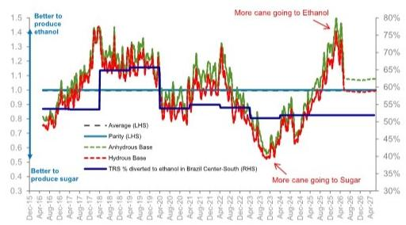  
Source: Datastream, Eikon, MS.

Exhibit 8: Falling Ethanol and Normalizing Oil Reinforce Brazil Max-Sugar Expectations   
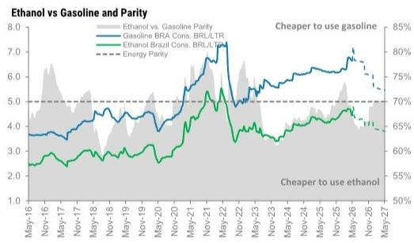

line

| Date   | Ethanol vs. Gasoline Parity | Gasoline BRA Cons. BR/LTR | Ethanol Brazil Cons. BR/LTR | Energy Parity |
|--------|-----------------------------|---------------------------|----------------------------|---------------|
| May-16 | ~3.5                        | ~3.0                      | ~2.5                       | ~70%          |
| Nov-16 | ~6.0                        | ~3.5                      | ~2.8                       | ~70%          |
| May-17 | ~4.0                        | ~3.0                      | ~2.5                       | ~70%          |
| Nov-17 | ~4.5                        | ~3.5                      | ~2.8                       | ~70%          |
| May-18 | ~4.0                        | ~3.0                      | ~2.5                       | ~70%          |
| Nov-18 | ~4.5                        | ~3.5                      | ~2.8                       | ~70%          |
| May-19 | ~4.0                        | ~3.0                      | ~2.5                       | ~70%          |
| Nov-19 | ~4.5                        | ~3.5                      | ~2.8                       | ~70%          |
| May-20 | ~5.0                        | ~4.0                      | ~3.0                       | ~70%          |
| Nov-20 | ~5.5                        | ~4.5                      | ~3.5                       | ~70%          |
| May-21 | ~6.0                        | ~5.0                      | ~4.0                       | ~70%          |
| Nov-21 | ~7.0                        | ~5.5                      | ~4.5                       | ~70%          |
| May-22 | ~7.5                        | ~6.0                      | ~5.0                       | ~70%          |
| Nov-22 | ~6.5                        | ~5.5                      | ~4.5                       | ~70%          |
| May-23 | ~6.0                        | ~5.0                      | ~4.0                       | ~70%          |
| Nov-23 | ~6.5                        | ~5.5                      | ~4.5                       | ~70%          |
| May-24 | ~7.0                        | ~6.0                      | ~5.0                       | ~70%          |
| Nov-24 | ~6.5                        | ~5.5                      | ~4.5                       | ~70%          |
| May-25 | ~6.0                        | ~5.0                      | ~4.0                       | ~70%          |
| Nov-25 | ~6.5                        | ~5.5                      | ~4.5                       | ~70%          |
| May-26 | ~7.0                        | ~6.0                      | ~5.0                       | ~70%          |
| Nov-26 | ~6.5                        | ~5.5                      | ~4.5                       | ~70%          |
| May-27 | ~6.0                        | ~5.0                      | ~4.0                       | ~70%          |

Source: Datastream, Eikon, MS.

# More Details Inside on:

MS does and seeks to do business with companies covered in MS. As a result, investors should be aware that the firm may have a conflict of interest that could affect the objectivity of MS. Investors should consider MS as only a single factor in making their investment decision.

# For analyst certification and other important disclosures, refer to the Disclosure Section, located at the end of this report.

+= Analysts employed by non-U.S. affiliates are not registered with FINRA, may not be associated persons of the member and may not be subject to FINRA restrictions on communications with a subject company, public appearances and trading securities held by a research analyst account.

What has changed vs. our prior view. The key surprise since our last update has been the speed of the ethanol price correction, which declined sharply from March despite a more supportive external backdrop (rising oil prices and geopolitical risk). Ethanol inventories have built quickly, reflecting both strong early supply and weaker demand — likely compounded by some front-loading of gasoline consumption ahead of expected price hikes. As a result, ethanol producers have not captured the upside from higher oil prices, creating a clear divergence versus our prior expectations.

Exhibit 1: Sugar Stocks to use (%) and NY Sugar Price (Usc/lb): We expect Global Stock-to-use ratio declining toward historical levels, supporting prices   
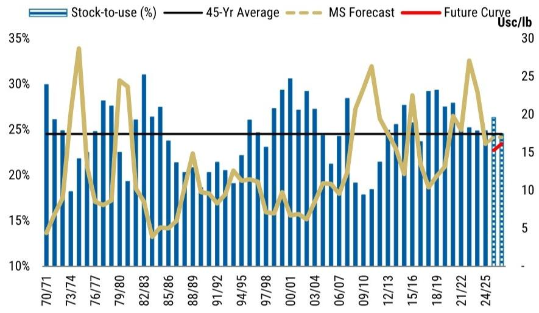

bar_line

| Date   | Stock-to-use (%) | 45-Yr Average | MS Forecast | Future Curve |
|--------|------------------|---------------|-------------|--------------|
| 70/71  | 30%              | 25%           | 5%          | -            |
| 73/74  | 25%              | 25%           | 15%         | -            |
| 76/77  | 28%              | 25%           | 25%         | -            |
| 79/80  | 27%              | 25%           | 20%         | -            |
| 82/83  | 31%              | 25%           | 15%         | -            |
| 85/86  | 26%              | 25%           | 10%         | -            |
| 88/89  | 24%              | 25%           | 15%         | -            |
| 91/92  | 21%              | 25%           | 10%         | -            |
| 94/95  | 23%              | 25%           | 15%         | -            |
| 97/98  | 27%              | 25%           | 10%         | -            |
| 00/01  | 30%              | 25%           | 15%         | -            |
| 03/04  | 29%              | 25%           | 10%         | -            |
| 06/07  | 28%              | 25%           | 15%         | -            |
| 09/10  | 31%              | 25%           | 20%         | -            |
| 12/13  | 25%              | 25%           | 15%         | -            |
| 15/16  | 28%              | 25%           | 20%         | -            |
| 18/19  | 29%              | 25%           | 15%         | -            |
| 21/22  | 27%              | 25%           | 20%         | -            |
| 24/25  | 26%              | 25%           | 15%         | -            |

Source: USDA, Datastream, MS estimates.

Exhibit 2: Hydrous Ethanol Price: declined sharply from March despite a more supportive external backdrop   
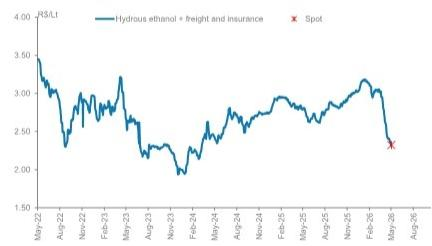

line

| Date   | Hydrous ethanol + freight and insurance | Spot |
|--------|------------------------------------------|------|
| May-22 | 3.5                                      |      |
| Aug-22 | 3.0                                      |      |
| Nov-22 | 2.5                                      |      |
| Feb-23 | 3.0                                      |      |
| May-23 | 2.5                                      |      |
| Aug-23 | 2.0                                      |      |
| Nov-23 | 2.5                                      |      |
| Feb-24 | 3.0                                      |      |
| May-24 | 2.5                                      |      |
| Aug-24 | 3.0                                      |      |
| Nov-24 | 2.5                                      |      |
| Feb-25 | 3.0                                      |      |
| May-25 | 2.5                                      |      |
| Aug-25 | 3.0                                      |      |
| Nov-25 | 2.5                                      |      |
| Feb-26 | 3.0                                      |      |
| May-26 | 2.0                                      | X    |
| Aug-26 | 1.5                                      |      |

Source: Datastream, MS.

Exhibit 3: Hydrous Ethanol Inventories in the CS: Ethanol inventories to build quickly, reflecting both strong early supply and weaker demand   
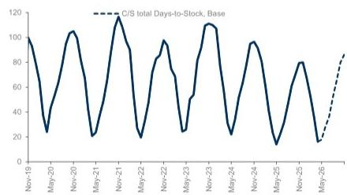

line

| Date   | C/S total Days-to-Stock |
|--------|--------------------------|
| Nov-19 | 100                      |
| May-20 | 25                       |
| Nov-20 | 105                      |
| May-21 | 20                       |
| Nov-21 | 115                      |
| May-22 | 20                       |
| Nov-22 | 95                       |
| May-23 | 25                       |
| Nov-23 | 105                      |
| May-24 | 20                       |
| Nov-24 | 95                       |
| May-25 | 15                       |
| Nov-25 | 80                       |
| May-26 | 15                       |

Source: UNICA, Datastream, MS estimates.

At the same time, fuel price policy has become a more binding constraint. Despite higher oil prices, Petrobras has kept gasoline prices unchanged, and market expectations are that any eventual increase will be partially offset by subsidies or tax reductions, particularly in an election year. This has effectively capped gasoline prices and delayed ethanol price recovery, reinforcing the weak near-term environment.

These dynamics have already fed through to sugar, with the market starting to price

• El Niño Likely; Strength Is the Swing Factor   
• São Martinho: Interesting Risk Reward   
• MS Sugar Supply and Demand Estimate Changes

Exhibit 9 : MS G l'obal Sugar Supply and Demand: Estimates Summary and Estimates Summary Changes 

<table><tr><td></td><td colspan="4">Current</td><td colspan="3">Previous</td><td colspan="2">Estimate Change %</td></tr><tr><td>Production</td><td>23/24</td><td>24/25</td><td>25/26e</td><td>26/27e</td><td>24/25</td><td>25/26e</td><td>26/27e</td><td>25/26e</td><td>26/27e</td></tr><tr><td>Brazil</td><td>45.5</td><td>43.7</td><td>44.0</td><td>42.9</td><td>43.7</td><td>42.2</td><td>44.1</td><td>+4%</td><td>-3%</td></tr><tr><td>India</td><td>29.5</td><td>28.0</td><td>28.2</td><td>27.3</td><td>28.0</td><td>32.0</td><td>31.0</td><td>-12%</td><td>-12%</td></tr><tr><td>Thailand</td><td>8.8</td><td>10.0</td><td>12.0</td><td>9.5</td><td>10.0</td><td>11.0</td><td>9.9</td><td>+9%</td><td>-4%</td></tr><tr><td>European Union</td><td>15.7</td><td>16.4</td><td>15.1</td><td>15.1</td><td>16.4</td><td>15.1</td><td>15.1</td><td>+0%</td><td>+0%</td></tr><tr><td>China</td><td>10.0</td><td>11.2</td><td>12.5</td><td>11.5</td><td>11.2</td><td>12.5</td><td>11.5</td><td>+0%</td><td>+0%</td></tr><tr><td>Rest of the World</td><td>70.7</td><td>71.2</td><td>71.7</td><td>72.0</td><td>71.2</td><td>71.7</td><td>72.0</td><td>+0%</td><td>+0%</td></tr><tr><td>Production (mn tns)</td><td>180.2</td><td>180.5</td><td>183.5</td><td>178.2</td><td>180.5</td><td>184.4</td><td>183.6</td><td>-1%</td><td>-3%</td></tr><tr><td>YoY Change</td><td>0.5%</td><td>0.1%</td><td>1.7%</td><td>-2.9%</td><td>0.1%</td><td>2.2%</td><td>-0.5%</td><td></td><td></td></tr><tr><td>Demand</td><td>23/24</td><td>24/25</td><td>25/26e</td><td>26/27e</td><td>24/25</td><td>25/26e</td><td>26/27e</td><td>25/26e</td><td>26/27e</td></tr><tr><td>Brazil</td><td>9.5</td><td>9.0</td><td>9.0</td><td>8.9</td><td>9.0</td><td>9.0</td><td>8.9</td><td>+0%</td><td>+0%</td></tr><tr><td>India</td><td>30.3</td><td>30.4</td><td>30.1</td><td>30.1</td><td>30.4</td><td>30.4</td><td>30.4</td><td>-1%</td><td>-1%</td></tr><tr><td>Thailand</td><td>3.8</td><td>4.0</td><td>4.0</td><td>4.1</td><td>4.0</td><td>4.1</td><td>4.1</td><td>-0%</td><td>-0%</td></tr><tr><td>European Union</td><td>16.4</td><td>15.9</td><td>15.9</td><td>15.8</td><td>15.9</td><td>15.9</td><td>15.9</td><td>+0%</td><td>-0%</td></tr><tr><td>China</td><td>15.5</td><td>15.4</td><td>15.5</td><td>15.5</td><td>15.4</td><td>15.5</td><td>15.5</td><td>+0%</td><td>+0%</td></tr><tr><td>Rest of the World</td><td>105.3</td><td>105.8</td><td>106.3</td><td>106.9</td><td>105.8</td><td>106.3</td><td>106.9</td><td>+0%</td><td>+0%</td></tr><tr><td>Demand (mn tns)</td><td>180.8</td><td>180.5</td><td>180.8</td><td>181.4</td><td>180.5</td><td>181.1</td><td>181.7</td><td>-0%</td><td>-0%</td></tr><tr><td>YoY Change</td><td>0.0%</td><td>-0.2%</td><td>0.2%</td><td>0.3%</td><td>-0.2%</td><td>0.3%</td><td>0.3%</td><td></td><td></td></tr><tr><td>Global Ending Stocks</td><td>45.0</td><td>44.9</td><td>47.6</td><td>44.5</td><td>44.9</td><td>48.2</td><td>50.1</td><td>-1%</td><td>-11%</td></tr><tr><td>Surplus/Deficit (000 tns)</td><td>-0.6</td><td>-0.1</td><td>2.7</td><td>-3.1</td><td>-0.1</td><td>3.4</td><td>1.9</td><td>-19%</td><td>-265%</td></tr><tr><td>Surplus/Deficit as% of use</td><td>0%</td><td>0%</td><td>1%</td><td>-2%</td><td>0%</td><td>2%</td><td>1%</td><td>-35bp</td><td>-275bp</td></tr><tr><td>Stock-to-use (%)</td><td>25%</td><td>25%</td><td>26%</td><td>25%</td><td>24.9%</td><td>26.6%</td><td>27.6%</td><td>-31bp</td><td>-306bp</td></tr><tr><td>Sugar Price-NY#11 (Usc/lb)</td><td>23.0</td><td>16.1</td><td>17.0</td><td>17.0</td><td>16.1</td><td>15.0</td><td>16.1</td><td>+13%</td><td>+6%</td></tr><tr><td>Future curve (Usc/lb)</td><td>14.7</td><td>15.7</td><td>16.3</td><td>16.9</td><td>14.8</td><td>15.4</td><td>15.7</td><td>+6%</td><td>+7%</td></tr><tr><td>Oil</td><td>82.2</td><td>70.8</td><td>100.0</td><td>80.0</td><td>70.8</td><td>62.0</td><td>63.8</td><td>+61%</td><td>+25%</td></tr></table>

Source: USDA, MS estimates, UNICA, Conab.

Exhibit 10 : MS Brazil Sugar and Ethanol Production Estimates Change Summary 

<table><tr><td rowspan="2">Old vs New</td><td colspan="4">Current</td><td colspan="3">Previous</td><td colspan="2">Estimate change (%)</td></tr><tr><td>23/24</td><td>24/25</td><td>25/26</td><td>26/27e</td><td>24/25</td><td>25/26e</td><td>26/27e</td><td>25/26e</td><td>26/27e</td></tr><tr><td colspan="10">Center South (Apr-Mar)</td></tr><tr><td>Cane Crushing (mn tns)</td><td>654</td><td>622</td><td>611</td><td>636</td><td>622</td><td>607</td><td>622</td><td>+1%</td><td>+2%</td></tr><tr><td>TRS (kg/tn)</td><td>139.2</td><td>141.1</td><td>137.8</td><td>138.5</td><td>141.1</td><td>137.5</td><td>140.3</td><td>+0%</td><td>-1%</td></tr><tr><td>Sugar Mix</td><td>49.0%</td><td>48.1%</td><td>50.4%</td><td>48.0%</td><td>48.1%</td><td>51.0%</td><td>45.7%</td><td></td><td></td></tr><tr><td>Ethanol Mix</td><td>51.0%</td><td>51.9%</td><td>49.6%</td><td>52.0%</td><td>51.9%</td><td>49.0%</td><td>54.3%</td><td></td><td></td></tr><tr><td>Sugar Production (mn tns)</td><td>42</td><td>40</td><td>40</td><td>40.3</td><td>40.2</td><td>40.6</td><td>38.0</td><td>-0%</td><td>+6%</td></tr><tr><td>Ethanol (bn liters)</td><td>27.3</td><td>26.8</td><td>24.5</td><td>25.9</td><td>27.1</td><td>23.2</td><td>26.9</td><td>+6%</td><td>-3%</td></tr><tr><td colspan="10">North North East</td></tr><tr><td>Cane Crushing (mn tns)</td><td>60.7</td><td>58.4</td><td>57.0</td><td>55.9</td><td>58.4</td><td>59.6</td><td>60.2</td><td>-4%</td><td>-7%</td></tr><tr><td>Sugar Production (mn tns)</td><td>3.4</td><td>3.8</td><td>3.7</td><td>3.2</td><td>3.8</td><td>3.7</td><td>3.9</td><td>+1%</td><td>-17%</td></tr><tr><td colspan="10">Brazil</td></tr><tr><td>Cane Crushing (mn tns)</td><td>715.1</td><td>680.3</td><td>668.2</td><td>691.7</td><td>680.3</td><td>666.4</td><td>682.3</td><td>+0%</td><td>+1%</td></tr><tr><td>Sugar Production (mn tns) Apr-Mar</td><td>45.8</td><td>44.0</td><td>44.2</td><td>43.5</td><td>44.0</td><td>44.2</td><td>41.9</td><td>-0%</td><td>+4%</td></tr><tr><td>Sugar Production (mn tns) Sep-Oct</td><td>45.5</td><td>43.7</td><td>44.0</td><td>42.9</td><td>43.7</td><td>44.0</td><td>42.9</td><td>+0%</td><td>+0%</td></tr><tr><td colspan="10">Ethanol</td></tr><tr><td>Ethanol Production (CS)</td><td>33.6</td><td>35.0</td><td>33.7</td><td>37.5</td><td>34.7</td><td>32.6</td><td>37.8</td><td></td><td></td></tr><tr><td>Total Cane Ethanol (bn lt) (anhydrous</td><td>27.3</td><td>26.8</td><td>24.5</td><td>25.9</td><td>27.1</td><td>23.2</td><td>26.9</td><td>+6%</td><td>-3%</td></tr><tr><td>Total Corn Ethanol (bn lt) (anhydrous</td><td>6.27</td><td>8.19</td><td>9.19</td><td>11.58</td><td>7.6</td><td>9.5</td><td>10.9</td><td>-3%</td><td>+6%</td></tr><tr><td>Ethanol price (from adeco model)</td><td>2.41</td><td>2.75</td><td>2.93</td><td>3.12</td><td>2.75</td><td>2.93</td><td>3.12</td><td>+0%</td><td>+0%</td></tr></table>

Source: USDA, MS estimates, UNICA, Conab.

an earlier shift toward max-sugar production in Brazil, adding to near-term pressure as the harvest also looks larger and potentially faster.

What we think now. While near-term conditions remain challenging, we view the current setup as unsustainable for long. Current hydrous ethanol prices (\~R\$2,300/m³ in Paulínia) appear close to a floor, particularly given historically low farm-to-pump spreads (see Exhibit 4). We would expect some normalization in distributor margins and a seasonal narrowing of the ethanol-to-gasoline discount after the peak of the harvest, supporting a gradual recovery in prices.

Exhibit 4: Ethanol at the pump vs. farms   
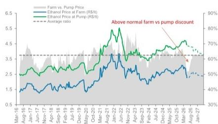  
Source: Datastream, MS estimates.

Exhibit 5: Ethanol vs Gasoline and Parity   
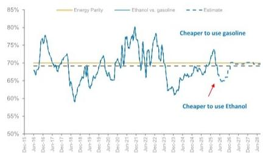  
Source: Datastream, MS estimates.

Even assuming some moderation in gasoline prices, we see ethanol prices recovering through the year, with hydrous moving from \~15¢/lb toward \~17¢/lb by year-end, supporting our sugar price forecast. For the companies, FX appreciation and higher costs (diesel, inputs) should continue to pressure cash flows, reinforcing that near-term earnings remain under pressure. That said, weaker prices should ultimately lead to tighter supply responses, and combined with increasing El Niño risks, reinforce our view that the cycle is approaching a bottom.

# Key Takeaways

# Consensus tightening intact, but short-term softness and asymmetric upside risks dominate

Discussions during Sugar Week reinforced a broadly shared view of gradual tightening in the global sugar balance, but also highlighted a disconnect between near term price dynamics and medium term risks. While fundamentals look more constructive into 2026/27, much of this view is now well understood — shifting investor focus from direction to timing and asymmetry.

# What appears priced in:

- A modest to moderate tightening of the global sugar balance into 2026/27, without a deficit shock.   
- Brazil as the swing producer, with supply shaped by operational execution during a largely max sugar season. With ethanol prices having collapsed, the market is expected to tilt toward sugar sooner rather than later   
- India structurally constrained, with exports remaining restricted and policy driven amid domestic stock priorities.   
- Europe in decline, as low prices pressure acreage and accelerate supply rationalization.

This supports prices stabilizing above recent cycle lows but does not embed strong upside catalysts.

Why the near term may stay soft: Despite a constructive medium term narrative, several factors point to continued near term pressure:

- The Brazilian harvest looks larger and potentially faster, supported by ample cane availability.   
- Higher probabilities of El Niño bringing more rainfall later in the season may accelerate harvesting, front loading supply and/or improving next year availability.   
- Rapidly rising ethanol inventories are pressuring ethanol prices, reducing immediate off take capacity.   
- At the same time, gasoline prices remain below parity, with sentiment that the government will continue to manage pump prices — including through subsidies — to avoid further increases, limiting ethanol price support.   
- A faster harvest profile may therefore pressure sugar prices in the short term, without necessarily translating into maximum sugar output, given logistical and operational constraints.

Near term weakness reflects timing, inventory and policy effects, rather than a deterioration in underlying fundamentals.

# Brazil: agronomic dynamics drive the adjustment

Lower prices are unlikely to cap supply through capital restraint in the short term. Instead, the adjustment occurs through agronomic and operational channels, particularly as ethanol economics weaken:

- In the near term, lower returns discourage cane renovation, increasing harvested area as fields are kept an additional cycle — adding supply and prolonging softness.   
• Over time, lower renovation rates reduce yields, tightening balances in subsequent crops.   
- This creates an important asymmetry: short term supply relief at the cost of tighter medium term fundamentals.

# What is likely not fully priced yet: weather and ethanol demand

The current consensus tightening excludes upside risks, most notably:

- El Niño impacts:   
- India: potential loss of 1–2 mnt in 2026/27 and risk of acreage reduction in 2027/28 given low reservoir levels.   
• Thailand: historical El Niño episodes imply 7–13% yield losses, not embedded in base cases.   
• Europe: low prices may drive faster than expected acreage contraction.

• Policy driven ethanol demand:

\- On the bearish side, sugar demand growth could slow further, with expectations shifting to a lower — though still positive — growth trajectory

Incremental demand from higher or more strictly enforced ethanol blend mandates across the globe represents a potential upside surprise, potentially supporting higher ethanol prices and cane diversion to ethanol once inventories normalize — a dynamic only partially reflected in current balances.

# El Niño Likely; Strength Is the Swing Factor

El Niño matters for sugar because it can reduce Asian cane availability while disrupting Brazil's harvest execution, tightening supply even if planted area does not change. In India and Thailand, the main risk is a weaker monsoon: lower rainfall during the July–September window can reduce reservoir recharge, soil moisture and cane development, pressuring yields and limiting export availability in 2026/27. In Brazil, El Niño does not necessarily damage cane stands directly, but irregular or above-normal rains during the Center-South harvest can reduce crushing days, disrupt field access, dilute ATR/TRS and push cane into the next crop year. The result is potentially less sugar available to the market through lower Asian production and slower/lower-quality Brazilian crushing.

More here: Global Agribusiness: Weather Outlook: El Niño by Weather Experts (7 May 2026)

El Niño Risks assessment: NOAA/CPC's May update moved to an El Niño Watch, with an 82% probability of emergence in May–July and 96% probability of persistence through Dec-26/Feb-27. For sugar, the key monitor is whether India's monsoon or Thailand cane development actually deteriorate; without visible crop impact, this risk should support the price floor rather than drive a new price deck.

Exhibit 10: El Niño weather can be challenging for sugar production in key producing regions

# EL NIÑO AND RAINFALL

El Niño conditions in the tropical Pacific are known to shift rainfall patterns in many different parts of the world. The regions and seasons shown on the map below indicate typical but not guaranteed impacts of El Niño.

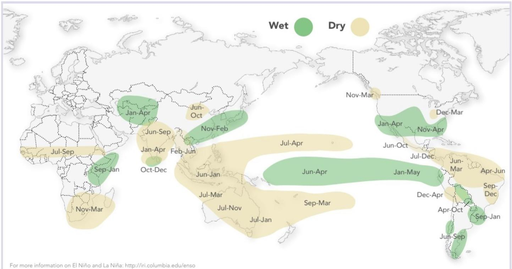

geo

| Region       | Month     | Wet Zone | Dry Zone |
| ------------ | --------- | -------- | -------- |
| North Africa | Jan-Apr   | Green    | Green    |
| North Africa | Jun-Oct   | Green    | Green    |
| North Africa | Oct-Dec   | Green    | Green    |
| South Africa | Jul-Sep   | Yellow   | Yellow  |
| South Africa | Sep-Jan   | Green    | Yellow  |
| South Africa | Nov-Mar   | Yellow   | Yellow  |
| South Africa | Dec-Mar   | Green    | Yellow  |
| Central Africa | Jan-Apr   | Green    | Green    |
| Central Africa | Jun-Apr   | Green    | Green    |
| Central Africa | Sep-Mar   | Yellow   | Yellow  |
| Central Africa | Dec-Apr   | Green    | Yellow  |
| Central Africa | Apr-Oct   | Green    | Yellow  |
| Central Africa | Sep-Jan   | Green    | Yellow  |
| West Africa  | Jan-Apr   | Green    | Green    |
| West Africa  | Jun-Oct   | Green    | Green    |
| West Africa  | Oct-Dec   | Green    | Yellow  |
| West Africa  | Dec-Mar   | Green    | Yellow  |
| West Africa  | Jan-May   | Green    | Green    |
| West Africa  | Jun-Apr   | Green    | Yellow  |
| West Africa  | Sep-Mar   | Yellow   | Yellow  |
| West Africa  | Dec-Apr   | Green    | Yellow  |
| West Africa  | Apr-Oct   | Green    | Yellow  |
| West Africa  | Sep-Jan   | Green    | Yellow  |
| East Africa  | Jan-Apr   | Green    | Green    |
| East Africa  | Jun-Oct   | Green    | Green    |
| East Africa  | Oct-Dec   | Green    | Yellow  |
| East Africa  | Dec-Mar   | Green    | Yellow  |
| East Africa  | Jan-May   | Green    | Yellow  |
| East Africa  | Jun-Apr   | Green    | Yellow  |
| East Africa  | Sep-Mar   | Yellow   | Yellow  |
| East Africa  | Dec-Apr   | Green    | Yellow  |
| East Africa  | Apr-Oct   | Green    | Yellow  |
| East Africa  | Sep-Jan   | Green    | Yellow  |
| East Africa  | Dec-Dec   | Green    | Yellow  |
| South Africa| Jan-Apr   | Green    | Green    |
| South Africa| Jun-Oct   | Green    | Green    |
| South Africa| Oct-Dec   | Green    | Yellow  |
| South Africa| Dec-Mar   | Green    | Yellow  |
| South Africa| Jan-May   | Green    | Yellow  |
| South Africa| Jun-Apr   | Green    | Yellow  |
| South Africa| Sep-Mar   | Yellow   | Yellow  |
| South Africa| Dec-Apr   | Green    | Yellow  |
| South Africa| Apr-Oct   | Green    | Yellow  |
| South Africa| Sep-Jan   | Green    | Yellow  |
| South Africa| Dec-Dec   | Green    | Yellow  |
For more information on El Niño and La Niña: http://iri.columbia.edu/enso

Sources:   
1. Lenssen, Goddard and Mason, 2020. Seasonal Forecast Skill of ENSO Teleconnection Maps. Weather Forecasting, 2387–2406   
2. Mason and Goddard, 2001. Probabilistic precipitation anomalies associated with ENSO. Bull. Am. Meteorol. Soc. 82, 619-638

COLUMBIA CLIMATE SCHOOL

INTERNATIONAL RESEARCH INSTITUTE

FOR CLIMATE AND SOCIETY

1/climatesociety

@climatesociety

Brazil adds execution risk, but the signal is less directional. El Niño can increase heat, evapotranspiration, fire risk, or irregular rains, which could affect crush days and ATR/TRS. However, peak intensity remains uncertain, so we treat it as a monitoring variable that reduces confidence in further downside, not as a base-case driver of a sustained rally.

Exhibit 11: El Nino is historically associated with higher sugar prices, but it depends on when it happens and how strong it is   
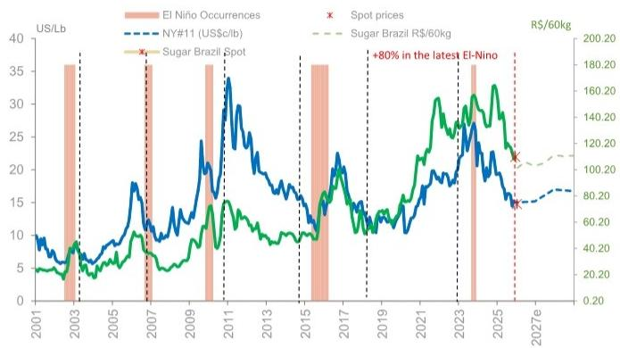

line

| Year | El Niño Occurrences (US/Lb) | Sugar Brazil Spot (R$/60kg) | NY#11 (US$/c/lb) |
|------|-----------------------------|-----------------------------|------------------|
| 2001 | ~5                          | ~40                         | ~10              |
| 2003 | ~35                         | ~80                         | ~6               |
| 2005 | ~10                         | ~40                         | ~10              |
| 2007 | ~35                         | ~100                        | ~18              |
| 2009 | ~35                         | ~150                        | ~25              |
| 2011 | ~35                         | ~180                        | ~35              |
| 2013 | ~35                         | ~150                        | ~25              |
| 2015 | ~35                         | ~100                        | ~20              |
| 2017 | ~35                         | ~150                        | ~25              |
| 2019 | ~35                         | ~100                        | ~15              |
| 2021 | ~35                         | ~150                        | ~20              |
| 2023 | ~35                         | ~180                        | ~25              |
| 2025 | ~35                         | ~160                        | ~20              |
| 2027e| ~35                         | ~140                        | ~15              |

Source: MS Estimates, NOAA, Refinitiv Eikon

Exhibit 12: El Niño probabilities increased   
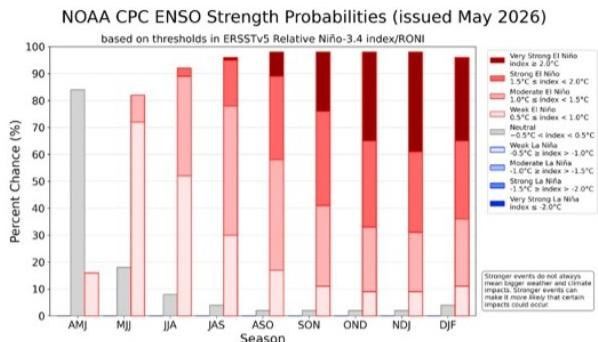

bar_stacked

NOAA CPC ENSO Strength Probabilities (issued May 2026) based on thresholds in ERSTv5 Relative Niño-3.4 index/RONI
| Season | Very Strong El Niño Index ≥ 2.0°C | Strong El Niño | Moderate El Niño | Weak El Niño | 0.5°C a index < 1.0°C | Neutral | -0.5°C a index < 0.5°C | Weak La Niña | -0.5°C a index > -1.0°C | Moderate La Niña | Strong La Niña | Very Strong La Niña Index ≤ -2.0°C |
|---|---|---|---|---|---|---|---|---|---|---|---|---|
| AMJ | 0 | 0 | 85 | 0 | 0 | 0 | 0 | 0 | 0 | 0 | 0 | 0 |
| MJJ | 0 | 0 | 0 | 18 | 0 | 0 | 0 | 0 | 0 | 0 | 0 | 0 |
| JJA | 0 | 0 | 0 | 0 | 92 | 0 | 0 | 0 | 0 | 0 | 0 | 0 |
| JAS | 0 | 0 | 0 | 0 | 37 | 0 | 0 | 0 | 0 | 0 | 0 | 0 |
| ASO | 12 | 0 | 0 | 15 | 15 | 0 | 0 | 0 | 0 | 0 | 0 | 0 |
| SON | 12 | 0 | 0 | 15 | 37 | 0 | 0 | 0 | 0 | 0 | 0 | 0 |
| OND | 12 | 0 | 0 | 15 | 37 | 15 | 15 | 15 | 15 | 15 | 15 | 15 |
| NDJ | 12 | 0 | 0 | 15 | 37 | 15 | 15 | 15 | 15 | 15 | 15 | 15 |
| DJF | 12 | 0 | 0 | 15 | 37 | 15 | 15 | 15 | 15 | 15 | 15 | 15 |
Strong events do not always make bigger weather and climate impacts. Stronger events can make it more likely that certain impacts could occur.

Figure 8. ENSO strength probabilities for the Niño 3.4 relative sea surface temperature index (5°N-5°S, 170°W-120°W) minus tropical mean (20°N-20°S). The relative index is re-scaled to match the variance of the traditional index. Figure updated 14 May 2026. Higher resolution image/table: https://cpc.ncep.noaa.gov/products/analysis\_monitoring/enso/roni/strengths.php

Exhibit 13: El Nino Tend to reach their maximum strength during October - February   
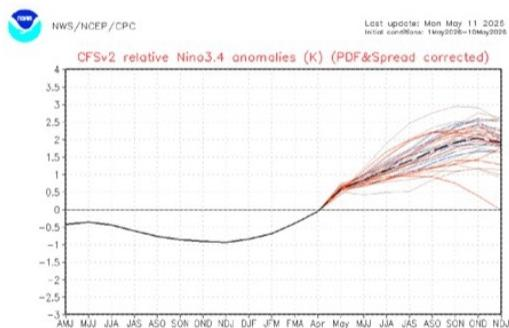

line

| Month | Relative Nino3.4 anomaly (K) |
|-------|------------------------------|
| AMJ   | -0.5                         |
| MJJ   | -0.5                         |
| JJA   | -0.5                         |
| JAS   | -0.5                         |
| ASO   | -0.5                         |
| SON   | -0.5                         |
| OND   | -0.5                         |
| NDJ   | -0.5                         |
| DUF   | -0.5                         |
| JFM   | -0.5                         |
| FMA   | -0.5                         |
| Apr   | 0.0                          |
| May   | 0.5                          |
| MJJ   | 1.0                          |
| JJA   | 1.5                          |
| JAS   | 2.0                          |
| ASO   | 2.5                          |
| SON   | 3.0                          |
| OND   | 3.5                          |
| NJJ   | 4.0                          |

Figure 6. NCEP Climate Forecast System (CFSv2) prediction of relative sea surface temperature anomalies for the Niño 3.4 index (5°N-5°S, 170°W-120°W) minus tropical mean (20°N-20°S). The relative index is re-scaled to match the variance of the traditional index. Figure updated 11 May 2026.   
Source: NOAA   
Source: NOAA

# São Martinho: Interesting Risk Reward

We remain Overweight on São Martinho and raise our base case PT to R\$24, as the risk/reward remains attractive despite near-term earnings pressure. The stock has outperformed since our last report, but we believe the move is supported by higher Oil prices and a tighter 12–18M sugar setup, rising weather/policy optionality, and SMTO's position as a low-cost, high-quality way to play the cycle turn. Our updated Risk Reward framework is now R\$24 base (price target) / R\$38 bull / R\$12 bear, versus R\$22 / R\$37 / R\$12 previously, implying a more favorable upside skew.

Near-term fundamentals are still challenging, but we see them as timing pressure rather than a thesis break. Ethanol prices corrected faster than expected, inventories rebuilt quickly with the new crop, and hydrous demand has not yet recovered share versus gasoline. In addition, a stronger BRL and higher diesel/input costs should weigh on margins and cash flow in the coming quarters. We now forecast adjusted EBITDA of R\$3.4bn in 2026E, R\$2.9bn in 2027E, and R\$2.9bn in 2028E, with leverage rising to 1.9x ND/EBITDA in 2027E before easing

Exhibit 14: Since our last report, Sao Martinho has outperformed the Bovespa Index, despite partial retracement from March highs   
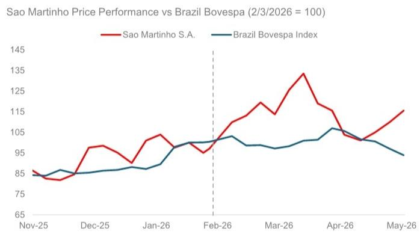

line

| Date   | Sao Martinho S.A. | Brazil Bovespa Index |
|--------|-------------------|----------------------|
| Nov-25 | 85                | 85                   |
| Dec-25 | 95                | 85                   |
| Jan-26 | 100               | 90                   |
| Feb-26 | 95                | 100                  |
| Mar-26 | 135               | 100                  |
| Apr-26 | 115               | 105                  |
| May-26 | 115               | 95                   |

Exhibit 15: São Martinho Bull-Bear Skew: positive risk reward   
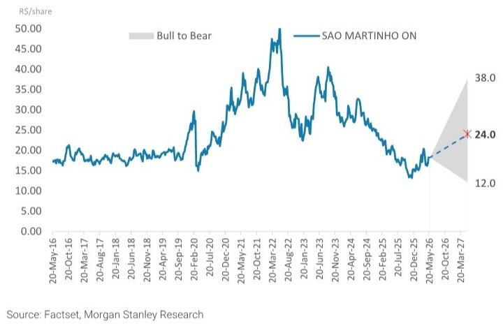

line

| Date       | SAO MARTINHO ON |
| ---------- | --------------- |
| 20-Mar-27  | 38.0            |
| 20-Oct-26  | 24.0            |

Source: Datastream, Company Data.

The reason we stay OW is that the commodity risk skew looks attractive, while SMTO still offers operating leverage to a recovery. The market is already pricing part of Brazil's max-sugar response, but we think downside to sugar is increasingly limited by tighter India availability, lower 2026/27 Thailand supply, and El Niño support. And remind investors that production costs in Brazil are currently above 16clb, which is above nearest contract NY11 at 15clb.

The key debate is no longer whether near-term results are under pressure, but whether the market is underestimating the next leg of upside. At current market prices the is little to none FCF generation even for players like Sao Martinho, which is among the best assets in Brazil. For SMTO we estimate every 1clb change in Sugar price is \~R\$180mn/USD 30mn EBITDA or 3.1% of current mkt cap.

Our bull case sugar moves toward 21clb resulting in R\$0.9-1bn cash-flow for SMTO sugar operation or 15-17% yield, without any significant gains on the ethanol part given its gasoline parity cap. Downside risks remain Petrobras gasoline intervention, further BRL appreciation, weaker hydrous demand, and a faster Brazil shift back to sugar; however, at this stage, we believe the balance of risks still supports an OW rating.

Exhibit 16: São Martinho - Model Summary 

<table><tr><td colspan="8">ANNUAL ESTIMATES</td></tr><tr><td>Operational Assumptions</td><td>2022</td><td>2023</td><td>2024</td><td>2025</td><td>2026E</td><td>2027E</td><td>2028E</td></tr><tr><td>Sugar cane crushing - mn tn</td><td>19.9</td><td>20.0</td><td>23.1</td><td>21.8</td><td>21.7</td><td>23.2</td><td>23.4</td></tr><tr><td>Volume Sold</td><td></td><td></td><td></td><td></td><td></td><td></td><td></td></tr><tr><td>Sugar (&#x27;000 Tn)</td><td>1,326</td><td>1,205</td><td>1,463</td><td>1,325</td><td>1,423</td><td>1,491</td><td>1,539</td></tr><tr><td>Ethanol (&#x27;000 cbm)</td><td>885</td><td>1,007</td><td>952</td><td>965</td><td>909</td><td>986</td><td>977</td></tr><tr><td>Cogeneration (&#x27;000 MWh)</td><td>871</td><td>804</td><td>786</td><td>964</td><td>1,134</td><td>1,035</td><td>1,045</td></tr><tr><td>Average Prices</td><td></td><td></td><td></td><td></td><td></td><td></td><td></td></tr><tr><td>Sugar Nybot prices (US$ c/lb)</td><td>15.1</td><td>18.9</td><td>22.8</td><td>19.9</td><td>16.8</td><td>17.0</td><td>17.0</td></tr><tr><td>SMTO avg sugar price (R$/Tn)</td><td>1,769</td><td>2,168</td><td>2,476</td><td>2,465</td><td>2,327</td><td>1,992</td><td>1,967</td></tr><tr><td>SMTO avg ethanol price (R$/cbm)</td><td>3,381</td><td>3,434</td><td>2,422</td><td>2,731</td><td>2,949</td><td>2,578</td><td>2,436</td></tr><tr><td>Cogeneration (R$/MWh))</td><td>257</td><td>238</td><td>244</td><td>242</td><td>255</td><td>263</td><td>273</td></tr><tr><td>Financial Summary</td><td>2022</td><td>2023</td><td>2024</td><td>2025</td><td>2026E</td><td>2027E</td><td>2028E</td></tr><tr><td>Revenues</td><td>5,720</td><td>6,628</td><td>6,894</td><td>7,162</td><td>7,457</td><td>6,940</td><td>7,341</td></tr><tr><td>EBITDA</td><td>3,630</td><td>3,731</td><td>3,676</td><td>3,920</td><td>3,821</td><td>3,411</td><td>3,496</td></tr><tr><td>EBITDA Margin</td><td>63.5%</td><td>56.3%</td><td>53.3%</td><td>54.7%</td><td>51.2%</td><td>49.2%</td><td>47.6%</td></tr><tr><td>Adj EBITDA</td><td>3,142</td><td>3,356</td><td>3,070</td><td>3,129</td><td>3,411</td><td>2,861</td><td>2,946</td></tr><tr><td>Net Income</td><td>1,481</td><td>1,016</td><td>1,477</td><td>557</td><td>762</td><td>348</td><td>524</td></tr><tr><td># shares (diluted)</td><td>346.4</td><td>346.4</td><td>346.4</td><td>328.6</td><td>328.6</td><td>327.3</td><td>327.3</td></tr><tr><td>EPS (diluted, R$)</td><td>4.28</td><td>2.93</td><td>4.26</td><td>1.69</td><td>2.32</td><td>1.06</td><td>1.60</td></tr><tr><td>EPS growth (%)</td><td>59.7%</td><td>-31.4%</td><td>45.4%</td><td>-60.3%</td><td>36.8%</td><td>-54.2%</td><td>50.7%</td></tr><tr><td>Net debt (cash)</td><td>2,916</td><td>3,546</td><td>3,386</td><td>5,006</td><td>5,151</td><td>5,315</td><td>5,220</td></tr><tr><td>Net debt / EBITDA</td><td>0.9x</td><td>1.1x</td><td>1.1x</td><td>1.6x</td><td>1.5x</td><td>1.9x</td><td>1.8x</td></tr><tr><td>WC / Revenue</td><td>-3.8%</td><td>-2.7%</td><td>1.8%</td><td>1.8%</td><td>3.0%</td><td>1.7%</td><td>1.9%</td></tr><tr><td>Capex / Revenue</td><td>42.7%</td><td>38.0%</td><td>36.0%</td><td>38.2%</td><td>40.3%</td><td>41.8%</td><td>32.5%</td></tr><tr><td>Free Cash Flow to equity</td><td>136</td><td>507</td><td>779</td><td>(40)</td><td>19</td><td>(321)</td><td>48</td></tr><tr><td>ROE (%)</td><td>31.8%</td><td>18.1%</td><td>23.1%</td><td>8.2%</td><td>10.8%</td><td>4.6%</td><td>6.8%</td></tr><tr><td>ROIC (%)</td><td>13.7%</td><td>8.9%</td><td>6.7%</td><td>7.1%</td><td>5.7%</td><td>4.2%</td><td>4.8%</td></tr><tr><td>Valuation Summary</td><td>2022</td><td>2023</td><td>2024</td><td>2025</td><td>2026E</td><td>2027E</td><td>2028E</td></tr><tr><td>Current Valuation</td><td></td><td></td><td></td><td></td><td></td><td></td><td></td></tr><tr><td>EV / Tn (US$)</td><td>82</td><td>92</td><td>100</td><td>71</td><td>42</td><td>45</td><td>45</td></tr><tr><td>EV / Revenue</td><td>2.23</td><td>2.07</td><td>2.05</td><td>1.65</td><td>1.49</td><td>1.63</td><td>1.52</td></tr><tr><td>EV / EBITDA</td><td>4.1</td><td>4.1</td><td>4.6</td><td>3.8</td><td>3.3</td><td>3.9</td><td>3.8</td></tr><tr><td>P/E</td><td>6.6</td><td>10.0</td><td>7.3</td><td>12.2</td><td>7.9</td><td>17.2</td><td>11.4</td></tr><tr><td>P/BV</td><td>1.8</td><td>1.7</td><td>1.6</td><td>1.0</td><td>0.8</td><td>0.8</td><td>0.8</td></tr><tr><td>FCF yield</td><td>1.4%</td><td>5.0%</td><td>7.2%</td><td>-0.6%</td><td>0.3%</td><td>-5.4%</td><td>0.8%</td></tr><tr><td>Price Target Implicit Valuation</td><td></td><td></td><td></td><td></td><td></td><td></td><td></td></tr><tr><td>EV / Tn (US$)</td><td>71</td><td>77</td><td>80</td><td>79</td><td>56</td><td>60</td><td>59</td></tr><tr><td>EV / Revenue</td><td>2.23</td><td>2.07</td><td>2.05</td><td>1.65</td><td>1.75</td><td>1.90</td><td>1.78</td></tr><tr><td>EV / EBITDA</td><td>4.1</td><td>4.1</td><td>4.6</td><td>3.8</td><td>3.8</td><td>4.6</td><td>4.4</td></tr><tr><td>P/BV</td><td>1.8</td><td>1.7</td><td>1.6</td><td>1.0</td><td>1.1</td><td>1.0</td><td>1.0</td></tr><tr><td>FCF yield</td><td>1.4%</td><td>5.0%</td><td>7.2%</td><td>-0.6%</td><td>0.2%</td><td>-4.1%</td><td>0.6%</td></tr></table>

Source: Company Data, MS estimates

Exhibit 17: SCENARIOS (Key Debates Highlighted) 

<table><tr><td colspan="5">SCENARIOS (Key Debates Highlighted)</td></tr><tr><td></td><td>CAGR</td><td>Bull Case</td><td>Base Case</td><td>Bear Case</td></tr><tr><td>Crushing capacity - Mn tn</td><td>2026-28E</td><td>0.0%</td><td>0.0%</td><td>0.0%</td></tr><tr><td>Sugar cane crushing - Mn tn</td><td>2026-28E</td><td>4.2%</td><td>4.0%</td><td>-4.3%</td></tr><tr><td>Sugar (Tn mn)</td><td>2026-28E</td><td>4.2%</td><td>4.0%</td><td>-4.3%</td></tr><tr><td>Cogeneration (MWh)</td><td>2026-28E</td><td>-4.0%</td><td>-4.0%</td><td>-5.0%</td></tr><tr><td>Fx (BRL / USD)</td><td>2027E</td><td>5.4</td><td>5.4</td><td>5.4</td></tr><tr><td>Sugar Nybot prices (US$ cents/lb)</td><td>2027E</td><td>21.0</td><td>17.0</td><td>10.0</td></tr><tr><td>Ethanol price</td><td>2027E</td><td>2,988</td><td>2,578</td><td>2,236</td></tr><tr><td>Cogen price</td><td>2027E</td><td>260.4</td><td>262.9</td><td>257.9</td></tr><tr><td>Revenue growth</td><td>2026-28E</td><td>8.8%</td><td>-0.8%</td><td>-19.2%</td></tr><tr><td>EBITDA Adj margin</td><td>2027E</td><td>49.5%</td><td>41.2%</td><td>23.3%</td></tr><tr><td>Net debt / EBITDA</td><td>2027E</td><td>1.2x</td><td>1.9x</td><td>4.8x</td></tr><tr><td>Net Debt</td><td>2027E</td><td>4,931</td><td>5,315</td><td>5,588</td></tr><tr><td>ROIC</td><td>2027E</td><td>12.8%</td><td>7.8%</td><td>4.1%</td></tr><tr><td>Current Valuation</td><td></td><td>Bull Case</td><td>Base Case</td><td>Bear Case</td></tr><tr><td>EV / Tn (US$)</td><td>2027E</td><td>32.8x</td><td>45.2x</td><td>55.5x</td></tr><tr><td>EV / EBITDA</td><td>2027E</td><td>2.7x</td><td>3.9x</td><td>10.0x</td></tr><tr><td>EV/EBITDA - Maint. Capex</td><td>2027E</td><td>7.0x</td><td>14.5x</td><td>22.5x</td></tr><tr><td>PE</td><td>2027E</td><td>5.9x</td><td>17.2x</td><td>NM</td></tr><tr><td>P/BV</td><td>2027E</td><td>0.7x</td><td>0.8x</td><td>0.7x</td></tr><tr><td>FCF yield</td><td>2027E</td><td>4%</td><td>-5%</td><td>-9%</td></tr><tr><td colspan="5">Price Target Implicit Valuation</td></tr><tr><td>EV / Tn (US$)</td><td>2027E</td><td>84</td><td>60</td><td>39</td></tr><tr><td>EV / EBITDA</td><td>2027E</td><td>4.4x</td><td>4.6x</td><td>8.2x</td></tr><tr><td>EV/EBITDA - Maint. Capex</td><td>2027E</td><td>11.1x</td><td>16.9x</td><td>18.6x</td></tr><tr><td>PE</td><td>2027E</td><td>12.4x</td><td>22.6x</td><td>NM</td></tr><tr><td>P/BV</td><td>2027E</td><td>1.5x</td><td>1.0x</td><td>0.5x</td></tr><tr><td>FCF yield</td><td>2027E</td><td>1.8%</td><td>-4.1%</td><td>-13.3%</td></tr><tr><td>Price target (SoP)</td><td>R$/Sh.</td><td>38.00</td><td>24.00</td><td>12.00</td></tr><tr><td>Upside</td><td>%</td><td>108%</td><td>32%</td><td>-34%</td></tr></table>

Source: Company Data, MS estimates

Exhibit 18: MS vs Consensus 

<table><tr><td colspan="6">Versus Consensus</td></tr><tr><td colspan="2">São Martinho</td><td>2025A</td><td>2026E</td><td>2027E</td><td>2028E</td></tr><tr><td rowspan="3">PT</td><td>MS</td><td></td><td>24.00</td><td></td><td></td></tr><tr><td>Consensus</td><td></td><td>31.96</td><td></td><td></td></tr><tr><td>Dif %</td><td></td><td>-25%</td><td></td><td></td></tr><tr><td rowspan="3">Revenues</td><td>MS</td><td>7,162 e</td><td>7,457 e</td><td>6,940 e</td><td>7,341 e</td></tr><tr><td>Consensus</td><td>7,162 e</td><td>7,538 e</td><td>7,629 e</td><td>8,460 e</td></tr><tr><td>Dif %</td><td>0%</td><td>-1%</td><td>-9%</td><td>-13%</td></tr><tr><td rowspan="3">EBITDA Adj</td><td>MS</td><td>3,129 e</td><td>3,411 e</td><td>2,861 e</td><td>2,946 e</td></tr><tr><td>Consensus</td><td>3,445 e</td><td>3,469 e</td><td>3,397 e</td><td>3,720 e</td></tr><tr><td>Dif %</td><td>-9%</td><td>-2%</td><td>-16%</td><td>-21%</td></tr><tr><td rowspan="3">EPS</td><td>MS</td><td>1.69</td><td>2.32</td><td>1.06</td><td>1.60</td></tr><tr><td>Consensus</td><td>1.69</td><td>2.61</td><td>1.78</td><td>2.35</td></tr><tr><td>Dif %</td><td>0%</td><td>-11%</td><td>-40%</td><td>-32%</td></tr></table>

Source: Company Data, Visible alpha, MS

Exhibit 19: New vs Previous Estimates 

<table><tr><td colspan="6">Table for the Monthly</td></tr><tr><td colspan="2">São Martinho</td><td>2025A</td><td>2026E</td><td>2027E</td><td>2028E</td></tr><tr><td rowspan="3">PT</td><td>Current</td><td></td><td>24.00</td><td></td><td></td></tr><tr><td>Previous</td><td></td><td>22.00</td><td></td><td></td></tr><tr><td>Dif %</td><td></td><td>9%</td><td></td><td></td></tr><tr><td rowspan="3">Revenues</td><td>Current</td><td>7,162 e</td><td>7,457 e</td><td>6,940 e</td><td>7,341 e</td></tr><tr><td>Previous</td><td>7,162 e</td><td>7,412 e</td><td>7,179 e</td><td>8,046 e</td></tr><tr><td>Dif %</td><td>0%</td><td>1%</td><td>-3%</td><td>-9%</td></tr><tr><td rowspan="3">EBITDA Adj</td><td>Current</td><td>3,129 e</td><td>3,411 e</td><td>2,861 e</td><td>2,946 e</td></tr><tr><td>Previous</td><td>3,129 e</td><td>3,444 e</td><td>3,058 e</td><td>3,512 e</td></tr><tr><td>Dif %</td><td>0%</td><td>-1%</td><td>-6%</td><td>-16%</td></tr><tr><td rowspan="3">EPS</td><td>Current</td><td>1.7 e</td><td>2.3 e</td><td>1.1 e</td><td>1.6 e</td></tr><tr><td>Previous</td><td>1.7 e</td><td>1.9 e</td><td>1.5 e</td><td>2.7 e</td></tr><tr><td>Dif %</td><td>0%</td><td>21%</td><td>-30%</td><td>-42%</td></tr></table>

Source: Company Data, MS estimates

# Risk Reward – Sao Martinho SA (SMTO3.SA)

Undervalued, Underappreciated, and Nearing a Turn

# PRICE TARGET R\$24.00

Derived from our sum-of-the-parts valuation using US\$60/ton for the S/E business with sugar prices at \$17c/lb and Corn Ethanol Operations at 6x EBITDA of R\$360

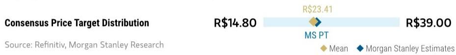

bar

Consensus Price Target Distribution
| Category | Value (R$) |
|---|---|
| MS PT | 23.41 |
| MS Estimates | 39.00 |
Source: Refinitiv, MS

RISK REWARD CHART   
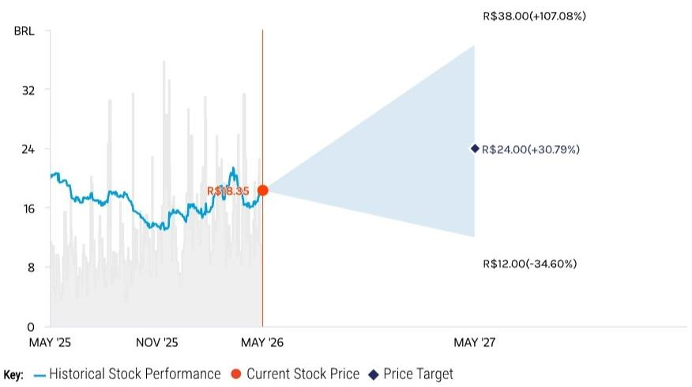

line

| Date     | Historical Stock Performance | Current Stock Price | Price Target |
| -------- | ----------------------------- | ------------------- | ------------ |
| MAY '25  | ~18                           | -                   | -            |
| NOV '25  | ~16                           | -                   | -            |
| MAY '26  | $18.35                        | $18.35              | -            |
| MAY '27  | -                             | $24.00              | $38.00       |

Source: Refinitiv, MS

# OVERWEIGHT THESIS

\- Trading below replacement cost; S&E valued at just \~US\$60/ton: below replacement cost and in line with distressed M&A multiples—despite its superior asset quality and scale.

■ Current valuation implies zero value for its growing corn ethanol business. And Corn ethanol could be a re-rating catalyst. Strong inter-harvest ethanol prices and low inventories could drive upside surprises and prompt the market to reprice this underappreciated asset

■ Margins and ROEs at decade lows; cycle inflection likely near: Margins and ROEs likely to fall below previous cycle lows, suggesting a potential supply response and setting the stage for a recovery.

Consensus Rating Distribution   
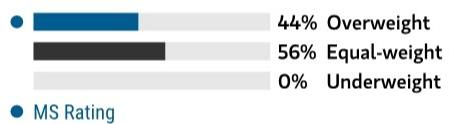

bar

| Category | Value (%) |
|---|---|
| Overweight | 44 |
| Equal-weight | 56 |
| Underweight | 0 |
| MS Rating | (not labeled but visually present)

Source: Refinitiv, MS

# Risk Reward Themes

Pricing Power: Negative Renewable Energy: Positive

View descriptions of Risk Rewards Themes here

# BULL CASE

# Higher Sugar prices

Sugar prices at \$21c/lb re-rate S&E assets to 80 EV/Tn and 6x EBITDA for the Corn Business

# R\$38.00

# BASE CASE

# Replacement cost

Assume \$60 EV/Tn, in line with recent M&A multiples under depressed Sugar prices (\$17clb) and 6x EBITDA for Corn Ethanol of R\$582mn with R\$2,436 Ethanol price.

# R\$24.00

# BEAR CASE

# R\$12.00

# Further De-rating and no value to corn ethanol op

In our bear case of R\$12/share, we assume S&E assets will continue to de-rate to \$50/ton under lower Oil and sugar prices at \$10bu and the market will continue to assign no value to the Corn Ethanol business.

# Risk Reward – Sao Martinho SA (SMTO3.SA)

KEY EARNINGS INPUTS 

<table><tr><td>Drivers</td><td>2025</td><td>2026e</td><td>2027e</td><td>2028e</td></tr><tr><td>Sugar Prices</td><td>19.9</td><td>16.8</td><td>17.0</td><td>17.0</td></tr><tr><td>Ethanol Prices</td><td>2,730.6</td><td>2,949.2</td><td>2,578.1</td><td>2,436.0</td></tr><tr><td>Cane Crushing Volume</td><td>21,788.2</td><td>21,672.6</td><td>23,200.0</td><td>23,432.0</td></tr><tr><td>Sugar in production mix (%)</td><td>45.0</td><td>49.0</td><td>48.0</td><td>49.0</td></tr><tr><td>EBITDA Margin (%)</td><td>54.7</td><td>51.2</td><td>49.2</td><td>47.6</td></tr></table>

# INVESTMENT DRIVERS

- Sugar prices.   
- Oil and Ethanol dynamics. The relative profitability vs. sugar, influenced by Brent and FX.   
- Cost of production: Margin and cash flow driver. SMTO is the industry reference consistently.

GLOBAL REVENUE EXPOSURE   
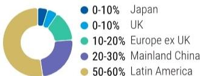

pie

| Region | Percentage (%) |
| :--- | :--- |
| Japan | 0-10 |
| UK | 0-10 |
| Europe ex UK | 10-20 |
| Mainland China | 20-30 |
| Latin America | 50-60 |

Source: MS Estimate View explanation of regional hierarchies here

# RISKS TO PT/RATING

# RISKS TO UPSIDE

- Stronger results, if ethanol prices becomes more attractive than Sugar. Higher Oil prices, weaker FX   
- Corn ethanol plant could affect shares if results (margins) exceed expectations   
- Global Supply Disruptions: India below expected

# RISKS TO DOWNSIDE

- Fuel policies in Brazil: changes could keep ethanol prices low   
- Sugar prices: lower oil prices, Weather events may affect yield   
• Stronger BRL reducing export revenues

# OWNERSHIP POSITIONING

Inst. Owners, % Active

60.1%

Source: Refinitiv, MS

MS ESTIMATES VS. CONSENSUS   
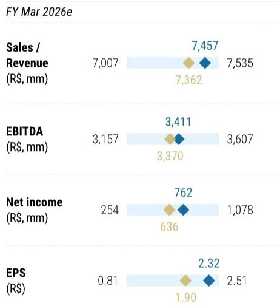

bar_line

FY Mar 2026e
| Metric | Value 1 (R$, mm) | Value 2 (R$, mm) |
| :--- | :--- | :--- |
| Sales / Revenue | 7,007 | 7,457 |
| Sales / Revenue (R$, mm) | 7,362 | 7,535 |
| EBITDA (R$, mm) | 3,157 | 3,411 |
| EBITDA (R$, mm) (labeled) | 3,370 | 3,607 |
| Net income (R$, mm) | 254 | 762 |
| Net income (R$, mm) (labeled) | 636 | 1,078 |
| EPS (R$) | 0.81 | 2.32 |
| EPS (R$) (labeled) | 1.90 | 2.51 |

  
organ Stanley Estimates   
Source: Refinitiv, MS

# MS Sugar Supply and Demand Estimate Changes

Exhibit 20: Global Sugar Supply and Demand: Estimates Summary and Estimates Summary Changes 

<table><tr><td></td><td colspan="4">Current</td><td colspan="3">Previous</td><td colspan="2">Estimate Change %</td></tr><tr><td>Production</td><td>23/24</td><td>24/25</td><td>25/26e</td><td>26/27e</td><td>24/25</td><td>25/26e</td><td>26/27e</td><td>25/26e</td><td>26/27e</td></tr><tr><td>Brazil</td><td>45.5</td><td>43.7</td><td>44.0</td><td>42.9</td><td>43.7</td><td>42.2</td><td>44.1</td><td>+4%</td><td>-3%</td></tr><tr><td>India</td><td>29.5</td><td>28.0</td><td>28.2</td><td>27.3</td><td>28.0</td><td>32.0</td><td>31.0</td><td>-12%</td><td>-12%</td></tr><tr><td>Thailand</td><td>8.8</td><td>10.0</td><td>12.0</td><td>9.5</td><td>10.0</td><td>11.0</td><td>9.9</td><td>+9%</td><td>-4%</td></tr><tr><td>European Union</td><td>15.7</td><td>16.4</td><td>15.1</td><td>15.1</td><td>16.4</td><td>15.1</td><td>15.1</td><td>+0%</td><td>+0%</td></tr><tr><td>China</td><td>10.0</td><td>11.2</td><td>12.5</td><td>11.5</td><td>11.2</td><td>12.5</td><td>11.5</td><td>+0%</td><td>+0%</td></tr><tr><td>Rest of the World</td><td>70.7</td><td>71.2</td><td>71.7</td><td>72.0</td><td>71.2</td><td>71.7</td><td>72.0</td><td>+0%</td><td>+0%</td></tr><tr><td>Production (mn tns)</td><td>180.2</td><td>180.5</td><td>183.5</td><td>178.2</td><td>180.5</td><td>184.4</td><td>183.6</td><td>-1%</td><td>-3%</td></tr><tr><td>YoY Change</td><td>0.5%</td><td>0.1%</td><td>1.7%</td><td>-2.9%</td><td>0.1%</td><td>2.2%</td><td>-0.5%</td><td></td><td></td></tr><tr><td>Demand</td><td>23/24</td><td>24/25</td><td>25/26e</td><td>26/27e</td><td>24/25</td><td>25/26e</td><td>26/27e</td><td>25/26e</td><td>26/27e</td></tr><tr><td>Brazil</td><td>9.5</td><td>9.0</td><td>9.0</td><td>8.9</td><td>9.0</td><td>9.0</td><td>8.9</td><td>+0%</td><td>+0%</td></tr><tr><td>India</td><td>30.3</td><td>30.4</td><td>30.1</td><td>30.1</td><td>30.4</td><td>30.4</td><td>30.4</td><td>-1%</td><td>-1%</td></tr><tr><td>Thailand</td><td>3.8</td><td>4.0</td><td>4.0</td><td>4.1</td><td>4.0</td><td>4.1</td><td>4.1</td><td>-0%</td><td>-0%</td></tr><tr><td>European Union</td><td>16.4</td><td>15.9</td><td>15.9</td><td>15.8</td><td>15.9</td><td>15.9</td><td>15.9</td><td>+0%</td><td>-0%</td></tr><tr><td>China</td><td>15.5</td><td>15.4</td><td>15.5</td><td>15.5</td><td>15.4</td><td>15.5</td><td>15.5</td><td>+0%</td><td>+0%</td></tr><tr><td>Rest of the World</td><td>105.3</td><td>105.8</td><td>106.3</td><td>106.9</td><td>105.8</td><td>106.3</td><td>106.9</td><td>+0%</td><td>+0%</td></tr><tr><td>Demand (mn tns)</td><td>180.8</td><td>180.5</td><td>180.8</td><td>181.4</td><td>180.5</td><td>181.1</td><td>181.7</td><td>-0%</td><td>-0%</td></tr><tr><td>YoY Change</td><td>0.0%</td><td>-0.2%</td><td>0.2%</td><td>0.3%</td><td>-0.2%</td><td>0.3%</td><td>0.3%</td><td></td><td></td></tr><tr><td>Global Ending Stocks</td><td>45.0</td><td>44.9</td><td>47.6</td><td>44.5</td><td>44.9</td><td>48.2</td><td>50.1</td><td>-1%</td><td>-11%</td></tr><tr><td>Surplus/Deficit (000 tns)</td><td>-0.6</td><td>-0.1</td><td>2.7</td><td>-3.1</td><td>-0.1</td><td>3.4</td><td>1.9</td><td>-19%</td><td>-265%</td></tr><tr><td>Surplus/Deficit as% of use</td><td>0%</td><td>0%</td><td>1%</td><td>-2%</td><td>0%</td><td>2%</td><td>1%</td><td>-35bp</td><td>-275bp</td></tr><tr><td>Stock-to-use (%)</td><td>25%</td><td>25%</td><td>26%</td><td>25%</td><td>24.9%</td><td>26.6%</td><td>27.6%</td><td>-31bp</td><td>-306bp</td></tr><tr><td>Sugar Price-NY#11 (Usc/lb)</td><td>23.0</td><td>16.1</td><td>17.0</td><td>17.0</td><td>16.1</td><td>15.0</td><td>16.1</td><td>+13%</td><td>+6%</td></tr><tr><td>Future curve (Usc/lb)</td><td>14.7</td><td>15.7</td><td>16.3</td><td>16.9</td><td>14.8</td><td>15.4</td><td>15.7</td><td>+6%</td><td>+7%</td></tr><tr><td>Oil</td><td>82.2</td><td>70.8</td><td>100.0</td><td>80.0</td><td>70.8</td><td>62.0</td><td>63.8</td><td>+61%</td><td>+25%</td></tr></table>

Source: USDA, MS estimates, UNICA, Conab

Exhibit 21: Brazil Sugar and Ethanol Production Estimates Change Summary 

<table><tr><td>Old vs New</td><td colspan="4">Current</td><td colspan="3">Previous</td><td colspan="2">Estimate change (%)</td></tr><tr><td>Brazil</td><td>23/24</td><td>24/25</td><td>25/26</td><td>26/27e</td><td>24/25</td><td>25/26e</td><td>26/27e</td><td>25/26e</td><td>26/27e</td></tr><tr><td>Center South (Apr-Mar)</td><td></td><td></td><td></td><td></td><td></td><td></td><td></td><td></td><td></td></tr><tr><td>Cane Crushing (mn tns)</td><td>654</td><td>622</td><td>611</td><td>636</td><td>622</td><td>607</td><td>622</td><td>+1%</td><td>+2%</td></tr><tr><td>TRS (kg/tn)</td><td>139.2</td><td>141.1</td><td>137.8</td><td>138.5</td><td>141.1</td><td>137.5</td><td>140.3</td><td>+0%</td><td>-1%</td></tr><tr><td>Sugar Mix</td><td>49.0%</td><td>48.1%</td><td>50.4%</td><td>48.0%</td><td>48.1%</td><td>51.0%</td><td>45.7%</td><td></td><td></td></tr><tr><td>Ethanol Mix</td><td>51.0%</td><td>51.9%</td><td>49.6%</td><td>52.0%</td><td>51.9%</td><td>49.0%</td><td>54.3%</td><td></td><td></td></tr><tr><td>Sugar Production (mn tns)</td><td>42</td><td>40</td><td>40</td><td>40.3</td><td>40.2</td><td>40.6</td><td>38.0</td><td>-0%</td><td>+6%</td></tr><tr><td>Ethanol (bn liters)</td><td>27.3</td><td>26.8</td><td>24.5</td><td>25.9</td><td>27.1</td><td>23.2</td><td>26.9</td><td>+6%</td><td>-3%</td></tr><tr><td>North North East</td><td></td><td></td><td></td><td></td><td></td><td></td><td></td><td></td><td></td></tr><tr><td>Cane Crushing (mn tns)</td><td>60.7</td><td>58.4</td><td>57.0</td><td>55.9</td><td>58.4</td><td>59.6</td><td>60.2</td><td>-4%</td><td>-7%</td></tr><tr><td>Sugar Production (mn tns)</td><td>3.4</td><td>3.8</td><td>3.7</td><td>3.2</td><td>3.8</td><td>3.7</td><td>3.9</td><td>+1%</td><td>-17%</td></tr><tr><td>Brazil</td><td></td><td></td><td></td><td></td><td></td><td></td><td></td><td></td><td></td></tr><tr><td>Cane Crushing (mn tns)</td><td>715.1</td><td>680.3</td><td>668.2</td><td>691.7</td><td>680.3</td><td>666.4</td><td>682.3</td><td>+0%</td><td>+1%</td></tr><tr><td>Sugar Production (mn tns) Apr-Mar</td><td>45.8</td><td>44.0</td><td>44.2</td><td>43.5</td><td>44.0</td><td>44.2</td><td>41.9</td><td>-0%</td><td>+4%</td></tr><tr><td>Sugar Production (mn tns) Sep-Oct</td><td>45.5</td><td>43.7</td><td>44.0</td><td>42.9</td><td>43.7</td><td>44.0</td><td>42.9</td><td>+0%</td><td>+0%</td></tr><tr><td>Ethanol</td><td></td><td></td><td></td><td></td><td></td><td></td><td></td><td></td><td></td></tr><tr><td>Ethanol Production (CS)</td><td>33.6</td><td>35.0</td><td>33.7</td><td>37.5</td><td>34.7</td><td>32.6</td><td>37.8</td><td></td><td></td></tr><tr><td>Total Cane Ethanol (bn lt) (anhydrous</td><td>27.3</td><td>26.8</td><td>24.5</td><td>25.9</td><td>27.1</td><td>23.2</td><td>26.9</td><td>+6%</td><td>-3%</td></tr><tr><td>Total Corn Ethanol (bn lt) (anhydrous</td><td>6.27</td><td>8.19</td><td>9.19</td><td>11.58</td><td>7.6</td><td>9.5</td><td>10.9</td><td>-3%</td><td>+6%</td></tr><tr><td>Ethanol price (from adeco model)</td><td>2.41</td><td>2.75</td><td>2.93</td><td>3.12</td><td>2.75</td><td>2.93</td><td>3.12</td><td>+0%</td><td>+0%</td></tr></table>

Source: MS Estimates, USDA, Unica, Conab

# Risk Reward Reference links

1. View explanation of Options Probabilities methodology - Options\_Probabilities\_Exhibit\_Link.pdf   
2. View descriptions of Risk Rewards Themes - RR\_Themes\_Exhibit\_Link.pdf   
3. View explanation of regional hierarchies - GEG\_Exhibit\_Link.pdf   
4. View explanation of Theme/Exposure methodology - ESG\_Sustainable\_Solutions\_External\_Link.pdf   
5. View explanation of HERS methodology - ESG\_HERS\_External\_Link.pdf

# Disclosure Section

The information and opinions in MS were prepared by MS & Co. LLC, and/or MS C.T.V.M. S.A., and/or MS Mexico, Casa de Bolsa, S.A. de C.V., and/or MS Canada Limited. As used in this disclosure section, "MS" includes MS & Co. LLC, MS C.T.V.M. S.A., MS Mexico, Casa de Bolsa, S.A. de C.V., MS Canada Limited and their affiliates as necessary.

For important disclosures, stock price charts and equity rating histories regarding companies that are the subject of this report, please see the MS Disclosure Website at www.morganstanley.com/eqr/disclosures/webapp/generalresearch, or contact your investment representative or MS at 1585 Broadway, (Attention: Research Management), New York, NY, 10036 USA.

For valuation methodology and risks associated with any recommendation, rating or price target referenced in this research report, please contact the Client Support Team as follows: US/Canada +1 800 303-2495; Hong Kong +852 2848-5999; Latin America +1 718 754-5444 (U.S.); London +44 (0)20-7425-8169; Singapore +65 6834-6860; Sydney +61 (0)2-9770-1505; Tokyo +81 (0)3-6836-9000. Alternatively you may contact your investment representative or MS at 1585 Broadway, (Attention: Research Management), New York, NY 10036 USA.

# Analyst Certification

The following analysts hereby certify that their views about the companies and their securities discussed in this report are accurately expressed and that they have not received and will not receive direct or indirect compensation in exchange for expressing specific recommendations or views in this report: Julia Rizzo.

# Global Research Conflict Management Policy

MS has been published in accordance with our conflict management policy, which is available at www.morganstanley.com/institutional/research/conflictpolicies. A Portuguese version of the policy can be found at www.morganstanley.com.br

# Important Regulatory Disclosures on Subject Companies

The following Analyst's or Strategist's spouse or domestic partner may be directly or indirectly involved in the acquisition, sale or trading of securities subject to this Research Report: Julia Rizzo - SLC Agricola S.A.; Julia Rizzo - Rumo SA; Julia Rizzo - Sao Martinho SA; Julia Rizzo - ADECOAGRO S.A..

As of April 30, 2026, MS beneficially owned 1% or more of a class of common equity securities of the following companies covered in MS: Rumo SA, Sociedad Quimica y Minera de Chile S.A..

Within the last 12 months, MS managed or co-managed a public offering (or 144A offering) of securities of ADECOAGRO S.A..

In the next 3 months, MS expects to receive or intends to seek compensation for investment banking services from Rumo SA, Sao Martinho SA, SLC Agricola S.A., Sociedad Quimica y Minera de Chile S.A..

Within the last 12 months, MS has received compensation for products and services other than investment banking services from Sao Martinho SA, SLC Agricola S.A., Sociedad Quimica y Minera de Chile S.A..

Within the last 12 months, MS has provided or is providing investment banking services to, or has an investment banking client relationship with, the following company: ADECOAGRO S.A., Rumo SA, Sao Martinho SA, SLC Agricola S.A., Sociedad Quimica y Minera de Chile S.A..

Within the last 12 months, MS has either provided or is providing non-investment banking, securities-related services to and/or in the past has entered into an agreement to provide services or has a client relationship with the following company: ADECOAGRO S.A., Rumo SA, Sao Martinho SA, SLC Agricola S.A., Sociedad Quimica y Minera de Chile S.A..

MS & Co. LLC makes a market in the securities of ADECOAGRO S.A..

The equity research analysts or strategists principally responsible for the preparation of MS have received compensation based upon various factors, including quality of research, investor client feedback, stock picking, competitive factors, firm revenues and overall investment banking revenues. Equity Research analysts' or strategists' compensation is not linked to investment banking or capital markets transactions performed by MS or the profitability or revenues of particular trading desks.

MS and its affiliates do business that relates to companies/instruments covered in MS, including market making, providing liquidity, fund management, commercial banking, extension of credit, investment services and investment banking. MS sells to and buys from customers the securities/instruments of companies covered in MS on a principal basis. MS may have a position in the debt of the Company or instruments discussed in this report. MS trades or may trade as principal in the debt securities (or in related derivatives) that are the subject of the debt research report.

Certain disclosures listed above are also for compliance with applicable regulations in non-US jurisdictions.

# STOCK RATINGS

MS uses a relative rating system using terms such as Overweight, Equal-weight, Not-Rated or Underweight (see definitions below). MS does not assign ratings of Buy, Hold or Sell to the stocks we cover. Overweight, Equal-weight, Not-Rated and Underweight are not the equivalent of buy, hold and sell. Investors should carefully read the definitions of all ratings used in MS. In addition, since MS contains more complete information concerning the analyst's views, investors should carefully read MS, in its entirety, and not infer the contents from the rating alone. In any case, ratings (or research) should not be used or relied upon as investment advice. An investor's decision to buy or sell a stock should depend on individual circumstances (such as the investor's existing holdings) and other considerations.

# Global Stock Ratings Distribution

(as of April 30, 2026)

The Stock Ratings described below apply to MS's Fundamental Equity Research and do not apply to Debt Research produced by the Firm.

For disclosure purposes only (in accordance with FINRA requirements), we include the category headings of Buy, Hold, and Sell alongside our ratings of Overweight, Equal-weight, Not-Rated and Underweight. MS does not assign ratings of Buy, Hold or Sell to the stocks we cover. Overweight, Equal-weight, Not-Rated and Underweight are not the equivalent of buy, hold, and sell but represent recommended relative weightings (see definitions below). To satisfy regulatory requirements, we correspond Overweight, our most positive stock rating, with a buy recommendation; we correspond Equal-weight and Not-Rated to hold and Underweight to sell recommendations, respectively.

<table><tr><td></td><td colspan="2">Coverage Universe</td><td colspan="3">Investment Banking Clients (IBC)</td><td colspan="2">Other Material Investment Services Clients (MISC)</td></tr><tr><td>Stock Rating Category</td><td>Count</td><td>% of Total</td><td>Count</td><td>% of Total IBC</td><td>% of Rating Category</td><td>Count</td><td>% of Total Other MISC</td></tr><tr><td>Overweight/Buy</td><td>1546</td><td>42%</td><td>467</td><td>51%</td><td>30%</td><td>709</td><td>44%</td></tr><tr><td>Equal-weight/Hold</td><td>1568</td><td>43%</td><td>358</td><td>39%</td><td>23%</td><td>715</td><td>44%</td></tr><tr><td>Not-Rated/Hold</td><td>4</td><td>0%</td><td>0</td><td>0%</td><td>0%</td><td>1</td><td>0%</td></tr><tr><td>Underweight/Sell</td><td>555</td><td>15%</td><td>84</td><td>9%</td><td>15%</td><td>202</td><td>12%</td></tr><tr><td>Total</td><td>3,673</td><td></td><td>909</td><td></td><td></td><td>1627</td><td></td></tr></table>

Data include common stock and ADRs currently assigned ratings. Investment Banking Clients are companies from whom MS received investment banking compensation in the last 12 months. Due to rounding off of decimals, the percentages provided in the "% of total" column may not add up to exactly 100 percent.

# Analyst Stock Ratings

Overweight (O or Over) - The stock's total return is expected to exceed the total return of the relevant country MSCI Index, on a risk-adjusted basis over the next 12-18 months.

Equal-weight (E or Equal) - The stock's total return is expected to be in line with the total return of the relevant country MSCI Index, on a risk-adjusted basis over the next 12-18 months.

Not-Rated (NR) - Currently the analyst does not have adequate conviction about the stock's total return relative to the relevant country MSCI Index on a risk-adjusted basis, over the next 12-18 months.

Underweight (U or Under) - The stock's total return is expected to be below the total return of the relevant country MSCI Index, on a risk-adjusted basis, over the next 12-18 months.

Unless otherwise specified, the time frame for price targets included in MS is 12 to 18 months.

# Analyst Industry Views

Attractive (A): The analyst expects the performance of his or her industry coverage universe over the next 12-18 months to be attractive vs. the relevant broad market benchmark, as indicated below.

In-Line (I): The analyst expects the performance of his or her industry coverage universe over the next 12-18 months to be in line with the relevant broad market benchmark, as indicated below. Cautious (C): The analyst views the performance of his or her industry coverage universe over the next 12-18 months with caution vs. the relevant broad market benchmark, as indicated below. Benchmarks for each region are as follows: North America - S&P 500; Latin America - relevant MSCI country index or MSCI Latin America Index; Europe - MSCI Europe; Japan - TOPIX; Asia - relevant MSCI country index or MSCI sub-regional index or MSCI AC Asia Pacific ex Japan Index.

# Stock Price, Price Target and Rating History (See Rating Definitions)

Sao Martinho SA (SMT03.SA) - As of 05/19/26 GMT in BRL   
Industry : LatAm Agribusiness   
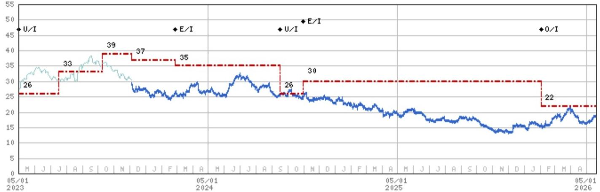

line

| Date       | Blue Line Value | Red Dashed Line Value |
|------------|-----------------|------------------------|
| 05/01 2023 | 26              | 26                     |
|            |                 | 33                     |
|            |                 | 39                     |
|            |                 | 37                     |
|            |                 | 35                     |
|            |                 | 26                     |
|            |                 | 30                     |
|            |                 | 22                     |
|            |                 | 0                      |

Stock Rating History: 5/1/21 : E/I; 12/14/22 : U/I; 2/27/24 : E/I; 9/17/24 : U/I; 10/31/24 : E/I; 2/2/26 : O/I   
Price Target History: 3/28/21 : 31; 10/18/21 : 42; 5/27/22 : 48; 8/3/22 : 42; 12/14/22 : 26; 7/17/23 : 33; 10/9/23 : 39;   
12/5/23:37;2/27/24:35;9/17/24:26;10/31/24:30;2/2/26:22  
Source: MS Date Format : MM/DD/YY Price Target No Price Target Assigned (NA)   
Stock Price (Not Covered by Current Analyst) — Stock Price (Covered by Current Analyst)   
Stock and Industry Ratings (abbreviations below) appear as ♦ Stock Rating/Industry View   
Stock Ratings: Overweight (O) Equal-weight (E) Underweight (U) Not-Rated (NR) No Rating Available (NA)   
Industry View: Attractive (A) In-line (I) Cautious (C) No Rating (NR)   
Effective January 13, 2014, the stocks covered by MS Asia Pacific will be rated relative to the analyst's industry (or industry team's) coverage.   
Effective January 13, 2014, the industry view benchmarks for MS Asia Pacific are as follows: relevant MSCI country index or MSCI sub-regional index or MSCI AC Asia Pacific ex Japan Index.

# Important Disclosures for MS Smith Barney LLC Customers

Important disclosures regarding any material conflict of interest that can reasonably be expected to have influenced MS Smith Barney LLC's choice of a third-party research provider or the subject company of a third-party research report, are available on the MS Wealth Management disclosure website at www.morganstanley.com/online/researchdisclosures. For MS specific disclosures, you may refer to https://www.morganstanley.com/eqr/disclosures/webapp/generalresearch.

Each MS report is reviewed and approved on behalf of MS Smith Barney LLC. This review and approval is conducted by the same person who reviews the research report on behalf of MS. This could create a conflict of interest.

# Other Important Disclosures

MS policy is to update research reports as and when the Research Analyst and Research Management deem appropriate, based on developments with the issuer, the sector, or the market that may have a material impact on the research views or opinions stated therein. In addition, certain Research publications are intended to be updated on a regular periodic basis (weekly/monthly/quarterly/annual) and will ordinarily be updated with that frequency, unless the Research Analyst and Research Management determine that a different publication schedule is appropriate based on current conditions.

MS is not acting as a municipal advisor and the opinions or views contained herein are not intended to be, and do not constitute, advice within the meaning of Section 975 of the Dodd-Frank Wall Street Reform and Consumer Protection Act.

MS produces an equity research product called a "Tactical Idea." Views contained in a "Tactical Idea" on a particular stock may be contrary to the recommendations or views expressed in research on the same stock. This may be the result of differing time horizons, methodologies, market events, or other factors. For all research available on a particular stock, please contact your sales representative or go to Matrix at http://www.morganstanley.com/matrix.

MS is provided to our clients through our proprietary research portal on Matrix and also distributed electronically by MS to clients. Certain, but not all, MS products are also made available to clients through third-party vendors or redistributed to clients through alternate electronic means as a convenience. For access to all available MS, please contact your sales representative or go to Matrix at http://www.morganstanley.com/matrix.

Any access and/or use of MS is subject to MS's Terms of Use (http://www.morganstanley.com/terms.html). By accessing and/or using MS, you are indicating that you have read and agree to be bound by our Terms of Use (http://www.morganstanley.com/terms.html). In addition you consent to MS processing your personal data and using cookies in accordance with our Privacy Policy and our Global Cookies Policy (http://www.morganstanley.com/privacy\_pledge.html), including for the purposes of setting your preferences and to collect readership data so that we can deliver better and more personalized service and products to you. To find out more information about how MS processes personal data, how we use cookies and how to reject cookies see our Privacy Policy and our Global Cookies Policy (http://www.morganstanley.com/privacy\_pledge.html). Please use the provided link to review the Terms and Conditions and Most Important Terms and Conditions for MS India Company Private Limited (https://www.morganstanley.com/assets/pdfs/about-us-global-offices/india/Terms\_and\_conditions.pdf) and the following link to review the audit report (https://ny.matrix.ms.com/eqr/research/webapp/researchdocs/MSICPL\_Morgan\_Stanley\_Research\_Audit\_Report.pdf).

If you do not agree to our Terms of Use and/or if you do not wish to provide your consent to MS processing your personal data or using cookies please do not access our research. The recommendations of Julia Habermann; Julia Rizzo in this report reflect solely and exclusively the analyst's personal views and have been developed independently, including from the institution for which the analyst works.

MS does not provide individually tailored investment advice. MS has been prepared without regard to the circumstances and objectives of those who receive it. MS recommends that investors independently evaluate particular investments and strategies, and encourages investors to seek the advice of a financial adviser. The appropriateness of an investment or strategy will depend on an investor's circumstances and objectives. The securities, instruments, or strategies discussed in MS may not be suitable for all investors, and certain investors may not be eligible to purchase or participate in some or all of them. MS is not an offer to buy or sell or the solicitation of an offer to buy or sell any security/instrument or to participate in any particular trading strategy. The value of and income from your investments may vary because of changes in interest rates, foreign exchange rates, default rates, prepayment rates, securities/instruments prices, market indexes, operational or financial conditions of companies or other factors. There may be time limitations on the exercise of options or other rights in securities/instruments transactions. Past performance is not necessarily a guide to future performance. Estimates of future performance are based on assumptions that may not be realized. If provided, and unless otherwise stated, the closing price on the cover page is that of the primary exchange for the subject company's securities/instruments.

The fixed income research analysts, strategists or economists principally responsible for the preparation of MS have received compensation based upon various factors, including quality, accuracy and value of research, firm profitability or revenues (which include fixed income trading and capital markets profitability or revenues), client feedback and competitive factors. Fixed Income Research analysts', strategists' or economists' compensation is not linked to investment banking or capital markets transactions performed by MS or the profitability or revenues of particular trading desks.

The "Important Regulatory Disclosures on Subject Companies" section in MS lists all companies mentioned where MS owns $1\%$ or more of a class of common equity securities of the companies. For all other companies mentioned in MS, MS may have an investment of less than $1\%$ in securities/instruments or derivatives of securities/instruments of companies and may trade them in ways different from those discussed in MS. Employees of MS not involved in the preparation of MS may have investments in securities/instruments or derivatives of securities/instruments of companies mentioned and may trade them in ways different from those discussed in MS. Derivatives may be issued by MS or associated persons.

With the exception of information regarding MS, MS is based on public information. MS makes every effort to use reliable, comprehensive information, but we make no representation that it is accurate or complete. We have no obligation to tell you when opinions or information in MS change apart from when we intend to discontinue equity research coverage of a subject company. Facts and views presented in MS have not been reviewed by, and may not reflect information known to, professionals in other MS business areas, including investment banking personnel.

MS personnel may participate in company events such as site visits and are generally prohibited from accepting payment by the company of associated expenses unless pre-approved by authorized members of Research management.

MS may make investment decisions that are inconsistent with the recommendations or views in this report.

To our readers based in Taiwan or trading in Taiwan securities/instruments: Information on securities/instruments that trade in Taiwan is distributed by MS Taiwan Limited ("MSTL"). Such information is for your reference only. The reader should independently evaluate the investment risks and is solely responsible for their investment decisions. MS may not be distributed to the public media or quoted or used by the public media without the express written consent of MS. Any non-customer reader within the scope of Article 7-1 of the Taiwan Stock Exchange Recommendation Regulations accessing and/or receiving MS is not permitted to provide MS to any third party (including but not limited to related parties, affiliated companies and any other third parties) or engage in any activities regarding MS which may create or give the appearance of creating a conflict of interest. Information on securities/instruments that do not trade in Taiwan is for informational purposes only and is not to be construed as a recommendation or a solicitation to trade in such securities/instruments. MSTL may not execute transactions for clients in these securities/instruments.

MS is not incorporated under PRC law and the research in relation to this report is conducted outside the PRC. MS does not constitute an offer to sell or the solicitation of an offer to buy any securities in the PRC. PRC investors shall have the relevant qualifications to invest in such securities and shall be responsible for obtaining all relevant approvals, licenses, verifications and/or registrations from the relevant governmental authorities themselves. Neither this report nor any part of it is intended as, or shall constitute, provision of any consultancy or advisory service of securities investment as defined under PRC law. Such information is provided for your reference only.

MS is disseminated in Brazil by MS C.T.V.M. S.A. located at Av. Brigadeiro Faria Lima, 3600, 6th floor, São Paulo - SP, Brazil; and is regulated by the Comissão de Valores Mobiliários; in Mexico by MS México, Casa de Bolsa, S.A. de C.V which is regulated by Comision Nacional Bancaria y de Valores. Paseo de los Tamarindos 90, Torre 1, Col. Bosques de las Lomas Floor 29, 05120 Mexico City; in Japan by MS MUFG Securities Co., Ltd. and, for Commodities related research reports only, MS Capital Group Japan Co., Ltd; in Hong Kong by MS Asia Limited (which accepts responsibility for its contents) and by MS Bank Asia Limited; in Singapore by MS Asia (Singapore) Pte. (Registration number 199206298Z) and/or MS Asia (Singapore) Securities Pte Ltd (Registration number 200008434H), regulated by the Monetary Authority of Singapore (which accepts legal responsibility for its contents and should be contacted with respect to any matters arising from, or in connection with, MS) and by MS Bank Asia Limited, Singapore Branch (Registration number T14FC0118); in Australia to "wholesale clients" within the meaning of the Australian Corporations Act by MS Australia Limited A.B.N. 67 003 734 576, holder of Australian financial services license No. 233742, which accepts responsibility for its contents; in Australia to "wholesale clients" and "retail clients" within the meaning of the Australian Corporations Act by MS Wealth Management Australia Pty Ltd (A.B.N. 19 009 145 555, holder of Australian financial services license No. 240813, which accepts responsibility for its contents; in Korea by MS & Co International plc, Seoul Branch; in India by MS India Company Private Limited having Corporate Identification No (CIN) U22990MH1998PTC115305, regulated by the Securities and Exchange Board of India ("SEBI") and holder of licenses as a Research Analyst (SEBI Registration No. INH000001105); Stock Broker (SEBI Stock Broker Registration No. INZ000244438), Merchant Banker (SEBI Registration No. INM000011203), and depository participant with National Securities Depository Limited (SEBI Registration No. IN-DP-NSDL-567-2021) having registered office at Altimus, Level 39 & 40, Pandurang Budhkar Marg, Worli, Mumbai 400018, India; Telephone no. +91-22-61181000; Compliance Officer Details: Mr. Tejarshi Hardas, Tel. No.: +91-22-61181000 or Email: tejarshi.hardas@morganstanley.com; Grievance officer details: Mr. Tejarshi Hardas, Tel. No.: +91-22-61181000 or Email: msic-compliance@morganstanley.com. MS India Company Private Limited (MSICPL) may use AI tools in providing research services. All recommendations contained herein are made by the duly qualified research analysts; in Canada by MS Canada Limited; in Germany and the European Economic Area where required by MS Europe S.E., authorised and regulated by Bundesanstalt fuer Finanzdienstleistungsaufsicht (BaFin) under the reference number 149169; in the US by MS & Co. LLC, which accepts responsibility for its contents. MS & Co. International plc, authorized by the Prudential Regulation Authority and regulated by the Financial Conduct Authority and the Prudential Regulation Authority, disseminates in the UK research that it has prepared, and research which has been prepared by any of its affiliates, only to persons who (i) are investment professionals falling within Article 19(5) of the Financial Services and Markets Act 2000 (Financial Promotion) Order 2005 (as amended, the "Order"); (ii) are persons who are high net worth entities falling within Article 49(2)(a) to (d) of the Order; or (iii) are persons to whom an invitation or inducement to engage in investment activity (within the meaning of section 21 of the Financial Services and Markets Act 2000, as amended) may otherwise lawfully be communicated or caused to be communicated. RMB MS Proprietary Limited is a member of the JSE Limited and A2X (Pty) Ltd. RMB MS Proprietary Limited is a joint venture owned equally by MS International Holdings Inc. and RMB Investment Advisory (Proprietary) Limited, which is wholly owned by FirstRand Limited. The information in MS is being disseminated by MS Saudi Arabia, regulated by the Capital Market Authority in the Kingdom of Saudi Arabia, and is directed at Sophisticated investors only.

The information in MS is being communicated by MS & Co. International plc (DIFC Branch), regulated by the Dubai Financial Services Authority (the DFSA) or by MS & Co. International plc (ADGM Branch), regulated by the Financial Services Regulatory Authority Abu Dhabi (the FSRA), and is directed at Professional Clients only, as defined by the DFSA or the FSRA, respectively. The financial products or financial services to which this research relates will only be made available to a customer who we are satisfied meets the regulatory criteria of a Professional Client. A distribution of the different MS Research ratings or recommendations, in percentage terms for Investments in each sector covered, is available upon request from your sales representative.

The information in MS is being communicated by MS & Co. International plc (QFC Branch), regulated by the Qatar Financial Centre Regulatory Authority (the QFCRA), and is directed at business customers and market counterparties only and is not intended for Retail Customers as defined by the QFCRA.

As required by the Capital Markets Board of Turkey, investment information, comments and recommendations stated here, are not within the scope of investment advisory activity. Investment advisory service is provided exclusively to persons based on their risk and income preferences by the authorized firms. Comments and recommendations stated here are general in nature. These opinions may not fit to your financial status, risk and return preferences. For this reason, to make an investment decision by relying solely to this information stated here may not bring about outcomes that fit your expectations.

The trademarks and service marks contained in MS are the property of their respective owners. Third-party data providers make no warranties or representations relating to the accuracy, completeness, or timeliness of the data they provide and shall not have liability for any damages relating to such data. The Global Industry Classification Standard (GICS) was developed by and is the exclusive property of MSCI and S&P.

MS, or any portion thereof may not be reprinted, sold or redistributed without the written consent of MS.

Indicators and trackers referenced in MS may not be used as, or treated as, a benchmark under Regulation EU 2016/1011, or any other similar framework.

The issuers and/or fixed income products recommended or discussed in certain fixed income research reports may not be continuously followed. Accordingly, investors should regard those fixed income research reports as providing stand-alone analysis and should not expect continuing analysis or additional reports relating to such issuers and/or individual fixed income products. MS may hold, from time to time, material financial and commercial interests regarding the company subject to the Research report.

Registration granted by SEBI and certification from the National Institute of Securities Markets (NISM) in no way guarantee performance of the intermediary or provide any assurance of returns to investors. Investment in securities market are subject to market risks. Read all the related documents carefully before investing.

Stock Ratings are subject to change. Please see latest research for each company.   
\* Historical prices are not split adjusted.   
INDUSTRY COVERAGE: LatAm Agribusiness 

<table><tr><td>COMPANY (TICKER)</td><td>RATING (AS OF)</td><td>PRICE* (05/19/2026)</td></tr><tr><td>Javier Martinez de Olcoz Cerdan</td><td></td><td></td></tr><tr><td>Sociedad Quimica y Minera de Chile S.A. (SQM.N)</td><td></td><td>US$80.45</td></tr><tr><td colspan="3">Julia Rizzo</td></tr><tr><td>ADECOAGRO S.A. (AGRO.N)</td><td>E (03/16/2026)</td><td>US$13.32</td></tr><tr><td>Rumo SA (RAIL3.SA)</td><td>E (03/30/2025)</td><td>R$14.61</td></tr><tr><td>Sao Martinho SA (SMTO3.SA)</td><td>O (02/02/2026)</td><td>R$18.35</td></tr><tr><td>SLC Agricola S.A. (SLCE3.SA)</td><td>E (09/17/2025)</td><td>R$16.79</td></tr></table>

© 2026 MS