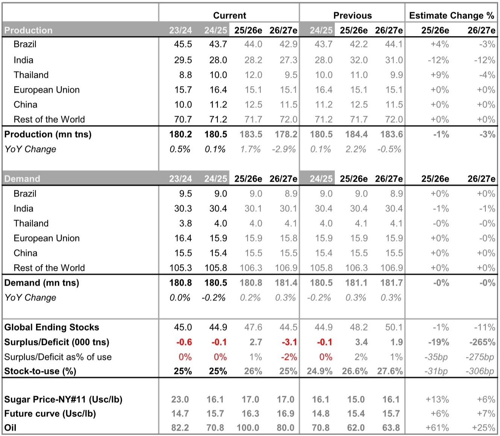
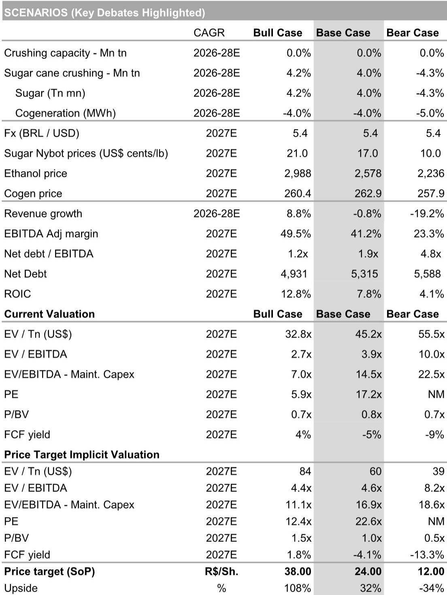
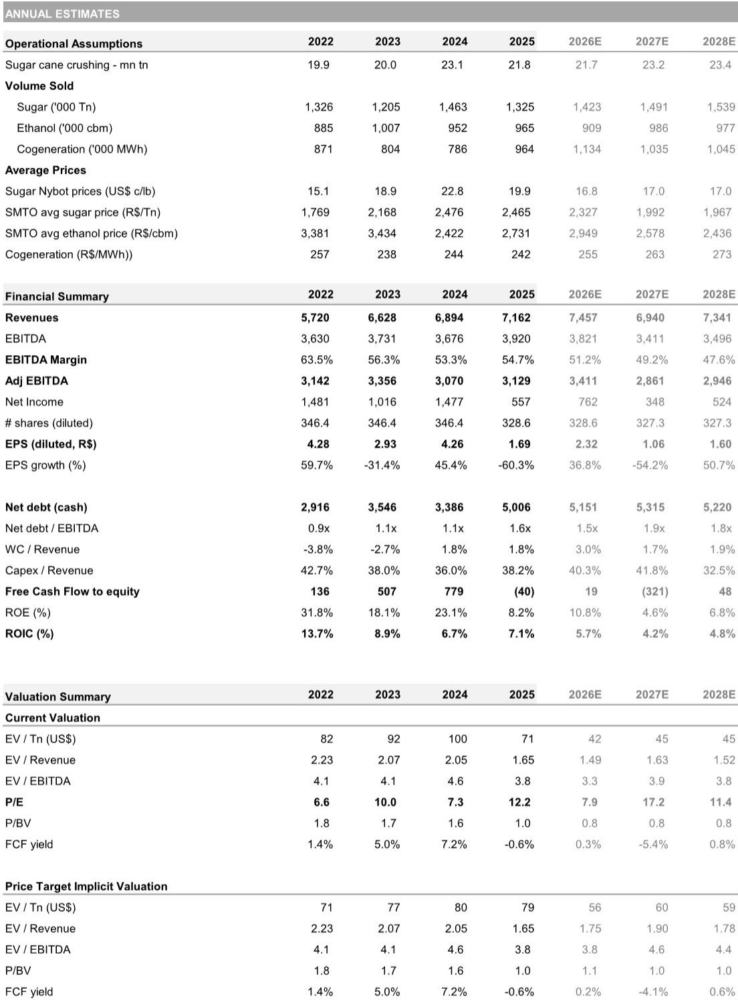

# 糖市真正的拐点不在巴西压榨量，而在被低估的供给反噬风险

市场共识正在指向全球糖市在2026/27年度逐步收紧，但某外资投行最新发布的拉丁美洲糖业研报指出，近期的价格压力远比普遍理解的更为复杂。巴西正在快速释放供给，乙醇价格因库存重建而走弱，糖厂也在向食糖倾斜——所有这些都在压制近月价格。然而，这份研报的核心判断并非简单的“短期看空、长期看多”，而是一个更微妙的时间错配：当前供给端的放松，恰恰是以牺牲未来供给为代价的。

巴西的生产成本目前高于16美分/磅，而近月纽约11号糖期货合约价格仅为15美分/磅。这意味着，蔗农的利润空间已被压缩至亏损线以下。在这种价格环境下，本该被翻新的甘蔗田可能被继续收割，从而恶化甘蔗的年龄结构，降低未来单产，最终在2027/28年度收紧全球平衡表。这正是市场当前定价中最容易被忽视的结构性矛盾——短期供给释放与中期供给收缩之间的不对称风险。

该投行因此维持了对巴西糖业龙头Sao Martinho的增持评级，并将目标价从22雷亚尔上调至24雷亚尔。其逻辑是：当前市场对巴西短期供给上限的定价过于充分，但对厄尔尼诺风险、乙醇政策驱动下的需求弹性以及供给响应滞后性所带来的中期上行风险，却几乎没有定价。

## 1. 乙醇价格急跌并非需求崩塌，而是政策与库存的短期错配

自2026年3月以来，巴西含水乙醇价格出现急剧下跌。这一现象发生在原油价格上升和地缘政治风险加剧的外部环境下，显得尤为反常。研报指出，乙醇库存快速累积是直接原因——这既反映了早期供给的强劲，也反映出需求的阶段性疲弱。

但更值得关注的背后因素，是巴西燃料价格政策正在成为更紧的约束。尽管国际油价走高，巴西国家石油公司Petrobras并未上调汽油价格。市场普遍预期，即便最终上调，在选举年背景下，部分涨幅也将被补贴或减税措施对冲。这实际上为汽油价格设定了上限，也延迟了乙醇价格的恢复。

这意味着，乙醇价格的疲软并非结构性需求恶化，而是政策干预与库存周期叠加的短期现象。一旦政策窗口打开或库存消化加速，乙醇价格将快速修复。而当前乙醇价格低迷所导致的糖厂“最大化产糖”策略，恰恰是未来供给收紧的伏笔。

## 2. 巴西蔗农的亏损正在为2027/28年度的供给缺口埋下伏笔

研报中一个被反复提及但容易被忽视的数据是：巴西甘蔗生产成本目前高于16美分/磅，而近月NY11期货价格仅为15美分/磅。这一价差意味着，巴西蔗农在当前价格水平下处于亏损状态。

其直接后果是，蔗农缺乏动力进行甘蔗田翻新。正常情况下，甘蔗田在若干收割周期后需要重新种植以维持单产。但在当前价格下，蔗农更倾向于继续收割现有甘蔗田，而非投入资金进行翻新。这虽然在短期内支撑了压榨量，但会恶化甘蔗的年龄结构——老化的甘蔗单产更低，从而降低未来年度的总产量。

研报对此的量化估计是：巴西2026/27年度产量预计为4290万吨，低于2025/26年度的4400万吨，更低于2023/24年度的4550万吨。而这一下降趋势在2027/28年度可能进一步加剧。市场当前定价中隐含的“巴西供给充足”假设，很可能在未来被这一结构性反噬所打破。

## 3. 厄尔尼诺风险与乙醇政策是两个未被充分定价的上行变量

研报明确指出，当前市场预期仅嵌入了温和的供需收紧，而几乎排除了两方面的上行风险。

其一是厄尔尼诺天气模式的影响。研报提到，印度、泰国和欧洲的天气状况可能对甘蔗产量产生超出预期的冲击。该投行将印度2026/27年度产量预估从3200万吨下调至2730万吨，降幅达12%；泰国产量预估也从1100万吨下调至950万吨。这些调整尚未完全反映极端天气情景下的尾部风险。

其二是政策驱动的乙醇需求增长。乙醇掺混政策的潜在强化，可能在不改变糖产量的情况下改变糖厂的“糖醇比”决策。研报指出，如果乙醇掺混比例上调，糖厂将倾向于将更多甘蔗用于乙醇生产，从而减少食糖供给。这一政策变量在当前市场中几乎没有被定价。

这两个变量的共同特点是：它们不是大概率事件，但一旦发生，对供需平衡表的冲击将是巨大的。而市场往往倾向于定价“最可能的情景”，忽略“影响大但概率低”的尾部风险。这正是不对称风险的核心来源。

## 4. 报告尚未完全回答的关键问题：乙醇价格恢复的催化剂何时出现

尽管研报对中期糖价偏多的逻辑链条清晰，但一个关键问题尚未得到充分解答：乙醇价格恢复的具体催化剂是什么？什么时候会出现？

研报提到，乙醇价格恢复取决于两个条件：一是Petrobras上调汽油价格，二是乙醇库存消化。但前者受制于选举年的政治约束，后者则取决于需求恢复的速度。研报没有给出明确的时间表，只是指出“政策窗口可能打开”和“库存消化需要时间”。

这个问题之所以关键，是因为它直接决定了糖厂“糖醇比”的拐点。如果乙醇价格长期低迷，糖厂将保持高比例产糖策略，从而在短期内压制糖价。只有在乙醇价格回升后，糖厂才有动力减少产糖比例，从而为糖价提供支撑。

这里仍需验证的是：巴西乙醇需求的恢复是否依赖于汽油价格的上涨，还是可以通过其他渠道（如生物柴油掺混、出口）实现？研报对此没有展开，但这是判断拐点时间的关键变量。

## 5. 对决策者的观察框架：三个信号决定糖市拐点的时间

基于研报的逻辑，我们可以提炼出三个需要密切跟踪的信号，它们将决定糖市从短期压力转向中期偏多的拐点时间。

第一个信号是巴西甘蔗田翻新面积的变化。如果翻新面积持续低于历史均值，则意味着未来单产下降的趋势正在形成。这一信号通常领先于产量变化12-18个月。

第二个信号是巴西汽油价格政策的变化。如果Petrobras在选举后上调汽油价格，或者政府取消对汽油的隐性补贴，乙醇价格将获得直接支撑，从而改变糖厂的产糖决策。

第三个信号是厄尔尼诺天气对北半球甘蔗产区的实际影响。印度和泰国的产量数据将在2026/27榨季初期提供关键验证。如果减产幅度超出当前预估，全球平衡表将从小幅过剩转为显著短缺。

这三个信号中，任何一个的触发都可能改变市场对糖价的时间预期。而当前市场定价中，这三个信号均未被充分反映。

## 6. 糖价的不对称风险意味着当前的价格压力是时间问题，而非方向问题

综合来看，这份研报的核心价值在于揭示了糖市当前面临的不对称风险结构：短期价格压力是真实存在的，但它是以牺牲中期供给为代价的。市场对前者定价充分，对后者几乎未定价。

这意味着，当前的糖价弱势更可能是一个时间问题，而非方向问题。对于产业决策者和投资者而言，关键不在于判断糖价是否会上涨，而在于判断上涨的催化剂何时出现、以何种强度出现。

研报推荐Sao Martinho作为捕捉这一不对称风险的最佳标的，其逻辑是：该公司的低成本资产基础、对糖/乙醇价格复苏的高经营杠杆，以及被低估的玉米乙醇业务，使其在糖价上行周期中具有最大的弹性。尽管短期内仍将受到巴西雷亚尔走强、柴油/投入成本上升和现货乙醇价格疲弱的影响，但估值尚未完全反映周期拐点。

这引出了另一个未解问题：Sao Martinho的玉米乙醇业务在当前乙醇价格低迷的环境下，是否反而成为拖累？研报称其“被低估”，但并未详细展开其成本结构和对冲策略。这是需要进一步探讨的细节。

---

以上分析基于某外资投行发布的拉丁美洲糖业研报，重点提炼了其核心判断、逻辑链条和未解问题。关于巴西乙醇库存重建的速度、厄尔尼诺对北半球产区的具体影响路径，以及Sao Martinho玉米乙醇业务的详细财务模型，研报中还有更多图表和量化数据未在此展开。欢迎来星球微信群里继续讨论，我们将结合完整研报内容，进一步拆解这些关键变量的二阶影响。

Personal reading notes and learning share only. Not investment advice.

