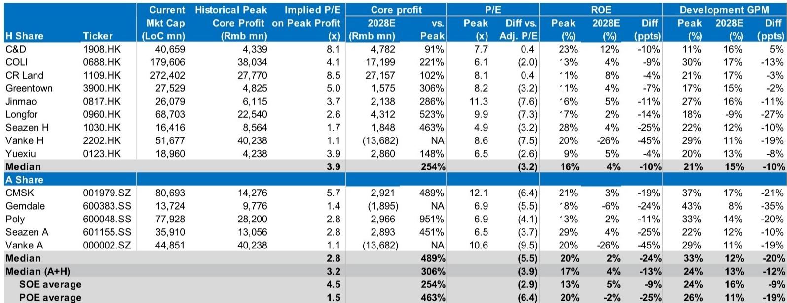
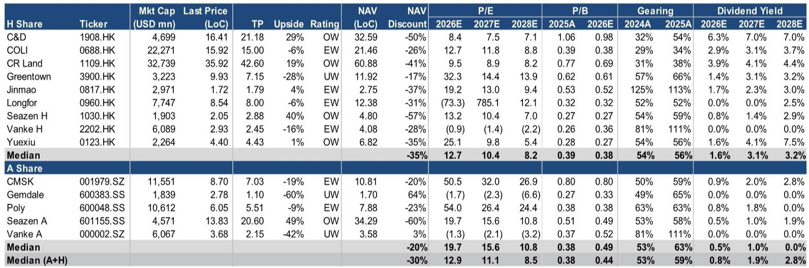
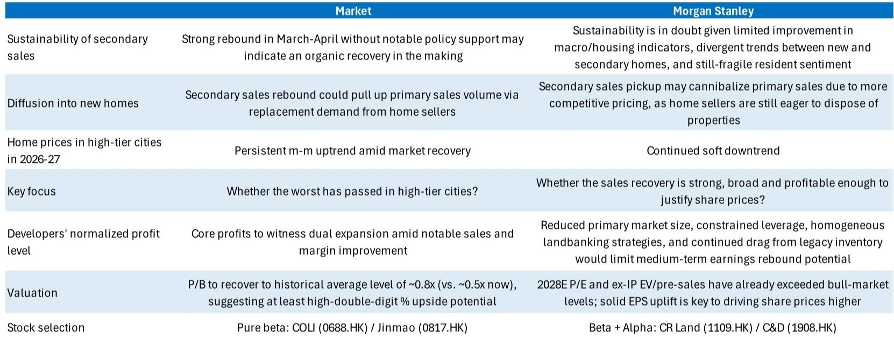

# 中国房地产：反弹还是陷阱？市场低估了供给侧的再定价压力

2026年3月以来，中国二手房市场出现了一轮出乎多数人预料的成交量反弹。25个重点城市的周度二手房成交数据在春节后快速攀升，让部分投资者开始讨论：这是否意味着中国房地产终于迎来了真正的拐点？

某外资投行最新发布的研报给出了一个审慎的判断：市场可能低估了这轮反弹的结构性脆弱性。报告的核心主张是，当前二手房成交量的回升并非需求端的有机复苏，而更可能是供给端的一次集中释放——积压的卖房意愿在价格让步后找到了短期买家，但支撑房价持续回升的条件尚未成熟。

这一判断与市场主流预期之间存在显著分歧。市场倾向于认为，在没有重大政策刺激的情况下，3-4月成交量的自发反弹表明市场正在自然出清。而该投行则认为，这轮反弹的可持续性存疑，且可能被新房市场分流甚至侵蚀——因为二手房卖家仍在急于离场，定价更为激进。

对于关注中国资产定价的投资者而言，理解这一分歧的深层逻辑，比判断短期成交量走势更为重要。因为真正影响房地产板块估值中枢的，不是成交量的脉冲式波动，而是整个行业的盈利模式能否在“缩量时代”找到新的均衡点。

## 1. 二手房反弹的核心驱动力不是需求修复，而是积压释放

要理解这轮二手房成交反弹的本质，需要回到2025年第四季度的数据。25个重点城市的二手房成交在那个季度明显走弱，累计成交量低于历史同期水平。这意味着春节后成交量的快速回升，很大程度上是前期积压需求的集中释放，而非新增需求的涌现。

一个关键数据点是：在春节调整后的成交曲线上，2026年的反弹斜率虽然陡峭，但绝对水平并未显著超越2023年和2024年的同期高点。换言之，这更像是一次“补课”，而不是“突破”。

报告进一步指出，二手房成交的结构也在发生变化。在北京、上海、深圳等一线城市，总价低于500万元的住房占到了二手房成交量的80%以上。自2025年以来，住房总价指数（lump-sum index）的下降速度超过了成交均价的下降速度，这意味着市场交易正在向更低总价的房源集中。这不是改善型需求主导的市场，而是“降级置换”和“以价换量”的典型特征。

对投资者的含义：二手房成交量的短期回暖，并不能作为房价企稳的先行指标。如果成交量的扩大主要来自价格让步，那么“量升价跌”的格局不仅无法修复开发商的利润表，反而可能进一步压低新房定价的空间。

## 2. 新房与二手房的“跷跷板效应”正在强化，而非弱化

市场的一个常见逻辑是：二手房成交量回升会带动置换需求，从而传导至新房市场。但该投行的分析指出，实际情况可能恰恰相反——二手房成交的活跃，正在分流新房的需求。

原因在于定价。二手房卖家（尤其是那些持有时间较长、成本较低的业主）愿意接受更大的价格折让来促成交易，而开发商在新房定价上受到土地成本、建安成本和利润预期的约束，降价空间有限。这使得二手房在新房面前形成了明显的价格优势，尤其是在同一区域、同一品质的房源对比中。

报告中的调查数据显示，截至2026年3月，超过60%的二手房卖家愿意接受低于市场价格成交，其中13%愿意接受超过20%的亏损。这种急于脱手的姿态，使得二手房市场成为新房市场的直接竞争者，而非补充。

对投资者的含义：那些认为“二手房活了，新房也会跟着活”的投资者，可能忽略了两个市场之间正在强化的替代关系。在新房和二手房存在直接竞争的板块，开发商面临的是“量价两难”——降价可能进一步压低利润，不降价则面临市场份额流失。

## 3. 居民购买力的三个结构性约束尚未松动

报告从三个维度论证了居民购房能力并未出现实质性改善。

第一个维度是收入。非制造业就业PMI在2026年4月仍处于收缩区间，表明服务业就业压力并未缓解。制造业PMI虽然稳定在扩张区间，但就业分项同样偏弱。收入预期的改善，是居民愿意加杠杆购房的前提，而当前的数据并未支持这一前提。

第二个维度是杠杆。中国城镇家庭杠杆率在2021年达到64%的峰值后，尽管经历了长达四年的房地产下行，杠杆率仅小幅回落至63%。这意味着居民部门并未经历实质性的去杠杆，而是通过收入增长停滞和资产缩水的双重挤压，维持了名义杠杆率的高位。在这种背景下，居民主动加杠杆购房的空间极为有限。

第三个维度是住房拥有率。2020年人口普查数据显示，中国城镇家庭住房拥有率已达78%，全国整体为85%。这一水平不仅远高于美国的65%和英国的64，甚至高于日本的77%。从国际比较来看，中国住房需求已从“有没有”进入“好不好”的阶段，总量增长的空间已经大幅收窄。

对投资者的含义：居民购买力的恢复不能仅看利率是否下降，更要看收入预期、杠杆空间和存量需求的释放。当前这三个条件都未满足，这意味着即使成交量短期上行，也难以转化为持续的价格支撑。

## 4. 租金收益率持续走低，正在侵蚀房产的投资属性

报告中一个容易被忽视但极为重要的信号是租金数据的走势。自2021年7月以来，全国租金水平已累计下跌约15%，并且在2026年4月再次出现加速下行的迹象。

更值得关注的是，更多城市正在经历租金收益率的重新走弱。2025年12月，尚有93%的城市租金收益率环比持平或上升，但到2026年4月，这一比例骤降至63%，其余城市均出现租金收益率下行。

租金收益率是衡量房产投资价值的核心指标。当租金收益率持续走低，意味着房产的现金流回报能力在下降，这会进一步压低购房者的出价意愿，尤其是对投资性需求而言。对于自住需求，租金下跌虽然降低了购房的机会成本（租房更便宜），但也削弱了“买房抗通胀”的传统叙事。

对投资者的含义：租金数据的持续走弱，是房地产基本面尚未触底的重要信号。如果租金收益率无法企稳，房价的底部就难以确认，因为资产定价的锚正在下移。

## 5. 报告尚未完全回答的关键问题：政策干预的边界在哪里？

该投行的分析框架在需求侧和供给侧都给出了较为详尽的论证，但有一个关键问题尚未完全展开：政策干预的边界在哪里？

报告提到了库存水平——70城新房库存去化周期在2026年3月已攀升至32个月，远高于15个月的合理水平。但报告没有深入讨论的是，政府是否有意愿和能力通过收储、棚改或类似工具来消化这部分库存。如果政府大规模介入二手房和新房市场，是否会改变当前“以价换量”的定价逻辑？

同样，报告提到了居民杠杆率的高位，但没有讨论政策是否可能通过债务重组、利率补贴或税收减免等方式，直接降低居民的购房成本。这些政策工具的效果和成本，是判断市场能否走出“量价齐跌”的关键变量。

另一个未解的问题是：如果二手房成交量持续活跃，是否会倒逼开发商进一步降价以争夺市场份额？如果开发商选择降价，其利润表还能承受多大的压力？报告中提到开发商的中期盈利回升潜力受到“缩量、去杠杆、同质化拿地和历史库存拖累”的限制，但并未给出一个明确的利润底部区间。

这些问题的答案，将直接决定房地产板块的估值中枢在哪里。当前的估值修复更多是基于“最坏的时候已经过去”的预期，而非基于盈利能力的实质性改善。如果政策干预力度不及预期，或者开发商利润底部比市场想象得更低，那么当前的估值水平可能并不安全。

## 6. 投资者的观察框架：用三个维度检验“拐点论”

基于上述分析，投资者在判断房地产是否真正见底时，可以建立以下三个维度的观察框架。

第一，关注二手房成交的结构而非总量。如果成交量扩大主要来自低总价房源和价格折让，那么这不是需求回暖，而是供给出清。真正的拐点应该看到中高总价房源成交占比的提升，以及成交均价的企稳。

第二，关注租金收益率而非房价指数。租金收益率是房产投资回报的真实反映。如果租金收益率继续下行，即使房价短期企稳，也是脆弱的。只有当租金收益率开始回升，才意味着资产定价的底部正在形成。

第三，关注开发商的利润质量而非收入规模。在缩量时代，开发商的竞争优势将从“拿地能力”转向“成本控制能力和产品差异化能力”。那些能够在不依赖杠杆扩张的情况下维持利润率的企业，才是值得长期关注的标的。报告中提到的“Beta+Alpha”选股逻辑——即关注兼具行业β和公司α的标的——正是基于这一判断。

这三个维度可以帮助投资者区分“交易性反弹”和“趋势性反转”，避免在成交量脉冲中被短期情绪所左右。

---

这轮二手房成交反弹究竟是一次真正的拐点，还是又一次“假动作”？答案可能取决于我们愿意相信什么样的数据。该投行的分析框架提供了审慎的视角，但正如报告自身所承认的，某些关键假设——比如政策干预的力度和节奏、居民收入预期的改善时间表——仍然存在较大的不确定性。

这些未解的问题，恰恰是深度讨论的价值所在。如果你对这轮房地产反弹的本质、政策可能的应对路径、以及开发商盈利修复的具体条件有更深入的兴趣，欢迎来我们的星球微信群里继续讨论。在那里，我们会分享完整的研报原文、核心图表，以及对关键假设的进一步推演。

Personal reading notes and learning share only. Not investment advice.

