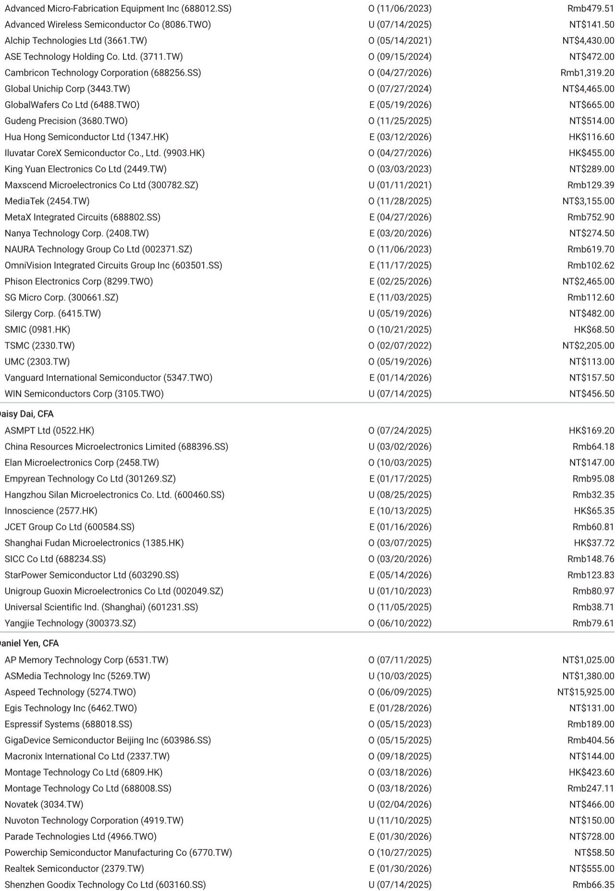
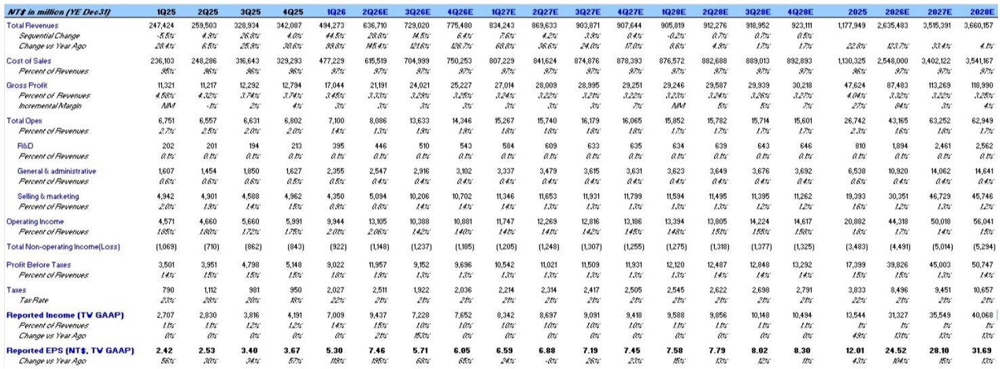
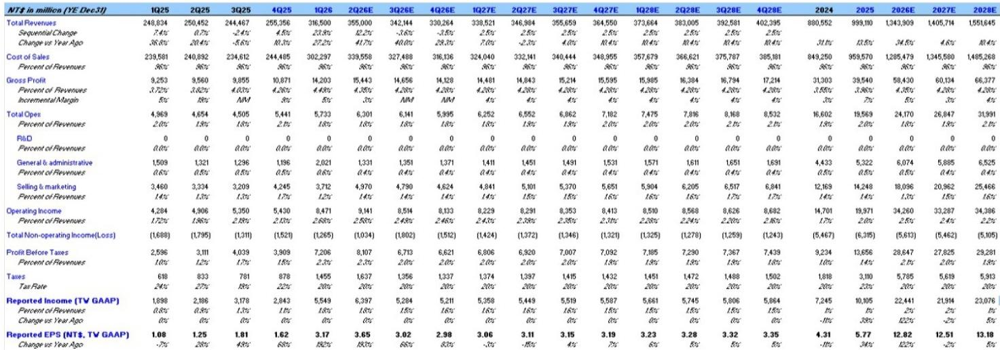

# 半导体分销的AI红利，市场仍低估了规模效应的复利

当市场还在围绕AI芯片的算力竞赛展开叙事时，一份来自某外资投行的最新研报揭示了一个被相对忽视的受益环节：半导体分销。报告的主角是两家台湾分销商——大联大与文晔科技。它们的2026年第一季度业绩不仅大幅超出预期，第二季度的指引更是显示出AI需求正在从训练侧向推理和边缘侧加速渗透。这并非一次性的订单脉冲，而是正在重塑分销商盈利模型的结构性变化。

核心判断是：市场对分销商的理解仍停留在“搬运工”的刻板印象中，但AI带来的不仅是营收增长，更是运营杠杆的极致释放。当营收以两位数的季度环比增速扩张时，分销商的固定成本被摊薄，利润率开始出现非线性改善。这正是当前财报中最值得关注的信号——规模不再是数字的堆砌，而是转化为实实在在的利润弹性。

报告将文晔科技的目标价从299新台币上调至349新台币，将大联大的目标价从121新台币上调至160新台币。上调幅度之大，背后是EPS预测的大幅修正：文晔2026-2028年EPS分别上调12%、17%和16%；大联大三年EPS均上调32%。这种同步且大幅的上修，在分销行业并不多见。

## 1. 营收暴增的背后，是AI从训练到推理的全面渗透

文晔科技一季度的营收已达494亿新台币，环比增长44.5%，同比增长38.6%。更令人瞩目的是，该公司对二季度的指引中位数营收高达637亿新台币，环比再增28.8%。全年营收预测从2432亿新台币上调至2635亿新台币，增幅8%。大联大一季度营收3165亿新台币，环比增长24%，同比增长27%，二季度指引中点3550亿新台币，环比增长12%。

这些数字背后，是AI基础设施建设从“建算力”向“用算力”的转折。报告明确指出，业绩驱动来自“持续的全球AI需求和资本支出指引”，且管理层预期“推理和边缘AI的强劲需求将持续”。这意味着，分销商不再仅仅服务于数据中心建设期的服务器采购，而是开始受益于AI应用落地带来的终端设备升级与更新。

从应用分类来看，大联大一季度计算类产品占比49%，通讯类15%，消费类8%，工业和汽车各占7%。计算类产品的强势增长印证了AI服务器的持续放量，而工业和汽车类别的温和增长则暗示，AI对传统产业的渗透尚在早期。但正是这种“早期”意味着未来的持续性——当分销商已经提前锁定AI产业链的流量入口，其增长曲线不会在短期内见顶。

## 2. 毛利率微升背后，是产品结构优化的隐性力量

分销行业最容易被忽视的指标是毛利率的变化。大联大一季度毛利率4.5%，环比提升0.2个百分点，同比提升0.8个百分点。文晔科技一季度毛利率3.45%，虽然环比有所下降，但考虑到其营收环比暴增44.5%，毛利率的绝对水平仍高于2025年全年的3.32%预测值。

更值得关注的是产品结构的变化。大联大一季度的核心组件（core components）占比从去年四季度的31%下降至23%。报告解释称，这是“公司提升利润率的举措”。核心组件通常是存储器和逻辑芯片等标准化程度较高的产品，毛利率相对较低。占比下降，意味着分销商正在将资源向更高附加值的方向倾斜——比如AI服务器所需的定制化芯片、电源管理、高速连接器等。

这种结构优化带来的利润率改善，在运营层面表现得更为明显。大联大一季度运营利润率2.7%，环比提升0.5个百分点，同比提升1.0个百分点。文晔科技一季度运营利润率2.01%，显著高于2025年全年的1.6%。运营杠杆的释放，是分销商盈利模型从线性增长转向非线性增长的关键。

## 3. 运营杠杆的释放，正在改写分销商的估值逻辑

传统上，市场给分销商的估值倍数偏低，因为其业务被视为低毛利的“通道生意”。但当前的数据正在挑战这一认知。文晔科技一季度ROE已达到24.8%，且预测模型显示，这一数字将在未来十年持续上升至31%以上。大联大一季度的ROWC（营运资本回报率）从去年四季度的11.5%跃升至15.2%。

这些回报率指标的大幅提升，意味着分销商正在从“赚辛苦钱”转向“赚资本效率的钱”。当AI需求的持续性与规模效应叠加，每一元新增营收所消耗的资本正在减少。这正是报告大幅上调EPS预测的核心逻辑——它不是基于营收增长的线性外推，而是基于利润率改善带来的非线性弹性。

从估值模型来看，报告采用剩余收益模型（Residual Income Model），文晔科技的权益成本设定为12.6%，长期增长率3%。在当前利率环境下，这一假设并不激进。如果运营杠杆的释放能够持续，实际回报率将远超权益成本，从而推动内在价值持续增长。

## 4. 一个尚未完全回答的问题：AI红利能持续多久？

尽管报告给出了非常乐观的盈利预测，但一个关键问题并未完全展开：当前AI驱动的半导体需求周期，与历史上任何一轮库存周期有何本质不同？分销商能否避免“周期见顶后库存减值”的历史宿命？

报告对文晔科技的营收预测显示，2026年营收将同比增长123.7%，2027年增速放缓至33.4%，2028年进一步降至4.1%。这种增速的急剧放缓，暗示分析师认为AI的爆发式增长集中在2026-2027年，之后将进入平稳期。但问题在于，这一假设是否过于保守？如果推理和边缘AI的渗透速度超出预期，2028年后的增长曲线可能比模型预测的更为陡峭。

另一个未解问题是分销商的竞争格局。报告同时覆盖文晔和大联大两家公司，但并未深入比较两者在AI供应链中的差异化定位。文晔科技在AI服务器芯片分销上占据先发优势，而大联大则拥有更广泛的客户基础和更高的营收规模。当AI从数据中心向边缘设备扩散时，哪家公司的渠道网络更能捕捉长尾需求？这一问题在报告中并未得到充分回答。

## 5. 读者可以建立的观察框架

基于这份报告的分析逻辑，产业决策者和投资者可以建立一个三层观察框架：

第一层：跟踪季度营收增速与利润率变化的关系。如果营收增速维持在20%以上而运营利润率持续提升，则运营杠杆的故事仍在演绎。一旦营收增速放缓而利润率同步下降，则需要警惕周期见顶。

第二层：关注产品结构的变化。核心组件占比的下降、高附加值产品占比的上升，是分销商盈利能力改善的先行指标。如果某季度核心组件占比重新上升而毛利率下降，可能意味着竞争加剧或库存压力。

第三层：观察AI需求的结构性演变。当前的主要驱动力来自训练侧的服务器采购。当推理和边缘AI需求成为主流时，分销商的产品组合和客户结构将发生根本性变化。这一转变的速度，将决定分销商估值能否突破历史天花板。

报告给出的目标价上调，是基于当前可见的订单和指引。但真正值得思考的问题是：如果AI的需求持续性超出了模型假设，分销商的盈利弹性还有多大？这个问题，需要更深入的行业调研和财务建模才能回答。

---

以上分析基于某外资投行最新研报的核心逻辑和财务数据，但报告的完整内容还包括详细的季度财务预测、估值模型的敏感性分析、以及两家公司的竞争优劣势对比。这些信息对于形成完整的投资判断至关重要。

如果您希望进一步探讨文晔科技与大联大的估值差异、AI需求周期的边际变化，或是分销行业的竞争壁垒，欢迎来知识星球微信群里继续讨论。我们会在社群中分享完整报告的原始图表和关键数据点，并持续跟踪后续季度的业绩兑现情况。

Personal reading notes and learning share only. Not investment advice.

