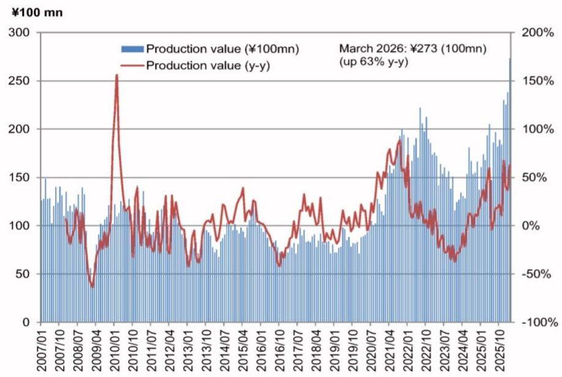
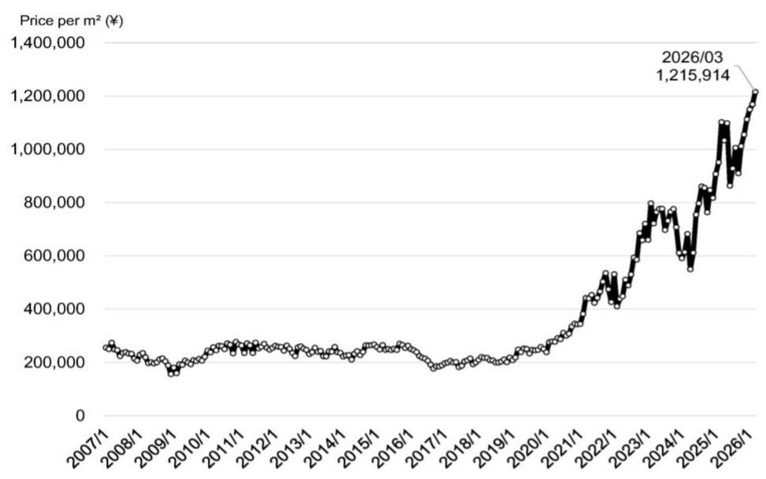

# The Japanese Package Substrate Data Is Not Just a Supply Signal—It Is a Structural Demand Confirmation

The March 2026 shipment data for rigid module PCBs in Japan is not an incremental data point. It is a threshold event. Shipments reached ¥27.3 billion, a record high, and the price per square meter hit ¥1.216 million, also an all-time peak. The first quarter alone delivered ¥73.6 billion in shipments, a 46.6% year-on-year increase. These numbers are not noise. They are the clearest evidence yet that the semiconductor packaging supply chain is transitioning from a capacity-constrained, demand-uncertain phase into a volume-and-value acceleration phase. The critical question for investors is no longer whether demand exists, but how quickly the supply side can deliver, and at what price.

The data from Japan's Ministry of Economy, Trade and Industry's Current Survey of Production provides a high-frequency lens into a market that has historically been opaque. Package substrates, the rigid module PCBs that sit at the heart of advanced semiconductor packaging, are a bottleneck node in the AI hardware ecosystem. When shipments and pricing move in lockstep to record levels, it tells us that demand is outstripping supply, and that customers are willing to pay a premium for capacity. This is not a cyclical recovery. This is the early innings of a structural repricing.

The report infers that the sharp March jump is linked to Ibiden's Ono plant ramping up mass production. If correct, this has profound implications. It suggests that the incremental supply from a new, high-end facility is being absorbed immediately at higher prices, rather than depressing pricing. That is a classic sign of a market that has more demand than it can satisfy. For the broader semiconductor packaging industry, this means the pricing power that emerged in 2024 is not fading. It is deepening.

## The Ono Plant Ramp-Up Is the Canary in the Coal Mine for Capacity Absorption, Not a Risk of Oversupply

The most important inference in the report is that Ibiden's Ono plant began contributing to shipments in earnest in March. January and February saw ¥22.5 billion and ¥23.8 billion in shipments respectively, followed by a leap to ¥27.3 billion in March. On a trailing twelve-month basis through March 2026, shipment value reached ¥245.0 billion, up 30.7% year-on-year, with the average price per square meter at ¥1.050 million.

The significance here is not the volume increase alone. It is the price resilience. When a new plant comes online, the natural expectation is that increased supply would compress margins, especially in a capital-intensive industry like substrate manufacturing. That is not what is happening. Instead, the average price per square meter for the trailing period is already higher than the historical average, and the report's forward estimates project a further 30% increase to around ¥1.36 million per square meter by fiscal year 2027. This implies that the new capacity is being filled with higher-value products, not commodity substrates.

The strategic implication is clear: the substrate market is bifurcating. High-end products for AI accelerators, next-generation switches, and multicore CPU packaging are commanding a significant premium, while legacy substrates face normal pricing pressure. Investors should focus on which manufacturers are positioned in the premium tier. The Ono plant appears to be a premium-tier facility, and its ramp-up is validating the thesis that AI-driven demand can absorb new capacity without destroying pricing.

## The Karpathy Move to Anthropic Signals That Agent Models Will Become the Next Demand Driver for Advanced Packaging

The report notes that Andrej Karpathy, a founding member of OpenAI and former lead of Tesla's end-to-end autonomous driving model development, has joined Anthropic's pre-training team. This is not a personnel move to be filed under industry news. It is a strategic signal about where the AI industry is heading, and by extension, where semiconductor packaging demand will come from next.

Karpathy's own statement that the next two to three years will be a period of special development for cutting-edge LLMs is a direct time-bound forecast. The report speculates that his focus will include pre-training models specialized for agent models, including models with verifiable reasoning paths and sustained learning capabilities, as well as large language model operating systems that enable long-term task execution, self-correcting loops, and tiered multi-agent architectures.

Why does this matter for package substrates? Because agent models are compute-intensive in a fundamentally different way from current LLM inference. Agents require sustained, multi-step reasoning, often with external tool use and memory. This architecture demands higher bandwidth between memory and compute, more complex chiplet interconnects, and larger, more sophisticated packaging solutions. The substrate requirements for an agent-optimized chip are not the same as for a standard GPU. They are more demanding. If Karpathy and Anthropic succeed in advancing agent models, the substrate industry will face a new wave of demand that is not yet priced into current forecasts.

The open question is whether the current generation of substrate capacity is designed for this next wave. The report does not answer this. It leaves investors to consider whether the premium substrates being shipped today are future-proof, or whether a new specification will be required.

## The Pricing Trajectory for Package Substrates Is Not Cyclical—It Is a Structural Repricing Driven by Product Complexity

The report's forward assumptions are striking. It forecasts a 30% increase in price per square meter to ¥1.36 million by fiscal year 2027, combined with a 20% increase in volume shipped. This implies total shipment value growth of over 50% from the trailing twelve-month base of ¥245.0 billion. Such a trajectory is inconsistent with a cyclical peak. It is consistent with a structural repricing.

The driver is product mix. The report specifically cites increased shipments of Rubin, next-generation switches, and high-priced multicore CPU packaging substrates, including EMIB. These are not commodity products. They are engineered solutions that require advanced manufacturing processes, tighter tolerances, and higher layer counts. The substrate is no longer a passive component. It is an active part of the chip's electrical and thermal performance.

The "so what" for investors is that traditional valuation frameworks based on historical price-to-earnings multiples for substrate manufacturers may be misleading. If pricing is structurally higher, then earnings power is structurally higher. But the risk is that the market has not fully discounted this, or that the pricing trajectory is dependent on a narrow set of customers. The report does not disclose customer concentration, but the implication is clear: the pricing power of substrate manufacturers is tied to the health and ambition of a small number of AI chip designers.

## What the Report Does Not Fully Answer: The Sustainability of Pricing Power and the Role of Customer Concentration

For all the insight in the data, the report leaves several critical questions unresolved. First, it does not provide granularity on customer concentration. If a single AI chip designer accounts for a disproportionate share of premium substrate demand, then pricing power is fragile. A design shift, a vertical integration move, or a technology change by that customer could reset the pricing environment overnight.

Second, the report does not address the potential for substrate technology disruption. Silicon interposers, glass substrates, and hybrid bonding are all emerging alternatives that could reduce the demand for traditional organic package substrates. The report assumes the current technology trajectory continues, but the pace of innovation in advanced packaging is accelerating. A breakthrough in glass substrates, for example, could render current capacity less valuable.

Third, the report does not model the impact of geopolitical risk. Japan's substrate manufacturers are critical nodes in the global AI supply chain. Any disruption to production, whether from natural disasters, trade restrictions, or energy price shocks, would have outsized effects on pricing and availability. The report's forecasts assume a stable operating environment, which is not guaranteed.

These open questions are not weaknesses of the report. They are the natural boundaries of any analysis. But they are precisely the questions that investors need to answer before acting on the bullish data.

## How to Use This Data as a Decision Framework: Three Filters for Substrate Investment

The report provides the raw material for a structured investment decision. Here is a framework for applying it.

First, filter by technology tier. Not all substrate manufacturers will benefit equally. The data shows that pricing power is concentrated in high-end, high-layer-count substrates. Manufacturers with exposure to commodity PCBs or legacy packaging will not see the same margin expansion. The key question is: what percentage of a company's revenue comes from substrates used in AI accelerators, switches, or advanced CPU packages?

Second, filter by capacity expansion timing. The Ono plant ramp-up is happening now, and the data suggests it is being absorbed. But the next wave of capacity, whether from Japan, Taiwan, or other regions, may not have the same demand backdrop. Investors need to map the capacity addition timeline against the product cycle of major AI chip customers. If capacity comes online just as the current generation of AI chips peaks, the pricing environment could reverse.

Third, filter by customer relationship depth. The substrate market is not a spot market. It is a relationship-driven, long-lead-time business. Companies that have secured multi-year supply agreements with AI leaders have more predictable revenue and pricing. Companies that are dependent on a single customer or a single product generation are more vulnerable. The report does not provide this data, but it is the logical next step for any investor using this analysis.

## The Next Two Years Will Define Whether Substrate Manufacturing Becomes a Strategic Asset or a Commodity Business

The report's data and inferences point to a narrow window of opportunity. If the Karpathy forecast is correct, and the next two to three years are indeed a period of special development for cutting-edge LLMs and agent models, then the demand for premium substrates will accelerate. If the Ono plant ramp-up is a template for how new capacity is absorbed, then pricing will remain strong. If the structural repricing is real, then earnings multiples should expand.

But the window is narrow. Technology disruption, customer concentration, and geopolitical risk are real. The next two years will determine whether substrate manufacturing becomes a strategic, high-margin asset class within the semiconductor supply chain, or whether it reverts to a cyclical, capital-intensive commodity business. The March 2026 data suggests the former is more likely. But the data does not decide the outcome. Only the decisions of companies, customers, and investors will do that.

Join the community to read the full report and review the original charts.

*This article is for learning and discussion only and does not constitute investment advice.*

Personal reading notes and learning share only. Not investment advice.

