# U.S. IT Hardware

# Server OEMs: Agentic AI driving next leg of AI infra build - what does this mean for DELL, HPE, SMCI?

Mark C. Newman

+1 212 845 7822

mark.newman@bernsteinsg.com

April Li

+1 917 344 8339

april.li@bernsteinsg.com

Phoebe Sun

+1 917 344 8481

phoebe.sun@bernsteinsg.com

We believe that Agentic AI will be significantly more CPU intensive driving upside to traditional server TAM, which in turn should benefit the server OEMs. In addition, challenges and pushouts from SMCI could portend the beginning of share losses from SMCI from its most recent reputational challenges (the most recent being the smuggling case see here). This note explains these trends and implications for DELL, HPE and SMCI.

# The rise of more complex inference workloads, and in particular Agentic AI, is expected to drive increased demand for CPU-based (aka “traditional”) servers.

Agentic AI is more CPU intensive than training or simple chatbot inference with CPUs and traditional servers orchestrating workloads. Recent commentaries from Intel/AMD/ARM suggest the early inning of CPU demand upcycle. We see potential for a 3x-4x expansion of traditional server TAM by 2030 which bodes well for all server OEMs.

Meanwhile, SMCI's recent earnings showed a higher mix of enterprise and non-AI revenue, with AI server mix declining for the first time in 10 quarters. This likely reflects 1) strength in traditional servers and 2) potential share loss in AI servers following recent reputational challenges. We believe Dell and HPE are positioned to benefit from both dynamics. While these are longer-term themes and may not yet be reflected in the upcoming earnings, we see the current setup as supportive of upside heading into the prints - Dell reports on May $28^{th}$ , HPE reports on Jun $1^{st}$ .

Dell is our more preferred beneficiary, given its scale, financing capacity, and robust support/services across the AI infrastructure. We consider Dell to be the real AI winner. Being the scale leader with the broadest financing capacity and deepest customer relationships, Dell is best positioned to absorb displaced SMCI demand across cloud, enterprise, and sovereign, we take up estimates and raise our multiple from 14x to 17x FY28 EPS and our target price to \$280. Reiterate Outperform.

HPE should also benefit from stronger server demand and incremental share gains in enterprise and sovereign accounts, justifying our estimates increase and multiple raise from 8x to 12.5x FY27 EPS and a \$35 target price, Market-perform.

SMCI's compliance overhang creates a real share shift opportunity as cloud, enterprise, and sovereign customers reassess vendor risk. SMCI's FQ4 and beyond faces a much harder setup as pre-scandal enterprise momentum fades, unusual data center delays raise the risk of soft cancellations, and potential risks around Nvidia GPU supply -leaves risk-reward firmly skewed to the downside (we rate SMCI Market-perform).

BERNSTEIN TICKER TABLE 

<table><tr><td rowspan="2" colspan="3"></td><td colspan="2">19 May2026</td><td colspan="2">TTM</td><td colspan="4">Adjusted EPS</td><td colspan="3">Adjusted P/E (x)</td></tr><tr><td rowspan="2">ClosingPrice</td><td rowspan="2">PriceTarget</td><td rowspan="2">Rel.Perf.</td><td rowspan="2">Cur</td><td rowspan="2">2026A</td><td rowspan="2">2027E</td><td rowspan="2">2028E</td><td rowspan="2">2026A</td><td rowspan="2">2027E</td><td rowspan="2">2028E</td><td></td></tr><tr><td>Ticker</td><td>Rating</td><td>Cur</td><td></td></tr><tr><td>SMCI (SMCI)</td><td>M</td><td>USD</td><td>30.56</td><td>37.00</td><td>(51.9)%</td><td>USD</td><td>2.60</td><td>2.80</td><td>3.25</td><td>11.8</td><td>10.9</td><td>9.4</td><td></td></tr><tr><td>DELL (Dell)</td><td>O</td><td>USD</td><td>235.26</td><td>280.00</td><td>82.6%</td><td>USD</td><td>10.35</td><td>13.46</td><td>16.47</td><td>22.7</td><td>17.5</td><td>14.3</td><td></td></tr><tr><td>OLD</td><td></td><td></td><td></td><td>220.00</td><td></td><td></td><td></td><td>13.14</td><td>15.99</td><td></td><td></td><td></td><td></td></tr><tr><td>HPE (HPE)</td><td>M</td><td>USD</td><td>32.62</td><td>35.00</td><td>60.8%</td><td>USD</td><td>1.96</td><td>2.43</td><td>2.85</td><td>16.6</td><td>13.4</td><td>11.5</td><td></td></tr><tr><td>OLD</td><td></td><td></td><td></td><td>21.00</td><td></td><td></td><td></td><td>2.39</td><td>2.66</td><td></td><td></td><td></td><td></td></tr><tr><td>SPX</td><td></td><td></td><td>7,353.61</td><td></td><td></td><td></td><td></td><td></td><td></td><td></td><td></td><td></td><td></td></tr></table>

# PRICE TARGET CHANGE / ESTIMATE CHANGE IN BOLD

O - Outperform, M - Market-Perform, U - Underperform, NR - Not Rated, CS - Coverage Suspended

DELL estimate is Reported EPS; HPE base year is 2025;

Source: Bloomberg, Bernstein estimates and analysis.

# INVESTMENT IMPLICATIONS

We value Dell at \~17x (up from 14x previously) our FY 2028 EPS, or \$280.

We value HPE at \~12.5x (up from 8x previously) our FY 2027 EPS, or \$35.

We value Super Micro at 13.2x our revised FY27 EPS of \$2.80 = \$37.

# Table Of Contents

Part I: Agentic AI driving next leg of AI infrastructure build - Traditional Servers to benefit....3

Part II: Why did SMCI beat FQ3'26? And what could SMCI's issues mean for DELL, HPE?......5

Part III: The read across from SMCI hints upside for DELL & HPE into the next print and beyond....7

Part IV: Valuation and model changes....9

DELL: AI Infra Winner - Raise estimates and increase TP to \$280, Reiterate Outperform....9

HPE: Also stands to benefit, raise estimates and TP to \$35, Market-perform.... 10

SMCI: Strong position in AI Servers in jeopardy (IN a Booming Market); Market-perform.... 11

# DETAILS

# PART I: AGENTIC AI DRIVING NEXT LEG OF AI INFRASTRUCTURE BUILD - TRADITIONAL SERVERS TO BENEFIT

We see AI infrastructure demand beginning to broaden beyond GPU-centric systems. In particular, the rise of more complex inference workloads, including agentic AI, is expected to drive increased demand for CPU-based servers.

\- Agentic inference is more CPU intensive than training or simple chatbot inference (Exhibit 1, Exhibit 2). Training workloads are typically large, batch-oriented processes dominated by GPUs. In contrast, agentic workloads involve multi-step task execution, including tool calls, retrieval, routing, memory and context management, validation loops, and significant data movement. These functions rely more heavily on general-purpose compute and orchestration, driving greater demand for CPU-based servers alongside GPU clusters.

\- Recent industry commentary points to a broader reassessment of CPU demand within AI infrastructure. AMD raised its server CPU TAM growth outlook from 18% to over 35% annually, reaching over \$120bn by 2030. Intel noted on its Q1 2026 earnings call that the CPU-to-GPU ratio in inference has already compressed from 1:8 to 1:4 and could trend toward 1:1, while guiding to double-digit server CPU unit growth for the full year with momentum extending into 2027. Arm CEO Rene Haas also highlighted that as agentic AI scales, data centers could require more than 4 times today's CPU capacity (Exhibit 3).

According to above comments, our quick back-of-the-envelope analysis suggests that if assuming CPUs account for 20-25% of traditional server ASP, total traditional server TAM could reach roughly \$500-600B by 2030, or about 2.5x the \$213B TAM in 2025. If instead traditional server TAM grows at a 35% CAGR, in line with Server CPU, it would expand to approximately \$955B, or 4.5x 2025 levels, pointing to substantial upside potential (Exhibit 4).

\- We believe the buyer profile for CPU servers is also expanding beyond enterprise. We think traditional server demand is no longer solely an enterprise refresh cycle story - it is also becoming a neocloud/hyperscaler infrastructure story, which makes the demand base both larger and more durable. For Dell and HPE, both of which have strong positions in traditional server infrastructure, this is a meaningful incremental tailwind that should support the next print and sustain in the future, particularly for Dell, which also has success with neoclouds (tier-2 CSPs) that HPE does not.

# EXHIBIT 1: Chatbot inference workflow

# Chatbot Inference

Single-pass: prompt in $\rightarrow$ answer out

flowchart

Source: Bernstein analysis

EXHIBIT 2: Agentic inference workflow   
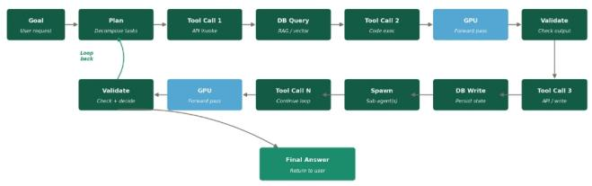

flowchart

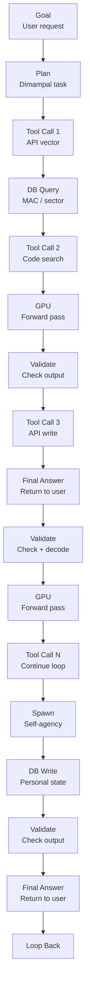

Source: Bernstein analysis   
Goal → Plan → Tool call 1 (API) → DB query → Tool call 2 (code exec)
    → GPU (forward pass) → validate → Tool call 3 → DB write
    → spawn sub-agent → ... → loop back ... → final answer

User prompt → CPU (head node, I/O) → GPU (one forward pass) → CPU → response

EXHIBIT 3: CPU Vendor Comments on Agentic AI driving CPU demand growth 

<table><tr><td>Company</td><td>Source</td><td>Quantified Comments</td></tr><tr><td>AMD</td><td>Q1 2026 call</td><td>&quot;Based on the demand signals we are seeing today and the structural increase in CPU compute requirements driven by Agentic AI, we now expect the server CPU TAM to grow at greater than 35% annually, reaching over $120 billion by 2030.&quot; vs. 18% annually guided at Nov 2025 Analyst Day</td></tr><tr><td>Intel</td><td>Q1 2026 call</td><td>Inference side, I think in terms of orchestration, control plane and also managing all the different agent with data, CPU is much more efficient. So I think the ratio of CPU to GPU used to be 1 and 8, and now it&#x27;s 1:4 and I think towards parity or even better... Our outlook for server CPU demand has improved over the last 90 days, and we expect a strong year of double-digit unit growth for the industry and for us with momentum extending into 2027.</td></tr><tr><td>Arm</td><td>Arm Everywhere, March 2026</td><td>&quot;A typical AI data center today requires around 30 million CPU cores per gigawatt of capacity. With agentic workloads, however, that figure rises to roughly 120 million cores per gigawatt&quot;</td></tr></table>

Source: Company reports, Bernstein analysis

EXHIBIT 4: 2.5x-4.5x Traditional server TAM expansion by 2030   
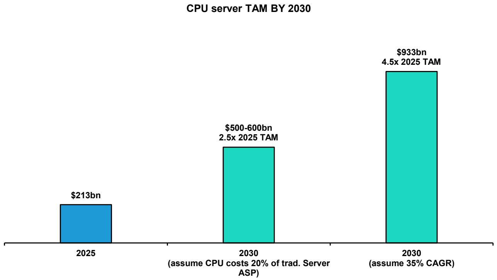

bar

CPU server TAM BY 2030
| Year | TAM ($bn) |
| :--- | :--- |
| 2025 | 213 |
| 2030 (assume CPU costs 20% of trad. Server ASP) | 2.5x 2025 TAM |
| 2030 (assume 35% CAGR) | 4.5x 2025 TAM |
The chart displays a single bar representing the total cost of CPU server by 2030, with annotations indicating the percentage increase from the previous measurement point. The values are estimated based on the dollar amount of each bar.

Source: Gartner, Bernstein analysis and estimates

# PART II: WHY DID SMCI BEAT FQ3'26? AND WHAT COULD SMCI'S ISSUES MEAN FOR DELL, HPE?

SMCI delivered an EPS beat in FQ3'26, driven by stronger gross margin from mix shift. As discussed in our note "SMCI FQ3'26: The Rollercoaster continues...", non-GAAP EPS of \$0.84 was 34% above consensus, with gross margin rebounding to 10.1% from 6.4% in the prior quarter (Exhibit 5). We attribute the gross margin expansion to two key factors:

- Higher implied mix of traditional servers relative to AI servers (Exhibit 6). AI server mix declined from $90\%$ to $80\%$ in the past quarter, marking the first decrease in the last 10 quarters, while the implied traditional server mix increased. During the earnings call, management also highlighted traditional server strength driven by the enterprise business. This mix shift was margin-accretive, as AI servers typically carry lower margins due to higher component (compute) costs, whereas traditional servers generally offer higher margins. We understand SMCI doesn't directly disclose the traditional server mix, but given the drop in AI server mix and the CEO remark on Agentic AI workload as a reason for traditional server strength, we believe it can be inferred that the traditional server mix increased.   
- Higher mix of enterprise clients relative to data centers (Exhibit 7). Data center mix declined from 84% to 72%, while enterprise mix increased from 16% to 28%. This also benefits gross margin, as large data center customers typically have greater bargaining power and therefore generate lower margins compared to enterprise customers.

However, while the mix shift provided support to the bottom line, it does not signal a positive development for the stock thesis. SMCI's AI bull case is driven by strong AI server demand and growth among large data center customers, both of which softened during the quarter. As such, this is not a beat that investors are likely to view positively.

EXHIBIT 5: SMCI Gross Margin   
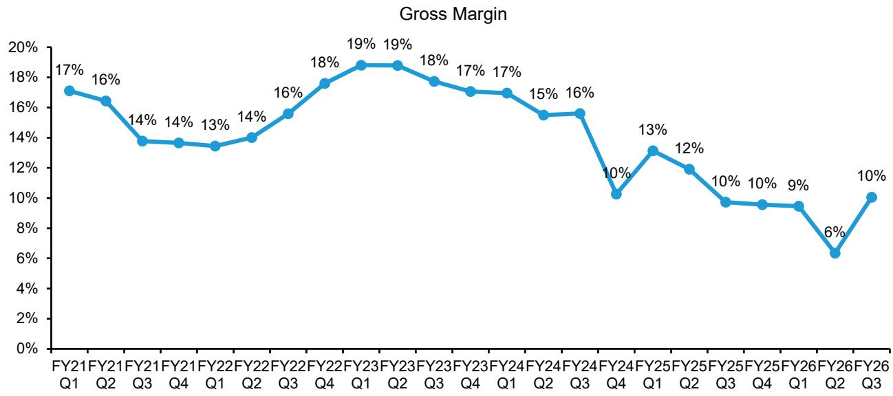

line

| Period | Gross Margin |
|--------|--------------|
| FY21 Q1 | 17% |
| FY21 Q2 | 16% |
| FY21 Q3 | 14% |
| FY21 Q4 | 14% |
| FY22 Q1 | 13% |
| FY22 Q2 | 14% |
| FY22 Q3 | 16% |
| FY22 Q4 | 18% |
| FY23 Q1 | 19% |
| FY23 Q2 | 19% |
| FY23 Q3 | 18% |
| FY23 Q4 | 17% |
| FY24 Q1 | 17% |
| FY24 Q2 | 15% |
| FY24 Q3 | 16% |
| FY24 Q4 | 10% |
| FY25 Q1 | 13% |
| FY25 Q2 | 12% |
| FY25 Q3 | 10% |
| FY25 Q4 | 10% |
| FY26 Q1 | 9% |
| FY26 Q2 | 6% |
| FY26 Q3 | 10% |

Source: Company reports, Bernstein estimates and analysis

EXHIBIT 6: SMCI Revenue Mix by Product   
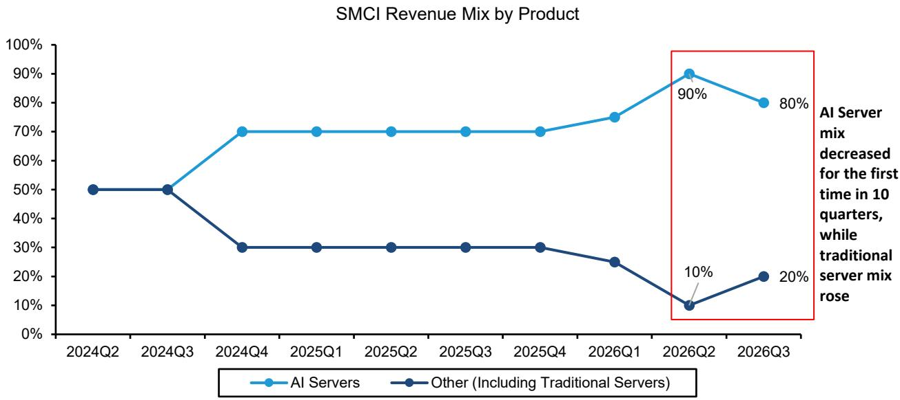

line

| Quarter   | AI Servers | Other (Including Traditional Servers) |
| --------- | ---------- | ------------------------------------- |
| 2024Q2    | -          | 50%                                   |
| 2024Q3    | -          | 50%                                   |
| 2024Q4    | 70%        | 30%                                   |
| 2025Q1    | 70%        | 30%                                   |
| 2025Q2    | 70%        | 30%                                   |
| 2025Q3    | 70%        | 30%                                   |
| 2025Q4    | 70%        | 30%                                   |
| 2026Q1    | 75%        | 25%                                   |
| 2026Q2    | 90%        | 10%                                   |
| 2026Q3    | 80%        | 20%                                   |

Source: Company reports, Bernstein analysis

EXHIBIT 7: SMCI Revenue Mix: In FQ3, data center revenue and mix decreased while Enterprise grew   
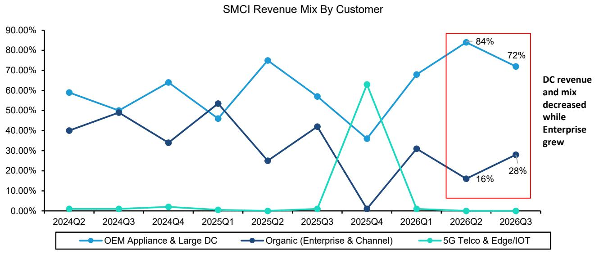

line

| Quarter   | OEM Appliance & Large DC | Organic (Enterprise & Channel) | 5G Telco & Edge/IOT |
| --------- | ------------------------ | ------------------------------ | ------------------- |
| 2024Q2    | 60.00%                   | 40.00%                         | 1.00%               |
| 2024Q3    | 50.00%                   | 50.00%                         | 1.00%               |
| 2024Q4    | 65.00%                   | 35.00%                         | 2.00%               |
| 2025Q1    | 45.00%                   | 55.00%                         | 1.00%               |
| 2025Q2    | 75.00%                   | 25.00%                         | 1.00%               |
| 2025Q3    | 55.00%                   | 42.00%                         | 1.00%               |
| 2025Q4    | 35.00%                   | 1.00%                          | 63.00%              |
| 2026Q1    | 68.00%                   | 31.00%                         | 1.00%               |
| 2026Q2    | 84.00%                   | 16.00%                         | 1.00%               |
| 2026Q3    | 72.00%                   | 28.00%                         | 1.00%               |

Source: Company reports, Bloomberg, Bernstein analysis

# PART III: THE READ ACROSS FROM SMCI HINTS UPSIDE FOR DELL & HPE INTO THE NEXT PRINT AND BEYOND

Based on the recent smuggling reports around SMCI and the company's reported FQ3 earnings, we see a positive set up for Dell and HPE, with Dell being the clearest beneficiary.

First, we expect strength from traditional servers, driven by a combination of pull-forward demand to manage memory cost dynamics and, more importantly, early signs that rising agentic inference workloads are supporting a more durable recovery in CPU server demand - as explain in part I. As leading traditional server vendors, Dell and HPE are well positioned to benefit from this trend in the upcoming quarter and beyond.

Second, we see risk related to order exodus from SMCI across cloud, enterprise, and sovereign accounts, as customers revisit vendor decisions and reassess vendor risk. One company's loss is another's gain: both Dell and HPE are positioned to benefit, but we see Dell as best positioned to capture the most share given its greater scale, stronger financing capabilities, and leading position in large-scale AI infrastructure deployments.

\- For cloud, SMCI was already seeing weaker demand heading into FQ3, and we see little reason to expect a clean rebound under the current governance overhang. A meaningful portion of the Q4 "push-out" that management framed as data center readiness issues could turn into cancellations as customers reassess vendor risk. For example, Bloomberg reported in February that xAI, historically an SMCI customer, was negotiating a +\$5 billion server deal with Dell (Dell Nears Deal With Musk's xAI for \$5B in Servers With Nvidia Chips - Bloomberg). If that shift was already underway before, the smuggling reports only increases the incentive to move more toward Dell. More broadly, Dell's financing capability remains a structural advantage that SMCI cannot easily replicate: its balance sheet allows it to support the large upfront commitments that cloud customers increasingly value in competitive bids. As we discuss in US IT Hardware: What we learned from our meetings with Michael Dell and AI Server OEMs: Rising Financing Receivables at Dell - Sign of the times or something to worry about?, Dell has been taking on more financing receivables, which we believe likely reflects increased support for large infrastructure deals (Exhibit 8, Exhibit 9). In this setup, delayed cloud revenue is more likely to leak out of the SMCI ecosystem than to snap back cleanly. Dell appears best positioned to capture these incremental cloud business, since HPE is hesitant or unable to finance the significant upfront working capital in cloud deals.

\- For commercial enterprise, both Dell and HPE start from a structurally advantaged position relative to SMCI, as enterprise customers value long-standing CIO relationships, proven deployment capabilities, and a long history of running mission-critical workloads with incumbent vendors. We believe Dell is likely to be the larger share gainer, because it executes at greater scale through a larger installed base, broader direct account coverage, stronger financing capacity, and a more standardized support and deployment model. Against that backdrop, it is difficult for SMCI, whose support and lifecycle

capabilities are less established in large enterprise accounts, to defend share as risk-aware customers re-open vendor reviews after the smuggling reports. The enterprise and broader infrastructure traction that helped offset weaker cloud demand in Q3 may therefore prove difficult to sustain, with Dell likely taking the greater share of displaced business and HPE also benefiting.

\- For U.S. government and sovereign-type buyers, governance and political optics matter even more. These customers place outsized weight on vendor compliance, security posture, and headline risk around long-lived infrastructure deployments. Dell, in particular, has been repeatedly highlighted as a trusted company by the current administration, while HPE brings a long track record in sovereign infrastructure projects as well. In that environment, once internal legal, risk, and procurement teams fully digest the SMCI risks, it becomes materially harder for SMCI to win or keep these accounts, while Dell and HPE would benefit.

EXHIBIT 8: DELL: Credit Quality of Fixed-term Customer Receivables, by quarter of origination (\$M)   
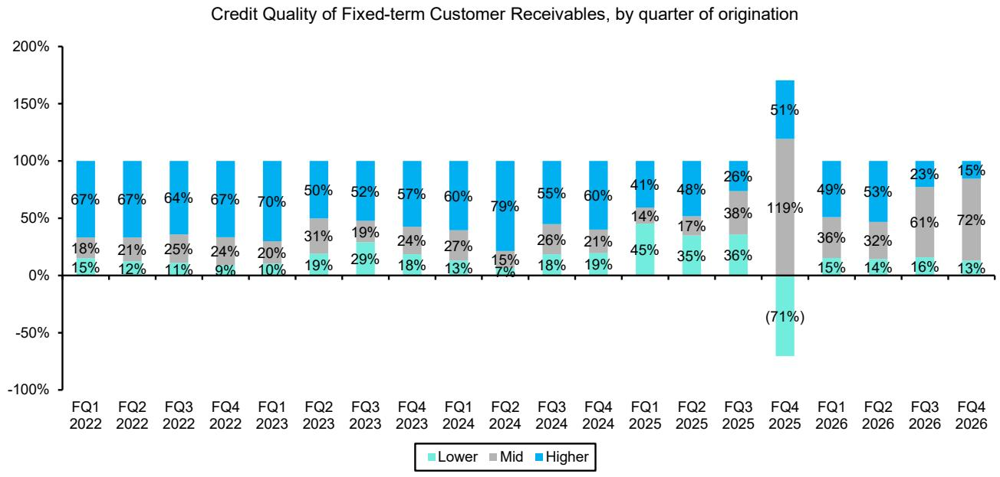

bar_stacked

Credit Quality of Fixed-term Customer Receivables, by quarter of origination
| Quarter | Lower (%) | Mid (%) | Higher (%) |
| :--- | :--- | :--- | :--- |
| FQ1 2022 | 15 | 18 | 67 |
| FQ2 2022 | 12 | 21 | 67 |
| FQ3 2022 | 11 | 25 | 64 |
| FQ4 2022 | 9 | 24 | 67 |
| FQ1 2023 | 10 | 20 | 70 |
| FQ2 2023 | 19 | 31 | 50 |
| FQ3 2023 | 29 | 19 | 52 |
| FQ4 2023 | 18 | 24 | 57 |
| FQ1 2024 | 13 | 27 | 60 |
| FQ2 2024 | 7 | 15 | 79 |
| FQ3 2024 | 18 | 26 | 55 |
| FQ4 2024 | 19 | 21 | 60 |
| FQ1 2025 | 45 | 14 | 41 |
| FQ2 2025 | 35 | 17 | 48 |
| FQ3 2025 | 36 | 38 | 26 |
| FQ4 2025 | (71) | 119 | 51 |
| FQ1 2026 | 15 | 36 | 49 |
| FQ2 2026 | 14 | 32 | 53 |
| FQ3 2026 | 16 | 61 | 23 |
| FQ4 2026 | 13 | 72 | 15 |

Used disclosed credit quality from the FQ1 10-Q of each year, so does not account for subsequent improvement or deterioration in credit quality  
Source: Company filings, Bernstein analysis

EXHIBIT 9: DELL: Total Oustanding Customer Financing Receivables, as of Each Quarter(\$M)   
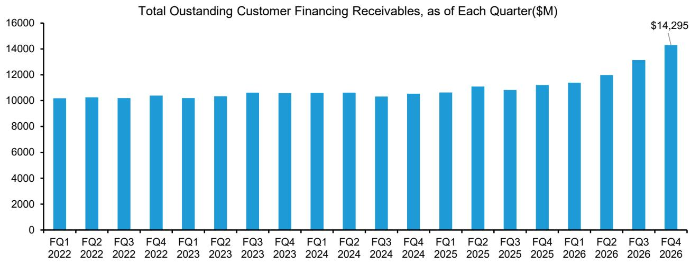

bar

Total Oustanding Customer Financing Receivables, as of Each Quarter($M)
| Quarter | Total Oustanding Customer Financing Receivables ($M) |
| :--- | :--- |
| FQ1 2022 | 10189 |
| FQ2 2022 | 10253 |
| FQ3 2022 | 10177 |
| FQ4 2022 | 10387 |
| FQ1 2023 | 10155 |
| FQ2 2023 | 10285 |
| FQ3 2023 | 10608 |
| FQ4 2023 | 10587 |
| FQ1 2024 | 10615 |
| FQ2 2024 | 10634 |
| FQ3 2024 | 10335 |
| FQ4 2024 | 10518 |
| FQ1 2025 | 10634 |
| FQ2 2025 | 11097 |
| FQ3 2025 | 10837 |
| FQ4 2025 | 11197 |
| FQ1 2026 | 11397 |
| FQ2 2026 | 11997 |
| FQ3 2026 | 13147 |
| FQ4 2026 | 14295 |

Source: Company reports, Bernstein analysis

# PART IV: VALUATION AND MODEL CHANGES

# DELL: AI INFRA WINNER - RAISE ESTIMATES AND INCREASE TP TO \$280, REITERATE OUTPERFORM

We view Dell as the real winner in AI infrastructure - and the biggest beneficiary from SMCI's recent compliance issues. Dell is already a scale leader in AI infrastructure, and it now has the broadest ability to capture displaced SMCI demand across cloud, enterprise, and sovereign accounts through its financing capacity, direct account reach, installed base, and proven deployment model. HPE should benefit too, but Dell is better positioned to take the most share because it can compete more aggressively and execute at greater scale. In our view, that combination makes Dell the highest-quality way to play AI infrastructure, justifying a premium multiple.

Citing incremental strength from Traditional server due to Agentic AI and additional revenue in AI server from share taking, we raise our FY 2028 EPS by 3% to \$16.47. Moreover, we raise our multiple from 14x to 17x FY28 EPS and arrives at our target price of \$280.

EXHIBIT 10: Dell Model Before vs After 

<table><tr><td rowspan="2">($USD Millions)</td><td colspan="3">FY 2027E</td><td colspan="3">FY 2028E</td><td colspan="3">FY 2029E</td></tr><tr><td>New</td><td>Old</td><td>Delta</td><td>New</td><td>Old</td><td>Delta</td><td>New</td><td>Old</td><td>Delta</td></tr><tr><td>Total Revenue</td><td>$145,481</td><td>$142,640</td><td>2.0%</td><td>$163,309</td><td>$160,194</td><td>1.9%</td><td>$180,617</td><td>$177,137</td><td>2.0%</td></tr><tr><td>ISG Revenue</td><td>$93,305</td><td>$90,464</td><td>3.1%</td><td>$109,925</td><td>$106,810</td><td>2.9%</td><td>$125,184</td><td>$121,704</td><td>2.9%</td></tr><tr><td>CSG Revenue</td><td>$51,576</td><td>$51,576</td><td>0.0%</td><td>$52,984</td><td>$52,984</td><td>0.0%</td><td>$55,033</td><td>$55,033</td><td>0.0%</td></tr><tr><td>Total Op. Profit</td><td>$11,955</td><td>$11,696</td><td>2.2%</td><td>$13,533</td><td>$13,230</td><td>2.3%</td><td>$14,777</td><td>$14,454</td><td>2.2%</td></tr><tr><td>OP Margin %</td><td>8.2%</td><td>8.2%</td><td>2bps</td><td>8.3%</td><td>8.3%</td><td>3bps</td><td>8.2%</td><td>8.2%</td><td>2bps</td></tr><tr><td>ISG Op. Profit</td><td>$9,162</td><td>$8,904</td><td>2.9%</td><td>$10,392</td><td>$10,089</td><td>3.0%</td><td>$11,365</td><td>$11,042</td><td>2.9%</td></tr><tr><td>OP Margin %</td><td>9.8%</td><td>9.8%</td><td>-2bps</td><td>9.5%</td><td>9.4%</td><td>1bps</td><td>9.1%</td><td>9.1%</td><td>1bps</td></tr><tr><td>CSG Op. Profit</td><td>$2,786</td><td>$2,786</td><td>0.0%</td><td>$3,141</td><td>$3,141</td><td>0.0%</td><td>$3,412</td><td>$3,412</td><td>0.0%</td></tr><tr><td>OP Margin %</td><td>5.4%</td><td>5.4%</td><td>0bps</td><td>5.9%</td><td>5.9%</td><td>0bps</td><td>6.2%</td><td>6.2%</td><td>0bps</td></tr><tr><td>Net Income</td><td>$8,620</td><td>$8,408</td><td>2.5%</td><td>$9,914</td><td>$9,666</td><td>2.6%</td><td>$10,934</td><td>$10,669</td><td>2.5%</td></tr><tr><td>EPS ($ per share)</td><td>$13.46</td><td>$13.14</td><td>2.4%</td><td>$16.47</td><td>$15.99</td><td>3.0%</td><td>$18.92</td><td>$18.40</td><td>2.9%</td></tr></table>

Source: Company reports, Bernstein estimates and analysis

EXHIBIT 11: DELL Bloomberg Consensus 

<table><tr><td>DELL</td><td>FY2027E</td><td>FY2028E</td><td>FY2029E</td></tr><tr><td>Revenues ($M)</td><td></td><td></td><td></td></tr><tr><td>Consensus</td><td>$141,800</td><td>$155,747</td><td>$164,955</td></tr><tr><td>Actual / Bernstein Est.</td><td>$145,481</td><td>$163,309</td><td>$180,617</td></tr><tr><td>Bernstein vs. Cons.</td><td>2.6%</td><td>4.9%</td><td>9.5%</td></tr><tr><td>Operating Margin (%)</td><td>8.4%</td><td>8.5%</td><td>8.8%</td></tr><tr><td>vs. Bernstein</td><td>8.2%</td><td>8.3%</td><td>8.2%</td></tr><tr><td>EPS ($)</td><td></td><td></td><td></td></tr><tr><td>Consensus</td><td>$13.05</td><td>$14.96</td><td>$16.82</td></tr><tr><td>Actual / Bernstein Est.</td><td>$13.46</td><td>$16.47</td><td>$18.92</td></tr><tr><td>Bernstein vs. Cons.</td><td>3.2%</td><td>10.1%</td><td>12.5%</td></tr><tr><td>FCF ($)</td><td></td><td></td><td></td></tr><tr><td>Consensus</td><td>$9,529</td><td>$10,230</td><td>$11,057</td></tr><tr><td>Actual / Bernstein Est.</td><td>$10,595</td><td>$9,591</td><td>$11,678</td></tr></table>

Source: Bloomberg, Bernstein estimates and analysis

EXHIBIT 12: Dell P/FE   
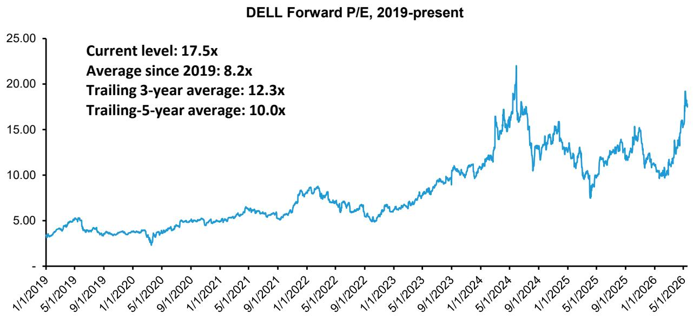

line

| Date       | P/E    |
| ---------- | ------ |
| Current    | 17.5x  |
| Average    | 8.2x   |
| Trailing 3-year | 12.3x |
| Trailing-5-year | 10.0x |

Source: Bloomberg, Bernstein Analysis and estimates

# HPE: ALSO STANDS TO BENEFIT, RAISE ESTIMATES AND TP TO \$35, MARKET-PERFORM

HPE has re-rated meaningfully, and we believe the premium is justified if server demand strengthens and the company gains incremental share as customers gravitate toward vendors with established relationships and stronger governance, particularly for enterprise and sovereign accounts. However, with HPE's effective exit from AI servers for all cloud (including neoclouds) is becoming apparent as last reported revenues and orders all on the very low-end of recent trends, we do not expect it to capture as much upside as Dell. Most of our EPS change is driven by lower share count projection rather than revenue. We raise valuation multiple from 8x to 12.5x FY27 EPS and increase our target price to \$35.

EXHIBIT 13: HPE Model Before vs After 

<table><tr><td rowspan="2">($USD Millions)</td><td colspan="3">FY 2026E</td><td colspan="3">FY 2027E</td><td colspan="3">FY 2028E</td></tr><tr><td>New</td><td>Old</td><td>Delta</td><td>New</td><td>Old</td><td>Delta</td><td>New</td><td>Old</td><td>Delta</td></tr><tr><td>Revenue</td><td>$40,540</td><td>$39,968</td><td>1.4%</td><td>$43,007</td><td>$42,346</td><td>1.6%</td><td>$45,658</td><td>$44,963</td><td>1.5%</td></tr><tr><td>Gross Profit</td><td>$14,337</td><td>$14,137</td><td>1.4%</td><td>$15,052</td><td>$14,821</td><td>1.6%</td><td>$15,980</td><td>$15,737</td><td>1.5%</td></tr><tr><td>Gross Margin %</td><td>35.4%</td><td>35.4%</td><td>-1bps</td><td>35.0%</td><td>35.0%</td><td>0bps</td><td>35.0%</td><td>35.0%</td><td>0bps</td></tr><tr><td>Op. Profit</td><td>$4,626</td><td>$4,580</td><td>1.0%</td><td>$5,195</td><td>$5,137</td><td>1.1%</td><td>$5,601</td><td>$5,538</td><td>1.1%</td></tr><tr><td>OP Margin %</td><td>11.4%</td><td>11.5%</td><td>-5bps</td><td>12.1%</td><td>12.1%</td><td>-5bps</td><td>12.3%</td><td>12.3%</td><td>-5bps</td></tr><tr><td>Net Income</td><td>$3,483</td><td>$3,423</td><td>1.8%</td><td>$4,076</td><td>$4,026</td><td>1.2%</td><td>$4,633</td><td>$4,580</td><td>1.2%</td></tr><tr><td>EPS ($ per share)</td><td>$2.43</td><td>$2.39</td><td>1.8%</td><td>$2.85</td><td>$2.66</td><td>6.8%</td><td>$3.24</td><td>$3.03</td><td>6.7%</td></tr><tr><td>Adj FCF</td><td>$1,936</td><td>$2,083</td><td>-7.0%</td><td>$2,407</td><td>$2,359</td><td>2.0%</td><td>$3,400</td><td>$3,367</td><td>1.0%</td></tr></table>

Source: Company reports, Bernstein estimates and analysis

EXHIBIT 14: HPE Bernstein vs. Consensus 

<table><tr><td>HPE</td><td>FY26E</td><td>FY27E</td><td>FY28E</td></tr><tr><td>Total Revenues ($M)</td><td></td><td></td><td></td></tr><tr><td>Consensus</td><td>$40,888</td><td>$43,082</td><td>$45,302</td></tr><tr><td>Bernstein Est.</td><td>$40,540</td><td>$43,007</td><td>$45,658</td></tr><tr><td>Bernstein vs. Cons.</td><td>-0.9%</td><td>-0.2%</td><td>0.8%</td></tr><tr><td>Operating Margin (%)</td><td>11.2%</td><td>11.8%</td><td>12.6%</td></tr><tr><td>vs. Bernstein</td><td>11.4%</td><td>12.1%</td><td>12.3%</td></tr><tr><td>EPS ($)</td><td></td><td></td><td></td></tr><tr><td>Consensus</td><td>$2.42</td><td>$2.72</td><td>$3.06</td></tr><tr><td>Bernstein Est.</td><td>$2.43</td><td>$2.85</td><td>$3.24</td></tr><tr><td>vs. Bernstein</td><td>0.5%</td><td>4.5%</td><td>5.7%</td></tr><tr><td>FCF ($)</td><td></td><td></td><td></td></tr><tr><td>Consensus</td><td>$2,211</td><td>$2,537</td><td>$3,378</td></tr><tr><td>Bernstein Est.</td><td>$1,936</td><td>$2,407</td><td>$3,400</td></tr><tr><td>Bernstein vs. Cons.</td><td>-12.4%</td><td>-5.1%</td><td>0.7%</td></tr></table>

Source: Bloomberg, Bernstein estimates and analysis

EXHIBIT 15: HPE P/FE   
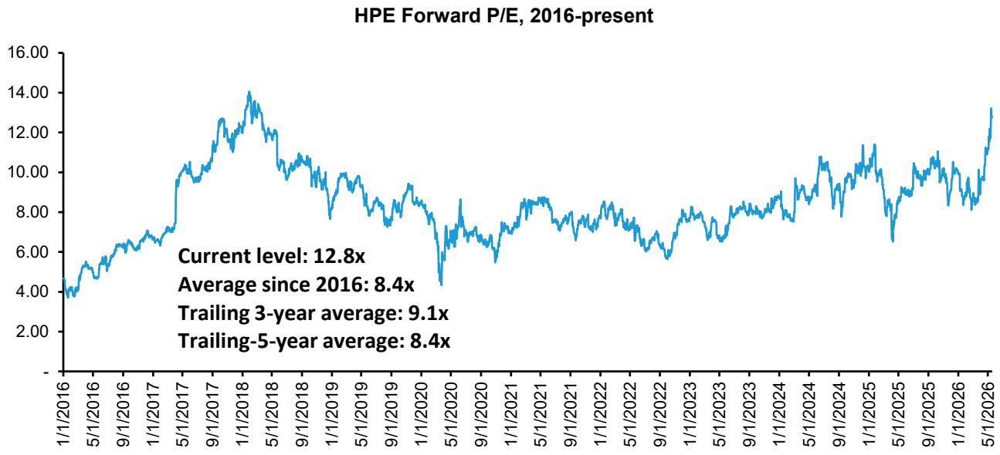

line

| Metric | Value |
| --- | --- |
| Current level | 12.8x |
| Average since 2016 | 8.4x |
| Trailing 3-year average | 9.1x |
| Trailing 5-year average | 8.4x |

Source: Bloomberg, Bernstein analysis and estimates

# SMCI: STRONG POSITION IN AI SERVERS IN JEOPARDY (IN A BOOMING MARKET); MARKET-PERFORM

While SMCI looks cheap compared to the other two, we do not think the post-earnings rally should be chased.

All eyes are on FQ4'26. FQ3 was largely insulated: the indictment was unsealed on March 19, just days before the March 31 quarter-end, leaving little time for vendor reviews or procurement changes to affect reported results. That makes FQ4 the more important test, as any shipment slippage or scandal-related demand impact should become much clearer in the numbers and guidance.

The step-up in enterprise is likely not sustainable as we head into Q4. The 45% QoQ enterprise channel growth (\$2.8B, 28% of revenue) was likely almost entirely in-flight before March 19th, and the higher-margin enterprise growth is a big part of what drove the margin/EPS upside. This means Q3 EPS upside is driven by pre-scandal enterprise momentum, not a validation of the AI thesis or post-scandal durability. As compliance reviews and procurement reassessments fully catch up, that same enterprise strength may be unsustainable and start to unwind in Q4, putting both revenue and margins at risk.

Management's explanation for the Q3 Data Center revenue miss also raises incremental concern, in our view. Q3 revenue came in at \$10.2B vs \$12.4B expected. Management attributed the shortfall to "datacenter readiness" delays and later clarified that these were not tied to just one large customer but to several unrelated customers experiencing infrastructure issues in Q3. Multiple independent customers simultaneously encountering delays is quite unusual and further raises the concern that some of these delays might be soft cancellations or compliance-driven deferrals.

Against this backdrop of governance overhang and unusual delay patterns, SMCI heading into Q4 faces an unfavorable setup. In our view, SMCI is more likely than not to miss Q4 guidance, which would actually be consistent with its historical pattern of guidance volatility and misses, since the company has missed revenue 7 times and EPS 6 times in the past 8 quarters.

Longer term, GPU supply from NVIDIA is another potential pressure point. As of FQ3, around 80% of SMCI revenue is tied to NVIDIA GPU-based platforms, and that exposure is managed almost entirely via purchase orders with no long-term allocation guarantees or contractual supply protection. NVIDIA, for its part, could have rational incentives over time to lean allocations toward Tier 1 OEMs that offer cleaner compliance optics, more diversified end-markets, and stronger government relationships, even if no explicit shift is signaled today. Even a modest 10-15% allocation reduction would likely cascade disproportionately through SMCI's P&L via factory underutilization, weaker fixed-cost absorption, margin compression, and a higher risk of delayed or unfilled customer orders. And if SMCI's customers are already starting to re-source toward Dell/HPE, NVIDIA's allocation could simply follow end-customer demand, potentially creating a self-reinforcing negative cycle where customer defections and incremental supply tightening compound each other over subsequent quarters.

EXHIBIT 16: SMCI P/FE   
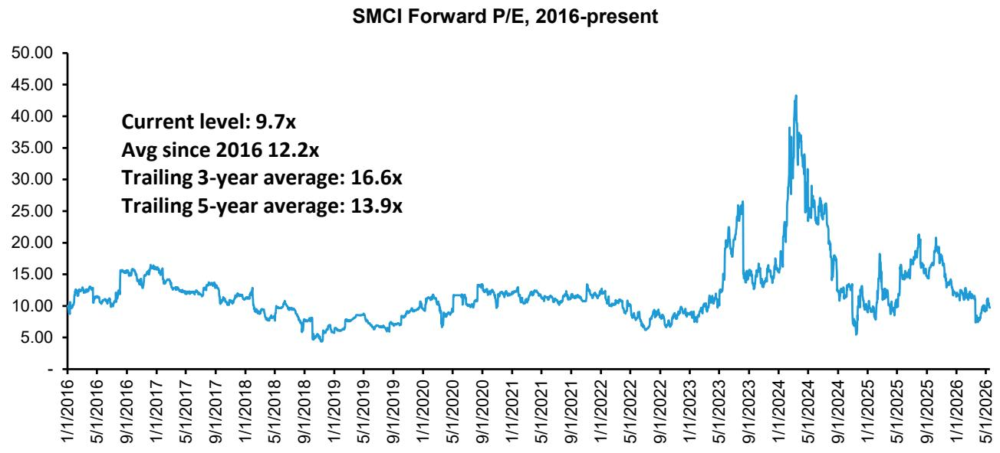

line

| Metric | Value |
| --- | --- |
| Current level | 9.7x |
| Avg since 2016 | 12.2x |
| Trailing 3-year average | 16.6x |
| Trailing 5-year average | 13.9x |

Source: Bloomberg, Bernstein analysis

# APPENDIX - FINANCIAL FORECASTS

EXHIBIT 17: DELL Income Statement 

<table><tr><td></td><td>FY2025</td><td>FY2026</td><td>FY2027E</td><td>FY2028E</td><td>FY2029E</td><td>FY27 Q1E</td><td>FY27 Q2E</td><td>FY27 Q3E</td><td>FY27 Q4E</td></tr><tr><td colspan="10">Non-GAAP Income Statement</td></tr><tr><td>Revenue</td><td>95,567</td><td>113,538</td><td>145,481</td><td>163,309</td><td>180,617</td><td>35,763</td><td>35,242</td><td>35,016</td><td>39,460</td></tr><tr><td>COGS</td><td>73,757</td><td>90,379</td><td>119,968</td><td>134,649</td><td>149,009</td><td>29,648</td><td>29,145</td><td>28,818</td><td>32,358</td></tr><tr><td>Gross Profit</td><td>21,810</td><td>23,159</td><td>25,513</td><td>28,660</td><td>31,608</td><td>6,116</td><td>6,097</td><td>6,198</td><td>7,103</td></tr><tr><td>SG&amp;A</td><td>10,653</td><td>10,370</td><td>10,647</td><td>11,704</td><td>12,944</td><td>2,646</td><td>2,608</td><td>2,591</td><td>2,802</td></tr><tr><td>R&amp;D</td><td>2,628</td><td>2,798</td><td>2,911</td><td>3,423</td><td>3,887</td><td>683</td><td>728</td><td>677</td><td>823</td></tr><tr><td>Opex</td><td>13,281</td><td>13,168</td><td>13,558</td><td>15,127</td><td>16,831</td><td>3,330</td><td>3,336</td><td>3,268</td><td>3,625</td></tr><tr><td>Operating Income</td><td>8,529</td><td>9,991</td><td>11,955</td><td>13,533</td><td>14,777</td><td>2,786</td><td>2,761</td><td>2,930</td><td>3,478</td></tr><tr><td>Interest and Other, Net</td><td>(1,376)</td><td>(1,398)</td><td>(1,440)</td><td>(1,440)</td><td>(1,440)</td><td>(360)</td><td>(360)</td><td>(360)</td><td>(360)</td></tr><tr><td>Pre-tax Income</td><td>7,153</td><td>8,593</td><td>10,515</td><td>12,093</td><td>13,337</td><td>2,426</td><td>2,401</td><td>2,570</td><td>3,118</td></tr><tr><td>Income Tax</td><td>1,287</td><td>1,547</td><td>1,895</td><td>2,179</td><td>2,403</td><td>437</td><td>433</td><td>463</td><td>562</td></tr><tr><td>Effective Tax Rate %</td><td>18.0%</td><td>18.0%</td><td>18.0%</td><td>18.0%</td><td>18.0%</td><td>18.0%</td><td>18.0%</td><td>18.0%</td><td>18.0%</td></tr><tr><td>Net Income (Loss)</td><td>5,866</td><td>7,046</td><td>8,620</td><td>9,914</td><td>10,934</td><td>1,989</td><td>1,968</td><td>2,107</td><td>2,556</td></tr><tr><td>Less: NCI</td><td>2</td><td>-</td><td>-</td><td>-</td><td>-</td><td>-</td><td>-</td><td>-</td><td>-</td></tr><tr><td>Net Income Attributable to Dell Technoloq</td><td>5,864</td><td>7,046</td><td>8,620</td><td>9,914</td><td>10,934</td><td>1,989</td><td>1,968</td><td>2,107</td><td>2,556</td></tr><tr><td>Earnings per Share</td><td></td><td></td><td></td><td></td><td></td><td>-</td><td>-</td><td>-</td><td>-</td></tr><tr><td>Basic</td><td>$ 8.33</td><td>$ 10.50</td><td>$ 13.68</td><td>$ 16.75</td><td>$ 19.26</td><td>$ 3.03</td><td>$ 3.09</td><td>$ 3.42</td><td>$ 4.14</td></tr><tr><td>Diluted</td><td>$ 8.10</td><td>$ 10.35</td><td>$ 13.46</td><td>$ 16.47</td><td>$ 18.92</td><td>$ 2.99</td><td>$ 3.04</td><td>$ 3.36</td><td>$ 4.07</td></tr><tr><td colspan="10">Share Count</td></tr><tr><td>Basic</td><td>704</td><td>671</td><td>628</td><td>602</td><td>568</td><td>655</td><td>637</td><td>616</td><td>617</td></tr><tr><td>Diluted</td><td>724</td><td>681</td><td>639</td><td>612</td><td>578</td><td>666</td><td>647</td><td>626</td><td>628</td></tr></table>

Source: Company reports, Bernstein estimates and analysis

EXHIBIT 18: DELL Cash Flow Statement 

<table><tr><td>Cash flows from operating activities</td><td>FY2025</td><td>FY2026</td><td>FY2027E</td><td>FY2028E</td><td>FY2029E</td><td>0 FY27 Q1E</td><td>FY27 Q2E</td><td>FY27 Q3E</td><td>FY27 Q4E</td></tr><tr><td>Net income</td><td>4,576</td><td>5,936</td><td>7,628</td><td>8,381</td><td>9,531</td><td>2,253</td><td>1,576</td><td>1,676</td><td>2,123</td></tr><tr><td>Adjustments to reconcile net income to cash</td><td>-</td><td>-</td><td>-</td><td>-</td><td>-</td><td>-</td><td>-</td><td>-</td><td>-</td></tr><tr><td>Depreciation and Amortization</td><td>3,123</td><td>3,029</td><td>3,320</td><td>3,547</td><td>3,789</td><td>807</td><td>824</td><td>838</td><td>852</td></tr><tr><td>Stock-based compensation</td><td>785</td><td>723</td><td>829</td><td>925</td><td>1,029</td><td>204</td><td>204</td><td>200</td><td>222</td></tr><tr><td>Deferred income tax</td><td>(208)</td><td>(60)</td><td>(1,854)</td><td>(886)</td><td>(860)</td><td>(882)</td><td>(272)</td><td>(398)</td><td>(302)</td></tr><tr><td>Other, Net</td><td>453</td><td>714</td><td>(7,125)</td><td>(3,794)</td><td>(2,671)</td><td>(5,120)</td><td>283</td><td>123</td><td>(2,411)</td></tr><tr><td>Change in Working Capital</td><td>(4,208)</td><td>843</td><td>11,314</td><td>5,211</td><td>5,092</td><td>4,930</td><td>1,734</td><td>2,621</td><td>2,030</td></tr><tr><td>Net cash provided by operating activities</td><td>4,521</td><td>11,185</td><td>14,112</td><td>13,384</td><td>15,911</td><td>2,192</td><td>4,348</td><td>5,059</td><td>2,513</td></tr><tr><td colspan="10">Cash flows from investing activities</td></tr><tr><td>Capital Expenditure and Capitalized Softwar</td><td>(2,652)</td><td>(2,633)</td><td>(3,517)</td><td>(3,793)</td><td>(4,232)</td><td>(879)</td><td>(879)</td><td>(879)</td><td>(879)</td></tr><tr><td>Other</td><td>180</td><td>80</td><td>-</td><td>-</td><td>-</td><td>-</td><td>-</td><td>-</td><td>-</td></tr><tr><td>Acquisitions of Businesses and Assets, Net</td><td>-</td><td>(84)</td><td>-</td><td>-</td><td>-</td><td>-</td><td>-</td><td>-</td><td>-</td></tr><tr><td>Divestiture of Businesses and Assets, Net</td><td>-</td><td>533</td><td>-</td><td>-</td><td>-</td><td>-</td><td>-</td><td>-</td><td>-</td></tr><tr><td>Purchases (net of maturities and sales) of in</td><td>257</td><td>49</td><td>(21)</td><td>(21)</td><td>(21)</td><td>(5)</td><td>(5)</td><td>(5)</td><td>(5)</td></tr><tr><td>Net cash provided by/(used in) investing</td><td>(2,215)</td><td>(2,055)</td><td>(3,538)</td><td>(3,814)</td><td>(4,253)</td><td>(884)</td><td>(884)</td><td>(884)</td><td>(884)</td></tr><tr><td colspan="10">Cash flows from financing activities</td></tr><tr><td>Proceeds from new debt</td><td>9,258</td><td>15,004</td><td>13,067</td><td>11,610</td><td>31,136</td><td>3,267</td><td>3,267</td><td>3,267</td><td>3,267</td></tr><tr><td>Payments to settle debt</td><td>(10,570)</td><td>(8,522)</td><td>(13,588)</td><td>(12,172)</td><td>(13,341)</td><td>(3,397)</td><td>(3,397)</td><td>(3,397)</td><td>(3,397)</td></tr><tr><td>Repurchase (net of issuance) of Parent Con</td><td>(3,164)</td><td>(6,399)</td><td>(6,608)</td><td>(5,726)</td><td>(8,025)</td><td>124</td><td>(3,030)</td><td>(3,642)</td><td>(60)</td></tr><tr><td>Financing - other</td><td>(64)</td><td>(88)</td><td>562</td><td>743</td><td>778</td><td>446</td><td>12</td><td>22</td><td>82</td></tr><tr><td>Cash dividends paid</td><td>(1,275)</td><td>(1,459)</td><td>(1,555)</td><td>(1,624)</td><td>(1,830)</td><td>(400)</td><td>(397)</td><td>(386)</td><td>(373)</td></tr><tr><td>Net cash provided by/(used in) financing</td><td>(5,815)</td><td>(1,464)</td><td>(8,123)</td><td>(7,169)</td><td>8,718</td><td>40</td><td>(3,545)</td><td>(4,136)</td><td>(481)</td></tr><tr><td colspan="10">Cash reconciliation</td></tr><tr><td>Effect of exchange rate changes on cash, ca</td><td>(179)</td><td>221</td><td>-</td><td>-</td><td>-</td><td>-</td><td>-</td><td>-</td><td>-</td></tr><tr><td>Net change in cash, cash equivalents and</td><td>(3,688)</td><td>7,887</td><td>2,452</td><td>2,401</td><td>20,376</td><td>1,347</td><td>(81)</td><td>38</td><td>1,147</td></tr><tr><td>Net change in cash minus sum of cash flo</td><td>-</td><td>-</td><td>0</td><td>-</td><td>-</td><td>-</td><td>-</td><td>-</td><td>-</td></tr><tr><td>Check</td><td>OK</td><td>OK</td><td>OK</td><td>OK</td><td>OK</td><td>OK</td><td>OK</td><td>OK</td><td>OK</td></tr><tr><td>Restricted cash balance</td><td>186</td><td>178</td><td>178</td><td>178</td><td>178</td><td>178</td><td>178</td><td>178</td><td>178</td></tr><tr><td>Net Change in Restricted Cash</td><td>45</td><td>(8)</td><td>-</td><td>-</td><td>-</td><td>-</td><td>-</td><td>-</td><td>-</td></tr><tr><td>Cash, cash equivalents and restricted cash</td><td>-</td><td>-</td><td>11,706</td><td>14,158</td><td>16,559</td><td>0</td><td>0</td><td>0</td><td>0</td></tr><tr><td>Cash, cash equivalents and restricted cash</td><td>3,819</td><td>11,706</td><td>14,158</td><td>16,559</td><td>36,935</td><td>13,053</td><td>12,972</td><td>13,011</td><td>14,158</td></tr><tr><td>Cash, cash equivalents and restricted cash</td><td>7,507</td><td>3,819</td><td>11,706</td><td>14,158</td><td>16,559</td><td>11,706</td><td>13,053</td><td>12,972</td><td>13,011</td></tr><tr><td colspan="10">Free Cash Flow</td></tr><tr><td colspan="10">As reported:</td></tr><tr><td>Free cash flow</td><td>1,869</td><td>8,552</td><td>10,595</td><td>9,591</td><td>11,678</td><td>1,312</td><td>3,469</td><td>4,180</td><td>1,634</td></tr><tr><td>FCF growth</td><td>-68.4%</td><td>357.6%</td><td>23.9%</td><td>-9.5%</td><td>21.8%</td><td>-41.1%</td><td>85.7%</td><td>731.0%</td><td>-58.7%</td></tr><tr><td>FCF margin</td><td>2.0%</td><td>7.5%</td><td>7.3%</td><td>5.9%</td><td>6.5%</td><td>3.7%</td><td>9.8%</td><td>11.9%</td><td>4.1%</td></tr><tr><td>FCF per share</td><td>2.58</td><td>12.56</td><td>16.59</td><td>15.66</td><td>20.21</td><td>1.97</td><td>5.36</td><td>6.67</td><td>2.60</td></tr><tr><td>FCF conversion</td><td>32%</td><td>121%</td><td>123%</td><td>97%</td><td>107%</td><td>66%</td><td>176%</td><td>198%</td><td>64%</td></tr><tr><td>Quarterly as % of full year</td><td>-</td><td>-</td><td>-</td><td>-</td><td>-</td><td>12%</td><td>33%</td><td>39%</td><td>15%</td></tr><tr><td>Financing</td><td>(1,079)</td><td>(1,078)</td><td>(2,002)</td><td>(1,854)</td><td>(1,305)</td><td>1,022</td><td>(138)</td><td>(60)</td><td>1,178</td></tr><tr><td>Free cash flow ex. Financing</td><td>2,948</td><td>11,505</td><td>8,593</td><td>7,737</td><td>10,373</td><td>290</td><td>3,607</td><td>4,240</td><td>456</td></tr></table>

Source: Company reports, Bernstein estimates and analysis

EXHIBIT 19: DELL Balance Sheet 

<table><tr><td>Assets</td><td>FY2025</td><td>FY2026</td><td>FY2027E</td><td>FY2028E</td><td>FY2029E</td><td>0 FY27 Q1E</td><td>FY27 Q2E</td><td>FY27 Q3E</td><td>FY27 Q4E</td></tr><tr><td>Cash and Cash Equivalents</td><td>3,633</td><td>11,528</td><td>13,980</td><td>16,381</td><td>36,757</td><td>12,875</td><td>12,794</td><td>12,833</td><td>13,980</td></tr><tr><td>Accounts Receivable, Net</td><td>10,298</td><td>17,585</td><td>17,936</td><td>20,134</td><td>22,268</td><td>15,525</td><td>16,199</td><td>17,186</td><td>17,936</td></tr><tr><td>Short-Term Financing Receivables, Net</td><td>5,304</td><td>8,458</td><td>10,460</td><td>12,314</td><td>13,619</td><td>9,480</td><td>9,342</td><td>9,282</td><td>10,460</td></tr><tr><td>Inventories</td><td>6,716</td><td>10,437</td><td>11,175</td><td>12,543</td><td>13,880</td><td>9,474</td><td>9,934</td><td>10,633</td><td>11,175</td></tr><tr><td>Other current assets</td><td>9,610</td><td>9,594</td><td>11,734</td><td>13,171</td><td>14,567</td><td>10,156</td><td>10,597</td><td>11,243</td><td>11,734</td></tr><tr><td>Current Assets Held For Sale</td><td>668</td><td>-</td><td>-</td><td>-</td><td>-</td><td>-</td><td>-</td><td>-</td><td>-</td></tr><tr><td>Total Current Assets</td><td>36,229</td><td>57,602</td><td>65,285</td><td>74,543</td><td>101,091</td><td>57,510</td><td>58,866</td><td>61,177</td><td>65,285</td></tr><tr><td>Sum - Total</td><td>-</td><td>-</td><td>-</td><td>-</td><td>-</td><td>-</td><td>-</td><td>-</td><td>-</td></tr><tr><td>Check</td><td>OK</td><td>OK</td><td>OK</td><td>OK</td><td>OK</td><td>OK</td><td>OK</td><td>OK</td><td>OK</td></tr><tr><td>Property, plant and equipment, net</td><td>6,336</td><td>6,676</td><td>7,413</td><td>8,136</td><td>8,998</td><td>6,890</td><td>7,083</td><td>7,257</td><td>7,413</td></tr><tr><td>Long-Term Financing Receivables, Net</td><td>5,927</td><td>5,822</td><td>10,945</td><td>12,885</td><td>14,251</td><td>9,920</td><td>9,775</td><td>9,712</td><td>10,945</td></tr><tr><td>Goodwill</td><td>19,120</td><td>19,547</td><td>19,547</td><td>19,547</td><td>19,547</td><td>19,547</td><td>19,547</td><td>19,547</td><td>19,547</td></tr><tr><td>Intangible Assets, Net</td><td>4,988</td><td>4,533</td><td>3,992</td><td>3,516</td><td>3,097</td><td>4,391</td><td>4,254</td><td>4,121</td><td>3,992</td></tr><tr><td>Deferred taxes</td><td>5,650</td><td>5,376</td><td>7,230</td><td>8,116</td><td>8,976</td><td>6,258</td><td>6,529</td><td>6,927</td><td>7,230</td></tr><tr><td>Other Non-Current Assets</td><td>1,496</td><td>1,730</td><td>1,751</td><td>1,772</td><td>1,793</td><td>1,735</td><td>1,741</td><td>1,746</td><td>1,751</td></tr><tr><td>Total Non-Current Assets</td><td>43,517</td><td>43,684</td><td>50,878</td><td>53,971</td><td>56,661</td><td>48,741</td><td>48,929</td><td>49,311</td><td>50,878</td></tr><tr><td>Sum - Total</td><td>-</td><td>-</td><td>-</td><td>-</td><td>-</td><td>-</td><td>-</td><td>-</td><td>-</td></tr><tr><td>Check</td><td>OK</td><td>OK</td><td>OK</td><td>OK</td><td>OK</td><td>OK</td><td>OK</td><td>OK</td><td>OK</td></tr><tr><td>Total Assets</td><td>79,746</td><td>101,286</td><td>116,163</td><td>128,514</td><td>157,752</td><td>106,252</td><td>107,795</td><td>110,487</td><td>116,163</td></tr><tr><td>Sum - Total</td><td>-</td><td>-</td><td>-</td><td>-</td><td>-</td><td>-</td><td>-</td><td>-</td><td>-</td></tr><tr><td>Check</td><td>OK</td><td>OK</td><td>OK</td><td>OK</td><td>OK</td><td>OK</td><td>OK</td><td>OK</td><td>OK</td></tr></table>

<table><tr><td colspan="10">Liabilities</td></tr><tr><td>Short-term debt</td><td>5,204</td><td>7,990</td><td>7,990</td><td>7,990</td><td>7,990</td><td>7,990</td><td>7,990</td><td>7,990</td><td>7,990</td></tr><tr><td>Accounts payable</td><td>20,832</td><td>33,630</td><td>36,155</td><td>40,579</td><td>44,907</td><td>30,651</td><td>32,140</td><td>34,400</td><td>36,155</td></tr><tr><td>Short-Term Deferred Revenue</td><td>13,673</td><td>13,334</td><td>17,679</td><td>19,845</td><td>21,949</td><td>15,302</td><td>15,966</td><td>16,940</td><td>17,679</td></tr><tr><td>Accrued &amp; Other</td><td>6,818</td><td>8,315</td><td>12,171</td><td>13,660</td><td>15,117</td><td>10,318</td><td>10,819</td><td>11,580</td><td>12,171</td></tr><tr><td>Total Current Liabilities</td><td>46,527</td><td>63,269</td><td>73,994</td><td>82,075</td><td>89,963</td><td>64,261</td><td>66,916</td><td>70,910</td><td>73,994</td></tr><tr><td>Sum - Total</td><td>-</td><td>-</td><td>-</td><td>-</td><td>-</td><td>-</td><td>-</td><td>-</td><td>-</td></tr><tr><td>Check</td><td>OK</td><td>OK</td><td>OK</td><td>OK</td><td>OK</td><td>OK</td><td>OK</td><td>OK</td><td>OK</td></tr><tr><td>Long-Term Debt</td><td>19,363</td><td>23,513</td><td>22,992</td><td>22,430</td><td>40,225</td><td>23,383</td><td>23,252</td><td>23,122</td><td>22,992</td></tr><tr><td>Long-Term Deferred Revenue</td><td>12,292</td><td>13,596</td><td>17,413</td><td>19,547</td><td>21,619</td><td>15,072</td><td>15,727</td><td>16,685</td><td>17,413</td></tr><tr><td>Other Non-Current Liabilities</td><td>2,951</td><td>3,378</td><td>3,478</td><td>3,881</td><td>4,318</td><td>3,362</td><td>3,374</td><td>3,396</td><td>3,478</td></tr><tr><td>Total Non-Current Liabilities</td><td>34,606</td><td>40,487</td><td>43,883</td><td>45,858</td><td>66,161</td><td>41,817</td><td>42,353</td><td>43,204</td><td>43,883</td></tr><tr><td>Sum - Total</td><td>-</td><td>-</td><td>-</td><td>-</td><td>-</td><td>-</td><td>-</td><td>-</td><td>-</td></tr><tr><td>Check</td><td>OK</td><td>OK</td><td>OK</td><td>OK</td><td>OK</td><td>OK</td><td>OK</td><td>OK</td><td>OK</td></tr><tr><td>Total Liabilities</td><td>81,133</td><td>103,756</td><td>117,878</td><td>127,932</td><td>156,124</td><td>106,079</td><td>109,269</td><td>114,114</td><td>117,878</td></tr><tr><td>Sum - Total</td><td>-</td><td>-</td><td>-</td><td>-</td><td>-</td><td>-</td><td>-</td><td>-</td><td>-</td></tr><tr><td>Check</td><td>OK</td><td>OK</td><td>OK</td><td>OK</td><td>OK</td><td>OK</td><td>OK</td><td>OK</td><td>OK</td></tr></table>

<table><tr><td colspan="10">Equity</td></tr><tr><td colspan="10">Dell Stockholders’ Equity (Deficit)</td></tr><tr><td>Common Stock and Capital In Excess of $</td><td>9,119</td><td>9,457</td><td>10,286</td><td>11,211</td><td>12,240</td><td>9,661</td><td>9,865</td><td>10,064</td><td>10,286</td></tr><tr><td>Treasury Stock At Cost</td><td>(8,502)</td><td>(14,533)</td><td>(21,141)</td><td>(26,867)</td><td>(34,892)</td><td>(14,409)</td><td>(17,439)</td><td>(21,082)</td><td>(21,141)</td></tr><tr><td>Accumulated Deficit</td><td>(1,160)</td><td>3,325</td><td>9,398</td><td>16,154</td><td>23,855</td><td>5,179</td><td>6,358</td><td>7,647</td><td>9,398</td></tr><tr><td>Accumulated Other Comprehensive Loss</td><td>(939)</td><td>(719)</td><td>(257)</td><td>84</td><td>425</td><td>(257)</td><td>(257)</td><td>(257)</td><td>(257)</td></tr><tr><td>Total IBM Stockholders’ Equity</td><td>(1,482)</td><td>(2,470)</td><td>(1,715)</td><td>582</td><td>1,628</td><td>173</td><td>(1,474)</td><td>(3,627)</td><td>(1,715)</td></tr><tr><td>Non-Controlling Interest</td><td>95</td><td>-</td><td>-</td><td>-</td><td>-</td><td>-</td><td>-</td><td>-</td><td>-</td></tr><tr><td>Total Equity</td><td>(1,387)</td><td>(2,470)</td><td>(1,715)</td><td>582</td><td>1,628</td><td>173</td><td>(1,474)</td><td>(3,627)</td><td>(1,715)</td></tr><tr><td>Book value per share</td><td>(1.92)</td><td>(3.63)</td><td>(2.69)</td><td>0.95</td><td>2.82</td><td>0.26</td><td>(2.28)</td><td>(5.79)</td><td>(2.73)</td></tr></table>

Source: Company reports, Bernstein estimates and analysis

EXHIBIT 20: HPE Income Statement and Balance Sheet 

<table><tr><td>Non-GAAP Income Statement</td><td>2025</td><td>2026E</td><td>2027E</td><td>2028E</td><td>2029E</td><td>Q1 26</td><td>Q2 26E</td><td>Q3 26E</td><td>Q4 26E</td></tr><tr><td>Total Revenues</td><td>$34,296</td><td>$40,540</td><td>$43,007</td><td>$45,658</td><td>$48,355</td><td>$9,301</td><td>$9,784</td><td>$10,984</td><td>$10,472</td></tr><tr><td>COGS</td><td>$23,491</td><td>$26,203</td><td>$27,955</td><td>$29,678</td><td>$31,431</td><td>5,898</td><td>6,359</td><td>7,139</td><td>6,807</td></tr><tr><td>Gross Profit</td><td>$10,805</td><td>14,337</td><td>15,052</td><td>15,980</td><td>16,924</td><td>3,403</td><td>3,424</td><td>3,844</td><td>3,665</td></tr><tr><td>OPEX</td><td></td><td></td><td></td><td></td><td></td><td>2,221</td><td>2,384</td><td>2,635</td><td>2,471</td></tr><tr><td>R&amp;D</td><td>$2,280</td><td>$3,151</td><td>$2,976</td><td>$3,074</td><td>$3,246</td><td>659</td><td>818</td><td>878</td><td>795</td></tr><tr><td>SG&amp;A</td><td>$5,172</td><td>$6,560</td><td>$6,881</td><td>$7,305</td><td>$7,737</td><td>1,562</td><td>1,565</td><td>1,757</td><td>1,675</td></tr><tr><td>Operating Profit</td><td>$3,353</td><td>$4,626</td><td>$5,195</td><td>$5,601</td><td>$5,941</td><td>1,182</td><td>1,041</td><td>1,209</td><td>1,194</td></tr><tr><td>Interest and Other, Net</td><td>-$114</td><td>-$576</td><td>-$400</td><td>-$150</td><td>-$200</td><td>-101</td><td>-135</td><td>-170</td><td>-170</td></tr><tr><td>Income Before Tax</td><td>$3,239</td><td>$4,050</td><td>$4,795</td><td>$5,451</td><td>$5,741</td><td>1,081</td><td>906</td><td>1,039</td><td>1,024</td></tr><tr><td>Taxes</td><td>$486</td><td>$567</td><td>$719</td><td>$818</td><td>$861</td><td>151</td><td>127</td><td>145</td><td>143</td></tr><tr><td>Net Income</td><td>$2,753</td><td>$3,483</td><td>$4,076</td><td>$4,633</td><td>$4,880</td><td>$930</td><td>$779</td><td>$893</td><td>$881</td></tr><tr><td>Diluted EPS without Adjustments</td><td>0.0%</td><td>0.0%</td><td>0.0%</td><td>0.0%</td><td>0.0%</td><td>0</td><td>0</td><td>0</td><td>0</td></tr><tr><td>Convertible Debt Interest Expense</td><td>0</td><td>0</td><td>0</td><td>0</td><td>0</td><td>0</td><td>0</td><td>0</td><td>0</td></tr><tr><td>Reported EPS (ex SBC starting FY19)</td><td>$1.96</td><td>$2.43</td><td>$2.85</td><td>$3.24</td><td>$3.48</td><td>$0.65</td><td>$0.54</td><td>$0.62</td><td>$0.62</td></tr><tr><td>SBC per share</td><td>$0.00</td><td>$0.00</td><td>$0.00</td><td>$0.00</td><td>$0.00</td><td>$0.00</td><td>$0.00</td><td>$0.00</td><td>$0.00</td></tr><tr><td>Reported EPS including SBC</td><td>$0.00</td><td>$0.00</td><td>$0.00</td><td>$0.00</td><td>$0.00</td><td>$0.00</td><td>$0.00</td><td>$0.00</td><td>$0.00</td></tr><tr><td>Diluted Shares Outstanding</td><td>1,378</td><td>1,432</td><td>1,432</td><td>1,432</td><td>1,404</td><td>1,432</td><td>1,432</td><td>1,432</td><td>1,432</td></tr><tr><td>Memo: Tax Rate</td><td>15.0%</td><td>14.0%</td><td>15.0%</td><td>15.0%</td><td>15.0%</td><td>14.0%</td><td>14.0%</td><td>14.0%</td><td>14.0%</td></tr><tr><td colspan="10">HPE - Balance Sheet ($M)</td></tr><tr><td colspan="10">ASSETS</td></tr><tr><td>Cash and Cash Equivalents</td><td>5,773</td><td>6,318</td><td>7,877</td><td>9,427</td><td>11,318</td><td>4,841</td><td>6,652</td><td>6,008</td><td>6,318</td></tr><tr><td>Accounts Receivable</td><td>5,290</td><td>5,967</td><td>6,071</td><td>6,505</td><td>7,021</td><td>4,931</td><td>5,361</td><td>6,018</td><td>5,967</td></tr><tr><td>Inventory</td><td>6,352</td><td>8,205</td><td>8,681</td><td>9,188</td><td>10,333</td><td>6,913</td><td>7,666</td><td>8,606</td><td>8,205</td></tr><tr><td>Property, Plant and Equip.</td><td>6,002</td><td>5,967</td><td>6,057</td><td>6,113</td><td>6,148</td><td>5,911</td><td>5,815</td><td>6,131</td><td>5,967</td></tr><tr><td>Total Financing Receivables and Other</td><td>17,643</td><td>18,849</td><td>20,386</td><td>21,642</td><td>22,921</td><td>17,636</td><td>17,610</td><td>19,771</td><td>18,849</td></tr><tr><td>Goodwill / Intangible Assets</td><td>30,138</td><td>29,238</td><td>28,507</td><td>27,823</td><td>27,183</td><td>29,929</td><td>29,622</td><td>29,429</td><td>29,238</td></tr><tr><td>Other Assets</td><td>4,708</td><td>6,313</td><td>6,679</td><td>7,091</td><td>7,510</td><td>5,607</td><td>5,898</td><td>6,621</td><td>6,313</td></tr><tr><td>Total Assets</td><td>75,906</td><td>80,856</td><td>84,257</td><td>87,788</td><td>92,434</td><td>75,768</td><td>78,624</td><td>82,584</td><td>80,856</td></tr><tr><td>Accounts Payable</td><td>7,731</td><td>8,951</td><td>10,023</td><td>9,350</td><td>9,903</td><td>8,379</td><td>8,363</td><td>9,389</td><td>8,951</td></tr><tr><td>Other Current Liabilities (Deferred Revenue, Employee Comp)</td><td>12,303</td><td>14,825</td><td>15,040</td><td>15,837</td><td>16,758</td><td>12,072</td><td>14,302</td><td>15,813</td><td>14,825</td></tr><tr><td>Total Debt and Notes Payable</td><td>22,365</td><td>21,311</td><td>20,911</td><td>20,911</td><td>20,911</td><td>21,611</td><td>21,511</td><td>21,411</td><td>21,311</td></tr><tr><td>Other Non-Current Liabilities</td><td>8,753</td><td>9,870</td><td>10,013</td><td>10,544</td><td>11,157</td><td>8,872</td><td>9,522</td><td>10,528</td><td>9,870</td></tr><tr><td>Total Liabilities</td><td>51,152</td><td>54,957</td><td>55,988</td><td>56,643</td><td>58,729</td><td>50,934</td><td>53,698</td><td>57,140</td><td>54,957</td></tr><tr><td>HPE Shareholders&#x27; Equity</td><td>24,688</td><td>25,949</td><td>28,319</td><td>31,195</td><td>33,754</td><td>24,774</td><td>24,976</td><td>25,493</td><td>25,949</td></tr><tr><td>Non-Controlling Interest / Other</td><td>66</td><td>60</td><td>60</td><td>60</td><td>60</td><td>60</td><td>60</td><td>60</td><td>60</td></tr><tr><td>Total Shareholders&#x27; Equity</td><td>24,754</td><td>26,009</td><td>28,379</td><td>31,255</td><td>33,814</td><td>24,834</td><td>25,036</td><td>25,553</td><td>26,009</td></tr><tr><td>Total Liabilities and Shareholders&#x27; Equity</td><td>75,906</td><td>80,966</td><td>84,367</td><td>87,898</td><td>92,543</td><td>75,768</td><td>78,733</td><td>82,694</td><td>80,966</td></tr></table>

Source: Company reports, Bernstein estimates and analysis

EXHIBIT 21: HPE Cash Flow Statement 

<table><tr><td>Cash Flow</td><td>2025</td><td>2026E</td><td>2027E</td><td>2028E</td><td>2029E</td><td>0</td><td>Q1 26</td><td>Q2 26E</td><td>Q3 26E</td><td>Q4 26E</td></tr><tr><td>Net income</td><td>57</td><td>1,627</td><td>2,370</td><td>4,633</td><td>4,880</td><td></td><td>452</td><td>202</td><td>517</td><td>456</td></tr><tr><td>Depreciation and amortization</td><td>2,737</td><td>3,168</td><td>3,002</td><td>2,989</td><td>2,966</td><td></td><td>872</td><td>765</td><td>752</td><td>779</td></tr><tr><td>Stock Based Compensation</td><td>643</td><td>665</td><td>591</td><td>623</td><td>659</td><td></td><td>216</td><td>143</td><td>158</td><td>148</td></tr><tr><td>Other</td><td>2,189</td><td>(854)</td><td>(349)</td><td>(349)</td><td>(349)</td><td></td><td>(593)</td><td>32</td><td>(371)</td><td>79</td></tr><tr><td>Difference b/t Non-Cash &amp; Cash Restructuring</td><td>-</td><td>0</td><td>0</td><td>0</td><td>0</td><td></td><td>0</td><td>0</td><td>0</td><td>0</td></tr><tr><td>Net change in deferred taxes / taxes on earnings</td><td>-</td><td>(151)</td><td>0</td><td>0</td><td>0</td><td></td><td>-151</td><td>0</td><td>0</td><td>0</td></tr><tr><td>Change in Financing receivables</td><td>-</td><td>(1,143)</td><td>(1,537)</td><td>(1,256)</td><td>(1,278)</td><td></td><td>70</td><td>26</td><td>(2,160)</td><td>922</td></tr><tr><td>Change in Working Capital</td><td>-</td><td>603</td><td>341</td><td>(1,228)</td><td>(608)</td><td></td><td>312</td><td>740</td><td>215</td><td>(665)</td></tr><tr><td>Net cash provided by operating activities</td><td>5,626</td><td>3,915</td><td>4,419</td><td>5,412</td><td>6,269</td><td></td><td>1,178</td><td>1,907</td><td>(888)</td><td>1,719</td></tr><tr><td>Capex</td><td>(2,292)</td><td>(2,078)</td><td>(2,012)</td><td>(2,012)</td><td>(2,012)</td><td></td><td>(569)</td><td>(503)</td><td>(503)</td><td>(503)</td></tr><tr><td>Asset Dispositions</td><td>380</td><td>66</td><td>0</td><td>0</td><td>0</td><td></td><td>66</td><td>0</td><td>0</td><td>0</td></tr><tr><td>Net investment purchases / sales</td><td>973</td><td>(2)</td><td>0</td><td>0</td><td>0</td><td></td><td>-2</td><td>0</td><td>0</td><td>0</td></tr><tr><td>Net Financial Collateral</td><td>(183)</td><td>(288)</td><td>0</td><td>0</td><td>0</td><td></td><td>-288</td><td>0</td><td>0</td><td>0</td></tr><tr><td>Acquisitions</td><td>(12,278)</td><td>-</td><td>0</td><td>0</td><td>0</td><td></td><td>0</td><td>0</td><td>0</td><td>0</td></tr><tr><td>Divestitures</td><td>210</td><td>-</td><td>0</td><td>0</td><td>0</td><td></td><td>0</td><td>0</td><td>0</td><td>0</td></tr><tr><td>Net cash used in investing activities</td><td>(13,190)</td><td>(2,302)</td><td>(2,012)</td><td>(2,012)</td><td>(2,012)</td><td></td><td>(793)</td><td>(503)</td><td>(503)</td><td>(503)</td></tr><tr><td>Debt-Related</td><td>2,343</td><td>(1,094)</td><td>(400)</td><td>-</td><td>-</td><td></td><td>(794)</td><td>(100)</td><td>(100)</td><td>(100)</td></tr><tr><td>Stock Buybacks</td><td>(491)</td><td>(780)</td><td>(591)</td><td>(1,350)</td><td>(1,871)</td><td></td><td>(331)</td><td>(143)</td><td>(158)</td><td>(148)</td></tr><tr><td>Dividends</td><td>(796)</td><td>(219)</td><td>0</td><td>(1,030)</td><td>(1,109)</td><td></td><td>(219)</td><td>0</td><td>0</td><td>0</td></tr><tr><td>Net transfer from former parent</td><td>-</td><td>-</td><td>0</td><td>0</td><td>0</td><td></td><td>0</td><td>0</td><td>0</td><td>0</td></tr><tr><td>Other</td><td>(10)</td><td>990</td><td>143</td><td>531</td><td>613</td><td></td><td>(8)</td><td>650</td><td>1,006</td><td>(658)</td></tr><tr><td>Net cash used in financing activities</td><td>1,046</td><td>(1,104)</td><td>(848)</td><td>(1,849)</td><td>(2,367)</td><td></td><td>-1352</td><td>407</td><td>748</td><td>-906</td></tr><tr><td>FX impact</td><td>(21)</td><td>33</td><td>0</td><td>0</td><td>0</td><td></td><td>33</td><td>0</td><td>0</td><td>0</td></tr><tr><td>Net change in cash, cash equivalents and restricted cash</td><td>(6,584)</td><td>543</td><td>1,559</td><td>1,550</td><td>1,890</td><td></td><td>(934)</td><td>1,811</td><td>(643)</td><td>310</td></tr><tr><td>Net change in cash minus sum of cash flows</td><td>0</td><td>0</td><td>0</td><td>0</td><td>0</td><td></td><td>0</td><td>0</td><td>0</td><td>0</td></tr><tr><td>Cash held for Sale</td><td>0</td><td>0</td><td>0</td><td>0</td><td>0</td><td></td><td>0</td><td>0</td><td>0</td><td>0</td></tr><tr><td>Restricted cash</td><td>(3,963)</td><td>(3,965)</td><td>(3,965)</td><td>(3,965)</td><td>(3,965)</td><td></td><td>(3,965)</td><td>(3,965)</td><td>(3,965)</td><td>(3,965)</td></tr><tr><td>Cash, cash equivalents and restricted cash at start of period</td><td>8,190</td><td>1,810</td><td>2,353</td><td>3,912</td><td>5,462</td><td></td><td>1,810</td><td>876</td><td>2,687</td><td>2,043</td></tr><tr><td>Cash, cash equivalents and restricted cash at end of period</td><td>1,810</td><td>2,353</td><td>3,912</td><td>5,462</td><td>7,353</td><td></td><td>876</td><td>2,687</td><td>2,043</td><td>2,353</td></tr><tr><td colspan="11">Free Cash Flow</td></tr><tr><td colspan="11">As reported:</td></tr><tr><td>Free cash flow</td><td>986</td><td>1,936</td><td>2,407</td><td>3,400</td><td>4,257</td><td></td><td>708</td><td>1,404</td><td>(1,391)</td><td>1,216</td></tr><tr><td>Sum - Total</td><td>-</td><td>0</td><td>(0)</td><td>-</td><td>-</td><td></td><td>-</td><td>-</td><td>-</td><td>-</td></tr><tr><td>FCF growth</td><td>-57%</td><td>96%</td><td>24%</td><td>41%</td><td>25%</td><td></td><td>-63%</td><td>98%</td><td>-199%</td><td>-187%</td></tr><tr><td>FCF margin</td><td>3%</td><td>5%</td><td>6%</td><td>7%</td><td>9%</td><td></td><td>8%</td><td>14%</td><td>-13%</td><td>12%</td></tr><tr><td>FCF per share</td><td>0.72</td><td>1.35</td><td>1.68</td><td>2.37</td><td>3.03</td><td></td><td>0.49</td><td>0.98</td><td>-0.97</td><td>0.85</td></tr></table>

Source: Company reports, Bernstein estimates and analysis

EXHIBIT 22: SMCI Income Statement 

<table><tr><td>Super Micro Computer, Inc. thousands of dollars</td><td>6/30/2025FY 2025</td><td>6/30/2026FY 2026E</td><td>6/30/2027FY 2027E</td><td>6/30/2028FY 2028E</td><td>6/30/2029FY 2029E</td><td>9/30/2025FY26 Q1</td><td>12/31/2025FY26 Q2</td><td>3/31/2026FY26 Q3</td><td>6/30/2026FY26 Q4E</td></tr><tr><td colspan="10">non-GAAP Income Statement</td></tr><tr><td>Net Sales</td><td>21,972,042</td><td>39,735,053</td><td>49,458,773</td><td>55,516,652</td><td>59,823,806</td><td>5,017,790</td><td>12,682,491</td><td>10,243,014</td><td>11,791,758</td></tr><tr><td>Cost of Sales</td><td>19,517,615</td><td>36,446,317</td><td>45,600,989</td><td>51,186,353</td><td>55,157,549</td><td>4,543,342</td><td>11,877,121</td><td>9,212,812</td><td>10,813,042</td></tr><tr><td>Gross Profit</td><td>2,454,427</td><td>3,288,736</td><td>3,857,784</td><td>4,330,299</td><td>4,666,257</td><td>474,448</td><td>805,370</td><td>1,030,202</td><td>978,716</td></tr><tr><td>R&amp;D</td><td>441,106</td><td>520,578</td><td>607,990</td><td>638,036</td><td>687,537</td><td>115,881</td><td>121,219</td><td>132,544</td><td>150,934</td></tr><tr><td>Sales and marketing</td><td>235,355</td><td>265,728</td><td>360,386</td><td>382,316</td><td>411,978</td><td>36,828</td><td>62,754</td><td>77,234</td><td>88,912</td></tr><tr><td>G&amp;A</td><td>210,520</td><td>254,578</td><td>318,803</td><td>335,640</td><td>361,680</td><td>50,344</td><td>56,614</td><td>68,622</td><td>78,998</td></tr><tr><td>Opex</td><td>886,981</td><td>1,040,884</td><td>1,287,178</td><td>1,355,992</td><td>1,461,194</td><td>203,053</td><td>240,587</td><td>278,400</td><td>318,844</td></tr><tr><td>Operating Income</td><td>1,567,446</td><td>2,247,852</td><td>2,570,606</td><td>2,974,306</td><td>3,205,062</td><td>271,395</td><td>564,783</td><td>751,802</td><td>659,872</td></tr><tr><td>Other income (expense)</td><td>48,746</td><td>188,078</td><td>27,796</td><td>27,796</td><td>81,224</td><td>51,227</td><td>51,267</td><td>49,584</td><td>36,000</td></tr><tr><td>Interest income (expense)</td><td>-59,573</td><td>-179,255</td><td>-74,064</td><td>-47,766</td><td>-100,362</td><td>-24,931</td><td>-25,358</td><td>-64,483</td><td>-64,483</td></tr><tr><td>Earnings before income tax provis</td><td>1,556,619</td><td>2,256,675</td><td>2,524,338</td><td>2,954,337</td><td>3,185,924</td><td>297,691</td><td>590,692</td><td>736,903</td><td>631,389</td></tr><tr><td>Income tax benefit (provision)</td><td>-239,686</td><td>-465,375</td><td>-514,965</td><td>-602,685</td><td>-649,929</td><td>-59,362</td><td>-121,610</td><td>-155,600</td><td>-128,803</td></tr><tr><td>Net Income attributable to Super M</td><td>1,316,933</td><td>1,791,300</td><td>2,009,373</td><td>2,351,652</td><td>2,535,996</td><td>238,329</td><td>469,082</td><td>581,303</td><td>502,586</td></tr><tr><td>Share of income (loss) from equity ir</td><td>-6,211</td><td>-1,857</td><td>-895</td><td>-895</td><td>-1,216</td><td>-106</td><td>-492</td><td>-695</td><td>-564</td></tr><tr><td>Net Income (Loss)</td><td>1,314,656</td><td>1,825,220</td><td>2,008,478</td><td>2,350,757</td><td>2,534,780</td><td>238,223</td><td>486,478</td><td>598,497</td><td>502,022</td></tr><tr><td colspan="10">Earnings Per Share</td></tr><tr><td>Diluted &amp; Split Adjusted</td><td>2.04</td><td>2.59</td><td>2.80</td><td>3.25</td><td>3.47</td><td>0.35</td><td>0.69</td><td>0.84</td><td>0.71</td></tr><tr><td>Basic</td><td>2.21</td><td>3.05</td><td>3.31</td><td>3.83</td><td>4.09</td><td>0.40</td><td>0.81</td><td>1.00</td><td>0.83</td></tr><tr><td>Diluted</td><td>2.04</td><td>2.60</td><td>2.80</td><td>3.25</td><td>3.47</td><td>0.35</td><td>0.69</td><td>0.84</td><td>0.71</td></tr><tr><td colspan="10">Share Count</td></tr><tr><td>Diluted &amp; Split Adjusted</td><td>643,259</td><td>701,823</td><td>716,619</td><td>723,515</td><td>729,863</td><td>677,017</td><td>709,115</td><td>709,150</td><td>712,011</td></tr><tr><td>Basic</td><td>593,683</td><td>599,225</td><td>607,674</td><td>614,570</td><td>619,963</td><td>595,624</td><td>598,004</td><td>600,205</td><td>603,066</td></tr><tr><td>Diluted</td><td>643,259</td><td>701,823</td><td>716,619</td><td>723,515</td><td>729,863</td><td>677,017</td><td>709,115</td><td>709,150</td><td>712,011</td></tr></table>

Source: Company reports, Bernstein estimates and analysis

EXHIBIT 23: SMCI Balance Sheet 

<table><tr><td>Balance Sheet</td><td>FY 2025</td><td>FY 2026E</td><td>FY 2027E</td><td>FY 2028E</td><td>FY 2029E</td><td>0</td><td>FY26 Q1</td><td>FY26 Q2</td><td>FY26 Q3</td><td>FY26 Q4E</td></tr><tr><td colspan="11">Assets</td></tr><tr><td colspan="11">Current Assets</td></tr><tr><td>Cash and cash equivalents</td><td>5,169,911</td><td>5,833,732</td><td>4,654,658</td><td>5,443,313</td><td>6,975,361</td><td>4,196,867</td><td>4,091,083</td><td>1,290,324</td><td>5,833,732</td><td></td></tr><tr><td>Accounts receivable</td><td>2,203,942</td><td>9,685,501</td><td>10,596,146</td><td>11,904,845</td><td>12,828,460</td><td>2,525,039</td><td>11,004,122</td><td>8,413,396</td><td>9,685,501</td><td></td></tr><tr><td>Inventories</td><td>4,680,375</td><td>9,598,426</td><td>10,558,141</td><td>11,862,146</td><td>12,782,448</td><td>5,730,002</td><td>10,595,448</td><td>11,103,376</td><td>9,598,426</td><td></td></tr><tr><td>Prepaid expenses</td><td>247,426</td><td>876,282</td><td>958,671</td><td>1,077,074</td><td>1,160,637</td><td>209,426</td><td>433,944</td><td>761,190</td><td>876,282</td><td></td></tr><tr><td>Total Current Assets</td><td>12,301,654</td><td>25,993,941</td><td>26,767,616</td><td>30,287,378</td><td>33,746,905</td><td>12,661,334</td><td>26,124,597</td><td>21,568,286</td><td>25,993,941</td><td></td></tr><tr><td>PP&amp;E</td><td>504,488</td><td>639,048</td><td>802,384</td><td>906,136</td><td>887,710</td><td>520,712</td><td>538,584</td><td>607,659</td><td>639,048</td><td></td></tr><tr><td>Deferred income taxes, net</td><td>607,416</td><td>523,752</td><td>562,550</td><td>651,254</td><td>702,305</td><td>617,257</td><td>655,367</td><td>632,715</td><td>523,752</td><td></td></tr><tr><td>Other assets</td><td>604,871</td><td>740,646</td><td>810,283</td><td>910,359</td><td>980,987</td><td>586,734</td><td>683,062</td><td>643,369</td><td>740,646</td><td></td></tr><tr><td>Investment in equity investee</td><td>-</td><td>-</td><td>-</td><td>-</td><td>-</td><td>-</td><td>-</td><td>-</td><td>-</td><td></td></tr><tr><td>Total non-current assets</td><td>1,716,775</td><td>1,903,446</td><td>2,175,216</td><td>2,467,749</td><td>2,571,002</td><td>1,724,703</td><td>1,877,013</td><td>1,883,743</td><td>1,903,446</td><td></td></tr><tr><td>Total assets</td><td>14,018,429</td><td>27,897,387</td><td>28,942,833</td><td>32,755,127</td><td>36,317,908</td><td>14,386,037</td><td>28,001,610</td><td>23,452,029</td><td>27,897,387</td><td></td></tr><tr><td>Implied restricted cash</td><td>2,390</td><td>49,642</td><td>49,642</td><td>49,642</td><td>49,642</td><td>2,388</td><td>102,642</td><td>49,642</td><td>49,642</td><td></td></tr><tr><td colspan="11">Liabilities</td></tr><tr><td colspan="11">Current Liabilities</td></tr><tr><td>Accounts payable</td><td>1,281,977</td><td>7,109,945</td><td>7,820,845</td><td>8,786,775</td><td>9,468,480</td><td>1,279,667</td><td>13,753,207</td><td>3,686,991</td><td>7,109,945</td><td></td></tr><tr><td>Accrued liabilities</td><td>565,637</td><td>974,176</td><td>1,071,581</td><td>1,203,928</td><td>1,297,333</td><td>313,393</td><td>548,179</td><td>830,007</td><td>974,176</td><td></td></tr><tr><td>Income taxes payable</td><td>53,381</td><td>31,731</td><td>34,082</td><td>39,456</td><td>42,549</td><td>56,235</td><td>118,700</td><td>38,333</td><td>31,731</td><td></td></tr><tr><td>Short-term debt</td><td>75,060</td><td>2,095,069</td><td>2,095,069</td><td>2,095,069</td><td>2,095,069</td><td>100,618</td><td>201,776</td><td>2,095,069</td><td>2,095,069</td><td></td></tr><tr><td>Deferred revenue</td><td>368,737</td><td>1,694,837</td><td>1,854,188</td><td>2,083,193</td><td>2,244,814</td><td>597,322</td><td>774,846</td><td>1,472,235</td><td>1,694,837</td><td></td></tr><tr><td>Total Current Liabilities</td><td>2,344,792</td><td>11,905,759</td><td>12,875,765</td><td>14,208,421</td><td>15,148,245</td><td>2,347,235</td><td>15,396,708</td><td>8,122,635</td><td>11,905,759</td><td></td></tr><tr><td>Deferred revenue, non-current</td><td>362,645</td><td>763,718</td><td>835,523</td><td>938,716</td><td>1,011,545</td><td>430,682</td><td>527,909</td><td>663,410</td><td>763,718</td><td></td></tr><tr><td>Long-term debt</td><td>37,415</td><td>2,018,675</td><td>-</td><td>-</td><td>-</td><td>25,199</td><td>21,437</td><td>2,018,675</td><td>2,018,675</td><td></td></tr><tr><td>Convertible notes</td><td>4,645,178</td><td>4,659,357</td><td>4,659,357</td><td>4,659,357</td><td>4,659,357</td><td>4,649,889</td><td>4,654,623</td><td>4,659,357</td><td>4,659,357</td><td></td></tr><tr><td>Other long-term liabilities</td><td>326,528</td><td>472,266</td><td>486,096</td><td>511,784</td><td>551,490</td><td>409,472</td><td>408,756</td><td>412,361</td><td>472,266</td><td></td></tr><tr><td>Total non-current liabilities</td><td>5,371,766</td><td>7,914,015</td><td>5,980,977</td><td>6,109,858</td><td>6,222,392</td><td>5,515,242</td><td>5,612,725</td><td>7,753,803</td><td>7,914,015</td><td></td></tr><tr><td>Total Liabilities</td><td>7,716,558</td><td>19,819,774</td><td>18,856,742</td><td>20,318,279</td><td>21,370,636</td><td>7,862,477</td><td>21,009,433</td><td>15,876,438</td><td>19,819,774</td><td></td></tr><tr><td colspan="11">Stockholder&#x27;s equity</td></tr><tr><td>Common stock and Additional Paid In</td><td>2,866,449</td><td>3,221,877</td><td>3,601,722</td><td>4,001,870</td><td>4,440,228</td><td>2,919,868</td><td>2,987,932</td><td>3,087,963</td><td>3,221,877</td><td></td></tr><tr><td>Treasury stock</td><td>-</td><td>-</td><td>-</td><td>-</td><td>-</td><td>-</td><td>-</td><td>-</td><td>-</td><td></td></tr><tr><td>Accumulated other comprehensive ir</td><td>705</td><td>692</td><td>692</td><td>692</td><td>692</td><td>698</td><td>695</td><td>692</td><td>692</td><td></td></tr><tr><td>Retained earnings</td><td>3,434,539</td><td>4,854,883</td><td>6,483,516</td><td>8,434,125</td><td>10,530,546</td><td>3,602,824</td><td>4,003,388</td><td>4,486,775</td><td>4,854,883</td><td></td></tr><tr><td>Common Stockholder&#x27;s equity</td><td>6,301,693</td><td>8,077,452</td><td>10,085,930</td><td>12,436,687</td><td>14,971,467</td><td>6,523,390</td><td>6,992,015</td><td>7,575,430</td><td>8,077,452</td><td></td></tr><tr><td>Noncontrolling interest</td><td>178</td><td>161</td><td>161</td><td>161</td><td>161</td><td>170</td><td>162</td><td>161</td><td>161</td><td></td></tr><tr><td>Total stockholders&#x27; equity</td><td>6,301,871</td><td>8,077,613</td><td>10,086,091</td><td>12,436,848</td><td>14,971,628</td><td>6,523,560</td><td>6,992,177</td><td>7,575,591</td><td>8,077,613</td><td></td></tr><tr><td>Total liabilities and stockholders&#x27; e</td><td>14,018,429</td><td>27,897,387</td><td>28,942,833</td><td>32,755,127</td><td>36,342,264</td><td>14,386,037</td><td>28,001,610</td><td>23,452,029</td><td>27,897,387</td><td></td></tr></table>

Source: Company reports, Bernstein estimates and analysis

EXHIBIT 24: SMCI Cash Flow Statement 

<table><tr><td>Cash Flow Statement</td><td>FY 2025</td><td>FY 2026E</td><td>FY 2027E</td><td>FY 2028E</td><td>FY 2029E</td><td>0</td><td>FY26 Q1</td><td>FY26 Q2</td><td>FY26 Q3</td><td>FY26 Q4E</td></tr><tr><td colspan="11">Cash Flows from Operating Activities</td></tr><tr><td>Net Income</td><td>1,048,854</td><td>1,420,344</td><td>1,628,633</td><td>1,950,609</td><td>2,096,422</td><td></td><td>168,285</td><td>400,564</td><td>483,387</td><td>368,108</td></tr><tr><td>Depreciation and amortization</td><td>68,612</td><td>148,290</td><td>302,908</td><td>362,492</td><td>406,833</td><td></td><td>12,341</td><td>13,013</td><td>57,764</td><td>65,172</td></tr><tr><td>Stock-based compensation expense</td><td>314,452</td><td>439,472</td><td>379,845</td><td>400,148</td><td>438,358</td><td></td><td>89,139</td><td>90,485</td><td>125,934</td><td>133,914</td></tr><tr><td>Share of loss (income) from equity in</td><td>6,211</td><td>1,293</td><td>-</td><td>-</td><td>-</td><td></td><td>106</td><td>492.00</td><td>695.00</td><td>-</td></tr><tr><td>Foreign currency exchange (gain) los</td><td>18,832</td><td>(4,428)</td><td>-</td><td>-</td><td>-</td><td></td><td>(1,017)</td><td>1,176.00</td><td>(4,587.00)</td><td>-</td></tr><tr><td>Deferred income taxes, net</td><td>(214,638)</td><td>78,043</td><td>(38,798)</td><td>(88,704)</td><td>(51,051)</td><td></td><td>(12,201)</td><td>(39,674)</td><td>20,955</td><td>108,963</td></tr><tr><td>Other</td><td>(3,077)</td><td>94,260</td><td>(253,530)</td><td>(280,946)</td><td>(253,780)</td><td></td><td>53,669</td><td>147,649</td><td>43,382</td><td>(150,440)</td></tr><tr><td>Changes in Working Capital, net</td><td>390,027</td><td>(5,200,619)</td><td>(913,288)</td><td>(1,300,631)</td><td>(917,921)</td><td></td><td>(1,227,845)</td><td>(637,603)</td><td>(7,342,956)</td><td>4,007,785</td></tr><tr><td>Net cash provided by (used in) op€</td><td>1,659,524</td><td>(3,023,344)</td><td>1,105,770</td><td>1,042,968</td><td>1,718,861</td><td></td><td>(917,523)</td><td>(23,898)</td><td>(6,615,426)</td><td>4,533,503</td></tr><tr><td colspan="11">Cash Flows from Investing Activities</td></tr><tr><td>Purchases of property, plant and equ</td><td>(127,214)</td><td>(183,769)</td><td>(280,000)</td><td>(280,000)</td><td>(250,000)</td><td></td><td>(32,270)</td><td>(21,221)</td><td>(80,278)</td><td>(50,000)</td></tr><tr><td>Investment in a privately-held compa</td><td>(56,000)</td><td>(42,000)</td><td>-</td><td>-</td><td>-</td><td></td><td>-</td><td>(25,000.00)</td><td>(17,000.00)</td><td>-</td></tr><tr><td>Other</td><td>-</td><td>-</td><td>-</td><td>-</td><td>-</td><td></td><td>-</td><td>-</td><td>-</td><td>-</td></tr><tr><td>Net cash used in investing activitie</td><td>(183,214)</td><td>(225,769)</td><td>(280,000)</td><td>(280,000)</td><td>(250,000)</td><td></td><td>(32,270)</td><td>(46,221)</td><td>(97,278)</td><td>(50,000)</td></tr><tr><td colspan="11">Cash Flows from Financing Activities</td></tr><tr><td>Proceeds from borrowings, net of del</td><td>(380,659)</td><td>4,010,197</td><td>(2,018,675)</td><td>-</td><td>-</td><td></td><td>17,048</td><td>98,361</td><td>3,894,788</td><td>-</td></tr><tr><td>Proceeds from exercise of stock opti</td><td>20,898</td><td>18,347</td><td>-</td><td>-</td><td>-</td><td></td><td>7,922</td><td>5,003</td><td>5,422</td><td>-</td></tr><tr><td>Payment of withholding tax on vestin</td><td>(142,348)</td><td>(102,391)</td><td>-</td><td>-</td><td>-</td><td></td><td>(43,642)</td><td>(27,424)</td><td>(31,325)</td><td>-</td></tr><tr><td>Stock issuance (repurchase)</td><td>(200,000)</td><td>-</td><td>-</td><td>-</td><td>-</td><td></td><td>-</td><td>-</td><td>-</td><td>-</td></tr><tr><td>Other</td><td>(182,298)</td><td>64,070</td><td>13,830</td><td>25,688</td><td>39,706</td><td></td><td>7</td><td>7</td><td>4,151</td><td>59,905</td></tr><tr><td>Net cash (used in) provided by fina</td><td>2,024,045</td><td>3,990,221</td><td>(2,004,845)</td><td>25,688</td><td>39,706</td><td></td><td>(18,665)</td><td>66,162</td><td>3,859,338</td><td>59,905</td></tr><tr><td>Effect of exchange rate fluctuations c</td><td>1,673</td><td>(6,554)</td><td>-</td><td>-</td><td>-</td><td></td><td>(4,588)</td><td>(1,573.00)</td><td>(393.00)</td><td>-</td></tr><tr><td>Net increase in cash, cash equivai</td><td>3,502,028</td><td>734,554</td><td>(1,179,074)</td><td>788,656</td><td>1,508,567</td><td></td><td>(973,046)</td><td>(5,530)</td><td>(2,853,759)</td><td>4,543,408</td></tr><tr><td>Beginning Cash Balance</td><td>1,670,273</td><td>5,172,301</td><td>5,906,855</td><td>4,727,781</td><td>5,516,436</td><td></td><td>5,172,301</td><td>4,199,255</td><td>4,193,725</td><td>1,339,966</td></tr><tr><td>Ending Cash Balance</td><td>5,172,301</td><td>5,906,855</td><td>4,727,781</td><td>5,516,436</td><td>7,025,003</td><td></td><td>4,199,255</td><td>4,193,725</td><td>1,339,966</td><td>5,883,374</td></tr><tr><td colspan="11">Free Cash Flow</td></tr><tr><td>Free cash flow</td><td>1,532,310</td><td>(3,207,113)</td><td>825,770</td><td>762,968</td><td>1,468,861</td><td></td><td>(949,793)</td><td>(45,119)</td><td>(6,695,704)</td><td>4,483,503</td></tr></table>

Source: Company reports, Bernstein estimates and analysis

# I. REQUIRED DISCLOSURES

References to "Bernstein" or the "Firm" in these disclosures relate to the following entities: Bernstein Institutional Services LLC (April 1, 2024 onwards), Bernstein & Co., LLC (pre April 1, 2024), Bernstein Autonomous LLP, BSG France S.A. (April 1, 2024 onwards), Bernstein (Hong Kong) Limited 盛博香港有限公司, Bernstein (Canada) Limited, Bernstein (India) Private Limited (SEBI registration no. INH000006378), Bernstein (Singapore) Private Limited, Bernstein Japan KK (サンフォード・C・バーンスタイン株式会社) and analysts employed by SG Africa Technologies & Services to produce Bernstein under a Global Services Agreement in place between Bernstein and SG.

Bernstein is part of a joint venture between SG (SG) and AllianceBernstein, L.P. (AB). Unless specifically noted otherwise, for purposes of these disclosures, references to Bernstein's “affiliates” relate to both SG and AB and their respective affiliates.

# VALUATION METHODOLOGY

# Super Micro Computer Inc

We value Super Micro at 13.2x our FY27 EPS of \$2.80 = \$37.

# Dell Technologies Inc

We value Dell at \~17x our FY 2028 EPS, or \$280.

# Hewlett Packard Enterprise Co

We value HPE at \~12.5x our FY 2027 EPS, or \$35.

# RISKS

# Super Micro Computer Inc

The biggest risks to the upside on SMCI and to our price target are that: 1) Super Micro could leverage its initial traction in AI into building out more established credibility in AI servers, along to sustain its success beyond first mover advantage. This would open doors to sustained market share and revenue growth; 2) Any significant working capital improvements, could meaningfully improve free cash flow (and thus valuation). The biggest risk to the downside is: 3) Any new accounting issues or concerns around circumventing US-China trade restrictions could cause a crisis in confidence.

# Dell Technologies Inc

The biggest risks to the downside on Dell and to our price target are that: 1) Aggressive portfolio streamlining and broader cost cutting in storage could alienate customers, driving share loss; 2) AI servers could become even more ODM dominated, squeezing the market position for OEMs like Dell; 3) An AI server market digestion could hurt Dell's buyer base, which are largely tier 2 clouds exposed to training and startup demand; and 4) PCs and traditional servers are mature and cyclical industries, and the cycle could structurally weaken.

# Hewlett Packard Enterprise Co

The biggest risks to the upside on HPE and to our price target are that: 1) HPE has seen new additions to the senior management team, who could improve the company's operational execution; 2) Revenue and/or cost synergies from the Juniper acquisition could be unexpectedly strong, driving a company transformation. The biggest risks to the downside are that 3) HPE could see continued mis-steps in the server business or in its merger integration with Juniper, not only pressuring results but also opening opportunities for competitors to poach key accounts.

# RATINGS DEFINITIONS, BENCHMARKS AND DISTRIBUTION

# EQUITY RATINGS DEFINITIONS

# Bernstein brand

The Bernstein brand rates stocks based on forecasts of relative performance for the next 12 months versus the S&P 500 for stocks listed on the U.S. and Canadian exchanges, versus the Bloomberg Europe Developed Markets Large and Mid Cap Price Return Index EUR (EDME) for stocks listed on the European exchanges and emerging markets exchanges outside of the Asia Pacific region, versus the Bloomberg Japan Large and Mid Cap Price Return Index USD (JPL) for stocks listed on the Japanese exchanges, and versus the Bloomberg Asia ex-Japan Large and Mid Cap Price Return Index (ASIAX) for stocks listed on the Asian (ex-Japan) exchanges -unless otherwise specified.

The Bernstein brand has three categories of ratings:

• Outperform: Stock will outpace the market index by more than 15 pp   
• Market-Perform: Stock will perform in line with the market index to within +/-15 pp   
• Underperform: Stock will trail the performance of the market index by more than 15 pp

Coverage Suspended: Coverage of a company under the Bernstein brand has been suspended. Ratings and price targets are suspended temporarily, are no longer current, and should therefore not be relied upon.

Not Rated: A rating assigned when the stock cannot be accurately valued, or the performance of the company accurately predicted, at the present time. The covering analyst may continue to publish research reports on the company to update investors on events and developments.

Not Covered (NC) denotes companies that are not under coverage.

Bernstein brand stock ratings are based on a 12-month time horizon.

# Autonomous brand – common stocks

The Autonomous brand rates common stocks as indicated below. As our benchmarks we use the Bloomberg Europe 500 Banks And Financial Services Index (BEBANKS) and Bloomberg Europe Dev Mkt Financials Large and Mid Cap Price Ret Index EUR (EDMFI) index for developed European banks and Payments, the Bloomberg Europe 500 Insurance Index (BEINSUR) for European insurers, the S&P 500 and S&P Financials for US banks and Payments coverage, S5LIFE for US Insurance, the S&P Insurance Select Industry (SPSIINS) for US Non-Life Insurers coverage, and the Bloomberg Emerging Markets Financials Large, Mid and Small Cap Price Return Index (EMLSF) for emerging market banks and insurers and Payments. Ratings are stated relative to the sector (not the market).

The Autonomous brand has three categories of common stock ratings:

- Outperform (OP): Stock will outpace the relevant index by more than 10 pp   
- Neutral (N): Stock will perform in line with the market index to within +/-10 pp   
• Underperform (UP): Stock will trail the performance of the relevant index by more than 10 pp

Coverage Suspended: Coverage of a company under the Autonomous research brand has been suspended. Ratings and price targets are suspended temporarily, are no longer current, and should therefore not be relied upon.

Not Rated: A rating assigned when the stock cannot be accurately valued, or the performance of the company accurately predicted, at the present time. The covering analyst may continue to publish research reports on the company to update investors on events and developments.

Those denoted as ‘Feature’ (e.g., Feature Outperform FOP, Feature Under Outperform FUP) are our core ideas.

Not Covered (NC) denotes companies that are not under coverage.

Autonomous brand common stock ratings are based on a 12-month time horizon.

# Autonomous brand – preferred stocks

The Autonomous brand has three categories of preferred stock ratings:

- Outperform (OP): The total return of the preferred instrument is expected to outperform preferred securities of other issuers operating in similar sectors or rating categories over the next six months.   
- Neutral (N): The total return of the preferred instrument is expected to perform in line with preferred securities of other issuers operating in similar sectors or rating categories over the next six months.   
- Underperform (UP): The total return of the preferred instrument is expected to underperform preferred securities of other issuers operating in similar sectors or rating categories over the next six months.

Autonomous preferred stock ratings are based on a 6-month time horizon.

# AUTONOMOUS CREDIT RESEARCH

Where this report contains investment recommendations for credit instruments, as defined in article 3(1)(35) of the Market Abuse Regulation, the information below is presented to comply with its disclosure requirements.

The report may also include reference(s) to published opinions by other Autonomous or Bernstein analysts covering the equity securities of the issuer(s) referenced herein. Please note an investment recommendation for credit instruments published by the author(s) of this report may differ from the published view of the analyst covering equity securities for the issuer(s) contained in this report and vice versa.

# CREDIT RATINGS DEFINITIONS

The Autonomous brand has three categories of credit ratings:

- Credit Outperform (C-OP): The total return of the Reference Credit Instrument is expected to outperform the credit spread of bonds of other issuers operating in similar sectors or rating categories over the next six months.   
- Credit Neutral (C-N): The total return of the Reference Credit Instrument is expected to perform in line with the credit spread of bonds of other issuers operating in similar sectors or rating categories over the next six months.   
- Credit Underperform (C-UP): The total return of the Reference Credit Instrument is expected to underperform the credit spread of bonds of other issuers operating in similar sectors or rating categories over the next six months.

Autonomous credit ratings are based on a 6-month time horizon.

A list of all investment recommendations produced by the author(s) of this report alongside credit ratings history are available upon request.

It is at the sole discretion of the Firm as to when to initiate, update and cease research coverage. The Firm has established, maintains and relies on information barriers to control the flow of information contained in one or more areas (i.e. the private side) within the Firm, and into other areas, units, groups or affiliates (i.e. public side) of the Firm

DISTRIBUTION OF EQUITY RATINGS/INVESTMENT BANKING SERVICES 

<table><tr><td>Equity Rating</td><td>Market Abuse Regulation (MAR) and FINRA Rating Category</td><td>Global Rating Distribution</td><td>Investment Banking Relationships*</td></tr><tr><td>Outperform</td><td>BUY</td><td>51.1%</td><td>16.5%</td></tr><tr><td>Market-Perform (Bernstein Brand) Neutral (Autonomous Brand)</td><td>HOLD</td><td>36.3%</td><td>17.8%</td></tr><tr><td>Underperform</td><td>SELL</td><td>12.6%</td><td>14.9%</td></tr></table>

\* These figures represent the percentage of companies within each equity rating category for which affiliates of Bernstein have provided investment banking services within the previous 12 months.   
As of March 31, 2026. All figures are updated quarterly.

# PRICE CHARTS / RATINGS AND PRICE TARGET HISTORY

Prior to April 1, 2024, Bernstein & Co., LLC. issued the ratings and price target information in the graph(s) below for the following companies: Dell Technologies Inc and Hewlett Packard Enterprise Co.

Super Micro Computer Inc (SMCI) Rating History for Bernstein as of 05/19/2026   
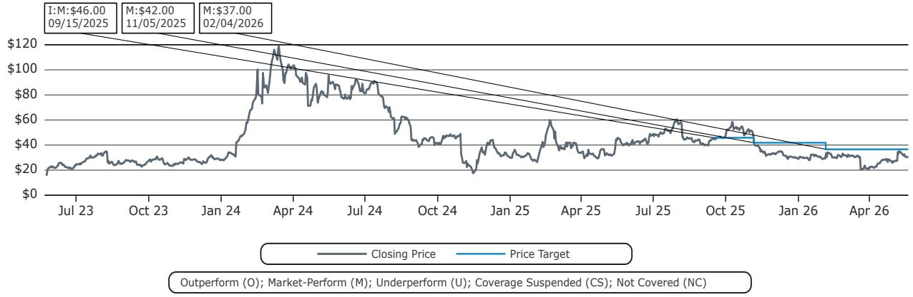

line

| Date       | Closing Price | Price Target |
| ---------- | ------------- | ------------ |
| 09/15/2025 | $46.00        | -            |
| 11/05/2025 | $42.00        | -            |
| 02/04/2026 | $37.00        | -            |

Dell Technologies Inc (DELL) Rating History for Bernstein as of 05/19/2026   
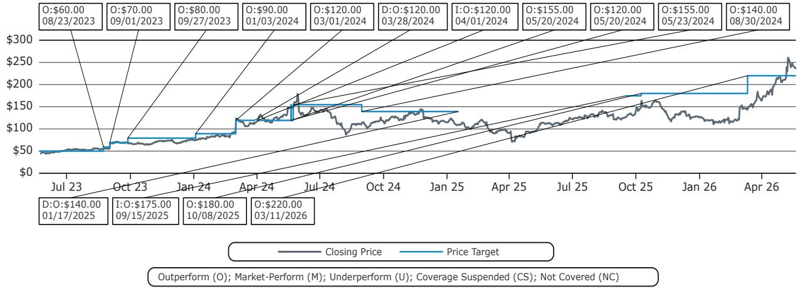

line

| Date       | Closing Price | Price Target |
|------------|---------------|--------------|
| 08/23/2023 | $60.00        | -            |
| 09/01/2023 | $70.00        | -            |
| 09/27/2023 | $80.00        | -            |
| 01/03/2024 | $90.00        | -            |
| 03/01/2024 | $120.00       | -            |
| 03/28/2024 | $120.00       | -            |
| 04/01/2024 | $155.00       | -            |
| 05/20/2024 | $120.00       | -            |
| 05/23/2024 | $155.00       | -            |
| 08/30/2024 | $140.00       | -            |
| 01/17/2025 | $140.00       | -            |
| 09/15/2025 | $175.00       | -            |
| 10/08/2025 | $180.00       | -            |
| 03/11/2026 | $220.00       | -            |

Hewlett Packard Enterprise Co (HPE) Rating History for Bernstein as of 05/19/2026   
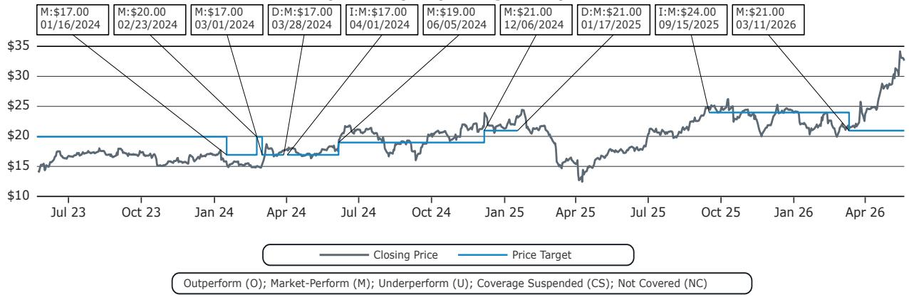

line

| Date       | Closing Price | Price Target |
|------------|---------------|--------------|
| 01/16/2024 | $17.00        | $17.00       |
| 02/23/2024 | $20.00        | $20.00       |
| 03/01/2024 | $17.00        | $17.00       |
| 03/28/2024 | $17.00        | $17.00       |
| 04/01/2024 | $17.00        | $17.00       |
| 06/05/2024 | $19.00        | $19.00       |
| 12/06/2024 | $21.00        | $21.00       |
| 01/17/2025 | $21.00        | $21.00       |
| 09/15/2025 | $24.00        | $24.00       |
| 03/11/2026 | $21.00        | $21.00       |

All price target and closing price data in the chart(s) above are denominated in the currency noted in the Ticker Table of this report.

# CONFLICTS OF INTEREST

Bernstein and/or affiliates have received compensation for investment banking services in the past twelve months from Hewlett Packard Enterprise Co.

Bernstein and/or affiliates have received compensation for non-investment banking securities-related products or services in the previous twelve months from the following clients: Dell Technologies Inc and Hewlett Packard Enterprise Co.

Certain affiliates of Bernstein act as market maker or liquidity provider in the equities securities of: Dell Technologies Inc and Hewlett Packard Enterprise Co.

Certain affiliates of Bernstein act as market maker or liquidity provider in the debt securities of: Dell Technologies Inc and Hewlett Packard Enterprise Co.

Affiliates of Bernstein managed or co-managed in the past twelve months a public offering of securities of Hewlett Packard Enterprise Co.

Bernstein and/or affiliates had an investment banking client relationship during the past twelve months with Hewlett Packard Enterprise Co.

# OTHER MATTERS

The legal entity(ies) employing the analyst(s) listed in this report, and their location, can be determined by the country code of their phone number, as follows:

+1 Bernstein Institutional Services LLC; New York, New York, USA

+44 Bernstein Autonomous LLP; London UK

+212 SG Africa Technologies & Services; Casablanca, Morocco

+33 BSG France S.A.; Paris, France

+34 BSG France S.A.; Madrid, Spain

+41 Bernstein Autonomous LLP; Geneva, Switzerland

+49 BSG France S.A.; Frankfurt, Germany

+91 Bernstein (India) Private Limited; Mumbai, India

+852 Bernstein (Hong Kong) Limited 盛博香港有限公司; Hong Kong, China

+65 Bernstein (Singapore) Private Limited; Singapore

+81 Bernstein Japan KK; Tokyo, Japan

Where this report has been prepared by research analyst(s) employed by a non-US affiliate, such analyst(s), is/are (unless otherwise expressly noted below) not registered as associated persons of Bernstein Institutional Services LLC or any other SEC-registered broker-dealer and are not licensed or qualified as research analysts with FINRA. Accordingly, such analyst(s) may not be subject to FINRA's restrictions regarding (among other things) communications by research analysts with a subject company, interactions between research analysts and investment banking personnel, participation by research analysts in solicitation and marketing activities relating to investment banking transactions, public appearances by research analysts, and trading securities held by a research analyst account.

Where this report has been prepared by research analyst(s) employed by SG Africa Technologies & Services (part of the SG group of companies), it has been prepared on behalf of a Bernstein company under a Global Services Agreement in place between Bernstein and SG.

# CERTIFICATION

Each research analyst listed in this report, who is primarily responsible for the preparation of the content of this report, certifies that all of the views expressed in this publication accurately reflect that analyst's personal views about any and all of the subject securities or issuers and that no part of that analyst's compensation was, is, or will be, directly or indirectly, related to the specific

recommendations or views in this publication.

# II. ADDITIONAL GLOBAL CONFLICT DISCLOSURES

It is at the sole discretion of the Firm as to when to initiate, update and cease research coverage. The Firm has established, maintains and relies on information barriers to control the flow of information contained in one or more areas (i.e., the private side) within the Firm, and into other areas, units, groups or affiliates (i.e., public side) of the Firm.

# III. OTHER IMPORTANT INFORMATION AND DISCLOSURES

Separate branding is maintained for “Bernstein” and “Autonomous” research products.

- Bernstein produces a number of different types of research products including, among others, fundamental analysis and quantitative analysis under both the “Autonomous” and “Bernstein” brands. Recommendations contained within one type of research product may differ from recommendations contained within other types of research products, whether as a result of differing time horizons, methodologies or otherwise. Furthermore, views or recommendations within a research product issued under one brand may differ from views or recommendations under the same type of research product issued under the other brand. The Research Ratings System for the two brands and other information related to those Rating Systems are included in the previous section.   
- Autonomous operates as a separate business unit within the following entities: Bernstein Institutional Services LLC, Bernstein Autonomous LLP, Bernstein (Hong Kong) Limited 盛博香港有限公司 and Bernstein (India) Private Limited. For information relating to “Autonomous” branded products (including certain Sales materials) please visit: www.autonomous.com. For information relating to Bernstein branded products please visit: www.bernsteinresearch.com.

Analysts are compensated based on aggregate contributions to the research franchise as measured by account penetration, productivity and proactivity of investment ideas. No analysts are compensated based on performance in, or contributions to, generating investment banking revenues.

This report has been produced by an independent analyst as defined in Article 3 (1)(34)(i) of EU 596/2014 Market Abuse Regulation (“MAR”) and the same article of MAR as it forms part of United Kingdom domestic law by virtue of the European Union (Withdrawal) Act 2018.

To our readers in the United States: Bernstein Institutional Services LLC, a broker-dealer registered with the U.S. Securities and Exchange Commission (“SEC”) and a member of the U.S. Financial Industry Regulatory Authority, Inc. (“FINRA”) is distributing this publication in the United States and accepts responsibility for its contents. Where this material contains an analysis of debt product(s), such material is intended only for institutional investors and is not subject to the US independence and disclosure standards applicable to debt research prepared for retail investors.

Bernstein Institutional Services LLC may act as principal for its own account or as agent for another person (including an affiliate) in sales or purchases of any security which is a subject of this report. This report does not purport to meet the objectives or needs of any specific individuals, entities or accounts.

To our readers in Canada: If this publication pertains to a Canadian domiciled company, it is being distributed in Canada by Bernstein (Canada) Limited, which is licensed and regulated by the Canadian Investment Regulatory Organization. If the publication pertains to a non-Canadian domiciled company, it is being distributed by Bernstein Institutional Services LLC, which is licensed and regulated by both the SEC and FINRA, into Canada under the International Dealers Exemption.

This document may not be passed onto any person in Canada unless that person qualifies as "permitted client" as defined in Section 1.1 of NI 31-103.

To our readers in Brazil: This report has been prepared by Bernstein Institutional Services LLC, and Banco BTG Pactual S.A. ("BTG") is responsible for the distribution of this report in Brazil.

To readers in the United Kingdom: This publication has been issued or approved for issue in the United Kingdom by Bernstein Autonomous LLP, authorised and regulated by the Financial Conduct Authority and located at 60 London Wall, London EC2M 5SH, +44 (0)20-7170-5000. Registered in England & Wales No OC343985.

This document is for distribution only to persons who (i) have professional experience in matters relating to investments falling within Article 19(5) of the Financial Services and Markets Act 2000 (Financial Promotion) Order 2005 (as amended, the “Financial Promotion Order”), (ii) are persons falling within Article 49(2)(a) to (d) (“high net worth companies, unincorporated associations, etc.”) of the Financial Promotion Order, (iii) are outside the United Kingdom, or (iv) are persons to whom an invitation or inducement to engage in investment activity (within the meaning of section 21 of the FSMA) in connection with the issue or sale of any securities may otherwise lawfully be communicated or caused to be communicated (all such persons together being referred to as “relevant persons”). This document is directed only at relevant persons and must not be acted on or relied on by persons who are not relevant persons. Any investment or investment activity to which this document relates is available only to relevant persons and will be engaged in only with relevant persons.

To our readers in the member states of the EEA: This publication is being distributed by BSG France SA, which is authorised and regulated by the Autorité de Contrôle Prudentiel et de Résolution (ACPR) and Autorité des Marchés Financiers (AMF).

To our readers in Hong Kong: This publication is being distributed in Hong Kong by Bernstein (Hong Kong) Limited 盛博香港有限公司, which is licensed and regulated by the Hong Kong Securities and Futures Commission (Central Entity No. AXC846) to carry out Type 4 (Advising on Securities) regulated activities and subject to the licensing conditions mentioned in the SFC Public Register (https://www.sfc.hk/publicregWeb/corp/AXC846/details)). This publication is solely for professional investors, as defined in the Securities and Futures Ordinance (Cap. 571). The purpose of this report is solely to provide an analysis of the issuers referred to in this report and is not intended for any purpose contrary to the laws of Hong Kong.

To our readers in Singapore: This publication is being distributed in Singapore by Bernstein (Singapore) Private Limited, only to accredited investors or institutional investors, as defined in the Securities and Futures Act 2001 of Singapore ("SFA"). Recipients in Singapore should contact Bernstein (Singapore) Private Limited in respect of matters arising from, or in connection with, this publication. Bernstein (Singapore) Private Limited is regulated by the Monetary Authority of Singapore and licensed under the SFA as a capital markets services licence holder for dealing in capital markets products that are securities and collective investment schemes and an exempt financial adviser for advising on, issuing and promulgating analyses and reports on securities. Bernstein (Singapore) Private Limited is registered in Singapore with Company Registration No. 20213710W and located at One Raffles Quay, #27-11 South Tower, Singapore 048583, +65-6230-4612.

To our readers in the People's Republic of China: The securities referred to in this document are not being offered or sold and may not be offered or sold, directly or indirectly, in the People's Republic of China (for such purposes, not including the Hong Kong and Macau Special Administrative Regions or Taiwan, the "PRC") in contravention of any applicable laws of the PRC.

This document does not constitute an offer to sell or the solicitation of an offer to buy any securities in the PRC to any person to whom it is unlawful to make the offer or solicitation in the PRC.

We do not represent that this document may be lawfully distributed, or that any securities may be lawfully offered, in compliance with any applicable registration or other requirements in the PRC, or pursuant to an exemption available thereunder, or assume any responsibility for facilitating any such distribution or offering. In particular, no action has been taken by us which would permit a public offering of any securities or distribution of this document in the PRC. Accordingly, the securities are not being offered or sold within the PRC by means of this document or any other document. Neither this document nor any advertisement or other offering material may be distributed or published in the PRC, except under circumstances that will result in compliance with any applicable laws and regulations.

To our readers in Japan: This publication is being distributed in Japan by Bernstein Japan KK (サンフォード・C・バーンスタイン株式会社), which is registered in Japan as a Financial Instruments Business Operator with the Kanto Local Finance Bureau (registration number: The Director-General of Kanto Local Finance Bureau (FIBO) No.3387) and regulated by the Financial Services Agency. It is also a member of Japan Investment Advisers Association. This publication is solely for qualified institutional investors in Japan only, as defined in Article 2, paragraph (3), items (i) of the Financial Instruments and Exchange Act.

For the institutional client readers in Japan who have been granted access to the Bernstein website by Daiwa Group Inc. ("Daiwa"), your access to this document should not be construed as meaning that Bernstein is providing you with investment advice for any purposes. Whilst Bernstein has prepared this document, your relationship is, and will remain with, Daiwa, and Bernstein has neither any contractual relationship with you nor any obligations towards you.

To our readers in Australia: Bernstein (Hong Kong) Limited 盛博香港有限公司 is responsible for distributing research in Australia. It is regulated by the Securities and Exchange Commission under U.S. laws, by the Financial Conduct Authority under U.K. laws, which differs from Australian laws. Bernstein (Hong Kong) Limited 盛博香港有限公司 is exempt from the requirement to hold an Australian financial services license under the Corporations Act 2001 in respect of the provision of the following financial services to wholesale clients:

• providing financial product advice;   
• dealing in a financial product;   
• making a market for a financial product; and

• providing a custodial or depository service.

To our readers in India: This publication is being distributed in India by Bernstein (India) Private Limited (SCB India) which is licensed and regulated by Securities and Exchange Board of India ("SEBI") as a research analyst entity under the SEBI (Research Analyst) Regulations, 2014, having registration no. INH000006378 and as a stock broker having registration no. INZ000213537. SCB India is currently engaged in the business of providing research and stock broking services. Please refer to www.bernsteinresearch.in for more information.

- SCB India is a Private limited company incorporated under the Companies Act, 2013, on April 12, 2017 bearing corporate identification number U65999MH2017FTC293762, and registered office at Level 3A, 4th Floor, First International Financial Centre, Plot Nos C-54 and C-55, G Block, Near CBI Office, Bandra Kurla Complex, Bandra (East), Mumbai 400098, Maharashtra, India (Phone No: +91-22-68421401).   
- For details of Associates (i.e., affiliates/group companies) of SCB India, kindly email MUM-BERNSTEIN-InCompliance@bernsteinsg.com.   
• SCB India does not have any disciplinary history as on the date of this report.   
- Except as noted above, SCB India and/or its Associates (i.e., affiliates/group companies), the Research Analysts authoring this report, and their relatives

• do not have any financial interest in the subject company   
• do not have actual/beneficial ownership of one percent or more in securities of the subject company;   
• is not engaged in any investment banking activities for Indian companies, as such;   
• have not managed or co-managed a public offering in the past twelve months for any Indian companies;   
- have not received any compensation for investment banking services or merchant banking services from the subject company in the past 12 months;   
• have not received compensation for brokerage services from the subject company in the past twelve months;   
- have not received any compensation or other benefits from the subject company or third party related to the specific recommendations or views in this report; and   
- do not currently, but may in the future, act as a market maker in the financial instruments of the companies covered in the report.   
• do not have any conflict of interest in the subject company as of the date of this report.

- Except as noted above, the subject company has not been a client of SCB India during twelve months preceding the date of distribution of this research report. Neither SCB India nor its Associates (i.e., affiliates/group companies) have received compensation for products or services other than investment banking, merchant banking or brokerage services from the subject company in the past twelve months.   
- The principal research analyst(s) who prepared this report, members of the analysts' team, and members of their households are not an officer, director, employee or advisory board member of the companies covered in the report.   
- Our Compliance officer / Grievance officer is Ms. Rupal Talati, who can be reached at +91-22-68421451, or MUM-BERNSTEIN-InCompliance@bernsteinsg.com / Scbin-investorgrievance@bernsteinsg.com   
- The Research investor charter and Terms & Conditions of SCB India are available on its website and may be accessed at Bernstein (India) Private Limited (https://bernsteinresearch.in/) for your reference.   
- Disclaimer: Registration granted by SEBI, and certification from NISM, is in no way a guarantee of performance of the intermediary or provide any assurance of returns to investors. Investments in securities market are subject to market risks. Read all the related documents carefully before investing.

To our readers in Switzerland: This document is provided in Switzerland by or through Bernstein Autonomous LLP, and is provided only to qualified investors as defined in article 10 of the Swiss Collective Investment Scheme Act (“CISA”) and related provisions of the Collective Investment Scheme Ordinance and in strict compliance with applicable Swiss law and regulations. The products mentioned in this document may not be suitable for all types of investors. This document is based on the Directives on the Independence of Financial Research issued by the Swiss Bankers Association (SBA) in January 2008.

To our readers in the Middle East: Bernstein Autonomous LLP, DIFC branch has its principal office at Gate Village 06, DIFC, Dubai, UAE. Bernstein Autonomous LLP, DIFC branch is regulated by the Dubai Financial Services Authority (DFSA) with the registration number CL10040 and is provisioned for Arranging Deals in Investments and Advising on Financial Products. All communications and services are directed at Professional Clients and Market Counterparties only (as defined in the DFSA rulebook). Persons other than Professional Clients and Market Counterparties, such as Retail Clients, are not the intended recipients of our communications or services.

# LEGAL

All research publications are disseminated to our clients through posting on the firm's password protected websites, bernsteinresearch.com and autonomous.com. Certain, but not all, research publications are also made available to clients through third-party vendors or redistributed to clients through alternate electronic means as a convenience.

This publication has been published and distributed in accordance with the Firm's policy for management of conflicts of interest in investment research, a copy of which is available from Bernstein Institutional Services LLC, Director of Compliance, 245 Park Avenue, New York, NY 10167. Additional disclosures and information regarding Bernstein's business are available on our website www.bernsteinresearch.com.

The securities described herein may not be eligible for sale in all jurisdictions or to certain categories of investors where that permission profile is not consistent with the licenses held by the entities noted herein. This document is for distribution only as may be permitted by law. This publication is not directed to, or intended for distribution to or use by, any person or entity who is a citizen or resident of, or located in any locality, state, country or other jurisdiction where such distribution, publication, availability or use would be contrary to law or regulation or which would subject any of the entities referenced herein or any of their subsidiaries or affiliates to any registration or licensing requirement within such jurisdiction. This publication is based upon public sources we believe to be reliable, but no representation is made by us that the publication is accurate or complete. We do not undertake to advise you of any change in the reported information or in the opinions herein. This publication was prepared and issued by entity referred to herein for distribution to eligible counterparties or professional clients. This publication is not an offer to buy or sell any security, and it does not constitute investment, legal or tax advice. The investments referred to herein may not be suitable for you. Investors must make their own investment decisions in consultation with their professional advisors in light of their specific circumstances. The value of investments may fluctuate, and investments that are denominated in foreign currencies may fluctuate in value as a result of exposure to exchange rate movements. Information about past performance of an investment is not necessarily a guide to, indicator of, or assurance of, future performance.

This report is directed to and intended only for our clients who are “eligible counterparties”, “professional clients”, “institutional investors” and/or “professional investors” as defined by the aforementioned regulators, and must not be redistributed to retail clients as defined by the aforementioned regulators. Retail clients who receive this report should note that the services of the entities noted herein are not available to them and should not rely on the material herein to make an investment decision. The result of such act will not hold the entities noted herein liable for any loss thus incurred as the entities noted herein are not registered/authorised/licensed to deal with retail clients and will not enter into any contractual agreement/arrangement with retail clients. This report is provided subject to the terms and conditions of any agreement that the clients may have entered into with the entities noted herein. All research reports are disseminated on a simultaneous basis to eligible clients through electronic publication to our client portal.

The information in this report was prepared by Bernstein solely for the internal business use of our clients. Clients may store, display, analyze, reformat and print the information in this report for this limited use only. Clients may not copy, alter, create derivative works, resell, reverse engineer, commercially exploit, share or distribute any part of the information contained herein for any purpose without Bernstein's express written consent. These restrictions include extracting data or using the content to develop indices or other products. Further, you may not use this report, or any portion of this report, to train or finetune any third-party machine learning or artificial intelligence system, or as a prompt or input into any such system. You also may not, without Bernstein's express written consent, do any of the foregoing in connection with your own internal machine learning or artificial intelligence system.

Bernstein may use artificial intelligence tools in the preparation of its materials. Any such materials are reviewed by Bernstein's research analysts prior to publication.

This report has been prepared for information purposes only and is based on current public information that we consider reliable, but the entities noted herein do not warrant or represent (express or implied) as to the sources of information or data contained herein are accurate, complete, not misleading or as to its fitness for the purpose intended even though the entities noted herein rely on reputable or trustworthy data providers, it should not be relied upon as such. Opinions expressed are the author(s)' current opinions as of the date appearing on the material only and we do not undertake to advise you of any change in the reported information or in the opinions herein.

This publication was prepared and issued by the entity referred to herein for distribution to eligible counterparties or professional clients. The information in this report is intended for general circulation and does not constitute an offer to buy or sell any security, investment, legal or tax advice nor a personal recommendation, as defined by any of the aforementioned regulators. It does not take into account the particular investment objectives, financial situations, or needs of individual investors. The report has not been reviewed by any of the aforementioned regulators and does not represent any official recommendation from the aforementioned regulators. The investments referred to herein may not be suitable for you. Investors must make their own investment decisions in consultation with advice sought from a financial adviser regarding the suitability of the investment product, taking into account the specific investment objectives, financial situation or particular needs of any recipient of the recommendation, before the recipient makes a commitment to purchase the investment product.

The analysis contained herein is based on numerous assumptions. Different assumptions could result in materially different results. The information in this report does not constitute, or form part of, any offer to sell or issue, or any offer to purchase or subscribe for shares, or to induce engage in any other investment activity. The value of any securities or financial instruments mentioned in this report may fluctuate subject to market conditions. Information about past performance of an investment is not necessarily a guide to, indicative of, or assurance of future performance. Estimates of future performance mentioned by the research analyst in this report are based on assumptions that may not be realized due to unforeseen factors like market volatility/fluctuation. In relation to securities or financial instruments denominated in a foreign currency other than the clients' home currency, movements in exchange rates will have an effect on the value, either favorable or unfavorable. Before acting on any recommendations in this report, recipients should consider the appropriateness of investing in the subject securities or financial instruments mentioned in this report and, if necessary, seek for independent professional advice.

The securities described herein may not be eligible for sale in all jurisdictions or to certain categories of investors where that permission profile is not consistent with the licenses held by the entities noted herein. This document is for distribution only as may be permitted by law. It is not directed to, or intended for distribution to or use by, any person or entity who is a citizen or resident of or located in any locality, state, country or other jurisdiction where such distribution, publication, availability or use would be contrary to law or regulation or would subject the entities noted herein to any regulation or licensing requirement within such jurisdiction.

Source: Bloomberg Index Services Limited. BLOOMBERG® is a trademark and service mark of Bloomberg Finance L.P. and its affiliates (collectively “Bloomberg”). Bloomberg or Bloomberg’s licensors own all proprietary rights in the Bloomberg Indices. Neither Bloomberg nor Bloomberg’s licensors approves or endorses this material, or guarantees the accuracy or completeness of any information herein, or makes any warranty, express or implied, as to the results to be obtained therefrom and, to the maximum extent allowed by law, neither shall have any liability or responsibility for injury or damages arising in connection therewith.

No part of this material may be reproduced, distributed or transmitted or otherwise made available without prior consent of the entities noted herein. Copyright Bernstein Institutional Services LLC Bernstein Autonomous LLP, BSG France S.A., Bernstein (Hong Kong) Limited 盛博香港有限公司, Bernstein (Canada) Limited, Bernstein (India) Private Limited (SEBI registration no. INH000006378), Bernstein (Singapore) Private Limited and Bernstein Japan KK (サンフォード・C・バーンスタイン株式会社). All rights reserved. The trademarks and service marks contained herein are the property of their respective owners. Any unauthorized use or disclosure is strictly prohibited. The entities noted herein may pursue legal action if the unauthorized use results in any defamation and/or reputational risk to the entities noted herein and research published under the Bernstein and Autonomous brands.