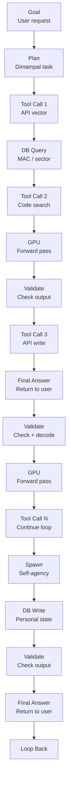

你是知乎商业/行业研究作者，擅长把英文/中文研报改写成适合知乎发布的长文。

【目标】
- 基于下面研报解析内容，生成一篇中文知乎文章。
- 风格接近微信公众号文章，但更适合知乎：论证更完整、语气更克制、有问题意识、有推理链条。
- 文章不需要把研报所有内容讲完，要留下继续阅读完整报告或加入社群讨论的空间。
- 目标长度：约 2200 字，允许上下浮动 20%。

【结构要求】
1. 第一行：知乎标题，直接讲观点，不要标题党，不要夸张极限词。
2. 开头 2-3 段：用一个真实问题或市场分歧切入，说明为什么这份报告值得看。
3. 正文按金字塔原则组织：先给核心判断，再展开 3-5 个支撑逻辑。
4. 每个小标题都要像观点句，不要写“核心判断”“支撑逻辑一”“对读者的启发”这种模板名。
5. 内容要比小红书更理性，比微信更像问答式分析，可以适度提出反问。
6. 结尾自然留下讨论空间，可使用这类表达：`完整报告里还有不少细节，适合放在社群里继续拆。`

【平台发布合规要求】
- 不要出现“投资建议”“买入”“卖出”“强烈推荐”“稳赚”“保本”“必涨”“抄底”“上车”“内幕”“翻倍”等金融操作或收益承诺表达。
- 不要写“非投资建议”“仅做学习交流”这种免责声明，也不要出现包含“投资”的免责声明。
- “投资”相关词尽量改成“投研”“研究”“观察”“学习参考”。
- 不要写“关注”“点赞”“求关注”“评论区留言”等直接互动诱导。
- 不要使用“爆款”“震惊”“必看”“必读”“最强”“最全”“唯一”“全网首发”等极限词。

【内容要求】
- 只能基于研报原文和解析内容推导，不要编造数据、页数、作者、结论或引用。
- 可以基于报告内容做适度发散，但必须明确哪些是报告内容，哪些是你的延展观察。
- 默认避免具体投行品牌名，比如“GS”“GS”，统一写作“投行研报”或使用 GS/JPM/MS 等缩写。
- 不要输出解释说明，只输出知乎文章正文。

【研报解析内容】
"""
# U.S. IT Hardware

# Server OEMs: Agentic AI driving next leg of AI infra build - what does this mean for DELL, HPE, SMCI?

Mark C. Newman

+1 212 845 7822

mark.newman@bernsteinsg.com

April Li

+1 917 344 8339

april.li@bernsteinsg.com

Phoebe Sun

+1 917 344 8481

phoebe.sun@bernsteinsg.com

We believe that Agentic AI will be significantly more CPU intensive driving upside to traditional server TAM, which in turn should benefit the server OEMs. In addition, challenges and pushouts from SMCI could portend the beginning of share losses from SMCI from its most recent reputational challenges (the most recent being the smuggling case see here). This note explains these trends and implications for DELL, HPE and SMCI.

# The rise of more complex inference workloads, and in particular Agentic AI, is expected to drive increased demand for CPU-based (aka “traditional”) servers.

Agentic AI is more CPU intensive than training or simple chatbot inference with CPUs and traditional servers orchestrating workloads. Recent commentaries from Intel/AMD/ARM suggest the early inning of CPU demand upcycle. We see potential for a 3x-4x expansion of traditional server TAM by 2030 which bodes well for all server OEMs.

Meanwhile, SMCI's recent earnings showed a higher mix of enterprise and non-AI revenue, with AI server mix declining for the first time in 10 quarters. This likely reflects 1) strength in traditional servers and 2) potential share loss in AI servers following recent reputational challenges. We believe Dell and HPE are positioned to benefit from both dynamics. While these are longer-term themes and may not yet be reflected in the upcoming earnings, we see the current setup as supportive of upside heading into the prints - Dell reports on May $28^{th}$ , HPE reports on Jun $1^{st}$ .

Dell is our more preferred beneficiary, given its scale, financing capacity, and robust support/services across the AI infrastructure. We consider Dell to be the real AI winner. Being the scale leader with the broadest financing capacity and deepest customer relationships, Dell is best positioned to absorb displaced SMCI demand across cloud, enterprise, and sovereign, we take up estimates and raise our multiple from 14x to 17x FY28 EPS and our target price to \$280. Reiterate Outperform.

HPE should also benefit from stronger server demand and incremental share gains in enterprise and sovereign accounts, justifying our estimates increase and multiple raise from 8x to 12.5x FY27 EPS and a \$35 target price, Market-perform.

SMCI's compliance overhang creates a real share shift opportunity as cloud, enterprise, and sovereign customers reassess vendor risk. SMCI's FQ4 and beyond faces a much harder setup as pre-scandal enterprise momentum fades, unusual data center delays raise the risk of soft cancellations, and potential risks around Nvidia GPU supply -leaves risk-reward firmly skewed to the downside (we rate SMCI Market-perform).

BERNSTEIN TICKER TABLE 

<table><tr><td rowspan="2" colspan="3"></td><td colspan="2">19 May2026</td><td colspan="2">TTM</td><td colspan="4">Adjusted EPS</td><td colspan="3">Adjusted P/E (x)</td></tr><tr><td rowspan="2">ClosingPrice</td><td rowspan="2">PriceTarget</td><td rowspan="2">Rel.Perf.</td><td rowspan="2">Cur</td><td rowspan="2">2026A</td><td rowspan="2">2027E</td><td rowspan="2">2028E</td><td rowspan="2">2026A</td><td rowspan="2">2027E</td><td rowspan="2">2028E</td><td></td></tr><tr><td>Ticker</td><td>Rating</td><td>Cur</td><td></td></tr><tr><td>SMCI (SMCI)</td><td>M</td><td>USD</td><td>30.56</td><td>37.00</td><td>(51.9)%</td><td>USD</td><td>2.60</td><td>2.80</td><td>3.25</td><td>11.8</td><td>10.9</td><td>9.4</td><td></td></tr><tr><td>DELL (Dell)</td><td>O</td><td>USD</td><td>235.26</td><td>280.00</td><td>82.6%</td><td>USD</td><td>10.35</td><td>13.46</td><td>16.47</td><td>22.7</td><td>17.5</td><td>14.3</td><td></td></tr><tr><td>OLD</td><td></td><td></td><td></td><td>220.00</td><td></td><td></td><td></td><td>13.14</td><td>15.99</td><td></td><td></td><td></td><td></td></tr><tr><td>HPE (HPE)</td><td>M</td><td>USD</td><td>32.62</td><td>35.00</td><td>60.8%</td><td>USD</td><td>1.96</td><td>2.43</td><td>2.85</td><td>16.6</td><td>13.4</td><td>11.5</td><td></td></tr><tr><td>OLD</td><td></td><td></td><td></td><td>21.00</td><td></td><td></td><td></td><td>2.39</td><td>2.66</td><td></td><td></td><td></td><td></td></tr><tr><td>SPX</td><td></td><td></td><td>7,353.61</td><td></td><td></td><td></td><td></td><td></td><td></td><td></td><td></td><td></td><td></td></tr></table>

# PRICE TARGET CHANGE / ESTIMATE CHANGE IN BOLD

O - Outperform, M - Market-Perform, U - Underperform, NR - Not Rated, CS - Coverage Suspended

DELL estimate is Reported EPS; HPE base year is 2025;

Source: Bloomberg, Bernstein estimates and analysis.

# INVESTMENT IMPLICATIONS

We value Dell at \~17x (up from 14x previously) our FY 2028 EPS, or \$280.

We value HPE at \~12.5x (up from 8x previously) our FY 2027 EPS, or \$35.

We value Super Micro at 13.2x our revised FY27 EPS of \$2.80 = \$37.

# Table Of Contents

Part I: Agentic AI driving next leg of AI infrastructure build - Traditional Servers to benefit....3

Part II: Why did SMCI beat FQ3'26? And what could SMCI's issues mean for DELL, HPE?......5

Part III: The read across from SMCI hints upside for DELL & HPE into the next print and beyond....7

Part IV: Valuation and model changes....9

DELL: AI Infra Winner - Raise estimates and increase TP to \$280, Reiterate Outperform....9

HPE: Also stands to benefit, raise estimates and TP to \$35, Market-perform.... 10

SMCI: Strong position in AI Servers in jeopardy (IN a Booming Market); Market-perform.... 11

# DETAILS

# PART I: AGENTIC AI DRIVING NEXT LEG OF AI INFRASTRUCTURE BUILD - TRADITIONAL SERVERS TO BENEFIT

We see AI infrastructure demand beginning to broaden beyond GPU-centric systems. In particular, the rise of more complex inference workloads, including agentic AI, is expected to drive increased demand for CPU-based servers.

\- Agentic inference is more CPU intensive than training or simple chatbot inference (Exhibit 1, Exhibit 2). Training workloads are typically large, batch-oriented processes dominated by GPUs. In contrast, agentic workloads involve multi-step task execution, including tool calls, retrieval, routing, memory and context management, validation loops, and significant data movement. These functions rely more heavily on general-purpose compute and orchestration, driving greater demand for CPU-based servers alongside GPU clusters.

\- Recent industry commentary points to a broader reassessment of CPU demand within AI infrastructure. AMD raised its server CPU TAM growth outlook from 18% to over 35% annually, reaching over \$120bn by 2030. Intel noted on its Q1 2026 earnings call that the CPU-to-GPU ratio in inference has already compressed from 1:8 to 1:4 and could trend toward 1:1, while guiding to double-digit server CPU unit growth for the full year with momentum extending into 2027. Arm CEO Rene Haas also highlighted that as agentic AI scales, data centers could require more than 4 times today's CPU capacity (Exhibit 3).

According to above comments, our quick back-of-the-envelope analysis suggests that if assuming CPUs account for 20-25% of traditional server ASP, total traditional server TAM could reach roughly \$500-600B by 2030, or about 2.5x the \$213B TAM in 2025. If instead traditional server TAM grows at a 35% CAGR, in line with Server CPU, it would expand to approximately \$955B, or 4.5x 2025 levels, pointing to substantial upside potential (Exhibit 4).

\- We believe the buyer profile for CPU servers is also expanding beyond enterprise. We think traditional server demand is no longer solely an enterprise refresh cycle story - it is also becoming a neocloud/hyperscaler infrastructure story, which makes the demand base both larger and more durable. For Dell and HPE, both of which have strong positions in traditional server infrastructure, this is a meaningful incremental tailwind that should support the next print and sustain in the future, particularly for Dell, which also has success with neoclouds (tier-2 CSPs) that HPE does not.

# EXHIBIT 1: Chatbot inference workflow

# Chatbot Inference

Single-pass: prompt in $\rightarrow$ answer out

flowchart

Source: Bernstein analysis

EXHIBIT 2: Agentic inference workflow   

flowchart

Source: Bernstein analysis   
Goal → Plan → Tool call 1 (API) → DB query → Tool call 2 (code exec)
    → GPU (forward pass) → validate → Tool call 3 → DB write
    → spawn sub-agent → ... → loop back ... → final answer

User prompt → CPU (head node, I/O) → GPU (one forward pass) → CPU → response

EXHIBIT 3: CPU Vendor Comments on Agentic AI driving CPU demand growth 

<table><tr><td>Company</td><td>Source</td><td>Quantified Comments</td></tr><tr><td>AMD</td><td>Q1 2026 call</td><td>&quot;Based on the demand signals we are seeing today and the structural increase in CPU compute requirements driven by Agentic AI, we now expect the server CPU TAM to grow at greater than 35% annually, reaching over $120 billion by 2030.&quot; vs. 18% annually guided at Nov 2025 Analyst Day</td></tr><tr><td>Intel</td><td>Q1 2026 call</td><td>Inference side, I think in terms of orchestration, control plane and also managing all the different agent with data, CPU is much more efficient. So I think the ratio of CPU to GPU used to be 1 and 8, and now it&#x27;s 1:4 and I think towards parity or even better... Our outlook for server CPU demand has improved over the last 90 days, and we expect a strong year of double-digit unit growth for the industry and for us with momentum extending into 2027.</td></tr><tr><td>Arm</td><td>Arm Everywhere, March 2026</td><td>&quot;A typical AI data center today requires around 30 million CPU cores per gigawatt of capacity. With agentic workloads, however, that figure rises to roughly 120 million cores per gigawatt&quot;</td></tr></table>

Source: Company reports, Bernstein analysis

EXHIBIT 4: 2.5x-4.5x Traditional server TAM expansion by 2030   

bar

CPU server TAM BY 2030
| Year | TAM ($bn) |
| :--- | :--- |
| 2025 | 213 |
| 2030 (assume CPU costs 20% of trad. Server ASP) | 2.5x 2025 TAM |
| 2030 (assume 35% CAGR) | 4.5x 2025 TAM |
The chart displays a single bar representing the total cost of CPU server by 2030, with annotations indicating the percentage increase from the previous measurement point. The values are estimated based on the dollar amount of each bar.

Source: Gartner, Bernstein analysis and estimates

# PART II: WHY DID SMCI BEAT FQ3'26? AND WHAT COULD SMCI'S ISSUES MEAN FOR DELL, HPE?

SMCI delivered an EPS beat in FQ3'26, driven by stronger gross margin from mix shift. As discussed in our note "SMCI FQ3'26: The Rollercoaster continues...", non-GAAP EPS of \$0.84 was 34% above consensus, with gross margin rebounding to 10.1% from 6.4% in the prior quarter (Exhibit 5). We attribute the gross margin expansion to two key factors:

- Higher implied mix of traditional servers relative to AI servers (Exhibit 6). AI server mix declined from $90\%$ to $80\%$ in the past quarter, marking the first decrease in the last 10 quarters, while the implied traditional server mix increased. During the earnings call, management also highlighted traditional server strength driven by the enterprise business. This mix shift was margin-accretive, as AI servers typically carry lower margins due to higher component (compute) costs, whereas traditional servers generally offer higher margins. We understand SMCI doesn't directly disclose the traditional server mix, but given the drop in AI server mix and the CEO remark on Agentic AI workload as a reason for traditional server strength, we believe it can be inferred that the traditional server mix increased.   
- Higher mix of enterprise clients relative to data centers (Exhibit 7). Data center mix declined from 84% to 72%, while enterprise mix increased from 16% to 28%. This also benefits gross margin, as large data center customers typically have greater bargaining power and therefore generate lower margins compared to enterprise customers.

However, while the mix shift provided support to the bottom line, it does not signal a positive development for the stock thesis. SMCI's AI bull case is driven by strong AI server demand and growth among large data center customers, both of which softened during the quarter. As such, this is not a beat that investors are likely to view positively.

EXHIBIT 5: SMCI Gross Margin   

line

| Period | Gross Margin |
|--------|--------------|
| FY21 Q1 | 17% |
| FY21 Q2 | 16% |
| FY21 Q3 | 14% |
| FY21 Q4 | 14% |
| FY22 Q1 | 13% |
| FY22 Q2 | 14% |
| FY22 Q3 | 16% |
| FY22 Q4 | 18% |
| FY23 Q1 | 19% |
| FY23 Q2 | 19% |
| FY23 Q3 | 18% |
| FY23 Q4 | 17% |
| FY24 Q1 | 17% |
| FY24 Q2 | 15% |
| FY24 Q3 | 16% |
| FY24 Q4 | 10% |
| FY25 Q1 | 13% |
| FY25 Q2 | 12% |
| FY25 Q3 | 10% |
| FY25 Q4 | 10% |
| FY26 Q1 | 9% |
| FY26 Q2 | 6% |
| FY26 Q3 | 10% |

Source: Company reports, Bernstein estimates and analysis

EXHIBIT 6: SMCI Revenue Mix by Product   

line

| Quarter   | AI Servers | Other (Including Traditional Servers) |
| --------- | ---------- | ------------------------------------- |
| 2024Q2    | -          | 50%                                   |
| 2024Q3    | -          | 50%                                   |
| 2024Q4    | 70%        | 30%                                   |
| 2025Q1    | 70%        | 30%                                   |
| 2025Q2    | 70%        | 30%                                   |
| 2025Q3    | 70%        | 30%                                   |
| 2025Q4    | 70%        | 30%                                   |
| 2026Q1    | 75%        | 25%                                   |
| 2026Q2    | 90%        | 10%                                   |
| 2026Q3    | 80%        | 20%                                   |

Source: Company reports, Bernstein analysis

EXHIBIT 7: SMCI Revenue Mix: In FQ3, data center revenue and mix decreased while Enterprise grew   

line

| Quarter   | OEM Appliance & Large DC | Organic (Enterprise & Channel) | 5G Telco & Edge/IOT |
| --------- | ------------------------ | ------------------------------ | ------------------- |
| 2024Q2    | 60.00%                   | 40.00%                         | 1.00%               |
| 2024Q3    | 50.00%                   | 50.00%                         | 1.00%               |
| 2024Q4    | 65.00%                   | 35.00%                         | 2.00%               |
| 2025Q1    | 45.00%                   | 55.00%                         | 1.00%               |
| 2025Q2    | 75.00%                   | 25.00%                         | 1.00%               |
| 2025Q3    | 55.00%                   | 42.00%                         | 1.00%               |
| 2025Q4    | 35.00%                   | 1.00%                          | 63.00%              |
| 2026Q1    | 68.00%                   | 31.00%                         | 1.00%               |
| 2026Q2    | 84.00%                   | 16.00%                         | 1.00%               |
| 2026Q3    | 72.00%                   | 28.00%                         | 1.00%               |

Source: Company reports, Bloomberg, Bernstein analysis

# PART III: THE READ ACROSS FROM SMCI HINTS UPSIDE FOR DELL & HPE INTO THE NEXT PRINT AND BEYOND

Based on the recent smuggling reports around SMCI and the company's reported FQ3 earnings, we see a positive set up for Dell and HPE, with Dell being the clearest beneficiary.

First, we expect strength from traditional servers, driven by a combination of pull-forward demand to manage memory cost dynamics and, more importantly, early signs that rising agentic inference workloads are supporting a more durable recovery in CPU server demand - as explain in part I. As leading traditional server vendors, Dell and HPE are well positioned to benefit from this trend in the upcoming quarter and beyond.

Second, we see risk related to order exodus from SMCI across cloud, enterprise, and sovereign accounts, as customers revisit vendor decisions and reassess vendor risk. One company's loss is another's gain: both Dell and HPE are positioned to benefit, but we see Dell as best positioned to capture the most share given its greater scale, stronger financing capabilities, and leading position in large-scale AI infrastructure deployments.

\- For cloud, SMCI was already seeing weaker demand heading into FQ3, and we see little reason to expect a clean rebound under the current governance overhang. A meaningful portion of the Q4 "push-out" that management framed as data center readiness issues could turn into cancellations as customers reassess vendor risk. For example, Bloomberg reported in February that xAI, historically an SMCI customer, was negotiating a +\$5 billion server deal with Dell (Dell Nears Deal With Musk's xAI for \$5B in Servers With Nvidia Chips - Bloomberg). If that shift was already underway before, the sm

[中间内容因长度限制已省略]

is report, to train or finetune any third-party machine learning or artificial intelligence system, or as a prompt or input into any such system. You also may not, without Bernstein's express written consent, do any of the foregoing in connection with your own internal machine learning or artificial intelligence system.

Bernstein may use artificial intelligence tools in the preparation of its materials. Any such materials are reviewed by Bernstein's research analysts prior to publication.

This report has been prepared for information purposes only and is based on current public information that we consider reliable, but the entities noted herein do not warrant or represent (express or implied) as to the sources of information or data contained herein are accurate, complete, not misleading or as to its fitness for the purpose intended even though the entities noted herein rely on reputable or trustworthy data providers, it should not be relied upon as such. Opinions expressed are the author(s)' current opinions as of the date appearing on the material only and we do not undertake to advise you of any change in the reported information or in the opinions herein.

This publication was prepared and issued by the entity referred to herein for distribution to eligible counterparties or professional clients. The information in this report is intended for general circulation and does not constitute an offer to buy or sell any security, investment, legal or tax advice nor a personal recommendation, as defined by any of the aforementioned regulators. It does not take into account the particular investment objectives, financial situations, or needs of individual investors. The report has not been reviewed by any of the aforementioned regulators and does not represent any official recommendation from the aforementioned regulators. The investments referred to herein may not be suitable for you. Investors must make their own investment decisions in consultation with advice sought from a financial adviser regarding the suitability of the investment product, taking into account the specific investment objectives, financial situation or particular needs of any recipient of the recommendation, before the recipient makes a commitment to purchase the investment product.

The analysis contained herein is based on numerous assumptions. Different assumptions could result in materially different results. The information in this report does not constitute, or form part of, any offer to sell or issue, or any offer to purchase or subscribe for shares, or to induce engage in any other investment activity. The value of any securities or financial instruments mentioned in this report may fluctuate subject to market conditions. Information about past performance of an investment is not necessarily a guide to, indicative of, or assurance of future performance. Estimates of future performance mentioned by the research analyst in this report are based on assumptions that may not be realized due to unforeseen factors like market volatility/fluctuation. In relation to securities or financial instruments denominated in a foreign currency other than the clients' home currency, movements in exchange rates will have an effect on the value, either favorable or unfavorable. Before acting on any recommendations in this report, recipients should consider the appropriateness of investing in the subject securities or financial instruments mentioned in this report and, if necessary, seek for independent professional advice.

The securities described herein may not be eligible for sale in all jurisdictions or to certain categories of investors where that permission profile is not consistent with the licenses held by the entities noted herein. This document is for distribution only as may be permitted by law. It is not directed to, or intended for distribution to or use by, any person or entity who is a citizen or resident of or located in any locality, state, country or other jurisdiction where such distribution, publication, availability or use would be contrary to law or regulation or would subject the entities noted herein to any regulation or licensing requirement within such jurisdiction.

Source: Bloomberg Index Services Limited. BLOOMBERG® is a trademark and service mark of Bloomberg Finance L.P. and its affiliates (collectively “Bloomberg”). Bloomberg or Bloomberg’s licensors own all proprietary rights in the Bloomberg Indices. Neither Bloomberg nor Bloomberg’s licensors approves or endorses this material, or guarantees the accuracy or completeness of any information herein, or makes any warranty, express or implied, as to the results to be obtained therefrom and, to the maximum extent allowed by law, neither shall have any liability or responsibility for injury or damages arising in connection therewith.

No part of this material may be reproduced, distributed or transmitted or otherwise made available without prior consent of the entities noted herein. Copyright Bernstein Institutional Services LLC Bernstein Autonomous LLP, BSG France S.A., Bernstein (Hong Kong) Limited 盛博香港有限公司, Bernstein (Canada) Limited, Bernstein (India) Private Limited (SEBI registration no. INH000006378), Bernstein (Singapore) Private Limited and Bernstein Japan KK (サンフォード・C・バーンスタイン株式会社). All rights reserved. The trademarks and service marks contained herein are the property of their respective owners. Any unauthorized use or disclosure is strictly prohibited. The entities noted herein may pursue legal action if the unauthorized use results in any defamation and/or reputational risk to the entities noted herein and research published under the Bernstein and Autonomous brands.
"""
