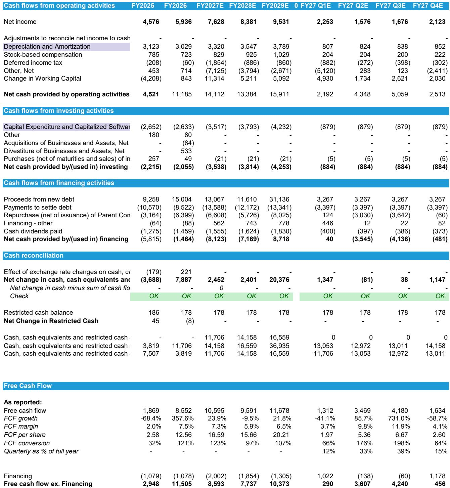
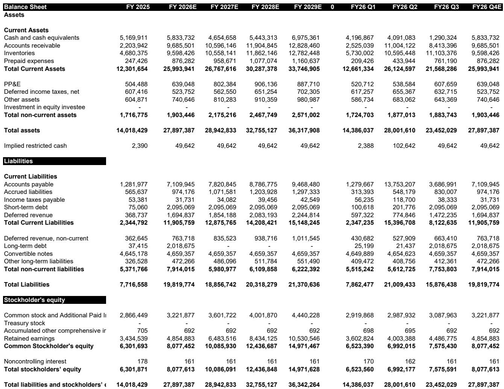
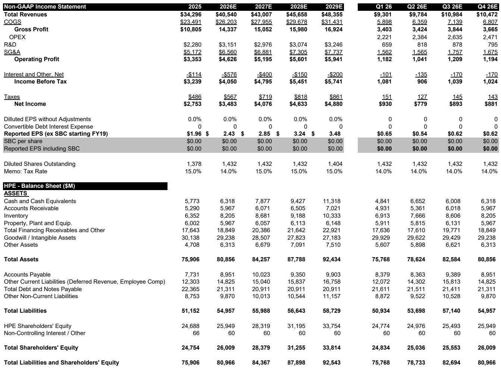

# 市场真正低估的不是AI训练，而是Agentic AI对传统服务器的需求重构

当市场还在争论GPU集群的采购节奏时，一份来自某外资投行的最新研报揭示了一个被广泛忽视的结构性变化：Agentic AI正在显著提升CPU服务器的需求强度，而这可能意味着传统服务器市场的总规模将在2030年前扩张至当前的2.5到4.5倍。这不是一个边缘判断。如果这一趋势成立，那么当前市场对戴尔、慧与等传统服务器OEM的定价，可能系统性低估了它们的长期增长中枢。

这份报告的核心主张并非来自对AI训练的乐观情绪，而是来自对AI推理工作负载性质变化的深度拆解。报告认为，Agentic AI的推理过程远比简单的聊天机器人复杂——它涉及多步骤任务执行、工具调用、检索、路由、内存管理、验证循环以及大量数据移动。这些功能对通用计算和编排能力的需求远高于对纯GPU算力的依赖。换言之，Agentic AI的兴起正在将CPU服务器从“配角”推向前台。

这一判断对服务器OEM的竞争格局意味着什么？报告给出了清晰的答案：戴尔是最明确的受益者，慧与也将受益，而超微电脑则面临合规问题带来的份额流失风险。以下是我们从这份研报中提炼出的五个关键洞察。

## 1. Agentic AI正在改变推理工作负载的算力结构，CPU需求可能迎来数倍增长

传统认知中，AI基础设施的投资主要集中在GPU集群上，CPU服务器更多被视为企业IT更新的周期性业务。但这份报告指出，随着Agentic AI的规模化部署，这一认知正在被颠覆。

研报引用了三家CPU厂商的最新表态。AMD在2026年第一季度财报电话会议上，将其服务器CPU市场的年复合增长率预期从18%大幅上调至超过35%，预计2030年市场规模将超过1200亿美元。Intel在同一季度指出，推理场景中CPU与GPU的比例已从1:8压缩到1:4，并可能向1:1甚至更优的方向发展。Arm的CEO则更加直接：一个典型的AI数据中心目前每吉瓦容量需要约3000万CPU核心，而在Agentic工作负载下，这一数字将升至约1.2亿核心。

这些数据叠加在一起，意味着传统服务器市场的总规模可能从2025年的约2130亿美元，扩张到2030年的5000至9550亿美元。研报给出的两个情景——CPU占传统服务器ASP的20%-25%假设下的2.5倍扩张，以及35%年复合增长率下的4.5倍扩张——都指向一个方向：传统服务器不再是“旧经济”，而是AI基础设施的下一个增长引擎。

对投资者而言，这意味着需要重新审视服务器OEM的收入结构和增长预期。如果CPU服务器需求在Agentic AI驱动下进入结构性上升通道，那么戴尔和慧与的估值逻辑可能需要从“周期股”切换到“成长股”。

## 2. 超微电脑的合规风险正在加速份额向戴尔和慧与转移

研报对超微电脑的判断是审慎的。尽管其在2026财年第三季度实现了EPS超预期，但这份“好业绩”背后隐藏着让投资者不安的信号。

关键变化在于收入结构的异动。超微电脑的AI服务器占比在连续10个季度上升后首次下降，从上一季度的90%降至80%。与此同时，企业客户占比从16%升至28%，数据中心客户占比从84%降至72%。表面上看，这带来了毛利率的改善——从6.4%反弹至10.1%。但研报认为，这种“改善”恰恰削弱了超微电脑的核心投资逻辑：AI服务器需求强劲且集中于大型数据中心客户。当这两个支柱同时软化时，超微电脑的业绩“beat”反而成为风险信号。

更关键的是合规问题。报告提到，超微电脑近期面临的走私指控等声誉风险，正在导致云、企业和主权客户重新评估供应商风险。研报援引了彭博今年2月的报道：xAI（原超微电脑客户）正在与戴尔谈判一笔超过50亿美元的服务器订单。如果这一趋势延续，超微电脑在2026财年第四季度及之后将面临更严峻的挑战。

研报给出的判断是：超微电脑的合规问题创造了一个真实的份额转移机会，而戴尔凭借规模优势、融资能力和客户关系，最有能力吸收这部分流失的需求。

## 3. 戴尔是AI基础设施投资中最被低估的赢家

在研报覆盖的三家公司中，戴尔被明确标记为“最偏好的受益者”。分析师将戴尔的估值倍数从14倍FY28 EPS上调至17倍，目标价从220美元上调至280美元，维持跑赢大市评级。

这一判断基于三个支撑点。第一，戴尔在传统服务器领域的领先地位使其能够直接受益于Agentic AI驱动的CPU需求上升。第二，戴尔在云、企业和主权账户中的深度客户关系，使其能够有效承接超微电脑流失的订单。第三，戴尔的融资能力和大规模AI基础设施部署经验，构成了竞争对手难以复制的壁垒。

研报特别指出，戴尔在二级云服务商（tier-2 CSP）中的成功，是慧与尚未企及的优势。这意味着戴尔不仅在传统企业市场有优势，在AI原生客户群体中也建立了竞争门槛。

从估值角度看，17倍FY28 EPS对应约280美元的目标价，隐含约19%的上行空间。但更值得关注的是，如果传统服务器市场真的如报告所预测的那样进入结构性增长轨道，戴尔的长期估值中枢可能还有进一步上移的空间。

## 4. 慧与也能受益，但幅度和确定性弱于戴尔

慧与同样被研报视为传统服务器需求回升和份额转移的受益者。分析师将慧与的估值倍数从8倍FY27 EPS上调至12.5倍，目标价从21美元上调至35美元，维持市场表现评级。

但慧与的故事有两个限制。第一，它在二级云服务商中的参与度不如戴尔，这意味着它在新兴AI客户群体中的增长弹性可能较低。第二，慧与的融资能力相对有限，在需要大规模资本支持的超大规模部署场景中，竞争力不如戴尔。

研报对慧与的判断是：它将在企业和主权账户中获得增量份额，但整体受益幅度和确定性都不及戴尔。12.5倍的估值倍数虽然较之前有显著提升，但相比戴尔的17倍仍有差距，这反映了市场对两者竞争地位差异的认知。

## 5. 报告尚未完全回答的关键问题：CPU服务器需求的可持续性与利润结构

尽管研报对传统服务器市场的前景给出了令人信服的论证，但仍有几个关键问题需要进一步验证。

第一个问题是CPU服务器需求的可持续性。研报引用的CPU厂商指引和Agentic AI工作负载分析，更多是需求端的“信号”而非“数据”。传统服务器市场在2025年达到2130亿美元，但其中有多少是AI驱动的新增需求，多少是正常的更新周期需求？研报没有给出明确的拆分。如果相当一部分增长来自企业IT的周期性复苏而非结构性AI需求，那么2.5-4.5倍的扩张假设可能需要下调。

第二个问题是利润结构。研报指出，AI服务器的毛利率通常低于传统服务器，因为组件成本更高。这意味着传统服务器占比上升对OEM的利润率是正面因素。但问题在于，随着传统服务器需求增长，竞争是否会加剧，从而压缩利润率？研报没有深入讨论这一点。

第三个问题是超微电脑的份额流失速度。研报认为合规风险将导致客户流失，但这一过程需要多长时间？客户是否会在短期内完成切换，还是会逐步分散采购？研报的假设更倾向于前者，但实际情况可能更为复杂。

这些未解问题并不削弱研报的核心判断，但它们提示我们：在做出投资决策前，需要更深入地理解需求结构和竞争动态的演变路径。

---

这份研报提供了一个清晰的观察框架：Agentic AI正在重构服务器市场的需求结构，传统CPU服务器不再是“旧经济”的代名词。在这个结构性变化中，戴尔是最明确的受益者，慧与也将受益，而超微电脑面临的挑战可能比市场预期的更深远。

但正如我们上面所讨论的，有几个关键假设仍需验证：CPU服务器需求的可持续性、利润结构的变化、以及份额转移的速度。这些问题在研报中有所涉及，但没有完全展开。如果你希望看到更详细的数据拆解、敏感性分析以及我们对这些未解问题的进一步推演，欢迎来星球微信群里继续讨论。我们会在社群中分享完整的研报解读与原始图表，并与大家一起追踪这些关键变量的变化。

Personal reading notes and learning share only. Not investment advice.

