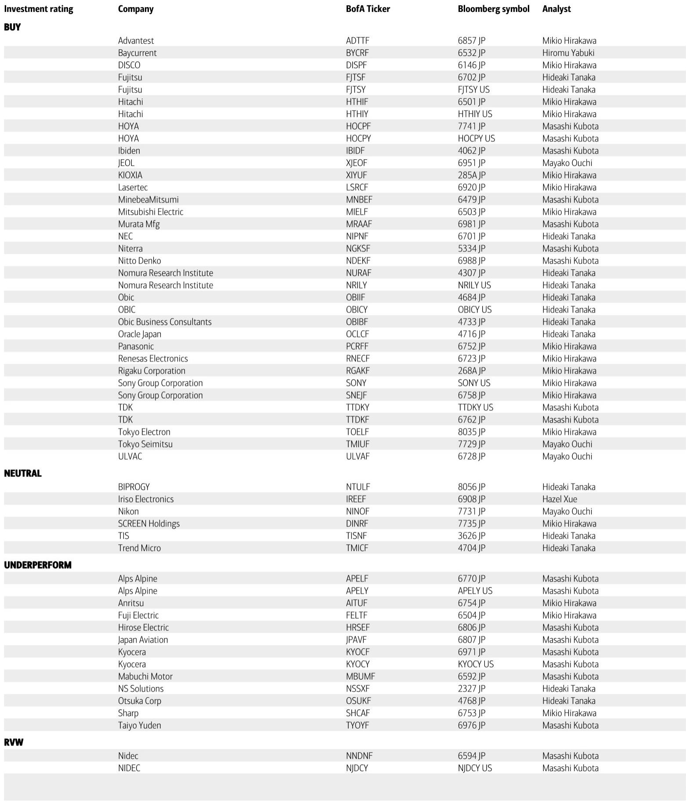
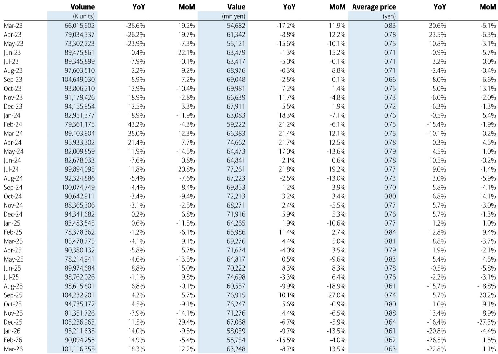
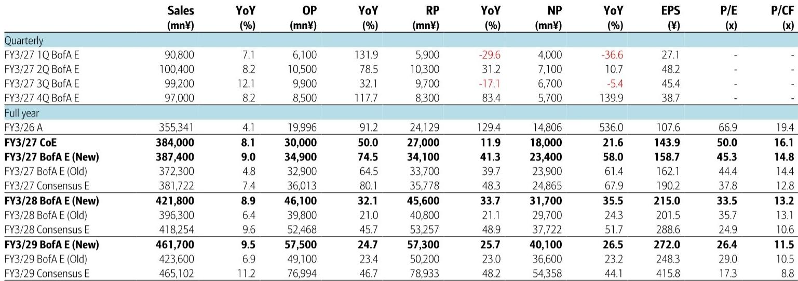

# The MLCC Market Is Splitting Into Two Tiers, and Only the Right Exposure Will Deliver Alpha

The global multi-layer ceramic capacitor market is no longer a single, homogeneous cycle. For the past eighteen months, investors have treated Japanese MLCC makers as a correlated group, assuming that rising AI server demand would lift all boats. That assumption is now breaking down. The data for March 2026 reveals a market that is diverging sharply along product mix, end-market exposure, and manufacturing efficiency. Production volume surged 18 percent year-over-year, yet average selling prices dropped 23 percent—the third consecutive month of severe ASP compression. This is not a contradiction; it is the signature of a market where high-end, high-value products are scaling rapidly while commoditized IT components are being front-loaded and discounted. The investment implication is clear: the winners will be those with the most exposure to AI server and high-capacitance demand, the strongest front-end utilization rates, and the discipline to avoid pricing wars. The losers will be those whose share prices already discount price increases that management has publicly denied. A global investment bank report on the sector makes precisely this distinction, maintaining Buy ratings on Murata Manufacturing and TDK while reiterating an Underperform on Taiyo Yuden despite raising its price objective. The report, published in mid-May 2026, provides a strategic lens for understanding why this divergence will widen.

The timing matters. The first quarter of 2026 saw the book-to-bill ratio for major Japanese MLCC makers exceed 1.3, a level that historically signals tightening supply-demand dynamics and improving production value in subsequent quarters. Yet the composition of that demand is shifting beneath the surface. Orders for AI servers continue to expand, but a significant portion of the recent order surge in the IT equipment market reflects front-loaded buying driven by concerns over future price increases and material shortages. This is not organic demand; it is inventory pre-positioning. As a result, the product mix has deteriorated, pulling down blended ASPs even as factories run at higher utilization rates. The report argues that a reactionary decline in IT equipment orders is likely in the April-to-June period, but that this will be offset by rising production volumes of small, high-capacitance and high-voltage products for AI servers. The net effect is a market that looks healthier in aggregate but is becoming far more selective in its profit pools.

Investors who treat MLCC as a single-cycle trade are missing the structural shift. The following sections unpack the strategic logic behind the divergent ratings, the unresolved questions the report leaves open, and a decision framework for navigating the coming quarters.

## The Product Mix Deterioration Is Not a Demand Problem; It Is a Composition Problem That Favors the Diversified Players

The headline numbers from the March 2026 METI statistics are unsettling at first glance. Production value declined 9 percent year-over-year. ASPs fell 23 percent year-over-year, marking the third consecutive month of double-digit declines. But production volume increased 18 percent year-over-year and 12 percent month-over-month. These three data points, taken together, tell a story of volume growth overwhelming value growth—a classic sign that the mix is tilting toward lower-priced, lower-margin products. The report attributes this to front-loaded orders in the IT equipment market, where customers are stockpiling standard capacitors to hedge against potential supply constraints or price increases. This is a temporary pull-forward of demand, not a structural expansion. The danger is that when the pre-buying subsides, the volume surge will reverse, leaving manufacturers with excess inventory of commoditized parts and no pricing power.

For diversified players like Murata and TDK, this dynamic is manageable. Their revenue bases extend well beyond standard IT capacitors. Murata derives significant revenue from high-frequency modules, sensors, and connectivity components. TDK has a strong presence in batteries and HDD-related components. The MLCC segment for both companies is increasingly weighted toward the high-end products that serve AI server, data center, and automotive applications. These are the products where utilization rates are rising, particularly in front-end processes, and where pricing remains stable or improving. The report explicitly states that for Murata, mix improvement and stabilization in MLCC ASP should lead to steady profitability improvement. For TDK, MLCC and inductor demand for AI servers is expected to expand from the second half of the fiscal year onward, complementing solid battery performance and HDD component expansion.

The contrast with Taiyo Yuden is instructive. The report raises its earnings forecasts for Taiyo Yuden in line with expanding MLCC orders and lifts the price objective from 3,250 yen to 3,800 yen. Yet it reiterates an Underperform rating. The rationale is twofold. First, the report believes that excessive expectations for MLCC price increases are already reflected in the share price, and that domestic MLCC makers have denied price hikes based solely on supply-demand dynamics. Second, Taiyo Yuden's MLCC operating profit margin remains in the single digits due to weak productivity. The implication is that even if order volumes rise, the company lacks the operational leverage to convert that volume into proportional profit growth. The current share price, at 7,194 yen as of May 19, implies significant downside from the new price objective of 3,800 yen. This is not a value gap; it is a valuation disconnect.

## The Book-to-Bill Ratio Above 1.3 Signals a Tighter Market, but the Tightness Is Concentrated in Specific Processes and Products

The report notes that the book-to-bill ratio of major MLCC makers exceeded 1.3 in the January-to-March 2026 period. In normal semiconductor and component cycles, a BB ratio above 1.0 for a sustained period signals that demand is outpacing supply, which typically leads to higher production values and firmer pricing in the following quarters. The report expects production value from April to June to improve, and it is reasonable to anticipate that the supply-demand balance will tighten further as AI server demand continues to scale.

However, the BB ratio is an aggregate metric that masks significant variation across product categories and manufacturing stages. The tightening is occurring primarily in front-end processes for small, high-capacitance, and high-voltage products. These are the components used in AI server power management, data center networking, and high-performance computing. They require advanced manufacturing techniques, finer tolerances, and higher yields. Not every MLCC maker has equal exposure to these products, and not every factory can ramp production quickly without compromising quality or cost. The report suggests that utilization rates are rising, particularly in front-end processes, which implies that the capacity for high-end products is approaching its effective limit. This is a positive pricing signal for the companies that dominate that segment, but it does not necessarily translate into pricing power for standard capacitors used in consumer electronics and legacy IT equipment.

The question investors should ask is not whether the MLCC market is tightening, but where the tightness is occurring and which companies are best positioned to capture the value. The report's answer is clear: Murata and TDK have the product mix, the customer relationships, and the manufacturing scale to benefit. Taiyo Yuden, despite order growth, lacks the margin structure to turn that growth into sustainable earnings momentum.

## The Report Raises a Critical Unresolved Question: How Much of the Current Order Momentum Is Sustainable, and How Much Is Inventory Building That Will Reverse?

This is the analytical gap that the report does not fully close, and it is the most important question for investors to monitor. The report acknowledges that front-loaded orders, mainly for the IT equipment market, could lead to a reactionary decline. It expects that decline to be offset by rising AI server demand. But it does not quantify the magnitude of the potential reversal, nor does it model a scenario in which the inventory correction is deeper or longer than expected.

The risk is that the current wave of pre-buying is not limited to standard IT capacitors. If customers are also front-loading orders for higher-end components to secure supply, the apparent strength in AI server-related orders could be partially inflated. When the inventory destocking begins, it could coincide with a seasonal slowdown in the second half of the calendar year, creating a double drag. The report's base case assumes a smooth transition from front-loaded IT orders to sustainable AI server demand. But the data on ASPs suggests that the market is already struggling to maintain pricing discipline in the face of volume surges. A sharper-than-expected correction in orders would put further pressure on margins, especially for companies with high exposure to commoditized products.

This unresolved question is not a flaw in the report; it is a recognition that the next six months will be a test of the market's true demand profile. Investors who want to position for the upside should focus on companies with the strongest balance sheets and the most diversified revenue streams, because they are best equipped to absorb a temporary demand shock. Those who are betting on a pure MLCC recovery should be prepared for volatility.

## A Decision Framework for Investors: Three Filters to Separate the Structural Winners from the Cyclical Plays

Based on the report's logic and the available data, investors can use a three-part framework to evaluate MLCC exposure. First, assess product mix concentration. Companies that derive a high percentage of MLCC revenue from standard IT and consumer electronics capacitors are more vulnerable to ASP erosion and order reversals. Companies with significant exposure to AI server, automotive, and industrial high-capacitance products have a structural advantage. Second, evaluate operating margin trajectory relative to volume growth. If volume is growing but operating margins remain in the single digits, the company lacks pricing power and manufacturing efficiency. The market may be pricing in a margin expansion that the fundamentals do not support. Third, compare the current share price to the price objective implied by fundamental earnings estimates. If the share price is significantly above the price objective, as is the case with Taiyo Yuden, the market is discounting outcomes that management has not confirmed and that the data does not yet support.

This framework leads to a clear conclusion. Murata and TDK pass all three filters: they have favorable product mix, improving or stable margins, and share prices that are within or below the range justified by earnings estimates. Taiyo Yuden fails on all three: its mix is more exposed to standard products, its MLCC operating margin is in the single digits, and its share price trades well above the revised price objective. The report's ratings are consistent with this framework, and investors should use it as a guide for their own analysis.

## The Full Report Contains the Charts and Data That Make This Divergence Visible

The analysis above is based on the key arguments and data points from the report, but the full document contains detailed exhibits that make the divergence between volume, value, and ASP trends immediately visible. The time series data on production volume, production value, and average selling price from March 2023 through March 2026 shows exactly when the ASP compression began to accelerate and how it relates to the volume surge. The earnings estimates for Murata, TDK, and Taiyo Yuden provide a multi-year outlook that reveals the scale of the margin gap between the companies. The price objective changes and the rationale for each rating are laid out with specific financial targets.

Join the community to read the full report and review the original charts. The data behind these conclusions is essential for any investor who wants to build conviction around the MLCC thesis, and the original exhibits provide the granularity that a summary cannot capture.

*This article is for learning and discussion only and does not constitute investment advice.*

Personal reading notes and learning share only. Not investment advice.

