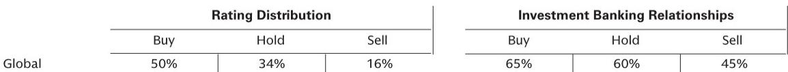

# 市场低估了AI基础设施的“Token工厂”模式，而非算力租赁本身

过去六个月，关于AI算力基础设施的讨论几乎都围绕着同一个问题：GPU到底够不够用。云厂商的资本开支指引、芯片供应链的产能瓶颈、以及层出不穷的“算力荒”叙事，让绝大多数投资者将注意力集中在“谁拥有更多GPU”这个单一维度上。

某外资投行近期在香港举办的亚洲科技与通信大会上，一家名为Phancy（第四范式）的公司给出了一个值得深思的答案。这家被该投行标记为“未覆盖”的企业，在其管理层交流中透露了一个关键信号：市场真正的结构性变化，并不在于GPU的绝对数量，而在于如何让每一块GPU产生更高的经济产出。

Phancy的核心业务——Token工厂——正在以远超公司其他业务板块的速度增长。这不是简单的算力转售，而是一套从计算资源采购、GPU虚拟化管理、模型部署到API输出的端到端解决方案。管理层预计，未来5到10年计算资源将持续紧张，而能够提供完整价值链的企业将比单纯出租算力的公司更具竞争优势。

这一判断的潜台词是：AI基础设施的定价权正在从“硬件拥有者”向“资源调度者”转移。报告没有明说，但我们可以推导出一个更重要的结论——市场对AI基础设施的估值框架可能需要重构。传统上，GPU集群的估值逻辑类似于数据中心或芯片公司，核心指标是算力规模、利用率、以及单位算力成本。但Token工厂模式的出现，意味着收入模式从“卖算力”转向“卖API调用”，从一次性合同转向按token计费的持续收入流。

这种转变对估值的影响是深远的。如果Token工厂能够实现更高的GPU利用率（Phancy声称其vGPU技术可以将利用率从行业的10%提升至40-60%），那么单位GPU的经济产出将显著高于同行。更关键的是，API服务模式天然具有更高的客户粘性和更低的获客成本——客户一旦将模型部署在平台上，迁移成本就会大幅上升。

但这份报告的价值不仅仅在于描述了一家公司的业务亮点。它提供了一个观察整个AI基础设施产业链的新框架。以下，我们沿着这份报告的线索，拆解出几个值得深入思考的结构性判断。

## 1. 算力短缺的真正赢家，不是拥有GPU最多的人，而是调度效率最高的人

Phancy管理层的核心论点之一是：GPU利用率低是行业普遍痛点。在异构计算环境下，行业平均利用率仅约10%。这意味着，绝大多数GPU资源处于“算力闲置但电力消耗”的状态。Phancy的vGPU技术通过虚拟化手段，将内存与算力进行更精准的匹配与调度，使利用率提升至40-60%。

这个数字如果被验证为可持续，其商业含义是：同样一块A100或H100，Phancy可以产生4到6倍于行业平均的算力输出。在算力供给持续紧张、芯片采购成本居高不下的背景下，这种效率优势直接转化为成本结构和定价能力的差异。

报告没有展开讨论的是，这种效率提升对行业竞争格局的二阶影响。如果一家公司能够将GPU利用率从10%提升到50%，它实际上相当于在没有额外芯片采购的情况下，将有效算力供给扩大了5倍。这意味着，在同等资本开支下，它可以服务更多的客户、承载更大的模型、或者以更低的价格抢占市场。

对于投资者而言，这意味着评估AI基础设施公司时，不能只看“有多少张卡”，而要看“每张卡能产生多少收入”。这听起来简单，但现行的估值模型很少将GPU利用率作为一个独立的驱动变量。报告虽然没有给出Phancy的具体财务数据，但管理层对利用率的强调，暗示了这一指标可能是未来竞争差异化的核心。

## 2. “Token工厂”不只是算力租赁，它重新定义了AI基础设施的商业模式

Phancy的Token工厂业务被描述为“端到端解决方案”，从计算资源采购、GPU管理、模型部署到API输出。这与市场上常见的“算力租赁”或“云GPU”模式有本质区别。

算力租赁的商业模式本质上是资源转售——客户租用GPU时间，自行管理模型部署与运维。这种模式下，供应商的差异化空间有限，竞争主要围绕价格和可用性展开。而Token工厂模式将价值主张从“给你算力”升级为“给你结果”。客户不需要关心底层用了多少张卡、如何调度、如何优化，只需要调用API，按token付费。

这种模式的优势在于：第一，客户粘性更高。一旦客户将模型推理或训练流程集成到Token工厂的API中，迁移成本就不仅仅是重新配置算力，而是重新适配整个模型部署管线。第二，收入可预测性更强。按token计费意味着收入与客户的实际使用量挂钩，而非预付费的固定合同，这更接近SaaS的收入模型，也更容易获得更高的估值倍数。

报告没有明确说，但我们可以推断：如果Token工厂模式被验证为可行，它将对现有的云服务商形成一种“从内部瓦解”式的竞争。传统云厂商的AI基础设施业务往往以虚拟机或裸金属服务器形式提供，而Token工厂直接在其上层构建了一层抽象，让客户完全不需要接触底层基础设施。这实际上是在云服务商和客户之间插入了一个新的中间层。

当然，这种模式也有其风险。报告没有讨论的是，Token工厂对上游云厂商或芯片供应商的依赖程度。如果Phancy的底层算力完全来自第三方云服务商，那么其成本结构将受制于上游定价。但管理层强调的“从计算资源采购到API服务”的端到端能力，暗示他们可能同时拥有自建算力和第三方算力，这种混合架构可能是应对上游风险的关键。

## 3. 报告没有完全回答的关键问题：vGPU技术的护城河有多深？

Phancy管理层的自信很大程度上建立在其vGPU技术之上。但报告对这项技术的描述停留在定性层面：通过虚拟化实现内存与算力的精准匹配，将利用率从10%提升至40-60%。这里有几个关键问题没有被回答。

首先，这项技术的可复制性如何？GPU虚拟化并非Phancy独有，NVIDIA自身就提供了MIG（多实例GPU）技术，AWS、Azure等云厂商也有各自的GPU池化方案。Phancy的vGPU在性能、兼容性、以及支持芯片种类上的差异，报告没有提供足够的数据来评估。

其次，40-60%的利用率是在什么场景下实现的？是训练场景还是推理场景？是大模型还是小模型？异构计算环境的具体构成是什么？这些细节决定了这项技术是否具有普适性，还是只适用于特定类型的客户工作负载。

第三，这项技术的边际收益是否会递减？当利用率从10%提升到40%时，收益可能非常显著。但从40%提升到60%，或者从60%提升到80%，难度和成本可能呈指数级上升。报告没有讨论Phancy的技术是否已经触及性能天花板，或者未来还有多大的提升空间。

这些未解问题并不否定Phancy的商业逻辑，但它们意味着，投资者在评估这家公司时，需要更多独立验证的数据。vGPU技术究竟是真正的护城河，还是行业发展到一定阶段后会被通用方案取代的过渡技术，目前仍是一个开放性问题。

## 4. 从Phancy看商汤：“AI+”政策如何改变企业软件预算的分配

报告在“Read across”部分特别提到了商汤科技，认为Phancy管理层对Token需求的乐观看法，与商汤面临的机遇是一致的。核心逻辑是：国务院推出的“AI+”政策，正在推动企业软件预算从“功能型工具”向“生成式AI软件”转移。

这一判断值得深入思考。企业软件预算的分配，本质上反映了企业对技术投入的优先级判断。过去二十年，企业软件预算的主要流向是ERP、CRM、办公协作等“流程型”工具。这些工具的核心价值是“自动化”——将已有的业务流程数字化、标准化。而生成式AI软件的核心价值是“增强”——让机器能够生成内容、代码、决策建议，从而扩展人类的能力边界。

如果“AI+”政策确实加速了这种预算转移，那么受益的将不仅仅是商汤或Phancy这样的AI平台公司，还包括所有能够将生成式AI嵌入企业工作流的SaaS厂商。但报告也隐含了一个风险：预算转移的速度和幅度，取决于企业对生成式AI的实际ROI认知。目前，很多企业仍在探索阶段，大规模预算转移可能需要更明确的成功案例来催化。

对于商汤而言，报告提到的“基础模型和AIDC租赁收入”是直接受益的。但更值得关注的是，如果Token工厂模式被证明是更高效的交付方式，商汤是否需要调整其商业模式？目前商汤的收入结构中，AIDC租赁仍占据较大比重，而Token工厂式的API服务占比相对较小。这可能是未来需要跟踪的结构性变化。

## 5. 一个观察框架：如何评估AI基础设施公司的真正价值

基于以上分析，我们可以提炼出一个评估AI基础设施公司的简化框架。这个框架由三个维度组成：

第一个维度是“算力效率”。核心指标不是GPU数量，而是单位GPU的利用率、以及每张卡产生的收入。如果一家公司能够持续证明其利用率高于行业平均水平，并且这种优势不是通过过度投资或低价策略获得的，那么它可能拥有真正的技术壁垒。

第二个维度是“商业模式深度”。从“卖算力”到“卖API”的跃迁，对应的是客户粘性、收入可预测性和估值倍数的全面提升。评估时，需要看API收入占总收入的比例、客户续约率、以及平均合同金额的变化趋势。

第三个维度是“生态位防御性”。AI基础设施的竞争格局正在快速演变，芯片厂商、云服务商、以及独立软件公司都在争夺同一块市场。一家公司能否在巨头环伺中找到自己的生态位，取决于它是否解决了巨头不愿意或无法解决的问题。Phancy的vGPU技术如果确实能够显著提升异构计算效率，那么它就填补了一个巨头尚未充分覆盖的空白。

这个框架当然不完美，但它提供了一个比“有多少张H100”更结构化的思考方向。报告本身没有给出这样的框架，但我们可以从它的逻辑中推导出来。

## 6. 顺着未解问题继续

这份报告最有价值的地方，不在于它提供了多少确定性结论，而在于它暴露了市场认知中的几个盲区。GPU利用率这个指标，在大多数AI基础设施的研究中被严重低估；Token工厂这种商业模式，可能正在重新定义算力的定价方式；而vGPU技术究竟是护城河还是过渡方案，目前仍缺乏足够的数据来判断。

这些未解问题，恰恰是深入研究最有价值的方向。如果你对Phancy的vGPU技术细节、Token工厂的财务模型、或者“AI+”政策对预算分配的具体影响感兴趣，欢迎来我们的星球微信群里继续讨论。我们会定期分享对这类结构性问题的深度分析，以及原始报告中的关键图表和数据。在这里，我们不做推荐，只做拆解。

Personal reading notes and learning share only. Not investment advice.

