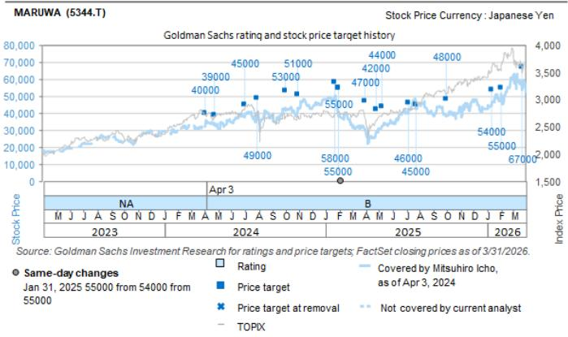
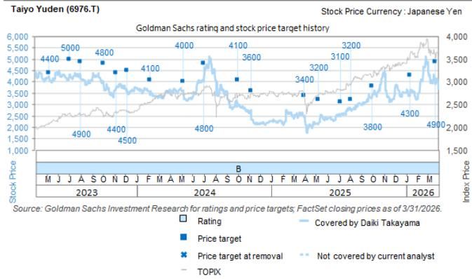
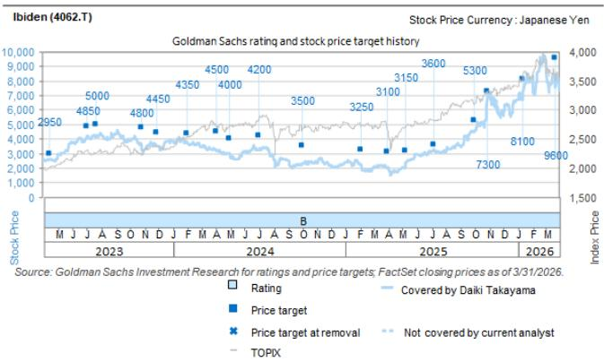

# NVIDIA's Latest Results Confirm That Japan's AI Supply Chain Is Entering a Structural Growth Phase, Not a Cyclical One

The market's immediate reaction to NVIDIA's May 21 earnings release was muted — shares slipped roughly 1.2% in after-hours trading. But that surface-level response masks a far more consequential signal for investors focused on the Japanese electronics and semiconductor ecosystem. The numbers themselves were exceptional: first-quarter revenue of $81.6 billion exceeded guidance midpoint by nearly 5%, and second-quarter guidance of $91.0 billion came in well above consensus expectations of $86.3 billion. This marks the 15th consecutive quarter of revenue growth for the company that sits at the center of the artificial intelligence infrastructure buildout. For the Japanese supply chain, the implications are not merely about another quarter of demand. They represent a fundamental re-rating of the growth trajectory for several key players.

What makes this moment different from previous technology cycles is the combination of three factors that have simultaneously shifted. First, the scale of investment has moved beyond experimental budgets into multi-year capital allocation programs at hyperscalers. Second, the product cycle is accelerating — Vera Rubin is now expected to enter production shipment in the second half of this year, a timeline that has moved forward from the third quarter. Third, and most critically for Japan's component makers, the demand is spreading beyond the core GPU into a broader ecosystem of supporting technologies. NVIDIA's commentary about nearly $20 billion in stand-alone CPU sales visibility this year, and the opening of a $200 billion market with the Vera CPU, signals that the AI infrastructure buildout is becoming more diversified in its component requirements.

The strategic question for investors is no longer whether AI demand is real. It is which companies in the Japanese supply chain have the capacity, the technology roadmaps, and the pricing power to capture disproportionate value from this structural wave. The report from a global investment bank highlights four companies that appear to be in precisely that position: Ibiden, Murata Manufacturing, Taiyo Yuden, Renesas Electronics, and MARUWA. Each offers a different exposure to the AI theme, and each faces a distinct set of risks. But taken together, they represent a portfolio-level thesis about where the value is being created in the AI hardware stack.

## Ibiden's Medium-Term Plan Reveals a Compound Growth Trajectory That Most Investors Are Not Pricing In

Ibiden's full-year results briefing contained a disclosure that deserves close scrutiny. The company laid out a medium-term plan for its electronics business that projects sales of ¥330.0 billion with a 23% operating profit margin for fiscal year ending March 2027, ¥460.0 billion with a 29% margin for FY3/28, and ¥800.0 billion with a 35% margin for FY3/31. To put this in context, the FY3/26 base was ¥243.3 billion in sales at a 19% operating margin. The implied compound annual growth rate from FY3/26 to FY3/31 is approximately 27% — and that is before any further upside from capacity additions.

The critical insight here is not the revenue trajectory alone. It is the margin expansion embedded in the plan. An increase from 19% to 35% operating margins over five years suggests that Ibiden expects significant operating leverage as volumes scale. This is not a commodity story. In the substrate market for advanced packaging, capacity constraints are structural, and pricing power accrues to those who can deliver the required technical specifications. The company's own commentary about needing further capacity increases to meet demand reinforces this interpretation. The operating margin trajectory implies that incremental capacity is being added at higher returns than the existing base, which is characteristic of a market where demand is outstripping supply.

The valuation methodology used in the report — applying a 50% premium to the sector average EV/DACF multiple of 8x — reflects the view that Ibiden's growth and margin profile justify a premium. But the question that investors need to consider is whether the medium-term plan itself is conservative. If the Vera Rubin ramp accelerates beyond current expectations, or if next-generation architectures require even more advanced substrate solutions, Ibiden's capacity constraints could become a bottleneck that drives even higher pricing. Conversely, a roadmap change at a major customer remains the primary risk. The medium-term plan is ambitious, but it is also conditional on the continuation of current technology trends.

## Murata and Taiyo Yuden Are Experiencing a Step-Change in MLCC Demand That Reshapes Their Growth Algorithms

The most striking data point from the recent earnings season may be Murata's revised outlook for MLCC demand in AI servers. The company raised its volume CAGR assumption from +30% to +80%. That is not an incremental adjustment. It is a fundamental reassessment of the role that multilayer ceramic capacitors play in AI server architecture. To understand why this matters, one must recognize that MLCCs are not typically considered a high-growth product category. They are ubiquitous, mature components where growth has historically tracked GDP or semiconductor unit growth. An 80% CAGR changes that calculus entirely.

Murata's response to this demand signal is instructive. The company announced an additional ¥80.0 billion in investment and is now planning to increase capacity by 20-25% in FY3/28, compared to a previous pace of 10%. This acceleration suggests that management sees the AI server opportunity as persistent, not transitory. The economics are also favorable. MLCCs for AI servers command higher margins than commodity MLCCs used in smartphones or consumer electronics. As the mix shifts toward AI applications, Murata's overall profitability should improve.

Taiyo Yuden's assumption of 80% year-on-year growth in AI server sales for FY3/27 reinforces the same theme. Both companies are effectively doubling down on a single application category. The risk, of course, is concentration. If AI server buildout slows — whether due to macroeconomic headwinds, technology shifts, or capacity constraints elsewhere in the supply chain — both companies would face a double impact from lower volumes and potential inventory corrections. But the current data supports the view that we are in the early innings of a multi-year deployment cycle. The question is whether these companies can execute on their capacity expansion plans without margin dilution.

## Renesas Is Supply-Constrained in a Way That Signals Pricing Power, but Execution Risk Is Real

Renesas presents a different kind of opportunity. The company is seeing AI-related revenue double year-on-year, driven by power management ICs for both NVIDIA-related designs and ASIC-related applications. The report notes that Renesas has a 1/3 to 1/2 share in NVIDIA-related PMICs, and that the ASIC-related PMIC business is expanding rapidly. But the most telling phrase in the analysis is that the company is "supply-constrained."

Being supply-constrained in a rapidly growing market is a double-edged sword. On one hand, it confirms that demand is exceeding the company's current capacity, which typically supports pricing power and margin stability. On the other hand, it means that Renesas is leaving revenue on the table. The company's response — enhancing in-house production capacity centered on DC/AI — suggests that management is aware of the bottleneck and is taking steps to address it. But capacity additions take time, and in the interim, competitors may capture share.

The valuation framework used in the report — applying a 50% premium to the sector average EV/DACF multiple — implies confidence in Renesas's ability to resolve its supply constraints and maintain its competitive position. The key risk to monitor is whether the company can execute its capacity expansion without significant cost overruns or quality issues. If Renesas can maintain its market share while adding capacity, the revenue trajectory could surprise to the upside. If execution falters, the premium valuation may prove difficult to justify.

## MARUWA's New Plant Represents a Bet on Capacity-Led Growth That the Market May Be Underappreciating

MARUWA's story is the most idiosyncratic of the group. The company is building a new plant expected to produce mainly for AI applications, with contribution to earnings expected from the second half of this fiscal year. The report assumes rapid growth in sales for this application, with the company-specific factor of capacity expansion contributing on top of market growth. The estimate is for more than double year-on-year growth.

The logic here is straightforward but important. In many component markets, individual company growth is constrained by available capacity. A new plant represents a discrete step-function increase in the ability to serve demand. If the demand is there — and the AI infrastructure buildout suggests it will be — then the capacity expansion becomes a direct driver of revenue acceleration. This is different from a company that is simply riding market growth. MARUWA is adding company-specific catalyst on top of the industry tailwind.

The valuation approach — applying a 12.1x EV/EBITDA multiple derived from the historical correlation between EBITDA margin and the multiple — is conservative in the sense that it does not assume any structural re-rating. But if the new plant delivers on its promise and MARUWA demonstrates sustained high growth, the multiple could expand. The risks are equally specific: lower investment in AI servers, supply chain disruptions, or the emergence of alternative technologies could all undermine the thesis. This is a higher-conviction, higher-risk position within the broader AI supply chain theme.

## What the Report Does Not Fully Address: The Vulnerability of Japan's AI Supply Chain to Technology Shifts and Geopolitical Risk

For all the detail on individual company trajectories, the report leaves several important questions unanswered. The most significant is the vulnerability of these companies to technology shifts in AI architecture. The current generation of AI servers relies on specific substrate technologies, MLCC configurations, and power management architectures. But the technology is evolving rapidly. If NVIDIA or its competitors move to different packaging approaches, or if new cooling technologies change the power delivery requirements, the component specifications could shift in ways that disadvantage current suppliers.

The second unresolved question is geopolitical. Japan's component makers benefit from the current trend toward supply chain diversification away from China. But they also operate in a geopolitical environment where export controls, trade restrictions, and technology transfer rules can change rapidly. The report does not model the impact of a scenario in which access to certain markets or technologies is restricted. For investors with a multi-year horizon, this is a risk that cannot be ignored.

The third open question is about valuation. The report applies premiums to sector average multiples for each company, but it does not explicitly compare these valuations to historical ranges or to global peers. Are Japanese AI supply chain stocks cheap relative to their U.S. counterparts? Or has the market already priced in much of the growth? The answer likely varies by company, but the report does not provide a framework for making that assessment.

## A Decision Framework for Investors Evaluating Japan's AI Supply Chain Exposure

For investors looking to build or adjust positions in this theme, a structured decision framework is essential. The first dimension to evaluate is demand visibility. Companies with direct exposure to NVIDIA's announced product roadmaps — particularly through the Vera Rubin cycle — have higher visibility than those with more indirect exposure. Ibiden and Renesas score highest on this dimension. The second dimension is capacity flexibility. Companies that can add capacity quickly and at attractive margins have an advantage. Murata and MARUWA are well positioned here. The third dimension is technology moat. Companies whose products are difficult to substitute or qualify have stronger pricing power. Ibiden's advanced substrates and Renesas's design wins in PMICs suggest defensible positions.

The fourth dimension is valuation. The report's target prices imply significant upside for all five companies, but the risk-reward profile varies. Ibiden's medium-term plan provides a clear valuation anchor. Murata and Taiyo Yuden offer exposure to a high-growth sub-segment within a mature product category. Renesas offers a pure-play AI semiconductor exposure with a supply-constraint risk. MARUWA offers a higher-risk, higher-reward capacity story. Investors should weight these factors based on their own risk tolerance and time horizon.

The fifth and final dimension is optionality. Which of these companies could benefit from multiple expansion if the AI theme continues to gain momentum? The answer depends on whether the market views them as cyclical component suppliers or structural AI beneficiaries. The evidence from the recent earnings season suggests that a re-rating is underway, but it is not complete. The companies that can demonstrate sustained margin expansion and revenue growth are likely to command higher multiples over time.

## The Unresolved Analytical Questions Point Toward Deeper Research

The most interesting questions that emerge from this analysis cannot be answered with the data available in the report. How sustainable is the 80% MLCC CAGR that Murata has assumed? What happens to substrate pricing when additional capacity comes online across the industry? Can Renesas maintain its market share in PMICs as competition intensifies? These are the questions that separate surface-level understanding from true analytical depth.

For investors who want to explore these questions further, the full report contains detailed financial models, valuation methodologies, and risk analyses for each company. The original charts provide visual context for the growth trajectories and margin expectations that underpin the investment thesis. Understanding the assumptions behind those charts is essential for making informed decisions.

Join the community to read the full report and review the original charts.

*This article is for learning and discussion only and does not constitute investment advice.*

Personal reading notes and learning share only. Not investment advice.

