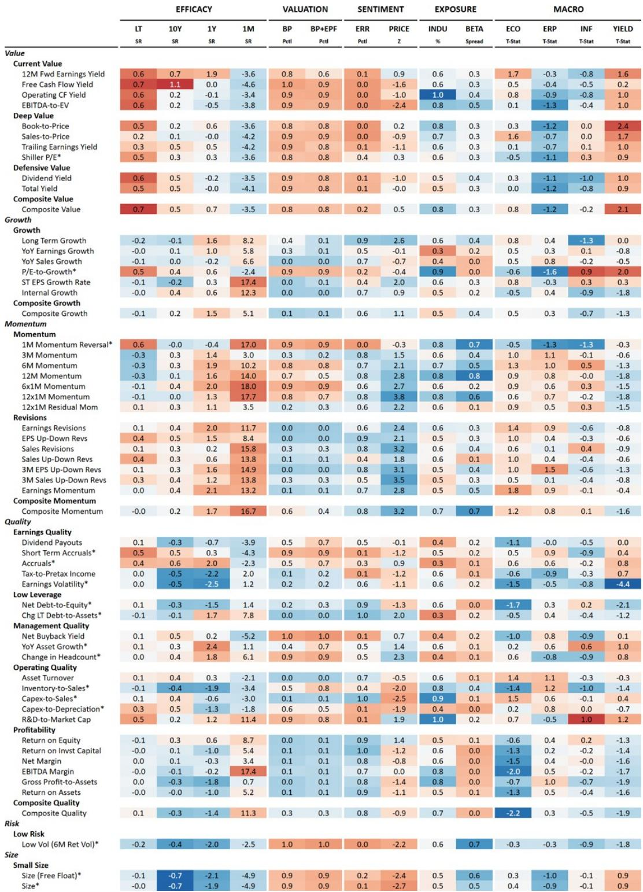
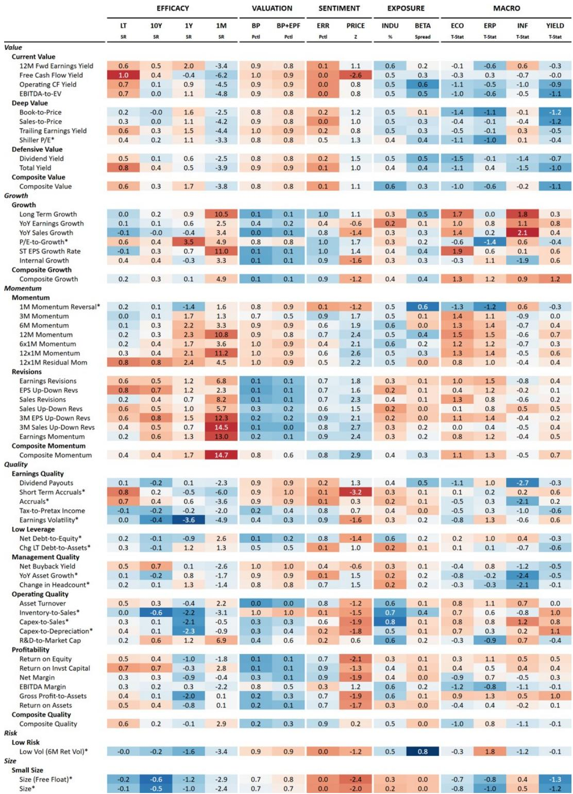
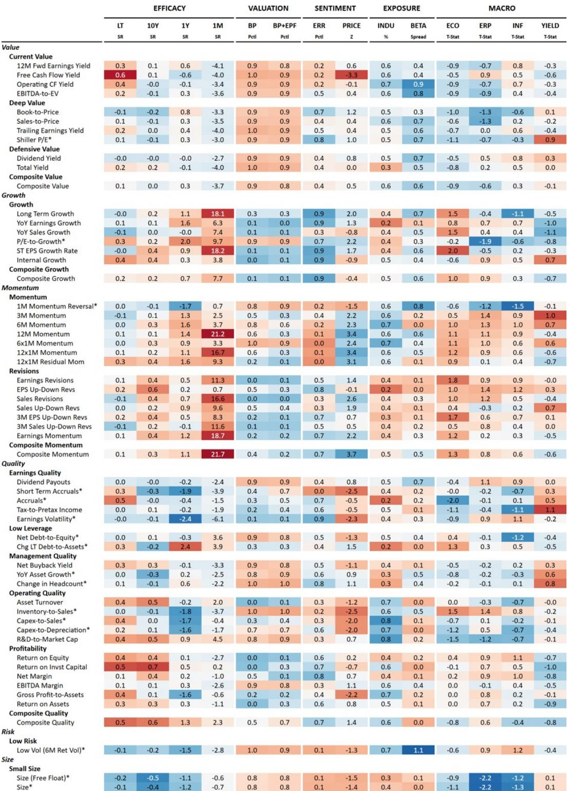

# 市场真正低估的不是AI需求，而是能源波动如何重塑因子定价

2026年过半，发达市场股票投资者正面对一个看似矛盾的局面：AI资本开支以远超预期的速度扩张，能源价格却因地缘冲突频繁制造宏观噪音。两者叠加，市场对“买什么”的共识正在松动。某外资投行最新发布的量化权益中期展望给出了一个值得深思的判断：在AI与能源共同主导的周期里，因子的选择优先级高于区域的选择。换言之，未来12个月决定组合回报的核心变量，不是押注美国还是日本，而是你持有的因子是否匹配这个周期中成本结构、盈利质量和增长可持续性的再定价。

这份报告的核心洞察是：当AI投资周期与能源波动周期交织时，市场会从“贝塔驱动的同涨同跌”转向“因子驱动的结构性分化”。美国、欧洲、日本三个市场虽然整体预期回报接近，但驱动因子完全不同。在AI capex带来的生产力红利与能源成本冲击之间，不同市场的企业暴露程度迥异，这意味着同一个因子在三个市场可能产生截然不同的效果。

报告没有简单给出“买成长”或“买价值”的建议，而是基于宏观情景、通胀环境和油波动率，为每个市场推荐了具体的因子组合。这些推荐背后有一套四维评估框架，涵盖了经济周期、估值、质量和动量。其中最关键的变化是：欧洲的经济周期判断已经从“扩张”调整为“放缓”，这一调整直接重塑了该市场的因子排序。

## 1. 美国市场的核心矛盾不是增长放缓，而是增长质量的分化

在美国，经济学家预测2026年实际GDP增速为2.2%，通胀从3.5%逐步回落，美联储维持利率不变至2027年上半年。这套宏观组合并不差，但报告真正关注的不是总量，而是结构。AI资本开支正在推动企业层面的生产力提升，但能源价格上升同时构成了对消费的“隐性税收”。两股力量叠加的结果是：企业之间盈利能力的差距在拉大。

报告推荐了三个因子：Internal Growth（内部增长率）、Low PEG（低PEG比率）、以及Up vs. Down EPS Revisions（上调与下调盈利修正之比）。这三个因子的共同逻辑是：它们都指向那些能够靠自身盈利和再投资能力实现增长的公司，而不是依赖外部融资或估值扩张。Internal Growth因子通过留存收益率乘以ROE来定义，本质上衡量的是企业“自己养活自己”的能力。报告通过杜邦分解发现，该因子排名前20%的公司不仅在利润率上显著领先，资产周转率也更高，而财务杠杆反而更低——这是一个典型的“高质量内生成长”画像。

更值得注意的是，这三个因子在AI主题上的暴露度均为正。Internal Growth对AI基础设施主题的净暴露度高达0.37，Low PEG为0.18，EPS修正因子为0.20。这意味着推荐因子组合天然贴合了AI投资周期的受益方向，但同时又通过质量和估值约束避免了追逐纯主题炒作的风险。

报告还测试了这些因子在不同油波动率环境下的表现。Internal Growth和Low PEG在高油波动率时期表现尤其突出，分别实现年化7.8%和13.2%的正回报。而EPS修正因子在高波动时期表现较弱，原因是分析师盈利预测往往滞后于能源冲击的初期影响。这提示一个重要的操作含义：在能源不确定性最高的阶段，应该侧重Internal Growth和Low PEG；一旦油波动率趋于正常化，EPS修正因子会重新成为主力。

## 2. 欧洲市场的核心变量不是增长，而是现金流的可见性

欧洲的情况与美国形成鲜明对比。报告将欧洲的经济周期判断从“扩张”下调为“放缓”，这一调整并非无的放矢。欧洲对能源价格变动的传导速度更快、更直接，能源成本上升会更快地侵蚀企业利润率和消费者购买力。在这种环境下，增长本身不再是稀缺资源，现金流的稳定性和资本纪律才是。

报告为欧洲推荐了Operating Cash Flow Yield（经营现金流收益率）、Low YoY Asset Growth（低年度资产增长）以及3-Month Up vs. Down EPS Revisions Breadth（三个月盈利修正广度）。这三个因子共同指向一个核心逻辑：在成本压力上升、需求不确定性加大的阶段，市场会奖励那些能够产生真实现金流、不盲目扩张资产、且盈利预期正在改善的公司。

经营现金流收益率因子在当前欧洲环境下尤为关键。它不同于简单的股息率或自由现金流收益率，而是直接衡量企业主营业务的现金生成能力。当能源成本上升压缩利润时，高经营现金流收益率的公司通常拥有更强的成本转嫁能力或更轻的资产结构。低资产增长因子则是对“过度投资”的惩罚——在经济放缓期，那些仍在高速扩张资产的公司往往面临更高的风险溢价。

报告对欧洲的因子评估框架中有一个值得关注的排名变化：Comp Quality（综合质量）因子排名从第15位进一步下滑至第17位，跌至最差水平。这听起来反直觉，但解释起来并不复杂：在欧洲当前环境下，传统的“高质量”因子（如高ROE、低波动）可能包含了大量能源敏感型公司，而这些公司恰恰是能源冲击的直接受害者。因此，报告没有推荐泛化的质量因子，而是选择了更具体的现金流和资本纪律因子。

## 3. 日本市场的独特逻辑：利率敏感型价值与增长之间的再平衡

日本是三个市场中结构最复杂的。报告推荐了Forward Earnings Yield（远期盈利收益率）、Low PEG和Up vs. Down EPS Revisions。这个组合看似与美国类似，但背后的逻辑完全不同。

在美国，Low PEG是质量成长框架中的估值约束；在日本，Low PEG和远期盈利收益率共同构成了“利率预期下的价值再定价”逻辑。日本央行利率路径的不确定性是当前日本股市最大的宏观变量。如果利率上升过快，高估值成长股会承受压力，而低PEG和盈利收益率因子能够筛选出那些估值与增长匹配度更高的公司。如果利率维持低位，这些因子也不会大幅跑输，因为它们仍然包含了盈利修正的正向动量。

报告特别指出，日本市场的Comp Value（综合价值）因子排名从第2位下滑至第6位，而Comp Growth（综合成长）排名从第11位降至第14位。这意味着纯粹的深度价值和纯粹的成长风格在当前日本市场都面临挑战。真正有效的是在两者之间寻找交集——既有价值支撑、又有增长动力的公司。这正是Low PEG和盈利修正因子的结合点。

日本市场的另一个独特性在于，能源成本对利润率的压力与国内再通胀、结构性资本开支和治理改革同时存在。报告没有给出简单的“买什么行业”的建议，而是通过因子组合来捕捉这些多重力量的净效果。对于投资者而言，这意味着在日本市场不能简单地复制美国或欧洲的因子策略，而需要独立构建以利率和盈利修正为核心的双引擎框架。

## 4. 报告尚未完全回答的关键问题：因子择时的可行性

尽管报告提供了非常系统的因子推荐框架，但有一个关键问题没有完全展开：这些因子推荐是否应该动态调整？报告给出的推荐是基于当前的宏观情景和因子评估，但宏观情景本身是变化的。如果油价格局发生变化，或者AI资本开支的回报率低于预期，因子推荐是否需要同步调整？

报告确实展示了不同油波动率和通胀环境下因子的历史表现，但这更多是“条件验证”而非“择时信号”。对于量化投资者而言，一个尚未被充分回答的问题是：能否构建一个基于实时宏观数据的因子切换规则？例如，当油波动率从75分位数回落至50分位数时，是否应该从侧重Internal Growth转向侧重EPS修正因子？报告提到了这种可能性，但没有给出具体的阈值或触发条件。

另一个未解问题是：AI投资周期的可持续性。报告假设AI capex将继续扩张，但这一假设本身存在不确定性。如果AI生产力红利低于预期，或者监管环境发生变化，当前对AI主题暴露度较高的因子可能会面临回撤。报告中的因子主题暴露分析主要基于历史相关性，而非前瞻性的基本面判断。

## 5. 从因子推荐到组合构建：一个需要谨慎验证的观察框架

对于希望将这份报告转化为可操作策略的读者，以下几个观察维度值得持续跟踪：

第一，关注每个市场的经济周期判断是否变化。欧洲从“扩张”调整为“放缓”是这次报告最重要的判断之一。如果未来美国也被调整为“放缓”，那么美国的因子推荐也需要相应调整，可能从质量成长转向现金流和资本纪律。

第二，关注油波动率的实际路径。报告显示，在高油波动率环境下，Internal Growth和Low PEG表现最佳。如果油波动率持续高企，美国市场的因子推荐应该维持不变；如果迅速回落，EPS修正因子的权重可以适当增加。

第三，验证因子在实际组合中的互补性。报告推荐的每个因子组合内部都存在天然的互补关系：在美国，Internal Growth和Low PEG在油波动冲击期提供保护，EPS修正因子在正常化后发力；在欧洲，经营现金流收益率和低资产增长因子共同约束了能源风险的暴露，盈利修正广度提供额外的向上动量。这种互补性不是巧合，而是报告的四维评估框架精心设计的结果。

第四，对于日本市场，利率路径是最大的不确定因素。报告推荐的价值与增长均衡策略，本质上是在押注利率不会出现极端走势。如果日本央行政策出现超预期变化，这个组合可能需要重新评估。

这份报告的价值不在于给出一个固定的“买入清单”，而在于提供了一个系统化的因子选择框架。它清楚地告诉投资者：在AI和能源共同主导的周期里，不能再用一把尺子量所有市场。每个市场的因子定价逻辑不同，盲目复制跨境策略反而会暴露在未被识别的情景风险中。

报告中还有一些细节值得深入探讨，比如Internal Growth因子的杜邦分解如何在实际选股中应用，欧洲经营现金流收益率因子的行业分布，以及日本Forward Earnings Yield相对于传统价值因子的独特优势。这些内容在完整报告中有更详细的数据支撑和案例分析。

欢迎来星球微信群里继续讨论。群里会定期分享完整研报原文和我们的因子回测结果，也会针对报告中的未解问题——比如因子择时的可行性、AI主题暴露度的时间稳定性——做更深入的专题分享。

Personal reading notes and learning share only. Not investment advice.

