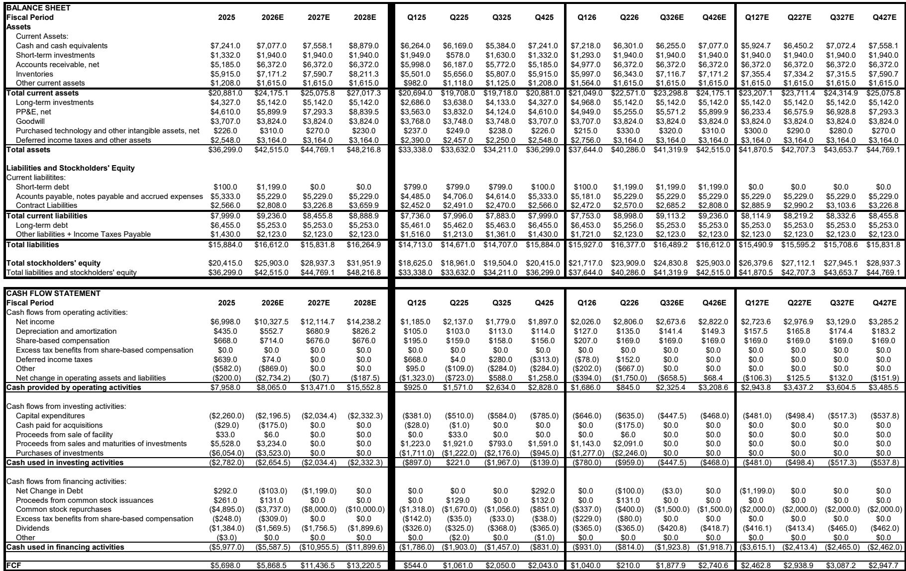
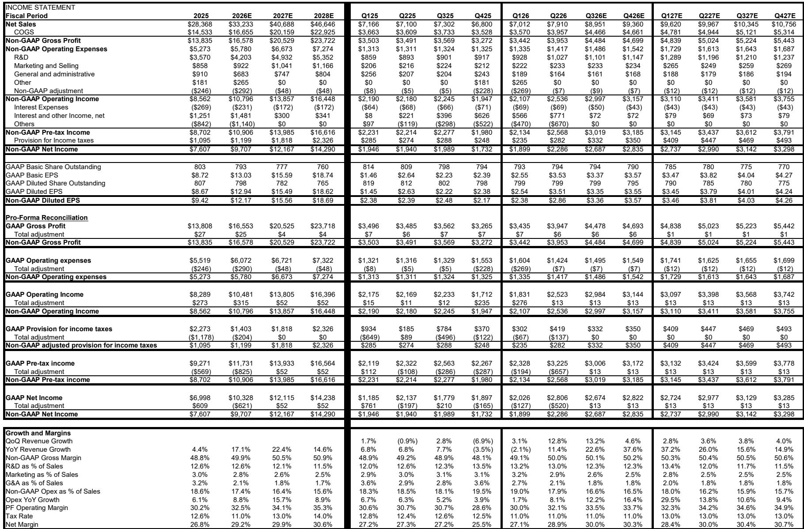
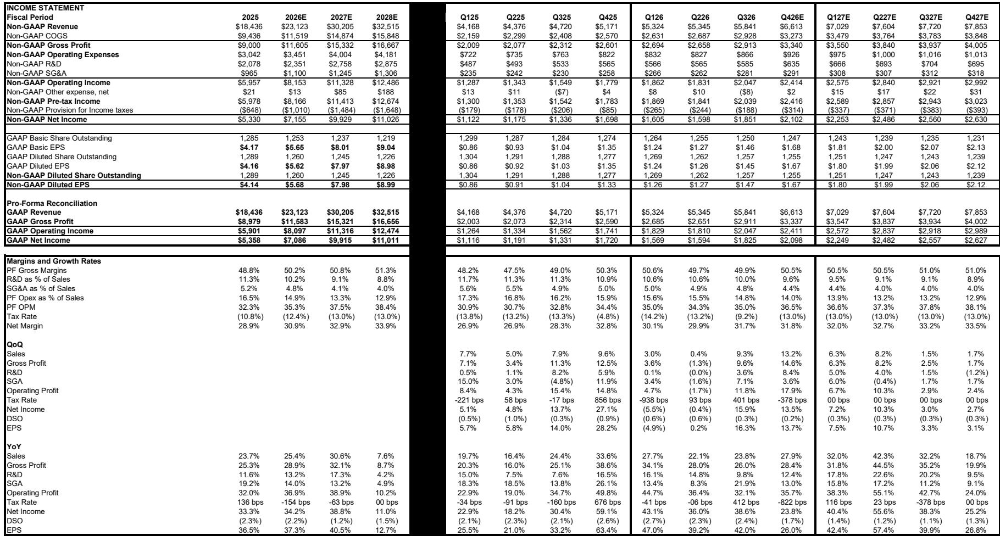

# The Semiconductor Equipment Cycle Is No Longer Cyclical: Why Wafer Fab Equipment Spending Is Heading Toward $200 Billion

The semiconductor capital equipment industry has long been defined by its boom-and-bust rhythm. Investors have been conditioned to expect sharp corrections after every upcycle, and to position accordingly. That framework is now outdated. A global investment bank report has revised its wafer fab equipment (WFE) forecast upward substantially, now projecting $148 billion in 2026, $175 billion in 2027, and approaching $198 billion in 2028. These are not incremental adjustments. The 2028 estimate has been raised by $34 billion from the prior forecast, a revision that signals a structural shift rather than a cyclical uptick.

What is driving this change is not a single factor but a convergence of forces that together argue for a multi-year expansion in equipment spending. Memory manufacturers, particularly in DRAM, are accelerating capacity additions at a pace that exceeds prior expectations. Chinese semiconductor equipment demand is proving far more resilient and expansionary than the market had priced in. And new technology inflections such as gate-all-around transistors, advanced packaging, and high-bandwidth memory are creating incremental equipment intensity that did not exist in prior cycles.

The implication for investors is straightforward but uncomfortable for those trained to sell into strength: the current upcycle may have legs that extend well beyond what valuation multiples alone would suggest. The question is not whether equipment spending will grow, but whether the market has fully appreciated the durability of that growth.

## Memory Is No Longer the Volatile Cousin: DRAM Capex Is Driving the Multi-Year Expansion

The single largest driver of the upward revision in WFE estimates is memory, and specifically DRAM. The report now forecasts DRAM WFE to reach $57 billion in 2027, up from a prior estimate of $48 billion. That is a $9 billion upward revision in a single year for one segment. To put that in context, the entire global WFE market was roughly $120 billion in 2025. The incremental DRAM spending alone represents a meaningful fraction of total market growth.

Why is DRAM capex accelerating so sharply? Three structural forces are at work. First, the transition to high-bandwidth memory for AI applications is requiring significantly more silicon content per chip. HBM stacks require multiple DRAM dies connected through advanced packaging, which drives not only more front-end equipment but also back-end and packaging tool demand. Second, the industry is moving to more advanced DRAM nodes, which require higher lithography intensity and more deposition and etch steps. Third, Chinese DRAM manufacturers are entering a phase of aggressive capacity expansion that was not fully anticipated even six months ago.

The report notes that CXMT, a major Chinese DRAM producer, has released an updated prospectus showing better-than-expected profitability, which provides the financial capacity to accelerate expansion. Channel checks indicate that both YMTC and CXMT will begin filling two new fabs each in 2027, which directly boosts WFE spending in that year and 2028. This is not a one-time pull-forward. It is a multi-year capacity build that will sustain equipment demand through the end of the decade.

For investors, the key insight is that memory is no longer the most volatile and unpredictable segment of semiconductor spending. It is becoming the structural growth engine. The old pattern of memory oversupply followed by capex cuts may be giving way to a new regime where demand from AI, data centers, and local Chinese production creates a more stable and higher baseline for equipment orders.

## China Is Not Slowing Down: The Localization Drive Is Reshaping Global WFE Demand

The most underestimated variable in the current WFE outlook is China. The report has revised up China WFE demand by $2.3 billion in 2026, $6.7 billion in 2027, and a remarkable $16.1 billion in 2028. These are not marginal changes. They represent a fundamental reassessment of how much equipment Chinese semiconductor manufacturers will purchase over the next three years.

The conventional narrative has been that China's equipment spending would peak and then decline as export controls and technology restrictions take effect. That narrative is proving incorrect. Instead, Chinese memory and logic manufacturers are using the current upcycle to accelerate capacity expansion, driven by strong profitability and the impending IPOs of major players like YMTC and CXMT. The report explicitly states that China's WFE upcycle could sustain longer than previous expectations because of a more aggressive push on localization.

What makes this particularly significant for global equipment suppliers is that China demand is not easily replaceable. Chinese manufacturers are buying from both domestic suppliers like AMEC, NAURA, and Piotech, and from global leaders like ASML, Tokyo Electron, and Lam Research. The report notes that guidance from major semicap companies now suggests China revenue will be flattish in 2026 versus 2025, which is a more optimistic tone than previous quarters where companies indicated China revenue would decline.

The second-order implication is that any geopolitical resolution that eases export restrictions would likely result in an even larger wave of Chinese equipment orders. The base case already includes aggressive China spending. The upside case could be substantially higher.

## Advanced Packaging Is Becoming a Material WFE Segment

A less discussed but important driver of the WFE revision is wafer-level packaging. The report now uses TechInsights estimates and lifts WLP spending by $2.4 billion in 2025, $4.2 billion in 2026, and $5.4 billion in 2027-2028. By 2028, WLP is projected to reach $11 billion, up from $6 billion in 2025.

This matters because advanced packaging is becoming a bottleneck for AI chip production. High-bandwidth memory, chiplet architectures, and heterogeneous integration all require packaging equipment that is fundamentally different from traditional back-end tools. The equipment intensity per dollar of packaging revenue is higher, and the technology is evolving rapidly.

For equipment investors, the rise of WLP creates a new vector of demand that was not present in previous cycles. Companies with exposure to hybrid bonding, through-silicon vias, and wafer-level testing are likely to benefit disproportionately. The report highlights that Piotech is expanding into wafer-to-wafer and chip-to-wafer hybrid bonding equipment, which positions it to capture this growth.

The strategic question for investors is whether the equipment market is being structurally re-rated by the addition of packaging as a meaningful spending category. If WLP continues to grow at its current trajectory, it could represent 5-6% of total WFE by 2028, a share that is too large to ignore.

## What the Report Does Not Fully Answer: The Valuation Conundrum and the Risk of Over-Ordering

For all its analytical rigor, the report leaves several critical questions unresolved. The most pressing is valuation. The report acknowledges that valuations in the semiconductor equipment space remain somewhat elevated. Applied Materials trades at 34x forward earnings, Lam Research at 49x, and KLAC at 48x. Japanese equipment stocks trade at similar or higher multiples. Chinese names like AMEC trade at nearly 100x forward earnings.

The report's argument is that these multiples are justified by the multi-year nature of the upcycle and the potential for estimates to continue moving higher. But that is a thesis that requires faith in the durability of demand. If the WFE cycle peaks earlier than expected, or if a correction in memory prices leads to capex cuts, the valuation cushion is thin.

A second unresolved question is the risk of double-ordering and inventory build. The semiconductor equipment industry has a history of customers ordering more tools than they need during upcycles, only to cancel orders when demand softens. The report's channel checks suggest strong order momentum, but it does not quantify how much of that demand is genuine consumption versus precautionary ordering.

Third, the report does not fully address the impact of export controls on global equipment suppliers. While it notes that China revenue is proving resilient, it does not model a scenario in which restrictions tighten further. Given the political uncertainty around semiconductor technology, this remains a material risk that investors must assess independently.

These open questions are not flaws in the analysis. They are the natural boundaries of any forecast. But they mean that investors should treat the WFE estimates as a base case, not a certainty. The upside scenario includes continued acceleration in China and memory. The downside scenario includes a sudden correction in semiconductor demand or a geopolitical shock that disrupts supply chains.

## A Decision Framework for Investors: How to Position Across the Equipment Value Chain

For investors who accept the report's thesis that WFE spending is heading toward $200 billion, the next question is how to position across the equipment value chain. The report provides a clear hierarchy of preferences based on end-market exposure.

First, companies with the most direct exposure to DRAM and memory capex are the most leveraged to the upward revision. The report ranks Kokusai Electric, Tokyo Electron, and ASML as the top picks in this category. Kokusai is the leader in batch atomic layer deposition, which is critical for NAND and advanced logic nodes. Tokyo Electron has major presence in six product segments and is expected to gain share after yen depreciation. ASML benefits from rising lithography intensity in both DRAM and advanced logic.

Second, among U.S. equipment suppliers, the report prefers Applied Materials first, followed by Lam Research, then KLAC. Applied Materials has the most exposure to leading-edge logic, DRAM, and packaging, and is the cheapest of the three. Lam Research benefits from NAND upgrade cycles and gate-all-around inflections. KLAC has the most leading-edge logic exposure and a high likelihood of a strong 2027, but longer lead times mean its growth is more back-end loaded.

Third, Chinese equipment suppliers are a separate but important category. The report maintains Outperform ratings on AMEC, NAURA, and Piotech, driven by domestic substitution and accelerating share gains. These names trade at much higher multiples but also have much higher growth rates. The risk is that any easing of export controls could reduce the urgency of localization and compress their valuation premiums.

The decision framework that emerges is straightforward but requires conviction. Investors who believe the multi-year WFE thesis should overweight memory-exposed names and accept elevated valuations as a cost of entry. Investors who are more cautious should focus on companies with diversified end-market exposure and strong competitive positions that can withstand a downturn.

## Why This Cycle Is Different: The Case for Structural Growth in Equipment Spending

The most important argument in the report is not about the numbers themselves but about the nature of the cycle. The report states that the current upcycle in equipment spending could be multi-year, and that WFE estimates have the potential to continue moving higher. This is not a typical cyclical call. It is an argument that the semiconductor equipment industry is undergoing a structural expansion driven by technology inflections that did not exist in prior cycles.

Consider the evidence. AI is driving demand for HBM, which requires more DRAM wafers and more advanced packaging. Gate-all-around transistors require more deposition and etch steps per wafer. Chinese semiconductor self-sufficiency is creating a parallel equipment market that operates on its own timeline. And wafer-level packaging is emerging as a meaningful spending category.

Each of these forces individually would be a positive for equipment demand. Together, they create a compound effect that is difficult to model but easy to observe in the order books of major equipment suppliers. The report's upward revisions are not speculative. They are based on channel checks, company guidance, and financial disclosures from Chinese manufacturers.

The risk, of course, is that the cycle overshoots and corrects. But even in that scenario, the structural drivers remain intact. AI demand for semiconductors is not going away. Chinese localization is not going to reverse. Advanced packaging is not going to become less important. The question is not whether equipment spending will grow, but at what rate and for how long.

For serious investors, the report offers a clear and well-supported thesis. The semiconductor equipment cycle is no longer purely cyclical. It is becoming structural. And that changes everything about how to value and position in the space.

---

Join the community to read the full report and review the original charts.

*This article is for learning and discussion only and does not constitute investment advice.*

Personal reading notes and learning share only. Not investment advice.

