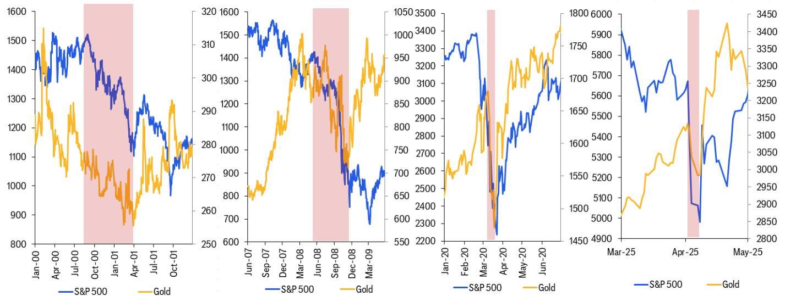
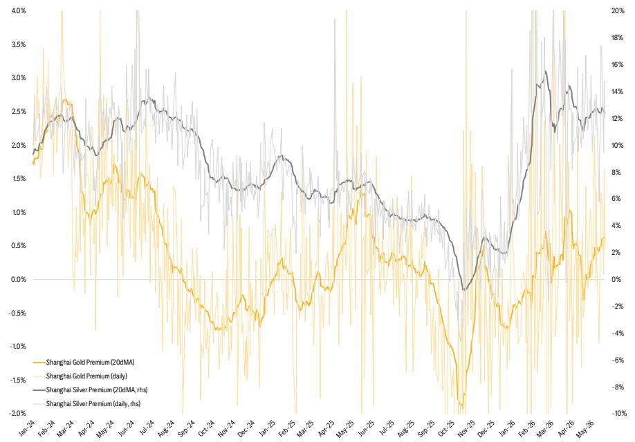
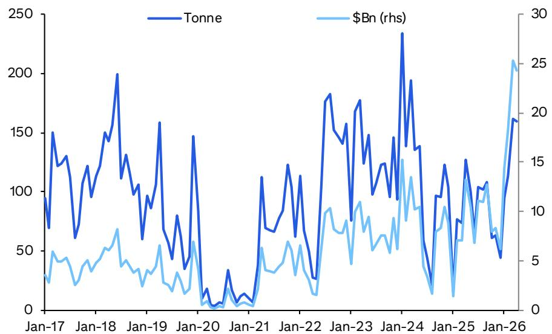

# 黄金市场真正的短期压力不在需求，而在能源驱动的宏观逻辑切换

过去几个月，黄金价格在历史高位附近反复震荡，市场上关于“央行购金持续支撑金价”的叙事已经深入人心。但某外资投行最新发布的研报给出了一组值得警惕的信号：短期黄金面临的压力并非来自需求端的疲软，而是源于霍尔木兹海峡局势持续紧张所引发的能源通胀预期，以及由此带来的实际利率和美元走强。这份报告的核心判断是，市场当前的博弈焦点已经从“谁会继续买黄金”转向“宏观环境是否允许黄金继续涨”。

报告将0-3个月黄金目标价设定为4300美元/盎司，并明确提示在风险事件冲击下，价格可能大幅低于这一水平。这不是一份看空黄金的长期报告，而是一份对短期节奏的清醒判断。对于持有黄金头寸或正在观察入场时机的投资者来说，理解当前的价格驱动力正在发生怎样的结构性切换，比盯着每盎司的波动数字重要得多。

## 1. 黄金与实际利率的负相关性正在回归，这才是短期定价的核心变量

2022年至2024年，全球央行大规模购金推动了一轮脱离传统定价框架的黄金上涨行情。在那段时间里，黄金价格与美国实际利率之间的历史负相关性显著弱化——央行作为价格不敏感的需求方，打破了利率对金价的传导链条。但这份报告明确指出，随着非央行投资者参与度的回升，这一相关性已经恢复。截至今年以来的日度数据显示，黄金与5年期实际利率的平均相关系数已回落至-0.75，而2024年这一数值仅为-0.2。

这意味着什么？意味着黄金正在重新变成一个对利率和美元高度敏感的资产。当霍尔木兹海峡局势推高能源价格，市场开始定价美联储加息预期时，实际利率上升和美元走强会直接对黄金形成压力。这不是一个关于需求是否充足的问题，而是一个关于定价锚是否正在发生位移的问题。对于资产管理者而言，这意味着过去两年那种“无论利率怎么走，黄金都涨”的舒适区间可能已经结束，短期交易策略需要重新纳入利率预期作为核心变量。

## 2. 中国需求依然强劲，但它不是短期价格的边际决定力量

报告中的中国数据看起来相当亮眼。4月海关数据显示，非货币黄金进口量较3月高点略有回落，但同比仍增长25%，按价值计算增幅达到约83%。一季度中国黄金表观需求以价值计创下历史新高，零售金条和金币需求在量和价两个维度都刷新了纪录，珠宝需求也保持韧性。报告还特别提到，一季度“未解释需求”在经历了四季度负值后出现反弹，中国黄金溢价虽然较前期有所收窄，但仍保持正值。

但这些数据传递的信息需要谨慎解读。报告明确表示，中国强劲的进口和投资需求“支撑金价处于历史高位，但并未改变主要边际变量”——后者是投资者需求的下降，尤其是在印度以及非中国的零售市场。换句话说，中国的需求是黄金价格的地板，而不是推动价格突破新高的引擎。当全球投资者因风险偏好下降而减少黄金配置时，中国的购买力只能起到缓冲作用，无法逆转趋势。

对于关注中国市场的读者来说，这里还有一个值得追问的问题：中国需求的韧性建立在人民币相对强势的基础上，如果能源价格上涨导致中国输入性通胀压力加大，人民币汇率是否还能维持当前水平？报告没有展开讨论这一点，但这恰恰是判断中国需求可持续性的关键假设。

## 3. 风险事件的双面性：黄金在“去杠杆”中先跌后涨的历史规律

报告引用了历史数据来说明一个对许多投资者来说反直觉的规律：在重大股市回调或金融机构去杠杆事件中，黄金通常先下跌，然后才反弹。2000年互联网泡沫破裂、2008年全球金融危机、2020年新冠疫情初期，黄金都经历了这一模式。背后的逻辑并不复杂：当市场出现流动性危机时，投资者首先抛售一切可以变现的资产来满足追加保证金或赎回需求，黄金作为流动性最好的商品之一，首当其冲。

报告给出的情景分析值得仔细推敲。在基准情景下，霍尔木兹海峡局势在7月左右缓和，届时高实际利率和强势美元对黄金的压制将解除，金价可能触底反弹。但如果局势持续更长时间，能源价格更高更久，市场关注点将从“通胀但不衰退”切换为“滞胀”——这对股票和债券都是利空，但对贵金属则是利好。报告引用了第二次石油危机期间的历史表现来支持这一判断。

这里的关键在于，黄金投资者需要区分两种截然不同的风险环境：一种是流动性驱动的抛售，黄金短期承压；另一种是滞胀环境，黄金成为最佳对冲工具。当前市场正在从前者向后者的过渡区间内摇摆，而判断转折点的核心变量是霍尔木兹海峡局势的演变路径。

## 4. 1Q26全球黄金需求结构揭示了什么信号？

报告引用的世界黄金协会一季度数据显示，全球黄金总支出折年率已超过1万亿美元，这是一个惊人的数字。分项来看，金条和金币需求依然强劲，珠宝需求保持韧性，央行购金出现反弹。但真正值得关注的不是这些总量数字，而是结构变化。

从图5呈现的数据来看，一季度央行购金在绝对金额上确实有所回升，但与2022至2024年的高峰期相比，其占总需求的比例已经下降。同时，ETF需求虽然转正，但流入规模并不足以对冲其他领域的潜在放缓。换句话说，当前黄金市场的需求结构比过去两年更加分散，也更加依赖于价格敏感的零售和投资需求。这意味着一旦宏观环境恶化，需求端的弹性会比央行主导时期更大。

报告没有完全展开的一个问题是：中国和印度这两个最大的消费市场正在出现需求分化。中国因人民币升值和投资需求旺盛而保持强劲，印度则因本地金价高企和卢比贬值而需求疲软。这种分化如果持续，将如何影响全球黄金的贸易流向和地区溢价？这是一个值得在完整报告中深入探讨的话题。

## 5. 报告尚未完全回答的关键问题：霍尔木兹局势的持续性与黄金定价的时间错配

这份报告最大的价值在于明确指出了当前黄金定价的核心矛盾：短期宏观压力与中长期结构性支撑之间的时间错配。但报告本身也留下了一些尚未完全回答的问题，这些问题恰恰是投资者需要进一步思考和讨论的方向。

第一个问题是霍尔木兹海峡局势演变的概率分布。报告将7月缓和作为基准情景，但并未详细阐述如果局势持续更长时间，黄金价格在不同时间节点上的路径会如何分化。市场对“更长时间更高能源价格”的定价是否充分，是一个开放性问题。

第二个问题是关于中国需求的可持续性。中国一季度表观需求创纪录，但这其中有多少是价格效应（金价上涨推高名义价值），有多少是真实购买量的增长？报告给出了量和价的同比数据，但并未区分价格弹性对需求的影响。如果金价从当前水平进一步上涨，中国需求是否会开始出现价格抑制效应？这是一个需要持续跟踪的变量。

第三个问题是关于央行购金的未来节奏。报告提到央行购金在一季度反弹，但并未解释这一反弹的驱动因素——是新兴市场央行继续多元化储备，还是某些特定国家的战术性增持？不同动机的央行购金行为对价格的敏感度完全不同。

这些未解问题构成了继续阅读完整报告和参与讨论的自然入口。对于希望深入理解黄金定价框架、而不是只看价格涨跌的投资者来说，这些细节才是真正构建判断力的基石。

---

Personal reading notes and learning share only. Not investment advice.

