Asia
Emerging Europe
Europe

Consumer
Autos & Auto Technology

# Industry China Autos & Auto Technology

Date
20 May 2026

Industry Update

# Chinese Automakers Monthly European Market Volume Monitor: Mar. 2026

This monthly chartbook product - "Chinese Automakers Monthly European Market Volume Monitor" - tracks the European sales of leading Chinese automakers.

We anticipate overseas volumes to become the key growth driver, with the European market representing a significant growth market for Chinese automakers.

Bin Wang
Research Analyst
+852-220-35496

Wei Huang
Research Associate
+852-2203-7057

Figure 1: Chinese OEMs European market volume by country 

<table><tr><td colspan="6">Chinese OEM European Volume by Country</td></tr><tr><td>(unit)</td><td>Mar-26</td><td>YoY</td><td>MoM</td><td>3M 2026</td><td>YoY</td></tr><tr><td>CN OEMs Sales</td><td>189,750</td><td>60.1%</td><td>69.5%</td><td>410,003</td><td>39.8%</td></tr><tr><td>UK</td><td>57,543</td><td>117.2%</td><td>438.3%</td><td>87,174</td><td>114.2%</td></tr><tr><td>Russia</td><td>46,950</td><td>6.1%</td><td>34.4%</td><td>117,303</td><td>-15.5%</td></tr><tr><td>Italy</td><td>21,314</td><td>116.4%</td><td>16.1%</td><td>51,885</td><td>129.2%</td></tr><tr><td>Spain</td><td>16,781</td><td>72.1%</td><td>30.2%</td><td>38,673</td><td>65.6%</td></tr><tr><td>Germany</td><td>8,129</td><td>127.8%</td><td>20.1%</td><td>20,087</td><td>136.5%</td></tr><tr><td>Poland</td><td>7,464</td><td>160.8%</td><td>38.4%</td><td>16,964</td><td>139.8%</td></tr><tr><td>France</td><td>5,504</td><td>37.4%</td><td>38.3%</td><td>12,345</td><td>34.3%</td></tr><tr><td>Turkiye</td><td>4,248</td><td>-37.5%</td><td>12.5%</td><td>15,225</td><td>-11.3%</td></tr><tr><td>Austria</td><td>2,571</td><td>78.3%</td><td>93.9%</td><td>5,163</td><td>90.0%</td></tr><tr><td>Belgium</td><td>2,539</td><td>138.4%</td><td>34.1%</td><td>5,700</td><td>117.7%</td></tr><tr><td>Portugal</td><td>2,311</td><td>141.2%</td><td>33.2%</td><td>5,554</td><td>133.6%</td></tr><tr><td>Netherlands</td><td>2,152</td><td>167.0%</td><td>32.9%</td><td>5,380</td><td>121.5%</td></tr><tr><td>Norway</td><td>2,057</td><td>53.4%</td><td>87.7%</td><td>3,519</td><td>25.9%</td></tr><tr><td>Denmark</td><td>1,418</td><td>23.2%</td><td>26.8%</td><td>3,519</td><td>88.6%</td></tr><tr><td>Greece</td><td>1,371</td><td>158.2%</td><td>62.8%</td><td>3,270</td><td>68.6%</td></tr><tr><td>Switzerland</td><td>1,292</td><td>214.4%</td><td>71.4%</td><td>2,593</td><td>232.0%</td></tr><tr><td>Czech Republic</td><td>1,099</td><td>86.3%</td><td>21.8%</td><td>2,475</td><td>77.9%</td></tr><tr><td>Romania</td><td>1,045</td><td>232.8%</td><td>20.3%</td><td>2,661</td><td>175.2%</td></tr><tr><td>Ireland</td><td>923</td><td>59.7%</td><td>26.3%</td><td>3,476</td><td>88.8%</td></tr><tr><td>Sweden</td><td>681</td><td>38.7%</td><td>52.7%</td><td>1,390</td><td>25.9%</td></tr></table>

Figure 2: Chinese OEMs European market volume by automaker 

<table><tr><td colspan="6">Chinese OEM European Market Volume by OEM</td></tr><tr><td>(unit)</td><td>Mar-26</td><td>YoY</td><td>MoM</td><td>3M 2026</td><td>YoY</td></tr><tr><td>CN OEMs Sales</td><td>189,750</td><td>60.1%</td><td>69.5%</td><td>410,003</td><td>39.8%</td></tr><tr><td>Chery</td><td>50,256</td><td>83.2%</td><td>87.2%</td><td>105,846</td><td>45.6%</td></tr><tr><td>SAIC</td><td>39,836</td><td>2.1%</td><td>80.3%</td><td>81,036</td><td>2.6%</td></tr><tr><td>BYD</td><td>38,364</td><td>112.2%</td><td>100.3%</td><td>79,279</td><td>112.4%</td></tr><tr><td>Geely</td><td>17,218</td><td>86.9%</td><td>36.2%</td><td>41,111</td><td>50.4%</td></tr><tr><td>Great Wall Motor</td><td>16,422</td><td>44.5%</td><td>43.2%</td><td>39,859</td><td>7.9%</td></tr><tr><td>Leapmotor</td><td>11,233</td><td>757.5%</td><td>32.2%</td><td>23,989</td><td>687.0%</td></tr><tr><td>Chang&#x27;an</td><td>4,416</td><td>17.2%</td><td>76.9%</td><td>9,574</td><td>-26.8%</td></tr><tr><td>XPeng</td><td>3,093</td><td>117.7%</td><td>39.2%</td><td>7,089</td><td>109.5%</td></tr><tr><td>Dongfeng Motor</td><td>2,365</td><td>88.1%</td><td>32.7%</td><td>5,719</td><td>43.0%</td></tr><tr><td>FAW</td><td>2,016</td><td>241.1%</td><td>49.7%</td><td>4,891</td><td>178.7%</td></tr><tr><td>GAC</td><td>1,801</td><td>100.3%</td><td>59.8%</td><td>4,133</td><td>23.3%</td></tr><tr><td>BAIC</td><td>862</td><td>-31.2%</td><td>40.8%</td><td>1,938</td><td>-25.2%</td></tr><tr><td>Chinese Brands</td><td>440</td><td></td><td>62.4%</td><td>920</td><td></td></tr><tr><td>Li Auto</td><td>367</td><td>-45.9%</td><td>-9.2%</td><td>1,409</td><td>-39.3%</td></tr><tr><td>JAC</td><td>322</td><td>-23.9%</td><td>16.2%</td><td>915</td><td>-16.1%</td></tr><tr><td>Shineray</td><td>246</td><td>-60.6%</td><td>-0.4%</td><td>756</td><td>-62.7%</td></tr><tr><td>Seres</td><td>245</td><td>-58.3%</td><td>18.4%</td><td>706</td><td>-49.1%</td></tr><tr><td>Fujian Motor (FJMG)</td><td>60</td><td>-66.9%</td><td>140.0%</td><td>136</td><td>-74.5%</td></tr><tr><td>NIO</td><td>54</td><td>-34.9%</td><td>-10.0%</td><td>164</td><td>-26.1%</td></tr><tr><td>Xiaomi</td><td>29</td><td>141.7%</td><td>-50.0%</td><td>186</td><td>257.7%</td></tr></table>

# By Country

Figure 3: European market total volume trend   
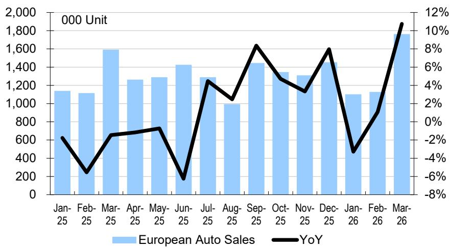

bar_line

| Month | European Auto Sales (000 Unit) | YoY (%) |
| :--- | :--- | :--- |
| Jan-25 | 1150 | 6.0 |
| Feb-25 | 1120 | -3.0 |
| Mar-25 | 1600 | 0.0 |
| Apr-25 | 1270 | 0.0 |
| May-25 | 1300 | 1.0 |
| Jun-25 | 1430 | -6.0 |
| Jul-25 | 1280 | 4.0 |
| Aug-25 | 1000 | 2.0 |
| Sep-25 | 1450 | 9.0 |
| Oct-25 | 1350 | 5.0 |
| Nov-25 | 1300 | 3.0 |
| Dec-25 | 1480 | 8.0 |
| Jan-26 | 1100 | -3.0 |
| Feb-26 | 1130 | 1.0 |
| Mar-26 | 1780 | 11.0 |

Source : Marklines

Figure 4: Total European market volume breakdown by OEM   
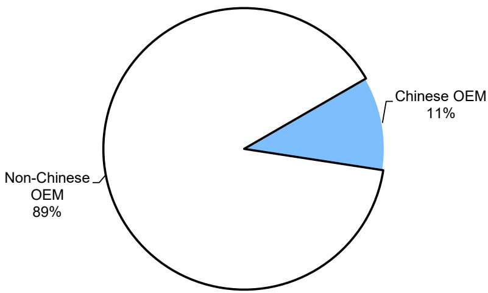

pie

| Category | Percentage (%) |
| :--- | :--- |
| Non-Chinese OEM | 89 |
| Chinese OEM | 11 |

Source : Marklines

Figure 5: Chinese OEMs' aggregate European market volume trend   
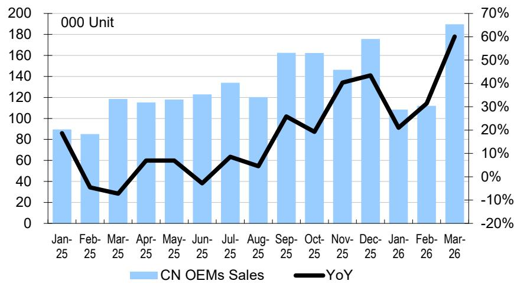

bar_line

| Month   | CN OEMs Sales | YoY   |
|---------|---------------|-------|
| Jan-25  | 88            | 18%   |
| Feb-25  | 84            | -5%   |
| Mar-25  | 118           | -10%  |
| Apr-25  | 114           | 10%   |
| May-25  | 117           | 10%   |
| Jun-25  | 123           | -5%   |
| Jul-25  | 134           | 10%   |
| Aug-25  | 120           | 5%    |
| Sep-25  | 162           | 20%   |
| Oct-25  | 162           | 10%   |
| Nov-25  | 146           | 40%   |
| Dec-25  | 176           | 45%   |
| Jan-26  | 108           | 20%   |
| Feb-26  | 112           | 30%   |
| Mar-26  | 190           | 60%   |

Source : Marklines

Figure 6: Aggregate market share of Chinese OEMs in European market   
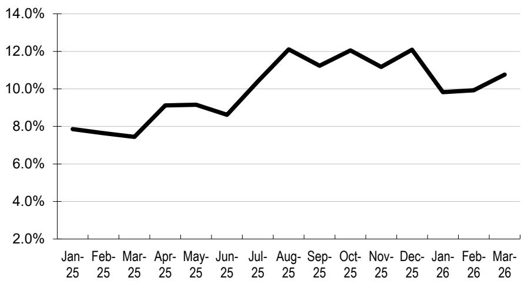

line

| Month   | Value  |
| ------- | ------ |
| Jan-25  | 7.8%   |
| Feb-25  | 7.5%   |
| Mar-25  | 7.3%   |
| Apr-25  | 9.0%   |
| May-25  | 9.0%   |
| Jun-25  | 8.5%   |
| Jul-25  | 10.5%  |
| Aug-25  | 12.0%  |
| Sep-25  | 11.0%  |
| Oct-25  | 12.0%  |
| Nov-25  | 11.0%  |
| Dec-25  | 12.0%  |
| Jan-26  | 9.8%   |
| Feb-26  | 9.9%   |
| Mar-26  | 10.8%  |

Source : Marklines

Figure 7: Germany market wide volume trend   
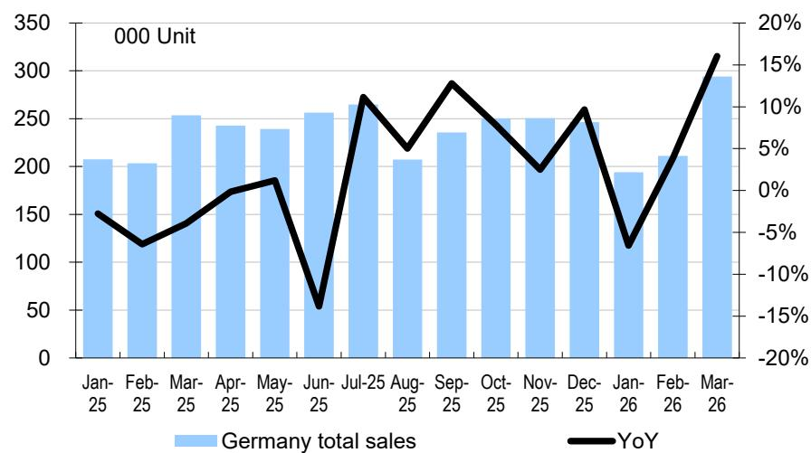

bar_line

000 Unit
| Month | Germany total sales (000 Unit) | YoY (%) |
|---|---|---|
| Jan-25 | 208 | -1.4 |
| Feb-25 | 203 | -6.7 |
| Mar-25 | 253 | -4.9 |
| Apr-25 | 243 | -1.1 |
| May-25 | 239 | 1.0 |
| Jun-25 | 256 | -16.8 |
| Jul-25 | 263 | 13.1 |
| Aug-25 | 208 | 4.7 |
| Sep-25 | 236 | 13.4 |
| Oct-25 | 249 | 6.1 |
| Nov-25 | 251 | 1.8 |
| Dec-25 | 247 | 10.8 |
| Jan-26 | 194 | -7.3 |
| Feb-26 | 211 | 4.9 |
| Mar-26 | 294 | 16.8 |

Source : Marklines

Figure 8: Germany market wide volume breakdown by automaker   
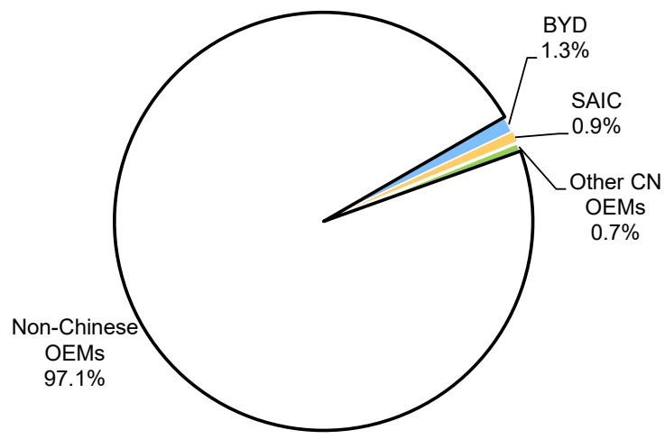

pie

| Category | Percentage (%) |
| :--- | :--- |
| Non-Chinese OEMs | 97.1 |
| BYD | 1.3 |
| SAIC | 0.9 |
| Other CN OEMs | 0.7 |

Source : Marklines

Figure 9: Chinese OEMs' aggregate volume trend in Germany   
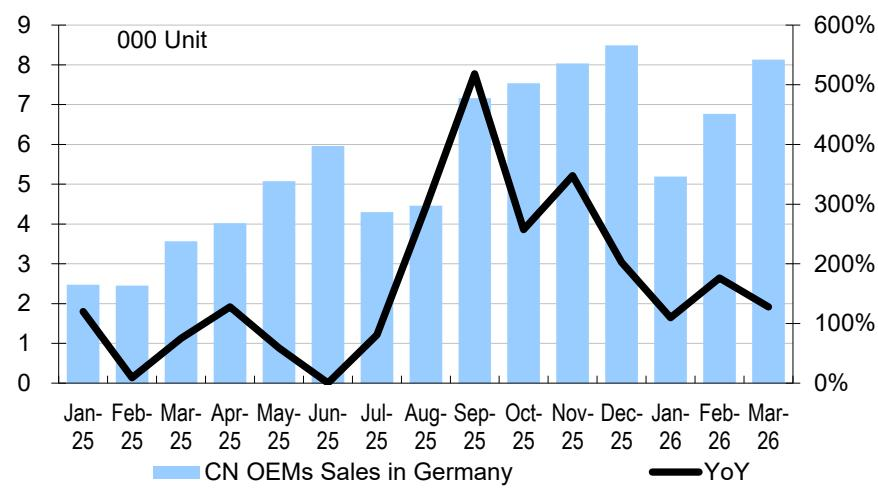

bar_line

| Month   | CN OEMs Sales in Germany (000 Unit) | YoY (%) |
|---------|-------------------------------------|---------|
| Jan-25  | 2.5                                 | 150     |
| Feb-25  | 2.4                                 | 20      |
| Mar-25  | 3.5                                 | 100     |
| Apr-25  | 4.0                                 | 180     |
| May-25  | 5.0                                 | 80      |
| Jun-25  | 6.0                                 | 10      |
| Jul-25  | 4.3                                 | 120     |
| Aug-25  | 4.5                                 | 300     |
| Sep-25  | 7.5                                 | 600     |
| Oct-25  | 7.5                                 | 300     |
| Nov-25  | 8.0                                 | 400     |
| Dec-25  | 8.5                                 | 250     |
| Jan-26  | 5.2                                 | 150     |
| Feb-26  | 6.8                                 | 200     |
| Mar-26  | 8.2                                 | 180     |

Source : Marklines

Figure 10: Aggregate market share of Chinese OEMs in Germany   
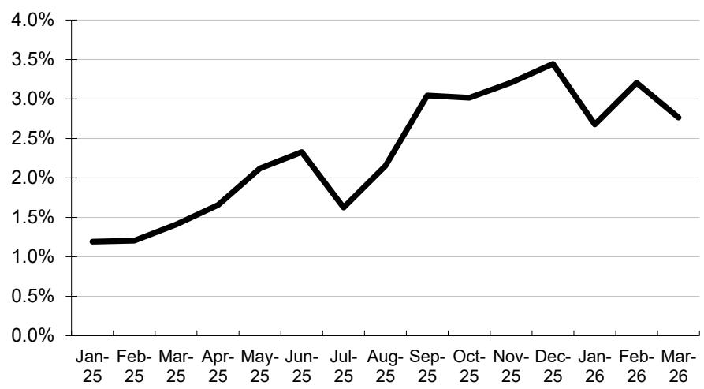

line

| Month   | Value  |
| ------- | ------ |
| Jan-25  | 1.2%   |
| Feb-25  | 1.2%   |
| Mar-25  | 1.4%   |
| Apr-25  | 1.7%   |
| May-25  | 2.1%   |
| Jun-25  | 2.3%   |
| Jul-25  | 1.6%   |
| Aug-25  | 2.1%   |
| Sep-25  | 3.0%   |
| Oct-25  | 3.0%   |
| Nov-25  | 3.2%   |
| Dec-25  | 3.4%   |
| Jan-26  | 2.7%   |
| Feb-26  | 3.2%   |
| Mar-26  | 2.8%   |

Source : Marklines

Figure 11: France market wide volume trend   
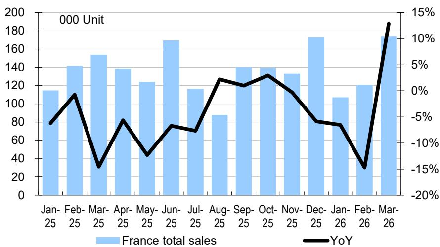

bar_line

000 Unit
| Month | France total sales (000 Unit) | YoY (%) |
|---|---|---|
| Jan-25 | 114 | -7.5 |
| Feb-25 | 141 | 1.3 |
| Mar-25 | 154 | -14.8 |
| Apr-25 | 139 | 8.3 |
| May-25 | 124 | -13.3 |
| Jun-25 | 170 | 7.6 |
| Jul-25 | 116 | -7.4 |
| Aug-25 | 87 | 2.8 |
| Sep-25 | 141 | 1.6 |
| Oct-25 | 140 | 3.3 |
| Nov-25 | 133 | 0.9 |
| Dec-25 | 173 | -1.8 |
| Jan-26 | 106 | -7.8 |
| Feb-26 | 120 | -16.4 |
| Mar-26 | 174 | 14.0 |

Source : Marklines

Figure 12: France market wide volume breakdown by automaker   
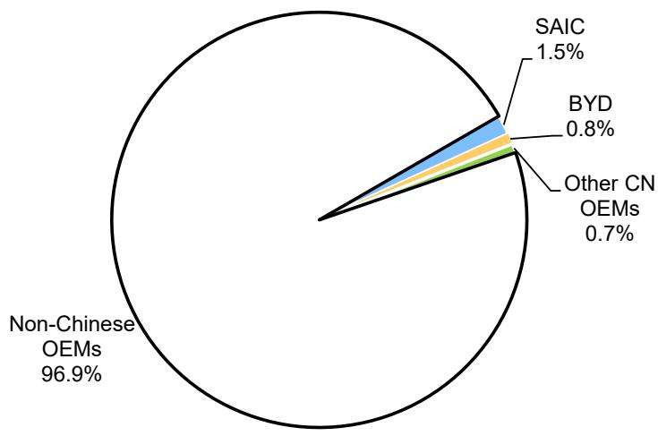

pie

| Category | Percentage (%) |
| :--- | :--- |
| Non-Chinese OEMs | 96.9 |
| SAIC | 1.5 |
| BYD | 0.8 |
| Other CN OEMs | 0.7 |

Source : Marklines

Figure 13: Chinese OEMs' aggregate volume trend in France   
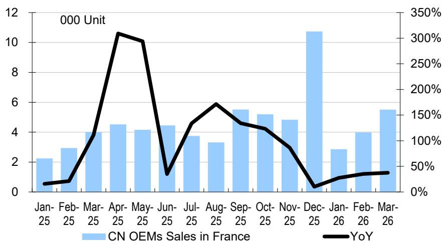

bar_line

| Month   | CN OEMs Sales in France | YoY   |
|---------|--------------------------|-------|
| Jan-25  | 2                        | 0%    |
| Feb-25  | 3                        | 0%    |
| Mar-25  | 4                        | 100%  |
| Apr-25  | 4.5                      | 300%  |
| May-25  | 4                        | 280%  |
| Jun-25  | 4.5                      | 100%  |
| Jul-25  | 3.5                      | 150%  |
| Aug-25  | 3                        | 170%  |
| Sep-25  | 5.5                      | 150%  |
| Oct-25  | 5                        | 120%  |
| Nov-25  | 4.5                      | 80%   |
| Dec-25  | 10.5                     | 0%    |
| Jan-26  | 3                        | 0%    |
| Feb-26  | 4                        | 20%   |
| Mar-26  | 5.5                      | 30%   |

Source : Marklines

Figure 14: Aggregate market share of Chinese OEMs in France   
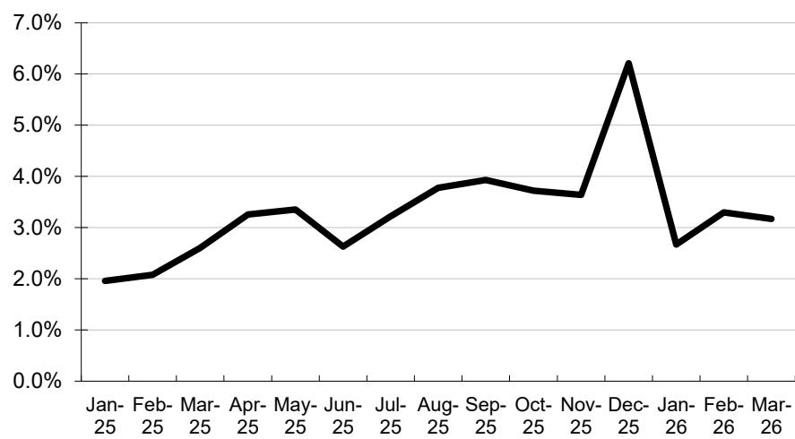

line

| Month   | Value |
| ------- | ----- |
| Jan-25  | 2.0%  |
| Feb-25  | 2.1%  |
| Mar-25  | 2.5%  |
| Apr-25  | 3.3%  |
| May-25  | 3.4%  |
| Jun-25  | 2.6%  |
| Jul-25  | 3.0%  |
| Aug-25  | 3.8%  |
| Sep-25  | 4.0%  |
| Oct-25  | 3.8%  |
| Nov-25  | 3.7%  |
| Dec-25  | 6.2%  |
| Jan-26  | 2.6%  |
| Feb-26  | 3.3%  |
| Mar-26  | 3.1%  |

Source : Marklines

Figure 15: UK market wide volume trend   
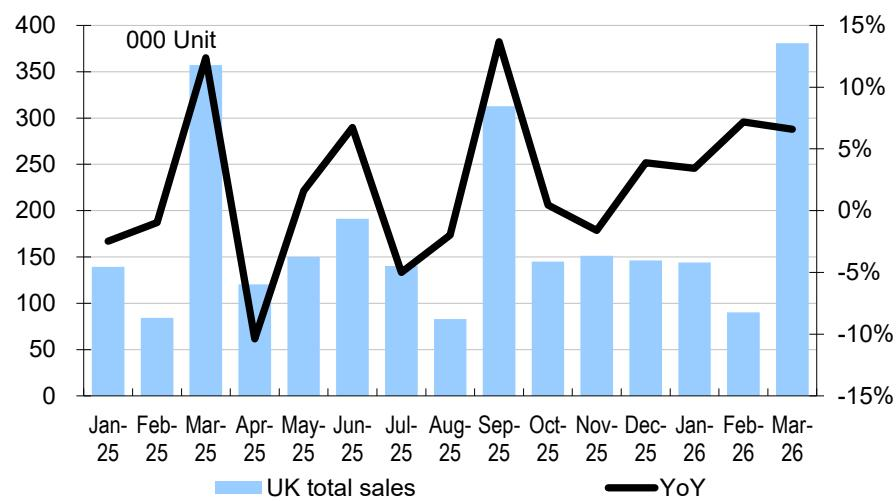

bar_line

| Month | UK total sales (000 Unit) | YoY (%) |
| :--- | :--- | :--- |
| Jan-25 | 140 | -1.5 |
| Feb-25 | 80 | -1.0 |
| Mar-25 | 360 | 12.0 |
| Apr-25 | 120 | -10.0 |
| May-25 | 150 | 2.0 |
| Jun-25 | 190 | 3.0 |
| Jul-25 | 140 | -3.0 |
| Aug-25 | 80 | -1.0 |
| Sep-25 | 310 | 14.0 |
| Oct-25 | 145 | -1.0 |
| Nov-25 | 150 | -3.0 |
| Dec-25 | 145 | 3.0 |
| Jan-26 | 145 | 2.0 |
| Feb-26 | 90 | 7.0 |
| Mar-26 | 380 | 6.0 |

Source : Marklines

Figure 16: UK market wide volume breakdown by automaker   
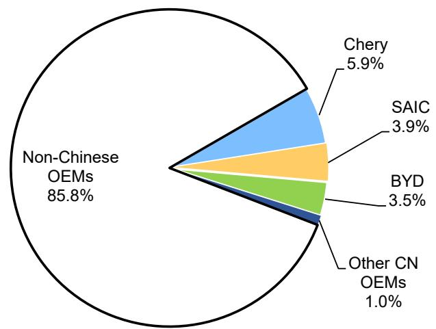

pie

| Category | Percentage (%) |
| :--- | :--- |
| Non-Chinese OEMs | 85.8 |
| Chery | 5.9 |
| SAIC | 3.9 |
| BYD | 3.5 |
| Other CN OEMs | 1.0 |

Source : Marklines

Figure 17: Chinese OEMs' aggregate volume trend in the UK   
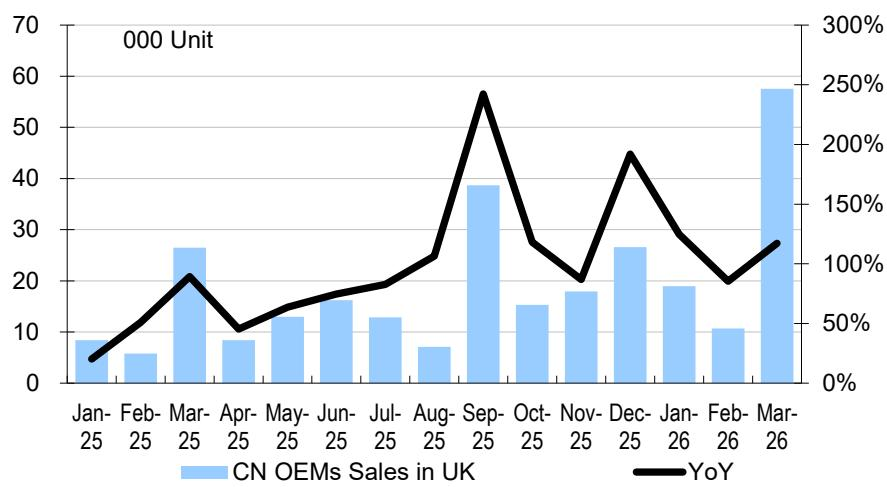

bar_line

| Month | CN OEMs Sales in UK (000 Unit) | YoY (%) |
| :--- | :--- | :--- |
| Jan-25 | 8 | 30 |
| Feb-25 | 5 | 70 |
| Mar-25 | 26 | 100 |
| Apr-25 | 8 | 40 |
| May-25 | 13 | 60 |
| Jun-25 | 16 | 70 |
| Jul-25 | 13 | 80 |
| Aug-25 | 7 | 100 |
| Sep-25 | 39 | 250 |
| Oct-25 | 15 | 150 |
| Nov-25 | 18 | 90 |
| Dec-25 | 26 | 190 |
| Jan-26 | 19 | 130 |
| Feb-26 | 11 | 80 |
| Mar-26 | 58 | 120 |

Source : Marklines

Figure 18: Aggregate market share of Chinese OEMs in UK   
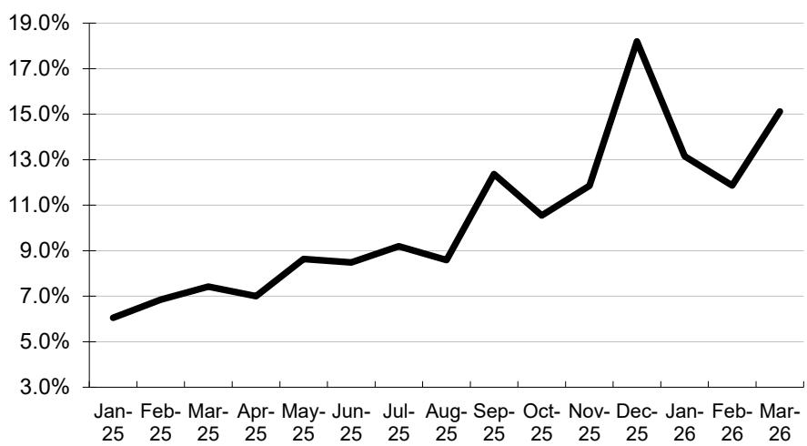

line

| Month   | Value  |
| ------- | ------ |
| Jan-25  | 6.0%   |
| Feb-25  | 7.0%   |
| Mar-25  | 7.5%   |
| Apr-25  | 7.0%   |
| May-25  | 8.5%   |
| Jun-25  | 8.0%   |
| Jul-25  | 9.0%   |
| Aug-25  | 8.5%   |
| Sep-25  | 12.5%  |
| Oct-25  | 10.0%  |
| Nov-25  | 11.5%  |
| Dec-25  | 18.0%  |
| Jan-26  | 13.0%  |
| Feb-26  | 11.5%  |
| Mar-26  | 15.0%  |

Source : Marklines

Figure 19: Italy market wide volume trend   
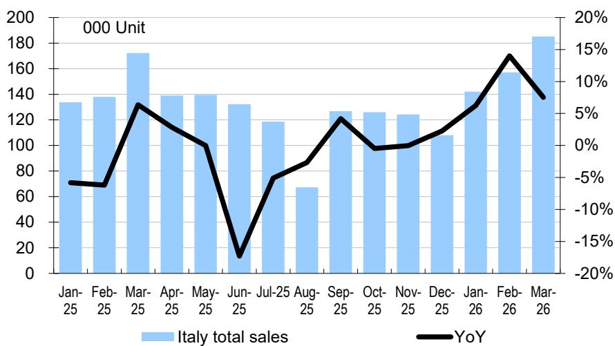

bar_line

| Month | Italy total sales (000 Unit) | YoY (%) |
| :--- | :--- | :--- |
| Jan-25 | 134 | -5 |
| Feb-25 | 138 | -5 |
| Mar-25 | 173 | 7 |
| Apr-25 | 139 | 4 |
| May-25 | 140 | 1 |
| Jun-25 | 132 | -18 |
| Jul-25 | 119 | -3 |
| Aug-25 | 67 | -1 |
| Sep-25 | 126 | 4 |
| Oct-25 | 126 | -1 |
| Nov-25 | 124 | -1 |
| Dec-25 | 109 | 0 |
| Jan-26 | 141 | 6 |
| Feb-26 | 157 | 14 |
| Mar-26 | 186 | 8 |

Source : Marklines

Figure 20: Italy market wide volume breakdown by automaker   
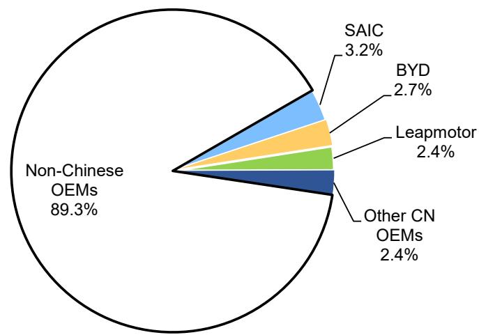

pie

| Category | Percentage (%) |
| :--- | :--- |
| Non-Chinese OEMs | 89.3 |
| SAIC | 3.2 |
| BYD | 2.7 |
| Leapmotor | 2.4 |
| Other CN OEMs | 2.4 |

Source : Marklines

Figure 21: Chinese OEMs' aggregate volume trend in Italy   
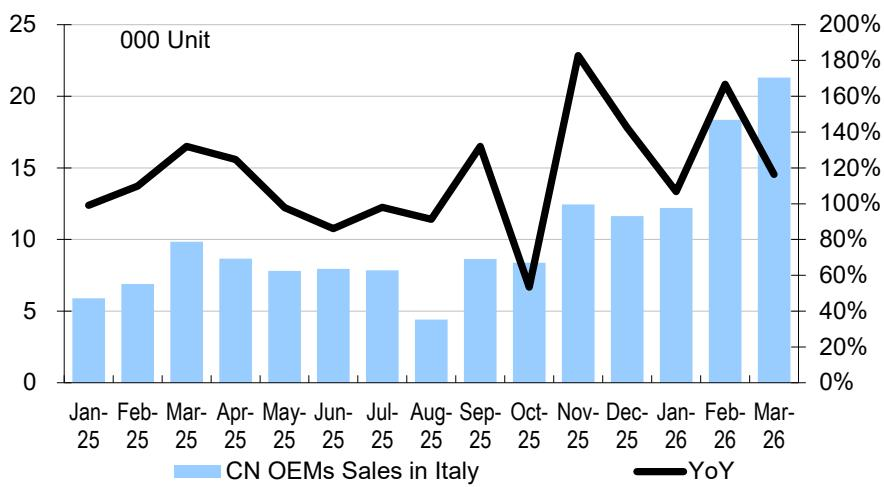

bar_line

| Month | CN OEMs Sales in Italy (000 Unit) | YoY (%) |
| :--- | :--- | :--- |
| Jan-25 | 6 | 125 |
| Feb-25 | 7 | 135 |
| Mar-25 | 10 | 165 |
| Apr-25 | 8.5 | 155 |
| May-25 | 7.8 | 125 |
| Jun-25 | 8 | 105 |
| Jul-25 | 7.9 | 120 |
| Aug-25 | 4.5 | 115 |
| Sep-25 | 8.7 | 165 |
| Oct-25 | 8.3 | 60 |
| Nov-25 | 12.5 | 180 |
| Dec-25 | 11.6 | 140 |
| Jan-26 | 12.1 | 105 |
| Feb-26 | 18.3 | 160 |
| Mar-26 | 21.3 | 145 |

Source : Marklines

Figure 22: Aggregate market share of Chinese OEMs in Italy   
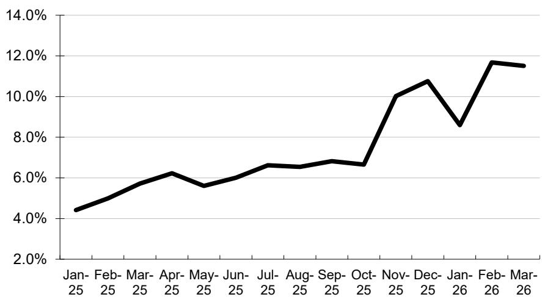

line

| Month   | Value  |
| ------- | ------ |
| Jan-25  | 4.3%   |
| Feb-25  | 5.0%   |
| Mar-25  | 5.8%   |
| Apr-25  | 6.2%   |
| May-25  | 5.6%   |
| Jun-25  | 6.0%   |
| Jul-25  | 6.6%   |
| Aug-25  | 6.5%   |
| Sep-25  | 6.8%   |
| Oct-25  | 6.6%   |
| Nov-25  | 10.0%  |
| Dec-25  | 10.8%  |
| Jan-26  | 8.5%   |
| Feb-26  | 11.8%  |
| Mar-26  | 11.6%  |

Source : Marklines

Figure 23: Turkiye market wide volume trend   
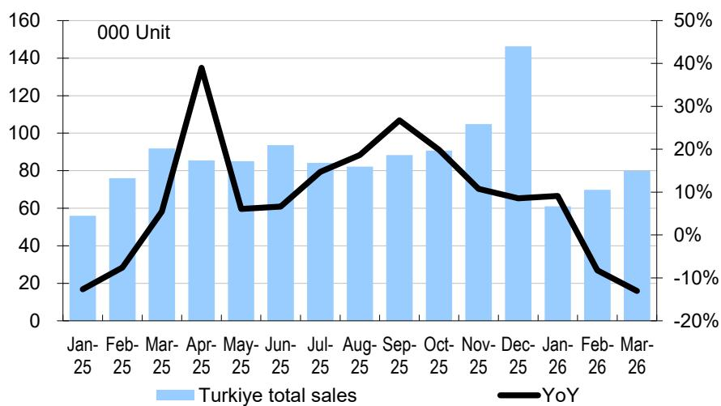

bar_line

| Month | Turkiye total sales (in 000 Unit) | YoY (%) |
|---|---|---|
| Jan-25 | 56 | -14 |
| Feb-25 | 76 | -8 |
| Mar-25 | 91 | 13 |
| Apr-25 | 85 | 40 |
| May-25 | 84 | 7 |
| Jun-25 | 93 | 8 |
| Jul-25 | 83 | 16 |
| Aug-25 | 81 | 19 |
| Sep-25 | 88 | 27 |
| Oct-25 | 89 | 17 |
| Nov-25 | 104 | 11 |
| Dec-25 | 146 | 9 |
| Jan-26 | 61 | 10 |
| Feb-26 | 70 | -13 |
| Mar-26 | 80 | -16 |

Source : Marklines

Figure 24: Turkiye market wide volume breakdown by automaker   
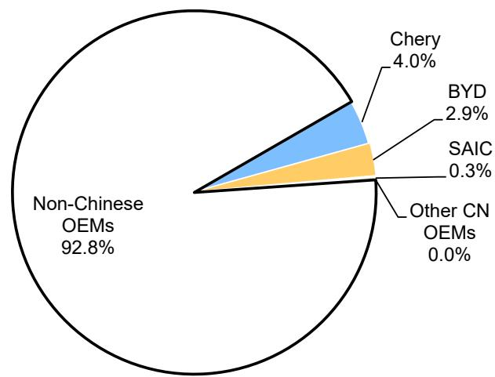

pie

| Category | Percentage (%) |
| :--- | :--- |
| Non-Chinese OEMs | 92.8 |
| Chery | 4.0 |
| BYD | 2.9 |
| SAIC | 0.3 |
| Other CN OEMs | 0.0 |

Source : Marklines

Figure 25: Chinese OEMs' aggregate volume trend in Turkiye   
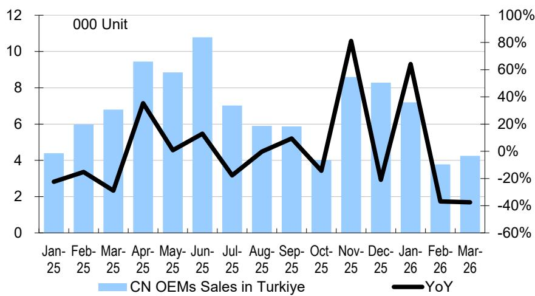

bar_line

| Month   | CN OEMs Sales in Türkiye (000 Unit) | YoY (%) |
|---------|-------------------------------------|---------|
| Jan-25  | 4.5                                 | -10%    |
| Feb-25  | 6.0                                 | -15%    |
| Mar-25  | 7.0                                 | -20%    |
| Apr-25  | 9.5                                 | 30%     |
| May-25  | 8.8                                 | -10%    |
| Jun-25  | 10.8                                | 15%     |
| Jul-25  | 7.0                                 | -15%    |
| Aug-25  | 6.0                                 | -5%     |
| Sep-25  | 6.0                                 | 10%     |
| Oct-25  | 4.0                                 | -15%    |
| Nov-25  | 8.5                                 | 80%     |
| Dec-25  | 8.3                                 | -20%    |
| Jan-26  | 7.2                                 | 60%     |
| Feb-26  | 3.8                                 | -40%    |
| Mar-26  | 4.3                                 | -40%    |

Source : Marklines

Figure 26: Aggregate market share of Chinese OEMs in Turkiye   
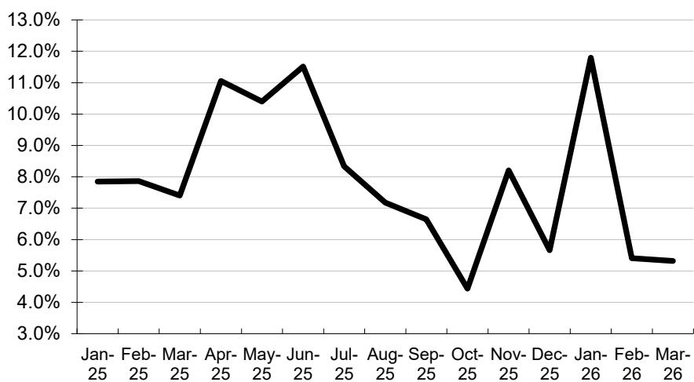

line

| Month   | Value  |
| ------- | ------ |
| Jan-25  | 7.8%   |
| Feb-25  | 7.8%   |
| Mar-25  | 7.3%   |
| Apr-25  | 11.0%  |
| May-25  | 10.3%  |
| Jun-25  | 11.5%  |
| Jul-25  | 8.3%   |
| Aug-25  | 7.2%   |
| Sep-25  | 6.7%   |
| Oct-25  | 4.4%   |
| Nov-25  | 8.2%   |
| Dec-25  | 5.6%   |
| Jan-26  | 11.8%  |
| Feb-26  | 5.3%   |
| Mar-26  | 5.2%   |

Source : Marklines

Figure 27: Spain market wide volume trend   
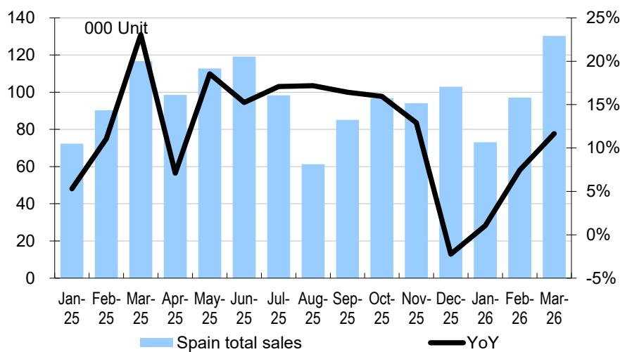

bar_line

| Month | Spain total sales (000 Unit) | YoY (%) |
| :--- | :--- | :--- |
| Jan-25 | 73 | 4.8 |
| Feb-25 | 90 | 7.5 |
| Mar-25 | 118 | 23.5 |
| Apr-25 | 99 | 5.7 |
| May-25 | 112 | 18.8 |
| Jun-25 | 119 | 16.3 |
| Jul-25 | 98 | 17.4 |
| Aug-25 | 61 | 17.3 |
| Sep-25 | 85 | 16.8 |
| Oct-25 | 97 | 16.0 |
| Nov-25 | 94 | 8.3 |
| Dec-25 | 103 | -2.0 |
| Jan-26 | 73 | 1.4 |
| Feb-26 | 97 | 6.4 |
| Mar-26 | 130 | 10.4 |

Source : Marklines

Figure 28: Spain market wide volume breakdown by automaker   
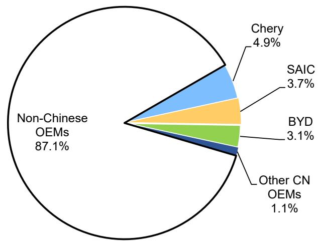

pie

| Category | Percentage (%) |
| :--- | :--- |
| Non-Chinese OEMs | 87.1 |
| Chery | 4.9 |
| SAIC | 3.7 |
| BYD | 3.1 |
| Other CN OEMs | 1.1 |

Source : Marklines

Figure 29: Chinese OEMs' aggregate volume trend in Spain   
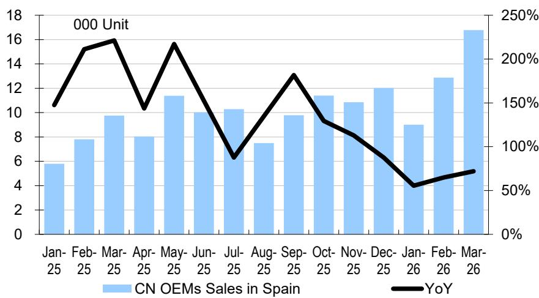

bar_line

| Month | CN OEMs Sales in Spain (in 1000 Units) | YoY (%) |
| :--- | :--- | :--- |
| Jan-25 | 5.8 | 105 |
| Feb-25 | 7.9 | 155 |
| Mar-25 | 9.8 | 230 |
| Apr-25 | 8.1 | 105 |
| May-25 | 11.4 | 230 |
| Jun-25 | 10.1 | 100 |
| Jul-25 | 10.3 | 60 |
| Aug-25 | 7.6 | 110 |
| Sep-25 | 9.8 | 180 |
| Oct-25 | 11.4 | 120 |
| Nov-25 | 10.9 | 100 |
| Dec-25 | 12.0 | 70 |
| Jan-26 | 9.0 | 45 |
| Feb-26 | 12.8 | 55 |
| Mar-26 | 16.8 | 65 |

Source : Marklines

Figure 30: Aggregate market share of Chinese OEMs in Spain   
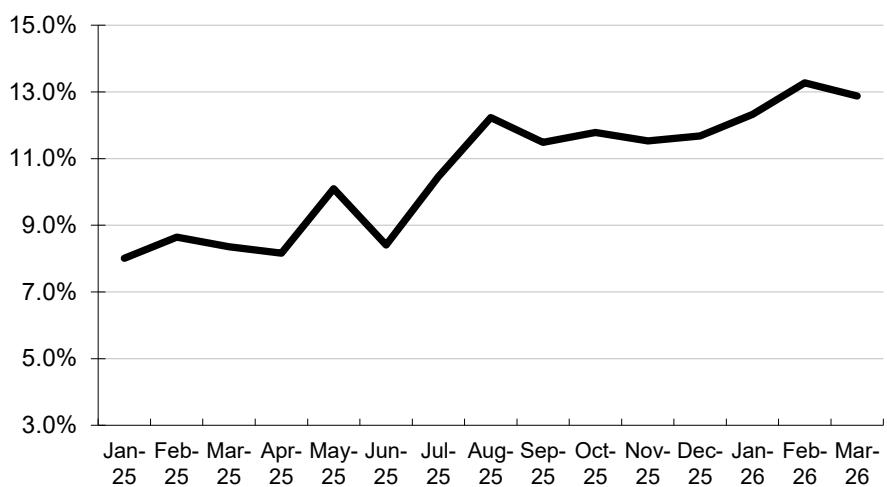

line

| Month   | Value  |
| ------- | ------ |
| Jan-25  | 8.0%   |
| Feb-25  | 8.5%   |
| Mar-25  | 8.0%   |
| Apr-25  | 7.5%   |
| May-25  | 9.5%   |
| Jun-25  | 8.0%   |
| Jul-25  | 10.0%  |
| Aug-25  | 12.0%  |
| Sep-25  | 11.5%  |
| Oct-25  | 11.8%  |
| Nov-25  | 11.5%  |
| Dec-25  | 11.8%  |
| Jan-26  | 12.5%  |
| Feb-26  | 13.2%  |
| Mar-26  | 13.0%  |

Source : Marklines

Figure 31: Poland market wide volume trend   
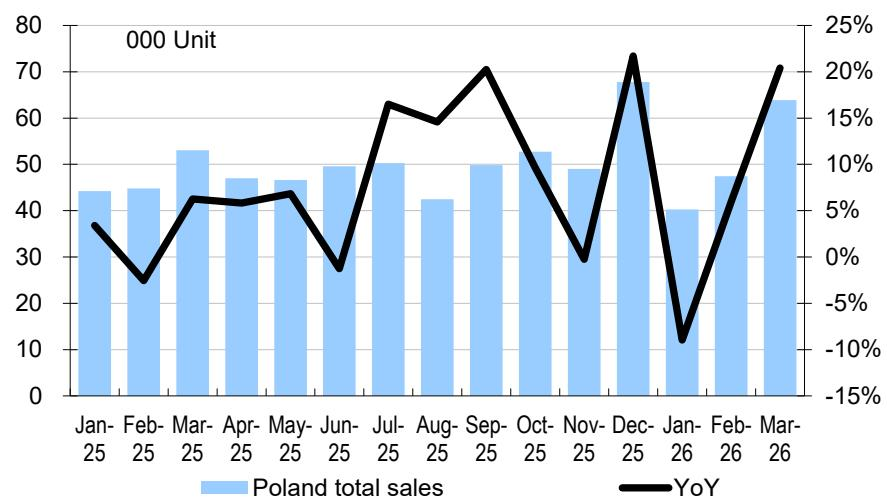

bar_line

| Month | Poland total sales (000 Unit) | YoY (%) |
| :--- | :--- | :--- |
| Jan-25 | 44 | 3.7 |
| Feb-25 | 44.5 | -1.8 |
| Mar-25 | 53 | 4.9 |
| Apr-25 | 47 | 4.5 |
| May-25 | 46.5 | 5.1 |
| Jun-25 | 49.5 | -1.0 |
| Jul-25 | 50.5 | 16.8 |
| Aug-25 | 42.5 | 13.3 |
| Sep-25 | 50 | 21.0 |
| Oct-25 | 52.5 | 7.8 |
| Nov-25 | 49.5 | -1.0 |
| Dec-25 | 68 | 23.8 |
| Jan-26 | 40.5 | -9.8 |
| Feb-26 | 47.5 | 7.8 |
| Mar-26 | 64 | 21.0 |

Source : Marklines

Figure 32: Poland market wide volume breakdown by automaker   
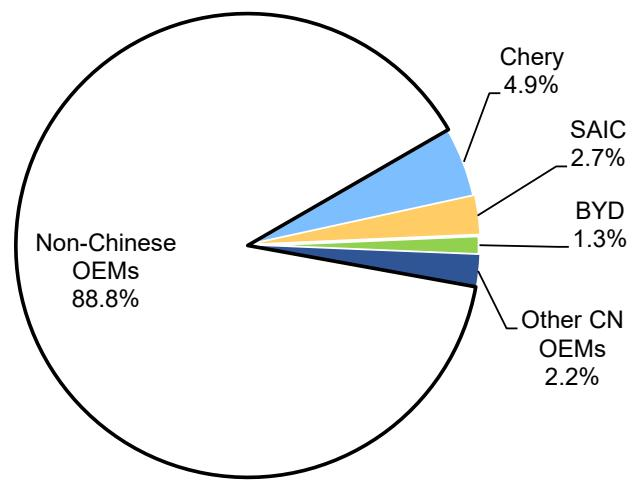

pie

| Category | Percentage (%) |
| :--- | :--- |
| Non-Chinese OEMs | 88.8 |
| Chery | 4.9 |
| SAIC | 2.7 |
| BYD | 1.3 |
| Other CN OEMs | 2.2 |

Source : Marklines

Figure 33: Chinese OEMs' aggregate volume trend in Poland   
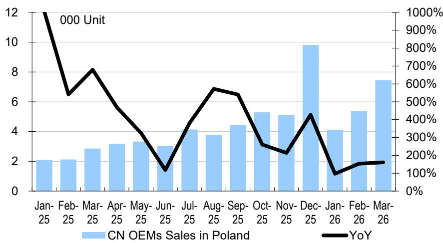

bar_line

| Month | CN OEMs Sales in Poland (in 1,000 Units) | YoY (%) |
| :--- | :--- | :--- |
| Jan-25 | 2.0 | 1000 |
| Feb-25 | 2.0 | 650 |
| Mar-25 | 2.8 | 800 |
| Apr-25 | 3.1 | 550 |
| May-25 | 3.3 | 400 |
| Jun-25 | 3.0 | 150 |
| Jul-25 | 4.1 | 450 |
| Aug-25 | 3.7 | 650 |
| Sep-25 | 4.4 | 600 |
| Oct-25 | 5.3 | 300 |
| Nov-25 | 5.1 | 250 |
| Dec-25 | 9.8 | 450 |
| Jan-26 | 4.1 | 100 |
| Feb-26 | 5.4 | 180 |
| Mar-26 | 7.5 | 180 |

Source : Marklines

Figure 34: Aggregate market share of Chinese OEMs in Poland   
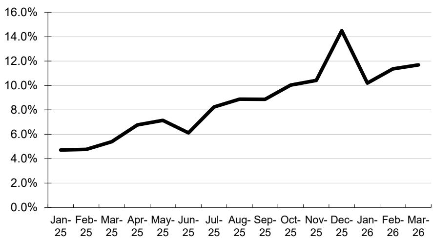

line

| Month   | Value  |
| ------- | ------ |
| Jan-25  | 4.8%   |
| Feb-25  | 4.9%   |
| Mar-25  | 5.5%   |
| Apr-25  | 6.8%   |
| May-25  | 7.2%   |
| Jun-25  | 6.0%   |
| Jul-25  | 8.3%   |
| Aug-25  | 8.9%   |
| Sep-25  | 8.9%   |
| Oct-25  | 10.1%  |
| Nov-25  | 10.4%  |
| Dec-25  | 14.5%  |
| Jan-26  | 10.1%  |
| Feb-26  | 11.3%  |
| Mar-26  | 11.7%  |

Source : Marklines

Figure 35: Netherlands market wide volume trend   
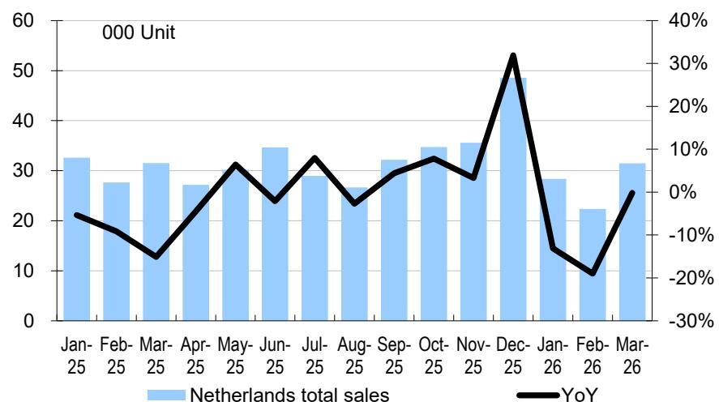

bar_line

| Month | Netherlands total sales (000 Unit) | YoY (%) |
|---|---|---|
| Jan-25 | 32.5 | -4.5 |
| Feb-25 | 27.8 | -8.1 |
| Mar-25 | 31.5 | -14.2 |
| Apr-25 | 27.0 | -6.9 |
| May-25 | 34.0 | 11.3 |
| Jun-25 | 34.8 | -11.4 |
| Jul-25 | 28.8 | 11.8 |
| Aug-25 | 26.0 | -3.1 |
| Sep-25 | 31.8 | 6.7 |
| Oct-25 | 34.5 | 9.6 |
| Nov-25 | 35.5 | 4.9 |
| Dec-25 | 48.5 | 33.0 |
| Jan-26 | 28.5 | -13.1 |
| Feb-26 | 22.0 | -18.7 |
| Mar-26 | 31.5 | 2.4 |

Source : Marklines

Figure 36: Netherlands market wide volume breakdown by automaker   
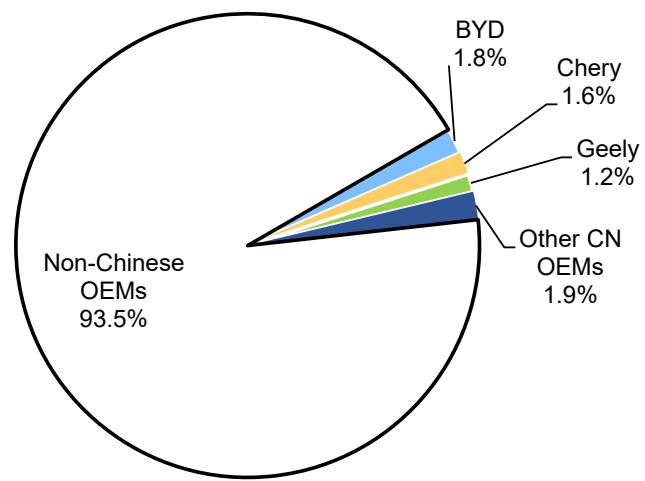

pie

| Category | Percentage (%) |
| :--- | :--- |
| Non-Chinese OEMs | 93.5 |
| BYD | 1.8 |
| Chery | 1.6 |
| Geely | 1.2 |
| Other CN OEMs | 1.9 |

Source : Marklines

Figure 37: Chinese OEMs' aggregate volume trend in the Netherlands   
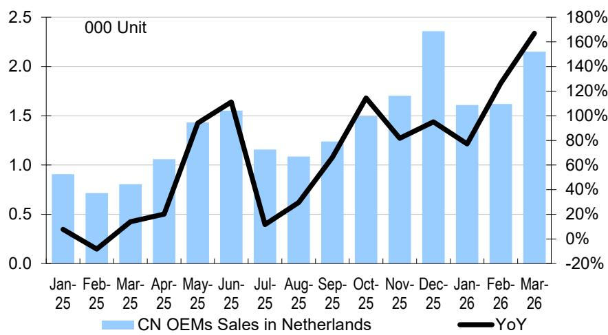

bar_line

| Month   | CN OEMs Sales in Netherlands (000 Unit) | YoY (%) |
|---------|----------------------------------------|---------|
| Jan-25  | 0.9                                    | 30%     |
| Feb-25  | 0.7                                    | -10%    |
| Mar-25  | 0.8                                    | 10%     |
| Apr-25  | 1.1                                    | 30%     |
| May-25  | 1.4                                    | 100%    |
| Jun-25  | 1.6                                    | 110%    |
| Jul-25  | 1.2                                    | 10%     |
| Aug-25  | 1.1                                    | 30%     |
| Sep-25  | 1.3                                    | 60%     |
| Oct-25  | 1.5                                    | 110%    |
| Nov-25  | 1.7                                    | 80%     |
| Dec-25  | 2.4                                    | 100%    |
| Jan-26  | 1.6                                    | 80%     |
| Feb-26  | 1.6                                    | 130%    |
| Mar-26  | 2.2                                    | 170%    |

Source : Marklines

Figure 38: Aggregate market share of Chinese OEMs in the Netherlands   
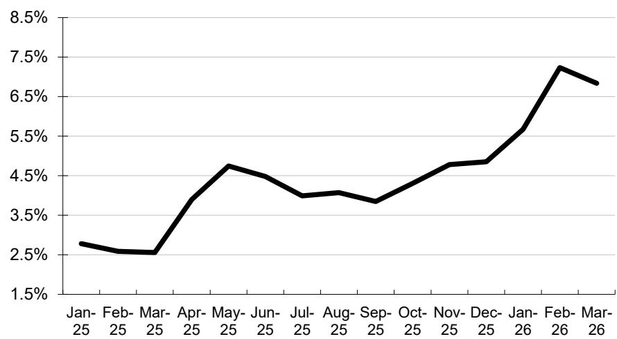

line

| Month   | Value  |
| ------- | ------ |
| Jan-25  | 2.7%   |
| Feb-25  | 2.5%   |
| Mar-25  | 2.5%   |
| Apr-25  | 3.8%   |
| May-25  | 4.6%   |
| Jun-25  | 4.4%   |
| Jul-25  | 3.7%   |
| Aug-25  | 3.8%   |
| Sep-25  | 3.6%   |
| Oct-25  | 4.0%   |
| Nov-25  | 4.6%   |
| Dec-25  | 4.7%   |
| Jan-26  | 5.6%   |
| Feb-26  | 7.0%   |
| Mar-26  | 6.7%   |

Source : Marklines

Figure 39: Sweden market wide volume trend   
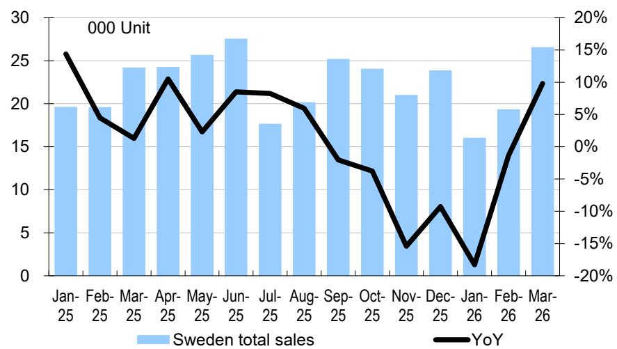

bar_line

| Month | Sweden total sales (000 Unit) | YoY (%) |
| :--- | :--- | :--- |
| Jan-25 | 19.7 | 16.3 |
| Feb-25 | 19.4 | 8.0 |
| Mar-25 | 24.2 | 3.0 |
| Apr-25 | 24.3 | 11.0 |
| May-25 | 25.6 | 4.0 |
| Jun-25 | 27.6 | 10.0 |
| Jul-25 | 17.8 | 9.0 |
| Aug-25 | 20.1 | 6.0 |
| Sep-25 | 25.2 | -3.0 |
| Oct-25 | 24.1 | -4.0 |
| Nov-25 | 21.1 | -16.0 |
| Dec-25 | 23.9 | -8.0 |
| Jan-26 | 16.1 | -18.0 |
| Feb-26 | 19.4 | -3.0 |
| Mar-26 | 26.5 | 11.0 |

Source : Marklines

Figure 40: Sweden market wide volume breakdown by automaker   
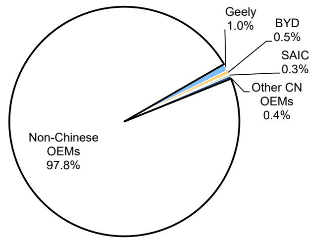

pie

| Category | Percentage (%) |
| :--- | :--- |
| Non-Chinese OEMs | 97.8 |
| Geely | 1.0 |
| BYD | 0.5 |
| SAIC | 0.3 |
| Other CN OEMs | 0.4 |

Source : Marklines

Figure 41: Chinese OEMs' aggregate volume trend in Sweden   
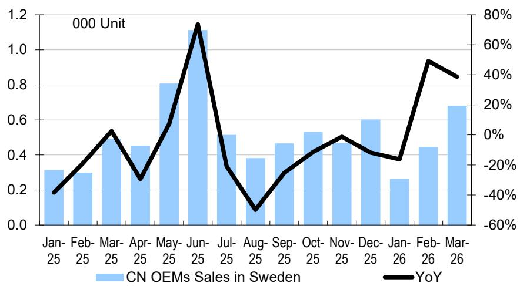

bar_line

| Month | CN OEMs Sales in Sweden (in 1000 Units) | YoY (%) |
|---|---|---|
| Jan-25 | 0.3 | -18 |
| Feb-25 | 0.3 | -14 |
| Mar-25 | 0.5 | 10 |
| Apr-25 | 0.45 | -24 |
| May-25 | 0.8 | 29 |
| Jun-25 | 1.1 | 74 |
| Jul-25 | 0.5 | -24 |
| Aug-25 | 0.38 | -48 |
| Sep-25 | 0.46 | -16 |
| Oct-25 | 0.53 | -8 |
| Nov-25 | 0.48 | 1 |
| Dec-25 | 0.6 | -11 |
| Jan-26 | 0.26 | -17 |
| Feb-26 | 0.44 | 48 |
| Mar-26 | 0.68 | 37 |

Source : Marklines

Figure 42: Aggregate market share of Chinese OEMs in Sweden   
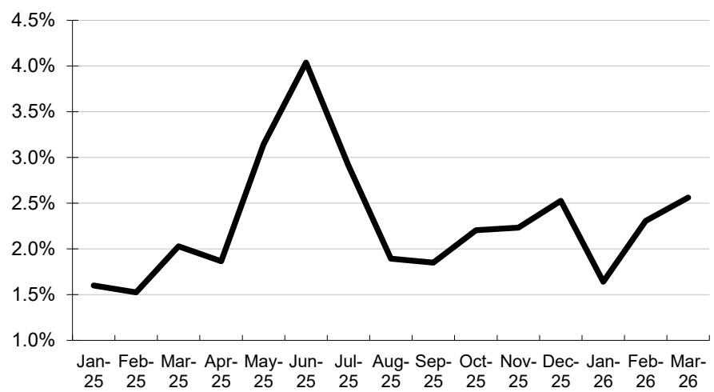

line

| Month   | Value |
| ------- | ----- |
| Jan-25  | 1.6%  |
| Feb-25  | 1.5%  |
| Mar-25  | 2.0%  |
| Apr-25  | 1.9%  |
| May-25  | 3.2%  |
| Jun-25  | 4.0%  |
| Jul-25  | 3.0%  |
| Aug-25  | 1.9%  |
| Sep-25  | 1.8%  |
| Oct-25  | 2.2%  |
| Nov-25  | 2.3%  |
| Dec-25  | 2.5%  |
| Jan-26  | 1.6%  |
| Feb-26  | 2.3%  |
| Mar-26  | 2.6%  |

Source : Marklines

Figure 43: Norway market wide volume trend   
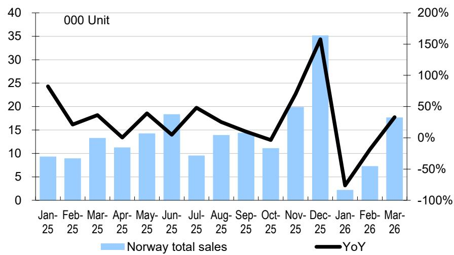

bar_line

000 Unit
| Month | Norway total sales (000 Unit) | YoY (%) |
|---|---|---|
| Jan-25 | 9.5 | 80 |
| Feb-25 | 9.0 | 30 |
| Mar-25 | 13.5 | 40 |
| Apr-25 | 11.5 | -10 |
| May-25 | 14.5 | 70 |
| Jun-25 | 18.5 | -15 |
| Jul-25 | 9.5 | 40 |
| Aug-25 | 14.0 | 20 |
| Sep-25 | 14.5 | -5 |
| Oct-25 | 11.0 | -10 |
| Nov-25 | 20.0 | 60 |
| Dec-25 | 35.0 | 160 |
| Jan-26 | 2.0 | -80 |
| Feb-26 | 7.0 | -20 |
| Mar-26 | 17.5 | 30 |

Source : Marklines

Figure 44: Norway market wide volume breakdown by automaker   
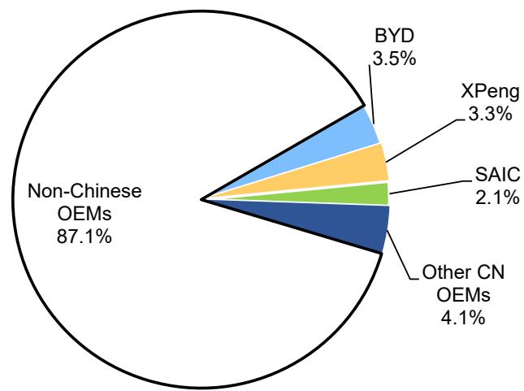

pie

| Category | Percentage (%) |
| :--- | :--- |
| Non-Chinese OEMs | 87.1 |
| BYD | 3.5 |
| XPeng | 3.3 |
| SAIC | 2.1 |
| Other CN OEMs | 4.1 |

Source : Marklines

Figure 45: Chinese OEMs' aggregate volume trend in Norway   
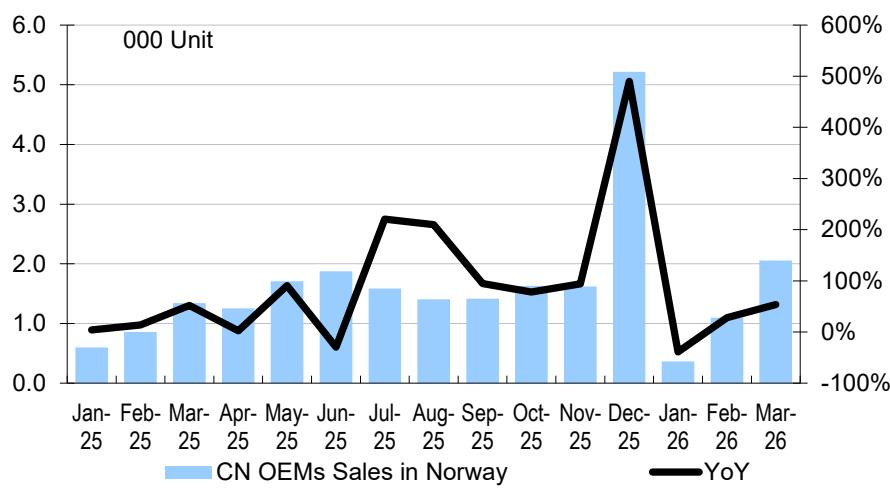

bar_line

| Month | CN OEMs Sales in Norway (000 Unit) | YoY (%) |
| :--- | :--- | :--- |
| Jan-25 | 0.6 | 8.0 |
| Feb-25 | 0.9 | 10.0 |
| Mar-25 | 1.3 | 14.0 |
| Apr-25 | 1.2 | 7.0 |
| May-25 | 1.7 | 16.0 |
| Jun-25 | 1.9 | 5.0 |
| Jul-25 | 1.6 | 270.0 |
| Aug-25 | 1.4 | 260.0 |
| Sep-25 | 1.4 | 170.0 |
| Oct-25 | 1.4 | 150.0 |
| Nov-25 | 1.6 | 160.0 |
| Dec-25 | 5.2 | 500.0 |
| Jan-26 | 0.4 | -30.0 |
| Feb-26 | 1.1 | 30.0 |
| Mar-26 | 2.0 | 130.0 |

Source : Marklines

Figure 46: Aggregate market share of Chinese OEMs in Norway   
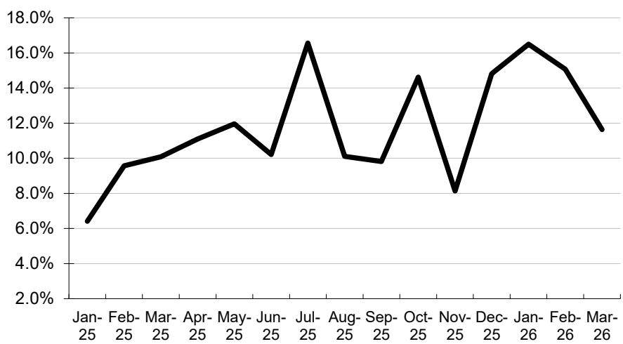

line

| Month   | Value  |
| ------- | ------ |
| Jan-25  | 6.0%   |
| Feb-25  | 9.5%   |
| Mar-25  | 10.0%  |
| Apr-25  | 11.0%  |
| May-25  | 12.0%  |
| Jun-25  | 10.0%  |
| Jul-25  | 16.5%  |
| Aug-25  | 10.0%  |
| Sep-25  | 9.5%   |
| Oct-25  | 14.5%  |
| Nov-25  | 8.0%   |
| Dec-25  | 14.5%  |
| Jan-26  | 16.5%  |
| Feb-26  | 15.0%  |
| Mar-26  | 11.5%  |

Source : Marklines

# By Automaker

Figure 47: SAIC European market volume by country 

<table><tr><td colspan="6">SAIC European market volume by country</td></tr><tr><td>(unit)</td><td>Mar-26</td><td>YoY</td><td>MoM</td><td>3M 2026</td><td>YoY</td></tr><tr><td>SAIC European sales</td><td>39,836</td><td>2.1%</td><td>80.3%</td><td>81,036</td><td>2.6%</td></tr><tr><td>UK</td><td>15,720</td><td>-1.0%</td><td>410.6%</td><td>23,878</td><td>-3.2%</td></tr><tr><td>Italy</td><td>5,904</td><td>-10.3%</td><td>7.3%</td><td>15,647</td><td>1.9%</td></tr><tr><td>Spain</td><td>5,026</td><td>-9.0%</td><td>35.4%</td><td>11,057</td><td>-14.5%</td></tr><tr><td>France</td><td>2,864</td><td>1.3%</td><td>34.1%</td><td>6,129</td><td>-2.9%</td></tr><tr><td>Germany</td><td>2,559</td><td>21.7%</td><td>18.7%</td><td>6,172</td><td>12.2%</td></tr><tr><td>Poland</td><td>1,841</td><td>47.5%</td><td>34.8%</td><td>4,137</td><td>35.7%</td></tr><tr><td>Portugal</td><td>969</td><td>171.4%</td><td>11.9%</td><td>2,507</td><td>182.0%</td></tr><tr><td>Belgium</td><td>864</td><td>96.4%</td><td>45.9%</td><td>1,763</td><td>49.7%</td></tr><tr><td>Austria</td><td>829</td><td>16.6%</td><td>262.0%</td><td>1,292</td><td>25.3%</td></tr><tr><td>Switzerland</td><td>531</td><td>68.6%</td><td>47.9%</td><td>1,083</td><td>88.7%</td></tr><tr><td>Greece</td><td>416</td><td>20.2%</td><td>116.7%</td><td>1,111</td><td>-2.7%</td></tr><tr><td>Czech Republic</td><td>353</td><td>-36.9%</td><td>61.9%</td><td>742</td><td>-43.7%</td></tr><tr><td>Turkiye</td><td>312</td><td>14.3%</td><td>61.7%</td><td>637</td><td>7.8%</td></tr><tr><td>Denmark</td><td>310</td><td>-3.1%</td><td>13.6%</td><td>882</td><td>77.1%</td></tr><tr><td>Romania</td><td>258</td><td>31.6%</td><td>73.2%</td><td>499</td><td>-22.0%</td></tr></table>

Source : Marklines

Figure 48: SAIC European market volume breakdown by country   
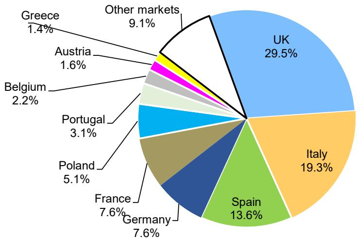

pie

| Country/Market | Percentage (%) |
| :--- | :--- |
| UK | 29.5 |
| Italy | 19.3 |
| Spain | 13.6 |
| Germany | 7.6 |
| France | 7.6 |
| Poland | 5.1 |
| Portugal | 3.1 |
| Belgium | 2.2 |
| Austria | 1.6 |
| Greece | 1.4 |
| Other markets | 9.1 |

Source : Marklines

Figure 49: SAIC European market volume trend   
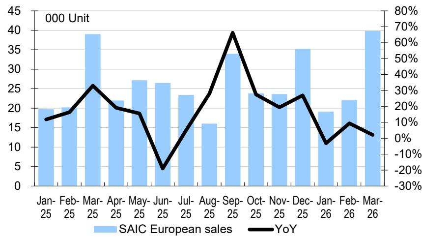

bar_line

| Month | SAIC European sales (000 Unit) | YoY (%) |
| :--- | :--- | :--- |
| Jan-25 | 19.5 | 17 |
| Feb-25 | 20.0 | 18 |
| Mar-25 | 39.0 | 26 |
| Apr-25 | 22.0 | 20 |
| May-25 | 27.0 | 18 |
| Jun-25 | 26.5 | -22 |
| Jul-25 | 23.5 | 14 |
| Aug-25 | 16.0 | 24 |
| Sep-25 | 34.0 | 69 |
| Oct-25 | 23.5 | 27 |
| Nov-25 | 23.5 | 19 |
| Dec-25 | 35.5 | 24 |
| Jan-26 | 19.0 | -3 |
| Feb-26 | 22.0 | 16 |
| Mar-26 | 40.0 | 13 |

Source : Marklines

Figure 50: SAIC European market share trend   
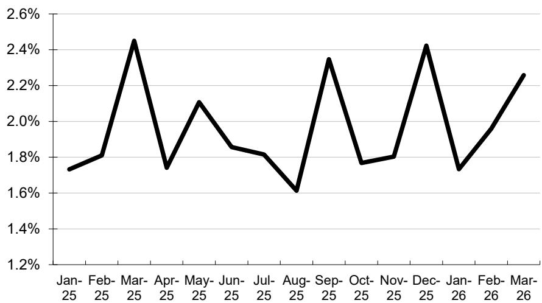

line

| Month   | Value  |
| ------- | ------ |
| Jan-25  | 1.7%   |
| Feb-25  | 1.8%   |
| Mar-25  | 2.4%   |
| Apr-25  | 1.7%   |
| May-25  | 2.1%   |
| Jun-25  | 1.8%   |
| Jul-25  | 1.8%   |
| Aug-25  | 1.6%   |
| Sep-25  | 2.3%   |
| Oct-25  | 1.7%   |
| Nov-25  | 1.8%   |
| Dec-25  | 2.4%   |
| Jan-26  | 1.7%   |
| Feb-26  | 1.9%   |
| Mar-26  | 2.3%   |

Source : Marklines

Figure 51: Chery European market volume by country 

<table><tr><td colspan="6">Chery European market volume by country</td></tr><tr><td>(unit)</td><td>Mar-26</td><td>YoY</td><td>MoM</td><td>3M 2026</td><td>YoY</td></tr><tr><td>Chery European sales</td><td>50,256</td><td>83.2%</td><td>87.2%</td><td>105,846</td><td>45.6%</td></tr><tr><td>UK</td><td>22,495</td><td>481.6%</td><td>376.6%</td><td>36,038</td><td>460.6%</td></tr><tr><td>Russia</td><td>8,740</td><td>-44.1%</td><td>31.3%</td><td>22,451</td><td>-53.1%</td></tr><tr><td>Spain</td><td>5,866</td><td>158.6%</td><td>11.8%</td><td>14,785</td><td>162.2%</td></tr><tr><td>Italy</td><td>3,534</td><td>258.1%</td><td>19.4%</td><td>8,989</td><td>337.2%</td></tr><tr><td>Poland</td><td>3,179</td><td>232.9%</td><td>23.6%</td><td>7,448</td><td>211.0%</td></tr><tr><td>Turkiye</td><td>3,101</td><td>-14.3%</td><td>44.1%</td><td>8,454</td><td>2.5%</td></tr><tr><td>Czech Republic</td><td>551</td><td>3343.8%</td><td>1.5%</td><td>1,298</td><td>8012.5%</td></tr><tr><td>Greece</td><td>526</td><td></td><td>103.9%</td><td>1,052</td><td>17433.3%</td></tr><tr><td>Netherlands</td><td>490</td><td></td><td>23.1%</td><td>1,302</td><td></td></tr><tr><td>Austria</td><td>397</td><td></td><td>108.9%</td><td>851</td><td></td></tr><tr><td>Romania</td><td>377</td><td></td><td>5.9%</td><td>961</td><td></td></tr></table>

Source : Marklines

Figure 52: Chery European market volume breakdown   
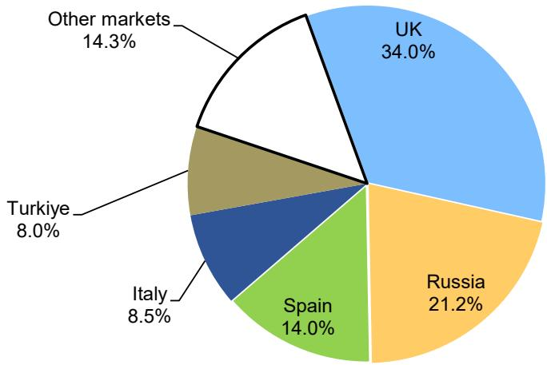

pie

| Category | Percentage (%) |
| :--- | :--- |
| UK | 34.0 |
| Russia | 21.2 |
| Spain | 14.0 |
| Italy | 8.5 |
| Türkiye | 8.0 |
| Other markets | 14.3 |

Source : Marklines

Figure 53: Chery European market volume trend   
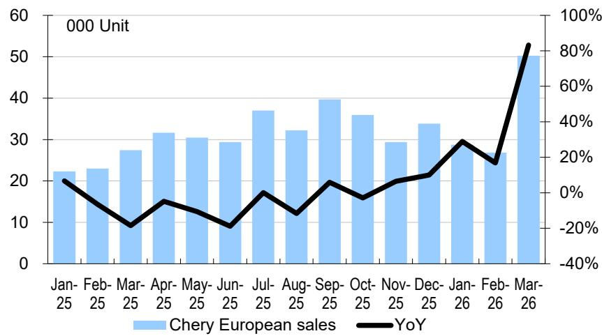

bar_line

| Month   | Chery European sales (000 Unit) | YoY (%) |
|---------|----------------------------------|---------|
| Jan-25  | 22                               | 18      |
| Feb-25  | 23                               | 14      |
| Mar-25  | 27                               | -10     |
| Apr-25  | 31                               | 15      |
| May-25  | 30                               | 12      |
| Jun-25  | 29                               | -10     |
| Jul-25  | 37                               | 17      |
| Aug-25  | 32                               | -10     |
| Sep-25  | 39                               | 19      |
| Oct-25  | 36                               | -5      |
| Nov-25  | 29                               | 10      |
| Dec-25  | 34                               | 15      |
| Jan-26  | 30                               | 28      |
| Feb-26  | 27                               | -10     |
| Mar-26  | 51                               | 85      |

Source : Marklines

Figure 54: Chery European market share trend   
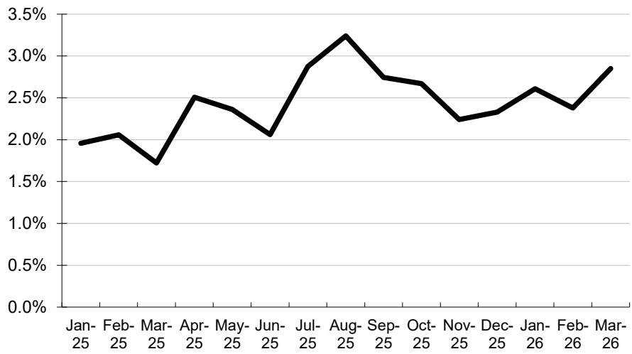

line

| Month   | Value  |
| ------- | ------ |
| Jan-25  | 1.9%   |
| Feb-25  | 2.0%   |
| Mar-25  | 1.7%   |
| Apr-25  | 2.5%   |
| May-25  | 2.4%   |
| Jun-25  | 2.0%   |
| Jul-25  | 2.9%   |
| Aug-25  | 3.2%   |
| Sep-25  | 2.7%   |
| Oct-25  | 2.6%   |
| Nov-25  | 2.2%   |
| Dec-25  | 2.3%   |
| Jan-26  | 2.6%   |
| Feb-26  | 2.4%   |
| Mar-26  | 2.8%   |

Source : Marklines

Figure 55: BYD European market volume by country 

<table><tr><td colspan="6">BYD European market volume by country</td></tr><tr><td>(unit)</td><td>Mar-26</td><td>YoY</td><td>MoM</td><td>3M 2026</td><td>YoY</td></tr><tr><td>BYD European sales</td><td>38,364</td><td>112.2%</td><td>100.3%</td><td>79,279</td><td>112.4%</td></tr><tr><td>UK</td><td>15,162</td><td>134.0%</td><td>603.9%</td><td>21,337</td><td>130.1%</td></tr><tr><td>Italy</td><td>5,191</td><td>189.2%</td><td>26.4%</td><td>12,852</td><td>223.6%</td></tr><tr><td>Spain</td><td>4,465</td><td>174.6%</td><td>48.7%</td><td>9,428</td><td>147.5%</td></tr><tr><td>Germany</td><td>3,437</td><td>329.1%</td><td>12.6%</td><td>9,119</td><td>650.5%</td></tr><tr><td>France</td><td>1,530</td><td>132.2%</td><td>55.2%</td><td>3,388</td><td>108.2%</td></tr><tr><td>Austria</td><td>1,112</td><td>58.0%</td><td>53.2%</td><td>2,484</td><td>52.4%</td></tr><tr><td>Poland</td><td>973</td><td>317.6%</td><td>111.5%</td><td>2,041</td><td>284.4%</td></tr><tr><td>Turkiye</td><td>833</td><td>-71.0%</td><td>-41.7%</td><td>6,127</td><td>-25.4%</td></tr><tr><td>Norway</td><td>782</td><td>139.1%</td><td>520.6%</td><td>958</td><td>29.3%</td></tr><tr><td>Netherlands</td><td>777</td><td>187.8%</td><td>143.6%</td><td>1,464</td><td>92.6%</td></tr><tr><td>Portugal</td><td>745</td><td>44.4%</td><td>59.5%</td><td>1,695</td><td>34.5%</td></tr><tr><td>Belgium</td><td>630</td><td>85.3%</td><td>28.8%</td><td>1,595</td><td>96.9%</td></tr><tr><td>Ireland</td><td>596</td><td>81.2%</td><td>45.7%</td><td>2,031</td><td>96.6%</td></tr><tr><td>Switzerland</td><td>452</td><td>679.3%</td><td>128.3%</td><td>794</td><td>987.7%</td></tr><tr><td>Denmark</td><td>299</td><td>-21.3%</td><td>80.1%</td><td>554</td><td>5.7%</td></tr></table>

Source : Marklines

Figure 56: BYD European market volume breakdown   
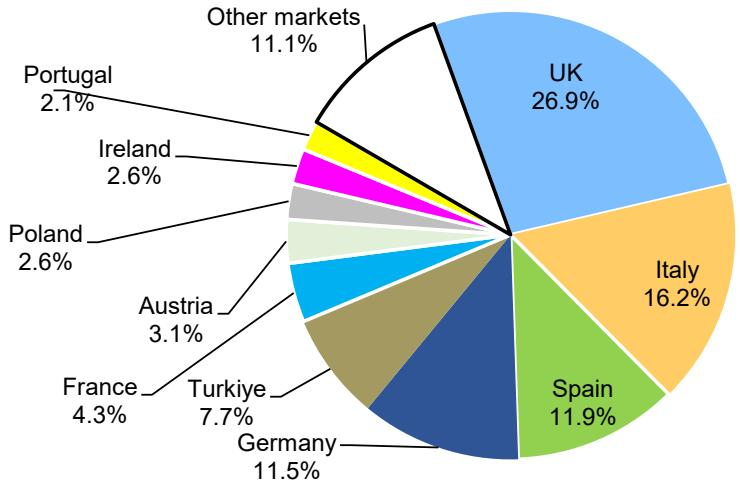

pie

| Country/Region | Percentage (%) |
| :--- | :--- |
| UK | 26.9 |
| Italy | 16.2 |
| Spain | 11.9 |
| Germany | 11.5 |
| Türkiye | 7.7 |
| France | 4.3 |
| Austria | 3.1 |
| Poland | 2.6 |
| Ireland | 2.6 |
| Portugal | 2.1 |
| Other markets | 11.1 |

Source : Marklines

Figure 57: BYD European market volume trend   
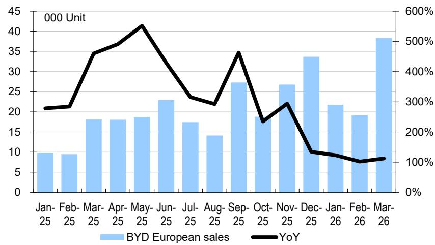

bar_line

| Month   | BYD European sales | YoY    |
|---------|--------------------|--------|
| Jan-25  | 10                 | 200%   |
| Feb-25  | 10                 | 200%   |
| Mar-25  | 18                 | 350%   |
| Apr-25  | 18                 | 400%   |
| May-25  | 19                 | 500%   |
| Jun-25  | 23                 | 400%   |
| Jul-25  | 17                 | 300%   |
| Aug-25  | 14                 | 250%   |
| Sep-25  | 27                 | 450%   |
| Oct-25  | 17                 | 300%   |
| Nov-25  | 27                 | 350%   |
| Dec-25  | 34                 | 150%   |
| Jan-26  | 22                 | 150%   |
| Feb-26  | 19                 | 100%   |
| Mar-26  | 38                 | 100%   |

Source : Marklines

Figure 58: BYD European market share trend   
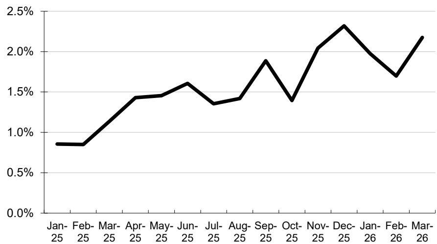

line

| Month   | Value  |
| ------- | ------ |
| Jan-25  | 0.8%   |
| Feb-25  | 0.8%   |
| Mar-25  | 1.4%   |
| Apr-25  | 1.4%   |
| May-25  | 1.5%   |
| Jun-25  | 1.6%   |
| Jul-25  | 1.3%   |
| Aug-25  | 1.4%   |
| Sep-25  | 1.9%   |
| Oct-25  | 1.4%   |
| Nov-25  | 2.1%   |
| Dec-25  | 2.3%   |
| Jan-26  | 2.0%   |
| Feb-26  | 1.7%   |
| Mar-26  | 2.2%   |

Source : Marklines

Figure 59: Leapmotor European market volume by country 

<table><tr><td colspan="6">Leapmotor European market volume by country</td></tr><tr><td>(unit)</td><td>Mar-26</td><td>YoY</td><td>MoM</td><td>3M 2026</td><td>YoY</td></tr><tr><td>Leapmotor European sales</td><td>11,233</td><td>757.5%</td><td>32.2%</td><td>23,989</td><td>687.0%</td></tr><tr><td>Italy</td><td>5,513</td><td>2727.2%</td><td>10.1%</td><td>11,637</td><td>1927.4%</td></tr><tr><td>UK</td><td>1,891</td><td>879.8%</td><td>330.8%</td><td>3,096</td><td>1504.1%</td></tr><tr><td>Germany</td><td>1,388</td><td>318.1%</td><td>27.2%</td><td>3,168</td><td>370.7%</td></tr><tr><td>France</td><td>593</td><td>101.7%</td><td>50.1%</td><td>1,293</td><td>88.5%</td></tr><tr><td>Spain</td><td>388</td><td>446.5%</td><td>40.1%</td><td>893</td><td>263.0%</td></tr><tr><td>Belgium</td><td>251</td><td>483.7%</td><td>25.5%</td><td>578</td><td>318.8%</td></tr><tr><td>Netherlands</td><td>236</td><td>2850.0%</td><td>-17.2%</td><td>657</td><td>519.8%</td></tr><tr><td>Poland</td><td>182</td><td>225.0%</td><td>25.5%</td><td>568</td><td>914.3%</td></tr><tr><td>Austria</td><td>180</td><td>757.1%</td><td>45.2%</td><td>399</td><td>827.9%</td></tr><tr><td>Switzerland</td><td>123</td><td>261.8%</td><td>6.0%</td><td>367</td><td>205.8%</td></tr><tr><td>Portugal</td><td>99</td><td>4850.0%</td><td>20.7%</td><td>239</td><td>11850.0%</td></tr><tr><td>Denmark</td><td>98</td><td></td><td>4.3%</td><td>310</td><td></td></tr><tr><td>Slovenia</td><td>85</td><td></td><td>-7.6%</td><td>253</td><td></td></tr></table>

Source : Marklines

Figure 60: Leapmotor European market volume breakdown   
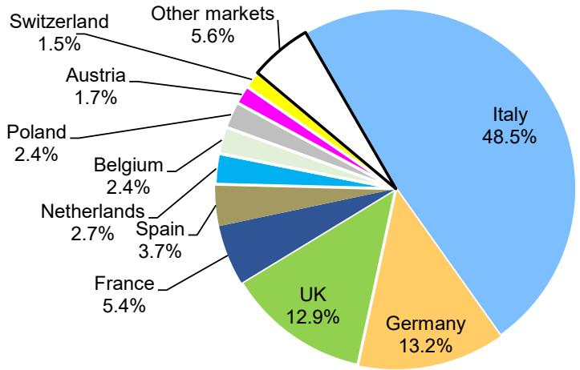

pie

| Country/Market | Percentage (%) |
| :--- | :--- |
| Italy | 48.5 |
| Germany | 13.2 |
| UK | 12.9 |
| France | 5.4 |
| Spain | 3.7 |
| Netherlands | 2.7 |
| Belgium | 2.4 |
| Poland | 2.4 |
| Austria | 1.7 |
| Switzerland | 1.5 |
| Other markets | 5.6 |

Source : Marklines

Figure 61: Leapmotor European market volume trend   
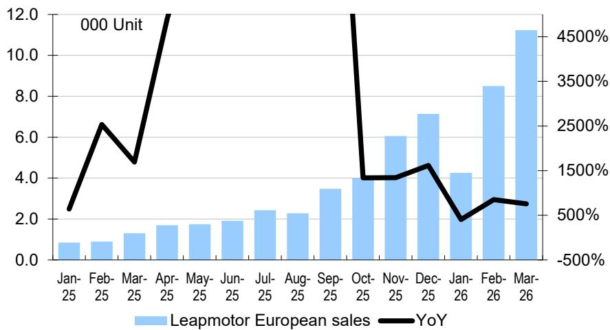

bar_line

| Month | Leapmotor European sales (in 1000 Units) | YoY (%) |
|---|---|---|
| Jan-25 | 0.8 | 2.3 |
| Feb-25 | 0.9 | 6.7 |
| Mar-25 | 1.3 | 4.7 |
| Apr-25 | 1.7 | 12.0 |
| May-25 | 1.7 | - |
| Jun-25 | 1.9 | - |
| Jul-25 | 2.4 | - |
| Aug-25 | 2.2 | - |
| Sep-25 | 3.5 | - |
| Oct-25 | 4.0 | 12.0 |
| Nov-25 | 6.1 | 1.4 |
| Dec-25 | 7.2 | 1.5 |
| Jan-26 | 4.2 | 0.8 |
| Feb-26 | 8.5 | 1.9 |
| Mar-26 | 11.3 | 1.6 |

Source : Marklines

Figure 62: Leapmotor European market share trend   
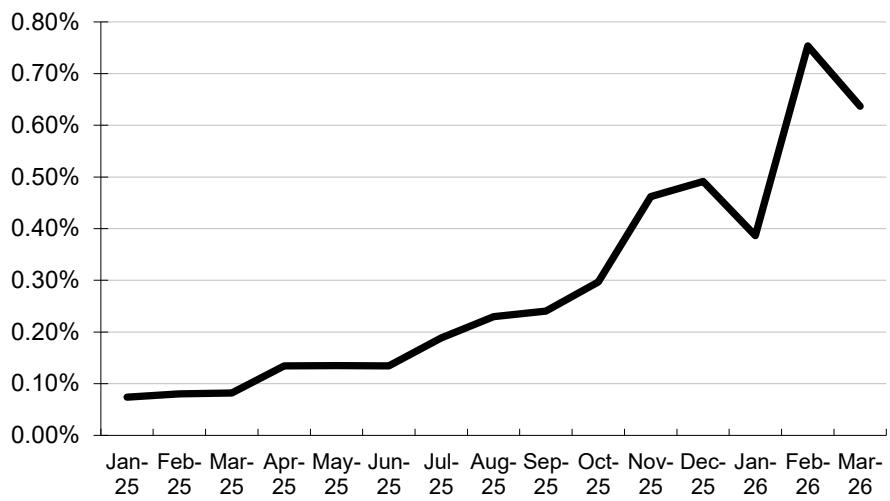

line

| Month   | Value  |
| ------- | ------ |
| Jan-25  | 0.07%  |
| Feb-25  | 0.08%  |
| Mar-25  | 0.08%  |
| Apr-25  | 0.13%  |
| May-25  | 0.13%  |
| Jun-25  | 0.13%  |
| Jul-25  | 0.19%  |
| Aug-25  | 0.23%  |
| Sep-25  | 0.24%  |
| Oct-25  | 0.30%  |
| Nov-25  | 0.46%  |
| Dec-25  | 0.49%  |
| Jan-26  | 0.38%  |
| Feb-26  | 0.75%  |
| Mar-26  | 0.63%  |

Source : Marklines

Figure 63: XPeng European market volume by country 

<table><tr><td colspan="6">Xpeng European market volume by country</td></tr><tr><td>(unit)</td><td>Mar-26</td><td>YoY</td><td>MoM</td><td>3M 2026</td><td>YoY</td></tr><tr><td>Xpeng European sales</td><td>3,093</td><td>117.7%</td><td>39.2%</td><td>7,089</td><td>109.5%</td></tr><tr><td>Germany</td><td>549</td><td>211.9%</td><td>65.9%</td><td>1,207</td><td>179.4%</td></tr><tr><td>Norway</td><td>460</td><td>62.5%</td><td>18.6%</td><td>888</td><td>32.1%</td></tr><tr><td>France</td><td>400</td><td>101.0%</td><td>13.3%</td><td>1,150</td><td>127.3%</td></tr><tr><td>Denmark</td><td>336</td><td>30.2%</td><td>-3.2%</td><td>932</td><td>52.5%</td></tr><tr><td>UK</td><td>331</td><td>819.4%</td><td>1404.5%</td><td>353</td><td>880.6%</td></tr><tr><td>Belgium</td><td>224</td><td>88.2%</td><td>37.4%</td><td>522</td><td>91.2%</td></tr><tr><td>Portugal</td><td>154</td><td>136.9%</td><td>29.4%</td><td>373</td><td>113.1%</td></tr><tr><td>Spain</td><td>146</td><td>247.6%</td><td>30.4%</td><td>372</td><td>244.4%</td></tr><tr><td>Netherlands</td><td>103</td><td>18.4%</td><td>41.1%</td><td>230</td><td>-6.5%</td></tr><tr><td>Sweden</td><td>88</td><td>-2.2%</td><td>49.2%</td><td>187</td><td>-7.9%</td></tr><tr><td>Ireland</td><td>77</td><td>102.6%</td><td>-17.2%</td><td>272</td><td>345.9%</td></tr><tr><td>Poland</td><td>47</td><td>370.0%</td><td>176.5%</td><td>112</td><td>1020.0%</td></tr></table>

Source : Marklines

Figure 64: XPeng European market volume breakdown   
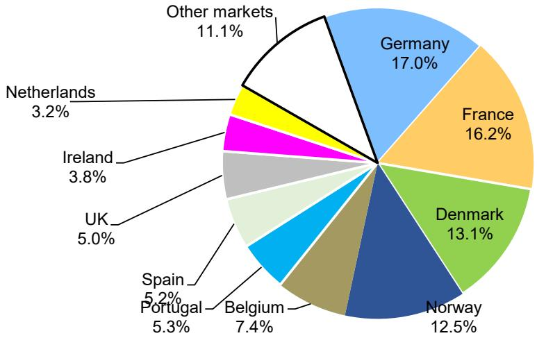

pie

| Country/Region | Percentage (%) |
| :--- | :--- |
| Germany | 17.0 |
| France | 16.2 |
| Denmark | 13.1 |
| Norway | 12.5 |
| Belgium | 7.4 |
| Spain | 5.2 |
| Portugal | 5.3 |
| UK | 5.0 |
| Ireland | 3.8 |
| Netherlands | 3.2 |
| Other markets | 11.1 |

Source : Marklines

Figure 65: XPeng European market volume trend   
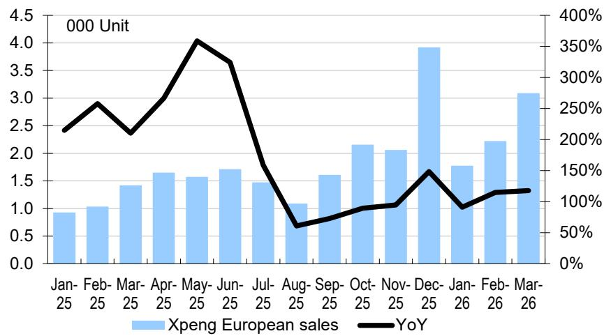

bar_line

| Month | Xpeng European sales (in 1000 Units) | YoY (%) |
|---|---|---|
| Jan-25 | 0.9 | 240 |
| Feb-25 | 1.0 | 280 |
| Mar-25 | 1.4 | 230 |
| Apr-25 | 1.6 | 290 |
| May-25 | 1.55 | 370 |
| Jun-25 | 1.7 | 340 |
| Jul-25 | 1.45 | 180 |
| Aug-25 | 1.05 | 60 |
| Sep-25 | 1.6 | 80 |
| Oct-25 | 2.15 | 90 |
| Nov-25 | 2.05 | 95 |
| Dec-25 | 3.9 | 160 |
| Jan-26 | 1.75 | 90 |
| Feb-26 | 2.2 | 115 |
| Mar-26 | 3.05 | 120 |

Source : Marklines

Figure 66: XPeng European market share trend   
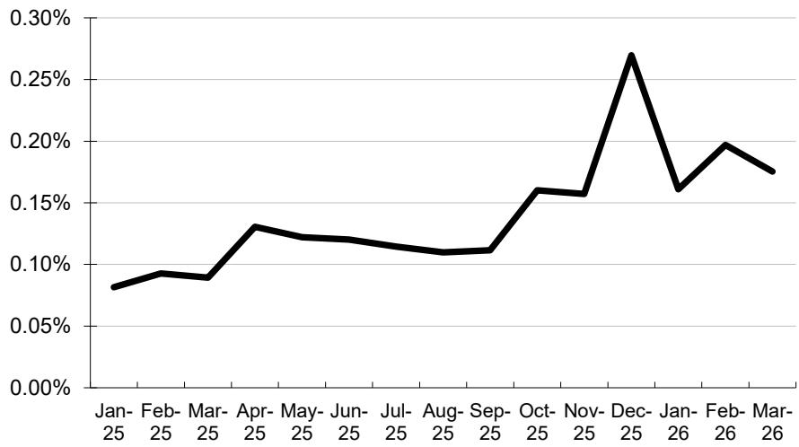

line

| Month   | Value  |
| ------- | ------ |
| Jan-25  | 0.08%  |
| Feb-25  | 0.09%  |
| Mar-25  | 0.09%  |
| Apr-25  | 0.13%  |
| May-25  | 0.12%  |
| Jun-25  | 0.12%  |
| Jul-25  | 0.11%  |
| Aug-25  | 0.11%  |
| Sep-25  | 0.11%  |
| Oct-25  | 0.16%  |
| Nov-25  | 0.16%  |
| Dec-25  | 0.27%  |
| Jan-26  | 0.16%  |
| Feb-26  | 0.20%  |
| Mar-26  | 0.18%  |

Source : Marklines

Figure 67: Geely European market volume by country 

<table><tr><td colspan="6">Geely European market volume by country</td></tr><tr><td>(unit)</td><td>Mar-26</td><td>YoY</td><td>MoM</td><td>3M 2026</td><td>YoY</td></tr><tr><td>Geely European sales</td><td>17,218</td><td>86.9%</td><td>36.2%</td><td>41,111</td><td>50.4%</td></tr><tr><td>Russia</td><td>12,603</td><td>52.0%</td><td>19.8%</td><td>32,246</td><td>28.4%</td></tr><tr><td>UK</td><td>1,305</td><td></td><td>539.7%</td><td>1,595</td><td></td></tr><tr><td>Italy</td><td>691</td><td>2059.4%</td><td>96.3%</td><td>1,437</td><td>1206.4%</td></tr><tr><td>Spain</td><td>480</td><td>416.1%</td><td>162.3%</td><td>1,168</td><td>354.5%</td></tr><tr><td>Netherlands</td><td>363</td><td>44.0%</td><td>15.6%</td><td>1,017</td><td>84.9%</td></tr><tr><td>Sweden</td><td>315</td><td>60.7%</td><td>64.9%</td><td>643</td><td>75.7%</td></tr><tr><td>Norway</td><td>308</td><td>388.9%</td><td>182.6%</td><td>448</td><td>239.4%</td></tr><tr><td>Denmark</td><td>255</td><td></td><td>59.4%</td><td>575</td><td></td></tr><tr><td>Belgium</td><td>161</td><td>705.0%</td><td>73.1%</td><td>309</td><td>735.1%</td></tr><tr><td>Germany</td><td>144</td><td>4700.0%</td><td>61.8%</td><td>294</td><td>716.7%</td></tr><tr><td>Poland</td><td>132</td><td></td><td>63.0%</td><td>263</td><td>26200.0%</td></tr><tr><td>Romania</td><td>106</td><td>112.0%</td><td>39.5%</td><td>254</td><td>117.1%</td></tr><tr><td>Croatia</td><td>84</td><td>-22.2%</td><td>61.5%</td><td>172</td><td>-24.6%</td></tr><tr><td>Switzerland</td><td>82</td><td></td><td>90.7%</td><td>167</td><td></td></tr></table>

Source : Marklines

Figure 68: Geely European market volume breakdown   
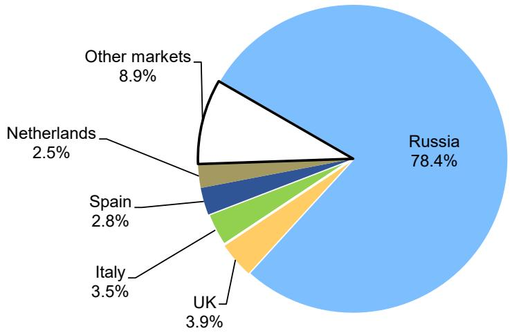

pie

| Category | Percentage (%) |
| :--- | :--- |
| Russia | 78.4 |
| UK | 3.9 |
| Italy | 3.5 |
| Spain | 2.8 |
| Netherlands | 2.5 |
| Other markets | 8.9 |

Source : Marklines

Figure 69: Geely European market volume trend   
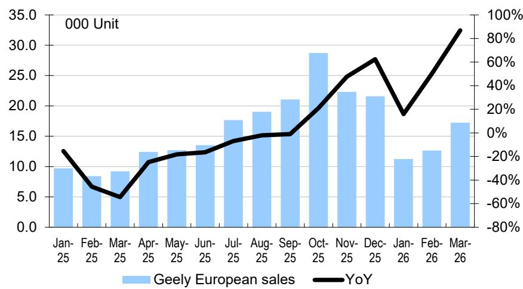

bar_line

| Month | Geely European sales (in 000 Unit) | YoY (%) |
| :--- | :--- | :--- |
| Jan-25 | 10.0 | 12.5 |
| Feb-25 | 8.5 | -35.0 |
| Mar-25 | 9.5 | -55.0 |
| Apr-25 | 12.5 | 10.0 |
| May-25 | 13.0 | 11.0 |
| Jun-25 | 13.5 | 11.5 |
| Jul-25 | 17.5 | 14.0 |
| Aug-25 | 19.0 | 15.0 |
| Sep-25 | 21.0 | 15.5 |
| Oct-25 | 29.0 | 28.0 |
| Nov-25 | 22.5 | 48.0 |
| Dec-25 | 21.5 | 68.0 |
| Jan-26 | 11.0 | 17.0 |
| Feb-26 | 12.5 | 40.0 |
| Mar-26 | 17.0 | 90.0 |

Source : Marklines

Figure 70: Geely European market share trend   
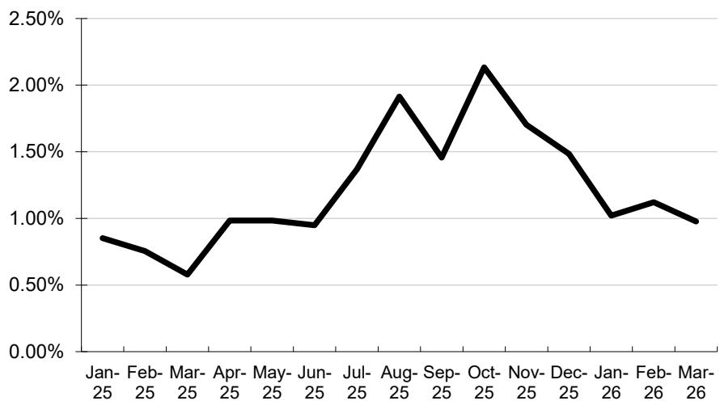

line

| Month   | Value  |
| ------- | ------ |
| Jan-25  | 0.85%  |
| Feb-25  | 0.75%  |
| Mar-25  | 0.55%  |
| Apr-25  | 1.00%  |
| May-25  | 1.00%  |
| Jun-25  | 0.95%  |
| Jul-25  | 1.35%  |
| Aug-25  | 1.90%  |
| Sep-25  | 1.45%  |
| Oct-25  | 2.15%  |
| Nov-25  | 1.70%  |
| Dec-25  | 1.50%  |
| Jan-26  | 1.00%  |
| Feb-26  | 1.10%  |
| Mar-26  | 0.95%  |

Source : Marklines

Figure 71: Great Wall European market volume by country 

<table><tr><td colspan="6">Great Wall Motor European market volume by country</td></tr><tr><td>(unit)</td><td>Mar-26</td><td>YoY</td><td>MoM</td><td>3M 2026</td><td>YoY</td></tr><tr><td>GWM European sales</td><td>16,422</td><td>44.5%</td><td>43.2%</td><td>39,859</td><td>7.9%</td></tr><tr><td>Russia</td><td>16,243</td><td>45.5%</td><td>42.8%</td><td>39,529</td><td>9.3%</td></tr><tr><td>UK</td><td>94</td><td>224.1%</td><td>1242.9%</td><td>109</td><td>26.7%</td></tr><tr><td>Bulgaria</td><td>52</td><td>40.5%</td><td>0.0%</td><td>133</td><td>46.2%</td></tr><tr><td>Germany</td><td>33</td><td>-75.4%</td><td>17.9%</td><td>87</td><td>-84.8%</td></tr><tr><td>Austria</td><td></td><td></td><td></td><td></td><td></td></tr></table>

Source : Marklines

Figure 73: Great Wall European market volume trend   
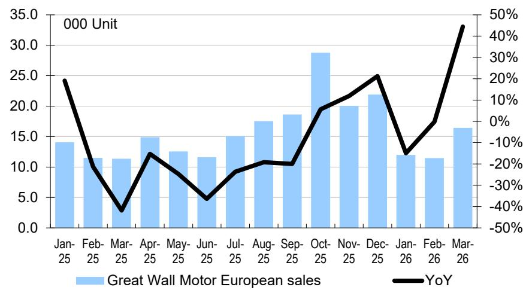

bar_line

| Month | Great Wall Motor European sales (in 1000 Units) | YoY (%) |
|---|---|---|
| Jan-25 | 14.0 | 24.5 |
| Feb-25 | 11.0 | -18.0 |
| Mar-25 | 11.0 | -39.0 |
| Apr-25 | 15.0 | -12.0 |
| May-25 | 12.5 | -17.0 |
| Jun-25 | 11.5 | -4.0 |
| Jul-25 | 15.0 | -9.0 |
| Aug-25 | 17.5 | -10.0 |
| Sep-25 | 18.5 | -10.0 |
| Oct-25 | 28.5 | 10.0 |
| Nov-25 | 20.0 | 16.0 |
| Dec-25 | 22.0 | 24.0 |
| Jan-26 | 12.0 | -13.0 |
| Feb-26 | 11.5 | 0.0 |
| Mar-26 | 16.5 | 44.0 |

Source : Marklines

Figure 72: Great Wall European market volume breakdown   
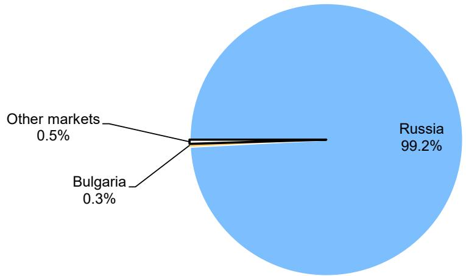

pie

| Category | Percentage (%) |
| :--- | :--- |
| Russia | 99.2 |
| Bulgaria | 0.3 |
| Other markets | 0.5 |

Source : Marklines

Figure 74: Great Wall European market share trend   
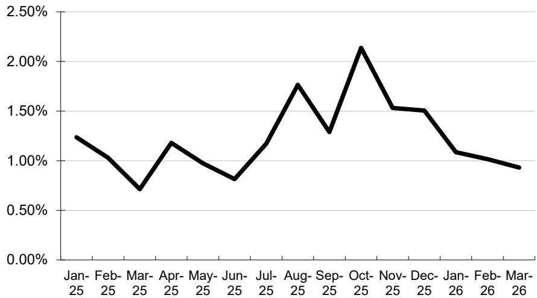

line

| Month   | Value  |
| ------- | ------ |
| Jan-25  | 1.25%  |
| Feb-25  | 1.05%  |
| Mar-25  | 0.70%  |
| Apr-25  | 1.18%  |
| May-25  | 0.95%  |
| Jun-25  | 0.80%  |
| Jul-25  | 1.15%  |
| Aug-25  | 1.75%  |
| Sep-25  | 1.30%  |
| Oct-25  | 2.15%  |
| Nov-25  | 1.50%  |
| Dec-25  | 1.50%  |
| Jan-26  | 1.08%  |
| Feb-26  | 1.00%  |
| Mar-26  | 0.95%  |

Source : Marklines

# Appendix 1

# Important Disclosures

\*Other information available upon request

\*Prices are current as of the end of the previous trading session unless otherwise indicated and are sourced from local exchanges via Reuters, Bloomberg and other vendors. Other information is sourced from DB, subject companies, and other sources. For disclosures pertaining to recommendations or estimates made on securities other than the primary subject of this research, please see the most recently published company report or visit our global disclosure look-up page on our website at https://research.db.com/Research/Disclosures/EquityResearchDisclosures. Aside from within this report, important risk and conflict disclosures can also be found at https://research.db.com/Research/Disclosures/Disclaimer. Investors are strongly encouraged to review this information before investing.

# Analyst Certification

The views expressed in this report accurately reflect the personal views of the undersigned lead analyst about the subject issuers and the securities of those issuers. In addition, the undersigned lead analyst has not and will not receive any compensation for providing a specific recommendation or view in this report. Bin Wang.

Equity rating dispersion and banking relationships   
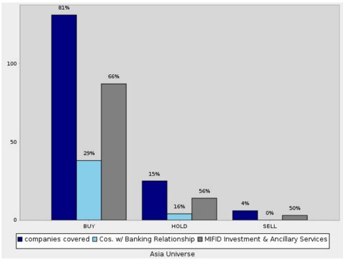

bar

| Category | companies covered (%) | Cos. w/ Banking Relationship (%) | MIFID Investment & Ancillary Services (%) |
|---|---|---|---|
| BUY | 81 | 29 | 66 |
| HOLD | 15 | 16 | 56 |
| SELL | 4 | 0 | 50 |
Asia Universe

# Equity Rating and Dispersion Key

The Equity Rating Dispersion Chart depicts the following:

The proportion of recommendations that are rated "buy", "sell" and "hold" over the previous 12 months. This is shown for securities issued in the stated region e.g. "Europe Universe". See rating definitions below. This is represented by the "Companies Covered" bars in the chart. The percentage value displayed above the bar is the proportion as a percentage. E.g. 50% above the "buy" / "Companies Covered" bar means that 50% of DB's equity research covered companies over the past 12 months have a "buy" rating.

Next to each of the three respective bars showing the proportion of "buy", "sell" and "hold" recommendations we provide two additional bars to show:

\- The proportion of "buy", "sell" or "hold recommendations where DB and or/Affiliates provided MIFID Investment or Ancillary Services in the past 12 months. This is represented in the "MIFID Investment and Ancillary Services" bar. The percentage value displayed above the bar shows the proportion of Companies Covered with the given rating where DB has also provided MIFID Investment and Ancillary Services in the past 12 months. E.g. 50% above the "Cos. w/ MIFID Investment and Ancillary Services" bar means 50% of the Companies Covered with the rating stated have also received MIFID Investment and Ancillary Services from DB.

\- The proportion of "buy" (or "sell" or "hold") recommendations where DB and or/Affiliates has provided Investment Banking services in the past 12 months for which it has received compensation. The percentage value displayed above the bar shows the proportion of Companies Covered with the stated rating where DB has also provided Investment Banking services in the past 12 months. E.g. 50% above the "Cos. w/ Investment Banking relationship" bar means 50% of the Companies Covered with the rating stated also have an Investment Banking Relationship with DB.

Buy: Based on a current 12-month view of TSR, we recommend that investors buy the stock.

Sell: Based on a current 12-month view of TSR, we recommend that investors sell the stock.

Hold: We take a neutral view on the stock 12-months out and, based on this time horizon, do not recommend either a Buy or Sell.

TSR = Total Shareholder Return. Percentage change in share price from current price to projected target price plus projected dividend yield

Newly issued research recommendations and target prices supersede previously published research.

# Additional Information

The information and opinions in this report were prepared by DB AG or one of its affiliates (collectively 'DB'). Though the information herein is believed to be reliable and has been obtained from public sources believed to be reliable, DB makes no representation as to its accuracy or completeness. Hyperlinks to third-party websites in this report are provided for reader convenience only. DB neither endorses the content nor is responsible for the accuracy or security controls of those websites.

If you use the services of DB in connection with a purchase or sale of a security that is discussed in this report, or is included or discussed in another communication (oral or written) from a DB analyst, DB may act as principal for its own account or as agent for another person.

DB may consider this report in deciding to trade as principal. It may also engage in transactions, for its own account or with customers, in a manner inconsistent with the views taken in this research report. Others within DB, including strategists, sales staff and other analysts, may take views that are inconsistent with those taken in this research report. DB issues a variety of research products, including fundamental analysis, equity-linked analysis, quantitative analysis and trade ideas. Recommendations contained in one type of communication may differ from recommendations contained in others, whether as a result of differing time horizons, methodologies, perspectives or otherwise. DB and/or its affiliates may also be holding debt or equity securities of the issuers it writes on. Analysts are paid in part based on the profitability of DB AG and its affiliates, which includes investment banking, trading and principal trading revenues.

Opinions, estimates and projections constitute the current judgment of the author as of the date of this report. They do not necessarily reflect the opinions of DB and are subject to change without notice. DB provides liquidity for buyers and sellers of securities issued by the companies it covers. DB analysts sometimes have shorter-term trade ideas that may be inconsistent with DB's existing longer-term ratings. Some trade ideas for equities are listed as Catalyst Calls on the Research Website (https://research.db.com/Research/), and can be found on the general coverage list and also on the covered company's page. A Catalyst Call represents a high-conviction belief by an analyst that a stock will outperform or underperform the market and/or a specified sector over a time frame of no less than two weeks and no more than three months. In addition to Catalyst Calls, analysts may occasionally discuss with our clients, and with DB salespersons and traders, trading strategies or ideas that reference catalysts or events that may have a near-term or medium-term impact on the market price of the securities discussed in this report, which impact may be directionally counter to the analysts' current 12-month view of total return or investment return as described herein. DB has no obligation to update, modify or amend this report or to otherwise notify a recipient thereof if an opinion, forecast or estimate changes or becomes inaccurate. Coverage and the frequency of changes in market conditions and in both general and company-specific economic prospects make it difficult to update research at defined intervals. Updates are at the sole discretion of the coverage analyst or of the Research Department Management, and the majority of reports are published at irregular intervals. This report is provided for informational purposes only and does not take into account the particular investment objectives, financial situations, or needs of individual clients. It is not an offer or a solicitation of an offer to buy or sell any financial instruments or to participate in any particular trading strategy. Target prices are inherently imprecise and a product of the analyst's judgment. The financial instruments discussed in this report may not be suitable for all investors, and investors must make their own informed investment decisions. Prices and availability of financial instruments are subject to change without notice, and investment transactions can lead to losses as a result of price fluctuations and other factors. If a financial instrument is denominated in a currency other than an investor's currency, a change in exchange rates may adversely affect the investment. Past performance is not necessarily indicative of future results. Performance calculations exclude transaction costs, unless otherwise indicated. Unless otherwise indicated, prices are current as of the end of the previous trading session and are sourced from local exchanges via Reuters, Bloomberg and other vendors. Data is also sourced from DB, subject companies, and other parties. Artificial intelligence tools may be used in the preparation of this material, including but not limited to assist in fact-finding, data analysis, pattern recognition, content drafting and editorial corrections pertaining to research material.

The DB Department is independent of other business divisions of the Bank. Details regarding our organizational arrangements and information barriers we have to prevent and avoid conflicts of interest with respect to our research are available on our website (https://research.db.com/Research/) under Disclaimer.

Macroeconomic fluctuations often account for most of the risks associated with exposures to instruments that promise to pay fixed or variable interest rates. For an investor who is long fixed-rate instruments (thus receiving these cash flows), increases in interest rates naturally lift the discount factors applied to the expected cash flows and thus cause a loss. The longer the maturity of a certain cash flow and the higher the move in the discount factor, the higher will be the loss. Upside surprises in inflation, fiscal funding needs, and FX depreciation rates are among the most common adverse macroeconomic shocks to receivers. But counterparty exposure, issuer creditworthiness, client segmentation, regulation (including changes in assets holding limits for different types of investors), changes in tax policies, currency convertibility (which may constrain currency conversion, repatriation of profits and/or liquidation of positions), and settlement issues related to local clearing houses are also important risk factors. The sensitivity of fixed-income instruments to macroeconomic shocks may be mitigated by indexing the contracted cash flows to inflation, to FX depreciation, or to specified interest rates - these are common in emerging markets. The index fixings may - by construction - lag or mis-measure the actual move in the underlying variables they are intended to track. The choice of the proper fixing (or metric) is particularly important in swaps markets, where floating coupon rates (i.e., coupons indexed to a typically short-dated interest rate reference index) are exchanged for fixed coupons. Funding in a currency that differs from the currency in which coupons are denominated carries FX risk. Options on swaps (swaptions) the risks typical to options in addition to the risks related to rates movements.

Derivative transactions involve numerous risks including market, counterparty default and illiquidity risk. The appropriateness of these products for use by investors depends on the investors' own circumstances, including their tax position, their regulatory environment and the nature of their other assets and liabilities; as such, investors should take expert legal and financial advice before entering into any transaction similar to or inspired by the contents of this publication. The risk of loss in futures trading and options, foreign or domestic, can be substantial. As a result of the high degree of leverage obtainable in futures and options trading, losses may be incurred that are greater than the amount of funds initially deposited - up to theoretically unlimited losses. Trading in options involves risk and is not suitable for all investors. Prior to buying or selling an option, investors must review the 'Characteristics and Risks of Standardized Options", at https://www.theocc.com/company-information/documents-and-archives/options-disclosure-document. If you are unable to access the website, please contact your DB representative for a copy of this important document.

Participants in foreign exchange transactions may incur risks arising from several factors, including the following: (i) exchange rates can be volatile and are subject to large fluctuations; (ii) the value of currencies may be affected by numerous market factors, including world and national economic, political and regulatory events, events in equity and debt markets and changes in interest rates; and (iii) currencies may be subject to devaluation or government-imposed exchange controls, which could affect the value of the currency. Investors in securities such as ADRs, whose values are affected by the currency of an underlying security, effectively assume currency risk.

Unless governing law provides otherwise, all transactions should be executed through the DB entity in the investor's home jurisdiction. Aside from within this report, important conflict disclosures can also be found at https://research.db.com/Research/ on each company's research page or under the 'Disclosures' tab. Investors are strongly encouraged to review this information before investing.

DB (which includes DB AG, its branches and affiliated companies) is not acting as a financial adviser, consultant or fiduciary to you or any of your agents (collectively, "You" or "Your") with respect to any information provided in this report. DB does not provide investment, legal, tax or accounting advice, DB is not acting as your impartial adviser, and does not express any opinion or recommendation whatsoever as to any strategies, products or any other information presented in the materials. Information contained herein is being provided solely on the basis that the recipient will make an independent assessment of the merits of any investment decision, and it does not constitute a recommendation of, or express an opinion on, any product or service or any trading strategy.

The information presented is general in nature and is not directed to retirement accounts or any specific person or account type, and is therefore provided to You on the express basis that it is not advice, and You may not rely upon it in making Your decision. The information we provide is being directed only to persons we believe to be financially sophisticated, who are capable of evaluating investment risks independently, both in general and with regard to particular transactions and investment strategies, and who understand that DB has financial interests in the offering of its products and services. If this is not the case, or if You are an IRA or other retail investor receiving this directly from us, we ask that you inform us immediately.

In July 2018, DB revised its rating system for short term ideas whereby the branding has been changed to Catalyst Calls ("CC") from SOLAR ideas; the rating categories for Catalyst Calls originated in the Americas region have been made consistent with the categories used by Analysts globally; and the effective time period for CCs has been reduced from a maximum of 180 days to 90 days.

United States: Approved and/or distributed by DB Securities Incorporated, a member of FINRA and SIPC. Analysts located outside of the United States are employed by non-US affiliates and are not registered/qualified as research analysts with FINRA.

European Economic Area (exc. United Kingdom): Approved and/or distributed by DB AG, a joint stock corporation with limited liability incorporated in the Federal Republic of Germany with its principal office in Frankfurt am Main. DB AG is authorized under German Banking Law and is subject to supervision by the European Central Bank and by BaFin, Germany's Federal Financial Supervisory Authority.

United Kingdom: Approved and/or distributed by DB AG acting through its London Branch at 21 Moorfields, London EC2Y 9DB. DB AG in the United Kingdom is authorised by the Prudential Regulation Authority and is subject to limited regulation by the Prudential Regulation Authority and Financial Conduct Authority. Details about the extent of our authorisation and regulation are available on request.

Hong Kong SAR: Distributed by DB AG, Hong Kong Branch except for any research content relating to futures contracts within the meaning of the Hong Kong Securities and Futures Ordinance Cap. 571. Research reports on such futures contracts are not intended for access by persons who are located, incorporated, constituted or resident in Hong Kong. The author(s) of a research report may not be licensed to carry on regulated activities in Hong Kong and, if not licensed, do not hold themselves out as being able to do so. The provisions set out above in the 'Additional Information' section shall apply to the fullest extent permissible by local laws and regulations, including without limitation the Code of Conduct for Persons Licensed or Registered with the Securities and Futures Commission. This report is intended for distribution only to 'professional investors' as defined in Part 1 of Schedule of the SFO. This document must not be acted or relied on by persons who are not professional investors. Any investment or investment activity to which this document relates is only available to professional investors and will be engaged only with professional investors.

India: Prepared by Deutsche Equities India Private Limited (DEIPL) having CIN: U65990MH2002PTC137431 and registered office at 14th Floor, The Capital, C-70, G Block, Bandra Kurla Complex, Mumbai (India) 400051. Tel: +91 22 7180 4444. It is registered by the Securities and Exchange Board of India (SEBI) as a Stock broker bearing registration no.: INZ000252437; Merchant Banker bearing SEBI Registration no.: INM000010833 and Research Analyst bearing SEBI Registration no.: INH000001741. DEIPL's Compliance / Grievance officer is Ms. Rashmi Poddar (Tel: +91 22 7180 4929 email ID: complaints.deipl@db.com). Registration granted by SEBI and certification from NISM in no way guarantee performance of DEIPL or provide any assurance of returns to investors. Investment in securities market are subject to market risks. Read all the related documents carefully before investing. DEIPL may have received administrative warnings from the SEBI for breaches of Indian regulations. DB and/or its affiliate(s) may have debt holdings or positions in the subject company. With regard to information on associates, please refer to the "Shareholdings" section in the Annual Report at: https://www.db.com/ir/en/annual-reports.htm. For latest India research audit report, refer https://country.db.com/india/deutsche-equities-india/index?language\_id=1.

Japan: Approved and/or distributed by Deutsche Securities Inc.(DSI). Registration number - Registered as a financial instruments dealer by the Head of the Kanto Local Finance Bureau (Kinsho) No. 117. Member of associations: JSDA, Type II Financial Instruments Firms Association and The Financial Futures Association of Japan. Commissions and risks involved in stock transactions - for stock transactions, we charge stock commissions and consumption tax by multiplying the transaction amount by the commission rate agreed with each customer. Stock transactions can lead to losses as a result of share price fluctuations and other factors. Transactions in foreign stocks can lead to additional losses stemming from foreign exchange fluctuations. We may also charge commissions and fees for certain categories of investment advice, products and services. Recommended investment strategies, products and services carry the risk of losses to principal and other losses as a result of changes in market and/or economic trends, and/or fluctuations in market value. Before deciding on the purchase of financial products and/or services, customers should carefully read the relevant disclosures, prospectuses and other documentation. 'Moody's', 'Standard Poor's', and 'Fitch' mentioned in this report are not registered credit rating agencies in Japan unless Japan or 'Nippon' is specifically designated in the name of the entity. Reports on Japanese listed companies not written by analysts of DSI are written by DB Group's analysts with the coverage companies specified by DSI. Some of the foreign securities stated on this report are not disclosed according to the Financial Instruments and Exchange Law of Japan. Target prices set by DB's equity analysts are based on a 12-month forecast period.

Korea: Distributed by Deutsche Securities Korea Co.

South Africa: DB AG Johannesburg is incorporated in the Federal Republic of Germany (Branch Register Number in South Africa: 1998/003298/10).

Singapore: This report is issued by DB AG, Singapore Branch (One Raffles Quay #18-00 South Tower Singapore 048583, 65 6423 8001), which may be contacted in respect of any matters arising from, or in connection with, this report. Where this report is issued or promulgated by DB in Singapore to a person who is not an accredited investor, expert investor or institutional investor (as defined in the applicable Singapore laws and regulations), they accept legal responsibility to such person for its contents.

Taiwan: Information on securities/investments that trade in Taiwan is for your reference only. Readers should independently evaluate investment risks and are solely responsible for their investment decisions. DB may not be distributed to the Taiwan public media or quoted or used by the Taiwan public media without written consent. Information on securities/instruments that do not trade in Taiwan is for informational purposes only and is not to be construed as a recommendation to trade in such securities/instruments.

Qatar: DB AG in the Qatar Financial Centre (registered no. 00032) is regulated by the Qatar Financial Centre Regulatory Authority. DB AG - QFC Branch may undertake only the financial services activities that fall within the scope of its existing QFCRA license. Its principal place of business in the QFC: Qatar Financial Centre, Tower, West Bay, Level 5, PO Box 14928, Doha, Qatar. This information has been distributed by DB AG. Related financial products or services are only available only to Business Customers, as defined by the Qatar Financial Centre Regulatory Authority.

Russia: The information, interpretation and opinions submitted herein are not in the context of, and do not constitute, any appraisal or evaluation activity requiring a license in the Russian Federation.

Kingdom of Saudi Arabia: Deutsche Securities Saudi Arabia (DSSA) is a closed joint stock company authorized by the Capital Market Authority of the Kingdom of Saudi Arabia with a license number (No. 37-07073) to conduct the following business activities: Dealing, Arranging, Advising, and Custody activities. DSSA registered office is Faisaliah Tower, 17th Floor, King Fahad Road - Al Olaya District Riyadh, Kingdom of Saudi Arabia P.O. Box 301806.

United Arab Emirates: DB AG in the Dubai International Financial Centre (registered no. 00045) is regulated by the Dubai Financial Services Authority. DB AG - DIFC Branch may only undertake the financial services activities that fall within the scope of its existing DFSA license. Principal place of business in the DIFC: Dubai International Financial Centre, The Gate Village, Building 5, PO Box 504902, Dubai, U.A.E. This information has been distributed by DB AG. Related financial products or services are available only to Professional Clients, as defined by the Dubai Financial Services Authority.

Australia and New Zealand: This research is intended only for 'wholesale clients' within the meaning of the Australian Corporations Act and New Zealand Financial Advisors Act, respectively. Please refer to Australia-specific research disclosures and related information at https://www.dbresearch.com/PROD/RPS\_EN-PROD/PROD0000000000521304.xhtml. Where research refers to any particular financial product recipients of the research should consider any product disclosure statement, prospectus or other applicable disclosure document before making any decision about whether to acquire the product. In preparing this report, the primary analyst or an individual who assisted in the preparation of this report has likely been in contact with the company that is the subject of this research for confirmation/clarification of data, facts, statements, permission to use company-sourced material in the report, and/or site-visit attendance. Without prior approval from Research Management, analysts may not accept from current or potential Banking clients the costs of travel, accommodations, or other expenses incurred by analysts attending site visits, conferences, social events, and the like. Similarly, without prior approval from Research Management and Anti-Bribery and Corruption ("ABC") team, analysts may not accept perks or other items of value for their personal use from issuers they cover.

Additional information relative to securities, other financial products or issuers discussed in this report is available upon request. This report may not be reproduced, distributed or published without DB's prior written consent.

Backtested, hypothetical or simulated performance results have inherent limitations. Unlike an actual performance record based on trading actual client portfolios, simulated results are achieved by means of the retroactive application of a backtested model itself designed with the benefit of hindsight. Taking into account historical events the backtesting of performance also differs from actual account performance because an actual investment strategy may be adjusted any time, for any reason, including a response to material, economic or market factors. The backtested performance includes hypothetical results that do not reflect the reinvestment of dividends and other earnings or the deduction of advisory fees, brokerage or other commissions, and any other expenses that a client would have paid or actually paid. No representation is made that any trading strategy or account will or is likely to achieve profits or losses similar to those shown. Alternative modeling techniques or assumptions might produce significantly different results and prove to be more appropriate. Past hypothetical backtest results are neither an indicator nor guarantee of future returns. Actual results will vary, perhaps materially, from the analysis.

The method for computing individual E,S,G and composite ESG scores set forth herein is a novel method developed by the Research department within DB AG, computed using a systematic approach without human intervention. Different data providers, market sectors and geographies approach ESG analysis and incorporate the findings in a variety of ways. As such, the ESG scores referred to herein may differ from equivalent ratings developed and implemented by other ESG data providers in the market and may also differ from equivalent ratings developed and implemented by other divisions within the DB Group. Such ESG scores also differ from other ratings and rankings that have historically been applied in research reports published by DB AG. Further, such ESG scores do not represent a formal or official view of DB AG. It should be noted that the decision to incorporate ESG factors into any investment strategy may inhibit the ability to participate in certain investment opportunities that otherwise would be consistent with your investment objective and other principal investment strategies. The returns on a portfolio consisting primarily of sustainable investments may be lower or higher than portfolios where ESG factors, exclusions, or other sustainability issues are not considered, and the investment opportunities available to such portfolios may differ. Companies may not necessarily meet high performance standards on all aspects of ESG or sustainable investing issues; there is also no guarantee that any company will meet expectations in connection with corporate responsibility, sustainability, and/or impact performance.

Copyright © 2026 DB AG

# David Folkerts-Landau

Group Chief Economist and Global Head of Research

Pam Finelli
Global Chief Operating Officer
Research

Steve Pollard
Global Head of Company
Research and Sales

Jim Reid
Global Head of
Macro and Thematic Research

Tim Rokossa
Head of Germany
Research

Gerry Gallagher
Head of European
Company Research

Matthew Barnard
Head of Americas
Company Research

Peter Milliken
Head of APAC
Company Research

Debbie Jones
Global Head of Sustainability
and Data Innovation, Research

Sameer Goel
Global Head of EM & APAC
Research

Francis Yared
Global Head of Rates Research

George Saravelos
Global Head of FX Research

Peter Hooper
Vice-Chair of Research

International Production Locations 

<table><tr><td>DB AG</td><td>DB AG</td><td>DB AG</td><td>Deutsche Securities Inc.</td></tr><tr><td>DB Place</td><td>Equity Research</td><td>Filiale Hongkong</td><td>1-3-1 Azabudai</td></tr><tr><td>Level 16</td><td>Mainzer Landstrasse 11-17</td><td>International Commerce</td><td>Azabudai Hills Mori JP Tower</td></tr><tr><td>Corner of Hunter &amp; Phillip</td><td>60329 Frankfurt am Main</td><td>Centre,</td><td>Minato-ku, Tokyo 106-0041</td></tr><tr><td>Streets</td><td>Germany</td><td>1 Austin Road West,Kowloon,</td><td>Japan</td></tr><tr><td>Sydney, NSW 2000</td><td>Tel: (49) 69 910 00</td><td>Hong Kong</td><td>Tel: (81) 3 6730 1000</td></tr><tr><td>Australia</td><td></td><td>Tel: (852) 2203 8888</td><td></td></tr><tr><td>Tel: (61) 2 8258 1234</td><td></td><td></td><td></td></tr><tr><td>DB AG</td><td>DB Securities Inc.</td><td>DB AG</td><td></td></tr><tr><td>21 Moorfields</td><td>The DB Center</td><td>Filiale Singapur</td><td></td></tr><tr><td>London EC2Y 9DB</td><td>1 Columbus Circle</td><td>One Raffles Quay, South</td><td></td></tr><tr><td>United Kingdom</td><td>New York, NY 10019</td><td>Tower,</td><td></td></tr><tr><td>Tel: (44) 20 7545 8000</td><td>Tel: (1) 212 250 2500</td><td>Singapore 048583</td><td></td></tr><tr><td></td><td></td><td>Tel: +65 6423 8001</td><td></td></tr></table>