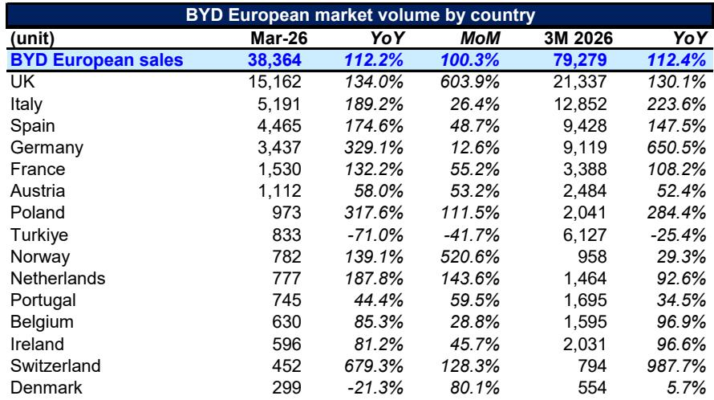
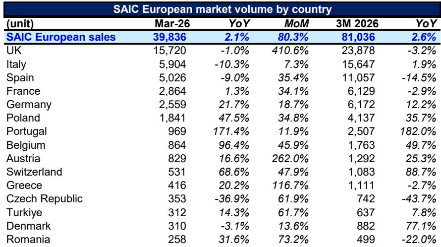
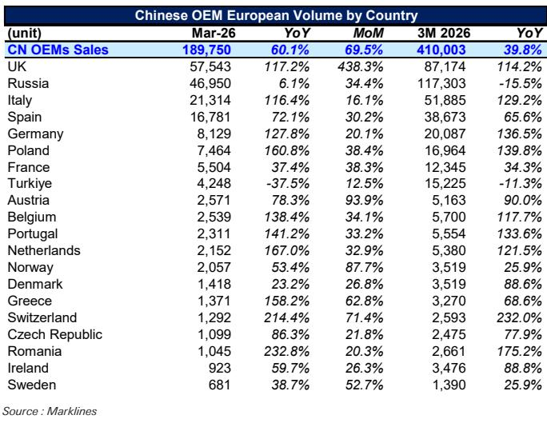

# 中国车企在欧洲的真正突破，不在销量，而在结构

2026年3月，中国车企在欧洲市场单月销量达到189,750辆，同比增长60%。这个数字本身已经足够让人侧目。但真正值得关注的，不是总量，而是结构：英国市场单月贡献超过5.7万辆，同比增长117%；意大利突破2.1万辆，同比增长116%；德国虽然绝对量仍然不高，但同比增速达到127%。

这是一份某外资投行最新发布的月度追踪报告给出的核心数据。它揭示了一个正在发生的结构性变化——中国车企在欧洲的渗透，已经从“边缘试探”进入“核心市场突破”阶段。而这一轮突破的驱动力，正在从成本优势转向品牌认知和渠道能力的系统性提升。

以下，是我们基于这份报告数据所做的深度解读。

## 1. 英国市场的爆发，正在重塑中国车企的欧洲叙事

这份报告最值得关注的数据点，不在德国，不在法国，而在英国。

2026年3月，中国车企在英国的单月销量达到57,543辆，同比增长117%，环比更是暴增438%。即便考虑到英国3月本身就是传统销售旺季，这个增速仍然远超整体欧洲市场60%的平均水平。更关键的是，中国车企在英国的市场份额已经从2025年初的6%攀升至2026年3月的15%。

这意味着什么？英国是中国车企在欧洲最大的单一市场，且增长没有减速迹象。

从品牌分布来看，Chery是英国市场的最大赢家，市场份额达到5.9%，SAIC和BYD分别以3.9%和3.5%紧随其后。这三家车企合计占据了英国市场超过13%的份额，已经超过了许多传统欧洲品牌在当地的市占率。

英国市场的特殊性在于：它是一个右舵市场，与日本、澳大利亚、印度、东南亚等右舵市场形成天然协同。中国车企在英国的成功，本质上是在验证一套“右舵市场可复制”的扩张模型。这份报告没有明确展开这一点，但逻辑上，英国正在成为中国车企全球化布局中的一个关键支点。

## 2. 意大利的意外崛起，说明欧洲南部的接受度正在快速提升

如果说英国是中国车企在欧洲的“高端突破”，那么意大利就是“规模扩张”的样本。

2026年一季度，中国车企在意大利累计销量达到51,885辆，同比增长129%，市场份额从2025年初的4.3%一路上升至3月的11.6%。这个数字已经超过了法国和德国，成为仅次于英国和俄罗斯的第三大中国车企欧洲市场。

意大利市场的特殊性在于：它不是一个以高收入消费者为主的市场，消费者对价格敏感度更高，品牌忠诚度相对较低。这意味着，中国车企在意大利的成功，更多是基于性价比和产品力本身，而非品牌溢价。

从品牌分布来看，SAIC、BYD和Leapmotor是意大利市场的前三强，市场份额分别为3.2%、2.7%和2.4%。值得注意的是，Leapmotor是意大利市场中增速最快的中国品牌之一——2026年3月单月销量同比增长757%。这背后有Stellantis合资渠道的加持，但也说明中国车企正在通过多种合作模式加速渗透。

意大利的启示在于：欧洲南部市场正在成为中国车企的“基本盘”，而这个基本盘的增长，并不依赖于关税或政策红利，而是基于产品本身的市场竞争力。

## 3. 德国市场：份额虽低，但增速说明一切

德国是中国车企在欧洲最难啃的骨头。2026年3月，中国车企在德国的市场份额仅为2.8%，远低于英国、意大利甚至法国。但看增速，德国是欧洲主要市场中增长最快的之一——3月同比增长127%，一季度累计同比增长136%。

为什么德国市场重要？因为德国是欧洲汽车工业的“心脏”，是大众、宝马、奔驰的大本营。中国车企在德国每获得一个百分点的市场份额，其象征意义和实际竞争压力都远超其他市场。

从品牌构成来看，BYD是德国市场的领头羊，市场份额达到1.3%，SAIC为0.9%，其他中国品牌合计0.7%。这个结构说明，中国车企在德国还处于“单点突破”阶段，尚未形成集群效应。但增速表明，德国消费者的品牌壁垒正在松动。

这份报告没有深入分析德国市场增长的具体驱动因素，但合理的推断是：中国车企在德国的增长，更多来自于纯电动车型的渗透。德国消费者对电动车品牌的认知正在重构，这给了中国车企一个窗口期。窗口期能持续多久，取决于传统德国车企在电动化领域的反扑速度。

## 4. 品牌分化加剧：Chery领跑，SAIC停滞，Leapmotor异军突起

从品牌维度看，2026年3月的欧洲市场格局正在发生显著分化。

Chery以50,256辆的单月销量稳居第一，同比增长83%，市场份额达到中国品牌总销量的26.5%。Chery的成功，很大程度上得益于其在英国和俄罗斯市场的深耕——这两个市场合计贡献了Chery欧洲销量的绝大部分。

SAIC排名第二，单月销量39,836辆，但同比增速仅为2.1%，几乎停滞。考虑到SAIC是较早进入欧洲市场的中国车企之一，这个增速意味着它正在面临来自Chery和BYD的激烈竞争，也可能受到关税和地缘政治因素的影响。

BYD单月销量38,364辆，同比增长112%，增速远超SAIC。BYD在欧洲的策略是“高举高打”，从德国、英国等核心市场切入，同时布局意大利、法国等南部市场。报告显示，BYD在德国、英国、法国、意大利四个核心市场的份额均已进入中国品牌前三，呈现出全面渗透的态势。

最值得关注的是Leapmotor。单月销量11,233辆，同比增长757%，是所有主要品牌中增速最快的。Leapmotor的增长，很大程度上得益于与Stellantis的合资渠道。这验证了一个重要逻辑：在关税和地缘政治不确定性的背景下，合资/合作模式是中国车企快速进入欧洲市场的有效路径。

品牌分化的背后，是不同战略路径的竞争。Chery代表的是“深耕单一市场+性价比”路线，BYD代表的是“全面布局+品牌建设”路线，Leapmotor代表的是“借力合作+快速放量”路线。哪一种路径最终胜出，将决定未来五年中国车企在欧洲的竞争格局。

## 5. 一个尚未回答的关键问题：关税影响是否已经被市场充分定价？

这是这份报告没有完全展开，但对所有读者都至关重要的问题。

2025年以来，欧盟对中国电动车加征关税的政策已经落地。但报告数据显示，中国车企在欧洲的销量不仅没有下滑，反而在加速增长。这是否意味着关税影响已经被市场消化？

答案可能没有表面看起来那么简单。

从数据看，中国车企在欧洲的销量增长，主要集中在英国、意大利、西班牙等非欧盟核心市场，或者通过合资/合作模式规避了部分关税影响。德国和法国虽然也在增长，但绝对量和市场份额仍然较低。这意味着，关税政策可能正在改变中国车企的“欧洲路线图”——它们正在将资源从高关税市场转向低关税或政策友好的市场。

但这份报告没有提供关税对中国车企单车利润的具体影响数据。一个合理的推测是：在关税压力下，中国车企的欧洲业务可能正处于“销量增长、利润承压”的阶段。如果关税进一步升级，或者欧盟扩大征税范围，目前的高速增长是否可持续，仍是一个需要验证的问题。

## 6. 一个新的观察框架：从“销量份额”转向“利润份额”和“品牌份额”

基于以上分析，我们认为，投资者和产业决策者需要调整观察中国车企欧洲业务的框架。

过去两年，市场关注的焦点是“销量”和“市场份额”。这两个指标确实重要，但它们只能回答“中国车企卖了多少车”，无法回答“中国车企赚了多少钱”和“中国车企的品牌价值有多大”。

我们建议用三个维度来重新评估中国车企的欧洲进展：

第一，利润份额。在关税、物流、渠道建设成本高企的背景下，中国车企在欧洲是否实现了单车的正利润？不同品牌之间的利润分化有多大？报告没有提供这些数据，但这是判断业务可持续性的核心指标。

第二，品牌份额。中国车企在欧洲的品牌认知度正在快速提升，但品牌溢价能力仍然有限。从英国和德国的数据看，中国品牌主要集中在15-30万元人民币的价格区间，尚未在高端市场形成突破。品牌份额的提升，将是下一阶段竞争的关键。

第三，渠道质量。中国车企在欧洲的渠道建设正在加速，但经销商网络的密度和服务能力仍然是短板。报告显示，Leapmotor借助Stellantis渠道实现了快速增长，这恰恰说明渠道能力是中国车企在欧洲竞争中的关键变量。

这三个维度，目前仍缺乏系统的公开数据。但正是这些未被充分讨论的问题，构成了未来研究中国车企欧洲业务的核心议题。

---

这份报告提供了2026年3月中国车企在欧洲市场的全景数据，但正如我们上面分析的那样，真正有价值的洞察往往藏在数据背后——关税的边际影响、品牌分化的深层原因、渠道能力的量化评估，这些都需要更深入的研究和讨论。

欢迎来我们的知识星球和微信群，继续探讨这些未解问题。我们将定期分享更多独家研报解读和行业洞察，帮助你在信息过载的时代，抓住真正重要的结构性变化。

Personal reading notes and learning share only. Not investment advice.

