# CHINA MATTERS

# Not Too Worried About the April Data Miss

- Largest downside surprise since May 2023: With retail sales increasing only $0.2\%$ yoy and fixed asset investment contracting $8\%$ yoy in April, our China MAP score (measuring data surprise relative to consensus forecast) turned the most negative since China reopening from the Covid pandemic. Looking through the details of the data, however, we do not think the economy has weakened as much as the latest batch of official data suggests.   
The impact of the Iran war is showing: Industrial production missed consensus expectations by around 2pp in April. Chemicals and processed petroleum products showed the largest sequential declines in physical output, pointing to the negative impact of the energy-supply shock. We estimate that these sectors can explain around half of the data miss in industrial production, while the other half may be related to residual seasonality that should reverse in the next two months.   
Retail sales distorted by government policies: The government-subsidized consumer goods trade-in program boosted auto and home appliance sales by pulling forward replacement demand for consumer durables. We are seeing a payback effect now. In addition, the increase in the auto purchase tax at the beginning of 2026 has further weighed on auto sales. Although these factors will continue to pressure retail sales for the remainder of this year, they should not be interpreted as a sharp deterioration in the household consumption trend.   
Investment slowdown reflects a policy choice: With the April Politburo meeting characterizing Q1 growth as “better than expected,” policymakers scaled back infrastructure investment in April. Issuance of local government special bonds slowed notably and fiscal spending declined. With the negative impact of the Iran war on the Chinese economy emerging, we think fiscal spending should increase in the coming months.   
What to watch: China's bifurcated economy, featuring strong exports and weak domestic demand, has largely remained the same. Two aspects of the economy deserve close monitoring. First, although exports have held up better than expected, rising $14.1\%$ yoy in April, a material weakening in exports could prompt policy reactions. Second, the property market has shown some encouraging signs in select large cities. Continued improvements in the property market could go a long way toward boosting confidence and capital markets.

# Hui Shan

+852-2978-6634 | hui.shan@gs.com
GS (Asia) L.L.C.

# Not Too Worried About the April Data Miss

China's April activity data surprised significantly to the downside, with industrial production (IP), retail sales, and fixed asset investment (FAI) all missing market expectations by a large margin. Exhibit 1 shows that the downside surprise was the largest since May 2023, when China's post-Covid reopening activity disappointed.

Is Chinese growth momentum on the ground really decelerating sharply? We think not. In this note, we explain that, although the Middle East conflict and higher energy prices have indeed taken a toll on certain industries, the broad macroeconomic picture in China has not changed much. Strong exports and weak domestic demand remain the key features of the Chinese economy at present. Going forward, two key things to watch are (1) whether export strength, especially to low-income oil-importing EM destinations, is sustained in the face of the global energy-supply shock, and (2) whether the property market continues to show signs of stabilization in top-tier cities.

Exhibit 1: April activity data was the largest downside surprise since May 2023   
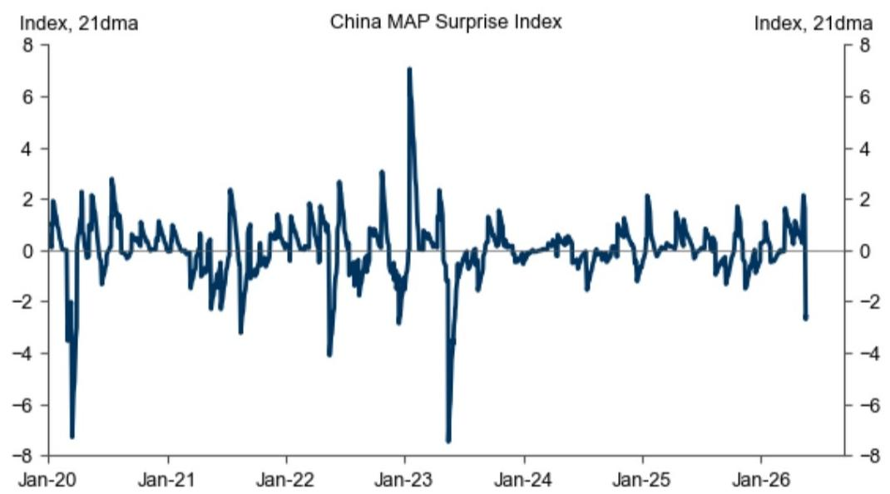

line

| Date    | Index, 21dma |
|---------|--------------|
| Jan-20  | 2            |
| Jan-21  | 0            |
| Jan-22  | 0            |
| Jan-23  | 7            |
| Jan-24  | 0            |
| Jan-25  | 0            |
| Jan-26  | 0            |

Source: GS Global Investment Research

# IP Data Shows Impact of the Iran War

IP growth slowed notably from $5.7\%$ yoy in March to $4.1\%$ yoy in April, nearly 2pp lower than the Bloomberg consensus expectation of $6.0\%$ yoy. Examining the output of different products, we observe that chemicals (e.g., ethylene and chemical fiber) and processed petroleum products experienced the largest sequential declines, suggesting that the ongoing Middle East conflict and higher energy prices are indeed weighing on Chinese industrial activity (left panel of Exhibit 2). We estimate that the impact of the Iran war could explain roughly 1pp of the April IP growth miss. On the other hand, production of industrial robots and wind power generation showed the largest sequential increases in April, demonstrating the persistent trend in China's push for high-tech manufacturing and new energy sectors (right panel of Exhibit 2).

Exhibit 2: April physical output data shows the negative impact of the Iran war as well as continued strength in high-tech manufacturing and new energy sectors   
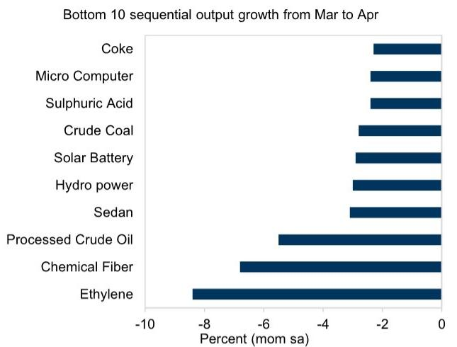

bar

Bottom 10 sequential output growth from Mar to Apr
| Energy Source | Percent (mom sa) |
|---|---|
| Coke | -2.0 |
| Micro Computer | -2.0 |
| Sulphuric Acid | -2.0 |
| Crude Coal | -2.5 |
| Solar Battery | -2.5 |
| Hydro power | -2.5 |
| Sedan | -2.5 |
| Processed Crude Oil | -5.0 |
| Chemical Fiber | -6.5 |
| Ethylene | -8.0 |

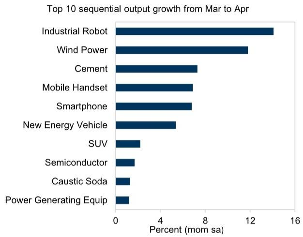

bar

Top 10 sequential output growth from Mar to Apr
| Category | Percent (mom sa) |
|---|---|
| Industrial Robot | 13.5 |
| Wind Power | 12.0 |
| Cement | 7.5 |
| Mobile Handset | 7.4 |
| Smartphone | 7.3 |
| New Energy Vehicle | 5.8 |
| SUV | 2.9 |
| Semiconductor | 2.6 |
| Caustic Soda | 2.4 |
| Power Generating Equip | 2.3 |

Source: CEIC, GS Global Investment Research

Besides the Iran war, we think the “residual seasonality” that occasionally appears in the IP data may have been at play in April as well. For example, during 2025, IP sequential growth tended to be strong in quarter-end months (March, June, and September) but weak in the month immediately after (April, July, and October), perhaps a sign of production being front-loaded into quarter-end months ahead of quarterly GDP releases (Exhibit 3). If such a pattern has reappeared this year (which is difficult to determine with certainty due to the compounding effects of the Iran war in March and April), it could explain the remaining 1pp of the IP data miss.

Taken together, of the roughly 2pp April IP growth disappointment, we think approximately half may be due to the Middle East conflict, and therefore could persist over the next few months, while the other half may be statistical and should dissipate soon.

Exhibit 3: IP was strong in March, June and September but weak in April, July and October in 2025   
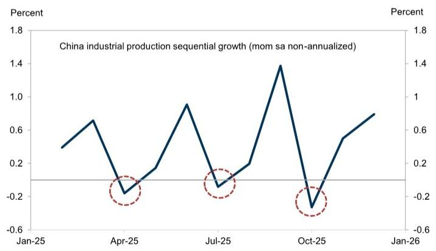

line

China industrial production sequential growth (mom sa non-annualized)
| Date | Value (%) |
|---|---|
| Jan-25 | 0.3 |
| Apr-25 | -0.15 |
| Jul-25 | -0.1 |
| Oct-25 | -0.25 |
| Jan-26 | 0.7 |

Source: Haver Analytics, GS Global Investment Research

# Retail Sales Distorted by Government Policies

April retail sales grew only 0.2% yoy, the lowest since 2022 when China was still under the zero-Covid policy. Detailed breakdowns suggest that government policies may be the main driver of the weak year-over-year growth. In 2024, the government-subsidized “consumer goods trade-in” program bolstered auto and home appliance sales. In 2025, the program continued and expanded into other consumer electronics such as smartphones before the government reduced the subsidies somewhat in 2026 (Exhibit 4). Because such a program pulls forward replacement demand for consumer durable goods, a payback effect would eventually emerge, as households will not replace cars, home appliances, and smartphones every year. For example, home appliance sales growth dropped from +53% yoy last May to -15% yoy this April.

The policy change to the auto purchase tax has exacerbated the slowdown in auto sales this year. To support the adoption of electric vehicles (EVs), the government exempted the $10\%$ purchase tax on EVs in previous years. With EV share of auto sales exceeding that of internal combustion engine (ICE) cars, the purchase tax on EVs was raised from $0\%$ to $5\%$ this year, leading to a notable decline in EV and total auto sales. According to China Passenger Car Association data, domestic auto sales volume growth declined from $+16\%$ yoy in Q2 last year to $-18\%$ yoy in Q1 this year. In April, higher gasoline prices caused consumers to favor EVs: EV sales increased $8\%$ month on month (seasonally adjusted), whereas ICE car sales dropped $23\%$ (Exhibit 5).

Taken together, most of the weakness in retail sales has been driven by government policies and does not indicate deteriorating consumption momentum. Because policies on consumer goods trade-in subsidies and EV purchase taxes are unlikely to change, retail sales should stay under pressure for the remainder of this year, although year-over-year growth may pick up starting in June on more favorable base effects.

Exhibit 4: Effect of government-subsidized consumer goods trade-in program should fade over time   
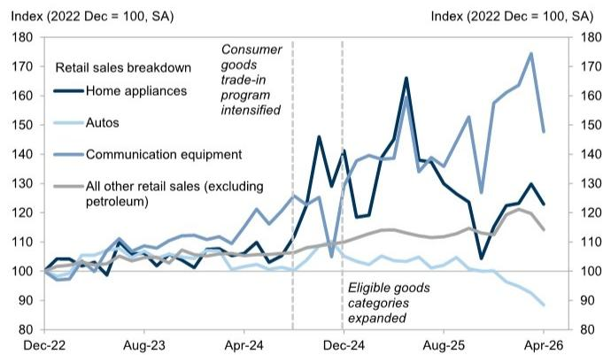

line

| Date | Retail sales breakdown (Index 2022 Dec = 100, SA) | Consumer goods trade-in program intensified (Index 2022 Dec = 100, SA) | Home appliances (Index 2022 Dec = 100, SA) | Autos (Index 2022 Dec = 100, SA) | Communication equipment (Index 2022 Dec = 100, SA) | All other retail sales (excluding petroleum) (Index 2022 Dec = 100, SA) |
|---|---|---|---|---|---|---|
| Dec-22 | 100 | 100 | 100 | 100 | 100 | 100 |
| Aug-23 | 105 | 108 | 107 | 104 | 109 | 106 |
| Apr-24 | 110 | 115 | 112 | 105 | 118 | 108 |
| Dec-24 | 145 | 135 | 140 | 108 | 138 | 115 |
| Aug-25 | 168 | 145 | 138 | 105 | 155 | 118 |
| Apr-26 | 175 | 155 | 130 | 95 | 178 | 125 |

Source: CEIC, GS Global Investment Research

Exhibit 5: EV sales increased while ICE car sales declined in April on higher gasoline prices   
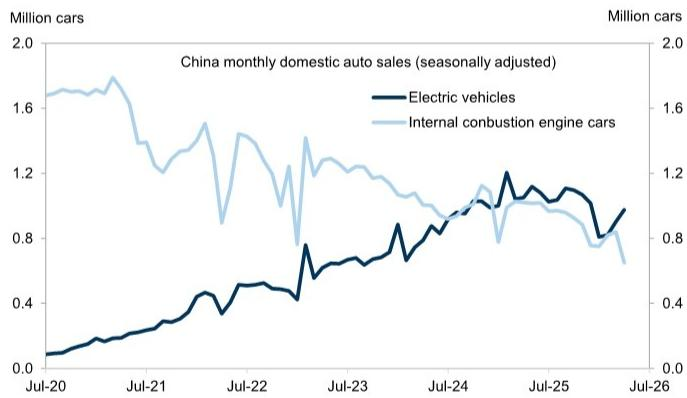

line

| Month   | Electric vehicles | Internal combustion engine cars |
|---------|-------------------|----------------------------------|
| Jul-20  | 0.0               | 1.6                              |
| Jul-21  | 0.3               | 1.4                              |
| Jul-22  | 0.5               | 1.2                              |
| Jul-23  | 0.7               | 1.0                              |
| Jul-24  | 0.9               | 0.8                              |
| Jul-25  | 1.1               | 0.7                              |
| Jul-26  | 1.0               | 0.6                              |

Source: Haver Analytics, GS Global Investment Research

# Investment Weakness Likely Reflects a Policy Choice

By our estimate, single-month FAI declined $8\%$ yoy in April. Over the past year, FAI volatility has increased significantly and often shows patterns inconsistent with our industry analysts' on-the-ground channel checks or alternative measures of construction activity. For example, Exhibit 6 shows that Chinese steel and cement consumption have been declining since the housing market peaked in 2021. By contrast, the official FAI data depicts stable or increasing investment in 2022-24 despite the severe housing downturn, followed by large swings in investment in recent quarters.

Our previous research suggests that measurement issues associated with FAI levels have increased over time. Relative growth across different FAI components still contain useful signals. For example, manufacturing FAI declined by less than infrastructure FAI in April. Within manufacturing, investment growth in high-tech sectors outperformed that in non-high-tech sectors. Within infrastructure, the sequential decline in transportation infrastructure investment was the largest, consistent with April's heavy rainfalls and weakness in the construction PMI.

Exhibit 6: FAI data diverged significantly from alternative measures of construction activity   
Real FAI Implied vs. Actual Commodity Demand   
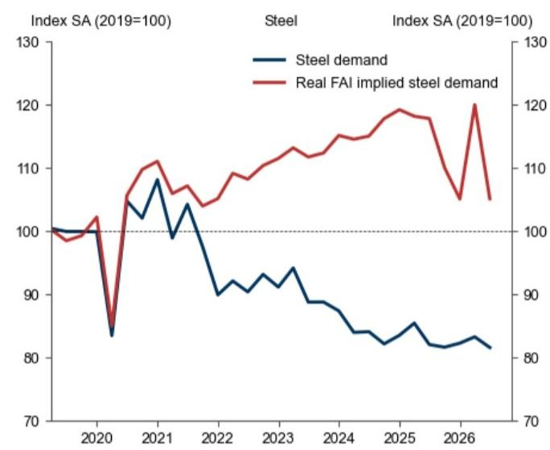

line

| Year | Steel demand | Real FAI implied steel demand |
|---|---|---|
| 2019 | 100 | 100 |
| 2020 | 84 | 98 |
| 2021 | 108 | 111 |
| 2022 | 90 | 106 |
| 2023 | 93 | 113 |
| 2024 | 88 | 115 |
| 2025 | 85 | 119 |
| 2026 | 83 | 105 |
| 2027 | 82 | 105 |

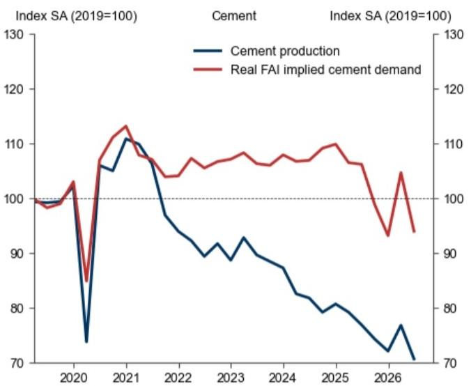

line

| Year | Cement production | Real FAI implied cement demand |
|------|-------------------|-------------------------------|
| 2020 | 75                | 85                            |
| 2021 | 110               | 115                           |
| 2022 | 95                | 105                           |
| 2023 | 90                | 108                           |
| 2024 | 85                | 107                           |
| 2025 | 80                | 110                           |
| 2026 | 75                | 95                            |
| 2027 | 70                | 90                            |

Source: CEIC, GS Global Investment Research

Most importantly, we believe much of China's investment slowdown in April, infrastructure investment in particular, reflects a policy choice. Exhibit 7 shows that the pace of local government special bond (LGSB) issuance was fast in Q1 but slowed notably in April through mid-May after Q1 GDP surprised to the upside and the April Politburo meeting noted that major economic indicators were “better than expected.” The latest fiscal data showed a significant decline in government spending in April. With the $15^{\text{th}}$ Five-Year Plan having just approved a pool of major projects, and with most of this year’s government bond quota not yet tapped, policymakers have plenty of room to accelerate investment growth if needed.

Exhibit 7: The pace of LGSB issuance slowed notably from Q1 to Q2   
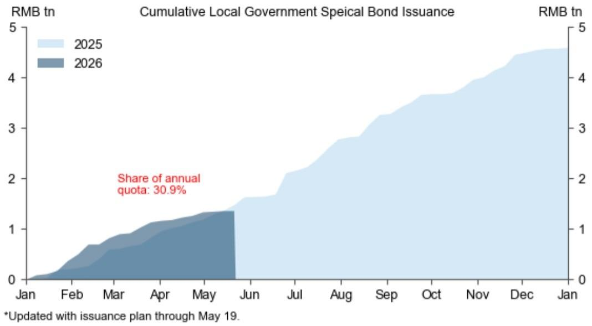

area

| Month | 2025 (RMB tn) | 2026 (RMB tn) |
|-------|---------------|---------------|
| Jan   | ~0            | ~0            |
| Feb   | ~0.5          | ~0.3          |
| Mar   | ~1.0          | ~0.7          |
| Apr   | ~1.5          | ~1.0          |
| May   | ~2.0          | ~1.3          |
| Jun   | ~2.5          | ~1.5          |
| Jul   | ~3.0          | ~1.8          |
| Aug   | ~3.5          | ~2.0          |
| Sep   | ~4.0          | ~2.3          |
| Oct   | ~4.5          | ~2.5          |
| Nov   | ~4.8          | ~2.7          |
| Dec   | ~4.9          | ~2.8          |
| Jan   | ~5.0          | ~2.9          |

Source: Wind, GS Global Investment Research

Taken together, the official FAI data has become extremely volatile for reasons we do not fully understand, making it increasingly important to monitor alternative measures of investment. April fiscal data suggests that policymakers slowed fiscal spending after Q1 real GDP beat expectations. Now that the negative impact of the Iran war is visible in the April data, government bond issuance is likely to pick up and fiscal spending should accelerate in the coming months.

# The Big Picture

Sifting through the detailed April activity data, we draw three conclusions about the current state of the Chinese economy.

First, despite the sizeable disappointment in the official data release, the picture of a bifurcated economy has not changed (Exhibit 8).

Second, the ongoing Middle East conflict and higher energy prices have negatively impacted the Chinese economy. This includes lower production of chemicals and processed petroleum products, squeezed margins for downstream businesses, and higher inflation and lower real income for households. We continue to expect sequential real GDP growth to slow from $5.3\%$ qoq annualized in Q1 to $4.0\%$ in Q2 (Exhibit 9).

Third, the Chinese economy has so far been more flexible than expected in adapting to higher oil prices. Consumers bought EVs rather than ICE cars. Travelers shifted to high-speed trains from flights. According to the National Energy Administration, electricity consumption grew 6.0% yoy in April. High-frequency data show that daily coal consumption in coastal provinces rose around 4% yoy on average from March through mid-May (compared to -2% growth in 2025). On the other hand, conversations with industry contacts suggest that consumption of petroleum products declined 20% from March to April.

Exhibit 8: April activity data continue to show a bifurcated economy with strong exports and weak domestic demand   
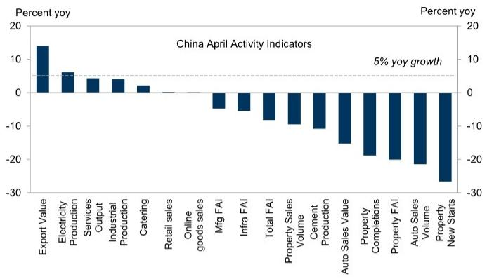

bar

China April Activity Indicators
| Category | Percent yoy (%) |
|---|---|
| Export Value | 14 |
| Electricity Production | 6 |
| Services Output | 4 |
| Industrial Production | 4 |
| Catering | 2 |
| Retail sales | -1 |
| Online goods sales | -3 |
| Mfg FAI | -5 |
| Infra FAI | -6 |
| Total FAI | -8 |
| Property Sales Volume | -9 |
| Cement Production | -10 |
| Auto Sales Value | -15 |
| Property Completions | -19 |
| Property FAI | -20 |
| Auto Sales Volume | -22 |
| Property New Starts | -28 |
Percent yoy (5% yoy growth)

Source: CEIC, GS Global Investment Research

Exhibit 9: We expect sequential real GDP growth to slow from $5.3\%$ qoq annualized in Q1 to $4.0\%$ in Q2   
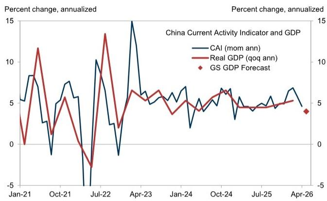

line

China Current Activity Indicator and GDP
| Date | CAI (mom ann) (%) | Real GDP (qoq ann) (%) | GS GDP Forecast (%) |
|---|---|---|---|
| Jan-21 | 5.5 | 3.0 | |
| Feb-21 | 8.0 | 1.0 | |
| Mar-21 | 7.5 | 12.0 | |
| Apr-21 | 2.5 | 1.5 | |
| May-21 | -1.0 | 5.5 | |
| Jun-21 | 7.0 | 1.0 | |
| Jul-21 | 10.0 | -3.0 | |
| Aug-21 | 2.0 | 13.5 | |
| Sep-21 | -4.0 | 2.0 | |
| Oct-21 | 7.5 | 5.5 | |
| Nov-21 | 6.0 | 3.0 | |
| Dec-21 | 5.0 | 6.5 | |
| Jan-22 | 6.5 | 4.0 | |
| Feb-22 | 7.0 | 6.0 | |
| Mar-22 | 6.0 | 5.5 | |
| Apr-22 | 15.0 | 6.5 | |
| May-22 | 6.0 | 5.0 | |
| Jun-22 | 5.5 | 4.5 | |
| Jul-22 | 6.5 | 6.0 | |
| Aug-22 | 7.0 | 6.5 | |
| Sep-22 | 6.5 | 6.0 | |
| Oct-22 | 5.0 | 5.5 | |
| Nov-22 | 4.5 | 5.0 | |
| Dec-22 | 4.0 | 4.5 | |
| Jan-23 | 3.5 | 4.0 | |
| Feb-23 | 4.0 | 4.5 | |
| Mar-23 | 4.5 | 5.0 | |
| Apr-23 | 5.0 | 5.5 | |
| May-23 | 4.5 | 5.0 | |
| Jun-23 | 4.0 | 4.5 | |
| Jul-23 | 4.5 | 4.0 | |
| Aug-23 | 5.0 | 4.5 | |
| Sep-23 | 4.5 | 4.0 | |
| Oct-23 | 4.0 | 4.5 | |
| Nov-23 | 3.5 | 4.0 | |
| Dec-23 | 4.0 | 4.5 | |
| Jan-24 | 4.5 | 5.0 | |
| Feb-24 | 5.0 | 5.5 | |
| Mar-24 | 4.5 | 5.0 | |
| Apr-24 | 4.0 | 4.5 | |
| May-24 | 3.5 | 4.0 | |
| Jun-24 | 4.0 | 4.5 | |
| Jul-24 | 4.5 | 5.0 | |
| Aug-24 | 4.0 | 4.5 | |
| Sep-24 | 3.5 | 4.0 | |
| Oct-24 | 4.0 | 4.5 | |
| Nov-24 | 4.5 | 5.0 | |
| Dec-24 | 4.0 | 4.5 | |
| Jan-25 | 3.5 | 4.0 | |
| Feb-25 | 4.0 | 4.5 | |
| Mar-25 | 4.5 | 5.0 | |
| Apr-25 | 4.0 | 4.5 | |
| May-25 | 3.5 | 4.0 | |
| Jun-25 | 4.0 | 4.5 | |
| Jul-25 | 4.5 | 5.0 | |
| Aug-25 | 4.0 | 4.5 | |
| Sep-25 | 3.5 | 4.0 | |
| Oct-25 | 4.0 | 4.5 | |
| Nov-25 | 4.5 | 5.0 | |
| Dec-25 | 4.0 | 4.5 | |
| Jan-26*<fcel>3.0<fcel>3.5<fcel>3.0 |
| Feb-26*<fcel>3.5<fcel>3.0<fcel>3.0 |
| Mar-26*<fcel>3.0<fcel>3.5<fcel>3.0 |
| Apr-26*<fcel>3.5<fcel>3.0<fcel>3.0 |
The chart displays the annualized percent change for China's CAI (mom ann) and Real GDP (qoq ann) as of the latest data point, with GS GDP Forecast values shown for each period on the right axis.

Source: Haver Analytics, GS Global Investment Research

# Exports and the Property Market Key to Watch

With growth slowing in April but policymakers not feeling the urgency to ease policy, we think there are two parts of the economy that deserve close monitoring. First, exports have been the engine of Chinese growth over the past few years, and signs that they are coming under significant pressure would change policymakers' thinking. As of April, other than in the Middle East, where the closure of the Strait of Hormuz has stopped shipments, we have not seen weakening in Chinese exports to EM destinations (Exhibit 10).

Exhibit 10: Other than the Middle East, China exports to EM destinations held up well in March and April   

line

| Year | ASEAN | Middle East | Latin America | Africa |
|------|-------|-------------|---------------|--------|
| 2019 | 95    | 90          | 98            | 97     |
| 2020 | 105   | 100         | 102           | 103    |
| 2021 | 135   | 130         | 140           | 138    |
| 2022 | 150   | 145         | 160           | 155    |
| 2023 | 175   | 170         | 185           | 178    |
| 2024 | 160   | 165         | 175           | 168    |
| 2025 | 180   | 185         | 195           | 190    |
| 2026 | 220   | 230         | 225           | 245    |

Source: Haver Analytics, GS Global Investment Research

Second, there have been some encouraging signs from the property market in top-tier cities. Both the 30-city daily transactions of new properties and the 16-city daily transactions of existing homes have been relatively stable this year. The NBS 70-city indices show higher existing home prices (which tend to be more reliable of house prices than new home prices due to stricter local government controls over new home prices)

in tier-1 cities in April vs. March (Exhibit 11). It is still too early to conclude that property markets in these top-tier cities have bottomed. After all, similar improvements seen in late 2024 and early 2025 turned out to be ephemeral. That said, if and when the property market shows compelling signs of reaching a bottom, it could provide a significant boost to confidence and capital markets.

Exhibit 11: NBS data shows that existing home prices increased sequentially in tier-1 cities in April   
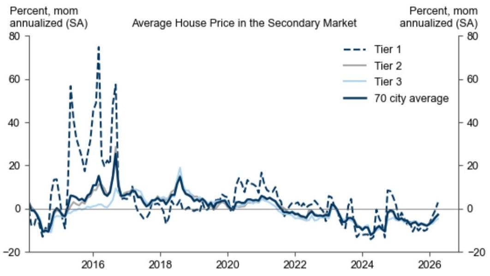

line

| Year | Tier 1 | Tier 2 | Tier 3 | 70 city average |
|------|--------|--------|--------|-----------------|
| 2016 | ~75    | ~10    | ~5     | ~5              |
| 2018 | ~15    | ~5     | ~10    | ~5              |
| 2020 | ~5     | ~0     | ~0     | ~0              |
| 2022 | ~0     | ~0     | ~0     | ~0              |
| 2024 | ~-10   | ~-5    | ~-5    | ~-5             |
| 2026 | ~0     | ~0     | ~0     | ~0              |

Source: CEIC, GS Global Investment Research

# Hui Shan

# The China Economics Team

# Andrew Tilton

+852-2978-1802

andrew.tilton@gs.com

GS (Asia) L.L.C.

# Hui Shan

+852-2978-6634

hui.shan@gs.com

GS (Asia) L.L.C.

# Lisheng Wang

+852-3966-4004

lisheng.wang@gs.com

GS (Asia) L.L.C.

# Xinquan Chen

+852-2978-2418

xinquan.chen@gs.com

GS (Asia) L.L.C.

# Yuting Yang

+852-2978-7283

yuting.y.yang@gs.com

GS (Asia) L.L.C.

# Chelsea Song

+852-2978-0106

chelsea.song@gs.com

GS (Asia) L.L.C.

# Disclosure Appendix

# Reg AC

I, Hui Shan, hereby certify that all of the views expressed in this report accurately reflect my personal views, which have not been influenced by considerations of the firm's business or client relationships.

Unless otherwise stated, the individuals listed on the cover page of this report are analysts in GS' Global Investment Research division.

Contributing Authors: Hui Shan GS (Asia) L.L.C..

Unless otherwise stated, the individuals listed in the Contributing Authors disclosure of this report are analysts in GS' Global Investment Research division.

# Disclosures

# Regulatory disclosures

# Disclosures required by United States laws and regulations

See company-specific regulatory disclosures above for any of the following disclosures required as to companies referred to in this report: manager or co-manager in a pending transaction; $1\%$ or other ownership; compensation for certain services; types of client relationships; managed/co-managed public offerings in prior periods; directorships; for equity securities, market making and/or specialist role. GS trades or may trade as a principal in debt securities (or in related derivatives) of issuers discussed in this report.

The following are additional required disclosures: Ownership and material conflicts of interest: GS policy prohibits its analysts, professionals reporting to analysts and members of their households from owning securities of any company in the analyst's area of coverage. Analyst compensation: Analysts are paid in part based on the profitability of GS, which includes investment banking revenues. Analyst as officer or director: GS policy generally prohibits its analysts, persons reporting to analysts or members of their households from serving as an officer, director or advisor of any company in the analyst's area of coverage. Non-U.S. Analysts: Non-U.S. analysts may not be associated persons of GS & Co. LLC and therefore may not be subject to FINRA Rule 2241 or FINRA Rule 2242 restrictions on communications with a subject company, public appearances and trading in securities covered by the analysts.

# Additional disclosures required under the laws and regulations of jurisdictions other than the United States

The following disclosures are those required by the jurisdiction indicated, except to the extent already made above pursuant to United States laws and regulations. Australia: GS Australia Pty Ltd and its affiliates are not authorised deposit-taking institutions (as that term is defined in the Banking Act 1959 (Cth)) in Australia and do not provide banking services, nor carry on a banking business, in Australia. This research, and any access to it, is intended only for “wholesale clients” within the meaning of the Australian Corporations Act, unless otherwise agreed by GS. In producing research reports, members of Global Investment Research of GS Australia may attend site visits and other meetings hosted by the companies and other entities which are the subject of its research reports. In some instances the costs of such site visits or meetings may be met in part or in whole by the issuers concerned if GS Australia considers it is appropriate and reasonable in the specific circumstances relating to the site visit or meeting. To the extent that the contents of this document contains any financial product advice, it is general advice only and has been prepared by GS without taking into account a client’s objectives, financial situation or needs. A client should, before acting on any such advice, consider the appropriateness of the advice having regard to the client’s own objectives, financial situation and needs. A copy of certain GS Australia and New Zealand disclosure of interests and a copy of GS’ Australian Sell-Side Research Independence Policy Statement are available at: https://www.goldmansachs.com/disclosures/australia-new-zealand/index.html. Brazil: Disclosure information in relation to CVM Resolution n. 20 is available at https://www.gs.com/worldwide/brazil/area/gir/index.html. Where applicable, the Brazil-registered analyst primarily responsible for the content of this research report, as defined in Article 20 of CVM Resolution n. 20, is the first author named at the beginning of this report, unless indicated otherwise at the end of the text. Canada: This information is being provided to you for information purposes only and is not, and under no circumstances should be construed as, an advertisement, offering or solicitation by GS & Co. LLC for purchasers of securities in Canada to trade in any Canadian security. GS & Co. LLC is not registered as a dealer in any jurisdiction in Canada under applicable Canadian securities laws and generally is not permitted to trade in Canadian securities and may be prohibited from selling certain securities and products in certain jurisdictions in Canada. If you wish to trade in any Canadian securities or other products in Canada please contact GS Canada Inc., an affiliate of The GS Group Inc., or another registered Canadian dealer. Hong Kong: Further information on the securities of covered companies referred to in this research may be obtained on request from GS (Asia) L.L.C. India: Further information on the subject company or companies referred to in this research may be obtained from GS (India) Securities Private Limited, Research Analyst - SEBI Registration Number INH000001493, 10th Floor, Ascent-Worli, Sudam Kalu Ahire Marg, Worli, Mumbai-400 025, India, Corporate Identity Number U74140MH2006FTC160634, Phone +91 22 6616 9000, Fax +91 22 6616 9001. GS may beneficially own 1% or more of the securities (as such term is defined in clause 2 (h) the Indian Securities Contracts (Regulation) Act, 1956) of the subject company or companies referred to in this research report. Investment in securities market are subject to market risks. Read all the related documents carefully before investing. Registration granted by SEBI and certification from NISM in no way guarantee performance of the intermediary or provide any assurance of returns to investors. GS (India) Securities Private Limited compliance officer and investor grievance contact details can be found at: https://www.goldmansachs.com/worldwide/india/documents/Grievance-Redressal-and-Escalation-Matrix.pdf, and a copy of the annual audit compliance report can be found at this link: https://publishing.gs.com/content/site/india-annual-compliance-report.html. Japan: See below. Korea: This research, and any access to it, is intended only for “professional investors” within the meaning of the Financial Services and Capital Markets Act, unless otherwise agreed by GS. Further information on the subject company or companies referred to in this research may be obtained from GS (Asia) L.L.C., Seoul Branch. New Zealand: GS New Zealand Limited and its affiliates are neither “registered banks” nor “deposit takers” (as defined in the Reserve Bank of New Zealand Act 1989) in New Zealand. This research, and any access to it, is intended for “wholesale clients” (as defined in the Financial Advisers Act 2008) unless otherwise agreed by GS. A copy of certain GS Australia and New Zealand disclosure of interests is available at: https://www.goldmansachs.com/disclosures/australia-new-zealand/index.html. Russia: Research reports distributed in the Russian Federation are not advertising as defined in the Russian legislation, but are information and analysis not having product promotion as their main purpose and do not provide appraisal within the meaning of the Russian legislation on appraisal activity. Research reports do not constitute a personalized investment recommendation as defined in Russian laws and regulations, are not addressed to a specific client, and are prepared without analyzing the financial circumstances, investment profiles or risk profiles of clients. GS assumes no responsibility for any investment decisions that may be taken by a client or any other person based on this research report. Singapore: GS (Singapore) Pte. (Company Number: 198602165W), which is regulated by the Monetary Authority of Singapore, accepts legal responsibility for this research, and should be contacted with respect to any matters arising from, or in connection with, this research. Taiwan: This material is for reference only and must not be reprinted without permission. Investors should carefully consider their own investment risk. Investment results are the responsibility of the individual investor. United Kingdom: Persons who would be categorized as retail clients in the United Kingdom, as such term is defined in the rules of the Financial Conduct Authority, should read this research in conjunction with prior GS on the covered

companies referred to herein and should refer to the risk warnings that have been sent to them by GS International. A copy of these risks warnings, and a glossary of certain financial terms used in this report, are available from GS International on request.

European Union and United Kingdom: Disclosure information in relation to Article 6 (2) of the European Commission Delegated Regulation (EU) (2016/958) supplementing Regulation (EU) No 596/2014 of the European Parliament and of the Council (including as that Delegated Regulation is implemented into United Kingdom domestic law and regulation following the United Kingdom's departure from the European Union and the European Economic Area) with regard to regulatory technical standards for the technical arrangements for objective presentation of investment recommendations or other information recommending or suggesting an investment strategy and for disclosure of particular interests or indications of conflicts of interest is available at https://www.gs.com/disclosures/europeanpolicy.html which states the European Policy for Managing Conflicts of Interest in Connection with Investment Research.

Japan: GS Japan Co., Ltd. is a Financial Instrument Dealer registered with the Kanto Financial Bureau under registration number Kinsho 69, and a member of Japan Securities Dealers Association, Financial Futures Association of Japan Type II Financial Instruments Firms Association, and Investment Management Association of Japan. Sales and purchase of equities are subject to commission pre-determined with clients plus consumption tax. See company-specific disclosures as to any applicable disclosures required by Japanese stock exchanges, the Japanese Securities Dealers Association or the Japanese Securities Finance Company.

# Global product; distributing entities

GS Global Investment Research produces and distributes research products for clients of GS on a global basis. Analysts based in GS offices around the world produce research on industries and companies, and research on macroeconomics, currencies, commodities and portfolio strategy. This research is disseminated in Australia by GS Australia Pty Ltd (ABN 21 006 797 897); in Brazil by GS do Brasil Corretora de Títulos e Valores Mobiliários S.A.; Public Communication Channel GS Brazil: 0800 727 5764 and / or contatogoldmanbrasil@gs.com. Available Weekdays (except holidays), from 9am to 6pm. Canal de Comunicação com o Público GS Brasil: 0800 727 5764 e/ou contatogoldmanbrasil@gs.com. Horário de funcionamento: segunda-feira à sexta-feira (exceto feriados), das 9h às 18h; in Canada by GS & Co. LLC; in Hong Kong by GS (Asia) L.L.C.; in India by GS (India) Securities Private Ltd.; in Japan by GS Japan Co., Ltd.; in the Republic of Korea by GS (Asia) L.L.C., Seoul Branch; in New Zealand by GS New Zealand Limited; in Russia by OOO GS; in Singapore by GS (Singapore) Pte. (Company Number: 198602165W); and in the United States of America by GS & Co. LLC. GS International has approved this research in connection with its distribution in the United Kingdom.

GS International (“GSI”), authorised by the Prudential Regulation Authority (“PRA”) and regulated by the Financial Conduct Authority (“FCA”) and the PRA, has approved this research in connection with its distribution in the United Kingdom.

European Economic Area: GS Bank Europe SE (“GSBE”) is a credit institution incorporated in Germany and, within the Single Supervisory Mechanism, subject to direct prudential supervision by the European Central Bank and in other respects supervised by German Federal Financial Supervisory Authority (Bundesanstalt für Finanzdienstleistungsaufsicht, BaFin) and Deutsche Bundesbank and disseminates research within the European Economic Area.

# General disclosures

This research is for our clients only. Other than disclosures relating to GS, this research is based on current public information that we consider reliable, but we do not represent it is accurate or complete, and it should not be relied on as such. The information, opinions, estimates and forecasts contained herein are as of the date hereof and are subject to change without prior notification. We seek to update our research as appropriate, but various regulations may prevent us from doing so. Other than certain industry reports published on a periodic basis, the large majority of reports are published at irregular intervals as appropriate in the analyst's judgment.

GS conducts a global full-service, integrated investment banking, investment management, and brokerage business. We have investment banking and other business relationships with a substantial percentage of the companies covered by Global Investment Research. GS & Co. LLC, the United States broker dealer, is a member of SIPC (https://www.sipc.org).

Our salespeople, traders, and other professionals may provide oral or written market commentary or trading strategies to our clients and principal trading desks that reflect opinions that are contrary to the opinions expressed in this research. Our asset management area, principal trading desks and investing businesses may make investment decisions that are inconsistent with the recommendations or views expressed in this research.

We and our affiliates, officers, directors, and employees will from time to time have long or short positions in, act as principal in, and buy or sell, the securities or derivatives, if any, referred to in this research, unless otherwise prohibited by regulation or GS policy.

The views attributed to third party presenters at GS arranged conferences, including individuals from other parts of GS, do not necessarily reflect those of Global Investment Research and are not an official view of GS.

Any third party referenced herein, including any salespeople, traders and other professionals or members of their household, may have positions in the products mentioned that are inconsistent with the views expressed by analysts named in this report.

This research is focused on investment themes across markets, industries and sectors. It does not attempt to distinguish between the prospects or performance of, or provide analysis of, individual companies within any industry or sector we describe.

Any trading recommendation in this research relating to an equity or credit security or securities within an industry or sector is reflective of the investment theme being discussed and is not a recommendation of any such security in isolation.

This research is not an offer to sell or the solicitation of an offer to buy any security in any jurisdiction where such an offer or solicitation would be illegal. It does not constitute a personal recommendation or take into account the particular investment objectives, financial situations, or needs of individual clients. Clients should consider whether any advice or recommendation in this research is suitable for their particular circumstances and, if appropriate, seek professional advice, including tax advice. The price and value of investments referred to in this research and the income from them may fluctuate. Past performance is not a guide to future performance, future returns are not guaranteed, and a loss of original capital may occur. Fluctuations in exchange rates could have adverse effects on the value or price of, or income derived from, certain investments.

Certain transactions, including those involving futures, options, and other derivatives, give rise to substantial risk and are not suitable for all investors. Investors should review current options and futures disclosure documents which are available from GS sales representatives or at https://www.theocc.com/about/publications/character-risks.jsp and https://www.goldmansachs.com/disclosures/cftc\_fcm\_disclosures. Transaction costs may be significant in option strategies calling for multiple purchase and sales of options such as spreads. Supporting documentation will be supplied upon request.

Differing Levels of Service provided by Global Investment Research: The level and types of services provided to you by GS Global Investment Research may vary as compared to that provided to internal and other external clients of GS, depending on various factors including your individual preferences as to the frequency and manner of receiving communication, your risk profile and investment focus and perspective (e.g.,

marketwide, sector specific, long term, short term), the size and scope of your overall client relationship with GS, and legal and regulatory constraints. As an example, certain clients may request to receive notifications when research on specific securities is published, and certain clients may request that specific data underlying analysts' fundamental analysis available on our internal client websites be delivered to them electronically through data feeds or otherwise. No change to an analyst's fundamental research views (e.g., ratings, price targets, or material changes to earnings estimates for equity securities), will be communicated to any client prior to inclusion of such information in a research report broadly disseminated through electronic publication to our internal client websites or through other means, as necessary, to all clients who are entitled to receive such reports.

All research reports are disseminated and available to all clients simultaneously through electronic publication to our internal client websites. Not all research content is redistributed to our clients or available to third-party aggregators, nor is GS responsible for the redistribution of our research by third party aggregators. For research, models or other data related to one or more securities, markets or asset classes (including related services) that may be available to you, please contact your GS representative or go to https://research.gs.com.

Disclosure information is also available at https://www.gs.com/research/hedge.html or from Research Compliance, 200 West Street, New York, NY 10282.

# © 2026 GS.

You are permitted to store, display, analyze, modify, reformat, and print the information made available to you via this service only for your own use. You may not resell or reverse engineer this information to calculate or develop any index for disclosure and/or marketing or create any other derivative works or commercial product(s), data or offering(s) without the express written consent of GS. You are not permitted to publish, transmit, or otherwise reproduce this information, in whole or in part, in any format to any third party without the express written consent of GS. This foregoing restriction includes, without limitation, using, extracting, downloading or retrieving this information, in whole or in part, to train or finetune a machine learning or artificial intelligence system, or to provide or reproduce this information, in whole or in part, as a prompt or input to any such system.