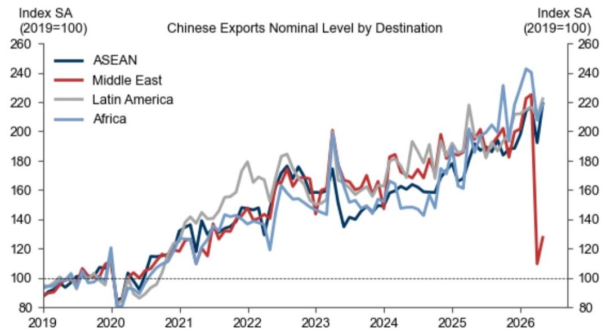

# 四月数据“惊吓”背后，市场真正需要关注的不是疲弱，而是政策空间的重新定价

对于关注中国宏观的投资者来说，四月的经济数据无疑是一次冲击。工业增加值、零售、固定资产投资全面低于预期，其综合偏离程度创下2023年5月以来之最。市场第一反应往往是担忧增长动能是否正在急剧恶化。

但某外资投行最新研报给出一个值得细品的判断：数据本身并非看上去那么糟糕，真正的关键变量在于政策制定者对经济状态的评估已经发生变化，而这将决定未来几个月的资产定价逻辑。这份报告没有停留在“经济好坏”的表层判断，而是试图拆解数据背后的结构性因素与政策意图。其核心主张可以概括为一句话：市场真正需要关注的不是四月数据有多差，而是政策空间还有多大、以及何时会被重新激活。

## 1. 工业数据的“一半真相”：能源冲击与统计噪音的叠加

四月工业增加值同比增速从三月的5.7%骤降至4.1%，低于市场预期约2个百分点。乍看之下，这是需求急剧萎缩的信号。但研报通过拆解产品层面的产出数据，给出了一个更为精细的归因。

左侧的“底部十项”清单清晰地指向了能源密集型行业：乙烯、化学纤维、加工原油的产量环比出现最大幅度的下滑。这并非偶然。四月份中东局势的升级与能源价格的攀升，直接冲击了中国化工和炼化环节的生产活动。报告估算，仅能源供给冲击一项，就可以解释工业增加值约1个百分点的下滑。

而右侧的“顶部十项”则揭示了另一番景象：工业机器人、风力发电、新能源车的产量环比增长显著。这并非简单的“新旧经济分化”，而是说明中国制造业的韧性并非均匀分布，而是在政策扶持和产业升级方向上的集中体现。

更值得玩味的是，报告提出了一个“残差季节性”假说。2025年的数据显示，工业增加值在季度末月份（三月、六月、九月）的环比增长往往偏强，而在季度初月份（四月、七月、十月）则偏弱。这可能与企业为应对季度GDP核算而将生产前置有关。如果这一模式在今年重现，那么另外1个百分点的下滑可能只是统计上的噪音，未来两个月内有望自然回补。

这意味着，工业数据的疲弱中，大约一半是真实的外部冲击，可能持续；另一半是技术性扰动，应会消退。对于投资者而言，这一拆解的意义在于：不应将四月的工业数据简单视为经济全面走弱的证据，而应关注能源价格对特定产业链的后续传导效应。

## 2. 零售数据的“政策后遗症”：透支效应与税收调整的双重挤压

四月零售额同比仅增长0.2%，创下2022年以来的最低水平。但研报明确指出，这并非居民消费意愿的急剧恶化，而是政府政策节奏变化带来的“统计性扭曲”。

核心机制在于“消费品以旧换新”补贴政策的透支效应。2024年该政策强力拉动汽车和家电销售，但耐用消费品并非每年更换，提前消费必然带来后续的“还债期”。报告给出的数据很直观：家电销售增速从去年五月的同比+53%骤降至今年四月的-15%。通讯器材类产品由于补贴范围扩大，出现了类似的先升后降。

与此同时，电动车购置税政策的调整加剧了汽车销售的疲弱。随着电动车渗透率超过燃油车，其购置税从0%恢复至5%，直接导致一季度国内汽车销量同比下滑18%。四月份汽油价格上涨，虽然推动电动车销量环比回升8%，但燃油车销量环比暴跌23%，整体汽车销售依然承压。

这里的关键洞察在于：零售数据的疲弱主要由政策节奏主导，而非消费趋势的根本性恶化。报告判断，由于补贴政策和税收调整短期难以逆转，零售销售在今年余下时间仍将面临压力，但同比增速可能从六月开始因基数效应而有所改善。

对于投资者而言，这意味着不应将零售数据的低迷解读为“消费降级”的加速，而应将其视为政策工具使用后的正常回调期。更重要的是，这为后续如果需要刺激消费，政策重新加码预留了空间。

## 3. 固定投资减速：这不是经济的“自发失速”，而是一次有意识的“政策休整”

四月单月固定资产投资同比下降8%，是本次数据中最为刺眼的一项。但研报通过两个层面的分析，得出了一个与直觉相反的结论：投资的减速主要反映了政策制定者的主动选择，而非经济的自发失速。

第一，官方FAI数据本身的质量问题日益突出。报告展示了一张极具说服力的对比图：自2021年房地产市场见顶以来，中国的钢铁和水泥实际消费量持续下降，但官方的固定投资数据却在2022-2024年描绘了一条稳定甚至上升的曲线。两者之间的裂口不断扩大，说明FAI数据的统计误差正在累积。报告承认，对于FAI波动的原因，“我们尚未完全理解”，因此更应关注替代性指标。

第二，财政数据的节奏揭示了政策意图。一季度GDP超预期后，四月份的政治局会议定调为“好于预期”。随之而来的是地方政府专项债发行节奏的明显放缓，以及财政支出的显著收缩。报告认为，这不是因为没钱，而是因为“不需要”。一季度增长达标后，政策制定者主动踩了刹车。

但这恰恰意味着政策空间依然充裕。十五五规划刚刚批准了一批重大项目，今年的政府债券额度还有大量未使用。一旦决策层认为需要托底经济，财政发力可以迅速启动。报告判断，随着伊朗战争对经济的负面影响在四月数据中显性化，未来几个月的政府债券发行和财政支出大概率将提速。

对于市场而言，这一节的核心含义是：固定资产投资的下滑不是趋势性的，而是周期性的、政策性的。当前的低迷恰恰为后续的反弹积蓄了势能。关键在于触发政策转向的“开关”是什么。

## 4. 报告尚未完全回答的关键问题：出口的韧性何时会遭遇挑战

研报将当前中国经济概括为“强出口、弱内需”的二元格局，并认为这一格局在四月并未改变。四月出口同比增长14.1%，依然强劲。但报告也坦诚地提出了一个尚未完全回答的问题：出口的韧性还能持续多久？

风险点在于全球能源供给冲击对低收入石油进口国的传导。这些国家是中国出口的重要增量市场。如果能源价格上涨导致这些经济体需求萎缩，中国的出口链条将面临实质性冲击。报告指出，这是未来需要密切监测的两个关键变量之一。

另一个变量是房地产市场。报告注意到部分核心城市出现了令人鼓舞的企稳迹象。如果房地产市场的改善能够持续，将对提振信心和资本市场产生深远影响。

这两个问题正是研报逻辑链条中尚未完全闭合的环节。出口的韧性取决于外部条件，房地产的企稳取决于内部信心，而这两者都不是政策可以直接精准调控的。这意味着，市场对未来的预判不能仅仅基于国内政策节奏，还必须纳入对全球地缘政治和资产价格联动的考量。

## 5. 一个可操作的观察框架：从“数据解读”转向“政策博弈”

综合整份报告的逻辑，投资者可以建立一个新的观察框架。过去的框架是“看数据好坏，判断经济强弱”。但在这个框架下，四月的“坏数据”很容易导致过度悲观。新的框架应该是“看数据背后的政策信号，判断政策空间的释放节奏”。

具体而言，需要关注三个层次：

第一层，区分“周期性”与“结构性”。工业数据中的能源冲击是周期性的，零售数据中的政策透支是周期性的，投资数据中的财政节奏是周期性的。这些因素都会在未来几个季度内自然消解或反转。真正需要警惕的是结构性的变化，比如出口竞争力的持续削弱或房地产市场的长期低迷。

第二层，识别政策的“触发器”。报告暗示，四月政治局会议定调“好于预期”是政策减速的触发器。那么，政策重新加速的触发器是什么？可能是出口的显著恶化，可能是房地产市场的二次探底，也可能是就业市场的压力上升。投资者需要对这些触发信号保持敏感，而非仅盯着月度GDP数据。

第三层，理解政策空间的实际规模。报告明确指出，地方政府专项债和一般国债的发行进度远未完成，十五五规划项目储备充足。这意味着，一旦决策层决定加码，政策的实际拉动效果可能比市场预期的更为显著。当前市场定价中是否充分反映了这一政策期权，是一个值得深思的问题。

## 结语：顺着未解问题继续读下去

这份研报的价值不在于给出了一个确定的结论，而在于提供了一个拆解问题的框架。它告诉我们，四月的“惊吓”数据更像是一次压力测试，测试的是中国经济的韧性以及政策制定者的反应函数。测试的结果是：经济有韧性，政策有空间，但路径依赖依然存在。

但报告中也留下了几个尚未完全闭合的逻辑链条。例如，工业数据中“残差季节性”的假设能否在五六月份得到验证？出口的韧性在能源冲击下能维持多久？房地产市场的企稳是昙花一现还是趋势反转？这些问题的答案，将决定我们如何在“政策休整期”与“政策加码期”之间切换仓位。

这些问题的深入讨论，以及报告中更为详尽的图表数据和情景分析，已经超出了这篇导读的篇幅。欢迎来星球微信群里继续讨论，我们一起沿着这些未解问题，把完整的报告逻辑和潜在的投资含义梳理清楚。

Personal reading notes and learning share only. Not investment advice.

