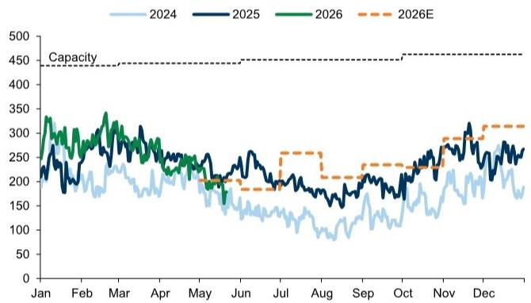
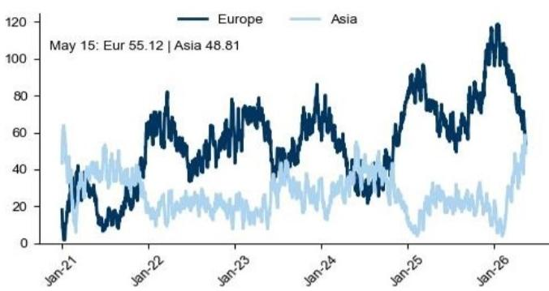
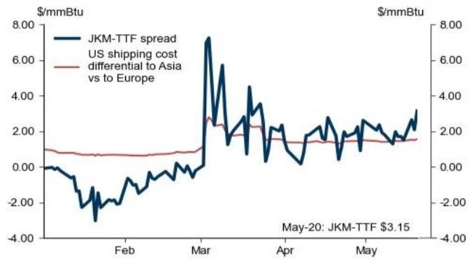

# 中国补库压力被市场低估，TTF和JKM的上行风险正在积聚

当大部分市场参与者的目光仍聚焦在霍尔木兹海峡的短期扰动时，一份来自某外资投行的最新天然气研报揭示了一个更值得关注的底层逻辑变化：**中国天然气需求虽然疲弱，但去库存的速度已经导致储气量同比转负，这意味着下半年LNG进口量必须显著回升才能为冬季做准备。** 这不是一个乐观的需求故事，而是一个被市场低估的供给侧再定价信号。

市场当前对欧洲天然气TTF价格的预测区间普遍在44-40欧元/兆瓦时，但该投行的情景分析显示，如果霍尔木兹海峡的流量正常化推迟至7月下旬（基准假设是6月底），TTF价格可能分别上行至65和53欧元/兆瓦时。这个风险溢价并非来自地缘政治的随机波动，而是来自亚洲——特别是中国——即将到来的结构性补库需求。

报告的框架并不复杂，但它的洞察力在于将三个看似独立的变量串联起来：中国储气数据的同比转负、全球LNG装船量的暂时性支撑、以及亚洲与欧洲之间的价差套利机制。当这些变量同时发生作用时，市场的平衡点正在移动。

## 1. 中国4月储气量同比转负，这是近几年来首次出现的信号

中国4月的天然气表观需求同比微降，年化水平约为3790亿立方米，低于该投行预期的3870亿立方米。这一偏差与中国4月整体经济活动的疲弱是一致的——工业增加值增速从3月的5.7%降至4.1%，而天然气密集型化工行业（根据IEA数据，2023年该行业消耗约400亿立方米天然气，折合2900万吨LNG）是拖累需求的主要领域之一。

但关键不在于需求本身，而在于供需的边际缺口。尽管需求疲弱，4月中国的LNG进口量仍远低于去年同期水平，同时国产气产量和管道气进口量也低于预期。三者叠加的结果是：中国地下储气库在4月的注气量低于预期，导致储气量同比首次出现下降。

这是近几年来的第一次。它意味着，即便需求不再增长，中国也需要在接下来的几个月内提高LNG进口量，才能将储气库恢复到同比正增长的水平，以应对下一个冬季的用气高峰。这不是一个“如果需求反弹”的假设情景，而是一个“无论需求如何，都必须补库”的硬约束。

高频数据已经给出了佐证。5月的LNG进口数据正在更明显地缩小与去年同期的差距，说明中国已经开始行动。这一趋势在夏季将持续。

## 2. 亚洲与欧洲的价差正在改变全球LNG的流向

中国的补库需求并不是孤立事件。它通过一个关键的价格信号传导到全球市场：JKM（日韩LNG现货价格）与TTF（欧洲天然气价格）之间的价差。

当前JKM-TTF价差已经足够覆盖美国LNG运往亚洲相对于运往欧洲的额外航运成本。这意味着，对于美国LNG出口商而言，将货物运往亚洲比运往欧洲更有利可图。套利机制正在引导全球LNG资源从大西洋流向太平洋。

这正是欧洲LNG进口量同比下滑的深层原因之一。尽管欧洲的储气库仍有库存支撑，但流入量的减少正在逐步侵蚀其缓冲空间。报告显示，西北欧的LNG进口量已经在环比下降，而这一趋势在夏季可能会加速。

问题在于，这种资源重配会否在冬季之前逆转？答案取决于两个变量：一是亚洲补库的力度，二是霍尔木兹海峡的恢复时间表。如果两者同时偏紧，欧洲将面临一个比预期更紧张的冬季。

## 3. 全球LNG装船量暂时回升，但不可持续

一个看似矛盾的信号是，全球LNG装船量在近期出现了同比正增长——这是自伊朗冲突开始以来的首次。马来西亚、阿曼、安哥拉等供应商推迟或取消了部分维护计划，以增加短期供应。

但这恰恰是市场脆弱的另一面。维护的推迟意味着未来维护需求只会更大，而不是消失。一旦供应商不得不恢复正常的检修周期，装船量将再次下滑。当前这种“透支未来”的增产模式，最多只能延缓欧洲进口量的下降，而无法逆转。

换句话说，市场正在用不可持续的手段来掩盖一个结构性的供应缺口。当维护季真正到来时，供需矛盾的暴露可能会更加剧烈。

## 4. 报告尚未完全回答的关键问题：中国补库的弹性空间有多大？

这篇研报的核心逻辑是清晰的，但有一个问题尚未完全展开：中国补库的弹性空间究竟有多大？

报告假设中国需要将储气量恢复到同比正增长，但并未量化这一过程所需的LNG进口增量具体是多少。中国是否可以通过增加国产气产量或管道气进口来部分替代LNG？国内储气库的注气能力是否存在瓶颈？如果需求进一步走弱，补库压力是否会相应减轻？

这些问题的答案直接决定了JKM与TTF价差的持续时间和幅度。如果中国的补库需求是刚性的，那么亚洲对LNG的争夺将推高全球价格中枢；如果存在缓冲余地，那么市场的上行风险可能被高估。

此外，报告对霍尔木兹海峡恢复时间的假设（6月底基准 vs. 7月下旬风险情景）也值得关注。这一变量是价格预测中最敏感的参数，但地缘政治事件的演进往往超出任何模型的假设范围。读者在参考这一判断时，需要结合自身对中东局势的独立评估。

## 5. 对产业决策者和投资者的观察框架

基于上述分析，我们建议读者建立一个三层观察框架来跟踪这一主题：

**第一层：中国高频数据。** 重点关注5-7月的中国LNG进口量和储气库注气速度。如果进口量连续三个月高于去年同期，且储气库同比增速转正，则补库压力正在兑现；如果进口量仍然低迷，则说明中国可能通过其他方式缓解了压力——这本身就是一个需要重新评估的信号。

**第二层：JKM-TTF价差的变化。** 这个价差是全球LNG套利机制的晴雨表。如果价差持续高于航运成本，说明亚洲正在从欧洲“抽水”；如果价差收窄，则说明资源重配的压力正在缓解。价差的拐点往往领先于价格的拐点。

**第三层：全球LNG装船量与维护计划。** 跟踪主要出口国（马来西亚、卡塔尔、澳大利亚、美国）的装船数据和维护公告。如果维护计划集中恢复，装船量将再次承压，这可能是市场情绪转变的催化剂。

这三个层面的信号，比任何单一的价格预测都更有助于判断市场的真实方向。

---

这份研报的核心价值不在于给出了一个具体的价格预测，而在于揭示了一个被市场忽视的结构性矛盾：中国的疲弱需求并没有阻止其库存的消耗，而补库的刚性需求正在通过套利机制重塑全球LNG的流向。对于那些关注能源资产定价、欧洲冬季用气成本、以及亚洲天然气市场动态的读者来说，这是一个值得持续跟踪的变量。

我们已经在星球微信群里开始讨论这一主题的更深层含义——包括中国补库弹性的量化测算、霍尔木兹海峡不同情景下的价格路径、以及哪些资产可能在这一轮再定价中受益。如果你对这些问题感兴趣，欢迎来星球微信群里继续讨论。

Personal reading notes and learning share only. Not investment advice.

