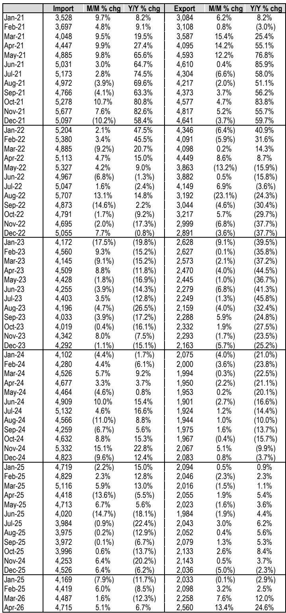
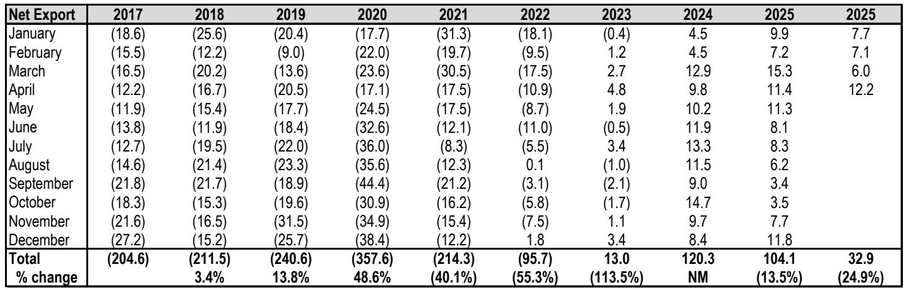
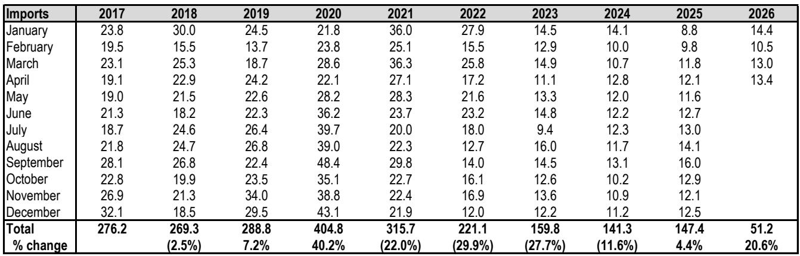

# China's Epoxy Resin Market Is Sending a Conflicting Signal: Export Volumes Are Slowing, but Pricing Power Is Surging

The global epoxy resin market has entered a phase of structural tension, and nowhere is this more visible than in China's trade data for April 2026. At first glance, the numbers appear straightforward: China exported 25.6 kilotons of epoxy resins in April, up 9% year-over-year, while the average export price surged to $2,560 per ton, a 24.6% increase from the same month last year. Import prices also rose, hitting $4,715 per ton, up 6.7% year-over-year. These are bullish figures on the surface. But the deeper story is far more nuanced and strategically important for anyone tracking commodity chemicals, supply chain realignment, or China's evolving role in global industrial markets.

The critical insight is this: China's epoxy resin trade is undergoing a qualitative shift, not just a quantitative one. The country has moved from being a net importer to a structural net exporter over the past three years, a transformation that reshapes competitive dynamics for producers worldwide. Yet the 2026 year-to-date data reveals a deceleration in net export volumes, down 25% compared to the same period in 2025. This is happening even as export prices climb sharply. The combination of lower volume growth and higher unit prices suggests that China's epoxy resin exporters are not simply flooding global markets with cheap material. They are exercising pricing discipline, likely responding to capacity consolidation, feedstock cost pressures, and a strategic pivot toward higher-value grades.

For investors and corporate strategists, the question is no longer whether China matters in epoxy resins. It does, decisively. The question is whether the current price rally is sustainable, and what it signals about the health of downstream demand, the trajectory of global capacity additions, and the shifting balance of power between Chinese producers and their international competitors.

## The Structural Break from Net Importer to Net Exporter Has Redefined the Global Epoxy Landscape

The most consequential development in the global epoxy resin market over the past decade is China's transition from a net importer to a net exporter. In 2023, China recorded net exports of 13 kilotons, the first positive reading in the 2017-2025 period. By 2024, net exports had exploded to 120 kilotons. In 2025, they remained elevated at 104 kilotons despite a 14% year-over-year decline. This is not a cyclical blip. It is a structural shift driven by massive domestic capacity expansion, improvements in production technology, and the maturation of China's downstream industrial base.

The implications are profound. For decades, global epoxy resin pricing was heavily influenced by the need for Chinese buyers to import high-quality material from Japan, South Korea, the United States, and Europe. That dynamic has reversed. Chinese producers now have sufficient scale and quality to serve domestic demand and compete aggressively in export markets. The 2024 export volume of 261.6 kilotons was more than five times the 2017 level of 71.5 kilotons. Even with the modest 3.8% pullback in 2025, the export base remains formidable.

What this means for non-Chinese producers is a permanent shift in competitive pressure. They can no longer rely on China as a natural import market for premium product. Instead, they must compete with Chinese exports in third markets, particularly in Southeast Asia, the Middle East, and Africa. The strategic question for international producers is whether they can differentiate on performance specifications, brand, or service, or whether they will be forced to cede market share on price.

## Export Volumes Are Slowing in 2026, but the Composition of Trade Is Improving

The year-to-date data for 2026 requires careful interpretation. Total exports from January through April reached 84.2 kilotons, down 2.5% versus the same period in 2025. April itself was a bright spot at 25.6 kilotons, up 9% year-over-year, but March exports fell sharply to 18.9 kilotons from 27.1 kilotons in March 2025. The volatility suggests that monthly comparisons can be misleading. The trend, however, is clear: export growth is decelerating from the breakneck pace of 2023 and 2024.

At the same time, imports are rising. April imports of 13.4 kilotons were up 11% year-over-year, and the year-to-date total of 51.2 kilotons represents a 21% increase. This is a striking development. Why would a country that has become a net exporter see a surge in imports? The answer likely lies in product mix. Chinese producers are exporting more standard-grade epoxy resins while continuing to import higher-value specialty grades that domestic capacity cannot yet produce at competitive quality or scale. The average import price of $4,715 per ton in April, nearly double the export price of $2,560 per ton, supports this interpretation.

This two-way trade pattern is a hallmark of a maturing industrial ecosystem. China is becoming both a low-cost supplier of commodity epoxy and a significant consumer of premium imported product. For global producers, this creates a bifurcated opportunity set. Those who can supply the highest-value grades to Chinese customers may still find a growing market. Those who compete on standard grades face relentless pressure.

## Pricing Power Is Recovering, but the Sustainability Depends on Feedstock Costs and Capacity Discipline

The most eye-catching data point in the report is the 24.6% year-over-year increase in April export prices to $2,560 per ton. This follows a 13.4% sequential increase from March's $2,258 per ton. Import prices also rose, but at a more modest 6.7% year-over-year pace. The export price recovery is notable because it comes after a prolonged period of compression. In April 2024, export prices were just $1,950 per ton. In April 2023, they were $2,470 per ton. The current level is the highest since early 2023.

The question is whether this pricing power is driven by genuine demand improvement, by cost-push factors, or by temporary supply constraints. The sequential acceleration from March to April suggests that at least part of the move is seasonal or demand-driven. But the broader context includes rising upstream costs for bisphenol A and epichlorohydrin, the two main feedstocks for epoxy resin. If feedstock prices remain elevated, producers may have limited ability to sustain margins even with higher selling prices.

Capacity discipline is another factor. The rapid capacity additions of recent years have slowed, as margins compressed and producers became more cautious. If Chinese producers are now operating at lower utilization rates and focusing on margin over volume, the pricing recovery could have more staying power. But the risk is that any sustained price rally will incentivize a new wave of capacity investment, repeating the cycle of overcapacity and margin compression that has plagued the industry.

## The Report Leaves Unanswered Questions About End-Use Demand and Competitive Dynamics

For all the detail in the trade data, the report does not provide a granular breakdown of where Chinese exports are going or what end-use sectors are driving demand. This is a meaningful gap. Epoxy resins are used in coatings, adhesives, electronics, wind turbine blades, aerospace composites, and construction. Each of these end markets has a different growth trajectory and sensitivity to price. Without knowing whether the export surge is concentrated in construction-related grades or in high-performance industrial applications, it is difficult to assess the quality of the demand.

Another open question is the competitive response from producers outside China. Are South Korean, Japanese, and European producers losing market share in third countries? Are they cutting prices to defend volume, or are they successfully repositioning toward higher-value segments? The trade data alone cannot answer these questions, but they are critical for any investor trying to forecast the next phase of the cycle.

There is also the question of trade policy. As Chinese epoxy exports grow, the risk of anti-dumping investigations in importing countries increases. The United States and the European Union have both shown willingness to impose duties on Chinese chemical exports when they perceive unfair pricing. Any escalation in trade friction could disrupt the current trajectory and create winners and losers among global producers.

## A Decision Framework for Epoxy Resin Market Participants

For readers trying to translate this data into actionable strategy, three analytical lenses are most useful.

First, assess your exposure to Chinese export volumes. If you are a buyer of standard-grade epoxy resin, the current environment offers relatively favorable pricing compared to the import alternative, but you must monitor supply continuity and potential trade disruptions. If you are a producer competing with Chinese exports, you need to evaluate whether your cost structure and product differentiation are sufficient to withstand a prolonged period of price pressure.

Second, watch the import-export price spread. The gap between China's import price and export price is currently around $2,155 per ton. A narrowing of this spread would indicate that Chinese producers are moving up the value chain and competing more directly with premium suppliers. A widening spread would suggest that the two markets are becoming more segmented, with Chinese producers stuck in the low-value segment.

Third, track capacity announcements and utilization rates. The most reliable leading indicator of future pricing is not current trade flows but the trajectory of capacity additions. If major Chinese producers announce new lines or if utilization rates rise above 85%, the current pricing recovery is likely to be short-lived. If capacity growth remains muted and utilization stays below 75%, the pricing environment could remain supportive for an extended period.

## The Full Picture Requires More Than Trade Data Alone

The April 2026 data provides a valuable snapshot of a market in transition. China's epoxy resin trade is no longer a simple story of import dependence or export-led growth. It is a complex, two-way flow that reflects the country's evolving industrial capabilities and its integration into global supply chains. The rise in export prices is encouraging for producers, but the deceleration in export volumes and the increase in imports raise important questions about the sustainability of the current trajectory.

To understand the full picture, one needs to look beyond the aggregate numbers. Which specific grades are driving the export price increase? Which countries are absorbing Chinese exports? How are international producers adjusting their strategies? What is the outlook for feedstock costs and new capacity? These are the questions that separate surface-level analysis from genuine strategic insight.

Join the community to read the full report and review the original charts. The complete analysis includes granular breakdowns by grade, destination market, and competitor positioning, as well as detailed price trend data that cannot be fully captured in a summary. For serious market participants, the difference between knowing the headline numbers and understanding the underlying dynamics is the difference between reacting to events and anticipating them.

*This article is for learning and discussion only and does not constitute investment advice.*

Personal reading notes and learning share only. Not investment advice.

