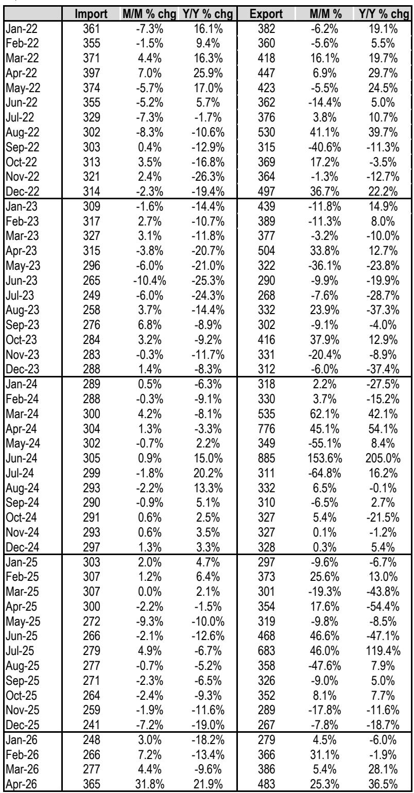
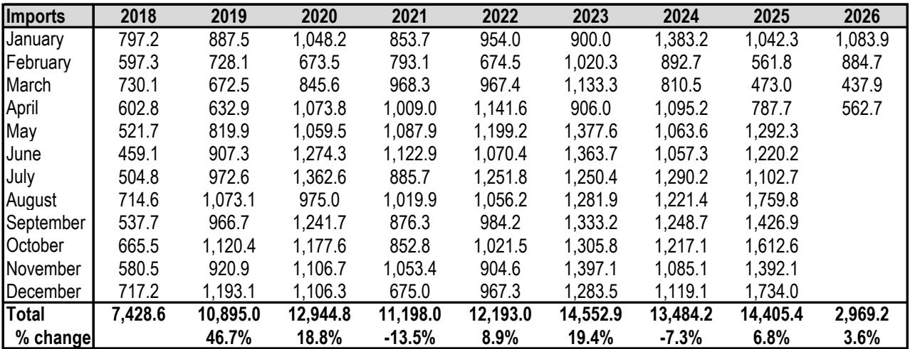
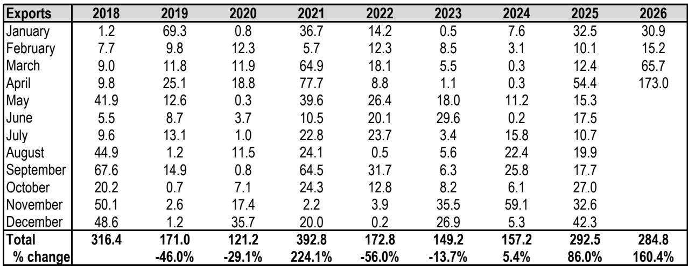

# China’s Methanol Trade Reversal Signals a Structural Shift, Not a Seasonal Blip

The global methanol market has just registered a signal that demands careful attention from strategic investors and commodity analysts. In April 2026, China’s methanol import prices surged 32% month-over-month to $365 per ton, the largest single-month jump in years, while export volumes tripled compared to the same month last year. This is not a routine seasonal adjustment. It is the clearest indication yet that China’s role in the global methanol market is undergoing a fundamental transformation—from a passive price taker importing at depressed levels to an active participant that is simultaneously tightening supply availability and capturing higher value from its own output.

For years, the conventional wisdom held that China would remain structurally dependent on imported methanol to feed its massive downstream chemicals and energy sectors. The April data challenges that assumption head-on. Import volumes fell 29% year-over-year to 563 kilotons, the lowest April figure since 2020, even as the year-to-date total remained 4% above 2025 levels. Meanwhile, exports exploded to 173 kilotons, more than tripling from 54 kilotons in April 2025 and nearly tripling from March 2026. The price dynamics are equally striking: export prices rose to $483 per ton, a 25% sequential gain and a 37% year-over-year increase, while import prices recovered from the multi-year trough of $241 per ton seen in December 2025.

What makes this moment strategically significant is that it occurs against a backdrop of already elevated global trade volumes. China imported a record 14.4 million tons of methanol in 2025, and the first four months of 2026 suggest another year above 14 million tons. But the composition is changing, and the direction of price flows is reversing. The question every participant in the methanol value chain should be asking is whether this is the beginning of a new equilibrium or a temporary dislocation driven by a single month of extraordinary activity.

## The April 2026 Data Breaks a Multi-Year Pattern of Depressed Import Pricing and Signals a Regime Change

The most important number in the entire dataset is not the volume of imports or exports—it is the import price trajectory. From January 2024 through March 2026, China’s import prices followed a clear downward trend, falling from $289 per ton to $277 per ton, with a brief stabilization around $300 per ton in early 2025 before collapsing to $241 per ton in December 2025. This was consistent with a market where global supply was ample, Chinese domestic production was rising, and buyers had pricing power.

April 2026 shattered that trend. The import price of $365 per ton represents a 32% sequential increase from March and a 22% year-over-year gain. To put this in context, the last time import prices were above $360 per ton was April 2022, during the post-pandemic commodity boom. The magnitude of the move is unprecedented in the available data series: the previous largest single-month increase was 7.2% in February 2026. A 32% jump is not a normal market adjustment—it is a structural repricing.

The implications are profound. If this price level holds or strengthens, it will compress margins for Chinese methanol consumers across formaldehyde, acetic acid, olefins, and methyl tert-butyl ether production. It will also make Chinese methanol exports more competitive in regional markets, particularly in Southeast Asia and the Indian subcontinent, where buyers have historically relied on Middle Eastern and North American supply. The export price of $483 per ton, while volatile, confirms that Chinese producers can capture significant premiums in international markets when domestic pricing dynamics shift.

## The Collapse in Import Volumes Is Not a Demand Problem—It Is a Supply and Pricing Strategy Shift

It would be tempting to interpret the 29% year-over-year decline in April import volumes as evidence of weakening Chinese demand. That interpretation would be incorrect. The year-to-date import total of 2.97 million tons is still 4% above the same period in 2025, suggesting that demand remains robust. The real story is about timing and pricing strategy.

China imported 1.08 million tons in January 2026 and 885 kilotons in February, both well above their 2025 counterparts. March imports dropped sharply to 438 kilotons, the lowest monthly figure since at least 2018, before recovering modestly to 563 kilotons in April. This pattern is consistent with a deliberate strategy: Chinese buyers front-loaded purchases in early 2026 when global prices were still depressed, then stepped back as prices began to rise. The sharp decline in March and April imports may reflect a tactical decision to draw down inventories rather than pay higher spot prices.

This is a classic behavior shift in a market transitioning from a buyer’s to a seller’s environment. When Chinese buyers had pricing power, they imported aggressively. Now that sellers are regaining leverage, Chinese buyers are conserving cash and relying on domestic production and inventory. The question is how long they can sustain this posture. If domestic production cannot fully replace imported volumes and inventories are drawn down, the next wave of Chinese buying could come at even higher prices, creating a self-reinforcing cycle.

## The Explosive Growth in Chinese Methanol Exports Represents a New Competitive Dynamic in Regional Markets

The export data is arguably the most underappreciated signal in the report. China exported 173 kilotons of methanol in April 2026, compared to 54 kilotons in April 2025 and 66 kilotons in March 2026. The year-to-date total of 285 kilotons is already 160% above the same period in 2025 and is on track to surpass the full-year 2025 total of 293 kilotons by mid-year.

This is not a one-off event. Chinese methanol exports have been trending upward since mid-2025, with notable spikes in July 2025 (683 kilotons export price) and consistent volumes above 30 kilotons per month since January 2026. The export price trajectory is volatile—ranging from $267 per ton in December 2025 to $683 per ton in July 2025—but the direction of volume is unequivocally higher.

The strategic implication is that China is transitioning from a net importer to a more balanced trade participant. This has direct consequences for traditional methanol exporters to Asia, particularly producers in the Middle East, Southeast Asia, and the United States. If Chinese exports continue to grow, they will compete directly with established suppliers in key Asian markets. The price premium that Chinese exports command—$483 per ton in April versus $365 per ton for imports—suggests that Chinese material is being sold into higher-value applications or markets where quality and reliability command a premium.

## What the Report Does Not Fully Answer: The Sustainability of the Price Spike and the Role of Domestic Production

For all its analytical rigor, the report leaves several critical questions unanswered. The most pressing is whether the April price spike is sustainable or merely a statistical outlier driven by a single month of tightness. The historical data shows that Chinese import prices have experienced sharp reversals before: in August 2022, prices fell 8.3% month-over-month after a period of strength, and in June 2023, they dropped 10.4% after a similar run-up. The current move is larger in magnitude, but its durability depends on factors the report does not fully explore.

First, what is happening with Chinese domestic methanol production? The report provides no data on domestic output, capacity utilization, or new plant startups. If Chinese producers are running at high utilization rates and bringing new capacity online, the need for imports could decline further, putting downward pressure on prices. Conversely, if production is constrained by feedstock costs, environmental regulations, or maintenance shutdowns, the import requirement could surge.

Second, what is the inventory picture? The report does not include data on Chinese methanol inventories, either at ports or at downstream consumers. Inventory levels are the critical buffer between production and consumption. If inventories are high, Chinese buyers can afford to wait out the price spike. If inventories are low, they will be forced back into the market at current or higher prices.

Third, what is the role of the energy transition? Methanol is increasingly used as a marine fuel, a feedstock for olefins, and a hydrogen carrier. These demand sources are growing faster than traditional chemical applications. The report does not disaggregate demand by end-use, making it difficult to assess whether the April data reflects structural demand growth or cyclical factors.

## A Decision Framework for Strategic Positioning in the Methanol Market

For investors and corporate strategists, the April data provides a clear framework for decision-making. The key variable is whether the import price of $365 per ton represents a new floor or a temporary peak. The answer depends on three factors that can be monitored in real time.

First, track Chinese import volumes over the next two to three months. If May and June imports remain below 600 kilotons, it confirms that Chinese buyers are comfortable with current inventory levels and domestic supply. If imports rebound above 800 kilotons, it signals that the price spike is being accepted as the new normal, which would support further upside.

Second, monitor the spread between Chinese export prices and regional benchmarks in Southeast Asia and India. If Chinese exporters can sustain prices above $450 per ton while maintaining volume growth, it validates the thesis that Chinese material is gaining market share in premium applications. If export volumes decline or prices fall back toward $350 per ton, the competitive dynamic is weaker than the April data suggests.

Third, watch for announcements of new Chinese methanol capacity. If major producers bring new plants online in the second half of 2026, the supply overhang could reverse the price gains. If capacity additions are delayed or canceled, the current tightness could persist.

The most important strategic conclusion is that the old assumption of China as a structurally dependent methanol importer is no longer reliable. The April data forces a reassessment of trade flows, pricing power, and competitive positioning across the entire methanol value chain. Investors who treat this as a one-month anomaly risk missing a structural shift that will reshape the market for years to come.

## The Full Picture Requires Granular Data That Only a Dedicated Research Platform Can Provide

The analysis above is based on publicly available trade data from the China General Administration of Customs, but the most valuable insights come from the full report, which includes detailed historical tables, analyst commentary, and proprietary modeling that cannot be replicated from headline numbers alone. The report from which this analysis is drawn contains eight years of monthly import and export data, pricing trends, and analyst certifications that provide context and credibility.

Understanding whether the April 2026 data is a turning point or a false signal requires access to the complete dataset, the ability to cross-reference with production and inventory data, and the analytical framework that only a dedicated research team can provide. The original report includes figures that show the full trajectory of imports, exports, and pricing from 2018 through April 2026, allowing readers to see the pattern in its entirety rather than through the lens of a single month.

Join the community to read the full report and review the original charts.

*This article is for learning and discussion only and does not constitute investment advice.*

Personal reading notes and learning share only. Not investment advice.

