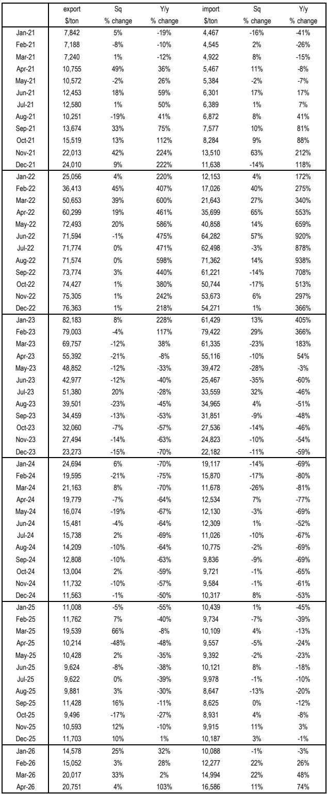
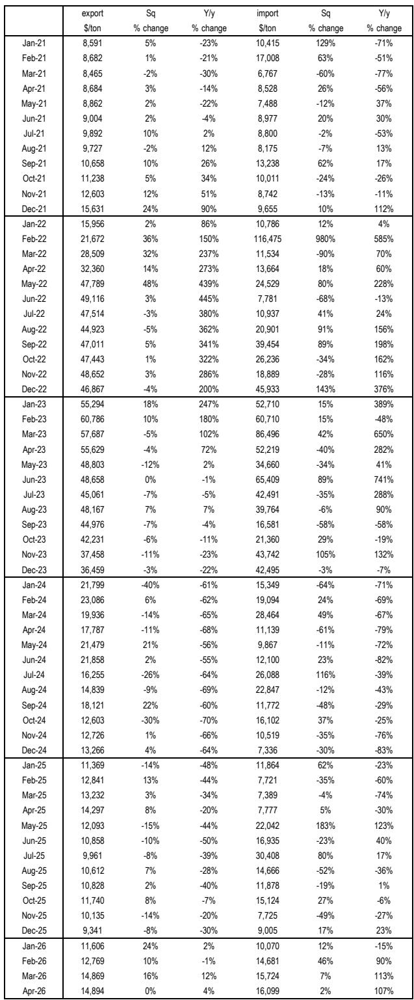
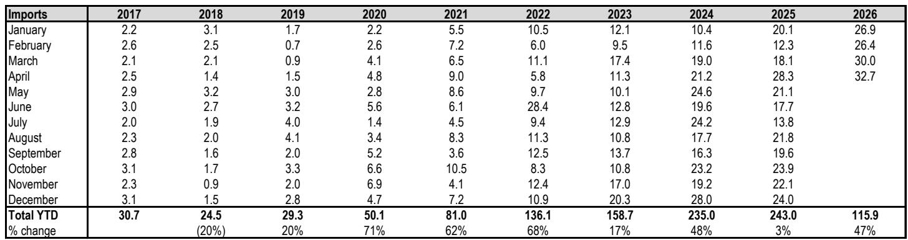

# 中国锂贸易正在经历一次定价权的结构性转移，而非周期波动

这份报告的四月进出口数据，表面上是月度数据的更新，但放在2026年以来的连续趋势中看，它揭示了一个更根本的变化：中国正在从锂化工品的“净出口定价者”转向“净进口成本接受者”，而市场对这一身份转换的长期含义可能尚未充分定价。

某外资投行的这份研报提供了截至2026年4月的完整进出口时间序列。数据本身并不复杂，但合在一起指向一个清晰的结论：锂行业的获利逻辑正在被重写，而过去几年形成的“中国供给过剩、价格承压”的叙事，可能低估了结构性的力量。

---

## 1. 中国氢氧化锂已从净出口国转为净进口国，这一身份转换的定价含义远未被消化

2026年前四个月，中国氢氧化锂净进口量达到10.2千吨，而2025年同期还是净出口35.4千吨。这是中国首次在氢氧化锂贸易中成为净进口方。

这不是一个边际变化。回顾历史序列，中国氢氧化锂净出口量从2017年的18.1千吨一路增长至2023年的126.2千吨，2024年才首次回落至112.6千吨。2025年骤降至35.4千吨，2026年直接转为净进口。这一趋势的斜率在加速。

这意味着什么？中国不再是全球氢氧化锂的边际供给方，而是变成了边际需求方。当中国从“卖货的人”变成“买货的人”，全球定价的锚点会发生位移。此前市场习惯用“中国供给过剩”来压低远期价格预期，但这一逻辑的前提正在瓦解。

---

## 2. 碳酸锂进口量价齐升，但进口价格涨幅远超国内现货，暗示海外供给溢价正在系统性地重新建立

2026年4月，中国碳酸锂进口量为32.7千吨，同比增长15%。进口价格达到每吨16,586美元，同比上涨74%，环比也上涨11%。

关键点不在于进口量本身——进口量增长已经是连续第三年的趋势。真正值得关注的是价格。进口均价从2025年4月的9,557美元/吨跳升至16,586美元/吨，而同期国内碳酸锂现货价格并未出现同等幅度的上涨。这意味着海外碳酸锂对中国买家的溢价正在扩大。

这一溢价可能来自几个方面：一是海外锂精矿成本上升传导；二是海外锂盐厂在经历了2023-2024年的价格暴跌后，产能出清导致供给刚性；三是非中国市场的电动车和储能需求正在独立于中国市场增长，形成了对海外锂盐的竞争性采购。无论原因如何，中国作为最大买家，正在失去对进口价格的议价能力。

---

## 3. 氢氧化锂出口价格企稳而碳酸锂进口价格飙升，两者价差已经倒挂，这是过去十年未曾出现的信号

2026年4月，中国氢氧化锂出口均价为14,894美元/吨，环比持平，同比仅上涨4%。而碳酸锂进口均价为16,586美元/吨，两者价差约为1,692美元/吨，且碳酸锂更贵。

这一价差倒挂值得深思。传统上，氢氧化锂由于加工难度更高、纯度要求更严，其价格通常高于碳酸锂。当前氢氧化锂出口价低于碳酸锂进口价，意味着要么氢氧化锂的全球定价被低估，要么碳酸锂的进口溢价被高估，或者两者同时发生。

从产业链角度，氢氧化锂主要用于高镍三元正极材料，而碳酸锂主要用于磷酸铁锂和低镍三元。价差倒挂可能反映出两个结构性变化：一是海外对磷酸铁锂路线的接受度正在快速提升，推动碳酸锂需求增长；二是中国氢氧化锂的出口竞争力正在受到海外本土化产能的挤压。无论哪种解释，对锂盐企业的产品组合策略和区域布局都有直接含义。

---

## 4. 2026年前四个月碳酸锂净进口量同比激增47.8%，但国内库存并未同步累积，说明真实需求可能被低估

2026年1-4月，中国碳酸锂净进口量达到114.0千吨，较2025年同期的77.1千吨增长47.8%。同期国内碳酸锂产量也在增长，但社会库存并未出现大幅累积。

库存数据在这份报告中并未直接给出，但可以从进口量、产量和价格的组合中推断：如果供给大幅增加而价格没有暴跌，说明需求端在消化这些增量。2026年前四个月，国内碳酸锂价格虽然没有像进口价格那样飙升，但也没有出现2023-2024年那样的持续下跌。价格企稳本身就是一种信号。

市场此前普遍担心中国电动车和储能增速放缓会导致锂需求见顶，但进口数据指向的是另一个方向：中国对锂的真实消耗可能比官方统计数据更强劲，或者下游补库行为正在发生。无论是哪种情况，基于“需求疲软”来押注锂价继续下跌的风险都在上升。

---

## 5. 报告尚未完全回答的关键问题：进口价格的上涨是成本推动还是需求拉动，决定了这一趋势的可持续性

这是整份报告最值得追问的问题，但数据本身无法给出答案。

如果进口价格上涨主要是由海外锂精矿成本上升推动的，那么中国锂盐厂可以通过提高国内矿石自给率或转向回收料来对冲。但如果价格上涨是由海外终端需求拉动，意味着中国需要为锂支付全球边际成本，而这一成本可能远高于国内生产商的盈亏平衡点。

另一个未解的问题是：氢氧化锂的净进口趋势是否会持续。2026年前四个月的数据可能受到季节性因素或特定项目交付的影响，需要更多月份的数据来确认趋势的可靠性。如果氢氧化锂确实进入了长期净进口状态，那么中国锂盐厂的盈利模型需要从根本上重新评估。

这些疑问的答案，将在未来三到六个月的进出口数据和国内库存变化中逐步显现。对于关注锂行业资产定价的读者而言，这些变量比短期价格波动更值得跟踪。

---

欢迎来星球微信群里继续讨论。我们会在群内持续追踪后续月份的进出口数据和库存变化，并分享对锂盐企业盈利模型的更新判断。如果你对这份报告中的价格序列完整版或某外资投行的行业框架感兴趣，也欢迎在群内交流。

Personal reading notes and learning share only. Not investment advice.

