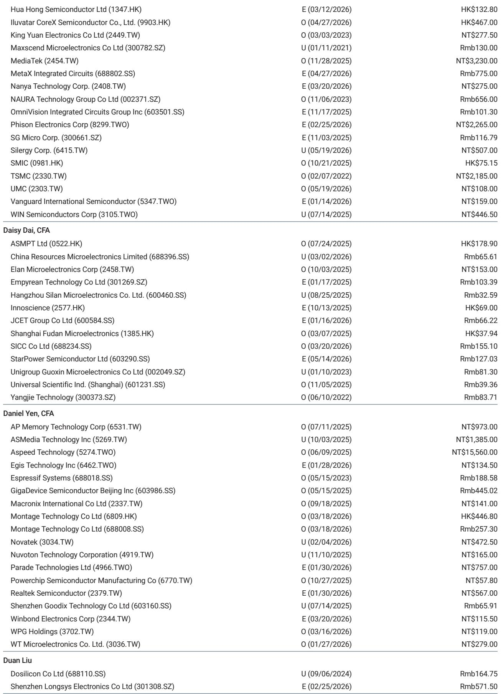
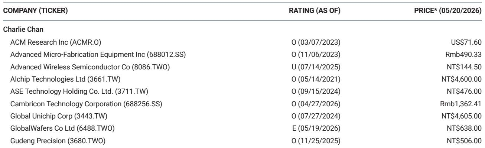
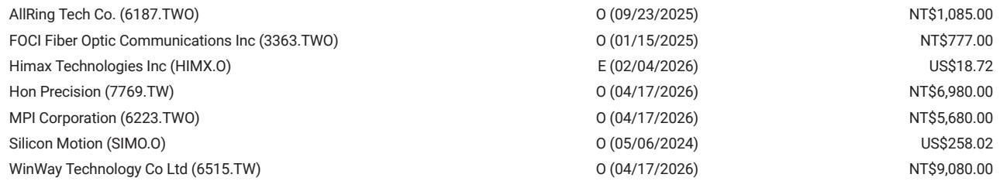

# The Silicon Capacitor Supply Chain Is Being Rewired: Why the Largest TAM Opportunity May Belong to Memory Foundries, Not Logic Fabs

A single supply contract worth approximately USD 1 billion has just reshaped the competitive landscape for advanced packaging components. When SEMCO announced a two-year silicon capacitor supply agreement with a global-scale customer, the market immediately focused on the revenue visibility for one company. The more consequential story, however, is what this contract reveals about the structural transformation of the entire silicon capacitor addressable market. This is not merely a supplier win. It is a signal that silicon capacitors are transitioning from a niche enabler for advanced packaging into a volume-driven commodity with a total addressable market large enough to attract the attention of DRAM foundries, reshape capacity allocation strategies, and create multi-year growth trajectories for suppliers who secure the right process partnerships.

The timing of this contract matters as much as its size. With delivery scheduled to begin in January 2027, the agreement locks in supply for next-generation EMIB-T architectures on upcoming TPU generations. But the real strategic insight lies in what comes after. The contract structure itself reveals a critical feature of this market: silicon capacitor supply is an oligopoly, and customers are increasingly willing to sign long-term agreements to secure capacity. This dynamic has profound implications for which semiconductor manufacturers will capture the value of this growing market, and which will be left watching from the sidelines.

The argument of this article is straightforward but carries significant investment implications: the silicon capacitor market is undergoing a structural expansion that will benefit suppliers who can leverage legacy DRAM manufacturing processes, and the emerging supply chain configuration points to Taiwan-based DRAM foundries as the most likely beneficiaries. The report from which this analysis is drawn identifies a specific opportunity for Winbond, but the broader thesis applies to any memory-capable foundry willing to repurpose older nodes for this application.

## The Silicon Capacitor Market Is No Longer a Niche: A USD 1 Billion Contract Confirms That Volume Demand Has Arrived

To understand why this contract represents a structural shift, one must first appreciate the historical context of silicon capacitors. These components have long been recognized as superior to multilayer ceramic capacitors in applications requiring high capacitance density, low equivalent series resistance, and stable performance across temperature ranges. Yet despite these technical advantages, silicon capacitors remained a relatively small market, constrained by limited production capacity and a narrow customer base concentrated in high-end computing.

The SEMCO contract shatters this paradigm. A single customer committing to USD 1 billion in purchases over two years implies annual volumes that would have been unthinkable just a few years ago. When one considers that this is likely just the beginning of a broader procurement cycle, the implications for total addressable market become clear. The report suggests that additional customers are already emerging, particularly in mobile applications, as AP Memory indicated on its earnings call. This pattern of demand diversification is critical: it transforms silicon capacitors from a single-application component tied to AI accelerators into a platform technology spanning multiple end markets.

The so-what here is that the silicon capacitor supply chain is now facing a demand profile that outstrips current capacity. This creates a structural shortage that will persist until new fabrication capacity comes online. The question for investors is not whether the market will grow, but which suppliers will have the manufacturing capability and process expertise to capture that growth. The answer, as the report makes clear, depends heavily on the unique manufacturing requirements of silicon capacitors and the specific advantages of legacy DRAM processes.

## Legacy DRAM Processes Offer a Structural Cost Advantage for Silicon Capacitor Fabrication, Creating an Opportunity for Memory Foundries

The technical details of silicon capacitor manufacturing are essential to understanding why this market will benefit DRAM foundries rather than logic foundries. Silicon capacitors require deep trench etching to create high-aspect-ratio structures that maximize capacitance per unit area. This is not a capability that every foundry possesses. It requires precise control of etch depth, uniformity across the wafer, and the ability to manage the mechanical stresses that arise from deep trench formation.

The legacy DRAM process is ideally suited for this application. DRAM manufacturing has historically relied on deep trench capacitor technology to achieve the capacitance needed for memory cell operation. Over decades of development, DRAM manufacturers have refined their ability to etch deep trenches with high uniformity and repeatability. While the most advanced DRAM nodes have moved to stacked capacitor designs, the deep trench expertise remains embedded in the manufacturing capabilities of older DRAM fabs. These fabs are now operating at lower utilization rates as the industry transitions to more advanced nodes, creating an opportunity to repurpose their capacity for silicon capacitor production.

The economic logic is compelling. A legacy DRAM fab that has been fully depreciated can offer silicon capacitor manufacturing at significantly lower cost than a new logic fab built for the same purpose. The capital expenditure has already been incurred, the process expertise is already in place, and the cleanroom infrastructure is already certified. The marginal cost of adding silicon capacitor production to an existing DRAM fab is far lower than building greenfield capacity. This cost advantage, combined with the technical suitability of the process, creates a natural competitive moat for DRAM foundries that choose to enter this market.

## The Supply Chain Configuration Is Shifting: Taiwan DRAM Suppliers Are Positioned to Capture the Next Wave of Silicon Capacitor Growth

The report identifies a specific dynamic in the current supply chain that reinforces this thesis. Powerchip Semiconductor Manufacturing Corporation, or PSMC, which has been a key supplier in the silicon capacitor ecosystem, is now operating at full capacity. This capacity constraint creates an opening for other suppliers to step in and capture the incremental demand that PSMC cannot fulfill. The report suggests that Winbond could be a potential partner for SEMCO in this context, representing a low single-digit percentage of total revenue mix in 2027 estimates.

This is not merely a tactical observation about one company. It reflects a broader structural shift in how the silicon capacitor supply chain will evolve. As demand continues to grow beyond the capacity of existing suppliers, customers will need to qualify new manufacturing sources. The qualification process for silicon capacitors is lengthy and rigorous, involving extensive reliability testing and performance validation. Customers who have already committed to long-term contracts will have strong incentives to accelerate the qualification of alternative suppliers to ensure supply security.

The strategic implication is that Taiwan-based DRAM foundries, which have deep experience in high-volume manufacturing and a track record of process reliability, are natural candidates for this role. Winbond is the most obvious candidate identified in the report, but the logic extends to other memory-capable foundries in the region. The combination of available capacity, process expertise, and geographic proximity to the advanced packaging ecosystem in Taiwan creates a powerful value proposition for customers seeking to diversify their silicon capacitor supply base.

## What the Report Does Not Fully Answer: The Timing and Magnitude of Mobile Market Adoption and the Risk of Overcapacity

While the report provides a compelling framework for understanding the silicon capacitor opportunity, it leaves several critical questions unresolved. The most important of these concerns the pace and scale of mobile market adoption. AP Memory has indicated that mobile applications are a potential growth vector for silicon capacitors, but the report does not provide detailed estimates of the total addressable market in this segment. Mobile devices have very different cost structures and performance requirements compared to AI servers. The adoption of silicon capacitors in mobile will depend on whether the cost premium over MLCCs can be justified by the performance benefits, and whether the supply chain can deliver the volumes required by the mobile industry at competitive prices.

A second unresolved question relates to the risk of overcapacity. The report identifies a structural shortage today, but the very dynamics that make this market attractive could also lead to overinvestment in capacity. If multiple DRAM foundries decide to repurpose their legacy fabs for silicon capacitor production, the market could swing from shortage to surplus within a few years. The long-term contracts that customers are signing today provide some visibility, but they also lock in pricing that may prove too high if capacity comes online faster than demand materializes.

A third question concerns the technology roadmap. Silicon capacitors are a relatively mature technology, but there is always the risk that alternative solutions could emerge that offer better performance or lower cost. Innovations in MLCC technology, for example, could narrow the performance gap, while advances in integrated passive devices could offer a different approach to the same problem. Investors need to assess not just the current opportunity but the durability of the competitive advantage that silicon capacitors enjoy.

## A Decision Framework for Evaluating Silicon Capacitor Investment Opportunities

For investors seeking to translate this analysis into actionable decisions, a structured framework is essential. The following five questions provide a systematic approach to evaluating companies in the silicon capacitor ecosystem.

First, what is the company's access to legacy DRAM manufacturing capacity? The most important competitive advantage in this market is the ability to produce silicon capacitors at low cost using fully depreciated DRAM fabs. Companies that own such capacity, or have secured long-term access to it through partnerships, will have a structural cost advantage over competitors that must build new fabs or use more expensive logic processes.

Second, what is the company's qualification status with key customers? The silicon capacitor market is characterized by long qualification cycles and high switching costs. Companies that have already achieved qualification with major customers, or are in the process of doing so, have a significant advantage over new entrants. The SEMCO contract demonstrates that customers are willing to commit to long-term agreements once qualification is complete, which provides revenue visibility and reduces execution risk.

Third, how diversified is the company's customer base? While AI servers are the primary demand driver today, the most attractive investment opportunities will be those that can serve multiple end markets. Companies that can supply silicon capacitors for mobile devices, automotive applications, and high-performance computing will have more resilient revenue streams and greater growth optionality.

Fourth, what is the company's capacity expansion plan? The market is growing faster than current capacity, but the timing of new capacity additions will determine which companies capture the most value. Companies that can bring new capacity online quickly, without sacrificing quality or yield, will benefit from the current supply shortage. Those that are slow to expand may miss the window of opportunity.

Fifth, what is the company's exposure to the risk of technological disruption? Silicon capacitors are not immune to innovation. Companies that are investing in next-generation silicon capacitor technology, such as higher capacitance density or improved reliability, will be better positioned to defend their market position against alternative solutions. Those that are relying solely on current technology may find their competitive advantage eroded over time.

## The Full Report Contains Detailed Financial Models and Capacity Projections That Are Essential for Investment Decisions

The analysis presented here provides a strategic framework for understanding the silicon capacitor opportunity, but the full report contains the granular financial data and capacity projections that are necessary for investment decision-making. The report includes detailed revenue and earnings estimates for the key companies in the supply chain, as well as scenario analysis that shows how different adoption rates and pricing assumptions would affect the financial outcomes.

Perhaps most importantly, the report contains the original charts that illustrate the supply-demand dynamics, the cost curves, and the competitive positioning of the various players. These charts are not merely decorative; they are analytical tools that allow investors to stress-test their assumptions and develop their own independent views on the market.

Join the community to read the full report and review the original charts.

*This article is for learning and discussion only and does not constitute investment advice.*

Personal reading notes and learning share only. Not investment advice.

