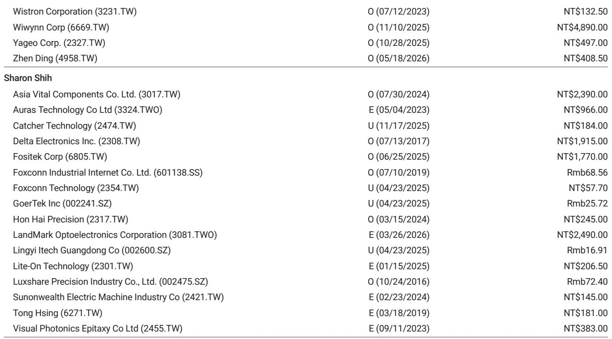
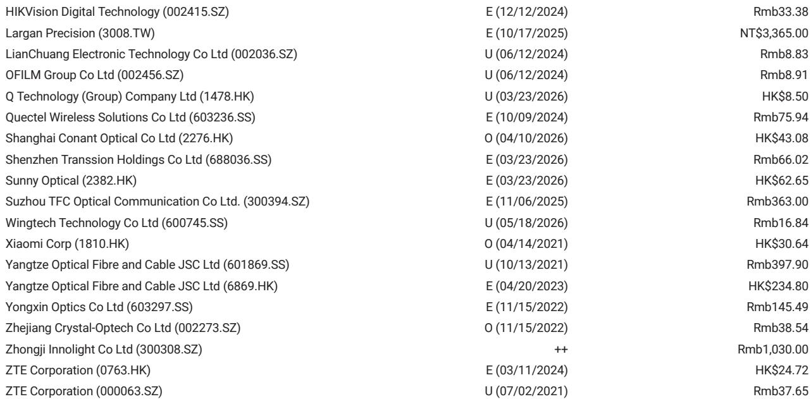
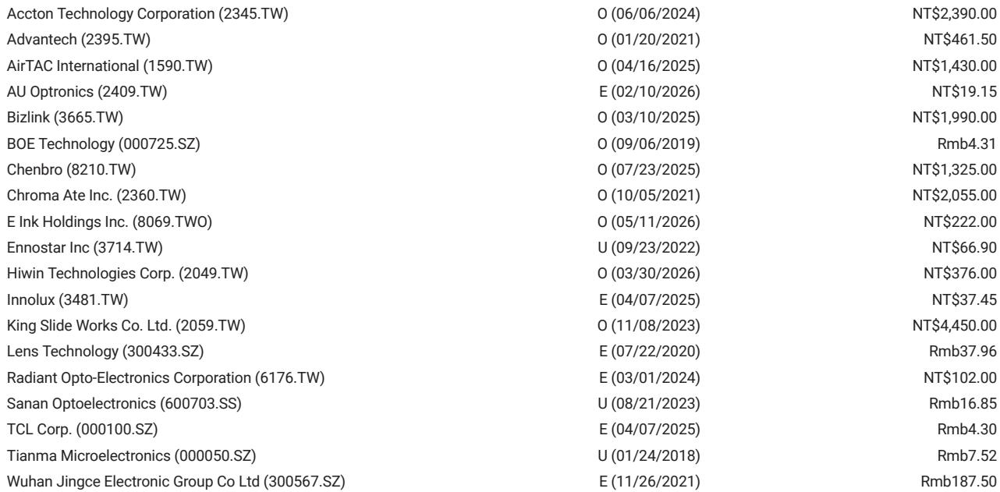

# 中国PC与平板出货量下滑，真正值得关注的不是总量，而是份额的剧烈重塑

2026年3月的数据已经出炉。中国PC出货量同比下滑2%，平板出货量同比下滑3%。如果只看这两个数字，很容易得出一个结论：消费电子需求依旧疲软，行业仍在底部徘徊。

但这样的判断，恰恰会让人错过这份数据里真正重要的信号。

某外资投行在最新发布的研报中，给出了比总量更值得拆解的结构性细节。3月中国PC出货256万台，平板出货298万台，环比分别增长30%和47%，说明春节后的补货周期仍在正常运转。真正的关键，藏在各品牌同比增速的巨大分化里——华为PC同比暴跌47%，而华硕猛增38%，苹果平板同比下滑21%，联想平板却逆势增长6%。这些数字指向的不是一个“整体疲软”的市场，而是一个正在激烈重分配的市场。

市场真正低估的不是需求，而是供给侧的再定价。当总量增速趋近于零，竞争就从“做大蛋糕”变成了“切分蛋糕”。谁能在存量市场中抢到份额，谁就能获得远超行业均值的利润弹性。而这份研报提供的数据，恰恰给了我们一个审视这场份额争夺战的绝佳窗口。

## 1. 总量接近零增长，但品牌间的增速差接近100个百分点

先看PC市场。3月256万台的出货量，同比-2%，前两个月累计同比-4%。这个数字放在过去两年的背景下，并不算特别糟糕。2024年同期基数并不高，2025年市场曾短暂回暖，现在只是重新回到一个相对平稳的通道。

但品牌层面的分化才是真正的故事。

联想出货74.5万台，同比-8%，累计同比+3%。作为市场老大，联想的表现中规中矩，份额暂时稳定，但增速并不亮眼。华为出货14.6万台，同比-47%，累计同比-18%。这个跌幅在主要品牌中是最极端的。华硕出货31.8万台，同比+38%，累计同比+4%，环比增幅更是高达146%。同方出货16.7万台，同比+56%，累计同比+16%。苹果出货19.6万台，同比+63%，累计同比+42%。

增速从-47%到+63%，相差110个百分点。这不是一个“所有品牌都很难卖”的市场，而是一个“有人在大幅失血、有人在大幅吃肉”的市场。

平板市场同样如此。华为出货79.4万台，同比+1%，累计同比-8%。苹果出货73.7万台，同比-21%，累计持平。小米出货30.9万台，同比-36%，累计同比-40%。联想出货32.6万台，同比+6%，累计同比+8%。

苹果和小米都在下滑，但联想在增长。华为虽然单月勉强持平，但累计仍在下降。

这些数据放在一起，一个清晰的判断已经浮现：中国PC和平板市场的竞争格局正在经历一次深度重构，旧有的品牌护城河正在被侵蚀，新的挑战者正在快速起量。

## 2. 华为PC的暴跌并非需求问题，而是供给侧的主动收缩

在所有数据中，华为PC的-47%同比跌幅是最值得追问的。

华为不是没有品牌力，不是没有渠道能力，更不是没有产品力。2025年上半年，华为PC还曾有过不错的表现。那么，2026年3月发生了什么？

报告没有直接给出原因，但我们可以从逻辑上推断。

一种可能是，华为正在主动调整产品策略，将资源向更核心的业务线倾斜。考虑到华为在芯片、操作系统、企业级服务等多个方向的持续投入，PC业务可能并非其当前最高优先级。另一种可能是，华为PC的供应链或产品节奏出现了阶段性中断，导致出货量出现异常波动。

但无论原因是什么，-47%的同比跌幅都意味着，华为在PC市场留下了巨大的份额真空。这个真空正在被谁填补？

华硕和同方的表现给出了答案。华硕3月出货量环比暴增146%，同比+38%，是PC市场中增长最猛的主流品牌。同方同比+56%，连续多月保持高增长。这两家品牌，一个来自台湾，一个来自大陆，但都在华为退出的空间中找到了自己的位置。

这对行业格局的含义是：PC市场的品牌集中度可能在短期内重新上升，但方向不是向头部集中，而是向那些能够快速响应供给缺口、拥有灵活渠道和定价能力的品牌集中。华硕和同方未必能长期维持这个增速，但至少在2026年第一季度，它们证明了自己是存量博弈中的赢家。

## 3. 苹果平板的下滑和联想平板的增长，反映的是同一件事

平板市场的数据同样值得拆解。

苹果iPad出货73.7万台，同比-21%。这是苹果在中国平板市场罕见的双位数下跌。小米出货30.9万台，同比-36%，跌幅更大。与此同时，联想平板出货32.6万台，同比+6%，环比暴增168%。

苹果和小米的下跌，不能简单归因于“市场不好”。因为联想在增长。更合理的解释是：苹果和小米在2025年同期的基数中包含了某些一次性需求（比如新品发布效应），而2026年3月缺乏类似的刺激因素。但联想的增长说明，即使在总量下滑的背景下，只要产品定位和渠道策略得当，依然可以拿到增量。

这里有一个更深的洞察：平板市场正在从“消费电子”向“生产力工具”迁移。联想在商用和教育场景中有长期积累，这种积累在消费需求疲软时，反而成为稳定的基本盘。苹果iPad虽然仍是高端市场的绝对主力，但-21%的同比下滑表明，它的更新周期正在拉长，用户换机意愿在下降。

小米的问题更典型。作为以性价比著称的品牌，小米平板在2024-2025年经历了快速增长，但2026年3月的-36%同比下跌说明，性价比策略在存量市场中的边际效用正在递减。当所有品牌都在降价时，性价比就不再是差异化优势。

## 4. 报告尚未完全回答的关键问题：份额变化的可持续性

这份研报提供了极其及时和颗粒度足够细的数据，但它也不可避免地留下了一些尚未回答的问题。这些问题是读者在做出判断时需要自行思考的。

第一，华为PC的暴跌是暂时的还是结构性的？如果只是产品节奏问题，那么下半年华为可能重新回归，届时华硕和同方的增速能否维持？如果华为在战略上主动收缩，那么这个份额真空就是永久性的，竞争格局将发生根本变化。

第二，苹果iPad的-21%是否意味着产品周期见顶？苹果在2025年没有推出iPad Pro的重大更新，这可能是销量下滑的直接原因。但如果2026年下半年苹果推出新品，iPad的出货量可能迅速反弹。这一假设目前尚未验证。

第三，联想在平板市场的增长是否可持续？环比+168%的增幅显然受到春节后渠道补货的拉动，同比+6%的数字虽然稳健，但远没有华硕在PC市场的增速那么耀眼。联想能否在平板市场持续从苹果和小米手中抢份额，仍需要未来几个月的数据来确认。

这些未解问题，恰恰是这份研报最有价值的部分——它让读者看到了数据背后的不确定性，而不是给出一个看似确定实则空洞的结论。

## 5. 一个更长期的观察框架：存量市场的竞争逻辑

对于产业决策者和投资者而言，这份数据提供了一个重新校准观察框架的契机。

在增量市场中，判断一家公司的前景，主要看它的产品力、品牌力和渠道覆盖。但在存量市场中，竞争逻辑发生了根本变化。真正决定胜负的，变成了三个维度：

第一，供给弹性。当某个主要品牌突然出现供给缺口时，谁能最快地填补这个缺口？华硕3月环比+146%的出货量增长，说明它在供应链和渠道上具备极强的弹性。这种弹性在存量市场中比品牌溢价更重要。

第二，场景深耕。平板市场的分化表明，消费场景和商用场景的增速正在脱钩。联想在商用和平板市场的增长，不是因为它的产品比苹果更好，而是因为它更早地深耕了教育、政务、企业采购等场景。这些场景的需求波动小、客户粘性高，是存量市场中的稳定器。

第三，定价权的来源。华为PC的暴跌说明，即使拥有强大的品牌和技术能力，如果产品节奏或战略重心出现问题，市场份额的流失速度可能远超预期。定价权不再来自品牌本身，而是来自“在正确的时间、以正确的价格、出现在正确的渠道”这一组合能力。

这三个维度，是读者在观察后续数据时应该重点关注的。它们比月度出货量的同比数字，更能揭示一家公司的真实竞争力。

## 6. 顺着这些未解问题，继续深入

这份研报的价值，不在于它给出了一个“市场好不好”的简单答案，而在于它用数据拆解出了一个远比总量更复杂的竞争图景。

华为的份额为什么在快速流失？华硕和同方的增长是昙花一现还是趋势确立？苹果iPad的下滑是周期性的还是结构性的？联想的平板业务能否持续突破？这些问题的答案，需要更多的数据和更深入的产业链验证才能浮现。

欢迎来星球微信群里继续讨论。我们会持续跟踪这些品牌的月度出货数据，并在关键节点更新我们的判断。同时，我们也整理了这份研报的完整PDF和更多未公开的图表数据，供群内读者参考。

Personal reading notes and learning share only. Not investment advice.

