# The Flow Show

# Ground Control to Major TAM

Scores on the Doors: oil 70.4%, international stocks 10.1%, US stocks 8.8%, gold 4.4%, cash 1.4%, HY bonds 1.0%, US\$ 0.9%, IG -0.4%, govt bonds -1.6%, bitcoin -11.7% YTD.

Zeitgeist: “Everyone is now convinced that equities are the best inflation hedge.”

The Biggest Picture: strong price action, retail mania, slumping vol...so bubbly; add mega IPOs to AI big boys and market concentration easily surpasses (\~48%) bubbles of roaring '20s, Nifty 50 '70s, Japan '80s, TMT '90s (Chart 2 - but not railroads in 1880s); surge in bond yields how booms/bubbles end...why bond vigilantes on maneuvers; yield tells...XBI to \$120 = yield to melt-up, XRT>\$85 = bond shock delayed.

The Price is Right: Asia tech advancing sharply, Asia exporting inflation (Korea export prices for semis up 148% YoY, DRAMs up 223% YoY – Chart 9); yet Korean won flirting with 30-year lows, Japan yen with 35-year lows, Indonesian rupiah & Indian rupee collapsing to record lows (Charts 3-4); surging global cost of capital cracking periphery of risk (plus housing, consumer, PE) and EM always where the big risk-offs start.

Tale of the Tape: BofA Bull & Bear Indicator hits 8.0...sell-signal for risk assets triggered; consensus max bullish on Positioning & Profits, plus yields breaking up suggests some profit taking here; but no one cutting longs in stocks before historic IPOs and big top Policy tightening will come after CPI hits 4-5% in coming months (Table 2).

Chart 2: The history of stock market bubble concentration   
The bubble history of stock market concentration measured as % of US market cap   
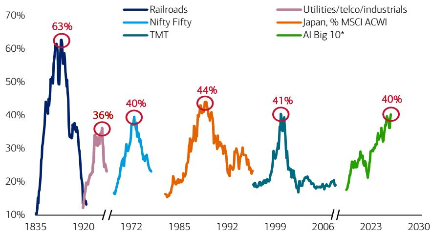

line

| Year | Railroads | Nifty Fifty | TMT | Utilities/telco/industrials | Japan, % MSCI ACWI | AI Big 10* |
|------|-----------|-------------|-----|-----------------------------|--------------------|------------|
| 1835 | ~10%      | ~10%        | ~10%| ~10%                        | ~10%               | ~10%       |
| 1920 | ~63%      | ~36%        | ~36%| ~36%                        | ~36%               | ~36%       |
| 1972 | ~40%      | ~40%        | ~40%| ~40%                        | ~40%               | ~40%       |
| 1985 | ~44%      | ~44%        | ~44%| ~44%                        | ~44%               | ~44%       |
| 1999 | ~41%      | ~41%        | ~41%| ~41%                        | ~41%               | ~41%       |
| 2023 | ~40%      | ~40%        | ~40%| ~40%                        | ~40%               | ~40%       |

Source: BofA Global Investment Strategy, GFD Finaeon, Bloomberg. Note: Japan is measured as % of MSCI ACWI, all others as % of US stock market. \*\*AI Big 10\* = Magnificent 7 + Broadcom, AMD, Micron.   
BofA GLOBAL RESEARCH

More on page 2...

# 22 May 2026

Investment Strategy Global

BofA

# Data Analytics

Michael Hartnett

Investment Strategist

BofAS

+1 646 855 1508

michael.hartnett@bofa.com

Anya Shelekhin

Investment Strategist

BofAS

+1 646 855 3753

anya.shelekhin@bofa.com

Myung-Jee Jung

Investment Strategist

BofAS

+1 646 855 0389

myung-jee.jung@bofa.com

Jessica Guo

Investment Strategist

BofAS

+1 646 855 0033

jessica.guo@bofa.com

Chart 1: BofA Bull & Bear Indicator   
Up to 8.0 from 7.8   
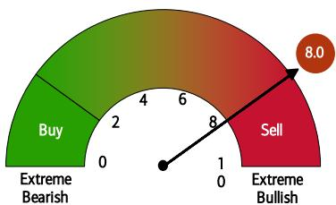

gauge

| Category | Value |
|---|---|
| Sell | 8.0 |
| Buy | 2 |
| Extreme Bearish | 0 |

Source: BofA Global Investment Strategy. The indicator identified above as the BofA Bull & Bear Indicator is intended to be an indicative metric only and may not be used for reference purposes or as a measure of performance for any financial instrument or contract, or otherwise relied upon by third parties for any other purpose, without the prior written consent of BofA Global Research. This indicator was not created to act as a benchmark.

BofA GLOBAL RESEARCH

Trading ideas and investment strategies discussed herein may give rise to significant risk and are not suitable for all investors. Investors should have experience in relevant markets and the financial resources to absorb any losses arising from applying these ideas or strategies.

BofA does and seeks to do business with issuers covered in its research reports. As a result, investors should be aware that the firm may have a conflict of interest that could affect the objectivity of this report. Investors should consider this report as only a single factor in making their investment decision.

Refer to important disclosures on page 12 to 14.

12977064

Weekly Flows: \$30.5bn to bonds, \$2.4bn to stocks, \$1.2bn to cash, \$1.1bn from gold, \$1.5bn from crypto.

# Flows to Know:

• Crypto: \$1.5bn outflow, biggest since Feb'26,   
• Treasuries: \$10.8bn inflow, biggest in 9 weeks,   
• US equities: \$9.5bn inflow, 8 weeks of inflows, longest streak since Dec'25,   
• Europe: \$2.3bn outflow, 6 weeks of outflows, longest streak since Feb'25 (Chart 10),   
- EM equities: \$7.9bn outflow, 6 weeks of outflows, longest streak since Nov'24 (Chart 11),   
• Tech: \$9.0bn inflow, biggest since Oct'25 (Chart 12),   
• Financials: \$2.4bn outflow, biggest in 10 weeks,   
• Materials: \$2.9bn outflow, biggest in 8 weeks.

BofA Private Clients: \$4.5tn AUM...65.7% stocks (record high), 17.3% bonds (lowest since Mar'22), 9.9% cash (record low); largest weekly inflow to cash since Dec'25 (\$4.1bn); GWIM increasing equity exposure (ETF share count up 4.4% YTD); note BofA private client cumulative inflow to T-bills down since peak 3-month yield in Dec'23 (Chart 5), and higher 10-year yield needed to spur greater flows to bonds (Chart 6); past 4 weeks private clients buying muni bonds, materials, HY vs selling low vol, utilities, REITs.

BofA Bull & Bear Indicator $^{1}$ : up to 8.0, triggering contrarian sell signal for risk assets, on tech/EM debt inflows + record monthly jump in FMS equity allocation + drop in FMS cash levels to 3.9%; there have been 17 “sell signals” since ’02, average loss for global stocks over 2-3 months is 2-3% (hit ratio of \~60%), with max drawdowns of 15-20%; see BofA Bull & Bear Indicator Revamp for full backtest results.

A Short History of IPOs: Table 1 shows price action in broad indices after top 10 IPO launches of all time; Alibaba and ICBC IPOs were “rocket fuel” for Chinese equities in following 3-12 months; NTT & ENEL were timed before big bear markets but big bear began a year later; in contrast, Visa & AIA were “toppy” IPOs, with SPX & Hang Seng much lower 9-12 months after launch; Aramco, Softbank, Facebook, GM launches were inconsequential for broader stock market.

Wealth-Price spiral not Wage-Price spiral: wealth-stocks-boom loop ongoing; but 28% inflation approval for Trump, 35% economic approval for Trump, equal-weight consumer stocks below their GFC lows relative to S&P 500 (Chart 7), AI cutting the price of labor (but not the quantity of labor – see payrolls), little wonder investors pricing in stock-bullish end of Iran conflict as US admin starts to address affordability angst/energy price inflation via big cuts in US SPR, Strategic Petroleum Reserve (down 10% or 41mn bbls since March – Chart 8); we think EM & commodities remain structural bulls, but consumer stocks will be best post-bubble contrarian play (best AI play will be small cap tech adopters & transformers that kill monopolies, duopolies, oligopolies...just like late '70s after Nifty Fifty pop).

London client feedback: “we’re long and paranoid,” “Trump wants/needs to de-escalate Iran, and stocks pop, yields drop on deal,” “if UK gilts find love, everything finds love,” “European electorate shifting decisively right, Farage in UK, Le Pen in France, and you watch the AfD in Germany will win Saxony-Anhalt in September, their first state election," "the fear in bonds is nowhere near as strong as greed in equities," "Warsh will be rhetorically hawkish but practically dovish over the summer," "US actions in Venezuela, Ukraine, Iran, Greenland, Cuba should be viewed through single strategic lens competition with China in AI, which can only be won by securing access to critical resources."

Chart 3: Indian rupee at record low vs US dollar   
Indian rupee spot (1 USD in INR)   
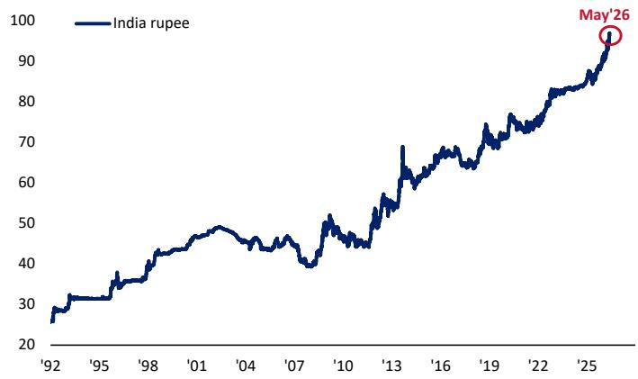

line

| Year | India rupee |
| ---- | ----------- |
| May 26 | 95 |

Source: BofA Global Investment Strategy, Bloomberg   
BofA GLOBAL RESEARCH

Chart 4: Indonesian rupiah weakening past 1998 and 2020 lows   
Indonesian rupiah spot (1 USD in IDR)   
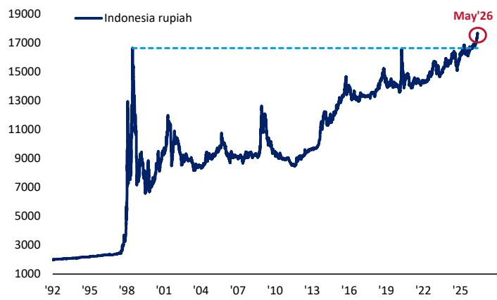

line

| Year | Indonesia rupiah |
| ---- | ---------------- |
| May'26 | 17000 |

Source: BofA Global Investment Strategy, Bloomberg   
BofA GLOBAL RESEARCH

Chart 5: Private client T-bill inflows down since Dec'23 peak in yields   
US 3-month T-bill yield & BofA private client flows to T-bills (\$bn)   
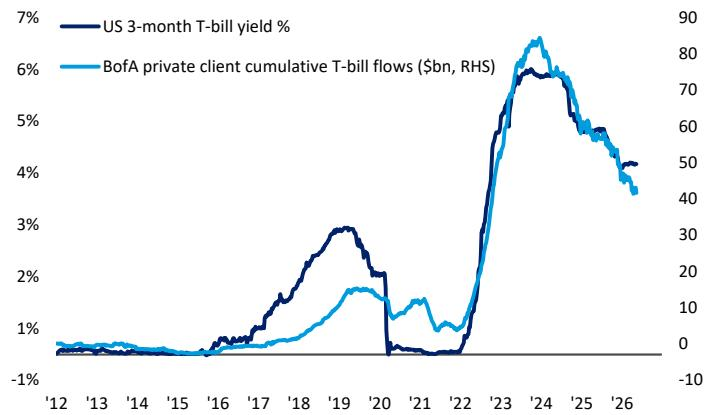

line

| Year | US 3-month T-bill yield % | BofA private client cumulative T-bill flows ($bn, RHS) |
|------|---------------------------|--------------------------------------------------------|
| '12  | ~0.5%                     | ~0                                                     |
| '13  | ~0.5%                     | ~0                                                     |
| '14  | ~0.5%                     | ~0                                                     |
| '15  | ~0.5%                     | ~0                                                     |
| '16  | ~0.5%                     | ~0                                                     |
| '17  | ~1.5%                     | ~5                                                     |
| '18  | ~2.5%                     | ~10                                                    |
| '19  | ~3.0%                     | ~15                                                    |
| '20  | ~0.5%                     | ~10                                                    |
| '21  | ~0.5%                     | ~15                                                    |
| '22  | ~0.5%                     | ~20                                                    |
| '23  | ~6.0%                     | ~70                                                    |
| '24  | ~6.5%                     | ~85                                                    |
| '25  | ~5.5%                     | ~70                                                    |
| '26  | ~4.5%                     | ~40                                                    |

Source: BofA Global Investment Strategy, Bloomberg   
BofA GLOBAL RESEARCH

Chart 6: Higher UST 10Y yield needed to spur greater flows to bonds   
UST 10Y yield & BofA private client flows to T-notes & T-bonds (\$bn)   
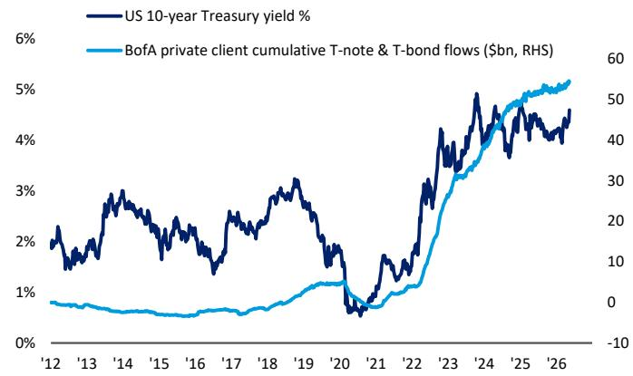

line

| Year | US 10-year Treasury yield % | BofA private client cumulative T-note & T-bond flows ($bn, RHS) |
|------|-----------------------------|---------------------------------------------------------------|
| '12  | ~2%                         | ~0                                                            |
| '13  | ~1.5%                       | ~0                                                            |
| '14  | ~2.8%                       | ~0                                                            |
| '15  | ~2.5%                       | ~0                                                            |
| '16  | ~1.5%                       | ~0                                                            |
| '17  | ~2.5%                       | ~0                                                            |
| '18  | ~3.0%                       | ~0                                                            |
| '19  | ~2.0%                       | ~0                                                            |
| '20  | ~0.5%                       | ~0                                                            |
| '21  | ~1.5%                       | ~0                                                            |
| '22  | ~3.0%                       | ~10                                                           |
| '23  | ~4.5%                       | ~30                                                           |
| '24  | ~5.0%                       | ~45                                                           |
| '25  | ~4.5%                       | ~50                                                           |
| '26  | ~4.5%                       | ~55                                                           |

Source: BofA Global Investment Strategy, Bloomberg   
BofA GLOBAL RESEARCH

Chart 7: Equal-weight consumer stocks vs S&P 500 below GFC lows   
US consumer discretionary (equal-weight) vs S&P 500   
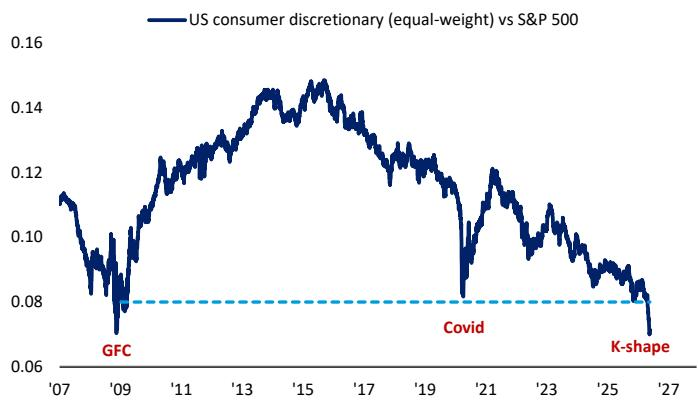

line

| Year | US consumer discretionary (equal-weight) vs S&P 500 |
| ---- | -------------------------------------------------- |
| '07  | 0.11                                               |
| '09  | 0.08                                               |
| '11  | 0.13                                               |
| '13  | 0.14                                               |
| '15  | 0.15                                               |
| '17  | 0.14                                               |
| '19  | 0.12                                               |
| '21  | 0.11                                               |
| '23  | 0.09                                               |
| '25  | 0.08                                               |
| '27  | 0.07                                               |

Source: BofA Global Investment Strategy, Bloomberg   
BofA GLOBAL RESEARCH

Table 1: Alibaba and ICBC were the “rocket fuel” IPOs   
Largest 10 IPOs of all time + market reaction 

<table><tr><td>Company</td><td>IPO Date</td><td>IPO Size</td><td>3M %Chg*</td><td>6M %Chg*</td><td>9M %Chg*</td><td>12M %Chg*</td></tr><tr><td>Aramco</td><td>Dec&#x27;19</td><td>$26bn</td><td>-5%</td><td>-8%</td><td>+0%</td><td>+10%</td></tr><tr><td>Alibaba</td><td>Sep&#x27;14</td><td>$22bn</td><td>+32%</td><td>+51%</td><td>+119%</td><td>+38%</td></tr><tr><td>SoftBank</td><td>Dec&#x27;18</td><td>$21bn</td><td>-1%</td><td>-2%</td><td>-0%</td><td>+10%</td></tr><tr><td>NTT</td><td>Oct&#x27;98</td><td>$18bn</td><td>-2%</td><td>+17%</td><td>+30%</td><td>+23%</td></tr><tr><td>Visa</td><td>Mar&#x27;08</td><td>$18bn</td><td>+2%</td><td>-6%</td><td>-34%</td><td>-43%</td></tr><tr><td>AIA Group</td><td>Oct&#x27;10</td><td>$18bn</td><td>+3%</td><td>-1%</td><td>-8%</td><td>-22%</td></tr><tr><td>Enel</td><td>Nov&#x27;99</td><td>$17bn</td><td>+22%</td><td>+36%</td><td>+29%</td><td>+26%</td></tr><tr><td>Facebook</td><td>May&#x27;12</td><td>$16bn</td><td>+8%</td><td>+5%</td><td>+16%</td><td>+25%</td></tr><tr><td>GM</td><td>Nov&#x27;10</td><td>$16bn</td><td>+13%</td><td>+13%</td><td>+0%</td><td>+7%</td></tr><tr><td>ICBC</td><td>Oct&#x27;06</td><td>$14bn</td><td>+54%</td><td>+102%</td><td>+118%</td><td>+237%</td></tr></table>

Source: BofA Global Investment Strategy, Bloomberg   
\*Tadawul (Saudi Aramco), Shanghai Composite (Alibaba, ICBC), Hang Seng (AIA Group), Nikkei (SoftBank, NTT), S&P 500 (Visa, Facebook, GM), Euro Stoxx 50 (Enel)   
BofA GLOBAL RESEARCH

Table 2: Once CPI crosses 4%, on avg SPX -4% next 3m, -7% next 6m   
SPX price action after CPI month with 4%+ reading 

<table><tr><td>First 4%+ CPI</td><td>SPX 3M %Chg</td><td>SPX 6M %Chg</td></tr><tr><td>Feb&#x27;34</td><td>-9%</td><td>-13%</td></tr><tr><td>Apr&#x27;37</td><td>2%</td><td>-28%</td></tr><tr><td>Jun&#x27;41</td><td>2%</td><td>-15%</td></tr><tr><td>Jul&#x27;46</td><td>-21%</td><td>-15%</td></tr><tr><td>Dec&#x27;50</td><td>5%</td><td>3%</td></tr><tr><td>Feb&#x27;68</td><td>10%</td><td>11%</td></tr><tr><td>Mar&#x27;73</td><td>-7%</td><td>-2%</td></tr><tr><td>Jan&#x27;84</td><td>-2%</td><td>-7%</td></tr><tr><td>Aug&#x27;87</td><td>-27%</td><td>-20%</td></tr><tr><td>Sep&#x27;05</td><td>2%</td><td>6%</td></tr><tr><td>Apr&#x27;21</td><td>6%</td><td>9%</td></tr><tr><td>Average</td><td>-3.5%</td><td>-6.6%</td></tr></table>

Source: BofA Global Investment Strategy, Bloomberg   
BofA GLOBAL RESEARCH

Chart 8: US Strategic Petroleum Reserve down 10% since March   
US Strategic Petroleum Reserve (mn bbls)   
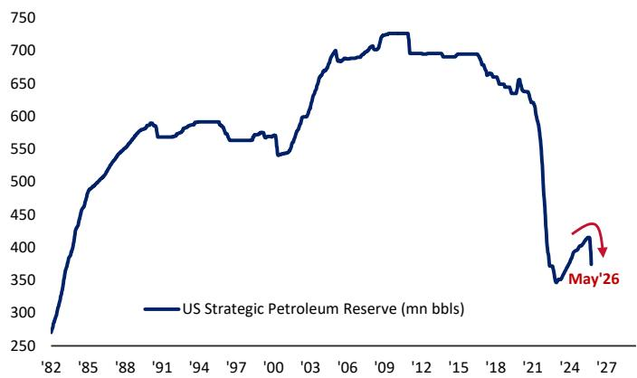

line

| Year | US Strategic Petroleum Reserve (mn bbls) |
| ---- | ---------------------------------------- |
| 2024 | 350                                      |
| 2025 | 400                                      |
| 2026 | 420                                      |

Source: BofA Global Investment Strategy, Bloomberg   
BofA GLOBAL RESEARCH

Chart 9: Korea export price of semis up 148%, DRAMs up 223% y/y   
Korea semiconductor and DRAM export prices (y/y % change)   
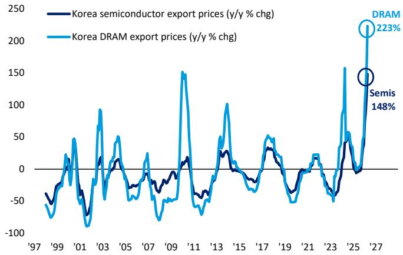

line

| Year | Korea semiconductor export prices (y/y % chg) | Korea DRAM export prices (y/y % chg) |
|------|---------------------------------------------|--------------------------------------|
| '27  | -                                           | 223%                                 |
| Semis| -                                           | 148%                                 |

Source: BofA Global Investment Strategy, EPFR   
BofA GLOBAL RESEARCH

Chart 10: Europe equities see outflows for 6 weeks straight   
Flows to Europe equity funds, weekly vs 4wk-ma (\$bn)   
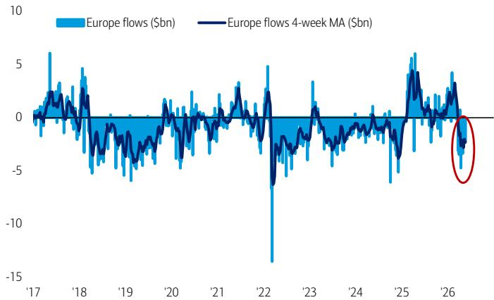

line

| Year | Europe flows ($bn) | Europe flows 4-week MA ($bn) |
|------|---------------------|------------------------------|
| '17  | ~0                  | ~0                           |
| '18  | ~5                  | ~0                           |
| '19  | ~-5                 | ~-5                          |
| '20  | ~0                  | ~0                           |
| '21  | ~5                  | ~0                           |
| '22  | ~-15                | ~-5                          |
| '23  | ~0                  | ~0                           |
| '24  | ~-5                 | ~-5                          |
| '25  | ~5                  | ~0                           |
| '26  | ~-5                 | ~-5                          |

Source: BofA Global Investment Strategy, EPFR   
BofA GLOBAL RESEARCH

Chart 11: EM equities see 6 weeks of outflows, longest since Nov'24   
Flows to EM equity funds, weekly vs 4wk-ma (\$bn)   
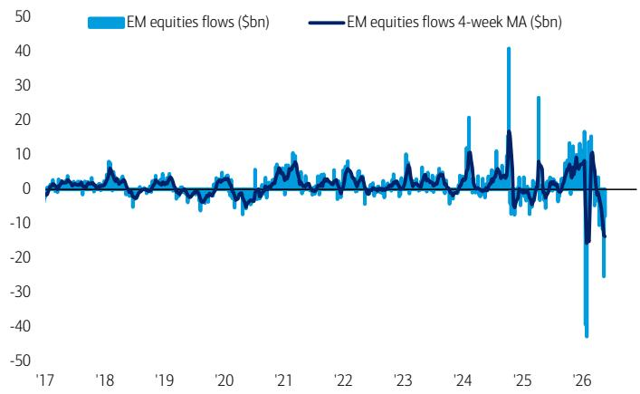

line

| Year | EM equities flows ($bn) | EM equities flows 4-week MA ($bn) |
|------|--------------------------|------------------------------------|
| '17  | ~0                       | ~0                                 |
| '18  | ~5                       | ~5                                 |
| '19  | ~0                       | ~0                                 |
| '20  | ~5                       | ~5                                 |
| '21  | ~10                      | ~10                                |
| '22  | ~5                       | ~5                                 |
| '23  | ~10                      | ~10                                |
| '24  | ~20                      | ~20                                |
| '25  | ~40                      | ~40                                |
| '26  | ~-40                     | ~-40                               |

Source: BofA Global Investment Strategy, EPFR   
BofA GLOBAL RESEARCH

Chart 12: Biggest weekly inflow to tech since Oct'25   
Flows to tech funds, weekly vs 4wk-ma (\$bn)   
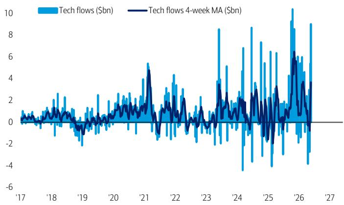

line

| Year | Tech flows ($bn) | Tech flows 4-week MA ($bn) |
|------|-------------------|----------------------------|
| '17  | ~0                | ~0                         |
| '18  | ~1                | ~0.5                       |
| '19  | ~-1               | ~0                         |
| '20  | ~1                | ~0.5                       |
| '21  | ~5                | ~4                         |
| '22  | ~3                | ~2                         |
| '23  | ~4                | ~3                         |
| '24  | ~5                | ~2                         |
| '25  | ~6                | ~3                         |
| '26  | ~10               | ~6                         |
| '27  | ~9                | ~4                         |

Source: BofA Global Investment Strategy, EPFR   
BofA GLOBAL RESEARCH

# Asset Class Flows (Table 3)

Equities: \$2.4bn inflow (\$20.6bn to ETFs, \$18.1bn from mutual funds)

Bonds: inflows past 56 weeks (\$30.5bn)

Precious metals: outflows resume (\$1.1bn)

# Fixed Income Flows (Chart 13)

IG Bond inflows past 7 weeks (\$13.3bn)

HY Bond inflows past 2 weeks (\$0.3bn)

EM Debt inflows past 6 weeks (\$2.2bn)

Munis inflows past 5 weeks (\$2.6bn)

Govt/Tsy inflows past 4 weeks (\$10.8bn)

TIPS inflows past 16 weeks (\$1.0bn)

Bank loan inflows past 8 weeks (\$0.8bn)

# Equity Flows (Table 4)

US: inflows past 8 weeks (\$9.5bn)

Japan: outflows resume (\$4.4bn)

Europe: outflows past 6 weeks (\$2.3bn)

EM: outflows past 6 weeks (\$7.9bn)

By style: inflows US large cap (\$7.3bn), US value (\$1.4bn), outflows US small cap (\$2.6bn), US growth (\$4.8bn).

By sector: inflows tech (\$9.0bn), consumer (\$0.6bn), com svs (\$0.4bn), energy (\$0.3bn), real estate (\$0.1bn), outflows utilities (\$0.1bn), hcare (\$0.2bn), materials (\$1.8bn), financials (\$2.4bn).

Chart 13: FICC inflows to Treasuries, TIPS, bank loan   
Weekly FICC flows as a \% AUM   
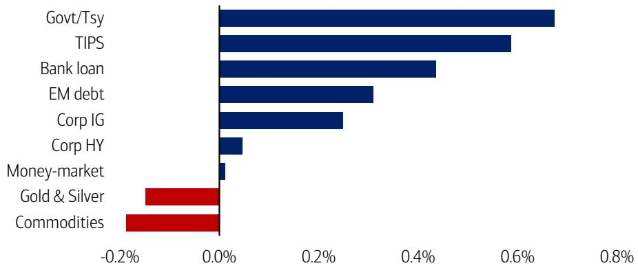

bar

| Category | Value (%) |
|---|---|
| Govt/Tsy | 0.67 |
| TIPS | 0.60 |
| Bank loan | 0.43 |
| EM debt | 0.31 |
| Corp IG | 0.24 |
| Corp HY | 0.05 |
| Money-market | 0.02 |
| Gold & Silver | -0.15 |
| Commodities | -0.22 |

Source: BofA Global Investment Strategy, EPFR Global

Table 3: Cumulative YTD flows by asset class   
Global flows by asset class, \$mn 

<table><tr><td></td><td>Wk % AUM</td><td>YTD</td><td>YTD %AUM</td></tr><tr><td>Equities</td><td>0.0%</td><td>360,999</td><td>1.3%</td></tr><tr><td>ETFs</td><td>0.1%</td><td>554,508</td><td>3.4%</td></tr><tr><td>LO</td><td>-0.1%</td><td>-193,883</td><td>-1.6%</td></tr><tr><td>Bonds</td><td>0.3%</td><td>331,245</td><td>3.5%</td></tr><tr><td>Commodities</td><td>-0.2%</td><td>27,780</td><td>2.7%</td></tr><tr><td>Money-market</td><td>0.0%</td><td>245,758</td><td>2.2%</td></tr></table>

\*week ended 05/20/2026: Source: EPFR Global   
BofA GLOBAL RESEARCH

Table 4: Big YTD inflows to DM stocks   
Global equity flows by region, \$mn 

<table><tr><td></td><td>Wk % AUM</td><td>YTD</td></tr><tr><td>Total Equities</td><td>0.0%</td><td>360,999</td></tr><tr><td>long-only funds</td><td>-0.1%</td><td>-193,883</td></tr><tr><td>ETFs</td><td>0.1%</td><td>554,508</td></tr><tr><td>Total EM</td><td>-0.3%</td><td>-87,404</td></tr><tr><td>Brazil</td><td>0.2%</td><td>4,973</td></tr><tr><td>India</td><td>-0.2%</td><td>-6,608</td></tr><tr><td>China</td><td>-1.5%</td><td>-194,891</td></tr><tr><td>Total DM</td><td>0.0%</td><td>448,403</td></tr><tr><td>US</td><td>0.1%</td><td>175,504</td></tr><tr><td>Europe</td><td>-0.1%</td><td>-2,319</td></tr><tr><td>Japan</td><td>-0.4%</td><td>20,028</td></tr><tr><td>International</td><td>0.1%</td><td>239,133</td></tr></table>

Total Equities = Total EM + Total DM   
Source: EPFR Global   
BofA GLOBAL RESEARCH

BofA GLOBAL RESEARCH

# BofA private client flows & allocations

Chart 14: Private clients bought muni, materials, HY ETFs   
BofA private clients 4-week ETF flows as % of AUM   
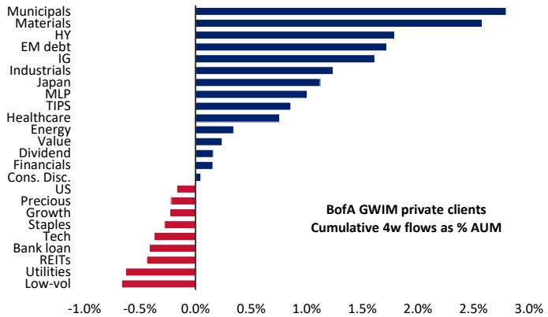

bar

BofA GWIM private clients
Cumulative 4w flows as % AUM
| Sector | Cumulative 4w flows as % AUM (%) |
| :--- | :--- |
| Municipals | 2.8 |
| Materials | 2.6 |
| HY | 1.8 |
| EM debt | 1.7 |
| IG | 1.6 |
| Industrials | 1.3 |
| Japan | 1.1 |
| MLP | 1.0 |
| TIPS | 0.9 |
| Healthcare | 0.8 |
| Energy | 0.4 |
| Value | 0.3 |
| Dividend | 0.2 |
| Financials | 0.1 |
| Cons. Disc. US | -0.1 |
| Precious Growth | -0.2 |
| Staples Tech | -0.3 |
| Bank loan REITs | -0.4 |
| Utilities Low-vol | -0.5 |

Source: BofA Global investment Strategy   
BofA GLOBAL RESEARCH

Chart 15: GWIM equity allocation at 66%   
BofA private client equity holdings as % of AUM   
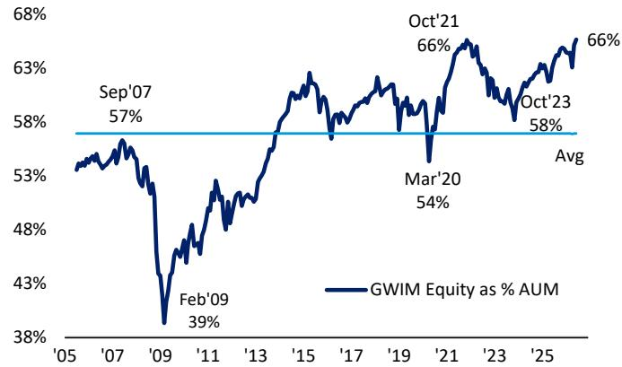

line

| Year | GWIM Equity as % AUM |
| ---- | --------------------- |
| '05  | 57%                   |
| '07  | 57%                   |
| '09  | 39%                   |
| '11  | 54%                   |
| '13  | 58%                   |
| '15  | 66%                   |
| '17  | 58%                   |
| '19  | 58%                   |
| '21  | 66%                   |
| '23  | 58%                   |
| '25  | 66%                   |

Source: BofA Global investment Strategy   
BofA GLOBAL RESEARCH

Chart 16: GWIM debt allocation at 17%   
BofA private client debt holdings as % of AUM   
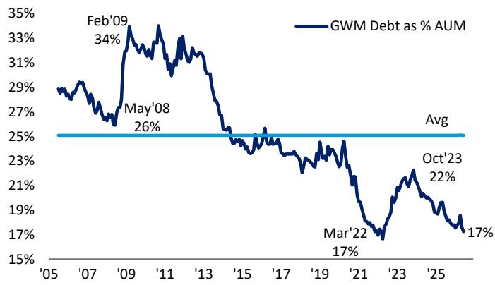

line

| Year | GWM Debt as % AUM |
| ---- | ----------------- |
| Feb'09 | 34% |
| May'08 | 26% |
| Mar'22 | 17% |
| Oct'23 | 22% |
| Avg | 25% |

Source: BofA Global investment Strategy   
BofA GLOBAL RESEARCH

Chart 17: GWIM cash allocation at 10%   
BofA private client cash holdings as % of AUM   
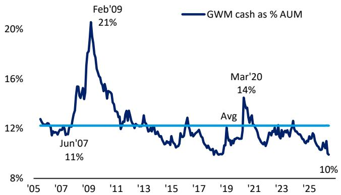

line

| Year | GWM cash as % AUM |
| ---- | ----------------- |
| Jun'07 | 11% |
| Feb'09 | 21% |
| Mar'20 | 14% |
| Avg | 12% |

Source: BofA Global investment Strategy   
BofA GLOBAL RESEARCH

Chart 18: GWIM equity ETFs 21%, debt ETFs 18% of AUM   
BofA private client ETF holdings as % of AUM   
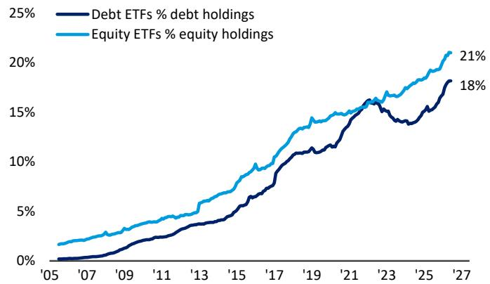

line

| Year | Debt ETFs % debt holdings | Equity ETFs % equity holdings |
|------|-----------------------------|--------------------------------|
| '27  | 18%                         | 21%                            |

Source: BofA Global investment Strategy   
BofA GLOBAL RESEARCH

Chart 19: \$46bn to T-notes vs \$28bn to T-bills since 2020   
BofA private client cumulative inflow to Treasuries since 2020 (\$bn)   
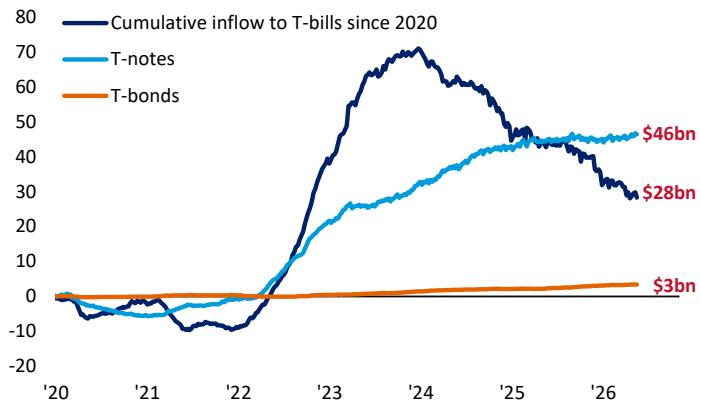

line

| Year | Cumulative inflow to T-bills since 2020 | T-notes | T-bonds |
|------|------------------------------------------|---------|----------|
| '20  | ~0                                       | ~0      | ~0       |
| '21  | ~-5                                      | ~-5     | ~0       |
| '22  | ~-10                                     | ~-5     | ~0       |
| '23  | ~40                                      | ~15     | ~0       |
| '24  | ~70                                      | ~30     | ~0       |
| '25  | ~45                                      | ~45     | ~0       |
| '26  | ~30                                      | $46bn   | $3bn     |

Source: BofA Global investment Strategy   
BofA GLOBAL RESEARCH

# The Asset Class Quilt of Total Returns

Chart 20: Historical asset class performance by year

Ranked cross asset returns by year

<table><tr><td>2000</td><td>2001</td><td>2002</td><td>2003</td><td>2004</td><td>2005</td><td>2006</td><td>2007</td><td>2008</td><td>2009</td><td>2010</td><td>2011</td><td>2012</td><td>2013</td><td>2014</td><td>2015</td><td>2016</td><td>2017</td><td>2018</td><td>2019</td><td>2020</td><td>2021</td><td>2022</td><td>2023</td><td>2024</td><td>2025</td><td>2026*</td></tr><tr><td>Commodities 58.2%</td><td>US Treasuries 6.7%</td><td>Commodities 39.5%</td><td>MSCI EM 56.3%</td><td>REITS 32.0%</td><td>MSCI EM 34.5%</td><td>REITS 37.5%</td><td>MSCI EM 39.8%</td><td>US Treasuries 14.0%</td><td>MSCI EM 79.0%</td><td>Gold 29.2%</td><td>US Treasuries 9.8%</td><td>REITS 23.8%</td><td>S&amp;P 500 32.4%</td><td>S&amp;P 500 13.7%</td><td>S&amp;P 500 1.4%</td><td>Commodities 17.5%</td><td>MSCI EM 37.8%</td><td>Cash 1.8%</td><td>S&amp;P 500 31.5%</td><td>Gold 24.8%</td><td>Commodities 46.3%</td><td>Commodities 31.1%</td><td>S&amp;P 500 26.3%</td><td>Gold 26.7%</td><td>Gold 60.7%</td><td>Commodities 60.9%</td></tr><tr><td>US Treasuries 13.4%</td><td>Global IG 4.6%</td><td>Gold 25.6%</td><td>MSCI EAFE 39.2%</td><td>Commodities 28.7%</td><td>Commodities 33.7%</td><td>MSCI EM 32.6%</td><td>Commodities 33.0%</td><td>Gold 4.3%</td><td>Global HY 62.0%</td><td>MSCI EM 19.2%</td><td>Gold 8.9%</td><td>Global HY 19.3%</td><td>MSCI EAFE 23.3%</td><td>REITS 11.7%</td><td>US Treasuries 0.8%</td><td>Global HY 14.8%</td><td>MSCI EAFE 25.9%</td><td>US Treasuries 0.8%</td><td>REITS 27.4%</td><td>MSCI EM 18.8%</td><td>REITS 37.1%</td><td>Cash 1.5%</td><td>MSCI EAFE 18.9%</td><td>S&amp;P 500 25.0%</td><td>MSCI EM 32.0%</td><td>MSCI EM 17.4%</td></tr><tr><td>REITS 8.5%</td><td>Cash 4.4%</td><td>Global IG 14.9%</td><td>REITS 33.5%</td><td>MSCI EM 26.0%</td><td>Gold 17.8%</td><td>MSCI EAFE 26.9%</td><td>Gold 31.9%</td><td>Cash 2.1%</td><td>MSCI EAFE 32.5%</td><td>REITS 15.9%</td><td>Global IG 4.5%</td><td>MSCI EM 18.6%</td><td>Global HY 8.0%</td><td>US Treasuries 6.0%</td><td>Cash 0.1%</td><td>S&amp;P 500 12.0%</td><td>S&amp;P 500 22.0%</td><td>Gold -1.9%</td><td>MSCI EAFE 22.8%</td><td>S&amp;P 500 18.4%</td><td>S&amp;P 500 28.7%</td><td>Gold -0.8%</td><td>Global HY 13.4%</td><td>MSCI EM 8.0%</td><td>MSCI EAFE 29.0%</td><td>REITS 12.7%</td></tr><tr><td>Cash 6.2%</td><td>Global HY 3.1%</td><td>US Treasuries 11.6%</td><td>Commodities 30.1%</td><td>MSCI EAFE 20.7%</td><td>MSCI EAFE 14.0%</td><td>Gold 23.2%</td><td>MSCI EAFE 11.6%</td><td>Global IG -8.3%</td><td>REITS 31.7%</td><td>S&amp;P 500 15.1%</td><td>Global HY 2.6%</td><td>MSCI EAFE 17.9%</td><td>REITS 0.7%</td><td>Global IG 3.2%</td><td>MSCI EAFE -0.8%</td><td>MSCI EM 11.2%</td><td>Gold 12.9%</td><td>Global HY -3.3%</td><td>Commodities 20.1%</td><td>Global IG 10.3%</td><td>MSCI EAFE 11.9%</td><td>US Treasuries -12.9%</td><td>Gold 12.7%</td><td>Global HY 7.5%</td><td>S&amp;P 500 18.5%</td><td>S&amp;P 500 9.1%</td></tr><tr><td>Global IG 3.1%</td><td>Gold -0.7%</td><td>Cash 1.8%</td><td>Global HY 30.7%</td><td>Global HY 12.4%</td><td>REITS 10.7%</td><td>S&amp;P 500 15.8%</td><td>US Treasuries 9.1%</td><td>Global HY -27.9%</td><td>S&amp;P 500 26.5%</td><td>Global HY 13.9%</td><td>S&amp;P 500 2.1%</td><td>S&amp;P 500 16.0%</td><td>Global IG 0.1%</td><td>Gold 0.1%</td><td>REITS -3.4%</td><td>Gold 8.6%</td><td>REITS 11.5%</td><td>Global IG -3.4%</td><td>MSCI EM 18.6%</td><td>MSCI EAFE 8.4%</td><td>Global HY 1.4%</td><td>Global HY -13.2%</td><td>REITS 11.3%</td><td>Commodities 5.5%</td><td>Global HY 9.9%</td><td>MSCI EAFE 7.3%</td></tr><tr><td>Gold -5.4%</td><td>MSCI EM -2.4%</td><td>Global HY -1.1%</td><td>S&amp;P 500 28.7%</td><td>S&amp;P 500 10.9%</td><td>S&amp;P 500 4.9%</td><td>Global HY 13.5%</td><td>Global IG 7.3%</td><td>S&amp;P 500 -37.0%</td><td>Commodities 26.1%</td><td>Cash 0.1%</td><td>Global IG 11.1%</td><td>Cash 0.1%</td><td>Cash 0.0%</td><td>Global IG -3.8%</td><td>Global IG 4.3%</td><td>Global HY 10.2%</td><td>REITS -3.9%</td><td>Gold 17.9%</td><td>US Treasuries 8.2%</td><td>Cash 0.0%</td><td>MSCI EAFE -13.9%</td><td>MSCI EM 10.1%</td><td>Cash 5.3%</td><td>Global IG 9.8%</td><td>Gold 5.3%</td><td></td></tr><tr><td>Global HY -5.8%</td><td>REITS -7.8%</td><td>REITS -2.4%</td><td>Gold 19.9%</td><td>Global IG 9.4%</td><td>Cash 3.1%</td><td>Global IG 7.2%</td><td>S&amp;P 500 5.5%</td><td>Commodities -42.6%</td><td>Gold 25.0%</td><td>MSCI EAFE 8.2%</td><td>Commodities -2.6%</td><td>Gold 8.3%</td><td>Commodities -2.1%</td><td>Global HY -0.1%</td><td>Global HY -4.2%</td><td>REITS 1.3%</td><td>Global IG 9.3%</td><td>S&amp;P 500 -4.3%</td><td>Global HY 13.7%</td><td>Global HY 8.0%</td><td>MSCI EM -2.3%</td><td>Global IG -16.7%</td><td>Global IG 9.5%</td><td>MSCI EAFE 4.4%</td><td>US Treasuries 6.1%</td><td>Cash 1.4%</td></tr><tr><td>S&amp;P 500 -9.1%</td><td>S&amp;P 500 -11.9%</td><td>MSCI EM -6.0%</td><td>Global IG 14.5%</td><td>Gold 4.6%</td><td>US Treasuries 2.8%</td><td>Cash 4.9%</td><td>Cash 5.0%</td><td>MSCI EAFE -43.1%</td><td>Global IG 19.2%</td><td>Global IG 6.0%</td><td>REITS -9.4%</td><td>US Treasuries 2.2%</td><td>MSCI EM -2.3%</td><td>MSCI EM -1.8%</td><td>Gold -10.4%</td><td>US Treasuries 1.1%</td><td>Commodities 7.6%</td><td>Commodities -13.1%</td><td>Global IG 11.4%</td><td>Cash 0.5%</td><td>US Treasuries -2.4%</td><td>S&amp;P 500 -18.1%</td><td>Cash 5.1%</td><td>REITS 3.2%</td><td>Commodities 5.9%</td><td>Global HY 0.9%</td></tr><tr><td>MSCI EAFE -14.0%</td><td>MSCI EAFE -21.2%</td><td>MSCI EAFE -15.7%</td><td>US Treasuries 2.3%</td><td>US Treasuries 3.5%</td><td>Global HY 1.5%</td><td>US Treasuries 3.1%</td><td>Global HY 3.0%</td><td>REITS -50.2%</td><td>Cash 0.2%</td><td>US Treasuries 5.9%</td><td>MSCI EAFE -11.7%</td><td>Cash 0.1%</td><td>US Treasuries -3.3%</td><td>MSCI EAFE -4.5%</td><td>MSCI EM -14.9%</td><td>MSCI EAFE 1.0%</td><td>US Treasuries 2.4%</td><td>MSCI EAFE -13.2%</td><td>US Treasuries 7.0%</td><td>REITS -4.4%</td><td>Global IG -3.0%</td><td>MSCI EM -19.8%</td><td>US Treasuries 3.9%</td><td>Global IG 1.2%</td><td>Cash 4.0%</td><td>Global IG -0.4%</td></tr><tr><td>MSCI EM -30.6%</td><td>Commodities -21.4%</td><td>S&amp;P 500 -22.1%</td><td>Cash 1.1%</td><td>Cash 1.3%</td><td>Global IG -3.0%</td><td>Commodities -0.2%</td><td>REITS -10.0%</td><td>MSCI EM -53.2%</td><td>US Treasuries -3.7%</td><td>Cash 0.1%</td><td>MSCI EM -18.2%</td><td>Commodities -0.3%</td><td>Gold -27.3%</td><td>Commodities -29.3%</td><td>Commodities -29.4%</td><td>Cash 0.3%</td><td>Cash 0.8%</td><td>MSCI EM -14.3%</td><td>Cash 2.2%</td><td>Commodities -15.0%</td><td>Gold -4.1%</td><td>REITS -25.2%</td><td>Commodities -3.5%</td><td>US Treasuries 0.5%</td><td>REITS 3.5%</td><td>US Treasuries -0.7%</td></tr></table>

Source: BofA Global Investment Strategy, Bloomberg. \*2026 YTD

BofA GLOBAL RESEARCH

# BofA Rules & Tools

Table 5: BofA Global Investment Strategy Proprietary Indicators

Current reading of all BofA Global Investment Strategy Proprietary Indicators

<table><tr><td>Proprietary Indicators</td><td>Category</td><td>Current reading</td><td>Current signal</td><td>Duration of signal</td></tr><tr><td colspan="5">Contrarian</td></tr><tr><td>BofA Bull &amp; Bear Indicator (B&amp;B)</td><td>Contrarian</td><td>8.0</td><td>Sell</td><td>1-3 months</td></tr><tr><td>Sell when investor sentiment &gt; 8.0; Buy when investor sentiment &lt; 2.0</td><td></td><td></td><td></td><td></td></tr><tr><td>BofA Global FMS Cash Indicator</td><td>Contrarian</td><td>3.9%</td><td>Sell</td><td>4 weeks</td></tr><tr><td>Buy when cash at or above 5.0%; Sell when cash at or below 4.0%</td><td></td><td></td><td></td><td></td></tr><tr><td>BofA Global Breadth Rule</td><td>Contrarian</td><td>50.0%</td><td>Neutral</td><td>3 months</td></tr><tr><td>Buy when net 88% of markets in MSCI ACWI trading below 200-day moving &amp; 50-day moving averages</td><td></td><td></td><td></td><td></td></tr><tr><td>BofA Global Flow Trading Rule</td><td>Contrarian</td><td>0.4%</td><td>Neutral</td><td>8 weeks</td></tr><tr><td>Buy when outflows from global equities &amp; HY &gt; 1.0% AUM over 4wks; Sell when inflows &gt; 1.0% AUM over 4wks</td><td></td><td></td><td></td><td></td></tr><tr><td>BofA EM Flow Trading Rule</td><td>Contrarian</td><td>-1.8%</td><td>Neutral</td><td>8 weeks</td></tr><tr><td>Buy when outflows from EM equities &gt; 3.0% of AUM; Sell when inflows &gt; 1.5% of AUM over 4 wks</td><td></td><td></td><td></td><td></td></tr><tr><td colspan="5">Macro</td></tr><tr><td>BofA Global EPS Growth Model</td><td>Macro</td><td>9%</td><td>EPS growth rising</td><td>6-12 months</td></tr></table>

Model indicates trend in year-on-year change in 12-month forward global EPS growth.   
Source: BofA Global Investment Strategy. See Global Investment Strategy: Rules & Tools, 12 November 2020 and BofA Bull & Bear Indicator revamp reports

BofA GLOBAL RESEARCH

# BofA Bull & Bear Indicator (B&B)

Our BofA Bull & Bear Indicator is at 8.0... signal is Sell.

Chart 21: BofA Bull & Bear at 8.0   
Up to 8.0 from 7.8   
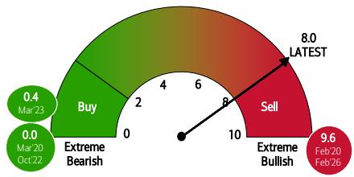

gauge

| Category | Value |
|---|---|
| Buy | 0.4 |
| Extreme Bearish | 0.0 |
| Extreme Bullish | 9.6 |
| Sell | 8.0 |
| Latest | 8.0 |
| Date Range | 0.4 (Mar 23) to 0.0 (Oct 22) |

Source: BofA Global Investment Strategy   
BofA GLOBAL RESEARCH

Table 6: BofA B&B Indicator   
BofA Bull & Bear current component readings 

<table><tr><td>Components</td><td>Percentile</td><td>Sentiment</td></tr><tr><td>Hedge Fund Positioning</td><td>75%</td><td>Bullish</td></tr><tr><td>Equity Flow</td><td>53%</td><td>Neutral</td></tr><tr><td>Bond Flow</td><td>74%</td><td>Bullish</td></tr><tr><td>Credit Market Technicals</td><td>74%</td><td>Bullish</td></tr><tr><td>Global Stock Index Breadth</td><td>74%</td><td>Bullish</td></tr><tr><td>FMS Positioning</td><td>95%</td><td>V Bullish</td></tr></table>

Source: BofA Global Investment Strategy, Bloomberg, EPFR Global, Lipper FMI, Global FMS, CFTC, MSCI   
BofA GLOBAL RESEARCH

Chart 22: BofA Bull & Bear Indicator at 8.0   
BofA Bull & Bear Indicator since 2002   
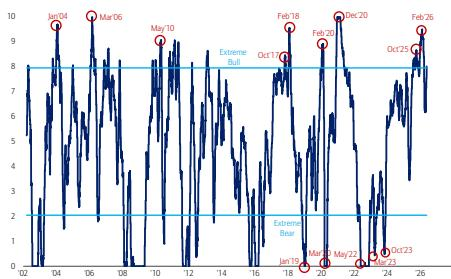

line

| Date   | Value |
|--------|-------|
| Jan'04 | 9     |
| Mar'06 | 8     |
| Mar'10 | 9     |
| Feb'18 | 7     |
| Feb'20 | 9     |
| Dec'20 | 8     |
| Oct'25 | 7     |
| Apr'23 | 6     |

Source: BofA Global Investment Strategy, EPFR Global, FMS, CFTC, MSCI.   
BofA GLOBAL RESEARCH

Disclaimer: The indicators identified above as the BofA Bull & Bear Indicator, MVP Model, BofA Global Breadth Rule, BofA EM Flow Trading Rule, BofA Global Flow Trading Rule, BofA Global FMS Macro Indicator, BofA Global FMS Cash Rule, Global Wave, Sell-Side Indicator, and Global Financial Stress Indicator are intended to be indicative metrics only and may not be used for reference purposes or as a measure of performance for any financial instrument or contract, or otherwise relied upon by third parties for any other purpose, without the prior written consent of BofA Global Research. These indicators were not created to act as a benchmark.
The analysis of the BofA Bull & Bear Indicator in this report is back-tested and does not represent the actual performance of any account or fund. Back-tested performance depicts the hypothetical back-tested performance of a particular strategy over the time period indicated. In future periods, market and economic conditions will differ and the same strategy will not necessarily produce the same results. No representation is being made that any actual portfolio is likely to have achieved returns similar to those shown herein. In fact, there are frequently sharp differences between back-tested returns and the actual results realized in the actual management of a portfolio. Back-tested performance results are created by applying an investment strategy or methodology to historical data and attempts to give an indication as to how a strategy might have performed during a certain period in the past if the product had been in existence during such time. Back-tested results have inherent limitations including the fact that they are calculated with the full benefit of hindsight, which allows the security selection methodology to be adjusted to maximize the returns. Further, the results shown do not reflect actual trading or the impact that material economic and market factors might have had on a portfolio manager's decision-making under actual circumstances. Back-tested returns do not reflect advisory fees, trading costs, or other fees or expenses.

# 2026 Cross-Asset Winners & Losers

Table 7: 2026 YTD ranked returns

Year-to-date cross asset returns in US dollar terms

Ranked Returns, USD-terms (YTD 2026) 

<table><tr><td colspan="2">Assets</td><td colspan="2">Equities</td><td colspan="2">Sectors</td><td colspan="2">Fixed Income</td><td colspan="2">FX vs. USD</td><td colspan="2">Commodities</td></tr><tr><td>1 Oil</td><td>71.1%</td><td>1 Korea Equities</td><td>82.3%</td><td>1 ACWI Energy</td><td>29.5%</td><td>1 3-Month T-Bills</td><td>1.4%</td><td>1 Brazilian real</td><td>9.5%</td><td>1 Brent Crude Oil</td><td>72.6%</td></tr><tr><td>2 EM Equities</td><td>17.4%</td><td>2 Taiwan Equities</td><td>41.9%</td><td>2 ACWI Info Tech</td><td>22.0%</td><td>2 US Corp HY</td><td>0.9%</td><td>2 Norwegian krone</td><td>8.9%</td><td>2 WTI Crude Oil</td><td>71.1%</td></tr><tr><td>3 Industrial Metals</td><td>16.1%</td><td>3 Türkiye Equities</td><td>21.7%</td><td>3 ACWI Industrials</td><td>9.8%</td><td>3 TIPS</td><td>0.9%</td><td>3 Australian dollar</td><td>7.2%</td><td>3 Commodities</td><td>60.9%</td></tr><tr><td>4 Japan Equities</td><td>11.1%</td><td>4 Brazil Equities</td><td>15.6%</td><td>4 ACWI Materials</td><td>8.7%</td><td>4 EM Corporate</td><td>0.5%</td><td>4 Mexican peso</td><td>4.0%</td><td>4 Copper</td><td>9.4%</td></tr><tr><td>5 US Equities</td><td>8.8%</td><td>5 Portugal Equities</td><td>14.8%</td><td>5 ACWI Consumer Staples</td><td>6.8%</td><td>5 2-year Treasury</td><td>0.3%</td><td>5 Chinese renminbi</td><td>2.8%</td><td>5 Silver</td><td>7.4%</td></tr><tr><td>6 Pacific Rim xJapan</td><td>8.3%</td><td>6 Mexico Equities</td><td>14.2%</td><td>6 ACWI Real Estate</td><td>6.4%</td><td>6 US Mortgage Master</td><td>0.0%</td><td>6 NZ dollar</td><td>1.9%</td><td>6 Gold</td><td>4.5%</td></tr><tr><td>7 UK Equities</td><td>6.9%</td><td>7 Japan Equities</td><td>11.1%</td><td>7 ACWI Utilities</td><td>6.3%</td><td>7 BBB IG</td><td>0.0%</td><td>7 Swiss franc</td><td>0.7%</td><td>7 Iron Ore</td><td>1.2%</td></tr><tr><td>8 Europe Equities</td><td>5.6%</td><td>8 Hong Kong Equities</td><td>10.6%</td><td>8 ACWI Telecoms</td><td>5.2%</td><td>8 US Corp IG</td><td>-0.2%</td><td>8 Singapore dollar</td><td>0.6%</td><td>8 Platinum</td><td>-3.7%</td></tr><tr><td>9 Gold</td><td>4.5%</td><td>9 US Equities</td><td>8.8%</td><td>9 ACWI Banks</td><td>2.0%</td><td>9 EM Sovereign</td><td>-0.3%</td><td>9 South African rand</td><td>0.5%</td><td></td><td></td></tr><tr><td>10 High Yield Bonds</td><td>0.9%</td><td>10 Australia Equities</td><td>8.4%</td><td>10 ACWI Financials</td><td>-1.0%</td><td>10 European HY</td><td>-0.5%</td><td>10 Canadian dollar</td><td>-0.2%</td><td></td><td></td></tr><tr><td>11 US Dollar</td><td>0.8%</td><td>11 Canada Equities</td><td>8.3%</td><td>11 ACWI Cons. Discretionary</td><td>-2.6%</td><td>11 CCC HY</td><td>-0.6%</td><td>11 British pound</td><td>-0.3%</td><td></td><td></td></tr><tr><td>12 EM Sovereign Bonds</td><td>-0.3%</td><td>12 Italy Equities</td><td>8.0%</td><td>12 ACWI Healthcare</td><td>-5.0%</td><td>12 Treasury Master</td><td>-0.7%</td><td>12 Taiwanese dollar</td><td>-0.7%</td><td></td><td></td></tr><tr><td>13 IG bonds</td><td>-0.4%</td><td>13 UK Equities</td><td>6.9%</td><td>13 ACWI BioTechnology</td><td>-5.7%</td><td>13 German Govt</td><td>-1.6%</td><td>13 Euro</td><td>-1.0%</td><td></td><td></td></tr><tr><td>14 Government Bonds</td><td>-1.6%</td><td>14 Singapore Equities</td><td>5.4%</td><td></td><td></td><td>14 UK Govt</td><td>-2.2%</td><td>14 Swedish krona</td><td>-1.3%</td><td></td><td></td></tr><tr><td></td><td></td><td>15 Switzerland Equities</td><td>4.7%</td><td></td><td></td><td>15 30-year Treasury</td><td>-2.2%</td><td>15 Japanese yen</td><td>-1.4%</td><td></td><td></td></tr><tr><td></td><td></td><td>16 Spain Equities</td><td>4.4%</td><td></td><td></td><td>16 Non-US IG Govt</td><td>-2.4%</td><td>16 Korean won</td><td>-3.8%</td><td></td><td></td></tr><tr><td></td><td></td><td>17 Greece Equities</td><td>1.0%</td><td></td><td></td><td>17 Japan Govt</td><td>-5.2%</td><td>17 Indonesian rupiah</td><td>-5.2%</td><td></td><td></td></tr><tr><td></td><td></td><td>18 Germany Equities</td><td>1.0%</td><td></td><td></td><td></td><td></td><td>18 Turkish lira</td><td>-5.8%</td><td></td><td></td></tr><tr><td></td><td></td><td>19 France Equities</td><td>0.7%</td><td></td><td></td><td></td><td></td><td>19 Indian rupee</td><td>-7.2%</td><td></td><td></td></tr><tr><td></td><td></td><td>20 S. Africa Equities</td><td>0.3%</td><td></td><td></td><td></td><td></td><td>20 Bitcoin</td><td>-11.4%</td><td></td><td></td></tr><tr><td></td><td></td><td>21 China Equities</td><td>-5.9%</td><td></td><td></td><td></td><td></td><td></td><td></td><td></td><td></td></tr><tr><td></td><td></td><td>22 India Equities</td><td>-12.9%</td><td></td><td></td><td></td><td></td><td></td><td></td><td></td><td></td></tr></table>

Source: BofA Global Investment Strategy, Bloomberg, as of 20 May 2026

BofA GLOBAL RESEARCH

Table 8: The Overbought & Oversold

Ranked deviation from 200-day moving averages in US dollar terms

Ranked Deviation from 200-Day Moving Average, USD-terms 

<table><tr><td colspan="2">Assets</td><td colspan="3">Equities</td><td colspan="2">Sectors</td><td colspan="3">Fixed Income</td><td colspan="3">FX vs. USD</td><td colspan="2">Commodities</td></tr><tr><td>1</td><td>Oil</td><td>37.8%</td><td>1</td><td>Korea Equities</td><td>61.6%</td><td>1</td><td>ACWI Info Tech</td><td>21.5%</td><td>1</td><td>3-Month T-Bills</td><td>1.4%</td><td>1</td><td>Norwegian krone</td><td>6.2%</td></tr><tr><td>2</td><td>Industrial Metals</td><td>18.2%</td><td>2</td><td>Taiwan Equities</td><td>32.6%</td><td>2</td><td>ACWI Energy</td><td>18.5%</td><td>2</td><td>US Corp HY</td><td>1.3%</td><td>2</td><td>Brazilian real</td><td>5.6%</td></tr><tr><td>3</td><td>EM Equities</td><td>14.0%</td><td>3</td><td>Mexico Equities</td><td>11.7%</td><td>3</td><td>ACWI Telecoms</td><td>6.8%</td><td>3</td><td>European HY</td><td>0.8%</td><td>3</td><td>Australian dollar</td><td>5.5%</td></tr><tr><td>4</td><td>US Equities</td><td>9.4%</td><td>4</td><td>Türkiye Equities</td><td>10.5%</td><td>4</td><td>ACWI Materials</td><td>6.4%</td><td>4</td><td>EM Corporate</td><td>0.7%</td><td>4</td><td>Mexican peso</td><td>3.7%</td></tr><tr><td>5</td><td>Japan Equities</td><td>7.9%</td><td>5</td><td>Italy Equities</td><td>9.8%</td><td>5</td><td>ACWI Industrials</td><td>6.2%</td><td>5</td><td>2-year Treasury</td><td>0.5%</td><td>5</td><td>Chinese renminbi</td><td>2.9%</td></tr><tr><td>6</td><td>UK Equities</td><td>6.8%</td><td>6</td><td>Portugal Equities</td><td>9.7%</td><td>6</td><td>ACWI Banks</td><td>4.9%</td><td>6</td><td>EM Sovereign</td><td>0.5%</td><td>6</td><td>South African rand</td><td>2.2%</td></tr><tr><td>7</td><td>Europe Equities</td><td>6.6%</td><td>7</td><td>Canada Equities</td><td>9.6%</td><td>7</td><td>ACWI Consumer Staples</td><td>3.8%</td><td>7</td><td>TIPS</td><td>0.4%</td><td>7</td><td>Argentine peso</td><td>1.0%</td></tr><tr><td>8</td><td>Pacific Rim xJapan</td><td>4.8%</td><td>8</td><td>US Equities</td><td>9.4%</td><td>8</td><td>ACWI Utilities</td><td>2.9%</td><td>8</td><td>US Mortgage Master</td><td>0.1%</td><td>8</td><td>Swiss franc</td><td>0.6%</td></tr><tr><td>9</td><td>Gold</td><td>3.8%</td><td>9</td><td>Brazil Equities</td><td>9.4%</td><td>9</td><td>ACWI Financials</td><td>2.0%</td><td>9</td><td>BBB IG</td><td>0.1%</td><td>9</td><td>NZ dollar</td><td>0.6%</td></tr><tr><td>10</td><td>High Yield Bonds</td><td>1.3%</td><td>10</td><td>Spain Equities</td><td>8.5%</td><td>10</td><td>ACWI Real Estate</td><td>0.0%</td><td>10</td><td>US Corp IG</td><td>-0.1%</td><td>10</td><td>Canadian dollar</td><td>0.5%</td></tr><tr><td>11</td><td>US Dollar</td><td>0.5%</td><td>11</td><td>Japan Equities</td><td>7.9%</td><td>11</td><td>ACWI Cons. Discretionary</td><td>-0.7%</td><td>11</td><td>CCC HY</td><td>-0.3%</td><td>11</td><td>Singapore dollar</td><td>0.5%</td></tr><tr><td>12</td><td>EM Sov Bonds</td><td>0.5%</td><td>12</td><td>Switzerland Equities</td><td>7.0%</td><td>12</td><td>ACWI Healthcare</td><td>-1.7%</td><td>12</td><td>Treasury Master</td><td>-0.6%</td><td>12</td><td>British pound</td><td>0.1%</td></tr><tr><td>13</td><td>IG Bonds</td><td>-0.2%</td><td>13</td><td>UK Equities</td><td>6.8%</td><td>13</td><td>ACWI BioTechnology</td><td>-4.2%</td><td>13</td><td>UK Govt</td><td>-0.9%</td><td>13</td><td>Swedish krona</td><td>-0.4%</td></tr><tr><td>14</td><td>Govt Bonds</td><td>-1.7%</td><td>14</td><td>Hong Kong Equities</td><td>6.7%</td><td></td><td></td><td></td><td>14</td><td>German Govt</td><td>-0.9%</td><td>14</td><td>Euro</td><td>-0.5%</td></tr><tr><td></td><td></td><td></td><td>15</td><td>Singapore Equities</td><td>4.6%</td><td></td><td></td><td></td><td>15</td><td>Non-US IG Govt</td><td>-2.6%</td><td>15</td><td>Taiwanese dollar</td><td>-1.4%</td></tr><tr><td></td><td></td><td></td><td>16</td><td>Australia Equities</td><td>4.4%</td><td></td><td></td><td></td><td>16</td><td>30-year Treasury</td><td>-3.0%</td><td>16</td><td>Japanese yen</td><td>-2.6%</td></tr><tr><td></td><td></td><td></td><td>17</td><td>S. Africa Equities</td><td>3.8%</td><td></td><td></td><td></td><td>17</td><td>Japan Govt</td><td>-4.2%</td><td>17</td><td>Korean won</td><td>-3.1%</td></tr><tr><td></td><td></td><td></td><td>18</td><td>Germany Equities</td><td>2.8%</td><td></td><td></td><td></td><td></td><td></td><td></td><td>18</td><td>Indonesian rupiah</td><td>-4.6%</td></tr><tr><td></td><td></td><td></td><td>19</td><td>France Equities</td><td>2.0%</td><td></td><td></td><td></td><td></td><td></td><td></td><td>19</td><td>Turkish lira</td><td>-5.6%</td></tr><tr><td></td><td></td><td></td><td>20</td><td>Greece Equities</td><td>-0.6%</td><td></td><td></td><td></td><td></td><td></td><td></td><td>20</td><td>Indian rupee</td><td>-6.4%</td></tr><tr><td></td><td></td><td></td><td>21</td><td>China Equities</td><td>-6.4%</td><td></td><td></td><td></td><td></td><td></td><td></td><td></td><td></td><td></td></tr><tr><td></td><td></td><td></td><td>22</td><td>India Equities</td><td>-8.9%</td><td></td><td></td><td></td><td></td><td></td><td></td><td></td><td></td><td></td></tr></table>

Source: BofA Global Investment Strategy, Bloomberg, as of 20 May 2026

BofA GLOBAL RESEARCH

# Acronyms

FMS – Fund Manager Survey

GWIM – Global Wealth and Investment Management

MA – Moving average

AUM – Assets Under Management

# Disclosures

# Important Disclosures

FUNDAMENTAL EQUITY OPINION KEY: Opinions include a Volatility Risk Rating, an Investment Rating and an Income Rating. VOLATILITY RISK RATINGS, indicators of potential price fluctuation, are: A - Low, B - Medium and C - High. INVESTMENT RATINGS reflect the analyst's assessment of both a stock's absolute total return potential as well as its attractiveness for investment relative to other stocks within its Coverage Cluster (defined below). Our investment ratings are: 1 - Buy stocks are expected to have a total return of at least 10% and are the most attractive stocks in the coverage cluster; 2 - Neutral stocks are expected to remain flat or increase in value and are less attractive than Buy rated stocks and 3 - Underperform stocks are the least attractive stocks in a coverage cluster. An investment rating of 6 (No Rating) indicates that a stock is no longer trading on the basis of fundamentals. Analysts assign investment ratings considering, among other things, the 0-12 month total return expectation for a stock and the firm's guidelines for ratings dispersions (shown in the table below). The current price objective for a stock should be referenced to better understand the total return expectation at any given time. The price objective reflects the analyst's view of the potential price appreciation (depreciation).

<table><tr><td>Investment rating</td><td>Total return expectation (within 12-month period of date of initial rating)</td><td>Ratings dispersion guidelines for coverage cluster $^{R1}$ </td></tr><tr><td>Buy</td><td>≥ 10%</td><td>≤ 70%</td></tr><tr><td>Neutral</td><td>≥ 0%</td><td>≤ 30%</td></tr><tr><td>Underperform</td><td>N/A</td><td>≥ 20%</td></tr></table>

$^{R1}$ Ratings dispersions may vary from time to time where BofA Global Research believes it better reflects the investment prospects of stocks in a Coverage Cluster.

INCOME RATINGS, indicators of potential cash dividends, are: 7 - same/higher (dividend considered to be secure), 8 - same/lower (dividend not considered to be secure) and 9 - pays no cash dividend. Coverage Cluster is comprised of stocks covered by a single analyst or two or more analysts sharing a common industry, sector, region or other classification(s). A stock's coverage cluster is included in the most recent BofA Global Research report referencing the stock.

Due to the nature of strategic analysis, the issuers or securities recommended or discussed in this report are not continuously followed. Accordingly, investors must regard this report as providing stand-alone analysis and should not expect continuing analysis or additional reports relating to such issuers and/or securities.

BofA Global Research personnel (including the analyst(s) responsible for this report) receive compensation based upon, among other factors, the overall profitability of BofA Corporation, including profits derived from investment banking. The analyst(s) responsible for this report may also receive compensation based upon, among other factors, the overall profitability of the Bank's sales and trading businesses relating to the class of securities or financial instruments for which such analyst is responsible.

# Other Important Disclosures

Prices are indicative and for information purposes only. Except as otherwise stated in the report, for any recommendation in relation to an equity security, the price referenced is the publicly traded price of the security as of close of business on the day prior to the date of the report or, if the report is published during intraday trading, the price referenced is indicative of the traded price as of the date and time of the report and in relation to a debt security (including equity preferred and CDS), prices are indicative as of the date and time of the report and are from various sources including BofA trading desks.

The date and time of completion of the production of any recommendation in this report shall be the date and time of dissemination of this report as recorded in the report timestamp.

This report may refer to fixed income securities or other financial instruments that may not be offered or sold in one or more states or jurisdictions, or to certain categories of investors, including retail investors. Readers of this report are advised that any discussion, recommendation or other mention of such instruments is not a solicitation or offer to transact in such instruments. Investors should contact their BofA representative or Merrill Global Wealth Management financial advisor for information relating to such instruments. Recipients who are not institutional investors or market professionals should seek the advice of their independent financial advisor before considering information in this report in connection with any investment decision, or for a necessary explanation of its contents.

Officers of BofAS or one or more of its affiliates (other than research analysts) may have a financial interest in securities of the issuer(s) or in related investments.

Refer to BofA Global Research policies relating to conflicts of interest.

"BofA" includes BofA, Inc. ("BofAS") and its affiliates. Investors should contact their BofA representative or Merrill Global Wealth Management financial advisor if they have questions concerning this report or concerning the appropriateness of any investment idea described herein for such investor. "BofA" is a global brand for BofA Global Research.

# Information relating to Non-US affiliates of BofA and Distribution of Affiliate Research Reports:

BofAS and/or BofA, Pierce, Fenner & Smith Incorporated ("MLPF&S") may in the future distribute, information of the following non-US affiliates in the US (short name: legal name, regulator): BofA (South Africa): BofA South Africa (Pty) Ltd., regulated by the Financial Sector Conduct Authority; MLI (UK): BofA International, regulated by the Financial Conduct Authority (FCA) and the Prudential Regulation Authority (PRA); BofASE (France): BofA Europe SA is authorized by the Autorité de Contrôle Prudentiel et de Résolution (ACPR) and regulated by the ACPR and the Autorité des Marchés Financiers (AMF). BofA Europe SA ("BofASE") with registered address at 51, rue La Boétie, 75008 Paris is registered under no 842 602 690 RCS Paris. In accordance with the provisions of French Code Monétaire et Financier (Monetary and Financial Code), BofASE is an établissement de crédit et d'investissement (credit and investment institution) that is authorised and supervised by the European Central Bank and the Autorité de Contrôle Prudentiel et de Résolution (ACPR) and regulated by the ACPR and the Autorité des Marchés Financiers. BofASE's share capital can be found at www.bofaml.com/BofASEdisclaimer; BofA Europe (Milan): BofA Europe Designated Activity Company, Milan Branch, regulated by the Bank of Italy, the European Central Bank (ECB) and the Central Bank of Ireland (CBI); BofA Europe (Frankfurt): BofA Europe Designated Activity Company, Frankfurt Branch regulated by BaFin, the ECB and the CBI; BofA Europe (Zurich): BofA Europe Designated Activity Company, Zurich Branch, regulated by the Swiss Financial Market Supervisory Authority FINMA, the ECB and CBI; BofA Europe (Madrid): BofA Europe Designated Activity Company, Sucursal en España, regulated by the Bank of Spain, the ECB and the CBI; BofA (Australia): BofA Equities (Australia) Limited, regulated by the Australian Securities and Investments Commission; BofA (Hong Kong): BofA (Asia Pacific) Limited, regulated by the Hong Kong Securities and Futures Commission (HKSFC); BofA (Singapore): BofA (Singapore) Pte Ltd, regulated by the Monetary Authority of Singapore (MAS); BofA (Canada): BofA Canada Inc, regulated by the Canadian Investment Regulatory Organization; BofA (Mexico): BofA Mexico, SA de CV, Casa de Bolsa, regulated by the Comisión Nacional Bancaria y de Valores; BofAS Japan: BofA Japan Co., Ltd., regulated by the Financial Services Agency; BofA (Seoul): BofA International, LLC Seoul Branch, regulated by the Financial Supervisory Service; BofA (Taiwan): BofA (Taiwan) Ltd., regulated by the Securities and Futures Bureau; BofAS India: BofA India Limited, regulated by the Securities and Exchange Board of India (SEBI); BofA (Israel): BofA Israel Limited, regulated by Israel Securities Authority; BofA (DIFC): BofA International (DIFC Branch), regulated by the Dubai Financial Services Authority (DFSA); BofA (Brazil): BofA S.A. Corretora de Títulos e Valores Mobiliários, regulated by Comissão de Valores Mobiliários; BofA KSA Company: BofA Kingdom of Saudi Arabia Company, regulated by the Capital Market Authority. This information: has been approved for publication and is distributed in the United Kingdom (UK) to professional clients and eligible counterparties (as each is defined in the rules of the FCA and the PRA) by MLI (UK), which is authorized by the PRA and regulated by the FCA and the PRA - details about the extent of our regulation by the FCA and PRA are available from us on request; has been approved for publication and is distributed in the European Economic Area (EEA) by BofASE (France), which is authorized by the ACPR and regulated by the ACPR and the AMF; has been considered and distributed in Japan by BofAS Japan, a registered securities dealer under the Financial Instruments and Exchange Act in Japan, or its permitted affiliates; is issued and

distributed in Hong Kong by BofA (Hong Kong) which is regulated by HKSFC; is issued and distributed in Taiwan by BofA (Taiwan); is issued and distributed in India by BofAS India; and is issued and distributed in Singapore to institutional investors and/or accredited investors (each as defined under the Financial Advisers Regulations) by BofA (Singapore) (Company Registration No 198602883D). BofA (Singapore) is regulated by MAS. BofA Equities (Australia) Limited (ABN 65 006 276 795), AFS License 235132 (MLEA) distributes this information in Australia only to 'Wholesale' clients as defined by s.761G of the Corporations Act 2001. With the exception of BofA N.A., Australia Branch, neither MLEA nor any of its affiliates involved in preparing this information is an Authorised Deposit-Taking Institution under the Banking Act 1959 nor regulated by the Australian Prudential Regulation Authority. No approval is required for publication or distribution of this information in Brazil and its local distribution is by BofA (Brazil) in accordance with applicable regulations. BofA (DIFC) is authorized and regulated by the DFSA. Information prepared and issued by BofA (DIFC) is done so in accordance with the requirements of the DFSA conduct of business rules. BofA Europe (Frankfurt) distributes this information in Germany and is regulated by BaFin, the ECB and the CBI. BofA entities, including BofA Europe and BofASE (France), may outsource/delegate the marketing and/or provision of certain research services or aspects of research services to other branches or members of the BofA group. You may be contacted by a different BofA entity acting for and on behalf of your service provider where permitted by applicable law. This does not change your service provider. Please refer to the Electronic Communications Disclaimers for further information.

This information has been prepared and issued by BofAS and/or one or more of its non-US affiliates. The author(s) of this information may not be licensed to carry on regulated activities in your jurisdiction and, if not licensed, do not hold themselves out as being able to do so. BofAS and/or MLPF&S is the distributor of this information in the US and accepts full responsibility for information distributed to BofAS and/or MLPF&S clients in the US by its non-US affiliates. Any US person receiving this information and wishing to effect any transaction in any security discussed herein should do so through BofAS and/or MLPF&S and not such foreign affiliates. Hong Kong recipients of this information should contact BofA (Asia Pacific) Limited in respect of any matters relating to dealing in securities or provision of specific advice on securities or any other matters arising from, or in connection with, this information. Singapore recipients of this information should contact BofA (Singapore) Pte Ltd in respect of any matters arising from, or in connection with, this information. For clients that are not accredited investors, expert investors or institutional investors BofA (Singapore) Pte Ltd accepts full responsibility for the contents of this information distributed to such clients in Singapore.

# General Investment Related Disclosures:

Taiwan Readers: Neither the information nor any opinion expressed herein constitutes an offer or a solicitation of an offer to transact in any securities or other financial instrument. No part of this report may be used or reproduced or quoted in any manner whatsoever in Taiwan by the press or any other person without the express written consent of BofA. This document provides general information only, and has been prepared for, and is intended for general distribution to, BofA clients. Neither the information nor any opinion expressed constitutes an offer or an invitation to make an offer, to buy or sell any securities or other financial instrument or any derivative related to such securities or instruments (e.g., options, futures, warrants, and contracts for differences). This document is not intended to provide personal investment advice and it does not take into account the specific investment objectives, financial situation and the particular needs of, and is not directed to, any specific person(s). This document and its content do not constitute, and should not be considered to constitute, investment advice for purposes of ERISA, the US tax code, the Investment Advisers Act or otherwise. Investors should seek financial advice regarding the appropriateness of investing in financial instruments and implementing investment strategies discussed or recommended in this document and should understand that statements regarding future prospects may not be realized. Any decision to purchase or subscribe for securities in any offering must be based solely on existing public information on such security or the information in the prospectus or other offering document issued in connection with such offering, and not on this document.

Securities and other financial instruments referred to herein, or recommended, offered or sold by BofA, are not insured by the Federal Deposit Insurance Corporation and are not deposits or other obligations of any insured depository institution (including, BofA, N.A.). Investments in general and, derivatives, in particular, involve numerous risks, including, among others, market risk, counterparty default risk and liquidity risk. No security, financial instrument or derivative is suitable for all investors. Digital assets are extremely speculative, volatile and are largely unregulated. In some cases, securities and other financial instruments may be difficult to value or sell and reliable information about the value or risks related to the security or financial instrument may be difficult to obtain. Investors should note that income from such securities and other financial instruments, if any, may fluctuate and that price or value of such securities and instruments may rise or fall and, in some cases, investors may lose their entire principal investment. Past performance is not necessarily a guide to future performance. Levels and basis for taxation may change.

This report may contain a short-term trading idea or recommendation, which highlights a specific near-term catalyst or event impacting the issuer or the market that is anticipated to have a short-term price impact on the equity securities of the issuer. Short-term trading ideas and recommendations are different from and do not affect a stock's fundamental equity rating, which reflects both a longer term total return expectation and attractiveness for investment relative to other stocks within its Coverage Cluster. Short-term trading ideas and recommendations may be more or less positive than a stock's fundamental equity rating.

BofA is aware that the implementation of the ideas expressed in this report may depend upon an investor's ability to "short" securities or other financial instruments and that such action may be limited by regulations prohibiting or restricting "shortselling" in many jurisdictions. Investors are urged to seek advice regarding the applicability of such regulations prior to executing any short idea contained in this report.

Foreign currency rates of exchange may adversely affect the value, price or income of any security or financial instrument mentioned herein. Investors in such securities and instruments, including ADRs, effectively assume currency risk.

BofAS or one of its affiliates is a regular issuer of traded financial instruments linked to securities that may have been recommended in this report. BofAS or one of its affiliates may, at any time, hold a trading position (long or short) in the securities and financial instruments discussed in this report.

BofA, through business units other than BofA Global Research, may have issued and may in the future issue trading ideas or recommendations that are inconsistent with, and reach different conclusions from, the information presented herein. Such ideas or recommendations may reflect different time frames, assumptions, views and analytical methods of the persons who prepared them, and BofA is under no obligation to ensure that such other trading ideas or recommendations are brought to the attention of any recipient of this information. In the event that the recipient received this information pursuant to a contract between the recipient and BofAS for the provision of research services for a separate fee, and in connection therewith BofAS may be deemed to be acting as an investment adviser, such status relates, if at all, solely to the person with whom BofAS has contracted directly and does not extend beyond the delivery of this report (unless otherwise agreed specifically in writing by BofAS). If such recipient uses the services of BofAS in connection with the sale or purchase of a security referred to herein, BofAS may act as principal for its own account or as agent for another person. BofAS is and continues to act solely as a broker-dealer in connection with the execution of any transactions, including transactions in any securities referred to herein.

Flows data from the Wealth Management division of MLPF&S presented herein represents the investments and trading activity associated with all self-directed, advisor-assisted, and fully managed wealth management relationships, as well as 401(k) plan and employee stock purchase plan accounts custodied through MLPF&S.

# Copyright and General Information:

Copyright 2026 BofA Corporation. All rights reserved. iQdatabase® is a registered service mark of BofA Corporation. This information is prepared for the use of BofA clients and may not be redistributed, retransmitted or disclosed, in whole or in part, or in any form or manner, without the express written consent of BofA. This document and its content is provided solely for informational purposes and cannot be used for training or developing artificial intelligence (AI) models or as an input in any AI application (collectively, an AI tool). Any attempt to utilize this document or any of its content in connection with an AI tool without explicit written permission from BofA Global Research is strictly prohibited. BofA Global Research utilizes AI, including machine learning and other technologies, to enhance the services we provide to our clients. These technologies assist our analysts in various aspects of their work, including but not limited to data analysis, content extraction, content creation, data aggregation and summarization and identifying relevant information from diverse sources. All AI-driven processes are subject to review by BofA Global Research employees. BofA Global Research information is distributed simultaneously to internal and client websites and other portals by BofA and is not publicly-available material. Any unauthorized use or disclosure is prohibited. Receipt and review of this information constitutes your agreement not to redistribute, retransmit, or disclose to others the contents, opinions, conclusion, or information contained herein (including any investment recommendations, estimates or price targets) without first obtaining express permission from an authorized officer of BofA.

Materials prepared by BofA Global Research personnel are based on public information. Facts and views presented in this material have not been reviewed by, and may not reflect information known to, professionals in other business areas of BofA, including investment banking personnel. BofA has established information barriers between BofA Global Research and certain business groups. As a result, BofA does not disclose certain client relationships with, or compensation received from, such issuers. To the extent this material discusses any legal proceeding or issues, it has not been prepared as nor is it intended to express any legal conclusion, opinion or advice. Investors should consult their own legal advisers as to issues of law relating to the subject matter of this material. BofA Global Research personnel's knowledge of legal proceedings in which any BofA entity and/or its directors, officers and employees may be plaintiffs, defendants, co-defendants or co-plaintiffs with or involving issuers mentioned in this material is based on public information. Facts and views presented in this material that relate to any such proceedings have not been reviewed by, discussed with, and may not reflect information known to, professionals in other business areas of BofA in connection with the legal proceedings or matters relevant to such proceedings.

This information has been prepared independently of any issuer of securities mentioned herein and not in connection with any proposed offering of securities or as agent of any issuer of any securities. None of BofAS any of its affiliates or their research analysts has any authority whatsoever to make any representation or warranty on behalf of the issuer(s). BofA Global Research policy prohibits research personnel from disclosing a recommendation, investment rating, or investment thesis for review by an issuer prior to the publication of a research report containing such rating, recommendation or investment thesis.

Any information relating to sustainability in this material is limited as discussed herein and is not intended to provide a comprehensive view on any sustainability claim with respect to any issuer or security.

Any information relating to the tax status of financial instruments discussed herein is not intended to provide tax advice or to be used by anyone to provide tax advice. Investors are urged to seek tax advice based on their particular circumstances from an independent tax professional.

The information herein (other than disclosure information relating to BofA and its affiliates) was obtained from various sources and we do not guarantee its accuracy. This information may contain links to third-party websites. BofA is not responsible for the content of any third-party website or any linked content contained in a third-party website. Content contained on such third-party websites is not part of this information and is not incorporated by reference. The inclusion of a link does not imply any endorsement by or any affiliation with BofA. Access to any third-party website is at your own risk, and you should always review the terms and privacy policies at third-party websites before submitting any personal information to them. BofA is not responsible for such terms and privacy policies and expressly disclaims any liability for them.

All opinions, projections and estimates constitute the judgment of the author as of the date of publication and are subject to change without notice. Prices also are subject to change without notice. BofA is under no obligation to update this information and BofA ability to publish information on the subject issuer(s) in the future is subject to applicable quiet periods. You should therefore assume that BofA will not update any fact, circumstance or opinion contained herein.

Certain outstanding reports or investment opinions relating to securities, financial instruments and/or issuers may no longer be current. Always refer to the most recent research report relating to an issuer prior to making an investment decision.

In some cases, an issuer may be classified as Restricted or may be Under Review or Extended Review. In each case, investors should consider any investment opinion relating to such issuer (or its security and/or financial instruments) to be suspended or withdrawn and should not rely on the analyses and investment opinion(s) pertaining to such issuer (or its securities and/or financial instruments) nor should the analyses or opinion(s) be considered a solicitation of any kind. Sales persons and financial advisors affiliated with BofAS or any of its affiliates may not solicit purchases of securities or financial instruments that are Restricted or Under Review and may only solicit securities under Extended Review in accordance with firm policies.

Neither BofA nor any officer or employee of BofA accepts any liability whatsoever for any direct, indirect or consequential damages or losses arising from any use of this information.