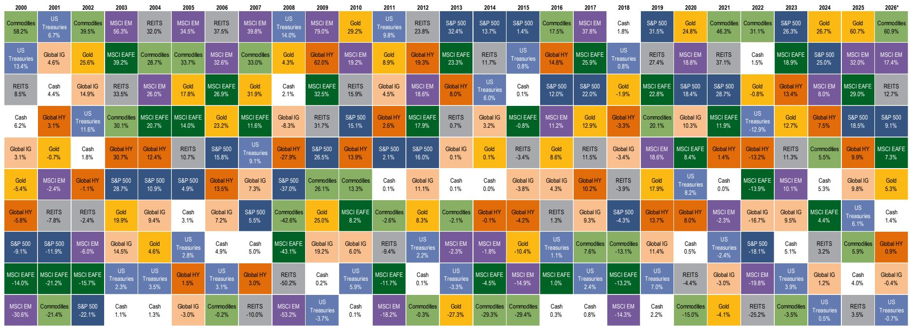
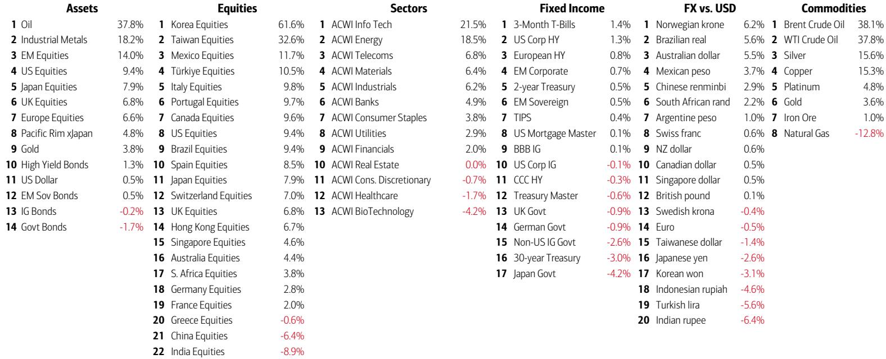
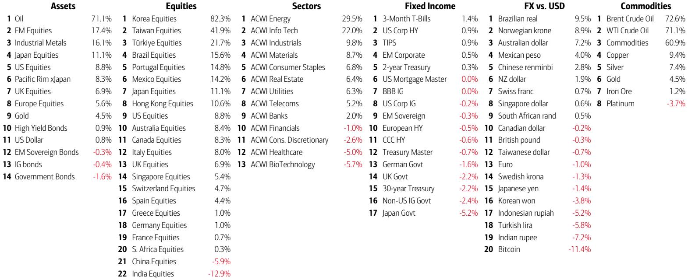

# 市场真正低估的不是AI泡沫，而是新兴市场的信用裂缝

这份来自某外资投行策略团队的周度资金流报告，表面上在讨论“股市集中度逼近历史极值”和“散户狂热”，但真正值得产业决策者和资产配置者关注的，是报告里一个容易被忽略的嵌套判断：**全球资本成本的上升，正在从边缘地带撕开第一道裂口。而这道裂口，最终会通过汇率和通胀路径，传导回核心资产定价。**

报告发布时，该投行的牛熊指标已升至8.0，触发了自2002年以来第17次逆向卖出信号。历史回溯显示，此类信号出现后，全球股市在2-3个月内平均下跌2%-3%，最大回撤可达15%-20%。但比信号本身更重要的，是信号背后的结构性驱动力——这些驱动力，才是决定资产价格拐点是否成立的关键变量。

## 1. 市场集中度已经超越历史上所有泡沫时期，但这次的结构不同

报告提供的Chart 2可能是当前最被低估的警示图。它展示了美国股市在不同历史时期前十大公司的市值占比：1920年代的铁路股约63%，1970年代的“漂亮50”约40%，1980年代的日本约44%，1990年代的TMT约41%，而当前AI Big 10（原美股七巨头加上博通、AMD、美光）的占比已接近48%。

48%这个数字，已经超过了“漂亮50”和TMT泡沫时期的集中度。但真正值得追问的不是“集中度有多高”，而是“这次集中度的形成机制是否不同”。

历史上的集中度，大多来自产业周期末端的估值溢价——铁路、石油、消费品、科技，都是如此。但这一次，AI巨头的集中度背后，叠加了三个新变量：一是全球资金对“稀缺增长”的追逐，二是被动投资对集中度的自我强化，三是AI产业本身正在从“工具”变成“基础设施”，其赢家通吃的特征比以往任何技术革命都更极端。

这意味着，即使集中度本身是一个泡沫信号，但它的“消化方式”可能与传统泡沫不同。过去泡沫破裂时，集中度的下降往往伴随着系统性估值收缩。但这一次，如果AI真的成为下一个通用技术平台，那么集中度的下降可能不是通过龙头下跌，而是通过非龙头公司的追赶和分化来实现。**这恰恰是报告没有完全展开的关键问题：当前的集中度，到底反映的是估值泡沫，还是产业格局的不可逆变化？**

## 2. 亚洲汇率正在集体失守，这是全球风险偏好转向的先行指标

报告的核心洞见之一，是亚洲货币正在经历一场“静默的危机”。韩国韩元逼近30年低点，日元徘徊在35年低位，印尼盾跌破1998年亚洲金融危机和2020年疫情时期的低点，印度卢比创下历史新低。

这些货币的同步贬值，不能简单地归因于“美元强势”。更深层的原因，是全球资本成本上升后，资金正在从“边缘地带”系统性撤离。新兴市场历来是风险偏好转向的第一个信号灯——当全球流动性收紧时，最先感受到压力的，永远是那些依赖外部融资、经常账户脆弱的经济体。

但报告揭示了一个更微妙的矛盾：亚洲出口价格正在飙升。韩国半导体出口价格同比上涨148%，DRAM价格同比上涨223%。这意味着，亚洲经济体正在“出口通胀”，但与此同时，它们的货币却在贬值。这个组合在历史上非常罕见——通常，出口价格上升会带动货币升值，因为贸易顺差扩大。但这一次，货币贬值完全压过了贸易顺差的支撑。

**这背后意味着什么？** 全球投资者正在用脚投票，他们不相信亚洲货币的购买力能够匹配其出口价格的上涨。这种“量价背离”，本质上反映的是对亚洲经济体长期增长模式的怀疑——当AI和自动化开始替代劳动密集型出口时，传统的“出口创汇-货币稳定”逻辑可能正在失效。这对全球供应链定价和通胀传导路径，将产生深远影响。

## 3. 债券收益率上升正在成为泡沫的“天然刹车”，但时机仍未到来

报告提到，债券收益率的飙升历来是经济繁荣和泡沫终结的方式。目前，美国10年期国债收益率仍处于相对高位，但私人客户的债券流入并未显著增加（Chart 6显示，需要更高的10年期收益率才能刺激更大的债券流入）。

这里有一个关键洞察：**债券市场的“惩罚机制”还没有完全启动。** 历史上，当通胀预期失控或财政赤字膨胀时，债券“义警”会通过抛售国债来迫使收益率上升，从而自动收紧金融条件，抑制泡沫。但当前，尽管通胀数据有所反弹，债券市场的反应仍然温和。

报告给出的解释是：市场预期美联储最终会降息，或者认为通胀是暂时的。但更根本的原因可能是，全球储蓄过剩和养老金等长线资金的刚性需求，在短期内压低了期限溢价。这意味着，债券收益率的上行将是“渐进式”的，而不是“断崖式”的。**这对资产价格的影响是：泡沫不会突然破裂，而是会以“温水煮青蛙”的方式逐步消化。** 对于持仓者来说，最大的风险不是暴跌，而是时间的磨损。

## 4. 历史IPO经验告诉我们：巨型IPO后的市场方向取决于“资金属性”而非“规模”

报告提供了一个非常有价值的分析框架：历史上十大IPO后的市场表现。表1显示，阿里巴巴和工商银行的IPO是“火箭燃料”，推动了随后3-12个月的中国股市大幅上涨；而Visa和友邦保险的IPO则是“顶部信号”，标普500和恒生指数在9-12个月后显著下跌。

这一对比揭示了一个关键变量：**IPO的资金来源和产业周期。** 当IPO的资金来自“增量资金”（如阿里巴巴上市时，全球资金对中国互联网的配置刚刚开始），它会成为市场上涨的催化剂；当IPO的资金来自“存量博弈”（如Visa在2008年金融危机前夕上市），它就会成为市场见顶的信号。

当前，市场正在等待一系列巨型IPO。如果这些IPO的资金来自“从现有AI龙头中撤出的获利盘”，那么它们可能会加速市场切换；如果来自“新增的全球配置资金”，那么它们可能会延续当前的泡沫逻辑。**但报告提示了一个更重要的观察点：IPO之后的市场方向，取决于这些公司是否代表“新增长”，而不是“估值消化”。** 这个框架，对判断未来6-12个月的资产配置方向至关重要。

## 5. 报告尚未完全回答的关键问题：消费者能否成为“后泡沫”时代的避风港？

报告的结尾提出了一个大胆的判断：新兴市场和商品仍然是结构性多头，但消费者股票将是“后泡沫时代”最好的逆向投资机会。理由是，AI正在降低劳动力成本，但并未减少劳动力数量，这将释放消费者的购买力；同时，等权重的消费者股票相对于标普500的比值已经低于2008年金融危机时的低点（Chart 7）。

这是一个诱人的叙事，但报告没有完全回答三个关键问题：

第一，消费者股票的相对弱势，到底是“估值压缩”还是“盈利恶化”？如果是前者，那么逆向投资成立；如果是后者，那么低估值可能是价值陷阱。报告没有提供消费者板块的盈利趋势数据。

第二，AI降低劳动力成本，是否真的能转化为消费者购买力？历史上，技术进步带来的成本下降，往往被企业和股东攫取，而不是传递给消费者。除非竞争格局发生变化，否则“AI利好消费者”的假设需要更多证据。

第三，消费者股票的反转时机是什么？报告提到了“后泡沫时代”，但泡沫何时结束？如果债券收益率继续上升，消费者板块的融资成本也会上升，这反而会压制消费。**这个因果链中的时间差，是逆向投资者必须精确把握的变量。**

这些未解问题，正是我们希望在后续讨论中继续深挖的方向。如果你对这些判断背后的数据细节和逻辑推演感兴趣，欢迎来星球微信群里继续讨论——我们会围绕这些关键假设，逐层拆解报告中的图表和表格，还原策略师的完整推导链条。

最后，请允许我以一份免责声明结束这篇导读：

Personal reading notes and learning share only. Not investment advice.

