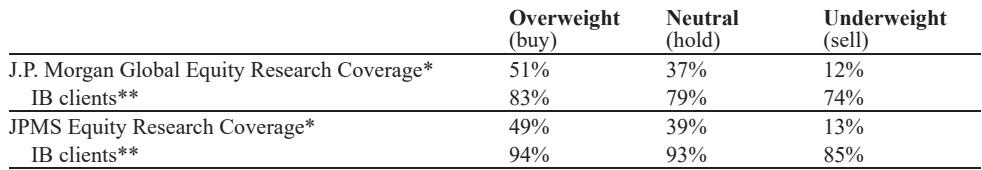

# CXO 的真正拐点不是订单回暖，而是商业模式的重构

过去两年，市场对中国医药外包板块的讨论始终围绕一个核心问题：全球生物医药融资何时触底反弹。订单增速、客户询价、投融资数据，几乎成了判断CXO景气度的唯一锚点。但最近一期某外资投行的年度中国峰会释放了一个值得重新审视的信号——真正驱动头部公司价值变化的，或许不再是周期性的需求回补，而是供给端的结构性升级。

这份研报以第一天会议纪要的形式，披露了药明合联、药明康德、康龙化成、金斯瑞、翰森制药等多家公司的管理层最新表态。表面看，各家都在重申2026年业绩指引，但细读之下，每家公司都传递了一个共同逻辑：行业竞争已经从“拼产能、拼价格”进入“拼平台、拼壁垒、拼模式”的新阶段。那些能够将规模优势转化为议价权、将技术积累转化为高壁垒新业务的公司，正在拉开与同行的差距。

更值得关注的是，AI对药物发现和CRO业务的影响，已经从概念走向了可量化的商业落地。金斯瑞管理层明确表示，其生命科学业务已从AIDD（AI驱动药物发现）中获得了约50%的新增蛋白合成需求。这不是未来叙事，而是正在发生的结构性变化。

以下是我们从这份纪要中提炼出的五个关键洞察。

## 1. 药明合联的信心来源不是订单，而是商业化产能的确定性爬坡

市场对药明合联的担忧，主要集中在2026年之后的高增长能否持续。但管理层在会议上的表态提供了更清晰的锚点：公司对2026年增长轨迹的信心，核心来源于商业化生产的快速放量，而非单纯的新签项目。

管理层详细披露了无锡和新加坡两地的产能扩建进度，并明确给出了XDP5和XDP6两个先进设施的GMP就绪时间表——分别指向2027年和2028年。这意味着，公司对未来的收入能见度已经覆盖到了三年之后。同时，公司目前拥有8个PPQ（工艺性能确认）项目，这些项目是商业化生产的前置环节，为未来的商业项目提供了明确的可见度。管理层预计，公司的首个BLA（生物制品许可申请）商业项目可能在今年内启动。

这些信息组合在一起，指向一个判断：药明合联正在从“项目型”的订单驱动模式，转向“平台型”的长期服务关系。商业化的确定性，意味着客户粘性更强、收入质量更高、利润率的波动性更低。

此外，管理层还透露了年初收购的BioDlink整合进展顺利，对BioDlink原有客户的定价调整已被市场接受。这是一个容易被忽视的信号：在行业下行周期中完成收购，并在整合后实现价格调整的平稳过渡，说明公司对下游客户的议价能力并没有因为行业波动而削弱。

**对投资者的含义**：药明合联的估值逻辑，可能需要从“订单增速”切换到“商业化产能的利用率和利润率”。如果公司能够持续将PPQ项目转化为BLA项目，那么其收入的可预测性和稳定性将显著高于同行。

## 2. 康龙化成的真正看点不是小分子，而是新业务平台的结构性利润提升

康龙化成管理层在会议上给出了一个相当清晰的指引：2026年订单积压13.85亿美元，支持19%-22%的全年收入增长。但更重要的信息藏在业务结构的变化里。

管理层指出，多肽、寡核苷酸、偶联物载荷和生物制品这四大新业务平台，在2025年合计贡献了接近30%的收入，且增速高达60%-100%以上。更重要的是，这些新业务的稳态毛利率预计将超过小分子业务——而小分子业务的毛利率已经是行业最高的46%-47%。

这意味着，即便整体收入增速维持在20%左右，由于高毛利业务占比的持续提升，未来2-3年的综合毛利率将出现显著的结构性上行。这不是一次性的利润释放，而是商业模式升级带来的持续性改善。

**对投资者的含义**：康龙化成的利润弹性可能被市场低估。如果新业务占比在2027年达到40%-50%，且毛利率高出小分子业务5-10个百分点，那么整体利润率的提升幅度将远超收入增速带来的线性增长。市场当前对CXO的利润预测，可能还没有充分反映这一结构性变化。

## 3. 金斯瑞的战略转向：从卖服务到卖产品，AI正在重塑竞争边界

金斯瑞管理层在会议上释放了两个关键信号。

第一，公司生命科学业务已从AIDD中获得了约50%的新增蛋白合成需求。这个数字本身极具含金量——它意味着AI对药物发现的影响已经从“辅助工具”变成了“需求创造引擎”。如果这一趋势持续，金斯瑞作为上游工具提供商的增长中枢将被系统性抬升。

第二，公司正在执行一个重要的战略转向：从传统的“提供服务”模式，转向“直接向客户销售产品”。具体来说，公司希望客户能够使用其产品自行完成实验，而不是由公司代为完成。这种模式的好处是更优的毛利率和更高的规模化效率。其核心落地产品是TurboCHO蛋白表达试剂盒，已于2026年5月在海外市场推出。

此外，公司还在将AI整合到Bestzyme部门，加速酶发现并降低成本，直接挑战现有行业巨头。同时，管理层预计Legend的在体CAR-T有望很快发布首批人体数据，例如在EHA 2026会议上。

**对投资者的含义**：金斯瑞正在从一家“项目制”的生命科学服务商，转型为一家“产品化”的平台型公司。如果TurboCHO试剂盒能够成功复制金斯瑞在蛋白合成领域的市场地位，那么其收入结构将从“按项目收费”变为“按产品复购”，估值模型可能因此发生质的改变。但这里仍需验证：产品化转型能否在保持高毛利率的同时实现规模化放量？AI整合的效果能否在财务数据中得到体现？

## 4. 翰森制药的BD逻辑：资产储备充足，2026年至少有一笔交易可期

翰森制药管理层重申了2026年双位数增长的指引，但市场更关心的是其BD（业务发展）策略。管理层明确表示，在不考虑新BD交易的情况下，2026年总收入仍可实现双位数增长，其中产品收入和BD相关收入都将保持双位数增速。

在近期增长驱动方面，Ameile的辅助治疗获批（2025年）和化疗联合疗法在1L EGFR突变非小细胞肺癌中的获批（2026年）将是两个关键节点。而在更长期，EGFR/c-MET双抗与Ameile联合疗法（III期）以及c-MET联合疗法（NDA阶段）的潜在获批，将提供持续的增长动力。

但真正值得关注的，是管理层对未来BD交易的展望。公司明确表示，其ADC药物、口服自身免疫疾病药物、IgA肾病药物和CNS药物将是未来BD交易的重要资产。考虑到公司过去每年至少完成一笔BD交易的记录，以及当前丰富的资产储备，研报预期公司2026年至少能完成一笔对外授权交易。

**对投资者的含义**：翰森制药的BD能力是其估值溢价的重要来源。如果2026年能够完成一笔大额对外授权，不仅会直接增厚收入，更重要的是验证其研发平台的资产价值。当前市场对国内制药公司的BD预期普遍偏低，如果翰森能够兑现这一预期，可能成为催化剂。

## 5. 报告尚未完全回答的关键问题：AI对竞争格局的二阶影响

这份纪要提供了大量关于AI对药物发现和CRO业务影响的一手信息，但有一个问题尚未被充分回答：AI究竟是让CXO行业变得更集中，还是更分散？

从金斯瑞的案例看，AI正在创造新的增量需求，并帮助公司从服务转向产品，这有利于头部公司。但另一方面，AI也在降低药物发现的初始门槛，可能催生更多小型生物技术公司，这些公司可能更倾向于内部化部分研发工作，从而减少对传统CRO的依赖。

此外，AI对CXO定价权的影响也不明确。如果AI能够显著提高研发效率，理论上会降低单位研发成本，这可能对按人头或按工时收费的CRO模式形成压力。但如果是按结果或按里程碑收费的模式，AI带来的效率提升反而可能转化为利润率的改善。

这些问题的答案，可能需要等待更多公司的季度业绩披露和行业数据来验证。但可以确定的是，AI对CXO行业的影响，远不止“增加订单”这么简单。

---

这份纪要的核心价值，不在于它提供了多少新的财务数据，而在于它揭示了头部CXO公司正在经历的共同转变：从规模驱动到壁垒驱动，从服务收费到产品复购，从周期性增长到结构性增长。

但需要指出的是，这些转变的兑现程度，仍取决于多个外部变量：全球生物医药融资的恢复节奏、地缘政治对跨境合作的潜在影响、AI技术本身的成熟度。这些变量中任何一个发生变化，都可能改变上述判断的成立条件。

对于希望更深入理解这些动态的读者，我们建议重点关注以下几点：药明合联的BLA项目转化进度、康龙化成新业务平台的毛利率趋势、金斯瑞TurboCHO试剂盒的海外销售数据、以及翰森制药2026年BD交易的具体进展。这些信息，在完整的研报原文中有更详细的图表和数据分析。

欢迎来星球微信群里继续讨论这些未解问题，一起追踪中国CXO行业的结构性变化。

Personal reading notes and learning share only. Not investment advice.

