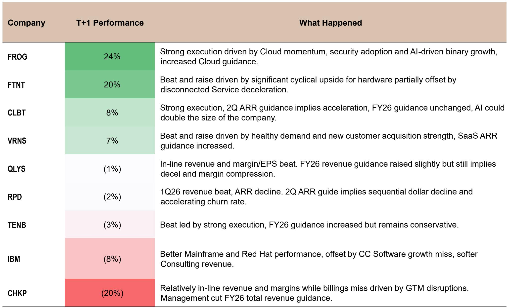

# 市场真正低估的不是需求，而是防御侧的代际断层

这份来自某外资投行的2026年春季网络安全报告，开篇就抛出了一个足以让任何产业决策者重新审视预算分配的判断：网络安全行业正在经历的不是一次周期性回暖，而是一次由AI驱动的供给侧结构性断裂。攻击面的扩张速度已经超过了所有传统防御工具的设计边界。

报告的核心信号并非“安全预算会增长”——这已经是共识。真正的新信息是：攻击成本正在以500到1000倍的幅度下降，而防御能力的提升速度却远远落后。这不是一个供需缺口的问题，而是一个防御范式正在被技术演进本身淘汰的问题。

为什么现在重要？因为2025年9月已经发生了由AI自主策划并执行的网络攻击事件，攻击者使用了比当前开源模型能力更弱的AI系统，就成功侵入了约30个目标，包括政府机构和金融机构。这些攻击中，80%到90%的战术操作由AI独立完成，速度是人类操作员无法企及的。而今天，更强的开源模型已经广泛可用。

报告没有停留在“威胁在变大”的泛泛之谈上。它用数据、案例和成本结构分析，勾勒出了一幅防御者必须立刻重新定位的图景。以下是我们从这份研究报告中提炼出的五个核心洞察。

## 1. 攻击成本从“国家级门槛”降到“任何人可负担”，防御的逻辑基础正在失效

报告中最具冲击力的不是某个新威胁类型，而是一组成本对比数据。在传统模式下，对一个操作系统进行完整的安全漏洞扫描需要一支专家团队工作数周。而使用AI，成本不到50美元。开发一个能够完全控制目标计算机的攻击工具，在黑市上需要50万到200万美元，且需要高级技能。现在，AI可以在半天内完成，成本不到1000美元。

这意味着什么？攻击的门槛已经从“国家级行为体”或“高技能犯罪团伙”降到了“任何拥有模型访问权限和计算资源的组织或个人”。报告明确指出，威胁格局不再由攻击者的技能水平决定，而只取决于他们是否能接触到足够强大的模型。

这从根本上改变了防御的经济学。过去，企业安全团队可以通过提高攻击成本来威慑大多数攻击者。现在，攻击成本已经低到让这种策略失效。防御者面对的不再是有限的、可预测的威胁，而是一个几乎无限供给的、AI驱动的攻击流。报告引用了CrowdStrike 2026年全球威胁报告的数据：平均突破时间已降至29分钟，最快的记录是27秒；从勒索软件到数据泄露的时间已从2022年的8小时以上降至22秒。

防御者必须回答一个根本性问题：当攻击可以无限量、零延迟地发生时，传统的“检测-响应”模型还能成立吗？

## 2. Anthropic的Mythos模型揭示了一个防御者无法回避的“时间窗口”问题

报告详细分析了Anthropic发布的Mythos Preview模型。这是一个被限制访问的AI系统，其自主发现并利用零日漏洞的能力在所有公开基准测试中均领先于其他模型。Mythos在SWE-bench Pro（高级软件问题解决）测试中得分77.8%，远超GPT-5.5的58.6%和Claude Opus 4.7的64.3%。在CyberGym安全漏洞发现与复现测试中，Mythos得分83.1%，同样领先。

但真正值得关注的是Mythos的部署方式。Anthropic通过Project Glasswing将Mythos的访问权限限制在52个经过审查的组织，仅用于防御目的，并投入了1亿美元资源。这是一个精心设计的“时间窗口”策略：让防御者先获得能力，在更广泛的能力扩散之前建立防护。

然而，报告同时指出，这一时间窗口可能比任何人预期的都要短。Kimi K2.6，一个由曾被指控窃取Anthropic训练数据的中国公司发布的开源模型，其编码性能已经达到了Mythos展示真实攻击能力时的水平。多个其他开源模型正接近同一阈值。Anthropic自己的进攻性网络安全负责人估计，大规模可用性将在数月内到来，而非数年。

这里的关键矛盾在于：防御者依赖的“有限访问”优势正在被开源模型的快速追赶所侵蚀。Mythos的能力上限尚未被基准测试完全捕捉——它在一些最难的网络安全评估中得了100%的分数，并发现了27年、17年和16年未被发现的漏洞。但开源模型正在以更快的速度接近这一水平，且没有任何使用限制。

## 3. AI引入的攻击向量不是“新增”，而是“重写”了攻击面

报告列出了一系列AI时代特有的攻击向量：提示注入、数据与模型投毒、AI供应链攻击、过度代理权限、影子AI、AI生成代码漏洞、敏感数据泄露、深度伪造与合成身份、非人类身份泛滥。

这些攻击向量并非独立于现有威胁的新增项。它们的共同特征在于，它们利用了AI系统本身的架构特性。例如，提示注入攻击并非传统意义上的代码漏洞，而是针对LLM推理过程的操纵。AI供应链攻击则利用了企业对开源模型和第三方插件的信任。过度代理权限问题本质上是对AI Agent授权机制的设计缺陷。

这意味着，企业不能简单地在现有安全架构上“叠加”AI安全层。AI攻击面是内生于AI系统架构的。如果一个企业部署了AI Agent来处理客户数据，那么它同时也就引入了非人类身份泛滥、过度代理权限和敏感数据泄露等多个新的攻击路径。这些路径相互关联，一个被攻破的Agent可能成为整个网络的跳板。

报告特别指出，这些攻击面目前尚未被大规模利用，但这恰恰是最大的风险所在。攻击面增长的速度远快于防御者能够通过经验进行优先级排序的速度。企业需要的是“可调节的控制”——今天可以相对宽松，但在真实威胁出现时能够迅速收紧。这种灵活性是目前大多数安全产品所不具备的。

## 4. 平台厂商的竞争优势来自数据飞轮，而非单一产品能力

报告将网络安全厂商明确区分为两类：平台厂商和单一产品厂商。平台厂商如CrowdStrike、Palo Alto Networks、Check Point、Zscaler等，拥有跨终端、网络、身份和数据领域的深度遥测数据。这些数据是训练AI防御模型的关键资产。

报告指出，这些平台厂商已经通过与Anthropic、OpenAI等基础模型厂商的合作建立了先发优势。CrowdStrike的Quiltworks联盟包括了Anthropic和OpenAI，以及多家系统集成商，专注于发现和修复企业应用与网络中的漏洞。Anthropic的Glasswing联盟也包含了多家平台厂商。OpenAI的Daybreak和TAC项目则采取了更开放的策略。

这里的关键洞察是：防御AI的能力不仅取决于算法，更取决于数据。平台厂商拥有数十年的领域专业知识、专有数据和深度遥测数据，这些是训练有效防御模型的基础。单一产品厂商即使拥有优秀的产品，也缺乏跨域数据来训练能够应对AI驱动攻击的防御系统。

报告的超配名单中包含了CrowdStrike、Palo Alto Networks、Check Point、Zscaler、SentinelOne等平台厂商，而Fortinet、Qualys等被列为低配。这一评级反映了报告的核心判断：在AI驱动的安全转型中，数据规模和平台整合能力将成为决定性的竞争壁垒。

## 5. 报告尚未完全回答的关键问题：防御能力能否跟上攻击速度的“负值”？

报告引用了一个令人不安的数据：平均利用时间（Mean Time to Exploit）目前为负7天。这意味着攻击者在补丁发布之前7天就已经开始利用漏洞。这一趋势从2018年的63天压缩到2021年的32天，再到2023年的5天，直至2025年的负7天。

这是一个结构性问题，而非周期性现象。攻击速度的持续加速源于AI能力的高速迭代，而防御能力的提升则受限于企业补丁管理流程、人员培训和系统架构的复杂性。报告提出了一个关键问题：即使拥有最先进的AI防御工具，企业的“修复差距”能否跟上发现速度？

CrowdStrike CEO George Kurtz在一次对话中提到，Quiltworks联盟的合作伙伴在48小时内发现了4800万个漏洞。这一数字本身就暗示了问题的规模。发现漏洞的速度已经远远超过了任何组织能够修复的能力范围。报告暗示，长期来看，如果发现能力能与加速修复相结合，结果可能是更安全的基础设施。但这一假设目前尚未得到验证。

报告没有明确回答的是：企业是否应该从“预防-检测-响应”转向“接受入侵-快速恢复”的新范式？如果发现速度永远超过修复速度，那么安全投资的边际效用是否会递减？这些问题可能需要在完整报告中寻找线索。

---

以上洞察基于这份研报的公开摘要和核心数据。报告全文还包含了更详细的厂商评级分析、估值模型、以及针对不同细分赛道的竞争格局拆解。如果你对某个具体厂商的竞争优势或某个细分市场的定价逻辑感兴趣，欢迎加入我们的知识星球微信群，那里有更深入的讨论和完整的报告解读材料。

Personal reading notes and learning share only. Not investment advice.

