# Global Semiconductor Capital Equipment

# China WFE Import Tracker (Apr 2026): YTD YoY -13% with weaker lithography import due to supply constrain

Qingyuan Lin, Ph.D.

+852 2123 2654

qingyuan.lin@bernsteinsg.com

Stacy A. Rasgon, Ph.D.

+1 213 559 5917

stacy.rasgon@bernsteinsg.com

David Dai, CFA

+852 2918 5704

david.dai@bernsteinsg.com

Zheng Cui

+852 2123 2694

zheng.cui@bernsteinsg.com

Francis Ma

+852 2123 2626

francis.ma@bernsteinsg.com

Alrick Shaw

+1 917 344 8454

alrick.shaw@bernsteinsg.com

Arpad von Nemes

+1 917 344 8461

arpad.vonnemes@bernsteinsg.com

Juho Hwang

+852 2123 2632

juho.hwang@bernsteinsg.com

Carmine Milano, CFA

+44 20 7762 1857

carmine.milano@bernsteinsg.com

We track monthly Wafer Fabrication Equipment (WFE) imports to China through data from China Customs (link); this call provides an update to the April 2026 data (excel) and our analysis. April import was \$2.7 billion, -12% MoM and -3% YoY. YTD YoY -13%, still weaker than expected mainly due to Lithography YTD YoY -27% because of supply constrain. Weaker YTD import does not indicate that China WFE is slowing down as it's just Litho supply constrain, other equipment continue to show growth.

Apr single month total WFE imports at USD 2.7bn, lower than last year average of \$3.2bn. Apr YTD at USD 10bn, YoY -13%. Lithography hit a record low import with only \$142 million, YoY -60%, only accounting for 5% of total import but could be just monthly fluctuations. YTD's weak import was mostly dragged by Lithography, Process Control & Others. By region, import from Singapore/Malaysia showed strong growth, YoY +34%/17%. Litho import was extremely low at USD 142mn, YoY -60%. YTD Litho import was USD 1.85bn, YoY-27%. Import from Singapore + US + Malaysia was USD 1.4bn, YoY +28%, while YTD import was USD 4.3bn, YoY+6%. YTD Shanghai & Beijing import were USD 3.0/2.6bn, as the largest importers, accounting for 30%/26% share.

April Litho imports of EUR 87Mn from the Netherlands were down 87% MoM and 65% YoY, marking it the lowest month since July 2022. Our regression model estimates that China sales will decline sharply to EUR 0.44Bn in Q1, down 64% QoQ and 71% YoY, reflecting weak imports in April. This implies that China will represent only 7% of total system sales in Q2. Monthly import data can be lumpy. During Q1 results, ASML reiterated that China revenue is expected to decline to 20% of total revenue in FY26, compared to 33% in FY25. While we believe China demand will remain resilient, supported by strong investment in capacity expansion, but this year the China sales indeed could be lower due to supply constrain. We now forecast China revenue to decline in line with guidance, with potential upside to guidance if ASML's capacity of DUV supply improves.

For LRCX, the April data (1-month correlation) suggests Jun-Q China revenues would decrease \~28% QoQ, with China exposure landing at \~22% of total revenues based on consensus revenue estimates. This appears at least directionally consistent with management commentary that China exposure will decline sequentially in the June quarter.

AMAT's April quarter results on China revenue is in-line with our regression. AMAT has already reported their April quarter results, hence the April data (3-month correlation) carries no predictive power, rather we will use it as a check/verification. To that end, the correlation suggested China revenues would be flattish in the quarter, and land at \~26.5% revenue exposure, with AMAT's actual results where China revenues were flattish QoQ and were at \~26.4% revenue exposure, in-line with our regression.

Continued on next page

For KLAC, the April data (1-month correlation) suggests Jun-Q China revenues would increase \~17% QoQ, with China exposure landing at \~27% of total revenues based on consensus revenue estimates. Management didn't provide guidance for their China revenue exposure this quarter, but mentioned that overall China WFE will grow at a slower rate than broader WFE this year.

For TEL, our regression suggests TEL's China revenue could be $+3\%$ YoY and $+14\%$ QoQ. Our 1-month regression implies slight upside to TEL's JunQ revenue, tracking ahead of consensus of $-4\%$ QoQ, and an implied China contribution up to $32\%$ vs. $27\%$ in Q4.

For Kokusai, our regression suggests their China revenue could be +48% YoY and +101% QoQ. Our 1-month regression implies slight upside to consensus of +10% QoQ, and an implied China contribution of 51% vs. 28% in Q4.

For Screen, our regression suggests their China revenue could be -50% YoY and -73% QoQ. Our 1-month regression implies downside to consensus of -1% QoQ, and an implied China contribution of 12% vs. 46% in Q4.

For Advantest, Our regression suggests their China revenue is could be +35% YoY and -7% QoQ. Our 1-month regression implies slight downside to consensus of +5% QoQ, and an implied China contribution of 15% vs. 17% in Q4.

BERNSTEIN TICKER TABLE 

<table><tr><td rowspan="2">Ticker</td><td rowspan="2">Rating</td><td rowspan="2">Cur</td><td rowspan="2">21 May 2026 Closing Price</td><td rowspan="2">Price Target</td><td rowspan="2">TTM Rel. Perf.</td><td colspan="4">Reported EPS</td><td colspan="3">Reported P/E (x)</td></tr><tr><td>Cur</td><td>2025A</td><td>2026E</td><td>2027E</td><td>2025A</td><td>2026E</td><td>2027E</td></tr><tr><td>688012.CH (AMEC)</td><td>O</td><td>CNY</td><td>475.80</td><td>500.00</td><td>134.2%</td><td>CNY</td><td>3.40</td><td>4.95</td><td>7.18</td><td>139.9</td><td>96.2</td><td>66.2</td></tr><tr><td>002371.CH (NAURA)</td><td>O</td><td>CNY</td><td>662.99</td><td>680.00</td><td>74.9%</td><td>CNY</td><td>5.66</td><td>10.22</td><td>16.41</td><td>117.1</td><td>64.9</td><td>40.4</td></tr><tr><td>688072.CH (Piotech)</td><td>O</td><td>CNY</td><td>606.20</td><td>580.00</td><td>271.3%</td><td>CNY</td><td>3.32</td><td>8.12</td><td>12.40</td><td>182.6</td><td>74.6</td><td>48.9</td></tr><tr><td>8035.JP (Tokyo Electron)</td><td>O</td><td>JPY</td><td>48,800</td><td>59,200</td><td>75.5%</td><td>JPY</td><td>1,250.88</td><td>1,504.14</td><td>1,848.77</td><td>39.0</td><td>32.4</td><td>26.4</td></tr><tr><td>6525.JP (Kokusai)</td><td>O</td><td>JPY</td><td>7,005.00</td><td>8,240.00</td><td>94.0%</td><td>JPY</td><td>128.63</td><td>200.23</td><td>274.61</td><td>54.5</td><td>35.0</td><td>25.5</td></tr><tr><td>7735.JP (Screen)</td><td>M</td><td>JPY</td><td>10,730</td><td>12,600</td><td>65.2%</td><td>JPY</td><td>486.61</td><td>572.60</td><td>662.24</td><td>22.1</td><td>18.7</td><td>16.2</td></tr><tr><td>6857.JP (Advantest)</td><td>O</td><td>JPY</td><td>26,745</td><td>39,200</td><td>254.6%</td><td>JPY</td><td>534.21</td><td>735.65</td><td>870.09</td><td>50.1</td><td>36.4</td><td>30.7</td></tr><tr><td>AMAT (Applied Materials)</td><td>O</td><td>USD</td><td>427.36</td><td>525.00</td><td>138.3%</td><td>USD</td><td>9.42</td><td>12.17</td><td>15.56</td><td>45.4</td><td>35.1</td><td>27.5</td></tr><tr><td>LRCX (Lam Research)</td><td>O</td><td>USD</td><td>302.24</td><td>340.00</td><td>239.9%</td><td>USD</td><td>4.14</td><td>5.68</td><td>7.98</td><td>73.1</td><td>53.2</td><td>37.9</td></tr><tr><td>KLAC</td><td>O</td><td>USD</td><td>1,842.18</td><td>1,975.00</td><td>111.4%</td><td>USD</td><td>33.28</td><td>36.93</td><td>51.22</td><td>55.3</td><td>49.9</td><td>36.0</td></tr><tr><td>ASML (ASML)</td><td>O</td><td>USD</td><td>1,592.00</td><td>1,971.00</td><td>90.8%</td><td>USD</td><td>27.95</td><td>36.96</td><td>53.13</td><td>49.0</td><td>37.1</td><td>25.8</td></tr><tr><td>ASML.NA (ASML)</td><td>O</td><td>EUR</td><td>1,345.20</td><td>1,700.00</td><td>90.4%</td><td>EUR</td><td>24.72</td><td>32.69</td><td>46.98</td><td>54.4</td><td>41.1</td><td>28.6</td></tr><tr><td>ASIAX</td><td></td><td></td><td>1,891.82</td><td></td><td></td><td></td><td></td><td></td><td></td><td></td><td></td><td></td></tr><tr><td>JPL</td><td></td><td></td><td>2,461.85</td><td></td><td></td><td></td><td></td><td></td><td></td><td></td><td></td><td></td></tr><tr><td>SPX</td><td></td><td></td><td>7,432.97</td><td></td><td></td><td></td><td></td><td></td><td></td><td></td><td></td><td></td></tr><tr><td>EDME</td><td></td><td></td><td>1,536.51</td><td></td><td></td><td></td><td></td><td></td><td></td><td></td><td></td><td></td></tr></table>

O - Outperform, M - Market-Perform, U - Underperform, NR - Not Rated, CS - Coverage Suspended   
AMAT, LRCX, KLAC estimate is Adjusted EPS; AMAT, LRCX, KLAC valuation is Adjusted P/E (x);   
Source: Bloomberg, Bernstein estimates and analysis.

# INVESTMENT IMPLICATIONS

NAURA (Outperform, CNY 680.00): As the domestic WFE leader, NAURA has the broadest product portfolio covering Deposition (PVD, CVD), Dry Etch (ICP), Thermo Processes, and Cleaning, as well as a more diverse client base covering leading logic, DRAM, NAND players, benefiting from the WFE domestic substitution in China with acceleration share gain.

AMEC (Outperform, CNY 500.00): Primarily focused on Dry Etch (CCP, ICP) with rapid expansion in Deposition (ALD, LPCVD, EPI), commonly perceived as the domestic WFE company with the best technology and widest global recognition, continue to benefit from the WFE domestic substitution in China with acceleration share gain.

Piotech (Outperform, CNY 580.00): Rising domestic WFE vendor primarily focused on Deposition (PECVD, HDPCVD, SACVD, ALD) with expansion in W2W and C2W hybrid bonding equipment for advanced packaging. Piotech has a strong track record of product innovation, which should allow it to benefit from the WFE domestic substitution in China with acceleration share gain.

Tokyo Electron (Outperform, ¥59,200): TEL is the #4 SPE supplier globally and the biggest Japanese SPE supplier with major presence in 6 product segments. It is expected to gain share and expand margins with competitive pricing after yen depreciation.

Kokusai (Outperform, ¥8,240.00): Batch ALD should see more adoption in advanced nodes especially GAA (gate-all-around). The biggest use of batch ALD is in NAND, and NAND capex recovery is accelerating.

Screen (Market-Perform, ¥12,600): Cleaning intensity is not increasing, and the market is competitive with both global rivals (TEL, Lam) and Chinese (ACMR, Naura). Potential upside from panel level packaging is worth watching.

Advantest (Outperform, ¥39,200): Benefits from rising testing intensity for HBM and Blackwell. As the dominant supplier for HBM tester (\~65%) and Nvidia AI GPU (100% share), Advantest should be able to lift ASP and margin with product migration, especially with HBM4 in 2025.

AMAT (Outperform, \$525.00): Exposure to key inflections is strong and valuation vs peers remains attractive.

LRCX (Outperform, \$340.00): The company is benefiting from key inflections (GAA, packaging, HBM, NAND upgrades) and CY26 commentary seems supportive.

KLAC (Outperform, \$1,975.00): Amid positive WFE trends KLAC possesses structural growth drivers, a strong and durable competitive position, lower China replacement risk, and disciplined capital allocation, warranting premium valuation, in our view.

ASML (Outperform, EUR 1,700.00): We rate ASML Outperform with a PT of €1,700.00 with 26% upside, driven by DRAM capacity growth acceleration and EUV intensity increase in 1c node. ASML is the top pick of EU Semis.

# DETAILS

# CHINA WFE IMPORT OVERVIEW

China is becoming increasingly important in the global WFE market, and there is intense debate around the sustainability of the demand, tracking the import data to China would provide valuable insights. The China Customs statistics website (link) provides data on monthly Wafer Fabrication Equipment (WFE) imports to China. This data includes a detailed breakdown by equipment type and region. More details on the data source and analysis methodology are illustrated in the appendix.

Key statistics for the overall imports are summarized in the below charts:

- Monthly import data (Exhibit 1, Exhibit 2, Exhibit 3): Apr import was \$2.7bn, lower than last year's average of \$3.2bn/month.   
- By equipment, lithography import in April was extremely low, only at USD 142 mn. While other equipment largely remained flattish, process control, lithography, and other equipment showed double-digit decline YoY. By equipment and by import region, Singapore, Malaysia showed double-digit growth.

EXHIBIT 1: April import was \$2.7 billion   
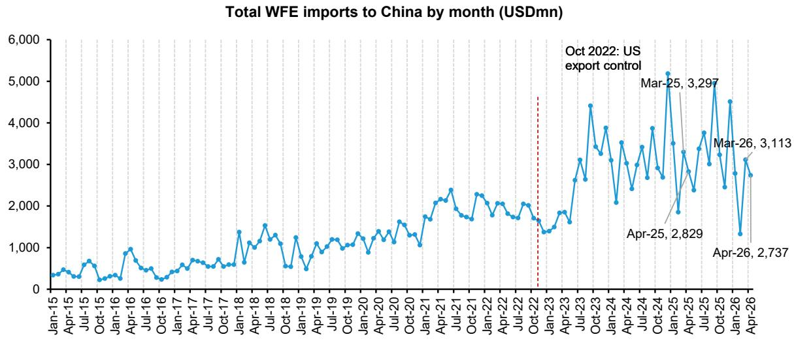

line

| Month     | Value   |
| --------- | ------- |
| Apr-25    | 2,829   |
| Mar-25    | 3,297   |
| Mar-26    | 3,113   |
| Apr-26    | 2,737   |

Source: General Administration of Customs of the People's Republic of China, Bernstein analysis

EXHIBIT 2: Month-over-month showed 12% decline, mostly dragged down by lithography import.   
Total WFE imports to China MoM growth by segment (monthly) (USDmn)   
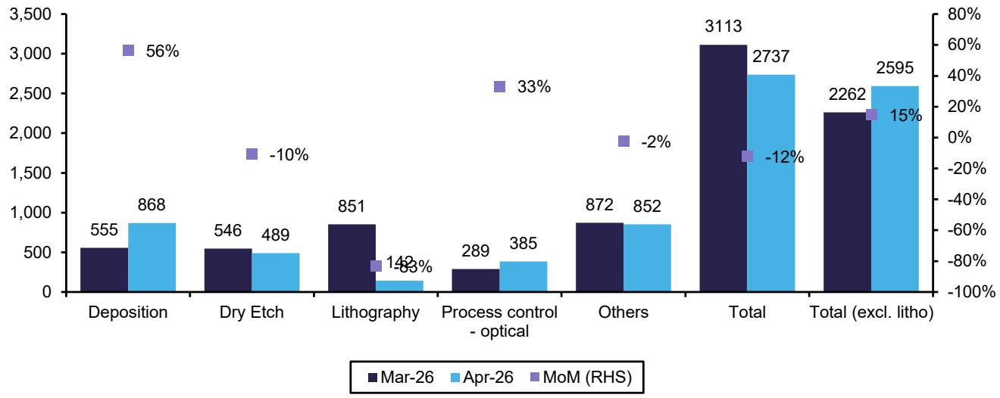

bar_line

| Category | Mar-26 | Apr-26 | MoM (RHS) (%) |
| :--- | :--- | :--- | :--- |
| Deposition | 555 | 868 | 56 |
| Dry Etch | 546 | 489 | -10 |
| Lithography | 851 | 142 | -33 |
| Process control - optical | 289 | 385 | 33 |
| Others | 872 | 852 | -2 |
| Total | 3113 | 2737 | -12 |
| Total (excl. litho) | 2262 | 2595 | 15 |

Others include: RTP and Oxidation/Diffusion (84862010), Doping (84862050), and Other equipment used in semiconductor devices or integrated circuits manufacturing (84862090)   
Source: General Administration of Customs of the People's Republic of China, Bernstein analysis

EXHIBIT 3: The year-over-year figures only show a modest decline, given that weak lithography imports were offset by stronger deposition imports.   
Total WFE imports to China YoY growth by segment (monthly) (USDmn)   
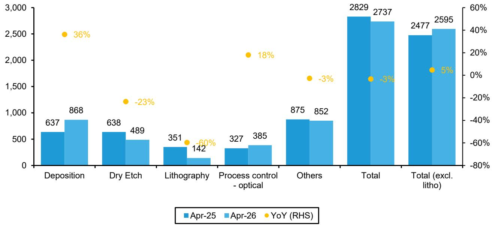

bar_line

| Category | Apr-25 | Apr-26 | YoY (RHS) (%) |
| :--- | :--- | :--- | :--- |
| Deposition | 637 | 868 | 36 |
| Dry Etch | 638 | 489 | -23 |
| Lithography | 351 | 142 | -60 |
| Process control - optical | 327 | 385 | 18 |
| Others | 875 | 852 | -3 |
| Total | 2829 | 2737 | -3 |
| Total (excl. litho) | 2477 | 2595 | 5 |

Source: General Administration of Customs of the People's Republic of China, Bernstein analysis

EXHIBIT 4: The lithography import was \$142mn in Apr 2026, much weaker than last year   
Lithography imports to China (monthly) (USDmn)   

line

| Date     | Value |
| -------- | ----- |
| Apr-25   | 350   |
| Mar-25   | 932   |
| Mar-26   | 851   |
| Apr-26   | 142   |

Source: General Administration of Customs of the People's Republic of China, Bernstein analysis

EXHIBIT 5: 2026 YTD import -13% YoY   
Total WFE imports to China by year   
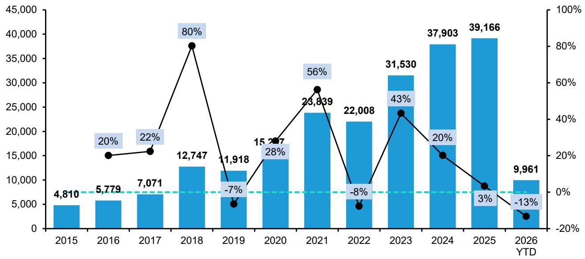

bar_line

| Year | Value | Percentage (%) |
| :--- | :--- | :--- |
| 2015 | 4,810 | |
| 2016 | 5,779 | 20 |
| 2017 | 7,071 | 22 |
| 2018 | 12,747 | 80 |
| 2019 | 11,918 | -7 |
| 2020 | 15,247 | 28 |
| 2021 | 23,839 | 56 |
| 2022 | 22,008 | -8 |
| 2023 | 31,530 | 43 |
| 2024 | 37,903 | 20 |
| 2025 | 39,166 | 3 |
| 2026 YTD | 9,961 | -13 |

Source: General Administration of Customs of the People's Republic of China, Bernstein analysis

# BY REGION & BY EQUIPMENT TYPE SEGMENTATION

From the imports by region breakdown, Exhibit 7 and Exhibit 8 reveal imports from the Netherlands has increased since 2023 due to aggressive lithography imports.

By region, US and SEA imports combined continue to gain share. 2026 YTD US+Malaysia+Singapore import share was 44%, while 2025 US+Malaysia+Singapore import share 35% and 33% in 2024; 2026 YTD Japan import share was 18%, while 2025 Japan import share was 23% and 26% in 2024; 2026 Netherlands import share was 19%, while 25% in both 2025 & 2024.

Excluding lithography, there has been a gradual uptick in imports from Singapore/Malaysia since 2021, coupled with a decrease in imports from the US (Exhibit 8). This trend is likely influenced by US suppliers opting to ship goods from their Singapore/Malaysia production facilities to China instead of directly from the US manufacturing sites (for example, Applied Materials has a Singapore manufacturing site).

EXHIBIT 6: U.S. import share & U.S. + Singapore + Malaysia import share   
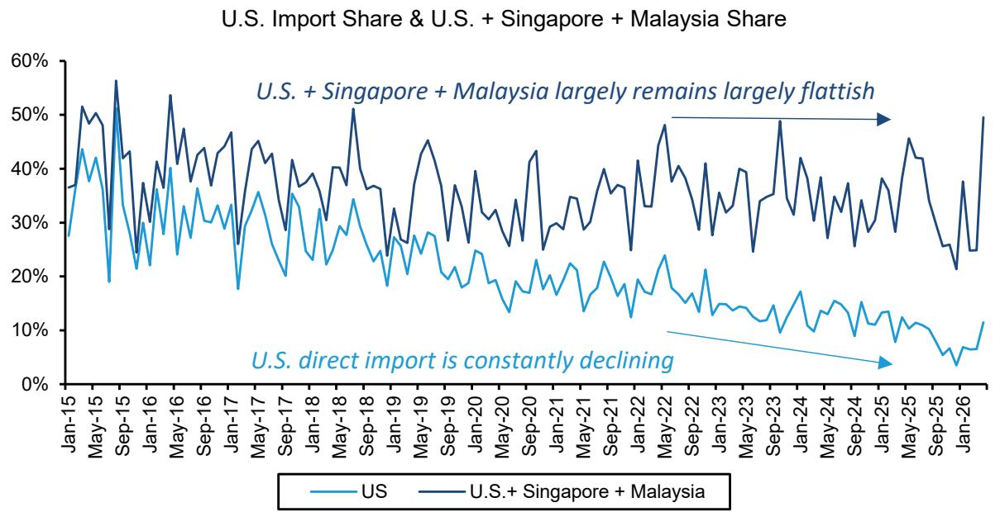

line

| Date    | U.S. Import Share | U.S. + Singapore + Malaysia |
|---------|-------------------|------------------------------|
| Jan-15  | ~35%              | ~38%                         |
| May-15  | ~40%              | ~50%                         |
| Sep-15  | ~20%              | ~55%                         |
| Jan-16  | ~30%              | ~40%                         |
| May-16  | ~35%              | ~50%                         |
| Sep-16  | ~30%              | ~45%                         |
| Jan-17  | ~25%              | ~40%                         |
| May-17  | ~35%              | ~45%                         |
| Sep-17  | ~20%              | ~35%                         |
| Jan-18  | ~30%              | ~40%                         |
| May-18  | ~35%              | ~50%                         |
| Sep-18  | ~25%              | ~35%                         |
| Jan-19  | ~20%              | ~30%                         |
| May-19  | ~25%              | ~45%                         |
| Sep-19  | ~20%              | ~35%                         |
| Jan-20  | ~25%              | ~30%                         |
| May-20  | ~15%              | ~25%                         |
| Sep-20  | ~20%              | ~40%                         |
| Jan-21  | ~15%              | ~30%                         |
| May-21  | ~20%              | ~35%                         |
| Sep-21  | ~15%              | ~30%                         |
| Jan-22  | ~20%              | ~40%                         |
| May-22  | ~15%              | ~45%                         |
| Sep-22  | ~10%              | ~35%                         |
| Jan-23  | ~15%              | ~30%                         |
| May-23  | ~10%              | ~40%                         |
| Sep-23  | ~15%              | ~50%                         |
| Jan-24  | ~10%              | ~40%                         |
| May-24  | ~15%              | ~35%                         |
| Sep-24  | ~10%              | ~30%                         |
| Jan-25  | ~10%              | ~45%                         |
| May-25  | ~10%              | ~35%                         |
| Sep-25  | ~5%               | ~25%                         |
| Jan-26  | ~10%              | ~50%                         |

Source: China Custom, Bernstein analysis

EXHIBIT 7: Netherlands' share was flattish, Japan decreased by 3ppt, US+Singapore+Malaysia in aggregate grew slightly   
Total WFE imports to China by region   
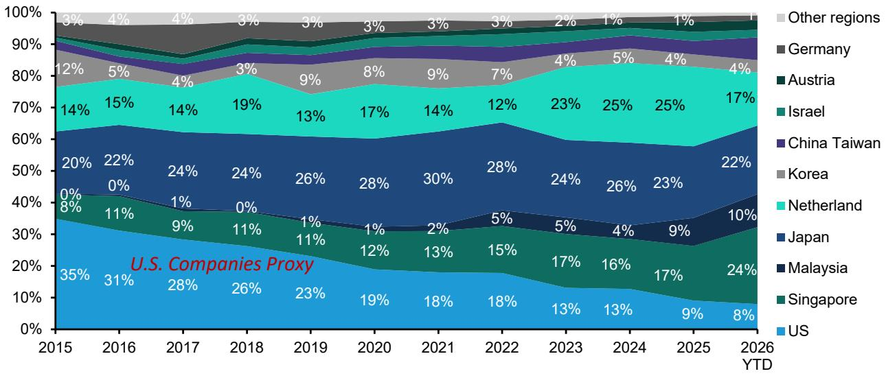  
Source: General Administration of Customs of the People's Republic of China, Bernstein analysis

EXHIBIT 8: Excluding lithography, there has been a gradual uptick in imports from Singapore and Malaysia to offset the share loss for US, indicating a shift in production for US vendors.   
Total WFE excl. lithography imports to China by region   
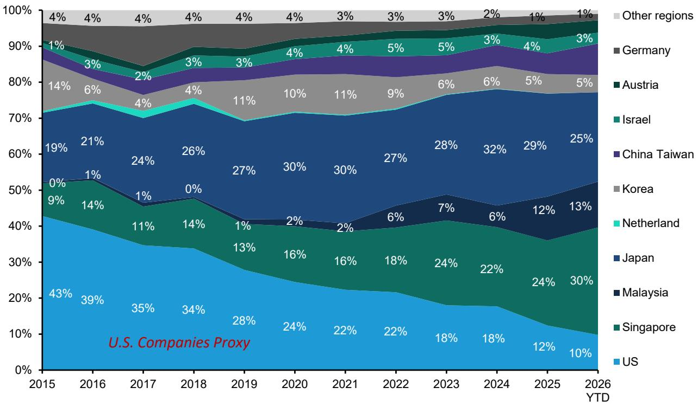

bar_stacked

| Year | US (%) | Singapore (%) | Malaysia (%) | Japan (%) | Netherlands (%) | Korea (%) | China Taiwan (%) | Israel (%) | Austria (%) | Germany (%) | Other regions (%) |
|---|---|---|---|---|---|---|---|---|---|---|---|
| 2015 | 43 | 9 | 0 | 19 | 0 | 14 | 1 | 21 | 14 | 1 | 4 |
| 2016 | 39 | 8 | 0 | 21 | 0 | 6 | 3 | 14 | 1 | 4 | 4 |
| 2017 | 35 | 6 | 0 | 24 | 0 | 4 | 2 | 11 | 1 | 4 | 4 |
| 2018 | 34 | 4 | 0 | 26 | 0 | 4 | 3 | 14 | 0 | 4 | 4 |
| 2019 | 28 | 3 | 0 | 27 | 0 | 11 | 3 | 13 | 0 | 4 | 4 |
| 2020 | 24 | 3 | 0 | 30 | 0 | 10 | 4 | 16 | 0 | 4 | 4 |
| 2021 | 22 | 3 | 0 | 30 | 0 | 11 | 4 | 16 | 0 | 3 | 3 |
| 2022 | 22 | 3 | 0 | 27 | 0 | 9 | 5 | 18 | 0 | 3 | 3 |
| 2023 | 18 | 3 | 7 | 28 | 0 | 6 | 5 | 24 | 0 | 2 | 3 |
| 2024 | 18 | 3 | 6 | 32 | 0 | 6 | 3 | 22 | 0 | 2 | - |
| 2025 YTD | 12 | -5 | -12 | -29 | -5 | -5 | -4 | -24 | -30 | -5 | -1 |
U.S. Companies Proxy
Other regions
Germany
Austria
Israel
China Taiwan
Korea
Netherland
Japan
Malaysia
Singapore

Source: General Administration of Customs of the People's Republic of China, Bernstein analysis

For the imports by equipment type breakdown (Exhibit 9), Lithography's 2024 share remains high at 28% and is the same as 2023 full-year average (28%). 2025 the share dropped by 1ppt to 27%.

If we further zoom into lithography's monthly import share, it didn't change immediately after Oct 2022 export control, but it took off in June 2023 (Exhibit 10). By region, the Netherlands's share in lithography imports started to increase in Aug 2023 (Exhibit 11), and its share gradually expanded over 2024, reaching a record-high level at $94\%$ in July 2024, and Dec 2024 hit another record high at $94\%$ . 2024 hit a record high at $89\%$ (Exhibit 12).

EXHIBIT 9: In 2025, imported Lithography intensity just slightly dropped by 1ppt, further declined in 2026   
Total WFE imports to China market share by equipment type   
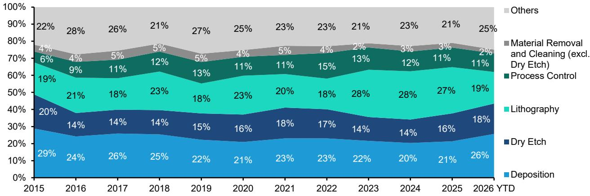

bar_stacked

| Year | Deposition (%) | Dry Etch (%) | Lithography (%) | Process Control (%) | Material Removal and Cleaning (excl. Dry Etch) (%) | Others (%) |
|---|---|---|---|---|---|---|
| 2015 | 29 | 20 | 19 | 4 | 6 | 22 |
| 2016 | 24 | 14 | 21 | 9 | 4 | 28 |
| 2017 | 26 | 14 | 18 | 11 | 5 | 26 |
| 2018 | 25 | 14 | 23 | 12 | 5 | 21 |
| 2019 | 22 | 15 | 18 | 13 | 5 | 27 |
| 2020 | 21 | 16 | 23 | 11 | 4 | 25 |
| 2021 | 23 | 18 | 20 | 11 | 5 | 23 |
| 2022 | 23 | 17 | 18 | 15 | 4 | 23 |
| 2023 | 22 | 14 | 28 | 13 | 2 | 21 |
| 2024 | 20 | 14 | 28 | 12 | 3 | 23 |
| 2025 | 21 | 16 | 27 | 11 | 3 | 21 |
| 2026 YTD | 26 | 18 | 19 | 11 | 2 | 25 |

Source: General Administration of Customs of the People's Republic of China, Bernstein analysis

EXHIBIT 10: The share of lithography imports was only 5%, hitting a record low   
Share of lithograph of total WFE import to China by month   
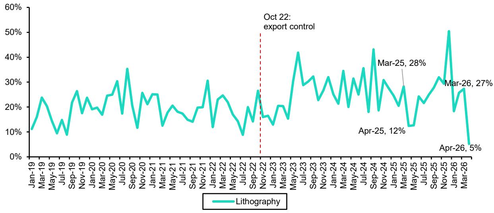

line

| Date       | Value |
| ---------- | ----- |
| Oct 22     | 28%   |
| Apr-25     | 12%   |
| Mar-26     | 27%   |
| Apr-26     | 5%    |

Source: General Administration of Customs of the People's Republic of China, Bernstein analysis

EXHIBIT 11: Share of lithography imports from Japan has decreased since Aug 2023 and remains relatively low.   
Lithography imports to China - share by region (monthly)   
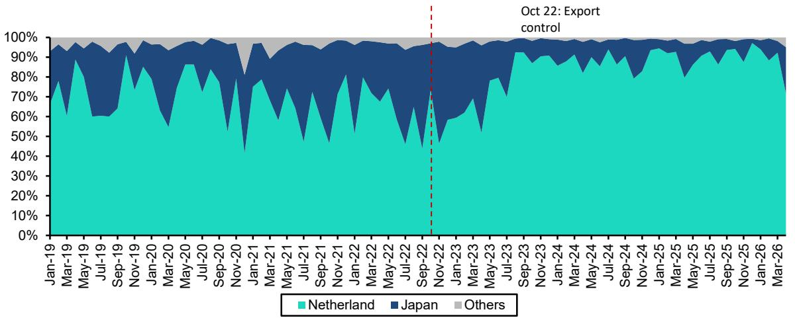

area

| Month    | Netherlands | Japan | Others |
|----------|------------|-------|--------|
| Jan-19   | ~65%       | ~30%  | ~10%   |
| Mar-19   | ~70%       | ~35%  | ~10%   |
| May-19   | ~60%       | ~40%  | ~10%   |
| Jul-19   | ~65%       | ~35%  | ~10%   |
| Sep-19   | ~75%       | ~30%  | ~10%   |
| Nov-19   | ~80%       | ~25%  | ~10%   |
| Jan-20   | ~70%       | ~30%  | ~10%   |
| Mar-20   | ~60%       | ~40%  | ~10%   |
| May-20   | ~75%       | ~35%  | ~10%   |
| Jul-20   | ~85%       | ~30%  | ~10%   |
| Sep-20   | ~70%       | ~35%  | ~10%   |
| Nov-20   | ~45%       | ~50%  | ~10%   |
| Jan-21   | ~75%       | ~30%  | ~10%   |
| Mar-21   | ~80%       | ~35%  | ~10%   |
| May-21   | ~70%       | ~40%  | ~10%   |
| Jul-21   | ~65%       | ~45%  | ~10%   |
| Sep-21   | ~75%       | ~35%  | ~10%   |
| Nov-21   | ~80%       | ~30%  | ~10%   |
| Jan-22   | ~70%       | ~35%  | ~10%   |
| Mar-22   | ~75%       | ~30%  | ~10%   |
| May-22   | ~65%       | ~40%  | ~10%   |
| Jul-22   | ~55%       | ~50%  | ~10%   |
| Sep-22   | ~45%       | ~60%  | ~10%   |
| Nov-22   | ~70%       | ~35%  | ~10%   |
| Jan-23   | ~80%       | ~30%  | ~10%   |
| Mar-23   | ~75%       | ~35%  | ~10%   |
| May-23   | ~85%       | ~30%  | ~10%   |
| Jul-23   | ~90%       | ~25%  | ~10%   |
| Sep-23   | ~95%       | ~20%  | ~10%   |
| Nov-23   | ~90%       | ~25%  | ~10%   |
| Jan-24   | ~85%       | ~30%  | ~10%   |
| Mar-24   | ~90%       | ~35%  | ~10%   |
| May-24   | ~85%       | ~40%  | ~10%   |
| Jul-24   | ~90%       | ~35%  | ~10%   |
| Sep-24   | ~85%       | ~40%  | ~10%   |
| Nov-24   | ~90%       | ~35%  | ~10%   |
| Jan-25   | ~85%       | ~40%  | ~10%   |
| Mar-25   | ~90%       | ~35%  | ~10%   |
| May-25   | ~85%       | ~40%  | ~10%   |
| Jul-25   | ~90%       | ~35%  | ~10%   |
| Sep-25   | ~85%       | ~40%  | ~10%   |
| Nov-25   | ~90%       | ~35%  | ~10%   |
| Jan-26   | ~85%       | ~40%  | ~10%   |
| Mar-26   | ~90%       | ~35%  | ~10%   |

Source: General Administration of Customs of the People's Republic of China, Bernstein analysis

EXHIBIT 12: Netherlands' lithography imports share increased materially after 2022 and is still increasing in 2025   
Lighography imports to China - share by region (yearly)   
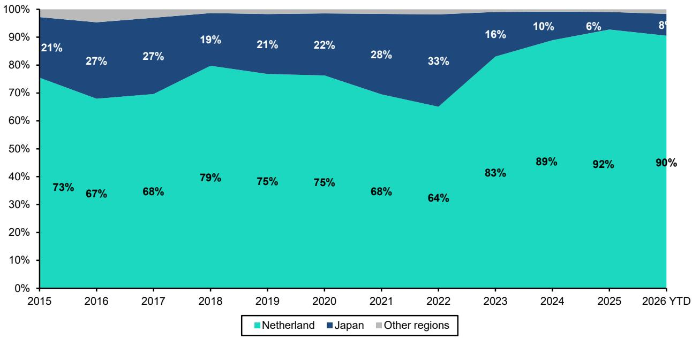

bar_stacked

| Year | Netherland (%) | Japan (%) | Other regions (%) |
| :--- | :--- | :--- | :--- |
| 2015 | 73 | 21 | 1 |
| 2016 | 67 | 27 | 1 |
| 2017 | 68 | 27 | 1 |
| 2018 | 79 | 19 | 1 |
| 2019 | 75 | 21 | 1 |
| 2020 | 75 | 22 | 1 |
| 2021 | 68 | 28 | 1 |
| 2022 | 64 | 33 | 1 |
| 2023 | 83 | 16 | 1 |
| 2024 | 89 | 10 | 1 |
| 2025 | 92 | 6 | 1 |
| 2026 YTD | 90 | 8 | 1 |

Source: General Administration of Customs of the People's Republic of China, Bernstein analysis

# REGRESSION ANALYSIS

# ASML

April imports of EUR 87Mn were down 87% MoM and 65% YoY, marking the lowest datapoint since July 2022. Our regression model, based on 1M of data, estimates that China sales will decline sharply to EUR 0.44Bn in Q1, down 64% QoQ and 71% YoY, reflecting weak imports in April. This implies that China will represent only 7% of total system sales in Q2. Monthly import data can be lumpy. During Q1 results, ASML reiterated that China revenue is expected to decline to 20% of total revenue in FY26, compared to 33% in FY25. While we believe China demand will remain resilient, supported by strong investment in capacity expansion, we now forecast China revenue to decline in line with guidance, with potential upside to guidance if ASML's capacity of DUV supply improves.

China lithography import data published on the China Customs statistics website has proven useful in predicting ASML's China systems revenue. Our regression model, using one month of data for a given quarter, has a relatively high $R^2$ of 0.79, indicating solid predictive power. China's lithography imports in April was EUR 87Mn, down 87% MoM and down 65% YoY compared to April 2025 (Exhibit 13).

Our regression model estimates that China sales will decline sharply to EUR 0.44Bn in Q1, down 64% QoQ and 71% YoY, reflecting weak imports in April. This implies China revenue representing only 7% of Q2 total system sales, down 12 percentage points sequentially compared to Q1 and 20 percentage points lower than the Q2 2025 level of 27%. During Q1 results, ASML reiterated that China revenue is expected to decline to 20% of total revenue in FY26, compared to 33% in FY25. (Exhibit 14, Exhibit 15, Exhibit 16, Exhibit 16).

While we believe China demand will remain resilient, supported by strong investment in capacity expansion, we now forecast China revenue to decline in line with guidance, with potential upside to guidance if ASML's capacity of DUV supply improves.

EXHIBIT 13: The correlation between monthly China litho imports and ASML's quarterly China systems revenue (divided by 3) is fairly solid. April imports of EUR 87Mnwere down 87% MoM and 65% YoY, marking the lowest datapoint since July 2022.   
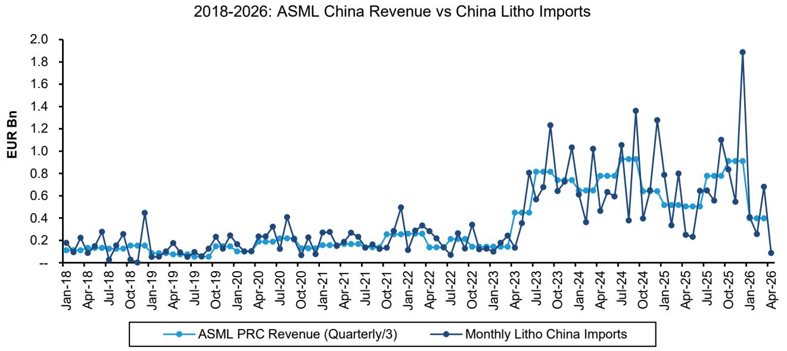

line

| Date    | ASML PRC Revenue (Quarterly/3) | Monthly Litho China Imports |
|---------|----------------------------------|------------------------------|
| Jan-18  | 0.1                              | 0.2                          |
| Apr-18  | 0.1                              | 0.2                          |
| Jul-18  | 0.1                              | 0.3                          |
| Oct-18  | 0.1                              | 0.4                          |
| Jan-19  | 0.1                              | 0.1                          |
| Apr-19  | 0.1                              | 0.2                          |
| Jul-19  | 0.1                              | 0.1                          |
| Oct-19  | 0.1                              | 0.2                          |
| Jan-20  | 0.1                              | 0.2                          |
| Apr-20  | 0.1                              | 0.3                          |
| Jul-20  | 0.2                              | 0.4                          |
| Oct-20  | 0.2                              | 0.1                          |
| Jan-21  | 0.2                              | 0.3                          |
| Apr-21  | 0.2                              | 0.3                          |
| Jul-21  | 0.2                              | 0.3                          |
| Oct-21  | 0.3                              | 0.5                          |
| Jan-22  | 0.3                              | 0.1                          |
| Apr-22  | 0.3                              | 0.3                          |
| Jul-22  | 0.3                              | 0.1                          |
| Oct-22  | 0.3                              | 0.3                          |
| Jan-23  | 0.3                              | 0.1                          |
| Apr-23  | 0.4                              | 0.8                          |
| Jul-23  | 0.5                              | 1.2                          |
| Oct-23  | 0.7                              | 1.0                          |
| Jan-24  | 0.7                              | 1.3                          |
| Apr-24  | 0.7                              | 1.3                          |
| Jul-24  | 0.9                              | 1.3                          |
| Oct-24  | 0.6                              | 1.3                          |
| Jan-25  | 0.5                              | 1.3                          |
| Apr-25  | 0.5                              | 1.3                          |
| Jul-25  | 0.8                              | 1.1                          |
| Oct-25  | 0.9                              | 1.9                          |
| Jan-26  | 0.4                              | 1.9                          |
| Apr-26  | 0.4                              | 1.9                          |

Source: Company reports, General Administration of Customs of the People's Republic of China, Bernstein estimates and analysis

EXHIBIT 14: Our regression yields an R2 of 0.79 indicating robust predictive power using 1 month of data. The implied China revenue for 2Q26 is EUR 0.44Bn due to weak litho imports in April.   
ASML Quarterly PRC Sales vs. 1M PRC
Import: 1QCY15-1QCY26   
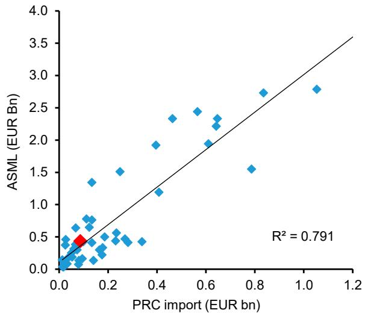

scatter

| PRC import (EUR bn) | ASML (EUR Bn) |
| ------------------- | ------------- |
| 0.0                 | 0.0           |
| 0.1                 | 0.5           |
| 0.2                 | 0.6           |
| 0.3                 | 0.7           |
| 0.4                 | 0.8           |
| 0.5                 | 0.9           |
| 0.6                 | 1.0           |
| 0.7                 | 1.1           |
| 0.8                 | 1.2           |
| 0.9                 | 1.3           |
| 1.0                 | 1.4           |
| 1.1                 | 1.5           |
| 1.2                 | 1.6           |

EXHIBIT 15: The predicted systems sales from China at EUR 0.44Bn represents a 71% decline QoQ. This implies China revenue representing only 7% of Q2 total system sales. 

<table><tr><td rowspan="2"></td><td colspan="3">Revenue (EUR Mn)</td><td rowspan="2">YoY</td><td rowspan="2">QoQ</td></tr><tr><td>2QFY25</td><td>1QFY26</td><td>2QFY26E</td></tr><tr><td>ASML China System Sales</td><td>1,511</td><td>1,193</td><td>435</td><td>-71%</td><td>-64%</td></tr><tr><td>ASML System Sales</td><td>5,596</td><td>6,279</td><td></td><td></td><td></td></tr><tr><td>Bernstein</td><td></td><td></td><td>6,357</td><td>14%</td><td>1%</td></tr><tr><td>Consensus</td><td></td><td></td><td>6,311</td><td>13%</td><td>1%</td></tr><tr><td>China as % of System Sales</td><td>27%</td><td>19%</td><td></td><td></td><td></td></tr><tr><td>Bernstein</td><td></td><td></td><td>7%</td><td>-20%</td><td>-12%</td></tr><tr><td>Consensus</td><td></td><td></td><td>7%</td><td>-20%</td><td>-12%</td></tr></table>

Source: Company reports, General Administration of Customs of the People's Republic of China, Bloomberg, Bernstein estimates and analysis

EXHIBIT 16: Our estimate for ASML's China system sales in Q2 implies a 64% QoQ decline and a 71% YoY drop, marking the lowest level since the restrictions were introduced.   
ASML China Quarterly System Sales   
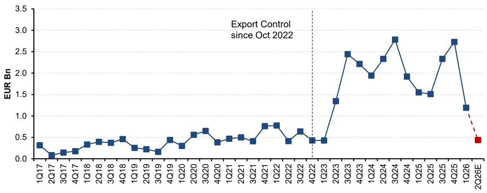

line

| Quarter | EUR Bn |
| ------- | ------ |
| 1Q17    | 0.3    |
| 2Q17    | 0.1    |
| 3Q17    | 0.2    |
| 4Q17    | 0.3    |
| 1Q18    | 0.4    |
| 2Q18    | 0.4    |
| 3Q18    | 0.4    |
| 4Q18    | 0.5    |
| 1Q19    | 0.3    |
| 2Q19    | 0.2    |
| 3Q19    | 0.1    |
| 4Q19    | 0.5    |
| 1Q20    | 0.3    |
| 2Q20    | 0.6    |
| 3Q20    | 0.7    |
| 4Q20    | 0.4    |
| 1Q21    | 0.5    |
| 2Q21    | 0.5    |
| 3Q21    | 0.4    |
| 4Q21    | 0.8    |
| 1Q22    | 0.8    |
| 2Q22    | 0.4    |
| 3Q22    | 0.7    |
| 4Q22    | 0.4    |
| 1Q23    | 0.4    |
| 2Q23    | 1.4    |
| 3Q23    | 2.5    |
| 4Q23    | 2.2    |
| 1Q24    | 1.9    |
| 2Q24    | 2.4    |
| 3Q24    | 2.8    |
| 4Q24    | 1.9    |
| 1Q25    | 1.6    |
| 2Q25    | 1.5    |
| 3Q25    | 2.4    |
| 4Q25    | 2.8    |
| 1Q26E   | 1.2    |
|        | 0.5    |

Source: Company reports, General Administration of Customs of the People's Republic of China, Bernstein estimates and analysis

EXHIBIT 17: Based on our estimate of ASML's China system sales, we expect China's contribution to decline to $7\%$ of total system sales, the lowest level in over five years   
China as % of ASML's Quarterly System Sales   
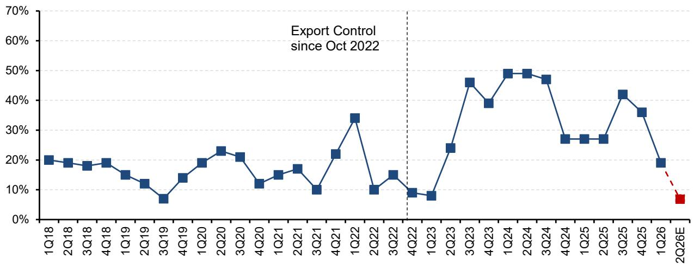

line

| Quarter | Export Control (%) |
| ------- | ------------------ |
| 1Q18    | 20                 |
| 2Q18    | 19                 |
| 3Q18    | 18                 |
| 4Q18    | 19                 |
| 1Q19    | 15                 |
| 2Q19    | 12                 |
| 3Q19    | 6                  |
| 4Q19    | 14                 |
| 1Q20    | 19                 |
| 2Q20    | 23                 |
| 3Q20    | 21                 |
| 4Q20    | 12                 |
| 1Q21    | 15                 |
| 2Q21    | 17                 |
| 3Q21    | 10                 |
| 4Q21    | 22                 |
| 1Q22    | 34                 |
| 2Q22    | 10                 |
| 3Q22    | 15                 |
| 4Q22    | 9                  |
| 1Q23    | 8                  |
| 2Q23    | 24                 |
| 3Q23    | 46                 |
| 4Q23    | 39                 |
| 1Q24    | 50                 |
| 2Q24    | 50                 |
| 3Q24    | 47                 |
| 4Q24    | 27                 |
| 1Q25    | 27                 |
| 2Q25    | 27                 |
| 3Q25    | 42                 |
| 4Q25    | 36                 |
| 1Q26    | 19                 |
| 2Q26E   | 7                  |

Source: Company reports, General Administration of Customs of the People's Republic of China, Bernstein estimates and analysis

# LAM RESEARCH (LRCX), APPLIED MATERIALS (AMAT), AND KLA CORPORATION (KLAC)

For LRCX, the $R^{2}$ on the 1-month correlation is \~0.83 and hence should have decent predicting power. The April data (1-month correlation) suggests Jun-Q China revenues would decrease \~28% QoQ, with China exposure landing at \~22% of total revenues based on consensus revenue estimates (Exhibit 18, Exhibit 19). This appears at least directionally consistent with management commentary that China exposure will decline sequentially in the June quarter (Exhibit 20).

EXHIBIT 18: LRCX 1-month regression yields R2 of 0.83 and should have decent predictive power...   
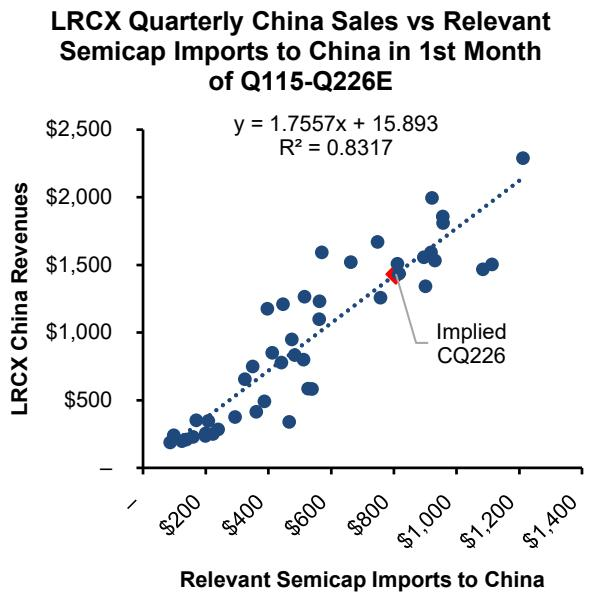

scatter

| Relevant Semicap Imports to China | LRCX China Revenues |
| --------------------------------- | ------------------- |
| $200                              | ~$200               |
| $400                              | ~$400               |
| $600                              | ~$600               |
| $800                              | ~$800               |
| $1,000                            | ~$1,000             |
| $1,200                            | ~$1,200             |
| $1,400                            | ~$1,400             |

China semicap imports relevant for LRCX, given their manufacturing footprint, include shipments from the U.S., Malaysia, Korea, Taiwan and Austria
Source: Company reports, Bloomberg, General Administration of Customs of the People's Republic of China, Bernstein estimates and analysis

EXHIBIT 19: ...with our analysis suggesting China revenues for LRCX down \~28% sequentially in Jun-Q... 

<table><tr><td rowspan="2">LRCX</td><td colspan="3">Revenues ($M, USD)</td><td rowspan="2">YoY</td><td rowspan="2">QoQ</td></tr><tr><td>2QCY2025</td><td>1QCY2026</td><td>2QCY2026E</td></tr><tr><td>China Revenues (incl. Predicted Value)</td><td>$1,810</td><td>$1,997</td><td>$1,432</td><td>(20.9%)</td><td>(28.3%)</td></tr><tr><td>Total Revenues (incl. Consensus Estimate)</td><td>$5,171</td><td>$5,841</td><td>$6,646</td><td>28.5%</td><td>13.8%</td></tr><tr><td>China as % of Total</td><td>35.0%</td><td>34.2%</td><td>21.6%</td><td></td><td></td></tr></table>

Source: Company reports, Bloomberg, General Administration of Customs of the People's Republic of China, Bernstein estimates and analysis

EXHIBIT 20: ...with overall Jun-Q China exposure predicted at \~22% vs Mar-Q exposure of \~34%   
LRCX China WFE Revenue as % of Total Revenues   
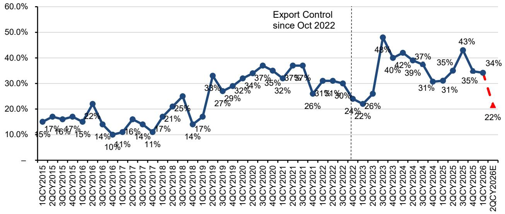

line

| Quarter     | Export Control |
| ----------- | -------------- |
| 1QCY2015    | 15%            |
| 2QCY2015    | 17%            |
| 3QCY2015    | 16%            |
| 4QCY2015    | 17%            |
| 1QCY2016    | 15%            |
| 2QCY2016    | 22%            |
| 3QCY2016    | 14%            |
| 4QCY2016    | 10%            |
| 1QCY2017    | 11%            |
| 2QCY2017    | 16%            |
| 3QCY2017    | 14%            |
| 4QCY2017    | 11%            |
| 1QCY2018    | 17%            |
| 2QCY2018    | 21%            |
| 3QCY2018    | 25%            |
| 4QCY2018    | 14%            |
| 1QCY2019    | 17%            |
| 2QCY2019    | 38%            |
| 3QCY2019    | 27%            |
| 4QCY2019    | 29%            |
| 1QCY2020    | 32%            |
| 2QCY2020    | 34%            |
| 3QCY2020    | 37%            |
| 4QCY2020    | 35%            |
| 1QCY2021    | 32%            |
| 2QCY2021    | 37%            |
| 3QCY2021    | 37%            |
| 4QCY2021    | 26%            |
| 1QCY2022    | 31%            |
| 2QCY2022    | 31%            |
| 3QCY2022    | 30%            |
| 4QCY2022    | 24%            |
| 1QCY2023    | 26%            |
| 2QCY2023    | 48%            |
| 3QCY2023    | 40%            |
| 4QCY2023    | 42%            |
| 1QCY2024    | 39%            |
| 2QCY2024    | 37%            |
| 3QCY2024    | 31%            |
| 4QCY2024    | 35%            |
| 1QCY2025    | 35%            |
| 2QCY2025    | 43%            |
| 3QCY2025    | 35%            |
| 4QCY2025    | 34%            |
| 1QCY2026E   | 34%            |
| 2QCY2026E   | 22%            |

Source: Company reports, Bloomberg, General Administration of Customs of the People's Republic of China, Bernstein estimates and analysis

AMAT has already reported their April quarter results, hence the April data (3-month correlation) carries no predictive power, rather we will use it as a check/verification. To that end, the correlation suggested China revenues would be flattish in the quarter, and land at \~26.5% revenue exposure, with AMAT's actual results indicating China revenues were flattish QoQ and were at \~26.4% revenue exposure, in-line with our regression (Exhibit 21, Exhibit 22, Exhibit 23).

EXHIBIT 21: The AMAT 3-month regression yield R2 of 0.87 and hence should have solid predictive power...   
AMAT Quarterly China Sales vs Relevant Semicap Imports to China in Quarterly Billings of Q115-Q126   
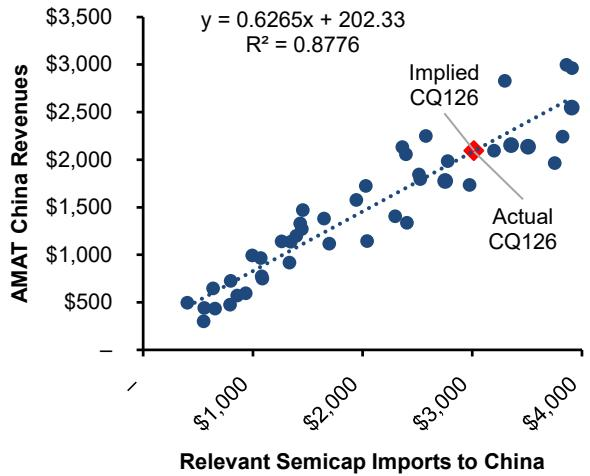

scatter

| Relevant Semicap Imports to China | AMAT China Revenues |
| --------------------------------- | ------------------- |
| $1,000                            | $500                |
| $2,000                            | $1,000              |
| $3,000                            | $2,000              |
| $4,000                            | $3,000              |

Normalized for AMAT Fiscal Quarter's \~1 month offset.

China semicap imports relevant for AMAT, given their manufacturing footprint, include shipments from the U.S., Singapore, Taiwan, Germany, and Israel. Source: Company reports, Bloomberg, General Administration of Customs of the People's Republic of China, Bernstein estimates and analysis

EXHIBIT 22: The regression predicted AMAT's China revenue would be flattish in the April quarter vs the actual flattish growth reported by the company last week, in-line with results 

<table><tr><td rowspan="2">AMAT</td><td colspan="3">Revenues ($M, USD)</td><td rowspan="2">YoY</td><td rowspan="2">QoQ</td></tr><tr><td>1QCY2025</td><td>4QCY2025</td><td>1QCY2026</td></tr><tr><td>China Revenues</td><td>$1,774</td><td>$2,095</td><td>$2,087</td><td>17.6%</td><td>(0.4%)</td></tr><tr><td>China Revenues (incl. Predicted Value)</td><td></td><td></td><td>$2,097</td><td>18.2%</td><td>0.1%</td></tr><tr><td>Total Revenues</td><td>$7,100</td><td>$7,012</td><td>$7,910</td><td>11.4%</td><td>12.8%</td></tr><tr><td>China as % of Total</td><td>25.0%</td><td>29.9%</td><td>26.4%</td><td></td><td></td></tr><tr><td>Predicted China as % of Total</td><td></td><td></td><td>26.5%</td><td></td><td></td></tr></table>

Source: Company reports, Bloomberg, General Administration of Customs of the People's Republic of China, Bernstein estimates and analysis

EXHIBIT 23: AMAT's China exposure fell to \~26.4% in the Apr-Q, in-line with the \~26.5% predicted value from our regression analysis   
AMAT China Revenue as % of Total Revenues   

line

| Quarter     | Value |
| ----------- | ----- |
| 1QCY2015    | 18%   |
| 2QCY2015    | 12%   |
| 3QCY2015    | 20%   |
| 4QCY2015    | 22%   |
| 1QCY2016    | 31%   |
| 2QCY2016    | 20%   |
| 3QCY2016    | 13%   |
| 4QCY2016    | 20%   |
| 1QCY2017    | 21%   |
| 2QCY2017    | 21%   |
| 3QCY2017    | 15%   |
| 4QCY2017    | 22%   |
| 1QCY2018    | 25%   |
| 2QCY2018    | 39%   |
| 3QCY2018    | 33%   |
| 4QCY2018    | 26%   |
| 1QCY2019    | 28%   |
| 2QCY2019    | 31%   |
| 3QCY2019    | 32%   |
| 4QCY2019    | 31%   |
| 1QCY2020    | 29%   |
| 2QCY2020    | 33%   |
| 3QCY2020    | 34%   |
| 4QCY2020    | 27%   |
| 1QCY2021    | 33%   |
| 2QCY2021    | 36%   |
| 3QCY2021    | 34%   |
| 4QCY2021    | 32%   |
| 1QCY2022    | 34%   |
| 2QCY2022    | 28%   |
| 3QCY2022    | 20%   |
| 4QCY2022    | 17%   |
| 1QCY2023    | 21%   |
| 2QCY2023    | 27%   |
| 3QCY2023    | 44%   |
| 4QCY2023    | 45%   |
| 1QCY2024    | 43%   |
| 2QCY2024    | 32%   |
| 3QCY2024    | 30%   |
| 4QCY2024    | 31%   |
| 1QCY2025    | 25%   |
| 2QCY2025    | 35%   |
| 3QCY2025    | 29%   |
| 4QCY2025    | 30%   |
| 1QCY2026    | 26%   |

Source: Company reports, Bloomberg, General Administration of Customs of the People's Republic of China, Bernstein estimates and analysis

For KLAC, the $R^2$ on the 1-month correlation is \~0.84 and hence should have decent predicting power. The April data (1-month correlation) suggests Jun-Q China revenues would increase \~17% QoQ, with China exposure landing at \~27% of total revenues based on consensus revenue estimates (Exhibit 25, Exhibit 19). Management didn't provide guidance for their China revenue exposure this quarter, but mentioned that overall China WFE will grow at a slower rate than broader WFE this year (Exhibit 20).

EXHIBIT 24: The KLAC 1-month regression yields R2 of 0.84 and hence should have decent predictive power...   
KLAC Quarterly China Sales vs Relevant Semicap Imports to China in 1st Month of Q115-Q226E   
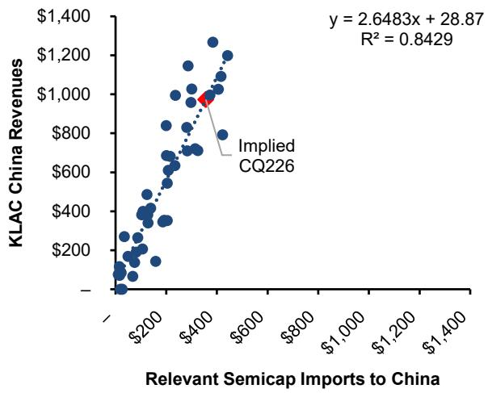

scatter

| Relevant Semicap Imports to China | KLAC China Revenues |
| --------------------------------- | ------------------- |
| $100                              | $50                 |
| $150                              | $100                |
| $200                              | $150                |
| $250                              | $200                |
| $300                              | $250                |
| $350                              | $300                |
| $400                              | $350                |
| $450                              | $400                |
| $500                              | $450                |
| $550                              | $500                |
| $600                              | $550                |
| $650                              | $600                |
| $700                              | $650                |
| $750                              | $700                |
| $800                              | $750                |
| $850                              | $800                |
| $900                              | $850                |
| $950                              | $900                |
| $1000                             | $950                |
| $1050                             | $1000               |
| $1100                             | $1050               |
| $1150                             | $1100               |
| $1200                             | $1150               |
| $1250                             | $1200               |
| $1300                             | $1250               |
| $1350                             | $1300               |
| $1400                             | $1350               |

China semicap imports relevant for KLAC include global process control tools. Source: Company reports, Bloomberg, General Administration of Customs of the People's Republic of China, Bernstein estimates and analysis

EXHIBIT 25: ...with our analysis suggesting China revenues for KLAC up \~17% sequentially in the Jun-Q... 

<table><tr><td rowspan="2">KLAC</td><td colspan="3">Revenues ($M, USD)</td><td rowspan="2">YoY</td><td rowspan="2">QoQ</td></tr><tr><td>2QCY2025</td><td>1QCY2026</td><td>2QCY2026E</td></tr><tr><td>China Revenues(incl. Predicted Value)</td><td>$959</td><td>$830</td><td>$973</td><td>1.5%</td><td>17.3%</td></tr><tr><td>Total Revenues(incl. Consensus Estimate)</td><td>$3,175</td><td>$3,415</td><td>$3,599</td><td>13.4%</td><td>5.4%</td></tr><tr><td>China as % of Total</td><td>30.2%</td><td>24.3%</td><td>27.0%</td><td></td><td></td></tr></table>

Source: Company reports, Bloomberg, General Administration of Customs of the People's Republic of China, Bernstein estimates and analysis

EXHIBIT 26: ...with overall Jun-Q China exposure predicted at \~27% vs Mar-Q exposure of \~24%   
KLAC China WFE Revenue as % of Total Revenues   

line

| Quarter     | Export Control |
| ----------- | -------------- |
| 3QCY2015    | 12%            |
| 4QCY2015    | 13%            |
| 1QCY2016    | 10%            |
| 2QCY2016    | 21%            |
| 3QCY2016    | 11%            |
| 4QCY2016    | 8%             |
| 1QCY2017    | 13%            |
| 2QCY2017    | 15%            |
| 3QCY2017    | 17%            |
| 4QCY2017    | 7%             |
| 1QCY2018    | 14%            |
| 2QCY2018    | 25%            |
| 3QCY2018    | 31%            |
| 4QCY2018    | 24%            |
| 1QCY2019    | 19%            |
| 2QCY2019    | 32%            |
| 3QCY2019    | 24%            |
| 4QCY2019    | 25%            |
| 1QCY2020    | 29%            |
| 2QCY2020    | 32%            |
| 3QCY2020    | 23%            |
| 4QCY2020    | 20%            |
| 1QCY2021    | 32%            |
| 2QCY2021    | 33%            |
| 3QCY2021    | 23%            |
| 4QCY2021    | 31%            |
| 1QCY2022    | 29%            |
| 2QCY2022    | 31%            |
| 3QCY2022    | 23%            |
| 4QCY2022    | 26%            |
| 1QCY2023    | 30%            |
| 2QCY2023    | 48%            |
| 3QCY2023    | 41%            |
| 4QCY2023    | 45%            |
| 1QCY2024    | 42%            |
| 2QCY2024    | 36%            |
| 3QCY2024    | 26%            |
| 4QCY2024    | 30%            |
| 1QCY2025    | 39%            |
| 2QCY2025    | 30%            |
| 3QCY2025    | 24%            |
| 4QCY2025    | 27%            |
| 1QCY2026E   | -              |

Source: Company reports, Bloomberg, General Administration of Customs of the People's Republic of China, Bernstein estimates and analysis

# TOKYO ELECTRON (TEL)

For TEL, the $R^{2}$ on the 1-month correlation is \~0.53 and hence should have limited predicting power. April import data suggests China revenues would be +14% QoQ. Based on consensus revenue estimates, China exposure is expected to be up to 32% of SPE revenues (Exhibit 27-Exhibit 30).

EXHIBIT 27: There is good correlation between the monthly imports to China and TEL's quarterly SPE revenue from China divided by 3 without a notable time shift between them.   
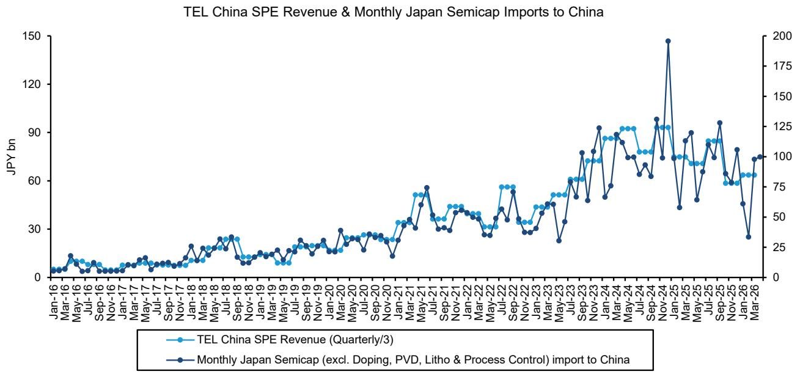

line

| Date    | TEL China SPE Revenue (Quarterly/3) | Monthly Japan Semicap (excl. Doping, PVD, Litho & Process Control) import to China |
|---------|-------------------------------------|----------------------------------------------------------------------------------|
| Jan-16  | ~5                                  | ~5                                                                               |
| Mar-16  | ~10                                 | ~10                                                                              |
| May-16  | ~15                                 | ~15                                                                              |
| Jul-16  | ~10                                 | ~10                                                                              |
| Sep-16  | ~15                                 | ~15                                                                              |
| Nov-16  | ~10                                 | ~10                                                                              |
| Jan-17  | ~15                                 | ~15                                                                              |
| Mar-17  | ~20                                 | ~20                                                                              |
| May-17  | ~25                                 | ~25                                                                              |
| Jul-17  | ~20                                 | ~20                                                                              |
| Sep-17  | ~25                                 | ~25                                                                              |
| Nov-17  | ~30                                 | ~30                                                                              |
| Jan-18  | ~35                                 | ~35                                                                              |
| Mar-18  | ~40                                 | ~40                                                                              |
| May-18  | ~45                                 | ~45                                                                              |
| Jul-18  | ~50                                 | ~50                                                                              |
| Sep-18  | ~40                                 | ~40                                                                              |
| Nov-18  | ~35                                 | ~35                                                                              |
| Jan-19  | ~30                                 | ~30                                                                              |
| Mar-19  | ~35                                 | ~35                                                                              |
| May-19  | ~40                                 | ~40                                                                              |
| Jul-19  | ~45                                 | ~45                                                                              |
| Sep-19  | ~50                                 | ~50                                                                              |
| Nov-19  | ~55                                 | ~55                                                                              |
| Jan-20  | ~60                                 | ~60                                                                              |
| Mar-20  | ~65                                 | ~65                                                                              |
| May-20  | ~70                                 | ~70                                                                              |
| Jul-20  | ~75                                 | ~75                                                                              |
| Sep-20  | ~80                                 | ~80                                                                              |
| Nov-20  | ~85                                 | ~85                                                                              |
| Jan-21  | ~90                                 | ~90                                                                              |
| Mar-21  | ~95                                 | ~95                                                                              |
| May-21  | ~100                                | ~100                                                                             |
| Jul-21  | ~95                                 | ~95                                                                              |
| Sep-21  | ~90                                 | ~90                                                                              |
| Nov-21  | ~85                                 | ~85                                                                              |
| Jan-22  | ~80                                 | ~80                                                                              |
| Mar-22  | ~75                                 | ~75                                                                              |
| May-22  | ~70                                 | ~70                                                                              |
| Jul-22  | ~65                                 | ~65                                                                              |
| Sep-22  | ~60                                 | ~60                                                                              |
| Nov-22  | ~55                                 | ~55                                                                              |
| Jan-23  | ~50                                 | ~50                                                                              |
| Mar-23  | ~45                                 | ~45                                                                              |
| May-23  | ~40                                 | ~40                                                                              |
| Jul-23  | ~35                                 | ~35                                                                              |
| Sep-23  | ~30                                 | ~30                                                                              |
| Nov-23  | ~25                                 | ~25                                                                              |
| Jan-24  | ~20                                 | ~20                                                                              |
| Mar-24  | ~15                                 | ~15                                                                              |
| May-24  | ~10                                 | ~10                                                                              |
| Jul-24  | ~5                                  | ~5                                                                               |
| Sep-24  | ~0                                  | ~0                                                                               |
| Nov-24  | ~5                                  | ~5                                                                               |
| Jan-25  | ~10                                 | ~10                                                                              |
| Mar-25  | ~15                                 | ~15                                                                              |
| May-25  | ~20                                 | ~20                                                                              |
| Jul-25  | ~25                                 | ~25                                                                              |
| Sep-25  | ~30                                 | ~30                                                                              |
| Nov-25  | ~35                                 | ~35                                                                              |
| Jan-26  | ~40                                 | ~40                                                                              |
| Mar-26  | ~45                                 | ~45                                                                              |

Source: Company disclosures, General Administration of Customs of the People's Republic of China, Bernstein analysis

EXHIBIT 28: China import yields decent correlation with TEL's China revenue.   
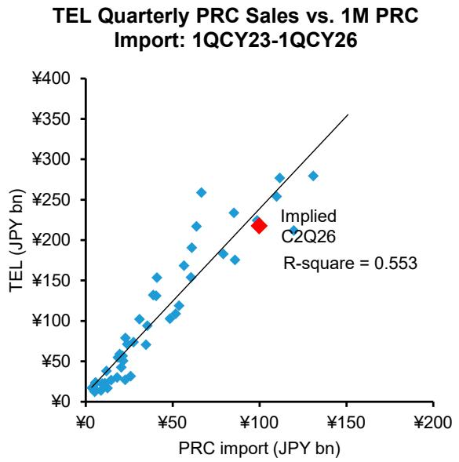

scatter

| PRC import (JPY bn) | TEL (JPY bn) |
| ------------------- | ------------ |
| 100                 | 220          |

Source: Company disclosures, General Administration of Customs of the People's Republic of China, Bernstein estimates and analysis

EXHIBIT 29: The regression suggests TEL's revenue from China to be +14% QoQ in JunQ. 

<table><tr><td rowspan="2"></td><td colspan="2">Revenue (JPY B)</td><td rowspan="2">QoQ</td></tr><tr><td>4QFY26(1QCY26)</td><td>1QFY27E(2QCY26E)</td></tr><tr><td>China SPE</td><td>191</td><td>218</td><td>14%</td></tr><tr><td>Total SPE</td><td>703</td><td></td><td></td></tr><tr><td>Bernstein</td><td></td><td>756</td><td>8%</td></tr><tr><td>Consensus</td><td></td><td>677</td><td>-4%</td></tr><tr><td>China as % of Total SPE Rev</td><td>27%</td><td></td><td></td></tr><tr><td>Bernstein</td><td></td><td>29%</td><td>2%</td></tr><tr><td>Consensus</td><td></td><td>32%</td><td>5%</td></tr></table>

Source: Company disclosures, General Administration of Customs of the People's Republic of China, Bloomberg, Bernstein estimates and analysis

EXHIBIT 30: ...with implied China exposure of 32% vs MarQ exposure of 27%   
China as % of TEL's Quarterly SPE Revenue   
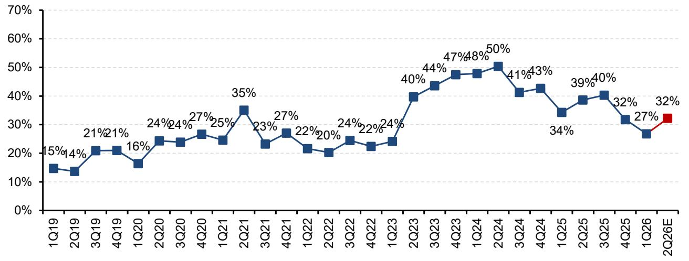

line

| Quarter | Value (%) |
|---|---|
| 1Q19 | 15 |
| 2Q19 | 14 |
| 3Q19 | 21 |
| 4Q19 | 21 |
| 1Q20 | 16 |
| 2Q20 | 24 |
| 3Q20 | 24 |
| 4Q20 | 27 |
| 1Q21 | 25 |
| 2Q21 | 35 |
| 3Q21 | 23 |
| 4Q21 | 27 |
| 1Q22 | 22 |
| 2Q22 | 20 |
| 3Q22 | 24 |
| 4Q22 | 22 |
| 1Q23 | 24 |
| 2Q23 | 40 |
| 3Q23 | 44 |
| 4Q23 | 47 |
| 1Q24 | 48 |
| 2Q24 | 50 |
| 3Q24 | 41 |
| 4Q24 | 43 |
| 1Q25 | 34 |
| 2Q25 | 39 |
| 3Q25 | 40 |
| 4Q25 | 32 |
| 1Q26 | 27 |
| 2Q26E | 32 |

Source: Company disclosures, General Administration of Customs of the People's Republic of China, Bloomberg, Bernstein estimates and analysis

# KOKUSAI

For Kokusai, the $R^{2}$ on the 1-month correlation is \~0.65 and hence should have decent predicting power. April import data suggests China revenues could be +101% QoQ. Based on consensus revenue estimates, China exposure is implied to jump back to 51% of total revenues (Exhibit 31-Exhibit 33).

EXHIBIT 31: Kokusai's Quarterly China sales shows decent correlation with monthly import.   
Kokusai Quarterly PRC Sales vs. 1M
PRC Import: 2QCY22-1QCY26   
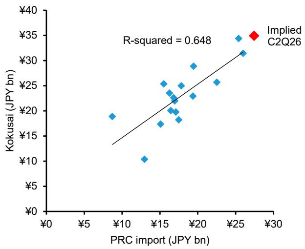

scatter

| PRC import (JPY bn) | Kokusai (JPY bn) |
| ------------------- | ---------------- |
| 12                  | 10               |
| 15                  | 18               |
| 16                  | 20               |
| 17                  | 22               |
| 18                  | 24               |
| 19                  | 26               |
| 20                  | 28               |
| 22                  | 30               |
| 25                  | 35               |

EXHIBIT 32: The regression suggests Kokusai's revenue from China to be +101% QoQ in JunQ. 

<table><tr><td rowspan="2"></td><td colspan="2">Revenue (JPY bn)</td><td rowspan="2">QoQ</td></tr><tr><td>4QFY26(1QCY26)</td><td>1QFY27E(2QCY26E)</td></tr><tr><td>PRC Sales</td><td>17</td><td>35</td><td>101%</td></tr><tr><td>Total Sales</td><td>62</td><td></td><td></td></tr><tr><td>Bernstein</td><td></td><td>74</td><td>19%</td></tr><tr><td>Consensus</td><td></td><td>68</td><td>10%</td></tr><tr><td>PRC %</td><td>28%</td><td></td><td></td></tr><tr><td>Bernstein</td><td></td><td>47%</td><td>19%</td></tr><tr><td>Consensus</td><td></td><td>51%</td><td>23%</td></tr></table>

Source: Company disclosures, Bloomberg, General Administration of Customs of the People's Republic of China, Bernstein estimates and analysis   
Source: Company disclosures, General Administration of Customs of the People's Republic of China, Bernstein estimates and analysis

EXHIBIT 33: ...with implied China exposure at 51% vs MarQ exposure of 28%   
China as % of Kokusai's Quarterly SPE Revenue   
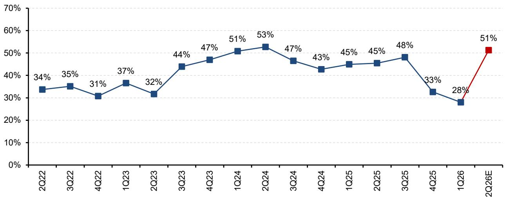

line

| Quarter | Value (%) |
|---|---|
| 2Q22 | 34 |
| 3Q22 | 35 |
| 4Q22 | 31 |
| 1Q23 | 37 |
| 2Q23 | 32 |
| 3Q23 | 44 |
| 4Q23 | 47 |
| 1Q24 | 51 |
| 2Q24 | 53 |
| 3Q24 | 47 |
| 4Q24 | 43 |
| 1Q25 | 45 |
| 2Q25 | 45 |
| 3Q25 | 48 |
| 4Q25 | 33 |
| 1Q26 | 28 |
| 2Q26E | 51 |

Source: Company disclosures, Bloomberg, General Administration of Customs of the People's Republic of China, Bernstein estimates and analysis

# SCREEN

For Screen, the $R^{2}$ of the 1-month correlation is \~0.54, indicating some predicative power. The April import data suggests that China revenues could be -73% QoQ. Based on consensus revenue estimates, implied China exposure is expected to be 12% of SPE revenues (Exhibit 34-Exhibit 36).

EXHIBIT 34: Screen's Quarterly China sales shows some correlation with monthly import.   
Screen Quarterly PRC Sales vs. 1M PRC
Import: 2QCY18-1QCY26   
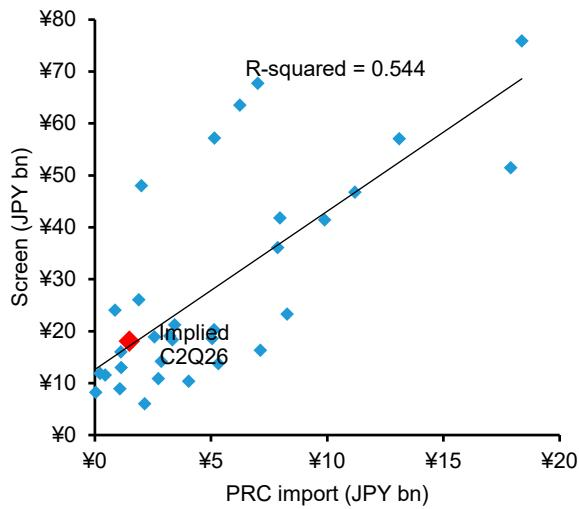

scatter

| PRC import (JPY bn) | Screen (JPY bn) |
| ------------------- | --------------- |
| 0                   | 10              |
| 5                   | 20              |
| 10                  | 30              |
| 15                  | 40              |
| 20                  | 50              |
| 25                  | 60              |
| 30                  | 70              |
| 35                  | 80              |
| 40                  | 90              |
| 45                  | 100             |
| 50                  | 110             |
| 55                  | 120             |
| 60                  | 130             |
| 65                  | 140             |
| 70                  | 150             |
| 75                  | 160             |
| 80                  | 170             |
| 85                  | 180             |
| 90                  | 190             |
| 95                  | 200             |
| 100                 | 210             |
| 105                 | 220             |
| 110                 | 230             |
| 115                 | 240             |
| 120                 | 250             |
| 125                 | 260             |
| 130                 | 270             |
| 135                 | 280             |
| 140                 | 290             |
| 145                 | 300             |
| 150                 | 310             |
| 155                 | 320             |
| 160                 | 330             |
| 165                 | 340             |
| 170                 | 350             |
| 175                 | 360             |
| 180                 | 370             |
| 185                 | 380             |
| 190                 | 390             |
| 195                 | 400             |
| 200                 | 410             |

Source: Company reports, General Administration of Customs of the People's Republic of China, Bernstein estimates and analysis

EXHIBIT 35: The regression suggests Screen's revenue from China to be -73% QoQ in JunQ. 

<table><tr><td rowspan="2"></td><td colspan="2">Revenue (JPY bn)</td><td rowspan="2">QoQ</td></tr><tr><td>4QFY26(1QCY26)</td><td>1QFY27E(2QCY26E)</td></tr><tr><td>China Sales</td><td>68</td><td>18</td><td>-73%</td></tr><tr><td>Total SPE</td><td>147</td><td></td><td></td></tr><tr><td>Bernstein</td><td></td><td>121</td><td>-18%</td></tr><tr><td>Consensus</td><td></td><td>146</td><td>-1%</td></tr><tr><td>China %</td><td>46%</td><td></td><td></td></tr><tr><td>Bernstein</td><td></td><td>15%</td><td>-31%</td></tr><tr><td>Consensus</td><td></td><td>12%</td><td>-34%</td></tr></table>

Source: Company reports, Bloomberg, General Administration of Customs of the People's Republic of China, Bernstein estimates and analysis

EXHIBIT 36: ...with overall China exposure predicted at 12% vs DecQ exposure of 46%   
China as % of Screen's Quarterly SPE Revenue   
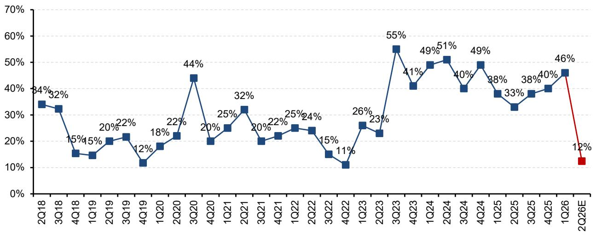

line

| Quarter | Value (%) |
|---|---|
| 2Q18 | 34 |
| 3Q18 | 32 |
| 4Q18 | 15 |
| 1Q19 | 15 |
| 2Q19 | 20 |
| 3Q19 | 22 |
| 4Q19 | 12 |
| 1Q20 | 18 |
| 2Q20 | 22 |
| 3Q20 | 44 |
| 4Q20 | 20 |
| 1Q21 | 25 |
| 2Q21 | 32 |
| 3Q21 | 20 |
| 4Q21 | 22 |
| 1Q22 | 25 |
| 2Q22 | 24 |
| 3Q22 | 15 |
| 4Q22 | 11 |
| 1Q23 | 26 |
| 2Q23 | 23 |
| 3Q23 | 55 |
| 4Q23 | 41 |
| 1Q24 | 49 |
| 2Q24 | 51 |
| 3Q24 | 40 |
| 4Q24 | 49 |
| 1Q25 | 38 |
| 2Q25 | 33 |
| 3Q25 | 38 |
| 4Q25 | 40 |
| 1Q26 | 46 |
| 2Q26E | 12 |

Source: Company disclosures, Bloomberg, General Administration of Customs of the People's Republic of China, Bernstein estimates and analysis

# Advantest

For Advantest, the $R^{2}$ on the 1-month correlation is \~0.60, indicating some predicting power. April import data suggests China revenues could be -7% QoQ. Based on consensus revenue estimates, China exposure is implied to be dropping to 12%, down from 15% in MarQ. (Exhibit 37-Exhibit 39)

EXHIBIT 37: Advantest's Quarterly China sales shows decent correlation with monthly import.   
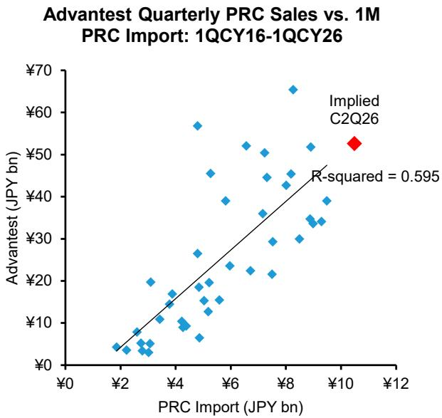

scatter

| PRC Import (JPY bn) | Advantest (JPY bn) |
| ------------------- | ------------------ |
| 10.5                | 53                 |

Source: Company reports, General Administration of Customs of the People's Republic of China, Bernstein estimates and analysis

EXHIBIT 38: Our regression suggests Advantest's China sales to be -7% QoQ in MarQ. 

<table><tr><td rowspan="2"></td><td colspan="2">Revenue (JPY bn)</td><td rowspan="2">QoQ</td></tr><tr><td>4QFY26(1QCY26)</td><td>1QFY27E(2QCY26E)</td></tr><tr><td>PRC Sales</td><td>57</td><td>53</td><td>-7%</td></tr><tr><td>Total Sales</td><td>328</td><td></td><td></td></tr><tr><td>Bernstein</td><td></td><td>346</td><td>5%</td></tr><tr><td>Consensus</td><td></td><td>346</td><td>5%</td></tr><tr><td>PRC %</td><td>17%</td><td></td><td></td></tr><tr><td>Bernstein</td><td></td><td>15%</td><td>-2%</td></tr><tr><td>Consensus</td><td></td><td>15%</td><td>-2%</td></tr></table>

Source: Company disclosures, Bloomberg, General Administration of Customs of the People's Republic of China, Bernstein estimates and analysis

EXHIBIT 39: ...with overall China exposure predicted at 17% vs SepQ exposure of 15%   
China as % of Advantest's Quarterly SPE Revenue   
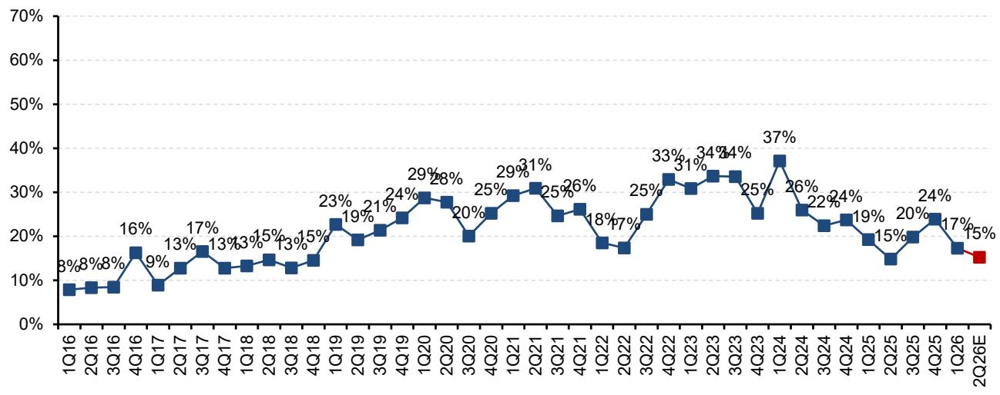

line

| Quarter | Value (%) |
|---|---|
| 1Q16 | 8 |
| 2Q16 | 8 |
| 3Q16 | 8 |
| 4Q16 | 16 |
| 1Q17 | 9 |
| 2Q17 | 13 |
| 3Q17 | 17 |
| 4Q17 | 13 |
| 1Q18 | 13 |
| 2Q18 | 15 |
| 3Q18 | 13 |
| 4Q18 | 15 |
| 1Q19 | 23 |
| 2Q19 | 19 |
| 3Q19 | 21 |
| 4Q19 | 24 |
| 1Q20 | 29 |
| 2Q20 | 28 |
| 3Q20 | 20 |
| 4Q20 | 25 |
| 1Q21 | 29 |
| 2Q21 | 31 |
| 3Q21 | 25 |
| 4Q21 | 26 |
| 1Q22 | 18 |
| 2Q22 | 17 |
| 3Q22 | 25 |
| 4Q22 | 33 |
| 1Q23 | 31 |
| 2Q23 | 34 |
| 3Q23 | 34 |
| 4Q23 | 25 |
| 1Q24 | 37 |
| 2Q24 | 26 |
| 3Q24 | 22 |
| 4Q24 | 24 |
| 1Q25 | 19 |
| 2Q25 | 15 |
| 3Q25 | 20 |
| 4Q25 | 24 |
| 1Q26 | 17 |
| 2Q26E | 15 |

Source: Company disclosures, Bloomberg, General Administration of Customs of the People's Republic of China, Bernstein estimates and analysis

# APPENDIX: DATA SOURCE AND ANALYSIS METHODOLOGY

We collected the data from the China Customs statistics website (link), with two major filters:

# Equipment types, including 11 codes:

- 84862010: RTP and Oxidation/Diffusion (制半导体器件或IC的氧化扩散等热处理设备)  
- 84862021: Deposition - CVD (制造半导体器件或IC的化学气相沉积装置)  
- 84862022: Deposition - PVD (制造半导体器件或IC的物理气相沉积装置)  
- 84862029: Deposition - Others (其他制半导体件或集成电路用薄膜沉积设备)  
- 84862031: Lithography - Stepper (制半导体器件或集成电路用的分步重复光刻机), which include the following examples:

- Steppers (for back-end use), 制造半导体器件或集成电路用分布重复光刻机（后道用）  
- Front-end krypton fluoride (KrF) stepper 制造半导体器件或集成电路用分布重复光刻机（前道用氟化氮（KrF）光刻机）  
- Front-end i-line stepper 制造半导体器件或集成电路用分布重复光刻机（前道用 I 线光刻机）  
- Other steppers 其他制造半导体器件或集成电路用分布重复光刻机

\- 84862039: Lithography (excl. stepper) (其他投影绘制电路图的制半导体件或IC的装置), which include the following examples:

- ArF lithography (excl. stepper) 制造半导体器件或集成电路用的氟化氩（ArF）光刻机（步进式除外）  
- KrF lithography (excl. stepper) 制造半导体器件或集成电路用的氟化氪（KrF）光刻机（步进式除外）  
- EUV (excl. stepper) 制造半导体器件或集成电路用的极紫外（EUV）光刻机（步进式除外）  
- ArFi lithography (excl. stepper) 制造半导体器件或集成电路用的氟化氩浸没式（ArFi）光刻机（步进式除外）  
- Other lithography 未列名制造半导体器件或集成电路用的光刻设备  
- I-line lithography (excl. stepper) 制造半导体器件或集成电路用的 I 线光刻机（步进式除外）

- 84862041: Dry Etch (制造半导体器件或IC的等离子体干法刻蚀机)   
- 84862049: Material Removal and Cleaning (excl. Dry Etch) (制造半导体器件或IC的其他刻蚀及剥离设备)   
- 84862050: Doping (制造半导体器件或集成电路用的离子注入机)   
- 84862090: Other equipment used in semiconductor devices or integrated circuits manufacturing (其他制半导体器件或集成电路用的机器及装置)   
- 90314100: Process Control - Optical (full name: Optical instruments and apparatus for testing semiconductor wafers and devices (including integrated circuits) or testing photomasks and gratings when manufacturing semiconductor devices (including integrated circuits) 制造半导体器件（包括集成电路）时检测半导体晶圆、器件（包括集成电路）或检测光掩膜、光栅用的光学仪器及器具)   
- Note that the definition of each equipment type can't be strictly mapped to Gartner's categorization; for example, we believe CMP is classified into others in this dataset, while it's a separate category in Gartner's definition.

- Material removal & cleaning category here excludes dry etch equipment (even though dry etch equipment is a type of material removal equipment categorized by Gartner).   
- Process Control equipment mainly includes two types: electronic beam and optical; the category 90314100 here only includes optical equipment.

# Trading Partners by region, including 10 codes:

• 309: Netherland   
• 502: United States   
• 116: Japan

• 133: Korea

• 143: China Taiwan

• 132: Singapore

• 304: Germany

• 115: Israel

• 315: Austria

• 122: Malaysia

\- LRCX has manufacturing sites in Austria, Korea, Malaysia, China Taiwan, and United States (refer to https://www.lamresearch.com/company/locations).

\- AMAT has volume manufacturing facilities in the United States, and Singapore, with additional manufacturing facilities in Germany, Israel, Italy, Korea, China Taiwan and the United States (refer to https://www.appliedmaterials.com/us/en/about/manufacturing.html).

# I. REQUIRED DISCLOSURES

References to "Bernstein" or the "Firm" in these disclosures relate to the following entities: Bernstein Institutional Services LLC (April 1, 2024 onwards), Bernstein & Co., LLC (pre April 1, 2024), Bernstein Autonomous LLP, BSG France S.A. (April 1, 2024 onwards), Bernstein (Hong Kong) Limited 盛博香港有限公司, Bernstein (Canada) Limited, Bernstein (India) Private Limited (SEBI registration no. INH000006378), Bernstein (Singapore) Private Limited, Bernstein Japan KK (サンフォード・C・バーンスタイン株式会社) and analysts employed by SG Africa Technologies & Services to produce Bernstein under a Global Services Agreement in place between Bernstein and SG.

Bernstein is part of a joint venture between SG (SG) and AllianceBernstein, L.P. (AB). Unless specifically noted otherwise, for purposes of these disclosures, references to Bernstein's “affiliates” relate to both SG and AB and their respective affiliates.

# VALUATION METHODOLOGY

This research publication covers six or more companies. For valuation methodology and other company disclosures:

Please visit: https://bernstein-autonomous.bluematrix.com/sellside/Disclosures.action.

Or, you can also write to the Director of Compliance, Bernstein Institutional Services LLC, 245 Park Avenue, New York, NY 10167.

# RISKS

This research publication covers six or more companies. For risks and other company disclosures:

Please visit: https://bernstein-autonomous.bluematrix.com/sellside/Disclosures.action.

Or, you can also write to the Director of Compliance, Bernstein Institutional Services LLC, 245 Park Avenue, New York, NY 10167.

# RATINGS DEFINITIONS, BENCHMARKS AND DISTRIBUTION

# EQUITY RATINGS DEFINITIONS

# Bernstein brand

The Bernstein brand rates stocks based on forecasts of relative performance for the next 12 months versus the S&P 500 for stocks listed on the U.S. and Canadian exchanges, versus the Bloomberg Europe Developed Markets Large and Mid Cap Price Return Index EUR (EDME) for stocks listed on the European exchanges and emerging markets exchanges outside of the Asia Pacific region, versus the Bloomberg Japan Large and Mid Cap Price Return Index USD (JPL) for stocks listed on the Japanese exchanges, and versus the Bloomberg Asia ex-Japan Large and Mid Cap Price Return Index (ASIAX) for stocks listed on the Asian (ex-Japan) exchanges -unless otherwise specified.

The Bernstein brand has three categories of ratings:

- Outperform: Stock will outpace the market index by more than 15 pp   
• Market-Perform: Stock will perform in line with the market index to within +/-15 pp   
• Underperform: Stock will trail the performance of the market index by more than 15 pp

Coverage Suspended: Coverage of a company under the Bernstein brand has been suspended. Ratings and price targets are suspended temporarily, are no longer current, and should therefore not be relied upon.

Not Rated: A rating assigned when the stock cannot be accurately valued, or the performance of the company accurately predicted, at the present time. The covering analyst may continue to publish research reports on the company to update investors on events and developments.

Not Covered (NC) denotes companies that are not under coverage.

Bernstein brand stock ratings are based on a 12-month time horizon.

# Autonomous brand – common stocks

The Autonomous brand rates common stocks as indicated below. As our benchmarks we use the Bloomberg Europe 500 Banks And Financial Services Index (BEBANKS) and Bloomberg Europe Dev Mkt Financials Large and Mid Cap Price Ret Index EUR (EDMFI) index for developed European banks and Payments, the Bloomberg Europe 500 Insurance Index (BEINSUR) for European insurers, the S&P 500 and S&P Financials for US banks and Payments coverage, S5LIFE for US Insurance, the S&P Insurance Select Industry (SPSIINS) for US Non-Life Insurers coverage, and the Bloomberg Emerging Markets Financials Large, Mid and Small Cap Price Return Index (EMLSF) for emerging market banks and insurers and Payments. Ratings are stated relative to the sector (not the market).

The Autonomous brand has three categories of common stock ratings:

- Outperform (OP): Stock will outpace the relevant index by more than 10 pp   
- Neutral (N): Stock will perform in line with the market index to within +/-10 pp   
• Underperform (UP): Stock will trail the performance of the relevant index by more than 10 pp

Coverage Suspended: Coverage of a company under the Autonomous research brand has been suspended. Ratings and price targets are suspended temporarily, are no longer current, and should therefore not be relied upon.

Not Rated: A rating assigned when the stock cannot be accurately valued, or the performance of the company accurately predicted, at the present time. The covering analyst may continue to publish research reports on the company to update investors on events and developments.

Those denoted as ‘Feature’ (e.g., Feature Outperform FOP, Feature Under Outperform FUP) are our core ideas.

Not Covered (NC) denotes companies that are not under coverage.

Autonomous brand common stock ratings are based on a 12-month time horizon.

# Autonomous brand – preferred stocks

The Autonomous brand has three categories of preferred stock ratings:

- Outperform (OP): The total return of the preferred instrument is expected to outperform preferred securities of other issuers operating in similar sectors or rating categories over the next six months.   
- Neutral (N): The total return of the preferred instrument is expected to perform in line with preferred securities of other issuers operating in similar sectors or rating categories over the next six months.   
- Underperform (UP): The total return of the preferred instrument is expected to underperform preferred securities of other issuers operating in similar sectors or rating categories over the next six months.

Autonomous preferred stock ratings are based on a 6-month time horizon.

# AUTONOMOUS CREDIT RESEARCH

Where this report contains investment recommendations for credit instruments, as defined in article 3(1)(35) of the Market Abuse Regulation, the information below is presented to comply with its disclosure requirements.

The report may also include reference(s) to published opinions by other Autonomous or Bernstein analysts covering the equity securities of the issuer(s) referenced herein. Please note an investment recommendation for credit instruments published by the author(s) of this report may differ from the published view of the analyst covering equity securities for the issuer(s) contained in this report and vice versa.

# CREDIT RATINGS DEFINITIONS

The Autonomous brand has three categories of credit ratings:

\- Credit Outperform (C-OP): The total return of the Reference Credit Instrument is expected to outperform the credit spread of bonds of other issuers operating in similar sectors or rating categories over the next six months.

- Credit Neutral (C-N): The total return of the Reference Credit Instrument is expected to perform in line with the credit spread of bonds of other issuers operating in similar sectors or rating categories over the next six months.   
- Credit Underperform (C-UP): The total return of the Reference Credit Instrument is expected to underperform the credit spread of bonds of other issuers operating in similar sectors or rating categories over the next six months.

Autonomous credit ratings are based on a 6-month time horizon.

A list of all investment recommendations produced by the author(s) of this report alongside credit ratings history are available upon request.

It is at the sole discretion of the Firm as to when to initiate, update and cease research coverage. The Firm has established, maintains and relies on information barriers to control the flow of information contained in one or more areas (i.e. the private side) within the Firm, and into other areas, units, groups or affiliates (i.e. public side) of the Firm

DISTRIBUTION OF EQUITY RATINGS/INVESTMENT BANKING SERVICES 

<table><tr><td>Equity Rating</td><td>Market Abuse Regulation (MAR) and FINRA Rating Category</td><td>Global Rating Distribution</td><td>Investment Banking Relationships*</td></tr><tr><td>Outperform</td><td>BUY</td><td>51.1%</td><td>16.5%</td></tr><tr><td>Market-Perform (Bernstein Brand) Neutral (Autonomous Brand)</td><td>HOLD</td><td>36.3%</td><td>17.8%</td></tr><tr><td>Underperform</td><td>SELL</td><td>12.6%</td><td>14.9%</td></tr></table>

\* These figures represent the percentage of companies within each equity rating category for which affiliates of Bernstein have provided investment banking services within the previous 12 months.

As of March 31, 2026. All figures are updated quarterly.

Prior to April 1, 2024, Bernstein & Co., LLC. issued the ratings and price target information in the graph(s) below for the following companies: Applied Materials Inc and Lam Research Corp.

# PRICE CHARTS/ RATINGS AND PRICE TARGET HISTORY

This research publication covers six or more companies. For price chart and other company disclosures, please visit https://bernstein-autonomous.bluematrix.com/sellside/Disclosures.action or you can write to the Director of Compliance, Bernstein Institutional Services LLC, 245 Park Avenue, New York, NY 10167.

# CONFLICTS OF INTEREST

All statements in this report attributable to Gartner represent Bernstein's interpretation of data, research opinion or viewpoints published as part of a syndicated subscription service by Gartner, Inc., and have not been reviewed by Gartner. Each Gartner publication speaks as of its original publication date (and not as of the date of this report). The opinions expressed in Gartner publications are not representations of fact, and are subject to change without notice.

Stacy A. Rasgon maintains long positions in various crypto currencies.

SG and/or its affiliates beneficially own 1% or more of a class of common equity securities of the following company: Kokusai Electric Corp.

Bernstein Autonomous LLP or BSG France SA, beneficially, has either a net long or short position of 0.5% or more of the total issued share capital of a class of common equity securities of the following MiFID eligible securities: Applied Materials Inc.

Bernstein and/or affiliates have received compensation for non-investment banking securities-related products or services in the previous twelve months from the following clients: Screen Holdings Co Ltd.

Certain affiliates of Bernstein act as market maker or liquidity provider in the debt securities of: Screen Holdings Co Ltd.

Certain affiliates of Bernstein act as market maker or liquidity provider in the equities securities of: Applied Materials Inc, Lam Research Corp and ASML Holding NV.

# OTHER MATTERS

The legal entity(ies) employing the analyst(s) listed in this report, and their location, can be determined by the country code of their phone number, as follows:

+1 Bernstein Institutional Services LLC; New York, New York, USA

+44 Bernstein Autonomous LLP; London UK

+212 SG Africa Technologies & Services; Casablanca, Morocco

+33 BSG France S.A.; Paris, France

+34 BSG France S.A.; Madrid, Spain

+41 Bernstein Autonomous LLP; Geneva, Switzerland

+49 BSG France S.A.; Frankfurt, Germany

+91 Bernstein (India) Private Limited; Mumbai, India

+852 Bernstein (Hong Kong) Limited 盛博香港有限公司; Hong Kong, China

+65 Bernstein (Singapore) Private Limited; Singapore

+81 Bernstein Japan KK; Tokyo, Japan

Where this report has been prepared by research analyst(s) employed by a non-US affiliate, such analyst(s), is/are (unless otherwise expressly noted below) not registered as associated persons of Bernstein Institutional Services LLC or any other SEC-registered broker-dealer and are not licensed or qualified as research analysts with FINRA. Accordingly, such analyst(s) may not be subject to FINRA's restrictions regarding (among other things) communications by research analysts with a subject company, interactions between research analysts and investment banking personnel, participation by research analysts in solicitation and marketing activities relating to investment banking transactions, public appearances by research analysts, and trading securities held by a research analyst account.

Where this report has been prepared by research analyst(s) employed by SG Africa Technologies & Services (part of the SG group of companies), it has been prepared on behalf of a Bernstein company under a Global Services Agreement in place between Bernstein and SG.

# CERTIFICATION

Each research analyst listed in this report, who is primarily responsible for the preparation of the content of this report, certifies that all of the views expressed in this publication accurately reflect that analyst's personal views about any and all of the subject securities or issuers and that no part of that analyst's compensation was, is, or will be, directly or indirectly, related to the specific recommendations or views in this publication.

# II. ADDITIONAL GLOBAL CONFLICT DISCLOSURES

It is at the sole discretion of the Firm as to when to initiate, update and cease research coverage. The Firm has established, maintains and relies on information barriers to control the flow of information contained in one or more areas (i.e., the private side) within the Firm, and into other areas, units, groups or affiliates (i.e., public side) of the Firm.

# III. OTHER IMPORTANT INFORMATION AND DISCLOSURES

Separate branding is maintained for “Bernstein” and “Autonomous” research products.

\- Bernstein produces a number of different types of research products including, among others, fundamental analysis and quantitative analysis under both the “Autonomous” and “Bernstein” brands. Recommendations contained within one type of research product may differ from recommendations contained within other types of research products, whether as a result of differing time horizons, methodologies or otherwise. Furthermore, views or recommendations within a research product issued under one brand may differ from views or recommendations under the same type of research product issued under the other brand. The Research Ratings System for the two brands and other information related to those Rating Systems are included in the previous section.

\- Autonomous operates as a separate business unit within the following entities: Bernstein Institutional Services LLC, Bernstein Autonomous LLP, Bernstein (Hong Kong) Limited 盛博香港有限公司 and Bernstein (India) Private Limited. For information relating to “Autonomous” branded products (including certain Sales materials) please visit: www.autonomous.com. For information relating to Bernstein branded products please visit: www.bernsteinresearch.com.

Analysts are compensated based on aggregate contributions to the research franchise as measured by account penetration, productivity and proactivity of investment ideas. No analysts are compensated based on performance in, or contributions to, generating investment banking revenues.

This report has been produced by an independent analyst as defined in Article 3 (1)(34)(i) of EU 596/2014 Market Abuse Regulation (“MAR”) and the same article of MAR as it forms part of United Kingdom domestic law by virtue of the European Union (Withdrawal) Act 2018.

To our readers in the United States: Bernstein Institutional Services LLC, a broker-dealer registered with the U.S. Securities and Exchange Commission (“SEC”) and a member of the U.S. Financial Industry Regulatory Authority, Inc. (“FINRA”) is distributing this publication in the United States and accepts responsibility for its contents. Where this material contains an analysis of debt product(s), such material is intended only for institutional investors and is not subject to the US independence and disclosure standards applicable to debt research prepared for retail investors.

Bernstein Institutional Services LLC may act as principal for its own account or as agent for another person (including an affiliate) in sales or purchases of any security which is a subject of this report. This report does not purport to meet the objectives or needs of any specific individuals, entities or accounts.

To our readers in Canada: If this publication pertains to a Canadian domiciled company, it is being distributed in Canada by Bernstein (Canada) Limited, which is licensed and regulated by the Canadian Investment Regulatory Organization. If the publication pertains to a non-Canadian domiciled company, it is being distributed by Bernstein Institutional Services LLC, which is licensed and regulated by both the SEC and FINRA, into Canada under the International Dealers Exemption.

This document may not be passed onto any person in Canada unless that person qualifies as "permitted client" as defined in Section 1.1 of NI 31-103.

To our readers in Brazil: This report has been prepared by Bernstein Institutional Services LLC, and Banco BTG Pactual S.A. ("BTG") is responsible for the distribution of this report in Brazil.

To readers in the United Kingdom: This publication has been issued or approved for issue in the United Kingdom by Bernstein Autonomous LLP, authorised and regulated by the Financial Conduct Authority and located at 60 London Wall, London EC2M 5SH, +44 (0)20-7170-5000. Registered in England & Wales No OC343985.

This document is for distribution only to persons who (i) have professional experience in matters relating to investments falling within Article 19(5) of the Financial Services and Markets Act 2000 (Financial Promotion) Order 2005 (as amended, the “Financial Promotion Order”), (ii) are persons falling within Article 49(2)(a) to (d) (“high net worth companies, unincorporated associations, etc.”) of the Financial Promotion Order, (iii) are outside the United Kingdom, or (iv) are persons to whom an invitation or inducement to engage in investment activity (within the meaning of section 21 of the FSMA) in connection with the issue or sale of any securities may otherwise lawfully be communicated or caused to be communicated (all such persons together being referred to as “relevant persons”). This document is directed only at relevant persons and must not be acted on or relied on by persons who are not relevant persons. Any investment or investment activity to which this document relates is available only to relevant persons and will be engaged in only with relevant persons.

To our readers in the member states of the EEA: This publication is being distributed by BSG France SA, which is authorised and regulated by the Autorité de Contrôle Prudentiel et de Résolution (ACPR) and Autorité des Marchés Financiers (AMF).

To our readers in Hong Kong: This publication is being distributed in Hong Kong by Bernstein (Hong Kong) Limited 盛博香港有限公司, which is licensed and regulated by the Hong Kong Securities and Futures Commission (Central Entity No. AXC846) to carry out Type 4 (Advising on Securities) regulated activities and subject to the licensing conditions mentioned in the SFC Public Register (https://www.sfc.hk/publicregWeb/corp/AXC846/details)). This publication is solely for professional investors, as defined in the Securities and Futures Ordinance (Cap. 571). The purpose of this report is solely to provide an analysis of the issuers referred to in this report and is not intended for any purpose contrary to the laws of Hong Kong.

To our readers in Singapore: This publication is being distributed in Singapore by Bernstein (Singapore) Private Limited, only to accredited investors or institutional investors, as defined in the Securities and Futures Act 2001 of Singapore ("SFA"). Recipients in Singapore should contact Bernstein (Singapore) Private Limited in respect of matters arising from, or in connection with, this publication. Bernstein (Singapore) Private Limited is regulated by the Monetary Authority of Singapore and licensed under the SFA as a capital markets services licence holder for dealing in capital markets products that are securities and collective investment schemes and an exempt financial adviser for advising on, issuing and promulgating analyses and reports on securities. Bernstein (Singapore) Private Limited is registered in Singapore with Company Registration No. 20213710W and located at One Raffles Quay, #27-11 South Tower, Singapore 048583, +65-6230-4612.

To our readers in the People's Republic of China: The securities referred to in this document are not being offered or sold and may not be offered or sold, directly or indirectly, in the People's Republic of China (for such purposes, not including the Hong Kong and Macau Special Administrative Regions or Taiwan, the "PRC") in contravention of any applicable laws of the PRC.

This document does not constitute an offer to sell or the solicitation of an offer to buy any securities in the PRC to any person to whom it is unlawful to make the offer or solicitation in the PRC.

We do not represent that this document may be lawfully distributed, or that any securities may be lawfully offered, in compliance with any applicable registration or other requirements in the PRC, or pursuant to an exemption available thereunder, or assume any responsibility for facilitating any such distribution or offering. In particular, no action has been taken by us which would permit a public offering of any securities or distribution of this document in the PRC. Accordingly, the securities are not being offered or sold within the PRC by means of this document or any other document. Neither this document nor any advertisement or other offering material may be distributed or published in the PRC, except under circumstances that will result in compliance with any applicable laws and regulations.

To our readers in Japan: This publication is being distributed in Japan by Bernstein Japan KK (サンフォード・C・バーンスタイン株式会社), which is registered in Japan as a Financial Instruments Business Operator with the Kanto Local Finance Bureau (registration number: The Director-General of Kanto Local Finance Bureau (FIBO) No.3387) and regulated by the Financial Services Agency. It is also a member of Japan Investment Advisers Association. This publication is solely for qualified institutional investors in Japan only, as defined in Article 2, paragraph (3), items (i) of the Financial Instruments and Exchange Act.

For the institutional client readers in Japan who have been granted access to the Bernstein website by Daiwa Group Inc. ("Daiwa"), your access to this document should not be construed as meaning that Bernstein is providing you with investment advice for any purposes. Whilst Bernstein has prepared this document, your relationship is, and will remain with, Daiwa, and Bernstein has neither any contractual relationship with you nor any obligations towards you.

To our readers in Australia: Bernstein (Hong Kong) Limited 盛博香港有限公司 is responsible for distributing research in Australia. It is regulated by the Securities and Exchange Commission under U.S. laws, by the Financial Conduct Authority under U.K. laws, which differs from Australian laws. Bernstein (Hong Kong) Limited 盛博香港有限公司 is exempt from the requirement to hold an Australian financial services license under the Corporations Act 2001 in respect of the provision of the following financial services to wholesale clients:

• providing financial product advice;   
• dealing in a financial product;   
- making a market for a financial product; and   
• providing a custodial or depository service.

To our readers in India: This publication is being distributed in India by Bernstein (India) Private Limited (SCB India) which is licensed and regulated by Securities and Exchange Board of India ("SEBI") as a research analyst entity under the SEBI (Research Analyst) Regulations, 2014, having registration no. INH000006378 and as a stock broker having registration no. INZ000213537. SCB India is currently engaged in the business of providing research and stock broking services. Please refer to www.bernsteinresearch.in for more information.

\- SCB India is a Private limited company incorporated under the Companies Act, 2013, on April 12, 2017 bearing corporate identification number U65999MH2017FTC293762, and registered office at Level 3A, 4th Floor, First International Financial Centre, Plot Nos C-54 and C-55, G Block, Near CBI Office, Bandra Kurla Complex, Bandra (East), Mumbai 400098, Maharashtra, India (Phone No: +91-22-68421401).

- For details of Associates (i.e., affiliates/group companies) of SCB India, kindly email MUM-BERNSTEIN-InCompliance@bernsteinsg.com.   
• SCB India does not have any disciplinary history as on the date of this report.   
- Except as noted above, SCB India and/or its Associates (i.e., affiliates/group companies), the Research Analysts authoring this report, and their relatives

• do not have any financial interest in the subject company   
• do not have actual/beneficial ownership of one percent or more in securities of the subject company;   
- is not engaged in any investment banking activities for Indian companies, as such;   
• have not managed or co-managed a public offering in the past twelve months for any Indian companies;

\- have not received any compensation for investment banking services or merchant banking services from the subject company in the past 12 months;

• have not received compensation for brokerage services from the subject company in the past twelve months;

\- have not received any compensation or other benefits from the subject company or third party related to the specific recommendations or views in this report; and

\- do not currently, but may in the future, act as a market maker in the financial instruments of the companies covered in the report.

\- do not have any conflict of interest in the subject company as of the date of this report.

- Except as noted above, the subject company has not been a client of SCB India during twelve months preceding the date of distribution of this research report. Neither SCB India nor its Associates (i.e., affiliates/group companies) have received compensation for products or services other than investment banking, merchant banking or brokerage services from the subject company in the past twelve months.   
- The principal research analyst(s) who prepared this report, members of the analysts' team, and members of their households are not an officer, director, employee or advisory board member of the companies covered in the report.   
- Our Compliance officer / Grievance officer is Ms. Rupal Talati, who can be reached at +91-22-68421451, or MUM-BERNSTEIN-InCompliance@bernsteinsg.com / Scbin-investorgrievance@bernsteinsg.com   
- The Research investor charter and Terms & Conditions of SCB India are available on its website and may be accessed at Bernstein (India) Private Limited (https://bernsteinresearch.in/) for your reference.   
- Disclaimer: Registration granted by SEBI, and certification from NISM, is in no way a guarantee of performance of the intermediary or provide any assurance of returns to investors. Investments in securities market are subject to market risks. Read all the related documents carefully before investing.

To our readers in Switzerland: This document is provided in Switzerland by or through Bernstein Autonomous LLP, and is provided only to qualified investors as defined in article 10 of the Swiss Collective Investment Scheme Act (“CISA”) and related provisions of the Collective Investment Scheme Ordinance and in strict compliance with applicable Swiss law and regulations. The products mentioned in this document may not be suitable for all types of investors. This document is based on the Directives on the Independence of Financial Research issued by the Swiss Bankers Association (SBA) in January 2008.

To our readers in the Middle East: Bernstein Autonomous LLP, DIFC branch has its principal office at Gate Village 06, DIFC, Dubai, UAE. Bernstein Autonomous LLP, DIFC branch is regulated by the Dubai Financial Services Authority (DFSA) with the registration number CL10040 and is provisioned for Arranging Deals in Investments and Advising on Financial Products. All communications and services are directed at Professional Clients and Market Counterparties only (as defined in the DFSA rulebook). Persons other than Professional Clients and Market Counterparties, such as Retail Clients, are not the intended recipients of our communications or services.

# LEGAL

All research publications are disseminated to our clients through posting on the firm's password protected websites, bernsteinresearch.com and autonomous.com. Certain, but not all, research publications are also made available to clients through third-party vendors or redistributed to clients through alternate electronic means as a convenience.

This publication has been published and distributed in accordance with the Firm's policy for management of conflicts of interest in investment research, a copy of which is available from Bernstein Institutional Services LLC, Director of Compliance, 245 Park Avenue, New York, NY 10167. Additional disclosures and information regarding Bernstein's business are available on our website www.bernsteinresearch.com.

The securities described herein may not be eligible for sale in all jurisdictions or to certain categories of investors where that permission profile is not consistent with the licenses held by the entities noted herein. This document is for distribution only as may be permitted by law. This publication is not directed to, or intended for distribution to or use by, any person or entity who is a citizen or resident of, or located in any locality, state, country or other jurisdiction where such distribution, publication, availability or use would be contrary to law or regulation or which would subject any of the entities referenced herein or any of their subsidiaries or affiliates to any registration or licensing requirement within such jurisdiction. This publication is based upon public sources we believe to be reliable, but no representation is made by us that the publication is accurate or complete. We do not undertake to advise you of any change in the reported information or in the opinions herein. This publication was prepared and issued by entity referred to herein for distribution to eligible counterparties or professional clients. This publication is not an offer to buy or sell any security, and it does not constitute investment, legal or tax advice. The investments referred to herein may not be suitable for you. Investors must make their own investment decisions in consultation with their professional advisors in light of their specific circumstances. The value of investments may fluctuate, and investments that are denominated in foreign currencies may fluctuate in value as a result of exposure to exchange rate movements. Information about past performance of an investment is not necessarily a guide to, indicator of, or assurance of, future performance.

This report is directed to and intended only for our clients who are “eligible counterparties”, “professional clients”, “institutional investors” and/or “professional investors” as defined by the aforementioned regulators, and must not be redistributed to retail clients as defined by the aforementioned regulators. Retail clients who receive this report should note that the services of the entities noted herein are not available to them and should not rely on the material herein to make an investment decision. The result of such act will not hold the entities noted herein liable for any loss thus incurred as the entities noted herein are not registered/authorised/licensed to deal with retail clients and will not enter into any contractual agreement/arrangement with retail clients. This report is provided subject to the terms and conditions of any agreement that the clients may have entered into with the entities noted herein. All research reports are disseminated on a simultaneous basis to eligible clients through electronic publication to our client portal.

The information in this report was prepared by Bernstein solely for the internal business use of our clients. Clients may store, display, analyze, reformat and print the information in this report for this limited use only. Clients may not copy, alter, create derivative works, resell, reverse engineer, commercially exploit, share or distribute any part of the information contained herein for any purpose without Bernstein's express written consent. These restrictions include extracting data or using the content to develop indices or other products. Further, you may not use this report, or any portion of this report, to train or finetune any third-party machine learning or artificial intelligence system, or as a prompt or input into any such system. You also may not, without Bernstein's express written consent, do any of the foregoing in connection with your own internal machine learning or artificial intelligence system.

Bernstein may use artificial intelligence tools in the preparation of its materials. Any such materials are reviewed by Bernstein's research analysts prior to publication.

This report has been prepared for information purposes only and is based on current public information that we consider reliable, but the entities noted herein do not warrant or represent (express or implied) as to the sources of information or data contained herein are accurate, complete, not misleading or as to its fitness for the purpose intended even though the entities noted herein rely on reputable or trustworthy data providers, it should not be relied upon as such. Opinions expressed are the author(s)' current opinions as of the date appearing on the material only and we do not undertake to advise you of any change in the reported information or in the opinions herein.

This publication was prepared and issued by the entity referred to herein for distribution to eligible counterparties or professional clients. The information in this report is intended for general circulation and does not constitute an offer to buy or sell any security, investment, legal or tax advice nor a personal recommendation, as defined by any of the aforementioned regulators. It does not take into account the particular investment objectives, financial situations, or needs of individual investors. The report has not been reviewed by any of the aforementioned regulators and does not represent any official recommendation from the aforementioned regulators. The investments referred to herein may not be suitable for you. Investors must make their own investment decisions in consultation with advice sought from a financial adviser regarding the suitability of the investment product, taking into account the specific investment objectives, financial situation or particular needs of any recipient of the recommendation, before the recipient

makes a commitment to purchase the investment product.

The analysis contained herein is based on numerous assumptions. Different assumptions could result in materially different results. The information in this report does not constitute, or form part of, any offer to sell or issue, or any offer to purchase or subscribe for shares, or to induce engage in any other investment activity. The value of any securities or financial instruments mentioned in this report may fluctuate subject to market conditions. Information about past performance of an investment is not necessarily a guide to, indicative of, or assurance of future performance. Estimates of future performance mentioned by the research analyst in this report are based on assumptions that may not be realized due to unforeseen factors like market volatility/fluctuation. In relation to securities or financial instruments denominated in a foreign currency other than the clients' home currency, movements in exchange rates will have an effect on the value, either favorable or unfavorable. Before acting on any recommendations in this report, recipients should consider the appropriateness of investing in the subject securities or financial instruments mentioned in this report and, if necessary, seek for independent professional advice.

The securities described herein may not be eligible for sale in all jurisdictions or to certain categories of investors where that permission profile is not consistent with the licenses held by the entities noted herein. This document is for distribution only as may be permitted by law. It is not directed to, or intended for distribution to or use by, any person or entity who is a citizen or resident of or located in any locality, state, country or other jurisdiction where such distribution, publication, availability or use would be contrary to law or regulation or would subject the entities noted herein to any regulation or licensing requirement within such jurisdiction.

Source: Bloomberg Index Services Limited. BLOOMBERG® is a trademark and service mark of Bloomberg Finance L.P. and its affiliates (collectively “Bloomberg”). Bloomberg or Bloomberg’s licensors own all proprietary rights in the Bloomberg Indices. Neither Bloomberg nor Bloomberg’s licensors approves or endorses this material, or guarantees the accuracy or completeness of any information herein, or makes any warranty, express or implied, as to the results to be obtained therefrom and, to the maximum extent allowed by law, neither shall have any liability or responsibility for injury or damages arising in connection therewith.

No part of this material may be reproduced, distributed or transmitted or otherwise made available without prior consent of the entities noted herein. Copyright Bernstein Institutional Services LLC Bernstein Autonomous LLP, BSG France S.A., Bernstein (Hong Kong) Limited 盛博香港有限公司, Bernstein (Canada) Limited, Bernstein (India) Private Limited (SEBI registration no. INH000006378), Bernstein (Singapore) Private Limited and Bernstein Japan KK (サンフォード・C・バーンスタイン株式会社). All rights reserved. The trademarks and service marks contained herein are the property of their respective owners. Any unauthorized use or disclosure is strictly prohibited. The entities noted herein may pursue legal action if the unauthorized use results in any defamation and/or reputational risk to the entities noted herein and research published under the Bernstein and Autonomous brands.