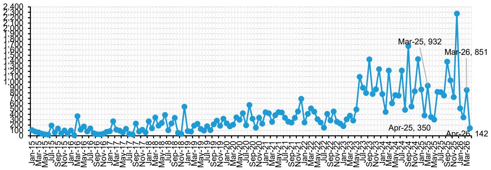
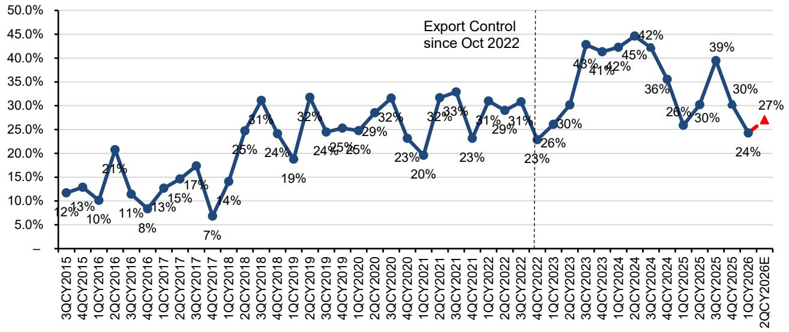
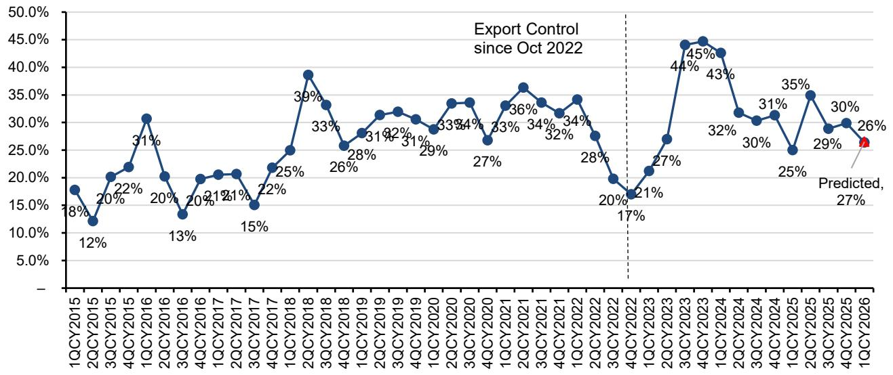

# China’s WFE Import Data Reveals a Supply-Constrained, Not Demand-Weakened, Market

The April 2026 Chinese wafer fabrication equipment import data tells a story that is far more nuanced than the headline 12% month-over-month decline suggests. At USD 2.7 billion, total imports fell below the 2025 monthly average of USD 3.2 billion, and year-to-date imports of USD 10 billion represent a 13% decline year-over-year. For an investor watching the global semiconductor equipment cycle, these numbers might trigger alarm. They should not. The weakness is almost entirely attributable to a single equipment category—lithography—where imports plunged 60% year-over-year to just USD 142 million, the lowest monthly figure since July 2022. This is not a demand problem. It is a supply constraint problem, and the distinction carries profound implications for how investors should position across the semiconductor capital equipment value chain.

The argument that China’s wafer fabrication equipment demand remains structurally intact is supported by the performance of non-lithography equipment. Excluding lithography, April imports actually rose 5% year-over-year, with deposition equipment surging 36% and process control optical equipment increasing 18%. This bifurcation between constrained lithography and growing non-lithography segments is the central analytical challenge of the current market. Investors who conflate the aggregate import decline with weakening Chinese semiconductor investment risk missing the real dynamics: China continues to build out capacity aggressively, but it is being forced to do so without the full complement of advanced lithography tools it would prefer.

The timing of this supply constraint is critical. China has been the largest single market for semiconductor equipment globally, accounting for over 40% of total industry shipments in 2024 and 2025. Any disruption to this demand sink has outsized consequences for the global equipment cycle. Yet the April data suggests that the disruption is not coming from Chinese buyers reducing orders; it is coming from suppliers unable to deliver. The Netherlands, the primary source of advanced lithography systems, saw exports to China fall 87% month-over-month and 65% year-over-year to just EUR 87 million. This is not a reflection of Chinese fab construction plans being scaled back. It is a reflection of capacity allocation decisions made in Veldhoven.

## The Lithography Constraint Distorts the Entire Import Picture and Creates a False Signal of Weakness

The most striking data point in the April import report is the lithography figure. At USD 142 million, lithography imports accounted for only 5% of total WFE imports, compared to a more typical share of 25-30% in prior months. The year-to-date lithography import figure of USD 1.85 billion represents a 27% decline from the same period in 2025. This is not a matter of Chinese fabs deciding they need fewer lithography tools. It is a matter of ASML, the dominant supplier, explicitly guiding that China revenue will decline to 20% of total revenue in fiscal 2026, down from 33% in fiscal 2025.

The mechanism here is straightforward. ASML has a finite capacity for producing deep ultraviolet lithography systems, and it must allocate that capacity across global customers. With demand from leading-edge logic and memory manufacturers outside China remaining robust, and with the company prioritizing its most advanced customers for next-generation high numerical aperture extreme ultraviolet tools, the available DUV capacity for China has been squeezed. The regression model in the report estimates that China sales will decline sharply to EUR 0.44 billion in the first quarter of 2026, down 64% quarter-over-quarter and 71% year-over-year. This implies China will represent only 7% of total ASML system sales in the second quarter.

The open question is whether this supply constraint is temporary or structural. If ASML can ramp DUV capacity later in the year, China revenue could exceed guidance. But if the capacity constraint persists, the entire Chinese fab buildout timeline must be re-evaluated. The critical insight for investors is that the constraint is not symmetric. It affects only lithography. Other equipment categories continue to flow into China at healthy rates, and in some cases, are accelerating.

## Non-Lithography Equipment Imports Reveal a Chinese Fab Build That Is Proceeding at Full Speed

When the lithography data is stripped out, the Chinese WFE import picture transforms completely. April non-lithography imports totaled USD 2.595 billion, up 5% year-over-year and up 15% month-over-month. Deposition equipment imports surged 36% year-over-year and 56% month-over-month. Process control optical equipment rose 18% year-over-year and 33% month-over-month. These are not the numbers of an industry in retreat.

The pattern suggests that Chinese fabs are proceeding with construction and installation of non-lithography equipment while waiting for lithography tools to become available. This creates a potential bottleneck effect later in the year. If lithography supply improves, China could see a surge in catch-up imports that would compress the entire equipment delivery cycle into a shorter period. If lithography supply remains constrained, Chinese fabs will face the difficult decision of whether to slow down their overall buildout or to accept less advanced lithography solutions.

The regional import data adds another layer of insight. Imports from Singapore and Malaysia grew 34% and 17% year-over-year respectively, while combined US, Singapore, and Malaysia imports accounted for 44% of total WFE imports year-to-date, up from 35% in 2025 and 33% in 2024. This shift reflects a deliberate strategy by US-based equipment suppliers to route shipments through Southeast Asian manufacturing facilities, likely to manage regulatory complexity. Japan’s import share, by contrast, declined to 18% year-to-date from 23% in 2025, suggesting that Japanese suppliers may be facing their own capacity constraints or competitive pressure from Chinese domestic alternatives.

## The Divergence Across Equipment Vendors Creates Clear Winners and Losers in the China Exposure Trade

The April import data, when run through regression models calibrated to individual equipment vendors, reveals sharply divergent trajectories for China revenue exposure. This is where the analysis moves from macro observation to actionable investment insight.

For Lam Research, the April data suggests June quarter China revenues will decrease approximately 28% quarter-over-quarter, with China exposure landing at roughly 22% of total revenues. This is directionally consistent with management commentary that China exposure will decline sequentially. For Applied Materials, which has already reported its April quarter results, the regression model correctly predicted flattish China revenues at approximately 26.4% of total revenue, exactly in line with the actual result. This validation of the regression methodology gives confidence in the predictions for other vendors.

The most dramatic divergences appear among the Japanese equipment suppliers. Kokusai Electric is projected to see China revenue increase 48% year-over-year and 101% quarter-over-quarter, with China exposure rising to 51% of total revenue from 28% in the prior quarter. Tokyo Electron shows a more modest but still positive trajectory, with China revenue up 3% year-over-year and 14% quarter-over-quarter, implying China contribution of 32% versus 27% in the prior quarter. Screen, by contrast, is projected to see China revenue decline 50% year-over-year and 73% quarter-over-quarter, with China exposure falling to 12% from 46%.

These divergences are not random. They reflect the specific equipment segments each vendor dominates. Kokusai’s strength in batch atomic layer deposition aligns with the surge in deposition imports. Screen’s weakness reflects its focus on cleaning equipment, where the market is increasingly competitive and where intensity per wafer is not increasing. The implication is clear: China exposure is not a monolithic risk factor. It must be analyzed at the vendor and equipment-type level.

## The Report Leaves Unanswered Questions About the Sustainability of China’s Domestic Equipment Substitution

One of the most important strategic questions the report raises but does not fully answer is whether China’s domestic equipment vendors can fill the gap left by constrained lithography imports. The report provides investment implications for Chinese domestic vendors NAURA, AMEC, and Piotech, all rated outperform, but does not provide a quantitative framework for how much of the import shortfall domestic production can absorb.

The logic of domestic substitution is compelling. Chinese fabs facing constraints on imported lithography tools have a strong incentive to maximize the utilization of every tool they can acquire, and to accelerate the qualification of domestic alternatives for non-lithography equipment. NAURA, with the broadest product portfolio covering deposition, dry etch, thermal processes, and cleaning, is best positioned to capture this substitution wave. AMEC, perceived as having the best technology and widest global recognition, continues to benefit from share gains. Piotech, with its focus on deposition and expansion into hybrid bonding for advanced packaging, has a strong track record of product innovation.

The unanswered question is whether the domestic substitution can extend into lithography itself. Chinese lithography vendors exist but are multiple generations behind ASML. The report does not provide data on domestic lithography shipments, and the import data cannot capture what is produced domestically. This is a critical gap. If Chinese fabs are able to install domestic lithography tools as placeholders while waiting for imported systems, the overall fab buildout timeline may be less disrupted than the import data suggests. If domestic lithography is not viable, the constraint is binding.

## A Decision Framework for Navigating the China WFE Supply Constraint

For investors trying to position around this dynamic, the analysis suggests a three-part framework organized around time horizon, equipment type, and vendor exposure.

First, time horizon. The next two quarters are likely to see continued weakness in aggregate China WFE imports driven by lithography constraints. This is a known factor and is already reflected in vendor guidance. The opportunity lies in the second half of 2026, when ASML’s capacity allocation decisions will become clearer. If DUV supply improves, there could be a significant catch-up wave that benefits vendors with the most direct China lithography exposure. If it does not, the focus shifts entirely to non-lithography equipment and domestic substitution.

Second, equipment type. Deposition, process control, and dry etch continue to show strength. Vendors with dominant positions in these segments are likely to maintain or grow China revenue even as total imports decline. Cleaning and thermal processing face more competitive pressure and less favorable intensity trends. The equipment type lens is more predictive than the geography lens.

Third, vendor exposure. The regression models provide specific, testable predictions for each major vendor. These predictions should be tracked against actual results in the coming quarters. Vendors showing upside to consensus on China revenue, such as Kokusai and Tokyo Electron, may be undervalued relative to peers. Vendors showing downside, such as Screen, may face headwinds that are not fully reflected in estimates.

The most important analytical question that remains open is whether the lithography constraint will prove to be a one-quarter anomaly or a multi-quarter structural issue. The report suggests that April’s extremely low figure could be monthly fluctuations, but the year-to-date trend is clear. Investors should monitor monthly import data for May and June with particular attention to the Netherlands lithography shipments. A recovery to the USD 500-800 million monthly range would indicate the constraint is easing. Continued weakness would confirm a structural shift.

Join the community to read the full report and review the original charts.

*This article is for learning and discussion only and does not constitute investment advice.*

Personal reading notes and learning share only. Not investment advice.

